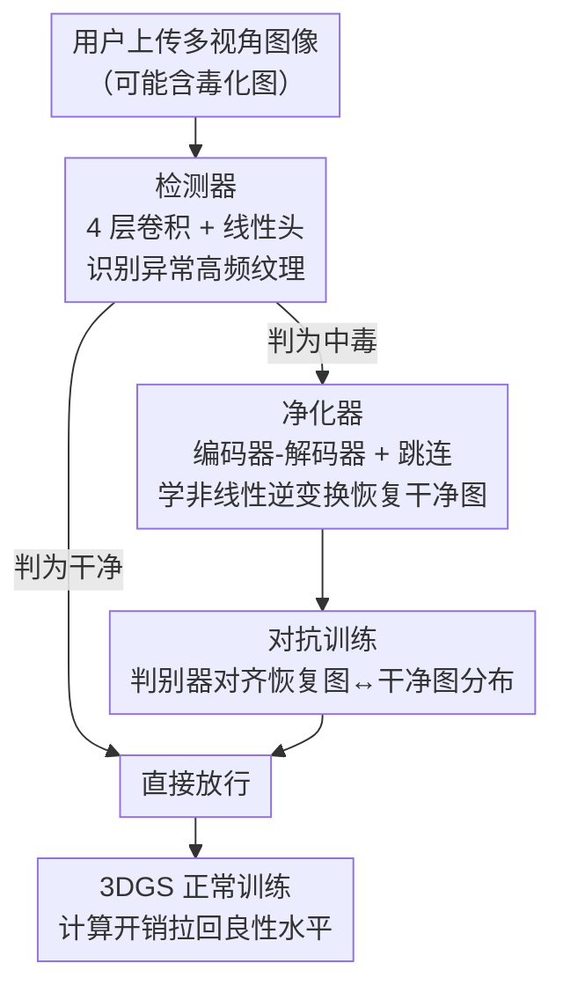

# RemedyGS: Defend 3D Gaussian Splatting Against Computation Cost Attacks

**会议**: CVPR 2026  
**论文**: [CVF Open Access](https://openaccess.thecvf.com/content/CVPR2026/html/Li_RemedyGS_Defend_3D_Gaussian_Splatting_Against_Computation_Cost_Attacks_CVPR_2026_paper.html)  
**代码**: https://github.com/Polly-LYP/RemedyGS  
**领域**: AI安全  
**关键词**: 3D 高斯泼溅, 计算开销攻击, DoS 防御, 图像净化, 对抗训练

## 一句话总结
RemedyGS 提出首个针对 3DGS"计算开销攻击"（Poison-splat 这类通过毒化输入图像触发高斯爆炸、耗尽 GPU 资源造成拒绝服务的攻击）的黑盒防御框架，用"检测器+净化器+对抗训练"两阶段流水线，只对被判定为中毒的图做净化，从而把计算开销拉回正常水平的同时几乎不损伤正常用户的重建质量。

## 研究背景与动机

**领域现状**：3DGS 凭借显式高斯建模带来的高效率与高保真，已被 Spline、KIRI、Polycam 等公司做成"上传图片即重建 3D 场景"的大规模付费服务。它的高质量靠自适应密度控制：训练中往欠重建区域不断加新高斯、剪掉低贡献高斯直到收敛。

**现有痛点**：这套密度控制机制正是攻击面。Poison-splat 揭示了一个严重漏洞——攻击者伪装成正常用户上传"毒化图像"，通过增大图像的总变差（Total Variance, TV）分数来"锐化"物体，间接迫使 3DGS 分配远超必要的高斯数量，从而暴涨 GPU 显存、训练时长与渲染延迟，最终把系统拖垮、造成拒绝服务（DoS）。论文示例里，毒化输入能让显存从 11GB 飙到 47GB、训练时间从 24 分钟翻到 48 分钟。

**核心矛盾**：已有的朴素防御都在"安全 vs 效用"上做了糟糕的权衡。图像平滑（高斯/双边滤波）是线性滤波，压不住攻击者引入的复杂非线性纹理，还会无差别地把所有用户的图都模糊掉、最高掉 10 dB 质量；限制高斯数量则牺牲了复杂场景的表达力。根本原因是这些方法**无法区分干净图与中毒图、也无法区分原始纹理与注入噪声**，于是对所有用户统一降质。此外传统 DoS 防御多假设一个固定共享模型，而 3DGS 要为每个场景重新训练，根本不兼容。

**本文目标**：设计一个既能挡住攻击、又不牺牲正常用户重建质量的防御。拆成两点：(i) 只对中毒图动手、放过干净图；(ii) 对中毒图要做能逆转复杂非线性攻击变换的高保真恢复。

**切入角度**：攻击为了最大化 TV 分数，必然给中毒图注入不自然的高频噪声与更强的边缘结构——这种异常纹理本身就是可被检测的"签名"。同时，攻击变换虽复杂，但可以用数据驱动的神经网络去学它的非线性逆变换。

**核心 idea**：用一个检测器把中毒图筛出来（保护正常用户的效用），再用一个可学习的净化器把中毒图恢复成干净图（去除毒性、避免触发高斯爆炸），并用对抗训练让恢复图的分布对齐真实干净图分布以提升感知质量。

## 方法详解

### 整体框架
RemedyGS 是一个黑盒防御框架，部署在 3DGS 服务的输入端：服务器收到用户上传的多视角图像后，先逐张过检测器判断"中毒 or 干净"；只有被判为中毒的图才送进净化器恢复，干净图直接放行进入正常 3DGS 训练。净化器是一个编码器-解码器，配合对抗训练（判别器）让输出分布贴近真实干净图。这种"选择性处理"是关键——它避免了朴素方法对所有图无差别降质的弊病。

### 关键设计

**1. 检测器：只对中毒图动手，守住正常用户的效用**

这是整套防御"不伤及无辜"的关键。如果对所有输入一律净化，会带来无谓的计算开销，还可能误改干净图、降低其重建质量。作者观察到：攻击为最大化 TV 分数会给中毒图引入不自然的高频噪声与更明显的边缘结构，这些异常纹理就是可靠的检测签名。检测器实现为四层堆叠的 2D 卷积加一个线性分类头——卷积天然擅长捕捉局部纹理特征，正适合把中毒图的不自然噪声和正常纹理区分开。它用带标签的中毒/干净图数据集 $D_{det}=\{(V^{poi},1)\cup(V^{cln},0)\}$ 训练，损失为交叉熵 $\mathcal{L}_{det}=\frac{1}{|D_{det}|}\sum_i \text{CE}(y_i, f_{det}(V_i;\omega))$。只有被它标为中毒的图才进净化器，干净图保持原样，从而对正常用户做到"几乎等同 vanilla 3DGS"的效用。

**2. 净化器：学攻击的非线性逆变换，把中毒图恢复成干净图**

净化器要同时满足两点：彻底去除毒性纹理（避免触发计算开销攻击）、且恢复内容尽量贴近原图（最小化降质）。朴素的图像平滑做不到——它只是线性滤波，逆不了复杂攻击。作者设计了一个对称的编码器-解码器：编码器 $f_\phi$ 学着识别并剔除攻击者注入的毒性纹理、逐步提取原始图像特征，解码器 $g_\theta$ 再重建出净化图 $V^{rec}=g_\theta(f_\phi(V^{poi}))$；编解码间用跳连保留细节。训练目标从信息论出发——希望恢复图 $V^{rec}$ 尽可能保留干净图 $V^{cln}$ 的信息，即最大化互信息 $\max_{\phi,\theta} I(V^{cln};V^{rec})$。直接优化互信息不可解，作者用 Barber-Agakov 变分下界 $I(V^{cln};V^{rec})\geq H(V^{cln})+\mathbb{E}[\log q(V^{cln}|V^{rec})]$，并假设变分分布 $q(V^{cln}|V^{rec})\sim\mathcal{N}(V^{rec},\sigma^2 I)$，化简后由于 $\sigma$ 和 $H(V^{cln})$ 都是常数，最大化互信息等价于最小化重建误差：

$$\mathcal{L}_{pur} = \min_{\phi,\theta}\ \mathbb{E}_{p_{cln}}\mathbb{E}_{p_A}\ \|V^{cln}-g_\theta(f_\phi(V^{poi}))\|_2^2$$

这把"恢复尽量多原始信息"这个抽象目标，落成了一个干净的 MSE 训练准则。

**3. 对抗训练：用判别器对齐分布，治净化器的"过度模糊"**

光用 MSE 训练的卷积网络有个通病——输出过度平滑、丢细节，恢复图常有模糊区域，反过来损害重建。为此作者引入对抗训练：判别器 $F$ 被训来区分"来自真实干净分布 $p_{cln}$"和"来自恢复分布 $p_{rec}$"的图，给净化器提供把输出推向真实分布的反馈。为增强判别力，作者还把净化器编码器提取的干净图与净化图的潜在表征作为条件信息 $c$ 喂给判别器（沿通道维拼接）。判别器目标 $\mathcal{L}_F=\min_F -\mathbb{E}_{p_{cln}}\log F(V|c)-\mathbb{E}_{p_{rec}}\log(1-F(V|c))$，最优判别器满足 $F^*(V|c)=\frac{p_{cln}(V)}{p_{cln}(V)+p_{rec}(V)}$；在此最优判别器下，净化器被迫生成与真实图无法区分的样本，当且仅当 $p_{rec}=p_{cln}$ 时对抗目标取到极值，理论上保证了恢复分布与干净分布的对齐。净化器与判别器交替更新，最终净化器实测加入的整体目标为 $\mathcal{L}'_{pur}=\alpha_1\mathcal{L}_{MSE}+\alpha_2\mathcal{L}_{LPIPS}+\alpha_3\mathcal{L}_G$（MSE + LPIPS + 对抗损失加权）。

### 损失函数 / 训练策略
检测器用交叉熵单独训练。净化器主目标是互信息下界推出的 MSE $\mathcal{L}_{pur}$，加入对抗框架后实际优化 $\mathcal{L}'_{pur}=\alpha_1\mathcal{L}_{MSE}+\alpha_2\mathcal{L}_{LPIPS}+\alpha_3\mathcal{L}_G$。训练数据基于 DL3DV 数据集采样 320 个场景、对每个施加计算开销攻击，生成约 100 万对干净/中毒图。净化器与判别器交替更新。

## 实验关键数据

### 主实验
在 NeRF-Synthetic（NS）、Mip-NeRF360（MIP）、Tanks-and-Temples（TT）三个基准上评测，攻击用 Poison-splat 白盒实现、受害者用 vanilla 3DGS。安全性看高斯数量/峰值 GPU 显存，效用看 PSNR/LPIPS/SSIM。下表摘录各数据集均值（与两个朴素防御基线对比）：

| 数据集均值 | 指标 | 干净(GT) | 中毒(无防御) | 图像平滑 | 限制高斯 | RemedyGS |
|------|------|---------|------------|---------|---------|----------|
| MIP-Avg | 高斯数(M)↓ | 3.179 | 7.037 | 1.700 | 3.766 | **2.496** |
| MIP-Avg | 峰值显存(MB)↓ | 12136 | 23961 | 9083 | 13237 | **10630** |
| MIP-Avg | PSNR↑ | 27.520 | 24.704 | 26.446 | 22.570 | **27.310** |
| TT-Avg | PSNR↑ | 24.256 | 22.937 | 23.284 | 22.098 | **24.073** |
| NS-Avg | PSNR↑ | 33.866 | 30.785 | 30.029 | 30.767 | **33.070** |

可见中毒让高斯数和显存翻倍（如 MIP 显存 12136→23961 MB）；图像平滑虽能压显存却把质量打到 22.57 dB（限制高斯）这类"过度防御"区间，而 RemedyGS 把计算开销拉回接近良性水平的同时，PSNR 几乎追平干净基线（MIP 27.31 vs GT 27.52）。论文称相比朴素基线最高提升 PSNR 4 dB、SSIM 0.24。

### 消融实验
净化器架构与组件消融（NS-chair / NS-ficus / MIP-room，看 PSNR）：

| 配置 | NS-chair | NS-ficus | MIP-room | 说明 |
|------|----------|----------|----------|------|
| CNN（无跳连） | 30.964 | 32.995 | 30.577 | 朴素编解码 |
| + Concatenate（拼接跳连） | 31.331 | 33.982 | 30.418 | 拼接式跳连 |
| + Add（加性跳连） | 33.868 | 35.028 | 30.997 | 加性跳连，大涨 |
| + Add + Adv.（完整） | **34.261** | **35.483** | **31.112** | 再加对抗训练 |

检测器单独评测（Table 3）准确率很高：NS 全集 0.9737、MIP 全集 0.9936、TT 全集 0.9400（Accuracy/F1/Recall 基本一致）。

### 关键发现
- **加性跳连是净化器效用的主要来源**：从拼接跳连换成加性跳连，NS-chair PSNR 从 31.33 直接跳到 33.87，说明把编码器提取的良性细粒度特征"加"进解码器，比拼接更能保住细节。
- **对抗训练专治模糊、再补一刀**：在加性跳连基础上加对抗训练，三场景再涨约 0.1–0.4 dB，印证它解决的是 MSE 导致的过度平滑问题。
- **检测器让"对干净图零伤害"成立**：Table 4 显示在干净数据上，图像平滑会把 NS-chair 打到 27.08 dB（无差别降质），而 RemedyGS 凭检测器放行干净图，PSNR 维持 35.776——与 vanilla 3DGS 完全一致。这正是"选择性处理"相对统一平滑的核心优势。

## 亮点与洞察
- **首个面向 3DGS-as-a-service 的 DoS 防御**：以往 DoS 防御假设固定共享模型，不兼容"每场景重训"的 3DGS；RemedyGS 是系统无关的黑盒方案，填补了这一空白，且同时挡白盒/黑盒/自适应攻击。
- **"检测+净化"两阶段把安全与效用解耦**：检测器负责"该不该处理"、净化器负责"怎么处理好"，靠检测器放行干净图，避免了朴素平滑对全体用户无差别降质的死结——这是它在效用上完胜基线的根因。
- **用互信息下界给净化器一个有原则的目标**：把"恢复尽量多原始信息"经 Barber-Agakov 下界化简为可优化的 MSE，再用对抗训练补感知质量，理论与工程衔接得很干净，这套"信息论目标+对抗细化"的组合可迁移到其他图像净化/逆问题任务。

## 局限与展望
- 净化器与检测器的泛化绑定在训练攻击（Poison-splat）的分布上——面对结构差异较大的新型计算开销攻击，检测签名与净化逆变换是否仍奏效有待观察（⚠️ 黑盒/自适应攻击结果论文放在补充材料，正文未充分展开）。
- 训练成本不低：需基于 DL3DV 生成约 100 万对干净/中毒图来训练两个网络，迁移到新数据域可能要重训。
- 净化本质是图像级恢复，对极强攻击下被严重破坏的细节，恢复仍有上限（部分场景 RemedyGS 略低于干净 GT，如 TT-Francis 27.57 vs GT 28.18）。
- 检测器在 TT 上准确率 0.94 低于另两个基准——真实户外复杂场景里漏检/误检的代价（漏检→攻击触发；误检→干净图被净化降质）值得进一步分析。

## 相关工作与启发
- **vs 图像平滑（基线）**：平滑是线性滤波、对所有图无差别处理，逆不了非线性攻击且把干净图也模糊（NS-chair 干净图掉到 27.08 dB）；RemedyGS 用可学习净化器逆非线性变换、且靠检测器只处理中毒图，干净图零损伤。
- **vs 限制高斯数量（基线）**：硬上限虽能压计算开销，但锐化区域会抢占其他区域的高斯预算、造成明显效用损失（MIP-bonsai 掉到 24.97 dB）；RemedyGS 从输入端去毒，不动 3DGS 训练机制本身。
- **vs 传统 DoS / 对抗训练防御**：它们多依赖固定共享模型、需特制损失，和 3DGS"每场景重训"不兼容；RemedyGS 把防御做在输入预处理层，系统无关、即插即用。
- **vs Poison-splat（被防御的攻击）**：Poison-splat 在白盒、强攻击者假设下通过最大化 TV 分数触发高斯爆炸；RemedyGS 正是利用"最大化 TV 必然留下异常高频签名"这一点来检测，并学其逆变换来净化。

## 评分
- 新颖性: ⭐⭐⭐⭐⭐ 首个 3DGS 计算开销攻击防御框架，"检测+净化+对抗"组合切中安全-效用权衡的要害
- 实验充分度: ⭐⭐⭐⭐ 三基准、安全与效用双维度、检测器与架构消融齐全；但黑盒/自适应攻击放补充材料、正文偏白盒
- 写作质量: ⭐⭐⭐⭐ 攻击机理与防御动机讲得透彻，互信息推导清晰
- 价值: ⭐⭐⭐⭐ 对 3DGS 商业服务的可靠部署有直接现实意义，方法范式可迁移

<!-- RELATED:START -->

## 相关论文

- [\[CVPR 2026\] Good Can Sometimes be Bad: A Unified Attack against 3D Point Cloud Classifier by a Flexible Isotropic Resampling](good_can_sometimes_be_bad_a_unified_attack_against_3d_point_cloud_classifier_by_.md)
- [\[CVPR 2026\] AntiStyler: Defending Object Detection Models Against Adversarial Patch Attacks Using Style Removal](antistyler_defending_object_detection_models_against_adversarial_patch_attacks_u.md)
- [\[CVPR 2026\] Computation and Communication Efficient Federated Unlearning via On-server Gradient Conflict Mitigation and Expression](computation_and_communication_efficient_federated_unlearning_via_on-server_gradi.md)
- [\[CVPR 2026\] PoInit-of-View: Poisoning Initialization of Views Transfers Across Multiple 3D Reconstruction Systems](poinit-of-view_poisoning_initialization_of_views_transfers_across_multiple_3d_re.md)
- [\[ICLR 2026\] Robust Spiking Neural Networks Against Adversarial Attacks](../../ICLR2026/ai_safety/robust_spiking_neural_networks_against_adversarial_attacks.md)

<!-- RELATED:END -->
