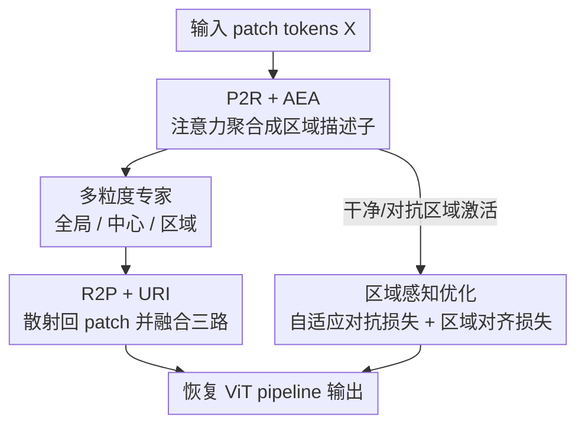

# ReMoE: Region-Mixture Experts for Adversarially-Robust Vision Transformers

**会议**: CVPR 2026  
**论文**: [CVF Open Access](https://openaccess.thecvf.com/content/CVPR2026/html/Zhong_ReMoE_Region-Mixture_Experts_for_Adversarially-Robust_Vision_Transformers_CVPR_2026_paper.html)  
**代码**: https://github.com/zhongskr0114/ReMoE  
**领域**: AI安全 / 对抗鲁棒性 / Vision Transformer  
**关键词**: 对抗鲁棒性, 混合专家(MoE), 区域级建模, ViT, 注意力路由

## 一句话总结
ReMoE 把 ViT 里普通的 FFN 换成一个"区域感知的混合专家层"——用全局/中心/区域三种粒度的专家配上注意力引导的路由，并在对抗训练里按区域脆弱度重加权、对齐干净/对抗样本的区域注意力分布，从而在几乎不增加算力的前提下显著提升 ViT 的对抗鲁棒性。

## 研究背景与动机

**领域现状**：ViT 已是视觉任务的主流骨干，但对对抗扰动极其脆弱。提升鲁棒性最有效的手段仍是对抗训练（AT，min-max 优化）。随着骨干从有局部性先验的 CNN 转向靠全局自注意力的 ViT，社区开始把"架构设计 + 对抗训练"结合起来，出现了位置感知调制、边缘增强、注意力/投影层谱约束等鲁棒 ViT 变体。

**现有痛点**：对抗扰动天然是**局部且空间结构化**的（往往集中在少数关键 patch 上），但 ViT 的两个核心组件恰好和这种结构错配——全局耦合的自注意力会把局部污染迅速扩散到整张图，造成注意力漂移甚至语义崩塌；而空间上均匀处理的 FFN 既不区分被污染 patch 与干净 patch，也无法在扰动后稳住局部语义。结果是：少数关键 patch 上的扰动就能先破坏区域语义、再触发全局性能下降。

**核心矛盾**：现有鲁棒 ViT 大多在做"全局表征稳定性"或"架构正则化"，**唯独忽略了缺乏显式区域级语义建模带来的内在局部脆弱性**。换句话说，鲁棒性应该在"语义连贯的区域"这个粒度上被约束，而不是在单个 token 或整图全局这两个极端上。

**本文目标**：把显式的区域级建模注入 ViT，并在区域粒度上正则化鲁棒性——既要约束局部污染经自注意力的传播、强化区域内一致性，又要跨层稳住区域语义。

**切入角度**：作者借用 MoE 的思路，但跳出"token 级独立路由"（V-MoE、DyViT 等都把 token 当作互相独立的路由单元）。他们主张**以区域为中心的鲁棒性视角**：把图像分解成语义连贯的区域，让不同粒度的专家分工协作、按区域而非按 token 来激活。

**核心 idea**：用一个即插即用的 **Region-aware MoE（ReMoE）替换 ViT block 里的 FFN**——多粒度专家（全局/中心/区域）+ 注意力引导的 P2R/R2P 路由，配合按区域脆弱度重加权的对抗优化策略，给鲁棒 ViT 一个更强的归纳偏置。

## 方法详解

### 整体框架
ReMoE 做两件事：① 在架构上，把 ViT block 里标准 FFN 替换成一个区域感知专家层，让专家激活变得"空间感知 + 区域一致"；② 在优化上，把对抗训练目标分解到区域层面，按区域脆弱度动态重加权，并对齐干净/对抗输入的区域注意力分布。一个前向流程是：输入 patch token 序列 $X\in\mathbb{R}^{N\times D}$，先经 **P2R** 把 patch 级特征/注意力聚合成区域描述子，喂给门控网络得到区域级路由；**多粒度专家**（全局/中心/区域）各自处理自己负责的 token；再经 **R2P** 把专家输出按原始空间位置散射回 patch，由 URI 模块融合三路输出，恢复标准 ViT pipeline。训练时再叠加两个区域级损失。ReMoE 默认插在第 6 和第 10 个 Transformer 层。

### 关键设计

**1. P2R 与注意力专家激活（AEA）：用自注意力把 patch 聚合成"会评估区域重要性"的描述子**

普通 MoE 的门控只看 token 的全局打分，既不稳定也忽视局部区域的空间一致性。ReMoE 的第一步是让路由"看得见区域"：给定 patch token 序列 $X\in\mathbb{R}^{N\times D}$，AEA 模块先从自注意力输出里导出 token 级显著度分数，再在每个预定义区域内聚合，得到该区域的显著度 $r_k$，并直接用作第 $k$ 个区域专家的激活权重，最终给出一组区域级激活权重 $W=[w_1,\dots,w_K]=\text{AEA}(X)\in\mathbb{R}^{K\times1}$。这一步正是 **Patch-to-Region（P2R）** 变换的具体实例——把 patch 级特征/注意力压缩成编码"区域语义重要性"的区域描述子，再送进门控网络做路由决策。它的妙处在于：路由信号直接来自注意力，被攻击时哪些区域显著度异常波动，路由就能感知到，从而把激活集中到真正关键的区域上，而不是对每个 token 各自为政。

**2. 多粒度专家 + 注意力引导路由：用全局/中心/区域三种专家做互补分解**

均匀的 FFN 没法区分被污染和干净的 patch。ReMoE 把空间网格切成 $K$ 个局部区域和一个中心区域，配三类专家：全局专家 $f_{\text{global}}$ 聚合整图上下文、对全部 token 给出 $Y_{\text{global}}\in\mathbb{R}^{N\times D}$；中心专家 $f_{\text{center}}$ 专注中心区域（常含语义/诊断上最显著的内容），只处理 $X_{\text{center}}$；$K$ 个区域专家 $f_{\text{region}}^{(k)}$ 各自负责一个空间分区。三者构成对图像的互补分解，既建模区域语义又保留全局一致性。路由上，门控网络用 P2R 汇总出的区域分数，对每个区域以 top-k 策略分配专家，得到**按区域而非按 token**确定的专家指派——这正是它比 V-MoE/DyViT 这类 token 级路由更"空间一致"的根源：同一区域内的 patch 会被一致地路由，局部污染不容易把路由打乱。

**3. R2P 与统一区域整合（URI）：把专家输出按原位散射回 patch 并加权融合**

专家各自处理完区域表征后，必须映射回 patch token 才能续上标准 ViT 流程。**Region-to-Patch（R2P）** 负责这个回填：每个区域专家产出的特征按其局部索引集 $R_k$ 直接散射回全局位置 $Z_{\text{region}}[i]=Y_{\text{region}}^{(k)}[j]$（$i\in R_k$）；中心专家只在中心区域 $R_c$ 上有输出、其余位置置零。全局专家则覆盖全部 token 得到完整特征图。R2P 对齐后，URI 模块按下式融合三路：

$$Z = Z_{\text{global}} + \lambda_1\cdot Z_{\text{center}} + \lambda_2\cdot W\odot Z_{\text{region}}$$

其中 $\lambda_1,\lambda_2$ 是平衡系数，$W=\text{AEA}(X)$ 提供注意力驱动的区域权重，每个 $w_k$ 在逐元素运算 $\odot$ 时被广播到第 $k$ 区域的所有 token。这样区域专家的贡献是被"区域重要性"调制的——越关键的区域，其专家输出在融合里权重越大，等于把模型的容量自适应地倾斜到脆弱/显著的区域上。

**4. 区域感知优化：按区域脆弱度重加权对抗损失 + 对齐干净/对抗的区域注意力**

光改架构还不够，作者把对抗训练目标也下放到区域层面，提出两个损失。其一是 **区域自适应对抗损失**：对一对干净/对抗样本 $(X,X')$，先算各自的区域激活 $\mathbf{w}_{\text{clean}}=\text{AEA}(X)$、$\mathbf{w}_{\text{adv}}=\text{AEA}(X')$，再用两者差异定义自适应因子 $\gamma=\exp\!\big(-\tfrac{\text{dist}(\mathbf{w}_{\text{clean}},\mathbf{w}_{\text{adv}})}{\max_{\mathcal{B}}\text{dist}+\varepsilon_\gamma}\big)$（mini-batch 内归一化，$\varepsilon_\gamma=10^{-6}$），把它归一化成干净项权重 $\tilde\beta=\tfrac{\beta\gamma}{\beta\gamma+(1-\beta)}$，于是单样本损失为 $\mathcal{L}_{\text{rob}}=\tilde\beta\,\mathcal{L}(f_\theta(X),y)+(1-\tilde\beta)\,\mathcal{L}(f_\theta(X'),y)$。直观上，干净/对抗区域激活差得越大（区域越脆弱），$\gamma$ 越小、$\tilde\beta$ 越小，就越偏向对抗样本那一项——把训练注意力压到最容易被攻破的区域上。

其二是 **区域对齐损失**，用角距离度量两套区域激活的方向一致性：$d_{\text{ang}}(X,X')=\arccos\!\big(\tfrac{\langle\mathbf{w}_{\text{clean}},\mathbf{w}_{\text{adv}}\rangle}{\|\mathbf{w}_{\text{clean}}\|_2\|\mathbf{w}_{\text{adv}}\|_2}\big)$，再做对数变换稳定优化：$\mathcal{L}_{\text{align}}=-\log\!\big(1-\tfrac{d_{\text{ang}}}{\pi}+\varepsilon_{\text{align}}\big)$。它逼着模型在干净与对抗输入下保持一致的区域激活分布，避免攻击把注意力"挪走"。总目标为

$$\mathcal{L}_{\text{total}}=\mathbb{E}_{(X,X',y)\sim\mathcal{D}}\big[\mathcal{L}_{\text{rob}}(X,X',y)+\lambda_{\text{align}}\cdot\mathcal{L}_{\text{align}}(X,X')\big].$$

### 损失函数 / 训练策略
训练遵循标准对抗鲁棒协议：自然训练（NAT）、PGD 对抗训练（SAT）和 TRADES（$\beta=6$）。CIFAR-10/100、Imagenette 训 50 epoch（前 2 epoch warm-up），初始 lr=0.1 按里程碑衰减；$\ell_\infty$ 扰动 $\epsilon=8/255$、步长 $\alpha=2/255$。ImageNet 训 10 epoch、lr=0.01、用更弱的 $\epsilon=4/255$。patch size 在 CIFAR 上设 4、ImageNet/Imagenette 上设 16。ReMoE 默认插在第 6、10 层。

## 实验关键数据

### 主实验
评估覆盖 CIFAR-10/100、Imagenette、ImageNet 四个基准，骨干用 ViT-S、DeiT-S、DeiT-T，攻击含 FGSM、PGD-10/20/100、C&W-20 和 AutoAttack（AA）。

下表为 CIFAR-10/100 上与鲁棒 ViT 方法的对比（DeiT-S 骨干，准确率 %）：

| 方法 | CIFAR-10 Nat | CIFAR-10 PGD-20 | CIFAR-10 AA | CIFAR-100 PGD-20 | CIFAR-100 AA |
|------|------|------|------|------|------|
| SAT (ICLR'18) | 79.84 | 48.00 | 44.90 | 24.86 | 21.53 |
| TRADES (ICML'19) | 78.70 | 48.56 | 46.25 | 27.24 | 23.38 |
| ReiT (CVPR'24) | 86.22 | 52.02 | 47.31 | 28.36 | 24.89 |
| PIAT (TIFS'25) | 82.30 | 52.10 | 45.98 | 28.26 | 24.44 |
| **ReMoE (ours)** | **86.58** | **53.54** | **50.16** | **30.18** | **26.82** |

ReMoE 在干净精度和强攻击（PGD/AA）下都领先，且 AA 上对 SAT 提升超 5 个点（CIFAR-10 44.90→50.16）。

跨骨干/训练方案的泛化（Table 2 节选，CIFAR-10 PGD-20 / AA）：

| 骨干 | 方法 | PGD-20 | AA |
|------|------|------|------|
| ViT-S | SAT | 50.73 | 47.65 |
| ViT-S | +ReMoE | 52.20 | 49.03 |
| DeiT-T | SAT | 47.71 | 44.90 |
| DeiT-T | +ReMoE | 52.44 | 48.93 |

无论 ViT-S 还是 DeiT-T、SAT 还是 TRADES，ReMoE 都稳定提升对应 baseline；在 ImageNet 上 ViT-S+ReMoE 把 AA 从 21.24 提到 23.67，展现对更大规模数据的可扩展性。此外在 One-Pixel/对抗补丁/遮挡补丁等非标准攻击下，ReMoE 比 SAT 在 CIFAR-10 上提升 2–9%、ImageNet 上最高约 7.8%。

### 消融实验
专家类型与区域损失（DeiT-T，CIFAR-10，Table 4）：

| 配置 | Nat | PGD-20 | C&W-20 | AA | 说明 |
|------|------|------|------|------|------|
| SAT (无 ReMoE) | 79.84 | 47.90 | 47.22 | 44.90 | 基线 |
| w/o 区域专家 REs | 80.95 | 50.82 | 48.49 | 46.78 | 去区域专家，鲁棒掉最多 |
| w/o 中心专家 CE | 80.36 | 51.09 | 48.73 | 46.91 | 中心区域语义受损 |
| w/o 全局专家 GE | 80.36 | 51.30 | 49.10 | 47.19 | 干净精度与表征受影响 |
| w/o $\mathcal{L}_{\text{rob}}$ | 82.47 | 51.68 | 49.91 | 46.88 | 去区域加权对抗训练 |
| w/o $\mathcal{L}_{\text{align}}$ | 84.21 | 50.32 | 48.47 | 47.19 | 区域激活不稳，干净精度反高 |
| **ReMoE (full)** | 83.52 | **52.65** | **50.94** | **48.93** | 完整模型 |

门控策略对比（DeiT-T，CIFAR-10，Table 5）：

| 门控 | Nat | PGD-20 | AA | FLOPs/Params |
|------|------|------|------|------|
| Uniform | 80.17 | 50.79 | 46.73 | 0.35G / 5.63M |
| MLP | 80.73 | 50.99 | 46.84 | 0.37G / 5.66M |
| **AEA (ours)** | **83.52** | **52.65** | **48.93** | 0.37G / 5.63M |

### 关键发现
- **区域专家贡献最大**：去掉区域专家（w/o REs）后 PGD-20 与 AA 掉得最多，说明捕捉"局部脆弱性"主要靠它；中心专家影响干净+鲁棒两端，全局专家更关乎整体表征与干净精度。三类专家互补缺一不可。
- **两个区域损失各司其职**：去掉 $\mathcal{L}_{\text{rob}}$ 鲁棒全面下降；去掉 $\mathcal{L}_{\text{align}}$ 区域激活不稳、干净精度反而虚高（84.21）但 PGD/C&W 鲁棒下滑，印证对齐损失是在"用一点干净精度换稳定的区域注意力"。
- **AEA 路由几乎零开销**：相比 Uniform/MLP 门控，AEA 在参数量不增（5.63M）、FLOPs 仅 0.37G 的情况下取得最好的鲁棒-效率折中，证明区域感知路由的收益不是靠堆算力。
- **插入位置（6,10）最优**：消融插入层（Block 0/6/10/(6,10)）显示插在第 6 与第 10 层组合效果最佳；区域分数熵的分析也表明扰动越强、ReMoE 维持的区域激活分布越稳定。

## 亮点与洞察
- **把"对抗扰动是局部结构化的"这个观察直接翻译成架构归纳偏置**：不在 token 或全图两个极端上做文章，而是引入"区域"这个中间粒度，让 MoE 的专家分工天然对齐扰动的空间结构——这是最让人"啊哈"的地方。
- **MoE 路由信号取自自注意力（AEA），而非另学一个门控**：复用了 ViT 本就有的注意力图来判断区域重要性，既省参数又让路由对攻击敏感，是个可复用的轻量 trick。
- **架构与优化双管齐下且互相呼应**：同一套区域激活 $W=\text{AEA}(X)$ 既用于 URI 融合加权、又用于对抗损失重加权和注意力对齐，三处共享同一信号，设计自洽度高。
- **即插即用**：ReMoE 只替换 FFN，可嵌入不同 ViT 变体与不同对抗训练方案（SAT/TRADES），迁移成本低，适合作为鲁棒训练的通用插件。

## 局限与展望
- **区域划分是预定义的固定网格**：区域 $R_k$ 和中心区域 $R_c$ 按空间网格切分，假定语义显著内容常在中心。这对中心物体的分类数据集成立，但对物体偏离中心、多目标或密集场景可能不理想，自适应/可学习的区域划分会更通用。
- **超参数偏多**：$\lambda_1,\lambda_2,\beta,\lambda_{\text{align}}$、专家数 $K$、插入层位置等都需调，论文给了默认值但跨数据集的敏感性分析有限。
- **评测规模偏中小**：主要在 CIFAR/Imagenette/小 ImageNet 设置、轻量骨干（ViT-S/DeiT-S/T）上验证，ImageNet 仅训 10 epoch、用更弱 $\epsilon$；更大模型、更长训练、更强自适应攻击下的表现仍有待验证。
- **横向比较的 caveat**：不同方法的干净精度差异较大，AA 这类强攻击的提升更有说服力，但单看某一列百分比不宜直接跨设置比大小。

## 相关工作与启发
- **vs 标准/架构正则化鲁棒 ViT（SAT、TRADES、ReiT、PIAT 等）**：它们主攻全局表征稳定或架构正则，ReMoE 补上了被忽略的"区域级语义建模"这一维，在强攻击下优势更明显。
- **vs token 级 MoE（V-MoE、DyViT）**：这些方法把 token 当独立路由单元、主要为效率/容量服务；ReMoE 在区域粒度路由并以鲁棒性为目标，强调区域内一致性而非 token 独立性。
- **vs TORA-ViT / ReiT 这类显式调 accuracy-robustness trade-off 的方法**：ReMoE 不靠额外 adapter/随机化，而是用专家分解 + 区域加权对抗损失，在干净精度和鲁棒之间取得更好平衡，且额外算力极小。

## 评分
- 新颖性: ⭐⭐⭐⭐ "区域为中心"的鲁棒性视角 + 注意力引导的区域级 MoE 路由，把扰动的空间结构转成归纳偏置，角度新颖。
- 实验充分度: ⭐⭐⭐⭐ 四数据集、三骨干、多攻击 + 非标准攻击 + 专家/损失/门控/插入位置全套消融，较扎实；大模型与更强自适应攻击稍欠。
- 写作质量: ⭐⭐⭐⭐ 动机—痛点—方法逻辑清晰，公式与图配合到位，符号略多但可读。
- 价值: ⭐⭐⭐⭐ 即插即用、几乎零开销且对多种 AT 兼容，实用性强，安全敏感场景有迁移价值。

<!-- RELATED:START -->

## 相关论文

- [\[CVPR 2026\] Towards Robust Vision Transformers: Path Dependency Analysis and a Simple Two-Stage Adversarial Training](towards_robust_vision_transformers_path_dependency_analysis_and_a_simple_two-sta.md)
- [\[CVPR 2026\] Hierarchically Robust Zero-shot Vision-language Models](hierarchically_robust_zero-shot_vision-language_models.md)
- [\[ICCV 2025\] FedVLA: Federated Vision-Language-Action Learning with Dual Gating Mixture-of-Experts for Robotic Manipulation](../../ICCV2025/ai_safety/fedvla_federated_vision-language-action_learning_with_dual_gating_mixture-of-exp.md)
- [\[ICML 2026\] MetaMoE: Diversity-Aware Proxy Selection for Privacy-Preserving Mixture-of-Experts Unification](../../ICML2026/ai_safety/metamoe_diversity-aware_proxy_selection_for_privacy-preserving_mixture-of-expert.md)
- [\[CVPR 2026\] TTP: Test-Time Padding for Adversarial Detection and Robust Adaptation on Vision-Language Models](ttp_test-time_padding_for_adversarial_detection_and_robust_adaptation_on_vision-.md)

<!-- RELATED:END -->
