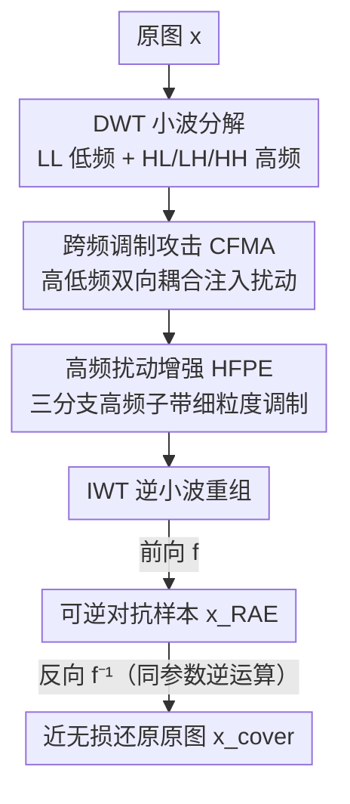

# RevINN: An End-to-End Invertible Neural Network for Reversible Adversarial Examples Generation

**会议**: CVPR 2026  
**论文**: [CVF Open Access](https://openaccess.thecvf.com/content/CVPR2026/html/Huang_RevINN_An_End-to-End_Invertible_Neural_Network_for_Reversible_Adversarial_Examples_CVPR_2026_paper.html)  
**代码**: https://github.com/WongJaylen/RevINN  
**领域**: AI 安全 / 可逆对抗样本 / 图像隐私保护  
**关键词**: 可逆对抗样本, 可逆神经网络, 小波域攻击, 频率调制, 图像 IP 保护

## 一句话总结
RevINN 用一个可逆神经网络（INN）在小波频域里"交换/扰乱"图像自身的高低频判别信息来一步生成可逆对抗样本（RAE），既能误导未授权模型、又能由授权用户近无损还原原图，彻底甩掉了传统"先攻击、再嵌入扰动"两阶段方案带来的画质和攻击力双重退化。

## 研究背景与动机

**领域现状**：可逆对抗样本（Reversible Adversarial Examples, RAE）是一种图像版权/隐私保护机制——把图片变成对抗样本，让爬数据训模型的未授权 DNN 分类出错，同时持密钥的授权用户能把它还原成原图正常用。现有 RAE 几乎全是**两阶段**：第一步用 FGSM / CW / I-FGSM 等攻击算法生成普通对抗样本（AE）及其扰动，第二步再用可逆数据隐藏（RDH）或一个 DNN 把扰动信息可逆地"藏"回 AE 里得到 RAE。

**现有痛点**：第一阶段精心优化出来的 AE 已经在"语义被改"和"视觉不可感知"之间达到了平衡，第二阶段往里硬塞扰动数据会引入额外噪声、打乱已有的扰动分布和视觉结构。结果就是论文 Fig.1 展示的现象：所有两阶段方法的最终 RAE 相比其原始 AE，在视觉质量（PSNR）和攻击成功率（ASR）上**都不同程度下滑**，越是难的定向攻击掉得越狠。

**核心矛盾**：作者一针见血地指出，两阶段之所以必须"再嵌入一步"，根因是——AE 是靠**外部代理模型**的梯度算出来的，扰动信息来自模型而非图像本身，所以 AE 里**不含足够线索去反推出加进去的扰动**，不额外存一份扰动就没法还原。

**本文目标**：能不能设计一个**一阶段**范式，直接从图像的**内在信息**生成 RAE？由于全程不引入外部信息，图像理应可以被某种方式直接还原，从而省掉那个伤画质的嵌入步骤。

**切入角度**：最朴素的想法是基于"攻击前后不变的图像特征"（如颜色分布、结构形状）构造扰动，但这种扰动是静态的、攻击力弱。作者转而借鉴 INN（可逆神经网络）的强表达力与双射映射特性，在图像不同**频率子带**之间做动态调制，生成跨频率的自适应扰动。

**核心 idea**：用 INN 的双射性，在小波域里让图像自身的高频/低频判别信息**互相交换、互相扰动**——一次前向就是攻击（得到 RAE），对应的反向就是还原（得到原图），二者共享同一套参数，无需任何额外嵌入。

## 方法详解

### 整体框架
RevINN 把整个 RAE 生成建模成一个可逆变换函数 $f(\cdot)$：给定分类器 $C(\cdot)$、原图 $x$ 及其标签 $y$，目标是生成 $x_{RAE}=f(x)$ 使 $C(x_{RAE})\neq y$，并让还原版 $x_{cover}=f^{-1}(x_{RAE})$ 满足 $C(x_{cover})=y$。由于 $f$ 与 $f^{-1}$ 共享同一参数 $\theta$，只需优化 $f$ 即可同时得到 RAE 和它的还原版，不像 GAN 那样要解 minimax 博弈。

前向流程是：原图先经离散小波变换（DWT）分解为 1 个低频子带 LL（记 $x_{LL}$）和 3 个高频子带 HL/LH/HH（合起来记 $x_{HC}\in\mathbb{R}^{3C\times H/2\times W/2}$）；接着 **CFMA** 在低频与高频两大分量间做粗粒度的双向交叉调制注入扰动；调制后的高频分量再送入 **HFPE**，在三个高频子带内部做细粒度调制，让高频语义充分偏离原图；最后把改过的高低频分量经逆小波变换（IWT）重组成 RAE。反向过程就是把前向逐步逆回去，授权用户即可近无损重建原图——两个过程共享网络参数、联合更新。

### 关键设计

**1. CFMA 跨频调制攻击：在高低频之间双向"挪"判别信息，一步产生对抗性**

两阶段方法的扰动来自外部代理模型，所以非藏不可。CFMA 反其道而行——扰动信息**只从图像自身的不同频率分量里取**，通过可逆耦合在低频 $x_{LL}$ 和高频 $x_{HC}$ 之间建立双向调制：

$$x_{LL}^1 = x_{LL} + \sigma(x_{HC}), \qquad x_{HC}^1 = x_{HC}\cdot\exp\!\big(\alpha(\mu(x_{LL}^1))\big) + \omega(x_{LL}^1)$$

其中 $\alpha(\cdot)$ 是乘了常数因子的 sigmoid，$\sigma,\mu,\omega$ 都是密集连接卷积块参数化的变换函数；$\exp(\alpha(\mu(x_{LL}^1)))$ 当作对高频的缩放因子、$\omega(x_{LL}^1)$ 当作加性扰动，对高频做"缩放+平移"式的对抗调制；同时低频也吸收来自高频的扰动。值得注意的是从高频到低频**只保留了一条加性桥**（即低频只做加法不做缩放）：因为一旦高频被充分融合出与原图不同的语义，低频只需一个小的加性偏移就够实现对抗，而不缩放低频能最大限度保住视觉质量。这套耦合天然可逆——反向时先 $x_{HC}=(x_{HC}^1-\omega(x_{LL}^1))\div\exp(\alpha(\mu(x_{LL}^1)))$，再 $x_{LL}=x_{LL}^1-\sigma(x_{HC})$ 即可精确逆回，这正是"无需额外嵌入也能还原"的根基。

**2. HFPE 高频扰动增强：用三分支耦合细抠三个高频子带，把攻击力打满**

CFMA 把高频整体当成一个分支做粗粒度交互，但高频子带承载了关键语义细节，粗粒度调制可能攻击力不足。HFPE 把传统耦合层的**两分支结构破天荒扩成三分支**，正好对应 LH/HL/HH 三个高频子带做细粒度调制：先以 $x_{HH}^1$ 为指导，把对应的缩放因子和扰动施加到 $x_{LH}^1$、$x_{HL}^1$ 上；反过来这两个调制后的分量再共同作用于 $x_{HH}^1$：

$$x_{LH}^2 = x_{LH}^1\cdot\exp(\alpha(\psi(x_{HH}^1)))+\varphi(x_{HH}^1)$$
$$x_{HL}^2 = x_{HL}^1\cdot\exp(\alpha(\pi(x_{HH}^1)))+\delta(x_{HH}^1)$$
$$x_{HH}^2 = x_{HH}^1\cdot\exp(\alpha(\rho(x_{concat})))+\eta(x_{concat})$$

其中 $x_{concat}$ 是 $x_{HL}^2$ 与 $x_{LH}^2$ 的拼接。相比常规两分支耦合，这种三分支让高频子带之间形成更细粒度的信息交互，确保 RAE 的语义内容被实质性改写——消融显示去掉 HFPE 后正是靠它撑起的视觉质量与攻击力会一起垮。HFPE 同样保留了严格的逆运算（公式 6），保证整条链路全程可逆。

**3. 自交互式信息交换：攻击力源自"图像跟自己换信息"，而非外部目标图**

作者在机制层面把 CFMA/HFPE 抽象成统一的信息交换算子：以两分支为例，输出可写成 $x_1'=x_1-\tau+\gamma$、$x_2'=x_2+\tau-\gamma$，其中 $\tau$ 是从 $x_1'$ 丢弃的已有信息、$\gamma$ 是从 $x_2$ 注入的信息。已有工作证明"往良性图里加判别信息"和"从中丢判别信息"都能造成有效攻击，所以在不同频带间交换判别信息同样可行。与前人最大的不同在于：RevINN 交换的判别信息**全部来自图像自身**（经密集卷积块变换），而非外部目标类图像或代理模型——这就是它能做到一阶段、又能直接逆向还原的本质原因。

### 损失函数 / 训练策略
总损失 $\mathcal{L}=\lambda_1\mathcal{L}_{freq}+\lambda_2\mathcal{L}_{adv}+\lambda_3\mathcal{L}_{rev}$，权重经验设为 $1.0, 3.0, 1.0$：

- **低频小波损失** $\mathcal{L}_{freq}=\ell_{MSE}\big(\mathcal{T}(x_{RAE})_{LL},\,\mathcal{T}(x)_{LL}\big)$：传统 RAE 用 $\ell_p$ 范数约束图像域扰动强度，但 RevINN 的目标恰恰是扰乱频域内在信息，图像域 $\ell_p$ 不合适；由于低频近似整图，约束 RAE 与原图的低频一致，就能逼迫信息交换主要发生在高频，从而守住视觉质量。
- **对抗损失** $\mathcal{L}_{adv}=\ell_{CE}(C(x_{cover}),y)+\ell_{CE}(C(x_{RAE}),y_{tgt})$：让 RAE 偏离真类（定向时趋向目标类 $y_{tgt}$），同时让还原版仍判为真类 $y$。
- **可逆损失** $\mathcal{L}_{rev}=\ell_{MSE}(x_{cover},x)$：保证还原图与原图视觉上几乎一致。

优化用 Adam，初始学习率 $1\text{e-}4$，每 200 次迭代衰减 0.9 至下限 $1\text{e-}5$；对抗预算 $\epsilon$ 默认 $2/255$。

## 实验关键数据

数据集为 ImageNet-1K 随机选取的 1000 张 224×224 图像；攻击模型涵盖 VGG19 / ResNet50 / DenseNet121 / AlexNet / Inception-v3；对比 RAE-RDH、RIT、RAE-YUV、B-RAE、DP-RAE、SRAE、W-RAE 等方案。

### 攻击成功率（ASR %，节选）

| 设置 | 模型 | RAE-YUV | W-RAE | RevINN(Ours) |
|------|------|---------|-------|--------------|
| 非定向 | DenseNet121 | 96.2 | 90.7 | **98.3** |
| 非定向 | AlexNet | 93.3 | 88.9 | **94.0** |
| 定向 | ResNet50 | 69.8 | 65.2 | **81.6** |
| 定向 | DenseNet121 | 75.3 | 78.8 | **90.2** |

定向攻击优势尤其明显：RevINN 在 DenseNet121 上拿到 90.2% ASR，比其他方法至少高 10%——因为定向 AE 对额外数据嵌入更敏感，两阶段方法在 AE→RAE 转换时掉得更狠，而一阶段设计天然规避了这一退化。

### 视觉质量与还原质量（非定向，全模型均值）

| 方法 | RAE/原图 SSIM↑ | RAE/原图 PSNR↑ | RAE/原图 LPIPS↓ | 还原/原图 PSNR↑ |
|------|---------------|---------------|----------------|----------------|
| RAE-YUV | 0.977 | 41.63 | 0.081 | ∞（无损） |
| W-RAE | 0.971 | 40.02 | 0.063 | 44.70 |
| RevINN(Ours) | **0.992** | **46.39** | **0.018** | **58.94** |

RevINN 的 RAE 平均 PSNR 达 46.39dB，比次优高出 6dB 以上，LPIPS 逼近 0；还原 PSNR 高达 58.94dB，虽不像 RDH 类方法那样数学严格无损，但凭 CFMA/HFPE 的双射近乎无损。

### 消融实验（Table 3，ResNet50 等均值）

| CFMA | HFPE | ASR | RAE PSNR↑ | RAE LPIPS↓ |
|------|------|-----|-----------|-----------|
| ✗ | ✓ | 90.5 | 46.86 | 0.018 |
| ✓ | ✗ | 91.2 | 43.44 | 0.022 |
| ✓ | ✓ | **94.4** | 46.51 | **0.018** |

### 关键发现
- **CFMA 主攻"攻击力＋低频画质"，HFPE 主攻"高频画质"**：去掉 CFMA，RAE 保住画质但攻击力下滑、可用性受损；去掉 HFPE，攻击只靠高低频交换、RAE 画质明显变差（PSNR 46.86→43.44）。两者互补，全模型才最优。
- **扰动预算 $\epsilon$ 与还原质量正相关**：$\epsilon$ 从 1/255 升到 8/255，ASR 由 83.6% 升到 97.2%；有趣的是更大扰动反而让还原 PSNR 升高（54.91→63.04）。作者解释为 INN 理论可逆但实现因数值精度/网络容量存在轻微不完美逆，扰动较强时激活更显著、逆过程更稳定，这也解释了为何双射重建不是逐像素完全等同。
- **鲁棒性强**：面对翻转/缩放/中心裁剪/JPEG 压缩等图像处理及位深削减防御，RevINN 攻击效果保持得比 RAE-YUV 好；2-bit 位深下 RAE-YUV 的 ASR 跌破 15%，RevINN 仍维持 23%。
- **自监督场景可迁移**：把对抗损失里的交叉熵换成特征余弦相似度后，在 Barlow/DINO/BYOL 上对比 RAEncoder，RevINN 攻击力略低但视觉质量大幅领先（PSNR ~49 vs 37，LPIPS 0.017 vs 0.155），更难被察觉。

## 亮点与洞察
- **把"为什么必须两阶段"的根因挖到了底**：作者指出两阶段的本质症结是 AE 的扰动来自外部代理模型、图内无线索可还原，从而必须额外嵌入。一旦让扰动**源自图像自身**，可逆性就免费送，整套两阶段范式自然坍缩成一阶段。这是全文最"啊哈"的洞见。
- **INN 的双射性被用在了刀刃上**：以往把 INN 当"可逆隐藏模块"塞扰动，本文则用它直接做跨频带的可逆信息交换，让"攻击"和"还原"成了同一函数的正反两面，省掉嵌入步骤还顺手避开了 GAN 的 minimax 训练。
- **三分支耦合层是个可复用的小创新**：传统耦合层是两分支，本文为三个高频子带量身改成三分支细粒度调制，这种"按数据自然结构定制耦合分支数"的思路可迁移到任何多子带/多通道的可逆建模任务。
- **频域损失替代图像域 $\ell_p$ 很聪明**：既然目标是扰乱频域信息，约束就应放在低频而非图像域，用低频 MSE 把扰动"逼"进高频，是守画质和保攻击力之间一个干净的解耦。

## 局限与展望
- **非数学无损还原**：RevINN 与 DP-RAE/SRAE/W-RAE 一样属于有损还原（还原 PSNR 58.94dB 而非 ∞），在对像素级完整性要求极严的场景不如 RDH 类方案；作者自己也分析了数值精度导致逆不完美。
- **自监督场景攻击力反被超越**：在 Barlow/BYOL 上 ASR 略低于专门攻 SSL 的 RAEncoder，说明"自交互式频域扰动"对通用万能扰动型攻击仍有差距。
- **仅白盒/已知模型评估**：主实验都在直接可访问的目标模型上做，作者把黑盒与迁移攻击列为未来工作——这恰恰是真实"防数据被爬"场景最需要的设定，当前结论的实用性需打个问号。
- **鲁棒性是相对而非绝对**：位深削减到 2-bit 时 ASR 仅 23%，虽强于基线但攻击效果已大幅衰减，面对激进预处理防御未必稳。

## 相关工作与启发
- **vs 两阶段 RDH 类（RAE-RDH / RIT / RAE-YUV / B-RAE）**：它们靠可逆数据隐藏严格无损还原，但受隐藏容量限制、且二阶段嵌入伤画质伤攻击力；RevINN 一阶段直接生成，画质/攻击力全面领先，代价是还原非数学无损。
- **vs 两阶段 DNN 嵌入类（SRAE / W-RAE）**：同样把"生成扰动"和"可逆嵌入"解耦成两步，RevINN 把二者合一，PSNR 高出 6dB+、LPIPS 更低。
- **vs 其他 INN-对抗工作**：Chen et al. 用 INN 做不可感知攻击但忽略其双射性、且靠目标类图像；Huang et al. 用 INN 但仍只当可逆嵌入模块、困在两阶段；Zhao et al. 做人脸保护但依赖额外外部扰动优化。RevINN 是第一个真正用 INN 双射性实现**跨频带可逆信息交换、一阶段直生 RAE** 的工作。

## 评分
- 新颖性: ⭐⭐⭐⭐⭐ 把 RAE 从两阶段范式重构成一阶段 INN 频域信息交换，根因分析+解法都很扎实，是该子方向第一个统一端到端网络。
- 实验充分度: ⭐⭐⭐⭐ 覆盖非定向/定向/自监督三场景、5 个模型、画质+攻击+还原+鲁棒性多维度，消融清晰；但缺黑盒/迁移设定，略减一星。
- 写作质量: ⭐⭐⭐⭐ 动机推导层层递进、机制抽象（信息交换算子）讲得透；公式排版在 CVF 文本里略乱但论文本身条理清楚。
- 价值: ⭐⭐⭐⭐ 图像 IP/隐私保护是有现实需求的方向，一阶段范式有明显工程价值；离真实黑盒防爬场景还差一步。

<!-- RELATED:START -->

## 相关论文

- [\[CVPR 2026\] Verifying Neural Network Robustness with Dual Perturbations](verifying_neural_network_robustness_with_dual_perturbations.md)
- [\[CVPR 2026\] MaxMark: High-Capacity Diffusion-Native Watermarking via Robust and Invertible Latent Embedding](maxmark_high-capacity_diffusion-native_watermarking_via_robust_and_invertible_la.md)
- [\[CVPR 2026\] DASH: A Meta-Attack Framework for Synthesizing Effective and Stealthy Adversarial Examples](dash_a_meta-attack_framework_for_synthesizing_effective_and_stealthy_adversarial.md)
- [\[CVPR 2026\] CamPI: Physical Adversarial Examples through Camera Power Signal Injection](campi_physical_adversarial_examples_through_camera_power_signal_injection.md)
- [\[CVPR 2026\] AdvFM: Lookahead Flow-Matching Velocity-Field Attacks for Imperceptible and Transferable Adversarial Examples](advfm_lookahead_flow-matching_velocity-field_attacks_for_imperceptible_and_trans.md)

<!-- RELATED:END -->
