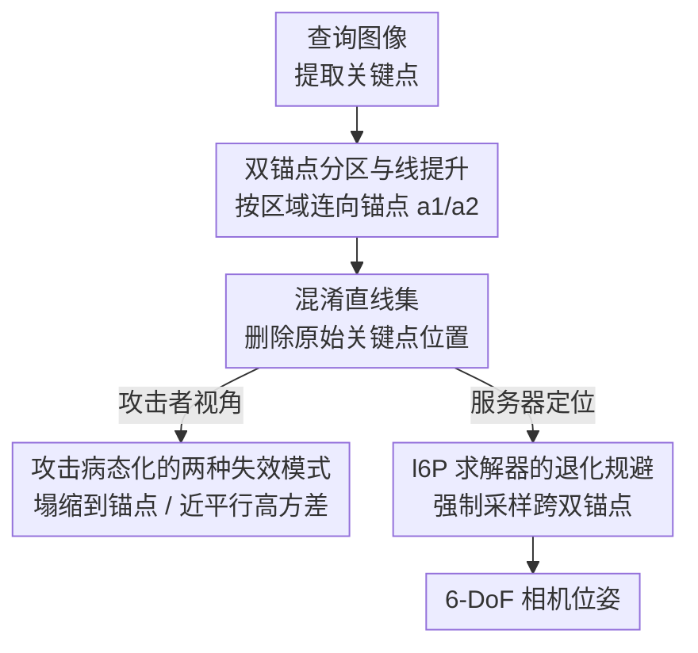

# Revisiting Geometric Obfuscation with Dual Convergent Lines for Privacy-Preserving Image Queries in Visual Localization

**会议**: CVPR 2026  
**arXiv**: [2604.22310](https://arxiv.org/abs/2604.22310)  
**代码**: 无  
**领域**: 隐私保护 / 视觉定位 / 几何混淆  
**关键词**: 隐私保护图像查询, 视觉定位, 几何混淆, 关键点恢复攻击, 双汇聚直线

## 一句话总结
针对"把关键点替换成随机直线"的几何混淆会被邻域几何恢复攻击破解的问题，本文提出 Dual Convergent Lines（DCL）：把每个关键点提升到一条连向两个固定锚点之一的直线，让攻击者的点恢复优化变成病态问题（要么塌缩到锚点、要么在分界处近平行而高方差发散），在保持与 l6P 求解器兼容、可实时定位的同时，成为目前唯一能抵御该攻击的几何混淆方案。

## 研究背景与动机
**领域现状**：云端视觉定位（Visual Localization）让客户端把"图像查询"（原图或提取的局部特征）发给服务器估计 6-DoF 相机位姿，省去本地存大规模 3D 地图和重计算。但原图甚至局部特征都能被反演（Inversion attack，InvSfM [39]）重建出高保真 RGB 图像，于是出现了 Privacy-Preserving Image Queries（PPIQ）这一研究方向。主流有两条路线：① 几何混淆——把 2D 关键点位置藏起来（如 Random Lines [51] 把每个点替换成一条过该点的随机方向直线、Coordinate Permutation [34]）；② 描述子/语义混淆——用语义图当描述子，细节少、难直接反演。

**现有痛点**：两条路线都被新一代攻击攻破了。几何混淆这边，Chelani 等 [6] 的**邻域几何恢复攻击**通过描述子学习找出每个混淆直线的邻居，再最小化"待恢复点到邻居直线的距离平方和"，就能把原始关键点位置近似找回来（Eq. 3）；语义混淆那边，扩散模型 [37] 能从高层语义表示重建出细节图像。两路都重新暴露隐私。

**核心矛盾**：几何混淆失守的**根本原因**在于——以往的随机直线在空间上是**均匀分布**的，混淆后的邻居直线**仍然把原始点的位置包围在中间**。只要邻居越多、越均匀地环绕原点，攻击者最小化距离平方和得到的解 $\mathbf{x}_i^*$ 就越收敛到真值 $\mathbf{x}_i$。也就是说"邻居仍在原点附近"这个假设，正是攻击成立的命门。

**本文目标**：在保留几何混淆"客户端开销小、与传统定位管线兼容、地图维护友好、可扩展、求解快"这些优点的前提下，设计一种**故意让恢复攻击失效**的直线混淆方式。

**切入角度**：既然攻击依赖"邻居均匀环绕原点"，那就**主动破坏这种均匀环绕的几何**，让恢复优化变成病态（ill-posed）问题——使估计出来的点严重偏离真值。最简单的极端是让所有直线交于一点（解必塌缩到交点），但这会让位姿求解退化；于是退而求其次用**两个锚点**。

**核心 idea**：用"双锚点 + 按区域指派的直线提升"代替随机方向直线——每个关键点连向它所在区域对应的固定锚点，使邻居直线要么汇聚到同一锚点（平凡解）、要么在分界处近平行（高方差不稳定解），两种结果都让攻击者恢复不到真实位置。

## 方法详解

### 整体框架
DCL 要解决的是"如何把关键点混淆成直线、既能让定位求解器正常工作、又能让邻域恢复攻击拿不到原点"。整体管线是：从查询图像提取关键点（SuperPoint [12] / SIFT [25]）→ 把图像按一条中线划成两个区域、在中线两端放两个固定锚点 → 每个关键点连向它所在区域指派的锚点、生成混淆直线、删除原始关键点位置 → 客户端只把这些直线（及描述子）发给服务器 → 服务器用 l6P 最小求解器（加退化规避）在 RANSAC 内估计 6-DoF 位姿。

对攻击者而言，由于直线不再均匀环绕原点，而是**全部指向两个锚点**，邻域几何恢复攻击 [6] 的核心假设被打破，落入两种失效模式而恢复失败。三处贡献——双锚点构造、攻击病态化的理论分析、求解器退化规避——分别保证了"藏得住、攻不破、还能用"。

### 关键设计

**1. 双锚点分区与线提升：把"随机方向"换成"指向固定锚点"**

这是 DCL 的核心构造，直接针对"邻居均匀环绕原点"这一攻击命门。具体做法：先把图像空间按一条中线（默认竖直中线 $u=W/2$）切成两个不相交区域 $\mathcal{R}_1=\{(u,v)\mid 0<u<W/2\}$ 与 $\mathcal{R}_2=\{(u,v)\mid W/2<u<W\}$；再在图像中线两端放两个**固定**锚点 $\mathbf{a}_1=(W/2,0)$、$\mathbf{a}_2=(W/2,H)$（$W,H$ 为图宽高），每个区域指派一个锚点。对任意关键点 $\mathbf{x}_i=(u_i,v_i)$，其混淆直线 $\mathbf{l}_i$ 取连接该点与所在区域锚点的直线：

$$\mathbf{l}_i=\begin{cases}\text{line}(\mathbf{x}_i,\mathbf{a}_1)&\text{if }\mathbf{x}_i\in\mathcal{R}_1\\\text{line}(\mathbf{x}_i,\mathbf{a}_2)&\text{if }\mathbf{x}_i\in\mathcal{R}_2\end{cases}$$

最后删除原始关键点位置，只保留直线。与 Random Lines [51] 给每个点配一条**随机方向**直线不同，DCL 让所有直线都**强制指向两个锚点之一**——这就保证了邻居直线要么交于同一锚点、要么在分界附近近平行，从根上破坏了"均匀环绕"。注意分区方式不限于竖直中线（水平、对角都行），竖直中线只是为了让关键点分布更均衡、减少"所有点落进同一区域"的退化风险。这一设计也与 RayCloud [28] 的双锚点提升有本质区别：[28] 用 K-means 定锚点、随机指派 3D 点，邻居直线仍贴近原点、依旧能被 [6] 攻破；DCL 的锚点位置是**策略性优化过的**，才能诱导出病态优化。

**2. 攻击病态化的两种失效模式：从理论上证明恢复必然失败**

这一设计解释"为什么换成双锚点就攻不破"。攻击 [6] 要解的是沿直线 $\mathbf{l}_i$ 找点 $\mathbf{x}_i^*=\arg\min_{\hat{\mathbf{x}}_i\in\mathbf{l}_i} f(\hat{\mathbf{x}}_i)$，其中 $f(\hat{\mathbf{x}}_i)=\sum_{\mathbf{l}_j\in\mathcal{N}(\mathbf{l}_i)}d(\mathbf{l}_j,\hat{\mathbf{x}}_i)^2$。本文证明即便攻击者**完美识别了邻居**，DCL 也会落入两种不可避免的失效模式：

- **模式 1（锚内汇聚，intra-anchor convergence）**：当 $\mathbf{x}_i$ 在 $\mathcal{R}_1$ 内、远离分界，它的所有邻居直线都源自同一锚点 $\mathbf{a}_1$，于是这些直线全部相交于 $\mathbf{a}_1$，代价函数 $f$ 在 $\hat{\mathbf{x}}_i=\mathbf{a}_1$ 处取得全局最小值 0。优化必然收敛到锚点 $\mathbf{a}_1$——一个离真值很远的**平凡解**。

- **模式 2（锚间失稳，inter-anchor instability）**：当 $\mathbf{x}_i$ 靠近分界，其真实邻居可能落在对侧区域 $\mathcal{R}_2$，这些直线虽不会平凡塌缩，却因为两侧直线分别指向 $\mathbf{a}_1$、$\mathbf{a}_2$ 而在分界处**近平行**。本文给出 Proposition 1：此时恢复参数 $t_i^*$ 是各邻居与目标线交点参数 $t_{i,j}^*$ 的加权平均 $t_i^*=\frac{\sum_j w_{i,j}t_{i,j}^*}{\sum_j w_{i,j}}$；Corollary 1.1 进一步给出权重 $w_{i,j}=\|\mathbf{v}_i\times\mathbf{v}_j\|^2=\sin^2(\theta_{i,j})$，只由目标线与邻居线的夹角 $\theta_{i,j}$ 决定。当两线近平行时 $\theta_{i,j}\to 0$，权重 $w_{i,j}\to 0$ 而交点参数 $t_{i,j}^*$ 急剧增大，加权平均变得**数值不稳定、对噪声和关键点分布高度敏感**，恢复出的点高方差地飞到远处（合成实验中 1500 个点里只有 8 个误差 <30 像素）。两种模式合起来，确保攻击在任何位置都恢复不到真值。

**3. l6P 求解器的退化规避：让混淆直线仍能稳定定位**

双锚点带来一个副作用：定位求解会退化。DCL 仍是 2D 直线，可沿用 l6P 最小求解器——它用约束 $\mathbf{n}_i^\top(\mathbf{R}\mathbf{X}_i+\mathbf{t})=0$（$\mathbf{n}_i$ 是直线 $\mathbf{l}_i$ 反投影成 3D 平面 $\Pi_i$ 的法向量），把 6 个约束拆成两组，需要先求 $\mathbf{t}=\mathbf{N}_1^{-1}\mathbf{f}_1(\mathbf{R})$ 再解 $\mathbf{R}$。问题在于：RANSAC 采样时约有 $2\times0.5^3=0.25$ 的概率抽到 3 条**过同一锚点**的直线，此时它们反投影的 3D 平面交于一条过光心和锚点的公共射线，所有法向量都落入同一 2D 子空间，使 $\mathbf{N}_1=[\mathbf{n}_1,\mathbf{n}_2,\mathbf{n}_3]^\top$ 秩亏、不可逆（$\det(\mathbf{N}_1)=0$），求解在 Eq. (8) 处崩溃。

本文的规避办法很轻量：强制最小集**包含来自两个锚点的直线**（如两条来自 $\mathbf{a}_1$、一条来自 $\mathbf{a}_2$）。实现上只需检查 3 条采样直线两两交点是否重合（重合即退化），就能保证至少有一个法向量不落在另外两个的 2D 子空间里，打破共面性、让法向量张成完整 3D 空间，$\mathbf{N}_1$ 满秩、l6P 正常求解。这一步让 DCL 既抗攻击又能实时定位，是它能落地传统管线的关键。

### 损失函数 / 训练策略
DCL 是纯几何构造与求解策略，**不涉及任何训练或损失函数**。定位管线沿用 SuperPoint [12] 特征 + 图像检索 [1,52] 取候选库图 + 描述子最近邻（NN）建立 2D-3D 匹配（不用依赖关键点位置的 SuperGlue，以免泄露位置）+ l6P 最小求解器（PoseLib [22] 内 Lo-RANSAC [8]）+ Levenberg-Marquardt 精修。攻击侧实验沿用 [6] 设置：每个关键点用 20 个邻居混淆、并假设完美识别邻居以模拟最坏情况上界。

## 实验关键数据

**自定义指标说明**：$e_{recon}$（mean geometric error of recovered points，单位像素，↑ 越大越好）衡量攻击恢复出的关键点与真实位置的平均几何误差，**越大说明攻击恢复越差、隐私保护越好**；图像反演质量用 PSNR(↓)、SSIM(↓)、LPIPS(↑) 衡量，低 PSNR/SSIM、高 LPIPS 代表反演出的图像越糟、隐私越安全。

### 主实验：抗隐私攻击（Table 2）
| 数据集 | 指标 | Random Lines [51] | Coord. Perm. [34] | DCL (ours) |
|--------|------|------|------|------|
| 7Scenes | $e_{recon}$ (↑) | 6.137 | 10.56 | **330.4** |
| 7Scenes | PSNR (↓) | 13.899 | 13.358 | **7.040** |
| 7Scenes | LPIPS (↑) | 0.604 | 0.643 | **0.754** |
| Cambridge | $e_{recon}$ (↑) | 6.386 | 11.81 | **800.2** |
| Cambridge | PSNR (↓) | 14.991 | 14.309 | **6.746** |
| Cambridge | LPIPS (↑) | 0.517 | 0.558 | **0.740** |
| Aachen | $e_{recon}$ (↑) | 5.381 | 9.855 | **713.0** |
| Aachen | PSNR (↓) | 15.386 | 14.281 | **7.021** |
| Aachen | LPIPS (↑) | 0.476 | 0.539 | **0.736** |

DCL 在三个数据集上恢复误差 $e_{recon}$ 比对手高出 1-2 个数量级（如 Cambridge 800.2 vs 6.4），反演图像 PSNR 直接掉到 7 左右（人眼基本不可辨认），全面碾压 Random Lines 和 Coordinate Permutation。

### 定位性能（Table 3/5，节选）
| 数据集 | 方法 | P.V. | 中位位置误差 | 实时性 |
|--------|------|------|------|------|
| Cambridge·King's | Random Lines [51] | 易受攻击 ✓ | 11cm | ✓ |
| Cambridge·King's | GSFF Privacy [35] | 安全 | 24cm | ✗(慢) |
| Cambridge·King's | DCL (ours) | **安全 ✗** | 25cm | ✓ |
| 7Scenes·Chess | Random Lines [51] | 易受攻击 ✓ | 0.5cm | ✓ |
| 7Scenes·Chess | DGC-GNN [54] | 安全 | 3cm | ✓ |
| 7Scenes·Chess | DCL (ours) | **安全 ✗** | 1.0cm | ✓ |

DCL 是表中**唯一同时满足"抗近期攻击 + 实时"**的方法：7Scenes 上约 4ms、Cambridge 上约 6ms 推理，而语义法 GSFF Privacy 在 Cambridge 慢到 45 秒。定位精度优于 descriptor-free 方法（GoMatch/DGC-GNN），略逊于语义混淆法（SegLoc/GSFF），但后者要么被扩散攻击攻破、要么慢得不实用。大规模 Aachen 上 DCL 召回低于 HLoc/Random Lines，但仍优于 ACE/GLACE 等近期学习法。

### 消融实验（Table 6：锚点距离）
| 锚点距离 | 7Scenes (位置/旋转) | Cambridge (位置/旋转) | 说明 |
|------|------|------|------|
| $H$（默认） | 5.14 / 1.41 | **22.50 / 0.50** | 默认锚点最优 |
| $2H$ | 5.14 / 1.42 | 27.75 / 0.73 | 距离拉大、精度下降 |
| $3H$ | 6.66 / 1.37 | 32.50 / 0.75 | 进一步变差 |

### 关键发现
- **锚点距离越大、混淆直线越平行，位姿估计越差**：默认 $\mathbf{a}_1=(W/2,0),\mathbf{a}_2=(W/2,H)$ 取得最佳定位精度，拉到 $2H$、$3H$ 后误差递增——这与抗攻击靠"近平行制造高方差"是一对 trade-off，锚点距离需要折中。
- **隐私提升幅度巨大**：恢复误差从个位数像素跳到数百像素，反演图像 PSNR 从 ~14 掉到 ~7，是质变而非量变。
- **退化情形极罕见**：所有关键点落入单一区域导致求解退化的情况，在 7Scenes 真实数据里仅 4/17000 张图出现。
- **抗服务器端攻击**：即便恶意服务器掌握位姿后的 2D-3D 对应、想反推私密内容（如行人这类 outlier），DCL 也让攻击只能累积误差、恢复不出有意义内容。

## 亮点与洞察
- **"把攻击逼成病态问题"是极漂亮的防御思路**：不去和攻击者比谁的网络强，而是从优化的数学性质入手，用双锚点几何让恢复优化要么有平凡全局极小（塌缩到锚点）、要么病态（近平行高方差），这种"釜底抽薪"式防御比对抗式扰动更稳。
- **权重公式 $w_{i,j}=\sin^2(\theta_{i,j})$ 一锤定音**：用一个简洁的夹角关系就解释清楚了"为什么近平行时恢复必然发散"，把隐私强度和几何角度直接挂钩，理论可读性极高。
- **与现有 l6P 求解器兼容、零训练**：纯几何构造意味着客户端开销极小、无需重训、能直接插进 HLoc 这类传统定位管线，落地门槛低；这也是它相比语义混淆法在地图维护、可扩展性、运行时上的全面优势。
- **退化规避只用"看交点是否重合"实现**：把一个看似棘手的秩亏问题用 O(1) 的几何检查解决，工程上很优雅，可迁移到任何基于线-点约束的最小求解场景。

## 局限与展望
- **作者承认的局限**：存在罕见退化情形——当查询图所有关键点都落入单一区域时（Sec. 4.3），最小集凑不齐双锚点直线、求解会退化。竖直中线已把这种风险降到极低（4/17000），未来计划用**基于结构（如建筑物）的自适应分区**进一步规避。
- **定位精度有代价**：在大规模 Aachen 上 DCL 召回明显低于 HLoc 和 Random Lines（如 0.25m/2° 阈值下 41.0% vs 79.9%），隐私安全是以一定定位精度损失换来的，户外大场景下这一损失不可忽视。
- **抗攻击范围依赖特定攻击模型**：方法是针对邻域几何恢复攻击 [6] 量身设计并理论证明的；面对未来可能出现的、不依赖"邻居距离最小化"假设的新型攻击（如直接学习锚点结构的攻击），鲁棒性需要重新验证。
- **指标对比存在难度差异 caveat**：不同数据集（室内 7Scenes vs 大规模室外 Aachen）定位难度差异大，跨数据集横向比召回/误差需谨慎。

## 相关工作与启发
- **vs Random Lines [51]**：都是几何混淆、都用 l6P 求解器，但 Random Lines 给每点配随机方向直线、邻居仍均匀环绕原点，被攻击 [6] 攻破；DCL 强制直线指向双锚点、破坏均匀环绕，是目前唯一抗 [6] 的几何法。定位精度上 DCL 略逊于 Random Lines（隐私换来的代价）。
- **vs Coordinate Permutation [34]**：[34] 随机配对关键点并置换坐标分量来混淆位置，同样保不住邻域结构、易被恢复；DCL 恢复误差高出一两个数量级。
- **vs RayCloud [28]**：同样用双锚点直线提升，但 [28] 靠 K-means 定锚点、随机指派 3D 点，邻居直线仍贴近原点而可被攻破；DCL 用策略性优化的固定锚点 + 按区域指派，才诱导出病态优化。
- **vs 语义/描述子混淆（SegLoc [36] / GSFF Privacy [35]）**：语义法藏细节但被扩散模型攻击 [37] 攻破，且定位慢（最高 45s）、不兼容传统管线、地图维护负担重；DCL 实时（数毫秒）、兼容传统管线、抗近期攻击，在隐私-效率-可用性三角上更均衡。

## 评分
- 新颖性: ⭐⭐⭐⭐⭐ 用"故意制造病态优化"的全新视角重审几何混淆，并给出严格理论分析，是目前唯一抗邻域恢复攻击的几何法。
- 实验充分度: ⭐⭐⭐⭐ 覆盖室内外三大基准、含合成验证与服务器端攻击，但缺真实代码开源、对新型攻击的鲁棒性未测。
- 写作质量: ⭐⭐⭐⭐⭐ 动机—失效模式—理论—求解退化层层递进，公式与图示配合清晰，逻辑闭环。
- 价值: ⭐⭐⭐⭐ 为隐私保护视觉定位提供了实用且可证明安全的几何方案，落地门槛低，但定位精度损失限制了大场景应用。

<!-- RELATED:START -->

## 相关论文

- [\[CVPR 2026\] VisiLock: Authorizing Instruction-based Image editing with Dual Score Distillation](visilock_authorizing_instruction-based_image_editing_with_dual_score_distillatio.md)
- [\[CVPR 2026\] Frequency-domain Manipulation for Face Obfuscation](frequency-domain_manipulation_for_face_obfuscation.md)
- [\[CVPR 2026\] ClusterMark: Towards Robust Watermarking for Autoregressive Image Generators with Visual Token Clustering](clustermark_towards_robust_watermarking_for_autoregressive_image_generators_with.md)
- [\[CVPR 2026\] PECCAVI: Overcoming the Brittleness of AI Image Watermarking Under Visual Paraphrasing Attacks](peccvai_overcoming_the_brittleness_of_ai_image_watermarking_under_visual_paraphr.md)
- [\[CVPR 2026\] RecoverMark: Robust Watermarking for Localization and Recovery of Manipulated Faces](recovermark_robust_watermarking_for_localization_and_recovery_of_manipulated_fac.md)

<!-- RELATED:END -->
