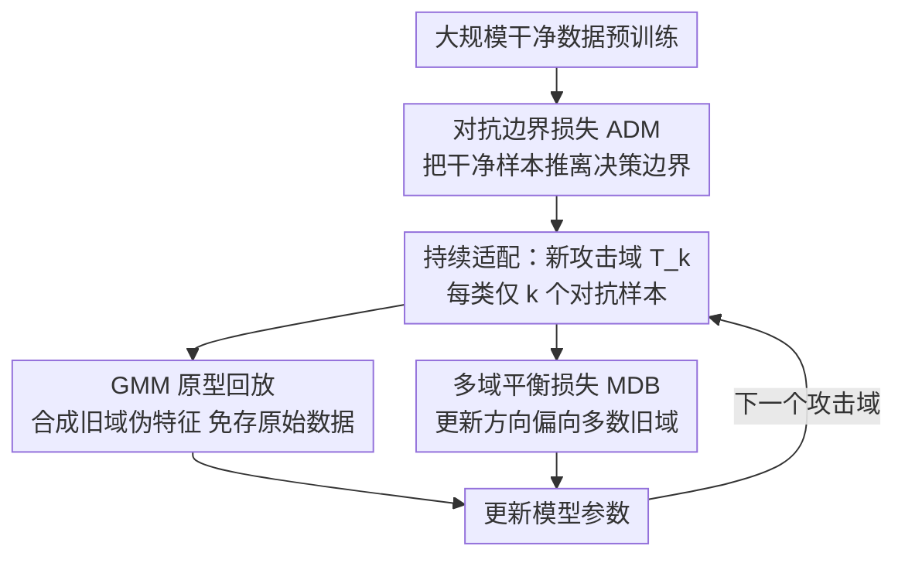

# Robustness Under Data Scarcity: Few-Shot Continual Adversarial Training for Evolving Threats

**会议**: CVPR 2026  
**论文**: [CVF Open Access](https://openaccess.thecvf.com/content/CVPR2026/html/Wang_Robustness_Under_Data_Scarcity_Few-Shot_Continual_Adversarial_Training_for_Evolving_CVPR_2026_paper.html)  
**代码**: https://github.com/aup520/FS_CAT  
**领域**: AI 安全 / 对抗鲁棒性 / 持续学习 / 小样本学习  
**关键词**: 对抗训练, 持续学习, 小样本, 灾难性遗忘, 对抗边界

## 一句话总结
现实中防守方往往只能拿到很少的对抗样本去应对不断涌现的新攻击，本文提出"小样本持续对抗训练（FS-CAT）"这一新设定，并用三件套——把干净样本推离决策边界的对抗边界损失（ADM）、用高斯混合模型合成伪特征做免存储回放的 GMM 原型回放、把更新方向拉向多数旧域的多域平衡损失（MDB）——在 ImageNet-1K 与 CIFAR-100 上同时缓解小样本下的鲁棒泛化困难与灾难性遗忘。

## 研究背景与动机

**领域现状**：对抗训练（把对抗样本喂进训练）是抵御对抗攻击最主流的防御。面对层出不穷的新攻击，近年出现了**持续对抗防御**——让模型不断从新攻击类型生成的对抗样本里学习，逐步增强鲁棒性。

**现有痛点**：现有持续对抗训练（CAT）几乎都默认**每个阶段都有充足的对抗数据**。但现实里，攻击方只需少量图片就能造出有效攻击，而防守方若要为每种新攻击重新生成大规模对抗数据集再微调，计算和时间代价巨大、根本不现实。

**核心矛盾**：当每个攻击阶段只有极少对抗样本时，会同时撞上两个难题——(1) **数据稀缺下的鲁棒泛化**：少量对抗数据严重削弱模型在扰动下兼顾高精度与强鲁棒的能力；(2) **加剧的遗忘**：每阶段数据少 → 知识保持稳定性差 → 学新攻击时严重遗忘旧攻击的鲁棒性，灾难性遗忘被放大。

**本文目标**：正式提出并解决 **Few-shot Continual Adversarial Training（FS-CAT）**——模型按序面对一串攻击域 $\{T_1,\dots,T_n\}$，每个域每类只有 $k$ 个对抗样本（k-shot），且不能回看旧域数据，要求在所有已见攻击 + 干净数据上都保持鲁棒与精度，还要泛化到未见攻击。

**切入角度**：作者抓住"对抗样本通常贴着决策边界"这一几何观察——既然如此，就在预训练时主动把干净样本推离边界、给对抗样本"腾地方"；同时用生成式手段在不存原始数据的前提下复活旧域知识；再在多域更新时压制任一单域主导。

**核心 idea**：用"边界扩张 + 分布感知伪特征回放 + 多域梯度平衡"三个机制，分别正面打击鲁棒泛化、遗忘、域间冲突这三件事。

## 方法详解

### 整体框架
FS-CAT 框架由三个核心组件构成，分别作用在持续学习管线的不同位置：**预训练阶段**用对抗边界损失（ADM）把干净样本推离决策边界，为后续泛化预留特征空间；进入**持续适配阶段**后，每来一个新攻击域只用少量对抗样本微调，靠 GMM 原型回放合成旧域伪特征来对抗遗忘、靠多域平衡损失（MDB）让参数更新偏向"对多数旧域都有利"的方向。三者合力，让模型在小样本持续对抗设定下同时具备鲁棒性、适应性与稳定性。

### 关键设计

**1. 对抗边界损失 ADM：在预训练就把干净样本推离决策边界，给对抗样本腾出安全裕度**

对抗样本通常贴着决策边界，小样本下模型本就难以在这些模糊区域可靠区分。ADM 的思路是在预训练阶段**主动最大化干净样本到最近决策边界的距离**。先定义分类裕度 $\phi_\theta^y(x) = z_\theta^y(x) - \max_{y'\neq y} z_\theta^{y'}(x)$，裕度越小说明样本越贴边界。损失取到最近边界点 $\hat{x}$ 的负距离 $L_{ADM}(x) = -\min_{\hat{x}} \|\hat{x}-x\|_p$ s.t. $\phi_\theta^y(\hat{x})=0$，即把它写成"在满足边界约束下最小化扰动范数"的约束优化，再用投影梯度迭代 $\delta_k = \text{Proj}_{\|\cdot\|_p\le\varepsilon_k}(\delta_{k-1} + \alpha_k \cdot g/\|g\|_2)$ 找最近边界点（$g$ 为交叉熵损失对扰动的负梯度方向）。这样在边界周围撑出足够裕度、为贴边界的对抗样本预留几何空间，从而提升后续阶段的鲁棒泛化。论文还以 Proposition 1 给出"鲁棒特征可分性保证"：ADM 约束裕度落在 $[\phi_{min}, \phi_{max}]$ 之间，下界抵御小扰动、上界由判别能力决定。

**2. GMM 原型回放：用高斯混合建模旧攻击域、合成伪特征回放，不存原始数据也能抗遗忘**

新攻击域到来时容易灾难性遗忘旧攻击的鲁棒性，而小样本下又不能靠存大量原始样本回放。作者对每个过去对抗域 $j$，在全连接分类器前一层提取类级特征分布 $\mathcal{D}_j$，用含 $\lambda_1$ 个分量的高斯混合模型建模 $\{\pi_j(l), p_j(l), \Sigma_j(l)\}_{l=1}^{\lambda_1} = \text{GMM}(\mathcal{D}_j)$，每个分量捕获对抗特征分布的一个模式。回放时直接从类专属 GMM 采伪特征喂进当前全连接层算 logits，回放损失 $\mathcal{L}_{r_j} = \sum_l -\pi_j(l)\cdot f(\tilde{p}_j(l))$。为增加伪特征多样性、模拟不确定性，每个原型按协方差迹缩放注入高斯噪声 $\tilde{p}_j(l) = p_j(l) + e\cdot\sqrt{\text{Tr}(\Sigma_j(l))/d}$。相比基于样本的回放，它**省内存、保隐私**（不存原始对抗样本），又能重建有意义的类条件表征来保住旧域鲁棒决策。Proposition 2 给出伪特征重建误差上界 $\Delta_\phi \le C_1\lambda_1^{-1} + C_2 k^{-1} + o(1)$，提示 $\lambda_1$ 太小覆盖不足、太大又过平滑失真，需取中等值。

**3. 多域平衡损失 MDB：把更新拉向"对多数旧域都有利"的共识方向，压住单域主导**

训到第 $k$ 个对抗域时，前面 $k-1$ 个旧域各有不同训练动态和梯度方向，若不平衡就会被某个域主导。MDB 先定义旧域损失的方差 $\mathcal{L}_{MDB} = \text{Var}\{\mathcal{L}_{r_i}\}_{i=1}^{k-1}$，再把目标写成一个 min-max 问题 $\min_\theta \max_{\|\Delta\theta\|_2\le\rho}[\sum_i \mathcal{L}_{r_i} - \lambda_2\text{Var}\{\mathcal{L}_{r_i}\}]$：在 $\ell_2$ 球内找一个虚拟更新方向，使得它对所有旧域都泛化得好。用一阶 Taylor 展开把内层最大化近似成关于 $\Delta\theta$ 的二次型，解得最优扰动方向 $\Delta\theta^* = \rho\cdot\nabla\mathcal{L}_{total}/\|\nabla\mathcal{L}_{total}\|_2$，其梯度 $\nabla\mathcal{L}_{total} = \sum_i \nabla_\theta\mathcal{L}_{r_i} - \tfrac{2\lambda_2}{k-1}\sum_i(\mathcal{L}_{r_i}-\bar{\mathcal{L}}_r)\nabla_\theta\mathcal{L}_{r_i}$ 会**按各域损失偏离均值的程度自动重加权**——离群域被压、多数域被偏向。整体复杂度仅 $O((k-1)d)$、无需额外前向反向，随域数线性增长但相对单次反向几乎可忽略。Proposition 3 进一步把它解释为对"跨域共识方向"的可解近似。

### 损失函数 / 训练策略
ResNet-50 骨干，Adam（学习率 $1\times10^{-3}$），10-shot 设定（每类 10 张），$\lambda_1=4$、$\lambda_2=0.1$。ADM 在预训练阶段生效；持续阶段每个攻击域上叠加 GMM 回放损失与 MDB 损失。攻击序列设计了短序列 [FGSM, PGD, CW, AA, Df]、长序列 [FGSM, BIM, PGD, SA, BS, MCG, DIM] 与跨范数 [$L_\infty$, $L_2$, $L_1$] 三类，模型按序列顺序逐域训练。

## 实验关键数据

### 主实验

ImageNet-1K 长攻击序列 [FGSM, BIM, PGD, SA, BS, MCG, DIM]（鲁棒精度 %，节选）：

| 方法 | FGSM | PGD | SA | DIM | Clean |
|------|------|-----|----|----|-------|
| PGD-AT | 29.43 | 21.95 | 24.78 | 23.81 | 45.68 |
| AFD | 34.25 | 27.36 | 28.17 | 28.48 | 47.31 |
| SSEAT | 35.19 | 28.16 | 29.05 | 29.16 | 48.04 |
| **Ours** | **39.61** | **32.57** | **33.46** | **33.95** | **58.45** |

ImageNet-1K 短序列多随机种子（AVG，%；本文 STD 同时最小）与跨范数鲁棒：

| 方法 | 短序列 FGSM(AVG) | 短序列 Clean(AVG) | 跨范数 UNION | 跨范数 Clean |
|------|------|-------|------|------|
| PGD-AT | 29.23 | 46.31 | 17.21 | 42.52 |
| AFD | 34.91 | 49.70 | 22.43 | 45.12 |
| SSEAT | 36.28 | 50.65 | 24.09 | 46.49 |
| **Ours** | **42.71** | **64.51** | **28.24** | **51.18** |

> UNION 指跨不同范数攻击下的**最小**精度（最坏情况鲁棒）。本文在 $\ell_\infty/\ell_2/\ell_1$ 三种范数下分别取 38.27 / 31.48 / 28.24，UNION 28.24 全面领先。

### 消融实验

ImageNet-1K、ResNet-50、10-shot 下逐组件消融（据正文配置 A–G 的对比结论整理，⚠️ 具体逐行数值以原文 Table 5 为准）：

| 对比 | 关键指标变化 | 说明 |
|------|---------|------|
| A → B（加 ADM） | Clean 精度 +约 9.1% | ADM 把干净样本推离边界，鲁棒与干净精度齐升 |
| C → D（加 GMM 回放） | 旧样本性能大幅提升 | 比随机记忆回放更能缓解灾难性遗忘 |
| D → F（加 MDB，无 ADM） | 干净+对抗平均 +约 4.2% | 平衡多域梯度、稳定优化 |
| E → G（ADM 基础上加 MDB） | 平均 +约 3.4% | 两者叠加进一步抬升 |
| F → G（ADM + 回放） | 平均 +约 2.7% | ADM 与回放组合互补 |

### 关键发现
- **ADM 贡献最直接**：单加 ADM 就把干净精度抬 9% 以上，验证它作为"决策边界正则器"能产出更均衡、可泛化的决策面。
- **GMM 回放专治遗忘**：相比随机记忆回放，它对旧样本性能提升明显，因为建模了类条件特征分布而非简单存样本。
- **超参取中**：$\lambda_1=4$ 时干净与鲁棒精度都稳定，太小覆盖不足、太大过平滑（与 Proposition 2 的误差界一致）；$\lambda_2$ 的敏感性分析见 Fig. 3。
- **强外推泛化**：在未见攻击（BIM/SA/BS/MCG/DIM）和未见自然扰动（fog/snow/gabor/elastic/jpeg）上，本文鲁棒精度均居首，显示鲁棒性可迁移到未见攻击域。

## 亮点与洞察
- **提出 FS-CAT 这一更贴现实的设定**：攻击方少图即可造攻击、防守方却被迫重造大数据集——这个不对称是真实痛点，把持续对抗训练从"数据充足"假设拉到小样本，本身就有价值。
- **ADM 用"几何裕度"正面解释鲁棒性**：把"对抗样本贴边界"翻译成"预训练就推开干净样本腾裕度"，并给出可分性保证，思路干净且可迁移到一般鲁棒训练。
- **GMM 原型回放兼顾抗遗忘与隐私**：不存原始对抗样本、只存类条件高斯参数，省内存且隐私友好，这个免样本回放范式可复用到任何特征级持续学习。
- **MDB 的自动域重加权**：min-max 方差惩罚解出的梯度会按各域偏离均值程度自动调权，无需额外前反向、复杂度仅线性，是个轻量又有理论解释的多域平衡手段。

## 局限与展望
- 三个组件各引入超参（$\lambda_1, \lambda_2, \rho, \varepsilon_k$ 等），论文给了一组取值并做了 $\lambda_1/\lambda_2$ 分析，但完整敏感性（尤其 $\rho$、ADM 迭代步数）披露有限。
- GMM 原型回放的伪特征质量受特征空间稳定性影响；当攻击域间特征分布剧烈漂移时，旧域 GMM 是否仍能可靠重建旧鲁棒性存疑 ⚠️。
- 实验主要在 ResNet-50 上、ImageNet-1K 与 CIFAR-100 两个分类基准，未验证 Transformer 骨干或检测/分割等更复杂任务上的可扩展性。
- 设定假设所有攻击域共享同一类空间 $C$；若新攻击伴随类空间变化（开放世界），框架需进一步适配。

## 相关工作与启发
- **vs SSEAT（自演化持续对抗防御）**：SSEAT 靠对抗回放 + 一致性正则适配新攻击，但默认数据充足；本文在 10-shot 下对比 SSEAT，长序列 FGSM 39.61 vs 35.19、Clean 58.45 vs 48.04，显示小样本下 SSEAT 遗忘更严重。
- **vs 梯度投影类持续防御（Ru et al.）**：它们正交约束新任务梯度以保旧鲁棒；本文用 MDB 的方差惩罚做多域平衡，并配合 GMM 回放补足旧域信息，而非仅约束梯度方向。
- **vs 传统对抗训练（PGD-AT、AWP、AFD）**：这些是单阶段静态防御，难适配演化威胁；本文是持续 + 小样本设定，且在跨范数 UNION（最坏情况鲁棒）上对 AFD 22.43 提升到 28.24。

## 评分
- 新颖性: ⭐⭐⭐⭐ 首次提出 FS-CAT 设定，三组件各带理论命题，问题定义本身有开拓性
- 实验充分度: ⭐⭐⭐⭐ 多攻击序列 + 跨范数 + 未见攻击/自然扰动泛化 + 多种子，覆盖全面
- 写作质量: ⭐⭐⭐⭐ 两大挑战与三组件一一对应，逻辑清晰，命题补充了理论解释
- 价值: ⭐⭐⭐⭐ 小样本持续对抗防御贴近真实部署约束，开源代码增强可复现性

<!-- RELATED:START -->

## 相关论文

- [\[CVPR 2026\] Image-based Outlier Synthesis With Training Data](image-based_outlier_synthesis_with_training_data.md)
- [\[CVPR 2026\] Taming the Long Tail: Rebalancing Adversarial Training via Adaptive Perturbation](taming_the_long_tail_rebalancing_adversarial_training_via_adaptive_perturbation.md)
- [\[CVPR 2026\] SafeLogo: Turning Your Logos into Jailbreak Shields via Micro-Regional Adversarial Training](safelogo_turning_your_logos_into_jailbreak_shields_via_micro-regional_adversaria.md)
- [\[CVPR 2026\] Towards Robust Vision Transformers: Path Dependency Analysis and a Simple Two-Stage Adversarial Training](towards_robust_vision_transformers_path_dependency_analysis_and_a_simple_two-sta.md)
- [\[CVPR 2026\] Mitigating Error Amplification in Fast Adversarial Training](mitigating_error_amplification_in_fast_adversarial_training.md)

<!-- RELATED:END -->
