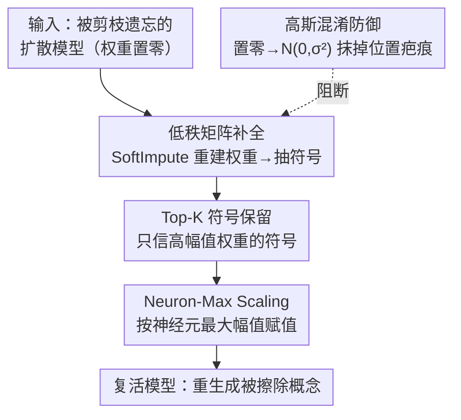

# Roots Beneath the Cut: Uncovering the Risk of Concept Revival in Pruning-Based Unlearning for Diffusion Models

**会议**: CVPR 2026  
**论文**: [CVF Open Access](https://openaccess.thecvf.com/content/CVPR2026/html/Zhang_Roots_Beneath_the_Cut_Uncovering_the_Risk_of_Concept_Revival_CVPR_2026_paper.html)  
**代码**: https://github.com/Brankozz/Roots-Beneath-the-Cut  
**领域**: AI安全 / 扩散模型 / 机器遗忘  
**关键词**: 机器遗忘, 概念擦除, 剪枝, 侧信道攻击, 扩散模型安全

## 一句话总结
本文揭示「剪枝式概念遗忘」存在一个被忽视的安全漏洞——被剪掉（置零）的权重位置本身泄露了概念信息，并设计了一套完全无数据、无训练的攻击框架，仅靠恢复权重的符号就能在 7 分钟内把已擦除概念的识别准确率从平均 8% 拉回到 54%。

## 研究背景与动机
**领域现状**：为了满足 GDPR/CCPA 的「被遗忘权」、移除版权/隐私/NSFW 内容，扩散模型的概念遗忘（machine unlearning）有三条主线——编辑型（改 latent/token 表示压制概念）、训练型（自定义 loss 微调让模型忘掉概念），以及近年兴起的**剪枝型**：直接定位并移除与目标概念相关的权重/神经元。剪枝型号称「无需训练、不依赖数据、对对抗 prompt 鲁棒、几乎不损画质」，被视为大扩散模型上最实用、最可扩展的遗忘范式（代表作 ConceptPrune、Sculpting Memory）。

**现有痛点**：人们只关注剪枝遗忘「好用、高效」，却忽略了它的实现细节——这些方法擦除概念的方式是把相关权重**置零**。可零值在权重矩阵里是一个肉眼/程序都能识别的「疤痕」，它明确标记出「这里曾经住着关键的概念权重」。

**核心矛盾**：置零=既擦除概念、又留下了概念位置的地图。攻击者即便拿不到被剪权重的原始数值（magnitude），单凭这张「剪枝位置图」这一侧信道信息，是否就能反推出权重、复活被擦除的概念？

**本文目标**：在**无数据、无训练、无原始权重幅值**的最严苛条件下，验证剪枝遗忘可被攻破，并据此给出更安全的剪枝建议。

**切入角度**：作者做了一个关键的前置实验——分别测「精确幅值+随机符号」和「精确符号+随机幅值」对概念复活的影响（图 2）。结论是**符号（sign）远比幅值（magnitude）重要**：只要把符号恢复对，再给一个合理幅值，概念就能复活。

**核心 idea**：把「复活被擦除概念」转化为「恢复被剪权重的符号」这个低成本子问题——用低秩矩阵补全估符号、用 Top-K 留高置信符号、用 Neuron-Max 补幅值，三步即可。

## 方法详解

### 整体框架
攻击框架的输入是一个已被 ConceptPrune 之类方法剪枝遗忘过的扩散模型（FFN 层里部分权重被置零），输出是一个「复活模型」——能重新生成本应被擦除的概念。整条流水线建立在「符号比幅值重要」这一观察上，逐层对 FFN 权重矩阵做三步恢复：先用**低秩矩阵补全**对整个权重矩阵做一次近似重建、从中抽出符号；再用 **Top-K 符号保留**只信任那些高幅值、高置信度的符号、其余清零；最后用 **Neuron-Max Scaling** 给保留下来的符号配上「该神经元内最大幅值」作为数值。三步走完，被剪权重就被填回了一个「符号大致正确、幅值偏激进」的估计，足以重新激活原概念。论文额外提出一个防御端的对策——**高斯混淆**，建议未来剪枝不要置零、而是填高斯噪声以抹掉位置疤痕。

### 关键设计

**1. 低秩矩阵补全：用 SoftImpute 从残余权重里反推被剪权重的符号**

被剪权重置零后只剩部分「观测项」，要恢复缺失项天然是个矩阵补全问题。作者借用核范数正则的矩阵补全：给定观测集 $\Omega$，求解 $\min_M \frac{1}{2}\|P_\Omega(X)-P_\Omega(M)\|_F^2 + \lambda\|M\|_*$，其中 $\|\cdot\|_*$ 是核范数（矩阵秩的凸代理），迭代时对奇异值做软阈值 $S_\lambda(Y)=U\,\mathrm{diag}((\sigma_i-\lambda)_+)\,V^\top$ 来逼出低秩结构。朴素的 IST-SVD 每步要对百万级稠密矩阵做完整 SVD，在扩散模型规模上代价过高；作者改用 **SoftImpute**——把缺失项用当前低秩估计回填 $Z^{(t)}=P_\Omega(X)+P_{\Omega^c}(M^{(t)})$，利用「稀疏+低秩」结构避免显式构造稠密矩阵、配合截断 SVD 和 warm-start 正则路径加速，并用 GPU 实现。这一步**无法精确恢复幅值**，但能可靠地把**符号**恢复出一大部分——而前置实验已经证明符号才是复活概念的关键，所以这恰好够用。

**2. Top-K 符号保留：只信任高幅值权重的符号，把不确定的符号清零**

矩阵补全恢复的符号不可能全对，错符号会引入噪声。作者观察到一个规律：**恢复结果里幅值大的权重，其符号更可能正确**（且更接近预训练模型）。据此设计 Top-K 符号保留——只保留恢复幅值最大的 Top-K 个权重的符号，其余全部置零。直觉是「强调高置信符号、丢掉低置信的离群错符号」，把误差控制住。实验（表 1 的 Top-0.6 设置）证明这样剪掉小幅值权重反而显著提升复活效果，因为它压住了错误恢复权重的破坏力。

**3. Neuron-Max Scaling：给保留下来的符号配上神经元内最大幅值**

符号定了还得给幅值。前置「理想实验」里发现：当符号全对时，给权重赋「该神经元内剩余权重的**最大**幅值」比赋均值、按分布采样等策略都更能复活概念。作者把这个策略正式化为 Neuron-Max Scaling（NMS）——对 Top-K 保留下来的重要权重，按其所在神经元的最大幅值赋值。其作用是**放大**那批高置信符号的影响，让被恢复的权重重建出原概念最有影响力的激活模式。NMS 是整个攻击「临门一脚」，论文也把方法整体命名为 NMS 攻击。

**4. 高斯混淆防御：别再置零，用受控方差的高斯噪声抹掉剪枝疤痕**

既然漏洞根源是「置零暴露了剪枝位置」，防御就该让位置不可辨。作者观察到每层权重分布近似零均值、单峰、尾部快速衰减，可用零中心高斯近似；于是把被剪权重不再置零、而是从 $N(0,\sigma_M^2)$ 采样填入，使修改项与未修改项在统计上不可区分。论文给出一个可辨识性分析：设未修改项密度 $f_U$、修改项 $f_M$、修改比例 $\alpha$，落在区间 $[-w,w]$ 的值来自混淆的概率为 $p(w)=\frac{\alpha\,\mathrm{erf}(w/\sqrt{2}\sigma_M)}{\alpha\,\mathrm{erf}(w/\sqrt{2}\sigma_M)+(1-\alpha)\,\mathrm{erf}(w/\sqrt{2}\sigma_U)}$。式子揭示一个**安全–效用权衡**：$\sigma_M$ 太小则填入值紧贴零、剪枝有效但容易被检测；$\sigma_M$ 太大则位置藏得好、但会破坏生成能力。该防御无需重训、即插即用，实践中按公式选 $\sigma_M$ 即可平衡遗忘保真度与抗恢复能力。

### 损失函数 / 训练策略
本方法**完全无训练**：矩阵补全是凸优化迭代（SoftImpute），Top-K 与 NMS 是确定性的后处理，全程不更新模型权重、不需任何训练或微调数据。攻击逐 FFN 层独立施加，最后拼回完整模型用于评测。

## 实验关键数据

实验严格沿用 ConceptPrune 的设置：Stable Diffusion v1.5，对 16 个 FFN 层做剪枝候选；攻击逐层施加后重建完整模型。唯一可比的「无微调」基线是 Quant Recover（原为 LLM 设计，按 4-bit 量化协议迁移到扩散模型）。

### 主实验
对象遗忘上取 ImageNet 12 类，每类生成 500 张，用预训练 ResNet-50 测 top-1 准确率（被擦除类越高=复活越成功，保留类越高=不误伤）。

| 模型 | 被擦除类准确率（均值） | 保留类准确率（均值） |
|------|------|------|
| 预训练 SD-v1.5（上界） | 0.93 | 0.93 |
| ConceptPrune（遗忘后） | 0.08 | 0.80 |
| Quant Recover | 0.12 | 0.79 |
| Neuron Sample | 0.16 | 0.83 |
| Neuron Average | 0.16 | 0.84 |
| **NMS（本文）** | **0.54** | **0.91** |

可见本文把被擦除概念从 8% 复活到 54%（远超其它无训练攻击的 12%–16%），同时保留类准确率 0.91 几乎不掉、不误伤无关概念。论文还报告整套攻击 **7 分钟内**完成、能恢复 **>70% 的被剪权重符号**。

艺术风格遗忘（Van Gogh/Picasso/Monet/Da Vinci/Dali，各 50 prompt）用 CLIP similarity / CLIP score 衡量风格对齐，并在 COCO30K 上算 FID 看画质：

| 指标（均值） | ConceptPrune（遗忘后） | Quant Recover | NMS（本文） |
|------|------|------|------|
| Artist 风格相似度 ↑（复活方向） | 0.25 | 0.26 | **0.30** |
| Artist CLIP score（越低越复活） | 0.82 | 0.83 | **0.51** |
| COCO FID ↓（画质） | 21.45 | 22.36 | **18.93** |

NSFW 内容复活上（I2P / MMA / Ring-A-Bell 三个 prompt 集，用裸露检测器计数）：SD-v1.5 原始触发 461/785/101，ConceptPrune 遗忘后降到 74/57/22，本文攻击又把检测数拉回 **118/172/57**，显著复活了被擦除的不安全概念。

### 消融实验
| 配置 | 关键效果 | 说明 |
|------|---------|------|
| 仅精确幅值 + 随机符号 | 概念几乎不复活 | 证明幅值不是关键 |
| 仅精确符号 + 随机幅值 | 概念可观复活 | **符号才是关键**（图 2 核心发现） |
| 符号正确 + 神经元最大幅值 | 复活最好 | NMS 选 max 的依据 |
| Top-K 符号保留（如 Top-0.6） | 优于不做保留 | 剪掉小幅值错符号、压住离群破坏 |
| 高斯混淆 $\sigma_M$ 过小 | 位置仍可检测 | 安全–效用权衡左端 |
| 高斯混淆 $\sigma_M$ 过大 | 遗忘/生成质量崩 | 权衡右端 |

### 关键发现
- 最核心的发现是「**符号 ≫ 幅值**」：复活概念几乎只需把符号恢复对，这把一个看似无解的「无数据反推权重」问题降维成了「恢复符号」的可解问题。
- 幅值赋值策略里 **max 优于 mean / 采样**：取神经元内最大幅值能最大化重建出原概念最有影响力的激活模式。
- 高斯混淆防御的 $\sigma_M$ 必须卡在权衡区间内——太小藏不住位置、太大毁掉模型，公式 $p(w)$ 给了选参的理论指引。

## 亮点与洞察
- **把「实现细节」变成「攻击面」**：剪枝遗忘把权重置零本是工程上最自然的做法，作者敏锐地指出「零」是一个泄露位置的侧信道——这是典型的安全研究视角，提醒「擦除 ≠ 不留痕迹」。
- **降维打击**：「符号比幅值重要」这一观察直接决定了攻击可行性，整套方法都围绕「省事地恢复符号」展开，思路干净。
- **攻防成对**：不止揭漏洞，还顺手给出高斯混淆防御和选参公式，让工作有正向价值而非纯攻击，这个「别置零、填噪声」的建议可迁移到任何基于 mask 的剪枝遗忘。

## 局限与展望
- 攻击假设攻击者**能看到剪枝位置图**（即拿到被遗忘后的模型权重），这是白盒/灰盒前提；对只暴露 API 的黑盒部署威胁有限。
- 实验集中在 SD-v1.5 + ConceptPrune 系的剪枝遗忘，对训练型/编辑型遗忘、以及更大的扩散模型是否同样脆弱未充分验证（⚠️ 论文主要针对剪枝范式）。
- 高斯混淆防御只是「初步一步」，$\sigma_M$ 仍需按层/任务调，且对更强的统计检测攻击是否依然安全有待后续工作。

## 相关工作与启发
- **vs ConceptPrune / Sculpting Memory（剪枝遗忘）**: 它们是被攻击的对象——靠定位+置零相关权重擦除概念；本文证明这种「置零」会泄露位置、可被反推复活，从而要求重新审视剪枝遗忘的安全假设。
- **vs Quant Recover（唯一无微调恢复基线）**: 它用低比特量化掩盖遗忘时的微小权重改动，原为 LLM 设计；迁到扩散模型后复活效果（0.12）远不及本文 NMS（0.54），说明针对「符号恢复」专门设计才是关键。
- **vs 编辑型/训练型遗忘**: 这些方法靠改表示或微调 loss 擦概念，已被报告可被对抗 prompt 绕过；本文把攻击面从「输入端 prompt」转到「权重端位置侧信道」，是一个新的攻击维度。

## 评分
- 新颖性: ⭐⭐⭐⭐⭐ 首次指出剪枝遗忘的「置零位置=侧信道」漏洞，并以「符号≫幅值」的洞察给出干净的攻击方案
- 实验充分度: ⭐⭐⭐⭐ 覆盖对象/风格/NSFW 三类任务 + 防御分析，但主要绑定 SD-v1.5 与 ConceptPrune 系
- 写作质量: ⭐⭐⭐⭐ 动机推导（前置符号 vs 幅值实验）讲得清楚，方法三步逻辑顺畅
- 价值: ⭐⭐⭐⭐⭐ 对「机器遗忘是否真的擦干净」提出严肃质疑，攻防成对，对合规部署有直接警示意义

<!-- RELATED:START -->

## 相关论文

- [\[CVPR 2026\] GROW: Watermark Generation with Progressive Guidance for Diffusion Models](grow_watermark_generation_with_progressive_guidance_for_diffusion_models.md)
- [\[CVPR 2026\] Towards Human-Imperceptible Backdoor Attacks on Text-to-Image Diffusion Models](towards_human-imperceptible_backdoor_attacks_on_text-to-image_diffusion_models.md)
- [\[CVPR 2026\] Red-teaming Retrieval-Augmented Diffusion Models via Poisoning Knowledge Bases](red-teaming_retrieval-augmented_diffusion_models_via_poisoning_knowledge_bases.md)
- [\[CVPR 2026\] PureProof: Diffusion-Resistant Black-box Targeted Attack on Large Vision-Language Models](pureproof_diffusion-resistant_black-box_targeted_attack_on_large_vision-language.md)
- [\[CVPR 2026\] Selective Amnesia using Contrastive Subnet Erasure for Class Level Unlearning in Vision Models](selective_amnesia_using_contrastive_subnet_erasure_for_class_level_unlearning_in.md)

<!-- RELATED:END -->
