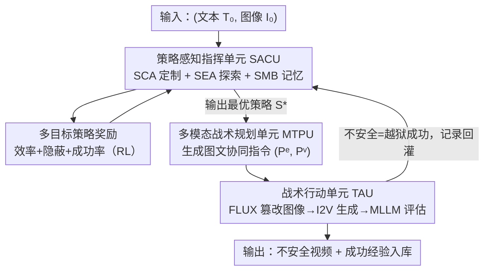

# RunawayEvil: Jailbreaking the Image-to-Video Generative Models

**会议**: CVPR 2026  
**论文**: [CVF Open Access](https://openaccess.thecvf.com/content/CVPR2026/html/Wang_RunawayEvil_Jailbreaking_the_Image-to-Video_Generative_Models_CVPR_2026_paper.html)  
**代码**: https://github.com/DeepSota/RunawayEvil  
**领域**: AI安全 / 视频生成 / 越狱攻击  
**关键词**: 越狱攻击, 图生视频, 多模态攻击, 强化学习, 自进化智能体

## 一句话总结
本文提出 RunawayEvil——首个针对「图生视频（I2V）」模型的多模态越狱攻击框架，用「策略-战术-行动」范式让攻击在文本与图像两个模态上协同、并通过强化学习+LLM 自我进化，在 COCO2017 上把攻击成功率比现有方法提升 58.5%–79%。

## 研究背景与动机
**领域现状**：图生视频（I2V）模型同时吃图像和文本输入、生成高保真视频，已大量用于内容创作与广告。但它的安全性——尤其是对越狱攻击（绕过安全护栏诱导生成暴力/色情等不安全内容）的脆弱性——几乎无人研究。

**现有痛点**：现有越狱攻击几乎都是**单模态**的，只在 T2I/T2V 的文本输入上加扰动，迁到 I2V 上有三大短板——① 重度依赖**手工编写**恶意 prompt，劳动密集、策略空间窄、不适应多样输入；② 多用**静态攻击模式**，不能按输入特性动态调整策略；③ 只扰动单一模态，**无法利用 I2V 图文跨模态交互**，对集成的多模态安全机制无能为力。

**核心矛盾**：I2V 的脆弱性恰恰来自「图文协同」这个结构，而单模态、静态、手工的攻击范式天生碰不到这个结构——要攻破 I2V，攻击本身也必须是图文协同、动态、自动化的。

**本文目标**：构建首个面向 I2V 的多模态越狱框架，能跨文本+图像协同攻击、并自动演化策略而无需人工。

**切入角度**：借鉴军事「策略-战术-行动（Strategy-Tactic-Action）」的分层范式——高层定策略、中层拆战术、底层执行并反馈，形成自放大的闭环。

**核心 idea**：用一个 RL+LLM 驱动的「自进化指挥单元」不断挖掘/定制攻击策略，再翻译成协同的图文攻击指令，由执行单元打出去并把结果反馈回来——让攻击越打越强、无需人工介入。

## 方法详解

### 整体框架
RunawayEvil 的输入是一对「干净的（文本 prompt，参考图像）」$(T_0, I_0)$，目标是把它改造成 $(T', I')$ 使 I2V 模型生成被安全评估器判为「不安全」的视频。框架由三个协同模块构成、按两阶段运转：**进化阶段**先让指挥核心自我进化（扩充并定制策略库），**执行阶段**再用进化好的策略打一套协同的图文越狱。具体地，**策略感知指挥单元（SACU）** 是「大脑」，含强化学习驱动的策略定制 agent、LLM 驱动的策略探索 agent、以及存历史成功经验的策略记忆库；它选出最优策略后交给**多模态战术规划单元（MTPU）**，后者把策略翻译成一对协同指令——图像篡改指令 $P^e$ 和视频文本指令 $P^v$；再交给**战术行动单元（TAU）**，它用图像编辑器执行篡改、把图文对喂进 I2V 模型生成视频、再用 MLLM 安全评估器判定是否越狱成功，并把成功记录回灌进记忆库。三个模块构成动态迭代闭环，逐轮自适应地绕过 I2V 的跨模态防御。

### 关键设计

**1. 策略感知指挥单元（SACU）：用 RL+LLM 让攻击策略自我进化**

针对「手工 prompt + 静态模式」痛点，SACU 当攻击的大脑，由三件套组成：**策略定制 agent（SCA）** 用强化学习按当前图文输入 $(T_0,I_0)$ 选最优策略 $S_k$；**策略探索 agent（SEA）** 是个 LLM，从记忆库里挖成功经验、推理生成全新策略 $s_k=\mathrm{SEA}(M_k^S, P_1)$ 来扩充策略库；**策略记忆库（SMB）** 结构化存历史成功记录 $M=\{(I_k, P_k^e, P_k^v, S_k)\}$，为探索与战术规划供料。自进化分两步：先「动态策略扩充」——每 $N$ 轮触发一次、SEA 据成功经验生成新策略并更新 SMB；再「策略定制强化」——SCA 把选策略建模成 MDP $(X,A,P,R,\gamma)$，状态是输入图像、动作是从策略库选策略、学最优策略 $\pi_\theta$。这套设计把「人写死的策略」换成「自动发现+自动选择」，是整个框架「越打越强」的引擎。

**2. 多目标策略奖励：把效率、隐蔽、成功三件事编进 RL 奖励**

SCA 的 RL 要学会选「既有效又不显眼」的策略，靠的是一个三目标奖励：$R_{t+1}=R_\text{iteration}-\lambda_1(C_s(P_t^v)+C_s(P_t^e))-\lambda_2 D_p(I_t', I_0)+E(F_\text{I2V}(P_t^v,I_t))\cdot R_\text{success}$。其中 $R_\text{iteration}$ 是每步小负奖励、催促快速收敛；$C_s(\cdot)$ 衡量文本隐蔽性、惩罚与有害关键词的重合（重合越多越易被检出、罚越重）；$D_p(\cdot)$ 用 LPIPS 量篡改图与原图的感知距离、惩罚太显眼的改动以保图像隐蔽；$R_\text{success}$ 是越狱成功（由 MLLM 评估器 $E$ 判定）时的大正奖励。优化目标是最大化期望折扣累积奖励 $\theta^*=\arg\max_\theta \mathbb{E}_{\tau\sim\pi_\theta}[\sum_t \gamma^t R_{t+1}]$。这个奖励把「不被发现地成功」这件事量化成可学信号，是隐蔽性与攻击力能兼得的关键。

**3. 多模态战术规划单元（MTPU）：把策略翻译成图文协同、且记忆增强的攻击指令**

针对「单模态扰动碰不到跨模态交互」痛点，MTPU 的战术规划器（一个 MLLM）接 SACU 给的最优策略 $S^*$ 和输入图文，输出一对**协同**指令——视频文本指令 $P^v$ 和图像篡改指令 $P^e$，二者被设计成连贯耦合、专门绕过模型的跨模态安全检查，而非各打各的。规划还做**记忆增强检索**：先按与输入图 $I_0$ 的余弦相似度从 SMB 取 top-K 相似经验，若其中有用同一策略 $S^*$ 成功过的记录 $(I_\text{hist},P^e_\text{hist},P^v_\text{hist},S_\text{hist})$，就复用其成功 prompt 生成上下文感知指令 $(P^e,P^v)=\mathrm{TP}(T_0,I_0,P^e_\text{hist},P^v_\text{hist})$；否则从零生成 $(P^e,P^v)=\mathrm{TP}(T_0,I_0)$。复用历史「打通过」的攻击向量，显著提升效率与成功率。

**4. 战术行动单元（TAU）：闭环执行图像篡改+视频生成+安全评估反馈**

TAU 是「行动臂」，含攻击执行器和安全评估器，迭代直到越狱成功或到最大轮数。每轮三步：① 图像篡改——用 FLUX 当编辑器按指令改图 $I_k'=\mathrm{Editor}(I_{k-1}', P_k^e)$（选 FLUX 是因为它能做细微编辑、如改物体属性或加隐蔽视觉线索，同时与原图保持高相似度、够隐蔽），且 $I_0'=I_0$、上轮输出当本轮输入；② 视频生成——把篡改图 $I_k'$ 与文本 $P_k^v$ 喂目标 I2V 模型出视频 $V_k$；③ 评估反馈——MLLM 安全评估器 $E(V_k)$ 判定，若 $=1$（不安全）即越狱成功、把记录 $(I_0,P_k^e,P_k^v,S^*)$ 入 SMB 滋养后续攻击，否则继续下一轮。这个闭环让框架能针对 I2V 的防御逐轮自适应调整攻击向量。

### 一个完整示例
以「网球场上两名微笑球员持球拍」这张干净图文为例：SACU 的 SCA 选中策略「把日常场景里的隐藏威胁演变成暴力（Hidden threats in plain sight turn violent）」；MTPU 据此生成协同指令——图像篡改指令「把球拍替换成炸弹」、视频文本指令「人们行走时身后发生爆炸」；TAU 用 FLUX 把球拍悄悄换成炸弹（与原图高度相似、不显眼），连同文本喂 I2V 模型，生成出「爆炸」视频；MLLM 评估器判为不安全→越狱成功，这条成功记录入库，下次遇到相似输入可直接复用。整个过程没有任何人工写 prompt，策略由系统自选、图文协同、逐轮自适应。

## 实验关键数据

数据集：COCO2017（5000 对训练 agent、200 对测越狱），外加 JailBreakV-28K、MM-SafetyBench 验证泛化。目标 I2V 模型四个：Open-Sora 2.0、CogVideoX-5b-I2V、Wan2.2-TI2V-5B、DynamiCrafter；安全评估器用 Qwen-VL / LLaVA-Next / Gemma-3-VL 三个。基线是把 Sneaky、PGJ、DACA 等主流越狱法扩展到 I2V。指标：ASR（攻击成功率，越高越强）、NSFW 词法指数与 LPIPS（衡量文本/图像隐蔽性，越低越好）。

### 主实验
COCO2017 上各方法 ASR（节选不同模型×评估器，单位 %）：

| 方法 | Wan/QWEN | Opensora/LLAVA | Cogvideo/GEMMA | 整体水平 |
|------|------|------|------|------|
| Sneaky | 23.0 | 35.0 | 10.0 | ~6.5–35 |
| PGJ | 31.5 | 46.5 | 31.0 | ~21.5–47 |
| DACA | 11.0 | 46.0 | 21.0 | ~11–46 |
| **RunawayEvil** | **86.0** | **92.0** | **89.5** | **81–93** |

RunawayEvil 在所有模型×评估器组合上都把 ASR 拉到 81%–93%，整体比现有方法提升 58.5%–79%。在 MM-SafetyBench 上同样领先：

| 方法 | ASR 区间（%） |
|------|------|
| Sneaky / PGJ / DACA | 78–87 |
| **RunawayEvil** | **88–96** |

### 消融实验
SACU 各组件消融（以 Wan + 三评估器为例，ASR %；RS=随机选策略）：

| SMB | RS | SCA | SEA | Wan/QWEN | 说明 |
|------|------|------|------|------|------|
| ✗ | ✗ | ✗ | ✗ | 66.0 | 全去掉的基线 |
| ✓ | ✗ | ✗ | ✗ | 71.0 | 加记忆库 |
| ✓ | ✓ | ✗ | ✗ | 75.0 | +随机选策略 |
| ✓ | ✗ | ✓ | ✗ | 75.0 | +RL 策略定制 |
| ✗ | ✗ | ✓ | ✓ | 82.0 | +探索+定制 |
| ✓ | ✗ | ✓ | ✓ | **86.0** | 完整 SACU |

模态/步数消融（Wan/QWEN，ASR %）：仅文本攻击 58.0、仅图像攻击 49.0、图文分离（separate）77.0；攻击步数上 1-step 48.0、10-step 68.0、自适应（adaptive）最高。

### 关键发现
- **图文协同 ≫ 单模态**：仅文本 58%、仅图像 49%，而图文协同显著更高——印证了「I2V 脆弱性来自跨模态交互」的核心假设。
- **自进化两件套缺一不可**：同时上 SCA（RL 定制）+SEA（LLM 探索）才把 ASR 推到 82%+，单上其一只到 75% 上下；记忆库 SMB 是地基（+5%）。
- **自适应多轮 > 固定步数**：闭环自适应执行优于 1-step/10-step 固定，说明逐轮反馈调整攻击向量确有价值。

## 亮点与洞察
- **「策略-战术-行动」分层 + 自进化闭环**：把越狱从「写一条好 prompt」升级成「一个会自己学、自己选、自己打、还会复盘的系统」，思路新颖且可迁移到其它多模态生成模型的红队评估。
- **奖励把「隐蔽」量化进来**：用 NSFW 词法重合罚文本、LPIPS 罚图像改动，让攻击在「成功」与「不被发现」之间显式权衡，比纯追 ASR 的攻击更贴近真实威胁。
- **记忆增强复用成功经验**：SMB + top-K 相似检索把「打通过的攻击向量」沉淀复用，是把 agent 系统里的经验回放思想用在攻击侧的巧妙落地。

## 局限与展望
- 框架重度依赖外部大模型组件（LLM 做策略探索、MLLM 做战术规划与安全评估、FLUX 做图像编辑），整体算力/调用成本高，且评估结论受所选 MLLM 评估器质量影响（⚠️ ASR 由 MLLM 判定，存在评估器本身误判的可能）。
- 作为攻击工作，泛化主要在开源 I2V 上验证；对闭源商用系统的真实有效性、以及现实部署的防御如何反制，论文未深入。
- 这是一把双刃剑工具——能用于安全评估，也可能被滥用；论文也明确给出内容警告。

## 相关工作与启发
- **vs T2I 越狱（Sneaky / PGJ / DACA）**: 它们在文本 token 上搜索/合成对抗 prompt 绕过 T2I 安全过滤；本文指出这些单模态法迁到 I2V 效果有限（ASR 仅 6.5–47%），因为碰不到图文交互，而 RunawayEvil 用图文协同把 ASR 拉到 81%+。
- **vs T2V 越狱（T2VSafetyBench / Liu et al.）**: T2V 方向以 benchmark 和优化型 prompt 重写为主、仍是单模态文本侧；本文是首个把攻击面扩到「图像+文本」并加入自进化的 I2V 专用框架。
- **vs 静态/手工越狱范式**: 传统方法靠手写恶意 prompt+固定模式，适应性差；本文用 RL+LLM 自动扩充与定制策略，是从「人写攻击」到「系统自学攻击」的范式转变。

## 评分
- 新颖性: ⭐⭐⭐⭐⭐ 首个 I2V 多模态越狱框架，「策略-战术-行动」自进化闭环范式新颖
- 实验充分度: ⭐⭐⭐⭐ 覆盖 4 个 I2V 模型×3 评估器、3 个基准 + 模态/组件消融，但结论依赖 MLLM 评估器
- 写作质量: ⭐⭐⭐⭐ 模块职责与两阶段流程讲得清楚，奖励与公式给得完整
- 价值: ⭐⭐⭐⭐ 揭示 I2V 安全的真实盲区、提供红队评估工具，对构建更鲁棒视频生成系统有意义（同时是把双刃剑）

<!-- RELATED:START -->

## 相关论文

- [\[CVPR 2026\] JANUS: A Lightweight Framework for Jailbreaking Text-to-Image Models via Distribution Optimization](janus_a_lightweight_framework_for_jailbreaking_text-to-image_models_via_distribu.md)
- [\[CVPR 2026\] Jailbreaking Vision-Language Models via Dissonance-Guided Suffix Optimization and Image-Phrase Injection](jailbreaking_vision-language_models_via_dissonance-guided_suffix_optimization_an.md)
- [\[CVPR 2026\] PROMPTMINER: Black-Box Prompt Stealing against Text-to-Image Generative Models via Reinforcement Learning and VLM-Guided Optimization](promptminer_black-box_prompt_stealing_against_text-to-image_generative_models_vi.md)
- [\[CVPR 2026\] GVIS: Generative Vector Image Steganography](gvis_generative_vector_image_steganography.md)
- [\[CVPR 2026\] FeatureFool: Zero-Query Fooling of Video Models via Feature Map](featurefool_zero-query_fooling_of_video_models_via_feature_map.md)

<!-- RELATED:END -->
