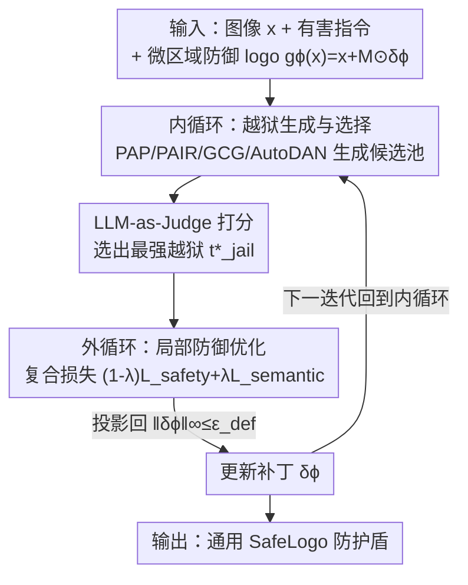

# SafeLogo: Turning Your Logos into Jailbreak Shields via Micro-Regional Adversarial Training

**会议**: CVPR 2026  
**论文**: [CVF Open Access](https://openaccess.thecvf.com/content/CVPR2026/html/Duan_SafeLogo_Turning_Your_Logos_into_Jailbreak_Shields_via_Micro-Regional_Adversarial_CVPR_2026_paper.html)  
**代码**: 无  
**领域**: AI安全 / 多模态VLM  
**关键词**: VLM越狱防御, 对抗训练, 视觉防御提示, min-max优化, 局部扰动

## 一句话总结
SafeLogo 把一块只占图像 ≤2% 像素的"商标级"小补丁，用 min–max 对抗训练优化成一个通用的越狱防护盾——内循环动态挑出当前最强的越狱攻击、外循环更新这块局部补丁去抵御它，不动 VLM 主干就能在 MM-SafetyBench / VLGuard / FigStep 上大幅压低越狱成功率，同时几乎不损伤正常任务表现。

## 研究背景与动机
**领域现状**：视觉语言模型（VLM，如 LLaVA-1.5、MiniGPT-4、Qwen-VL）能力越来越强，但也越来越容易被"越狱攻击"绕过安全对齐——攻击者构造文本或多模态恶意输入（PAP 用 40 种说服话术改写、PAIR 让攻击 LLM 迭代精炼、GCG 用梯度搜索对抗后缀），诱导模型输出有害内容。

**现有痛点**：现有防御要么是微调路线（RLHF、SFT），对大模型计算代价高、还会损伤通用能力；要么是即插即用的视觉/文本防御提示。但后者往往依赖强先验或大量提示工程，为了鲁棒性会在整张图上加明显扰动，破坏画质和可用性（论文 Figure 1 b/c）；而且防护范围窄，只覆盖单一攻击方向或固定的良性监督，对自适应、跨模态的越狱几乎没有招架之力。

**核心矛盾**：防御强度与图像可用性之间存在 trade-off——想防得住就得改得多，改得多画质就崩。同时"用固定方向训练的防御"天然打不过"会自适应进化的攻击"，因为攻击空间是动态的、防御却是静态的。

**本文目标**：在**不改主干、几乎不动画面**的前提下，训练出一个能泛化到未见越狱策略的防御机制。

**切入角度**：作者提出一个反直觉的问题——能不能把一个视觉上几乎看不见的"logo"优化成对抗各种越狱的通用盾牌？关键观察是：传统对抗训练（AT）的 min–max 范式天生擅长对抗"最坏情况扰动"，那把"最坏情况的越狱"当成内层最大化对象，就能让防御持续对齐到最强攻击。

**核心 idea**：用 min–max 对抗训练，把一块占比 ≤2%、像水印/商标一样嵌进图里的局部扰动，优化成抵御多样越狱的"SafeLogo"。

## 方法详解

### 整体框架
SafeLogo 的输入是一张图像 + 一条有害指令，输出是一块固定空间区域内、幅值受限的局部扰动补丁（即 SafeLogo）；推理时把这块补丁贴进任意图像，配合一条固定的安全指令，就能让 VLM 对越狱查询回退到拒答。整套训练是一个 bi-level（双层）的 min–max 博弈：**内循环**扮演"会进化的攻击者"，对当前防御生成一池越狱候选并用 LLM-as-Judge 挑出最毒的那个；**外循环**扮演"局部防御者"，在最强攻击的压力下更新补丁参数，并把更新投影回幅值约束内。两个循环交替进行，让防御始终对齐到"此刻能打穿它的最强越狱"。

### 关键设计

**1. 微区域防御 logo：把防御压进 ≤2% 的像素里**

针对"全图加扰动破坏画质"这个痛点，作者把防御参数化为一个只在固定稀疏区域生效的函数 $g_\phi(x) = x + M \odot \delta_\phi$，其中 $\delta_\phi \in [-\epsilon_{def}, \epsilon_{def}]^{H\times W\times C}$ 是可学习的有界扰动，$M \in \{0,1\}^{H\times W\times C}$ 是一个二值掩码，约束 $\|M\|_0 = \rho\cdot H\cdot W\cdot C$、覆盖率 $\rho$ 通常取 0.02。掩码 $M$ 在训练中**固定不动**，因此扰动空间一致、可跨图像迁移，优化只集中在这块小补丁上。这样既保住了视觉保真度和语义一致性（像贴了个水印/商标），又把扰动幅值限制在 64/255 内仍能达到接近"全图边界扰动"的防御效果。作者也坦言：这么小的区域单独是不够的，所以 SafeLogo 必须和标准安全指令**联合训练**，靠它去"激活并放大"模型内在的安全对齐，而不是从零造一个防御信号。

**2. 双层 min–max 博弈：让静态防御去追自适应攻击**

针对"固定方向的防御打不过会进化的攻击"，作者把防御学习写成一个双层 min–max 问题：
$$\min_{\phi} \max_{t_{jail}\in T_{jail}(t_{harm})} L_{defense}(\phi, x, t_{jail}).$$
内层最大化在当前防御下找出最具攻击性的越狱，外层最小化更新防御参数 $\phi$ 去中和它。这正是把经典对抗训练里"找最坏扰动 / 抵御最坏扰动"的思想搬到了越狱防御上——区别在于这里的"扰动"不是连续噪声，而是从多个攻击家族里**离散选出**的最强越狱提示。作者称这是首个把 AT 引入局部视觉防御提示、并把视觉防御重构为 min–max 博弈的工作，好处是防御不再绑死在某一种攻击上，而是随内层动态进化获得跨攻击的泛化。

**3. 内循环——越狱生成与 LLM-as-Judge 选择：动态锁定"最毒"的那条攻击**

给定当前防御 $\phi^{(t)}$，内循环用一组越狱生成器 $J=\{J_1,\dots,J_n\}$（如 PAP、PAIR、GCG、AutoDAN）对每条有害指令 $t_{harm}$ 和图像 $x$ 构造候选池 $T_{pool}(x,t_{harm}) = \{J_i(x,t_{harm},f_\theta,g_\phi)\}$，再用一个充当安全裁判的大模型按有害度打分，选出得分最高（最危险）的那一条：
$$t^*_{jail} = \arg\max_{t_{jail}\in T_{pool}} J_{LLM}\big(f_\theta(g_\phi(x), t_{jail})\big).$$
这里 $J_{LLM}(\cdot)$ 是一个 LLM-as-Judge 安全评估函数，给每个响应打一个标量"有害分"。这一步是整个方法的关键——它让训练信号始终来自"当前防御下最打得穿的攻击"，而不是某个预设的固定攻击，从而保证防御对自适应/未见攻击也有招架之力。实测它从 PAIR/GCG/PAP 三种攻击里动态选最强来构造防御训练对。

**4. 外循环——复合损失 + 投影更新：在守安全的同时不毁掉正常能力**

拿到最强越狱 $t^*_{jail}$ 后，外循环更新局部扰动去最小化复合防御损失 $L_{defense} = (1-\lambda)L_{safety} + \lambda L_{semantic}$，系数 $\lambda\in[0,1]$ 平衡"安全鲁棒性"和"良性可用性"。其中安全损失 $L_{safety} = \mathbb{E}\big[-\log P_{refuse}(g_\phi(x), t^*_{jail})\big]$ 逼着模型在最强越狱下也拒答；语义保持损失 $L_{semantic} = \mathbb{E}_{benign}\big[\|f_\theta(g_\phi(x),t) - f_\theta(x,t)\|_2^2\big]$ 则约束良性输入上补丁前后的输出别变，确保正常推理/感知能力不被这块补丁干扰。更新用带投影的梯度步 $\phi^{(t+1)} = \Pi_{\|\delta_\phi\|_\infty\le\epsilon_{def}}\big(\phi^{(t)} - \alpha_{out}\nabla_\phi L_{defense}\big)$，投影算子把扰动拍回 $\|\delta_\phi\|_\infty\le\epsilon_{def}$ 的合法球内，保证视觉不可感知性。安全损失 + 语义损失这对组合，正是"防得住又不毁正常任务"的来源。

### 损失函数 / 训练策略
总损失为 $L_{defense} = (1-\lambda)L_{safety} + \lambda L_{semantic}$。训练用 LLaVA-1.5-13B 与 Qwen3-VL-8B-Instruct 作基座，各训 5000 步、batch size 3、学习率 1/255；训练与评测全程挂一条固定安全指令以保持一致行为。权重 $\lambda$、覆盖率 $\rho$、扰动幅值 $\epsilon_{def}$ 都作为可调超参按实验需要调整。防御训练集取 MM-SafetyBench 中 600 个基座模型一开始没识别为有害的样本，每张图生成 PAIR/GCG/PAP 三种攻击并动态选最强者配对；良性训练集随机取 100 个 MM-Vet 样本。

## 实验关键数据

### 主实验
在 MM-SafetyBench（ID）与 VLGuard（OOD）上比较各防御对 PAIR/GCG/PAP 三种攻击的攻击成功率（ASR，越低越好），下表节选 SD+TYPO 子集与 VLGuard：

| 模型 / 防御 | MM-SB SD+TYPO PAIR | GCG | PAP | VLGuard PAIR | GCG | PAP |
|------|------|------|------|------|------|------|
| LLaVA-1.5-13B 无防御 | 13.3% | 17.1% | 16.9% | 33.3% | 32.4% | 41.0% |
| AdaShield | 1.4% | 7.5% | 2.5% | 6.7% | 15.2% | 13.3% |
| DAVSP（全图边界扰动） | 0.1% | 1.3% | 0.2% | 17.1% | 17.1% | 9.5% |
| **SafeLogo** | **0.9%** | **4.2%** | **0.4%** | **2.9%** | **11.4%** | **1.9%** |
| Qwen3-VL-8B 无防御 | 6.7% | 6.3% | 4.6% | 10.5% | 15.2% | 13.3% |
| **SafeLogo** | **0.5%** | **0.0%** | **0.1%** | **1.0%** | **0.0%** | **0.0%** |

> 关键看点：DAVSP 在 ID 上略强，但它靠在整张图边界注入**无约束**扰动换来的；到了 OOD（VLGuard）就明显掉链子（ASR 升到 9.5%~17.1%），而 SafeLogo 仅用 2% 覆盖 + 64/255 幅值约束，OOD 泛化反而更稳（PAP 仅 1.9%）。

### 良性可用性（消融视角）
在 MM-Vet（ID 良性）上对比防御前后的分项与总分（越高越好）：

| 模型 / 防御 | Rec | OCR | Know | Spat | Math | Total |
|------|------|------|------|------|------|------|
| LLaVA-1.5-13B 无防御 | 41.1 | 32.8 | 28.5 | 39.1 | 7.1 | 39.2 |
| DAVSP | 39.3 | 30.9 | 24.3 | 41.1 | 20.7 | 38.0 |
| MLLMP | 40.5 | 31.9 | 28.5 | 37.8 | 7.1 | 38.6 |
| **SafeLogo** | — | — | — | — | — | ≈无防御（几乎不变）⚠️ |

> ⚠️ SafeLogo 在 MM-Vet 上的逐项分数原文 Table 2 被截断，正文称"总分与无防御模型相当、ID 上几乎不变"；Qwen3-VL 因对 OCR/数学等细粒度能力敏感有小幅下降，但仍高于同等防御强度的 baseline。

### 关键发现
- **2% 覆盖足够**：把扰动锁在 logo 大小的局部区域，就能逼近甚至超过"全图边界扰动"（DAVSP）的防御效果，说明防御不需要改满整张图。
- **OOD 泛化是分水岭**：其他 baseline 在 OOD（VLGuard / MME）上 ASR 明显上升或可用性下降，SafeLogo 因为内循环始终对齐最强攻击，跨分布更稳。
- **安全—可用性可调**：$\lambda$ 直接调"防得多狠 vs. 正常任务掉多少分"，给部署留了旋钮。

## 亮点与洞察
- **把 logo 当盾牌**：最"啊哈"的一点是把一块视觉上无害的商标级补丁优化成通用越狱盾——防御以"水印"形态嵌进图，既不破坏画质又即插即用，比改主干或全图加噪优雅得多。
- **min–max 对抗训练迁到越狱防御**：内层"挑最强越狱"代替传统 AT 里"找最坏连续扰动"，把离散的攻击家族选择嵌进对抗训练框架，这个思路可迁移到任何"有多种已知攻击、想要一个通用防御"的安全任务。
- **LLM-as-Judge 当训练信号源**：用大模型有害度打分动态选择训练目标，避免了把防御绑死在单一攻击上——这是泛化的关键，也是一个可复用的 trick。

## 局限与展望
- **依赖一池现成攻击器**：内循环的"最强越狱"只能在 PAP/PAIR/GCG/AutoDAN 这些已知生成器里挑，对真正全新的、不在候选池里的攻击范式，覆盖度存疑。
- **固定安全指令耦合**：训练/评测全程挂一条固定安全指令，补丁的作用是"激活并放大"内在对齐；若部署时指令被攻击者篡改或缺失，单靠这块小补丁可能不足（作者自己也承认局部区域单独不够用）。
- **裁判模型成本与偏置**：LLM-as-Judge（用 DeepSeek-V3 评 ASR）既带推理开销，其打分偏置也会直接影响选出的"最强越狱"，进而左右防御方向。
- **逐项良性分缺失**：MM-Vet 分项表在缓存里被截断，SafeLogo 的细粒度可用性损失难以完整核对。⚠️

## 相关工作与启发
- **vs DAVSP**：DAVSP 在整张图边界注入可训练的无约束扰动、在激活空间做监督对齐，ID 防御很强但全局改动重、OOD 泛化差；SafeLogo 只用 2% 局部 + 幅值约束，画质几乎不变、OOD 更稳。
- **vs AdaShield**：AdaShield 在用户输入前加自适应防御提示，主要针对结构化越狱；SafeLogo 走视觉局部扰动 + min–max，对跨模态/自适应攻击覆盖更广。
- **vs ECSO / MLLM-Protector**：ECSO 把不安全图像转文本去借 LLM 的安全机制、依赖 LLM 自身判断；MLLM-Protector 用有害检测器 + 去毒器但加推理开销。SafeLogo 不额外推理、不改主干，把防御一次性烤进一块补丁。

## 评分
- 新颖性: ⭐⭐⭐⭐⭐ 首个把 min–max 对抗训练用于局部视觉防御提示，"logo 当盾牌"角度新颖
- 实验充分度: ⭐⭐⭐⭐ 覆盖两个 VLM、三个攻击、ID/OOD 双设定，但部分良性分表被截断、缺更系统的超参消融
- 写作质量: ⭐⭐⭐⭐ 公式与算法清晰，bi-level 结构讲得明白
- 价值: ⭐⭐⭐⭐ 低成本、即插即用、保画质的 VLM 越狱防御，部署友好

<!-- RELATED:START -->

## 相关论文

- [\[CVPR 2026\] Taming the Long Tail: Rebalancing Adversarial Training via Adaptive Perturbation](taming_the_long_tail_rebalancing_adversarial_training_via_adaptive_perturbation.md)
- [\[CVPR 2026\] Mitigating Error Amplification in Fast Adversarial Training](mitigating_error_amplification_in_fast_adversarial_training.md)
- [\[CVPR 2026\] Towards Robust Vision Transformers: Path Dependency Analysis and a Simple Two-Stage Adversarial Training](towards_robust_vision_transformers_path_dependency_analysis_and_a_simple_two-sta.md)
- [\[CVPR 2026\] Robustness Under Data Scarcity: Few-Shot Continual Adversarial Training for Evolving Threats](robustness_under_data_scarcity_few-shot_continual_adversarial_training_for_evolv.md)
- [\[CVPR 2026\] UniGame: Turning a Unified Multimodal Model Into Its Own Adversary](unigame_turning_a_unified_multimodal_model_into_its_own_adversary.md)

<!-- RELATED:END -->
