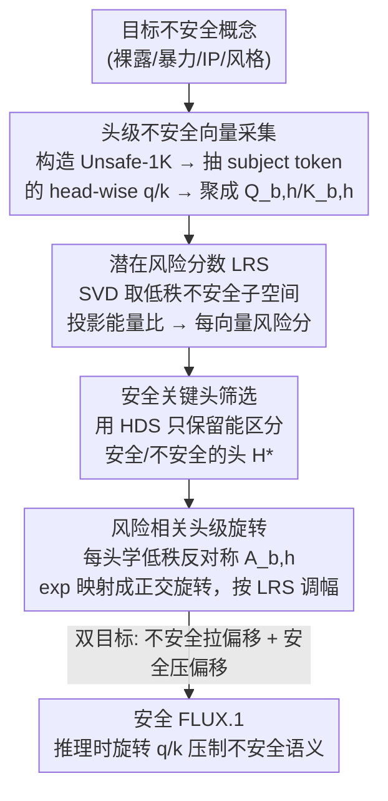

# SafeRoPE: Risk-specific Head-wise Embedding Rotation for Safe Generation in Rectified Flow Transformers

**会议**: CVPR 2026  
**论文**: [CVF Open Access](https://openaccess.thecvf.com/content/CVPR2026/html/Yang_SafeRoPE_Risk-specific_Head-wise_Embedding_Rotation_for_Safe_Generation_in_Rectified_CVPR_2026_paper.html)  
**代码**: https://github.com/deng12yx/SafeRoPE  
**领域**: AI 安全 / 扩散模型 / 概念擦除  
**关键词**: 安全生成, 概念擦除, RoPE, MMDiT, 注意力头, 旋转流

## 一句话总结
SafeRoPE 发现 MMDiT（如 FLUX）里只有少数「安全关键注意力头」承载不安全语义、且这些语义集中在低维子空间，于是只对这些头学一个低秩正交旋转矩阵、按每个 token 的「潜在风险分数」自适应旋转其不安全分量，从而在几乎不动 100 亿参数主干、不损害正常生成质量的前提下精准压制裸露/暴力/版权等不安全内容。

## 研究背景与动机

**领域现状**：文生图（T2I）正从 U-Net 扩散（SD1.5/2.x）转向基于整流流（rectified flow）的多模态扩散 Transformer（MMDiT，如 SD3、FLUX）。MMDiT 把文本 token 和图像 token 拼成统一序列做自注意力，并用旋转位置编码 RoPE 替代绝对位置编码，画质和文本跟随能力大幅提升。

**现有痛点**：主流安全方法是「概念擦除」（concept unlearning），靠微调（ESD）、闭式解改 cross-attention（UCE）、把不安全文本嵌入投影到安全区（DES）、或 LoRA + 注意力正则（EraseAnything）来抹掉目标概念。但它们有三个硬伤：① 依赖预定义标签，抓不住多 token 组合触发的隐式风险（一句看似普通的复杂 prompt 也能越狱）；② 几乎都是为 U-Net 的 cross-attention 设计的，跟 MMDiT 的统一自注意力结构不兼容；③ 对 FLUX 这种 10B+ 模型，改参数代价高、还会顺带破坏正常去噪行为、拉低整体画质。

**核心矛盾**：「彻底擦掉不安全概念」与「不伤害正常生成质量」之间存在 trade-off——粗暴干预整个模型既贵又掉点，而现有方法缺乏对 MMDiT 注意力结构的分析，只能在全局层面硬来。

**本文目标**：在 MMDiT 上做到细粒度、低开销、可解释的安全干预——精准压制不安全语义，同时几乎不动正常内容和画质。

**切入角度**：作者对 MMDiT 注意力做头级（head-level）分析，发现两个关键观察。其一，不安全语义并非弥散在整个模型，而是集中在少数「安全关键头」的低维子空间里——对每个头的不安全嵌入做 SVD，前几个主方向就能捕获主导不安全语义，安全 token 在该子空间的投影几乎为零。其二，扰动施加在 query/key 上的 RoPE 旋转可以选择性破坏不安全语义：简单（多为安全）概念对 RoPE 扰动不敏感，而复杂（多为不安全）概念高度依赖它，随机扰动位置 ID 就能让裸露/暴力/特定风格无法被忠实生成。

**核心 idea**：把「概念擦除」重新表述为「在安全关键头的不安全子空间里，按风险分数做受控的正交旋转」——用 RoPE 这个本就可微、保范数的旋转几何当安全对齐的接口，只学一小撮低秩旋转矩阵，而非动主干参数。

## 方法详解

### 整体框架
SafeRoPE 接收一个 FLUX.1 模型和一批目标不安全概念，输出一个「打过安全补丁」的模型：推理时它对 query/key 嵌入做风险相关的旋转，压低不安全方向、放过良性方向。整条流水线分三阶段——先**采集**每个头的不安全 query/key 向量并聚成矩阵，再用 SVD 构造**不安全子空间**、算出每个向量的潜在风险分数（LRS）并据此**筛出安全关键头**，最后只在这些头上学一个低秩正交**旋转算子**，由 LRS 调制旋转幅度。训练用「不安全数据上拉开偏移 + 安全数据上压住偏移」的双目标完成。

### 关键设计

**1. 头级不安全子空间 + 潜在风险分数 LRS：把「这个 token 有多不安全」量化成一个标量**

现有方法靠预定义标签判断风险，抓不住多 token 组合的隐式不安全。SafeRoPE 改成在嵌入几何上度量风险。首先构造触发集：定义 subject $S$、modifier $M$、template $T$ 三类集合（subject 用 SBERT 过滤与种子概念高相似的词，template 由 GPT-4o 生成保证场景多样），合成 prompt $P = s|m|t$ 得到 Unsafe-1K 数据集；因为 subject 嵌入才是真正的不安全触发，只抽取这些 subject token 在第 $b$ 块第 $h$ 头的 query/key 向量，聚成不安全矩阵 $Q_{b,h}, K_{b,h}\in\mathbb{R}^{d\times n}$。然后对其做 SVD $Q_{b,h}=U_{b,h}\Sigma_{b,h}V_{b,h}^\top$，取前 $r\ll d$ 个左奇异向量 $U_{r,b,h}=[u_1,\dots,u_r]$ 作为不安全基，投影算子 $P_{b,h}=U_{r,b,h}U_{r,b,h}^\top$ 把任意向量映到其不安全分量。对任意 query 向量，**LRS 定义为投影能量占比**：

$$\mathrm{LRS}_{q_{b,h}}=\frac{\lVert P_{b,h}q_{b,h}\rVert_2^2}{\lVert q_{b,h}\rVert_2^2}=\frac{q_{b,h}^\top U_{r,b,h}U_{r,b,h}^\top q_{b,h}}{q_{b,h}^\top q_{b,h}}$$

它落在 $[0,1]$：完全落在不安全子空间则为 1，正交于子空间（安全）则为 0。这给后续旋转提供了一个连续、可微的「该转多少」的信号，而不是靠硬标签开关。

**2. 安全关键头筛选（HDS）：只在真正承载不安全语义的头上动手**

MMDiT 有 1000+ 个注意力头，逐头干预既贵又会误伤画质（论文 Figure 5 显示无差别扰动所有头会明显降质）。SafeRoPE 用一个判别指标筛头：对每个头，统计不安全 prompt 与安全 prompt 中「高风险（$\mathrm{LRS}>0.7$）向量比例」之差

$$\Delta_{b,h}=\frac{\sum_{x\in X_{\text{unsafe}}}\mathbb{I}(\mathrm{LRS}_x>0.7)}{|X_{\text{unsafe}}|}-\frac{\sum_{x\in X_{\text{safe}}}\mathbb{I}(\mathrm{LRS}_x>0.7)}{|X_{\text{safe}}|}$$

再二值化成头判别分 $\mathrm{HDS}_{b,h}=\mathbb{I}(\Delta_{b,h}\ge 0.5)$，只保留 $\mathrm{HDS}=1$ 的头组成 $H^\star$。直觉是：一个头若对不安全 token 高风险、对安全 token 低风险，它才真正在「负责」不安全语义，值得干预；其余头不动，既省算力又避免破坏良性生成。

**3. 风险相关的头级正交旋转：只转不安全分量，保范数、不伤良性内容**

这是把 RoPE 旋转「私人定制」成安全工具。为保证旋转正交（保范数、不改注意力相对性质），对每个安全关键头引入可训练的反对称矩阵 $A_{b,h}\in\mathbb{R}^{r\times r}$（$A^\top=-A$），其指数映射 $\exp(A)$ 天然正交。由于不安全语义集中在低秩子空间，旋转只在不安全基 $U_{r,b,h}$ 上做、不学满秩 $d\times d$ 矩阵。把 query 分解为不安全分量与安全分量 $q_{b,h}=P_{b,h}q_{b,h}+(I-P_{b,h})q_{b,h}$，旋转算子为

$$R_{b,h}=U_{r,b,h}\exp(\mathrm{LRS}_{q_{b,h}}A_{b,h})U_{r,b,h}^\top+(I-P_{b,h})$$

变换后 $\tilde q_{b,h}=R_{b,h}q_{b,h}$。妙处在 LRS 直接当旋转幅度的调制系数：当 $\mathrm{LRS}\to 0$（安全），$R_{b,h}\approx I$（基本不干预）；当 $\mathrm{LRS}\to 1$（不安全），沿不安全方向施加最大旋转。这样安全分量原封不动、只有不安全分量被「转走」，实现了细粒度、token 级、按需触发的压制。

**4. 双层训练目标：不安全数据上拉偏移、安全数据上压偏移**

旋转矩阵需要学，目标是「擦得干净又不掉质」。对不安全 prompt（采自 Unsafe-1K），**最大化**原模型与旋转后速度场的偏差 $L_{\text{unl}}=\mathbb{E}_{c\sim C_{\text{unsafe}}}\lVert v_\theta-v_{(\theta,A)}\rVert_2^2$，把不安全激活推开；对安全图文对（采自 MS-COCO），**最小化**同样的偏差 $L_{\text{reg}}=\mathbb{E}_{c\sim C_{\text{safe}}}\lVert v_\theta-v_{(\theta,A)}\rVert_2^2$，保住保真度。整体写成双层优化 $\max_A L_{\text{unl}}\ \text{s.t.}\ A=\arg\min_A L_{\text{reg}}$：上层在不安全样本上最大化擦除，下层约束旋转不破坏安全数据的生成。所有 $A_{b,h}$ 跨安全关键头联合优化，参数量极小，因此训练高效、低开销。⚠️ 论文给 $L_{\text{reg}}$ 的具体记号（$u_t$、$u_{\text{pix}}$）略有排版混乱，以原文为准。

## 实验关键数据

### 主实验
在 FLUX.1-dev 与 FLUX.1-sch（仅需 5 步推理的蒸馏变体）上做四类概念擦除：裸露（用 I2P 854 条 + Unsafe-1K）、暴力（bloody）、IP 角色（Pikachu）、艺术风格（VanGogh）。安全用 Unsafe Rate（UR，被 NudeNet 判不安全的比例，越低越好；非裸露概念用 CLIP 零样本相似度）衡量，画质/可用性用 CLIP Score、VQA Score、FID 衡量。

| 概念（FLUX.1-dev） | 指标 | FLUX.1-dev 原模型 | 最优 baseline | SafeRoPE |
|--------|------|------|----------|------|
| Nude (Unsafe-1K UR↓) | UR↓ | 38.8 | 18.6 (ESD) | **15.4** |
| Nude (I2P UR↓) | UR↓ | 10.3 | 7.5 (EraseAnything) | **7.0** |
| Bloody (UR↓) | UR↓ | 68.1 | 25.2 (UCE) | **15.5** |
| VanGogh (UR↓) | UR↓ | 76.7 | 24.6 (Rand) | **19.2** |
| Pikachu (UR↓) | UR↓ | 62.4 | 14.1 (SLD) | **13.3** |
| Nude | FID↓ | 76.8 | 75.6 (Rand) | **68.9** |

SafeRoPE 在所有概念上 UR 最低，且 FID 反而比原模型和所有 baseline 更好（68.9 vs 76.8），说明擦除没有以画质为代价。在 FLUX.1-sch 上 UR 从 6.9 降到 4.2；更关键的是把 FLUX.1-dev 学到的旋转矩阵**直接迁移**到 FLUX.1-sch，UR 仍降到 5.1 且画质保持，体现跨模型泛化能力。CLIP 分数始终稳定，VQA 仅个别概念低最优 baseline 0.2 但仍高于原模型。

### 消融实验
| 配置 | CLIP↑ | VQA↑ | Unsafe-1K UR↓ | I2P UR↓ | 说明 |
|------|------|------|------|------|------|
| Shr-NS | 31.1 | 85.5 | 24.2 | 9.3 | 跨头共享旋转、不分安全/不安全 |
| Shr-S | 31.2 | 87.5 | 29.0 | 7.1 | 共享旋转、区分安全 |
| Indep | 31.1 | 86.3 | 26.3 | 8.2 | 各头独立但无 LRS 调制 |
| Rank-Low | 31.3 | 89.2 | 34.0 | 10.4 | 子空间秩太低 |
| Rank-High | 31.2 | 87.6 | 21.6 | 11.1 | 子空间秩太高 |
| **SafeRoPE** | **31.3** | 88.7 | **15.4** | **7.0** | 完整模型 |
| FLUX.1-dev | 31.3 | 87.5 | 38.8 | 10.3 | 原模型 |

### 关键发现
- **风险相关旋转 + 头级筛选是核心**：完整模型在 Unsafe-1K 上 UR 15.4，明显优于共享旋转（24.2/29.0）和无 LRS 调制的独立旋转（26.3），说明「按风险自适应转 + 只转关键头」两者缺一不可。
- **旋转秩存在甜区**：秩太低（Rank-Low）擦不干净（UR 34.0），秩太高（Rank-High）反而 I2P 掉到 11.1（误伤良性），完整配置在秩上取得安全-保真的最佳平衡。
- **无差别扰动所有头会降质**（Figure 5），这正是 HDS 头筛选存在的理由；I2P 因 FLUX 自带安全机制本就只有 10.3 的低 UR，Unsafe-1K（38.8）才是更严苛的鲁棒性考验。

## 亮点与洞察
- **把概念擦除从「改参数」转成「改几何」**：用 RoPE 的正交旋转当安全接口，保范数、可微、低秩，只学一小撮 $A_{b,h}$ 就不动 10B 主干——这是把「位置编码」这个看似无关的组件创造性地用作安全干预面。
- **LRS 当旋转幅度的连续门控**很巧：安全 token LRS≈0 时旋转≈恒等、自动放过，不安全 token 才被最大压制，天然避免了「一刀切」误伤良性内容。
- **可迁移性强**：dev 上学的旋转矩阵直接搬到 sch 还有效，说明不安全子空间在同架构变体间稳定，这个「子空间可移植」的观察可迁移到其他 MMDiT 安全/编辑任务。
- 头级可解释性（HDS 定位安全关键头、可视化 nude 概念的头分布）对理解 MMDiT 内部语义组织本身也有价值。

## 局限与展望
- 方法绑定 FLUX/MMDiT 的 RoPE 结构，对不用 RoPE 或位置编码方式不同的扩散 Transformer 是否同样有效未验证。
- 不安全子空间靠合成的 Unsafe-1K（subject×modifier×template）构造，覆盖面取决于种子概念和 GPT-4o 模板质量，对完全未见的新型组合越狱的鲁棒性仍有边界。
- 旋转秩 $r$ 和 HDS 阈值（0.7/0.5）是关键超参，消融显示对结果敏感，跨概念/跨模型是否需要重调未充分讨论。
- 评测以 NudeNet/CLIP/VQA 自动指标为主，主观安全性与对抗攻击者的自适应攻击（针对旋转机制本身）下的表现值得进一步压力测试。

## 相关工作与启发
- **vs ESD / UCE / DES**：它们靠微调或改 cross-attention 做擦除，是为 U-Net 设计、依赖预定义标签；SafeRoPE 不动主干、在 MMDiT 自注意力的头级子空间里做旋转，抓得住多 token 隐式风险，且 FID 更优。
- **vs EraseAnything**：同样面向 FLUX，但 EraseAnything 用 LoRA + 注意力正则改参数；SafeRoPE 只学低秩正交旋转、开销更低，UR 与画质综合更好。
- **vs LieRE / ComRoPE / RoPECraft**：这些工作训练 per-head 或动态 RoPE 旋转用于长序列建模或视频时序适配，证明 RoPE 旋转空间可精确控制；SafeRoPE 把同一思路迁到「安全对齐」这一全新目的上。

## 评分
- 新颖性: ⭐⭐⭐⭐⭐ 把 RoPE 旋转当安全干预接口、头级低秩子空间 + LRS 调制的组合在 MMDiT 安全方向上很新。
- 实验充分度: ⭐⭐⭐⭐ 四类概念、两个 FLUX 变体、跨模型迁移、消融较完整，但对抗自适应攻击和非 FLUX 架构未覆盖。
- 写作质量: ⭐⭐⭐⭐ 动机推导和方法清晰，个别公式记号（$L_{\text{reg}}$）排版略乱。
- 价值: ⭐⭐⭐⭐ 为新一代 MMDiT/整流流模型提供了低开销、可迁移的安全补丁，实用性强。

<!-- RELATED:START -->

## 相关论文

- [\[CVPR 2026\] Roots Beneath the Cut: Uncovering the Risk of Concept Revival in Pruning-Based Unlearning for Diffusion Models](roots_beneath_the_cut_uncovering_the_risk_of_concept_revival_in_pruning-based_un.md)
- [\[CVPR 2026\] WaTeRFlow: Watermark Temporal Robustness via Flow Consistency](waterflow_watermark_temporal_robustness_via_flow_consistency.md)
- [\[ICLR 2026\] Risk-Sensitive Agent Compositions](../../ICLR2026/ai_safety/risk-sensitive_agent_compositions.md)
- [\[CVPR 2026\] Stealing Split Learning Bottom Models by Recovering Embedding Geometry](stealing_split_learning_bottom_models_by_recovering_embedding_geometry.md)
- [\[CVPR 2026\] ReMoE: Region-Mixture Experts for Adversarially-Robust Vision Transformers](remoe_region-mixture_experts_for_adversarially-robust_vision_transformers.md)

<!-- RELATED:END -->
