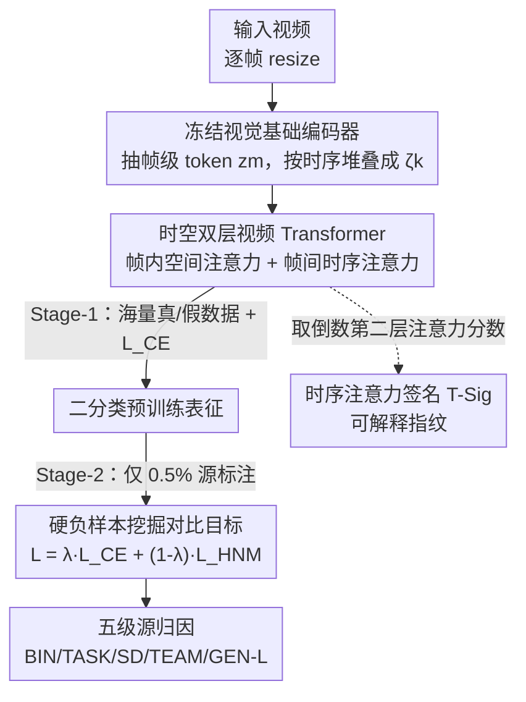

# SAGA: Source Attribution of Generative AI Videos

**会议**: CVPR 2026  
**论文**: [CVF Open Access](https://openaccess.thecvf.com/content/CVPR2026/html/Kundu_SAGA_Source_Attribution_of_Generative_AI_Videos_CVPR_2026_paper.html)  
**代码**: 无（项目页 https://rohit-kundu.github.io/SAGA ）  
**领域**: AI 安全 / 合成视频取证  
**关键词**: 视频源归因, 合成视频取证, 数据高效, 对比学习, 可解释性

## 一句话总结
SAGA 把"这段视频是不是 AI 生成的"升级为"它出自哪个生成器"——用冻结视觉大模型特征 + 时空双层 Transformer，配合"先二分类预训练、再用 0.5% 标注做对比适配"的两阶段策略，在 19 个视频生成器上实现从真假到具体模型的五级源归因，并用时序注意力签名（T-Sig）首次可视化解释"为什么不同生成器可区分"。

## 研究背景与动机
**领域现状**：面对越来越逼真的 AI 生成视频，目前主流防御几乎全是二分类的"真/假检测"（real/fake detection），如 DeMamba、UNITE 等，只回答"这段视频是不是合成的"。

**现有痛点**：随着生成模型爆发式增长，只知道"是假的"远远不够——数字取证、知识产权追责、定向对抗都需要知道"它出自哪个模型/团队"。而源归因（source attribution）此前几乎只在**静态图像**上做过；唯一一篇做视频归因的工作（Vahdati et al.）只覆盖 4 个闭源生成器、且只做生成器级单一粒度。

**核心矛盾**：视频归因比图像归因难得多，作者点出三道坎：① **时序指纹**——视频在生成过程中留下独特的帧间运动伪影，静态图像分析完全捕捉不到；② **模型多样性更大**——视频生成涉及帧合成、运动模型等更多阶段，归因空间远比图像庞大；③ **视频压缩**——编解码引入复杂时空伪影，会掩盖甚至摧毁生成器特有的微弱痕迹。再叠加一个现实困境：真假二分类标注海量易得，但**细粒度源标注极度稀缺**。

**本文目标**：构建一个能在实战中部署、数据高效、且**可解释**的大规模视频源归因框架，并把"归因"从单一的生成器级拆成多个粒度。

**切入角度**：作者观察到不同生成器在**时序注意力**上留下稳定且独特的"指纹"，且这种指纹即便对训练中没见过的生成器也能区分——于是把时序自注意力同时当作判别特征和解释工具。

**核心 idea**：用"冻结大模型特征 + 时空双层 Transformer"捕捉时序伪影，再用"二分类预训练 → 对比式适配"的两阶段范式把海量真假标注的知识迁移到只有 0.5% 源标注的多类归因上。

## 方法详解
给定视频 $x_k$，目标是从 $n_c$ 个候选类别中预测其源标签 $y_k$：二分类时 $n_c=2$，源归因时 $n_c>2$。SAGA 的整体思路是**不从零训练一个 $n_c$ 类模型**，而是先在丰富的真/假数据上预训练一个二分类视频 Transformer（Stage-1，只用交叉熵 $L_{CE}$），再把它适配成细粒度归因模型（Stage-2，引入对比目标，只用 0.5% 源标注）。预训练只做一次，作为所有归因粒度的共同起点。

SAGA 把源归因刻画为**五级粒度**（统一记作"-L"）：BIN-L（真/合成）、TASK-L（真 vs T2V vs I2V）、SD-L（区分 Stable Diffusion 版本）、TEAM-L（归到开发团队）、GEN-L（具体生成器 ID）。这种分级在实战里很关键：当两个生成器极其相似、GEN-L 给出低置信度时，更粗的 SD 版本或团队层级仍能提供有价值的取证线索。

### 整体框架
输入是一段视频，逐帧 resize 后送入**冻结的视觉基础编码器**（web 规模图文预训练，提供尽量域无关的特征以缓解真实部署中的 domain gap），每帧得到 token 嵌入 $z_m \in \mathbb{R}^{l_t \times d_t}$，按时序堆叠成视频级表示 $\zeta_k \in \mathbb{R}^{L \times l_t \times d_t}$（$L$ 为帧数）。$\zeta_k$ 进入**可训练的时空双层 Transformer** $\theta$ 得到 $\phi_k = \theta(\zeta_k)$。Stage-1 用分类头 $\beta_1$ 把 $\phi_k$ 映到真/假，跑 $L_{CE}$；Stage-2 把这个预训练的 Transformer 适配到 $n_c$ 类归因，额外加上硬负样本挖掘对比损失 $L_{HNM}$。同时，从时序编码器倒数第二个 block 的注意力分数里抽出 T-Sig 作为可解释指纹。

### 关键设计

**1. 两阶段"预训练—适配"范式：用海量真假标注补上稀缺的源标注**

这一步直击"真假标注多、源标注少"的现实困境。作者不直接训多类模型，而是 Stage-1 先在丰富的真/假数据上用 $L_{CE}$ 预训练出一个强二分类视频 Transformer，建立起对"合成痕迹"的通用表征；Stage-2 再把这个底座适配到 $n_c$ 类源归因，**每类只用 0.5% 的标注样本**。关键收益是数据效率：在 GEN-L（最难的生成器级）任务上，仅用 0.5% 标注的两阶段方案做到 94.99% 平均准确率，逼近用 100%（约 160 万训练数据）标注的全监督结果（97.41%）。预训练只做一次，五个粒度共用同一起点，省去了为每个粒度各训一个大模型的开销。

**2. 时空分层视频 Transformer：把"帧内空间"和"帧间时序"拆开建模**

针对"视频特有时序指纹被静态分析漏掉"的痛点，$\theta$ 以分层方式处理 $\zeta_k$：先做**空间编码**——对每帧的 $l_t$ 个 token 各自过一个标准 Transformer encoder block 精化，再在 token 维度平均池化，得到每帧一个 $\mathbb{R}^{d_t}$ 特征向量；再做**时序编码**——给 $L$ 个帧向量加正弦位置编码注入时序顺序，过 $D=\text{depth}+1$ 个堆叠的 encoder block，每个 block 含 $N_h=12$ 头的多头自注意力 + LayerNorm + 残差 + dropout + GELU 前馈网络，逐层建出越来越复杂的时序动态/不一致表征。冻结的大模型只提供域无关的帧级底特征，时序判别全交给这层可训练 Transformer，从而专门捕捉跨帧运动伪影。

**3. 硬负样本挖掘（HNM）对比目标：强行掰开几何上重叠的生成器簇**

GEN-L 任务里很多生成器的嵌入在 t-SNE 上严重重叠，作者发现**只用 $L_{CE}$ 不够**——交叉熵在 logit 空间最大化类间可分，却不约束嵌入空间的几何分离。常用的半硬负样本（semi-HNM）只挑"比正样本远、但落在 margin 内"的负样本（满足 $\|a-p\|_2^2 < \|a-n\|_2^2 < \|a-p\|_2^2+\alpha$），而在重叠严重时大量负样本是**硬负样本**（$\|a-n\|_2^2 \le \|a-p\|_2^2$）、被 semi-HNM 直接丢弃，梯度信号不足。HNM 则始终在 batch 内选最难的负样本 $n_{\text{hard}} = \arg\min_{j:\,y_j \ne y_i}\|a_i-n_j\|_2^2$，其梯度 $\nabla_\theta L_{HNM} \propto 2(a-n_{\text{hard}}) - 2(a-p)$ 直接把锚点推离最近的异类样本，即使簇重叠也能强制分离，等价于最大化最小类间 margin $\alpha$。最终损失为 $L = \lambda \cdot L_{CE} + (1-\lambda)\cdot L_{HNM}$。效果对比鲜明：CE+semi-HNM 在 GEN-L 只有 70.31% 平均准确率，换成 CE+HNM 直接拉到 94.99%。

**4. 时序注意力签名（T-Sig）：把"为什么可区分"画出来**

这是 SAGA 的可解释性贡献，回答了此前合成视频归因文献里没人解释的问题——为什么不同生成器能被区分。做法是从时序编码器**倒数第二个** encoder block 的多头自注意力分数里，对同一源的大量视频做帧间注意力平均、归一化，得到该源独有的"指纹" T-Sig。这些签名捕捉的是稳定但微妙的时序伪影（特征性的运动动态、帧间不一致）。关键观察：① 同源视频尽管内容各异、T-Sig 却高度一致，异源之间则视觉上明显不同；② 即便是**完全没见过的生成器**也能产出独特且可辨的 T-Sig，说明模型学到的是合成生成的根本时序特性、而非记忆训练模式——这给开放集识别（给新生成器内容打标）提供了潜力。

### 损失函数 / 训练策略
- Stage-1：仅交叉熵 $L_{CE}$，在海量真/假视频上预训练二分类视频 Transformer。
- Stage-2：$L = \lambda \cdot L_{CE} + (1-\lambda)\cdot L_{HNM}$，仅用每类 0.5% 源标注适配到 $n_c$ 类归因；三元组 margin 约束为 $\|a-p\|_2^2 + \alpha < \|a-n\|_2^2$。
- T-Sig 在推理期从倒数第二个时序 block 抽注意力分数、跨视频平均归一化，不引入额外训练目标。

## 实验关键数据

数据集：训练用 DeMamba（19 个生成器 + 100 万真实视频），跨数据评测用 DVF（8 个生成器）。三种训练制式对比：1-stage@0.5% 数据、1-stage@100% 数据、本文 2-stage@0.5% 数据。

### 主实验：二分类（BIN-L）跨数据 SOTA 对比

| 数据集 | 方法 | Accuracy |
|--------|------|----------|
| DeMamba（域内） | MINTIME-CLIP-B | 89.98% |
| DeMamba（域内） | FTCN-CLIP-B | 89.67% |
| DeMamba（域内） | **SAGA (BIN-L)** | **99.94%** |
| DVF（跨数据） | DVF（域内训练） | 92.00% |
| DVF（跨数据） | HifiNet | 84.30% |
| DVF（跨数据） | **SAGA（仅在 DeMamba 上训）** | **95.39%** |

SAGA 在 DVF 上是**纯跨数据集**评测（只在 DeMamba 训练、直接测 DVF），仍超过所有在 DVF 上做域内训练的 SOTA，体现强泛化与抗域偏移能力。

### 多粒度归因：两阶段把低数据塌缩拉回全监督水平

| 任务粒度 | 1-stage@0.5% | 1-stage@100% | **2-stage@0.5%（本文）** |
|----------|-------------|--------------|--------------------------|
| TASK-L（整体） | 82.41% | 99.96% | **98.20%** |
| SD-L（整体） | 59.77% | 98.35% | **98.49%** |
| TEAM-L（整体） | 80.55% | 94.94% | **97.77%** |
| GEN-L（整体） | 24.55% | 97.41% | **94.99%** |

低数据下单阶段会在难类上整段塌缩——如 SD-L 里 SD 1.4/1.5 直接 0%、TEAM-L 里 OpenAI/Shanghai AI Lab-2 接近 0%、GEN-L 整体仅 24.55%；两阶段把它们几乎全部救回，只用 0.5% 标注就逼近甚至偶尔超过 100% 数据设置。

### 消融实验：损失函数对 GEN-L 的影响

| 配置（GEN-L，0.5% 数据） | 整体 Accuracy | 说明 |
|--------------------------|---------------|------|
| 1-stage，$L_{CE}$ only | 24.55% | 交叉熵在低数据下严重塌缩 |
| 1-stage，$L_{CE}+L_{HNM}$ | 65.80% | 加硬负挖掘大幅回升 |
| 2-stage，$L_{CE}$ only | 55.13% | 仅靠两阶段不够 |
| **2-stage，$L_{CE}+L_{HNM}$（本文）** | **94.99%** | 两阶段 + HNM 协同最优 |

另一组对照：CE + semi-HNM 在 GEN-L 仅 70.31%，换成 CE + HNM 升到 94.99%，印证半硬负样本会漏掉重叠簇里的硬负样本、梯度不足。

### 关键发现
- **HNM 是细粒度归因的胜负手**：越细的粒度（GEN-L）越依赖嵌入空间的几何分离，HNM 通过始终挑最难负样本强行掰开重叠簇，单这一项就把 GEN-L 从 70.31%（semi-HNM）拉到 94.99%。
- **两阶段补的是"低数据稳健性"**：单阶段在难类上整段归零，两阶段几乎逐类救回，说明二分类预训练表征确实迁移到了细粒度归因。
- **粗监督也能分细生成器**：t-SNE 显示即便只在 TASK-L/SD-L/TEAM-L 这类粗标签下训练，模型也常把组内的单个生成器分开，且能让 Hotshot、Show 1、MorphStudio 等**未见生成器**形成可分簇，暗示开放集泛化潜力。

## 亮点与洞察
- **"五级粒度"是务实的取证设计**：当 GEN-L 对相似生成器没把握时，退回 SD 版本/团队层级仍给得出有用线索，比单一生成器级输出在实战里鲁棒得多。
- **把注意力分数一物两用**：同一套时序自注意力既是判别特征、又被平均成 T-Sig 当解释指纹，且对未见生成器也成立——这种"判别即解释"的设计可迁移到图像取证、异常检测等需要可解释指纹的场景。
- **用海量易得标注补稀缺标注**的两阶段范式，本质是把"真假检测"当作源归因的自监督式预训练，思路可推广到任何"粗标签丰富、细标签稀缺"的分级分类任务。

## 局限与展望
- 依赖冻结视觉基础编码器的特征质量，论文未深入讨论编码器选择对最终归因的敏感性（⚠️ 实现细节多在补充材料，正文未展开）。
- GEN-L 上仍有个别困难生成器表现不稳（如 2-stage 下 DynamiCrafter 仅 56.64%、Sora 73.33%），相似架构生成器之间的混淆尚未完全解决。
- 抗视频压缩/再编码的鲁棒性虽被列为动机三大难点之一，但正文未给出系统的压缩鲁棒性实验（⚠️ 以原文/补充为准）。
- T-Sig 目前是定性可视化解释，缺乏定量的可解释性度量；开放集识别也只是 t-SNE 上的潜力观察，未形成完整的开放集归因协议。

## 相关工作与启发
- **vs 二分类视频检测（DeMamba、UNITE）**: 它们只回答"真/假"，SAGA 把任务推进到"出自哪个模型/团队"的多粒度归因；且 SAGA 在 BIN-L 上跨数据集仍超过这些域内训练的检测器。
- **vs 图像源归因（POSE、Wang et al. 的逆向重建）**: 这些方法面向静态图像、无法处理视频特有的时序与运动伪影；SAGA 用时空双层 Transformer 专门建模帧间不一致。
- **vs 唯一的视频归因工作（Vahdati et al.）**: 后者只覆盖 4 个闭源生成器、单一生成器级；SAGA 在 19 个开源生成器上做五级归因，并加入可解释的 T-Sig 分析。

## 评分
- 新颖性: ⭐⭐⭐⭐⭐ 首个大规模、多粒度的 AI 视频源归因框架，T-Sig 首次为"为什么可区分"提供可视化解释。
- 实验充分度: ⭐⭐⭐⭐⭐ 19 个生成器、五级粒度、域内+跨数据集、多损失/多数据制式消融齐全。
- 写作质量: ⭐⭐⭐⭐ 动机三难点清晰、方法叙述完整，但不少实现与压缩鲁棒性细节甩到补充材料。
- 价值: ⭐⭐⭐⭐⭐ 直击生成式 AI 治理与数字取证的现实刚需，数据高效特性利于落地。

<!-- RELATED:START -->

## 相关论文

- [\[CVPR 2026\] Enabling Supervised Learning of Generative Signatures for Generalized AI-Generated Images Detection](enabling_supervised_learning_of_generative_signatures_for_generalized_ai-generat.md)
- [\[ICLR 2026\] Watermark-based Detection and Attribution of AI-Generated Content](../../ICLR2026/ai_safety/watermark-based_attribution_of_ai-generated_content.md)
- [\[CVPR 2026\] SAIDO: 基于场景感知与重要性引导动态优化的可泛化 AI 生成图像检测](saido_generalizable_detection_of_ai-generated_images_via_scene-aware_and_importa.md)
- [\[CVPR 2026\] GVIS: Generative Vector Image Steganography](gvis_generative_vector_image_steganography.md)
- [\[CVPR 2026\] TokenTrace: Multi-Concept Attribution through Watermarked Token Recovery](tokentrace_multi-concept_attribution_through_watermarked_token_recovery.md)

<!-- RELATED:END -->
