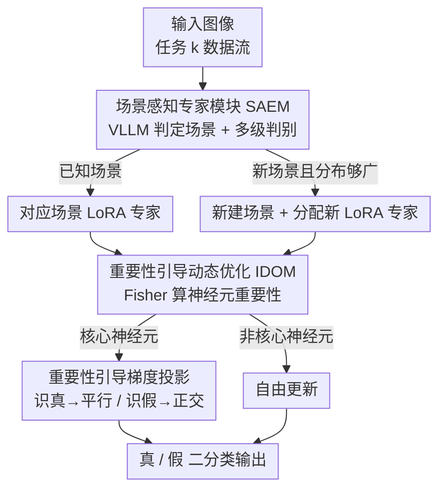

# SAIDO: 基于场景感知与重要性引导动态优化的可泛化 AI 生成图像检测

**会议**: CVPR 2026  
**论文**: [CVF Open Access](https://openaccess.thecvf.com/content/CVPR2026/html/Hu_SAIDO_Generalizable_Detection_of_AI-Generated_Images_via_Scene-Aware_and_Importance-Guided_CVPR_2026_paper.html)  
**代码**: 无  
**领域**: AI安全 / AI生成图像检测  
**关键词**: AIGI检测, 持续学习, 灾难性遗忘, 梯度投影, LoRA专家

## 一句话总结
SAIDO 把 AI 生成图像检测做成一个免回放的持续学习框架：用大视觉语言模型把图像按场景分流到各自的 LoRA 专家，再用基于 Fisher 信息的"神经元级"重要性引导梯度投影来调和可塑性与稳定性，在持续学习与开放世界两个协议上分别把检测错误率降低 44.22%、把开放集准确率提升 9.47%。

## 研究背景与动机
**领域现状**：AI 生成图像检测（AIGI detection）的主流做法是数据驱动的判别式模型——从频率分布、纹理结构、语义一致性等线索里学习真实图像与生成图像的差异，在高维特征空间画决策边界。这类方法在闭集（训练/测试同分布）下表现不错。

**现有痛点**：生成模型迭代极快（从 ProGAN 到 Stable Diffusion 再到 Midjourney/FLUX），不同生成域之间的分布鸿沟越拉越大。检测器在适配新生成器时会发生**灾难性遗忘**，旧生成方法上的性能急剧塌方。已有的持续学习检测方案大多依赖**回放（replay）**历史样本来缓解遗忘——而在真实场景里，存储和重放旧样本往往不可行；同时这些方法在面对多样化场景内容时扩展性差、泛化弱。

**核心矛盾**：持续学习里的可塑性（plasticity，学新生成器）与稳定性（stability，记住旧生成器）之间存在 trade-off。已有基于梯度投影的方法（如 RegO）虽然不用回放缓冲，但它只能用一个阈值把神经元粗粒度地一刀切，无法对"哪些神经元该保旧、哪些该学新"做精细调控，于是稳定性和可塑性两头都不够好。此外，现有方法把所有场景内容塞进同一个检测器，场景域漂移会直接拖垮性能。

**本文目标**：在不依赖回放、且要应对多种生成方法 + 多样场景域的现实约束下，做到对新生成器/新场景的高效适配与强泛化。

**切入角度**：作者把"场景泛化"和"持续学习遗忘"拆成两个正交的问题分别解决——场景维度用**专家分流**（不同场景各管各的），生成器维度用**神经元级的梯度调控**（精细到单个神经元决定保旧还是学新）。

**核心 idea**：用 VLLM 按场景动态分配 LoRA 专家来吃掉场景漂移，再用 Fisher 重要性把神经元分成"核心/非核心"、对核心神经元做方向自适应的梯度投影，从而在神经元粒度上实现"稳定—可塑"动态平衡。

## 方法详解

### 整体框架
SAIDO 以冻结的 CLIP ViT-L/14 为骨干，由两个模块串起来：**SAEM（场景感知专家模块）**负责"把图像分到正确的专家手里"，**IDOM（重要性引导动态优化机制）**负责"训练这些专家时既学新又不忘旧"。

一张输入图像先进 SAEM：VLLM 判定它属于哪个场景（动物/食物/车辆/建筑……），落到对应场景的 LoRA 专家上；该专家在 CLIP 骨干之上做真假二分类。当遇到一个全新场景时，SAEM 经过多级判别确认这个场景在现实里足够普遍后，才新建场景标签并分配一个新的 LoRA 专家。训练（更新 LoRA）这一步交给 IDOM：它用 Fisher 信息矩阵算出每个神经元对"识真"和"识假"的重要性，把神经元分成核心/非核心，对核心神经元施加方向自适应的梯度投影（保护旧知识 / 学习新模式），非核心神经元自由更新。

### 关键设计

**1. SAEM：用 VLLM 把场景漂移拆给一群 LoRA 专家**

痛点直说：把所有场景内容塞进同一个检测器，动物图、食物图、车辆图的内容分布差异会被检测器误当成"真假信号"，造成场景域漂移下的性能塌方；而开放世界里场景是动态新增的，手工定义固定分类器根本盖不全。SAEM 的做法是让 VLLM 先做场景感知：对输入 $x$ 跑 $p=\text{VLLM}(x)$，得到在所有已知场景上的置信分布 $p=[p_1,\dots,p_N,p_{N+1}]\in\mathbb{R}^{N+1}$，其中 $p_{N+1}$ 是"这是个新场景"的置信。取最大置信对应的场景把图像分流到该场景的 LoRA 专家 $\phi_n\leftarrow\max[p_1,\dots,p_{N+1}]$，最终预测 $\hat{y}=f_{\phi+\phi_n}(x)$，每个专家只在自己场景内学习伪造痕迹。

新场景的纳入不是一判定就建专家，而是一个**多级判别**：先看新场景置信是否超过阈值，再追问"这个场景在现实世界里分布是否足够广泛"，两关都过才正式新建场景标签、分配新 LoRA 专家 $\phi_{N+1}$。为了把场景/内容信息注入高层语义空间，作者设计了 **Scene-Aware Prompts (SAP)**：$l_\text{SAP}=[l_\text{content};l_\text{scene};l_\text{common}]$，其中 $l_\text{content}$ 是 VLLM 生成的图像内容描述、$l_\text{scene}$ 是场景文本、$l_\text{common}$ 用 "real"/"fake" 这类公共词在语义空间里区分真假特征。训练时用 CLIP 文本编码器取 $l_\text{SAP}$ 的特征 $u$、图像编码器取 $v$，做双向对比损失 $\mathcal{L}_\text{contrastive}=(\mathcal{L}_{v\to u}+\mathcal{L}_{u\to v})/2$，再叠加交叉熵分类损失，总损失 $\mathcal{L}_\text{loss}=\mathcal{L}_\text{contrastive}+\lambda\mathcal{L}_\text{CE}$。一个有意思的观察是：在多个真实数据集上，场景集合会**自然收敛稳定**，说明"按场景建专家"确实抓到了泛化的结构，而不是无限制地膨胀专家数。

**2. IDOM：在神经元粒度上决定哪些保旧、哪些学新**

即便分了场景专家，同一场景内不断冒出新生成器时，专家本身还是会遗忘。已有的梯度投影方法 RegO 用一个阈值把神经元粗暴二分，缺乏细粒度调控，稳定性和可塑性都受限。IDOM 的核心是把"保旧 vs 学新"的决策下沉到**单个神经元 + 真/假两类**的粒度。

具体地，先用 Fisher 信息矩阵量化神经元重要性：$\mathbf{F}_k^{(c)}=\mathbb{E}[g_k^{(c)}(g_k^{(c)})^\top|_{\theta=\theta_k^*}]$，其中 $c\in\{0,1\}$ 区分真(0)/假(1)样本，$\theta_k^*$ 是任务 $k$ 训练后的最优参数。再按场景归一化聚合得到神经元重要性 $I_k^{(c)}$，用 $\alpha$-分位数函数挑出核心神经元：$M_k^{(c)}[i][j]=1$ 当 $I_k^{(c)}[i][j]\ge Q_\alpha(I_k^{(c)})$，否则为 0；从第二个任务起把历史 $M$ 聚合成综合掩码 $\overline{M}$。

关键洞察是**真假特征的稳定性不对称**：真实图像特征紧凑稳定，而假图特征随生成方法剧烈变化、最容易被遗忘。于是对核心神经元做**方向自适应**的投影——对"识真"重要的神经元，把当前梯度 $g$ 投影到旧梯度 $\hat{g}$ 方向得到平行分量 $g_p=\frac{g^\top\hat{g}}{\|\hat{g}\|^2}\cdot\hat{g}$（严格保旧）；对"识假"重要的神经元，取正交分量 $g_o=g-g_p$（学新而不干扰旧表示）。用历史重要性比值算控制因子 $q_0=\frac{\tilde{I}_k^{(0)}}{\tilde{I}_k^{(0)}+\tilde{I}_k^{(1)}}$、$q_1=1-q_0$ 自适应混合两个方向；再用重要性缩放 $u_k=\frac{1}{1+e\cdot\bar{I}_i}$ 抑制对高重要性神经元的剧烈更新。核心神经元最终梯度 $g_A=u_k\cdot(q_0 g_p+q_1 g_o)\odot\mathbb{I}_{\overline{M}=1}$，非核心神经元自由更新 $g_B=g\odot\mathbb{I}_{\overline{M}=0}$，整体更新 $w=g_A+g_B$。这套机制让"保护识真能力、灵活更新识假能力"在神经元尺度上同时发生，从而免回放也能压住遗忘。

## 实验关键数据

数据集：持续学习（Protocol 1）按顺序学 9 个生成器 {ADM, GLIDE, SAGAN, ProGAN, BigGAN, Wukong, SD1.5, VQDM, Midjourney-V5}；开放世界（Protocol 2）用 6 个未见过的先进生成器 {StyleGAN-xl, R3GAN, FLUX1-dev, Midjourney-V6, SD3, Imagen3} 测泛化。指标：AA（平均准确率，越高越稳）、AF（平均遗忘率，越低越好）、New.ACC（当前任务准确率，反映可塑性）。骨干 CLIP ViT-L/14，SGD（lr 0.01，10 epoch），$\alpha=0.75$、$\lambda=1.0$、$e=1.0$。

### 主实验（Protocol 1：持续学习，学完全部 9 个任务后）

| 方法 | 持续学习 | 回放 | AA(↑) | AF(↓) | New.ACC(↑) |
|------|:------:|:----:|:-----:|:-----:|:----------:|
| CLIP+LoRA（近似上界） | × | × | 89.63 | 11.17 | 99.56 |
| Universe (CVPR'23) | × | — | 80.59 | 14.46 | 93.45 |
| NPR (CVPR'24) | × | — | 81.92 | 15.17 | 95.40 |
| AIDE (ICLR'25) | × | — | 87.38 | 12.07 | 96.47 |
| EWC (PNAS'17) | ✓ | × | 91.01 | 9.14 | 97.07 |
| RegO (AAAI'25) | ✓ | × | 86.34 | 11.30 | 90.04 |
| Tang et al. (TIFS'25) | ✓ | ✓ | 92.13 | 6.63 | 92.88 |
| **SAIDO (本文)** | ✓ | **×** | **95.61** | **3.94** | **97.27** |

即便**不用回放缓冲**，SAIDO 的 AA/AF 也全面超过用回放的 Tang et al.；相比次优方法，检测错误率相对下降 44.22%、平均遗忘率相对下降 40.57%，同时 New.ACC 97.27% 说明可塑性也没有牺牲。

开放世界（Protocol 2，6 个未见生成器）平均准确率 SAIDO 达 **91.35%**，比次优的 Tang et al.（81.88%）高 **9.47%**，在 R3GAN（97.83）、FLUX1-dev（88.10）等难样本上优势尤其明显。

### 消融实验（Protocol 1，看最后一个任务 Midjourney-V5 的 AA）

| 配置 | Midjourney-V5 AA | 说明 |
|------|:----------------:|------|
| CLIP+SAEM | 88.85 | 只有场景专家，无 IDOM，遗忘控制弱 |
| CLIP+SAEM+RAO | 92.89 | 专家 + RegO 的梯度策略，仍逊于 IDOM |
| CLIP+IDOM | 94.81 | 只有 IDOM（无场景分流），已很强 |
| **SAIDO (SAEM+IDOM)** | **95.61** | 完整模型最优 |

### 关键发现
- **IDOM 是遗忘控制的主力**：把梯度策略从 RegO 的 RAO 换成 IDOM（CLIP+SAEM+RAO → SAIDO），最后任务 AA 从 92.89 提到 95.61，说明神经元级方向自适应投影优于阈值粗分。
- **SAEM 的收益依赖场景漂移强度**：当各任务场景分布较集中、漂移温和时，单个 LoRA 多吃数据反而略好，所以 CLIP+IDOM 在部分任务上也能拿最优；SAEM 的价值在场景域真正分散的开放世界更突出。
- **鲁棒性**（Table 4）：在 JPEG 压缩、高斯噪声、上下采样三种退化下，SAIDO 在已知/未见生成器上的平均准确率（AA1 88.79 / AA2 81.40）整体最佳，说明它学到的特征对常见退化更稳。

## 亮点与洞察
- **"真假特征稳定性不对称"是个可复用的先验**：真图特征紧凑稳定、假图特征随生成器剧变——据此把"识真"神经元做平行投影保护、"识假"神经元做正交更新学新，比对所有参数一视同仁更合理。这条思路可迁移到任何"旧概念稳定、新概念多变"的持续学习场景。
- **用 VLLM 做"路由器"而非分类器**：让大模型只负责把样本分流到轻量专家，既吃到 VLLM 的开放世界语义、又把检测交给可持续训练的小 LoRA，是一种低成本利用基础模型的范式。
- **场景集合会自然收敛**这个经验观察很有意思：说明现实图像的场景多样性是有界的，"按场景建专家"不会无限膨胀，让方案在工程上可落地。
- **免回放**是实用性的关键卖点——不存历史样本就能压住遗忘，契合隐私/存储受限的真实部署。

## 局限与展望
- 强依赖 VLLM 的场景判定质量：场景误判会把图像送错专家，正文未给出 VLLM 选型/场景错分对端到端性能影响的充分分析（作者称在补充材料里讨论，⚠️ 以原文为准）。
- 专家数随场景增长，虽有"分布够广才新增"的闸门，但在极端长尾的开放世界里专家数与推理路由开销的可扩展上界仍需验证。
- 消融显示场景漂移温和时 SAEM 收益有限甚至不如单 LoRA，说明该框架的优势区间偏向"多样且分散的场景域"，在窄域任务上可能过度设计。
- 多个核心公式来自 OCR 文本（Eq. 5/7/13 等），细节符号建议以原文/补充材料为准。

## 相关工作与启发
- **vs RegO（AAAI'25，梯度投影持续学习）**：两者都基于梯度投影且免回放，但 RegO 用单阈值把神经元粗分、无法细粒度调控；SAIDO 的 IDOM 把重要性细化到"神经元×真/假"，并按真假稳定性差异做方向自适应投影，因此稳定性与可塑性都更好（消融里 IDOM 全面压过 RAO）。
- **vs Tang et al.（TIFS'25，内容无关 adapter）**：Tang 用回放 + 内容无关适配器；SAIDO 免回放、且反其道而行——不是抹掉内容/场景信息，而是按场景显式分流专家来吃掉场景漂移，开放世界泛化高出 9.47%。
- **vs DFIL / 回放类方法**：回放需要存储和重放历史样本，现实里常不可行；SAIDO 用神经元级梯度调控替代回放，更贴合隐私/存储受限的部署约束。

## 评分
- 新颖性: ⭐⭐⭐⭐ 把"场景专家分流"与"神经元级真假分治的梯度投影"组合用于 AIGI 持续检测，角度新颖。
- 实验充分度: ⭐⭐⭐⭐ 两协议 + 鲁棒性 + 消融 + 多顺序，覆盖较全；VLLM 选型敏感性等放在补充材料。
- 写作质量: ⭐⭐⭐⭐ 动机与方法逻辑清晰，公式较多但脉络连贯。
- 价值: ⭐⭐⭐⭐ 免回放、强开放世界泛化，对真实部署的 AIGI 检测有实用意义。

<!-- RELATED:START -->

## 相关论文

- [\[CVPR 2026\] Detect Any AI-Counterfeited Text Image](detect_any_ai-counterfeited_text_image.md)
- [\[CVPR 2026\] SAGA: Source Attribution of Generative AI Videos](saga_source_attribution_of_generative_ai_videos.md)
- [\[CVPR 2026\] Skyra: AI-Generated Video Detection via Grounded Artifact Reasoning](skyra_ai-generated_video_detection_via_grounded_artifact_reasoning.md)
- [\[CVPR 2026\] Detecting Compressed AI-Generated Images via Phase Spectrum Robustness](detecting_compressed_ai-generated_images_via_phase_spectrum_robustness.md)
- [\[CVPR 2026\] Zero-shot Detection of AI-Generated Image via RAW-RGB Alignment](zero-shot_detection_of_ai-generated_image_via_raw-rgb_alignment.md)

<!-- RELATED:END -->
