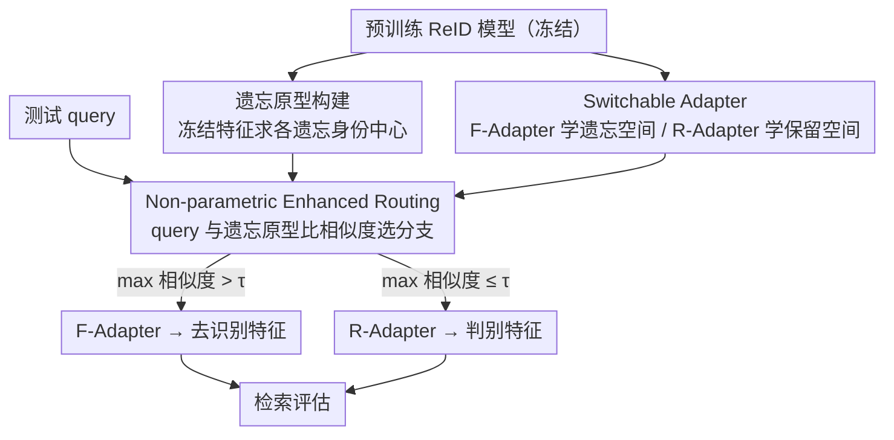

# SANER: Switchable Adapter with Non-parametric Enhanced Routing for Person De-Reidentification

**会议**: CVPR 2026  
**论文**: [CVF Open Access](https://openaccess.thecvf.com/content/CVPR2026/html/Liu_SANER_Switchable_Adapter_with_Non-parametric_Enhanced_Routing_for_Person_De-Reidentification_CVPR_2026_paper.html)  
**代码**: https://github.com/Yimin-Liu/SANER  
**领域**: AI安全（隐私保护 / 机器遗忘）  
**关键词**: 人物去重识别、机器遗忘、隐私保护、LoRA 适配器、测试时路由

## 一句话总结
SANER 把"选择性遗忘特定行人"的去重识别（De-ReID）从单一特征空间里的矛盾优化拆成两个独立的低秩适配器（遗忘 / 保留），再用一个非参数的测试时路由算法按 query 与原型的相似度决定走哪条分支，从而在几乎不损伤其他身份识别精度的前提下彻底"忘掉"目标身份。

## 研究背景与动机
**领域现状**：行人重识别（ReID）在跨摄像头检索上已很成熟，但它依赖人脸、外观等敏感生物特征，带来隐私与伦理风险。由此衍生出隐私保护范式——人物去重识别（De-ReID）：借鉴机器遗忘思想，主动"遗忘"指定个体，同时对其他身份保持高检索精度。

**现有痛点**：现有 De-ReID 方法（如 VIS）把"遗忘"和"保留"两个目标放在**同一个特征空间**里联合优化。但这两个目标本质矛盾——压低遗忘身份的可分性，会连带污染保留身份（尤其是训练时没见过的 novel query）的表示，导致它们的识别性能意外下降。这一点在以往工作里被严重忽视。

**核心矛盾**：在一个共享特征空间里同时满足"对 A 身份不可识别"和"对 B 身份高可识别"两个相反约束，必然此消彼长。一个自然的解法是把预训练特征空间**解耦**成"遗忘子空间"和"保留子空间"分别优化。

**本文目标**：(1) 设计一种能解耦特征空间、让遗忘与保留互不干扰的机制；(2) 解决解耦带来的新难题——测试时来一个 novel query，怎么判断它该走遗忘空间还是保留空间（作者称之为"test-time routing problem"）。

**切入角度**：用两个独立的低秩适配器（LoRA）分别承载两个子空间，既解耦又参数高效；路由问题不去训一个易过拟合的分类器，而是回到原始预训练特征空间里、用 query 与遗忘原型的相似度做非参数判断。

**核心 idea**：**"解耦特征空间 + 非参数测试时路由"**——用 Switchable Adapter（SA）把矛盾的两个目标拆到两条分支，用 Non-parametric Enhanced Routing（NER）在测试时无训练地选对分支。

## 方法详解

### 整体框架
SANER 分训练、测试两个阶段。训练阶段：每个样本先被打上路由变量 $R\in\{0,1\}$ 标明是遗忘样本还是保留样本，再送进 Switchable Adapter 里对应的分支——遗忘样本走 F-Adapter（用遗忘损失 $L_f$ 优化，抹掉身份语义），保留样本走 R-Adapter（用保留损失 $L_r$ 优化，保住判别力）；与此同时，冻结的预训练模型在原始特征空间里为每个遗忘身份算好原型。测试阶段：query 先用冻结预训练模型抽原始特征，由 NER 比对它与遗忘原型的相似度决定路由到哪个 adapter，再用选中的分支抽取最终特征做检索。整个路由发生在与训练无关的预训练特征空间里，规避了训练-测试 gap。

### 关键设计

**1. Switchable Adapter：用两个独立 LoRA 把遗忘与保留拆进两个子空间**

针对"单一特征空间里两目标互相污染"的痛点，SA 用两个独立的低秩适配器承载两个互斥目标。标准 LoRA 把预训练权重 $W$ 的更新写成低秩残差，从特征映射视角看是 $f^*=W^*x=Wx+(BA)x=f+\Delta f$。SANER 据此造两条分支：F-Adapter 把输入映到"遗忘空间"$f_f=f+B_fA_f x$，压制身份语义实现去识别；R-Adapter 把输入映到"保留空间"$f_r=f+B_rA_r x$，保住判别线索。训练时按路由变量 $R$ 分流，联合损失为 $L(x,y,R)=(1-R)L_r(f_r,y)+RL_f(f_f,y)$，其中 $L_f$、$L_r$ 沿用 VIS 的去识别训练目标。这样两个相反目标分别在各自子空间优化、互不打架——遗忘损失再也不会"溢出"去伤害保留身份的表示，这正是单空间方法做不到的。$r\ll d$ 的低秩设计也让解耦几乎不增计算。

**2. Non-parametric Enhanced Routing：测试时无训练地把 query 送对分支**

解耦带来一个新麻烦：测试时来一个 novel query，没法直接知道它属于遗忘还是保留身份。直觉做法是训一个分类器，但分类器在遗忘身份很少时极易过拟合、且有训练-测试 gap，路由很不可靠（消融见下）。NER 改走**非参数**路线：训练阶段就用冻结的预训练模型为每个遗忘身份 $i$ 算原型 $p_f^i=\frac{1}{|D_f^i|}\sum_{x\in D_f^i}f_p(x)$；测试时把 query 特征 $q=f_p(x)$ 与所有遗忘原型算余弦相似度 $s_i=\frac{q\cdot p_f^i}{\|q\|\|p_f^i\|}$，再按最大相似度判路由：$\hat{y}=1$（走 F-Adapter）当 $\max(s)>\tau$，否则 $\hat{y}=0$（走 R-Adapter）。阈值 $\tau$ 用**自适应最小距离策略**——取不同身份原型之间观测到的最大相似度。最终选中分支的权重写成 $W^*=W+(1-\hat{y})\Delta W_r+\hat{y}\Delta W_f$。由于整个判断都在强大的预训练相机不变特征空间里完成、且不含可训练参数，它既没有训练-测试 gap，也不会像分类器那样在遗忘身份稀少时崩掉。

### 损失函数 / 训练策略
backbone 为 ViT-B，SA 并联在每个 Transformer block 的注意力投影和两个 MLP 全连接层上。优化器 AdamW，初始学习率 $3\times10^{-4}$、weight decay 为 0；保留样本 batch=48、遗忘样本 batch=32，全实验统一。遗忘损失 $L_f$ 与保留损失 $L_r$ 直接沿用 VIS 的 De-ReID 目标（细节在补充材料，⚠️ 以原文为准）。

## 实验关键数据

### 主实验
评估用 R-1$_T$（遗忘身份 Rank-1，越低越好）、R-1$_O$（可访问身份 Rank-1，越高越好）、H-Mean（综合二者，越高越好；定义为 $\text{H-Mean}=\frac{2\times \text{R-1}_O(f)\times\Delta\text{R-1}_T}{\text{R-1}_O(f)+\Delta\text{R-1}_T}$，$\Delta\text{R-1}_T=\text{R-1}_T(f_p)-\text{R-1}_T(f)$ 衡量遗忘前后 Rank-1 的下降量）。

Market-1501（与 SOTA 对比，节选）：

| 方法 | $M_T$ | R-1$_T$ ↓ | R-1$_O$ ↑ | H-Mean ↑ |
|--------|------|------|----------|------|
| VIS | 25 | 10.7 | 91.1 | 84.4 |
| **Ours** | 25 | **7.3** | **95.7** | **88.3** |
| VIS | 50 | 12.0 | 84.4 | 83.2 |
| **Ours** | 50 | **6.7** | **95.3** | **91.1** |

MSMT17（更大、更难，节选）：

| 方法 | $M_T$ | R-1$_T$ ↓ | R-1$_O$ ↑ | H-Mean ↑ |
|--------|------|------|----------|------|
| VIS | 25 | 4.6 | 77.0 | 76.3 |
| **Ours** | 25 | **4.6** | **84.9** | **80.0** |
| VIS | 100 | 13.1 | 67.1 | 66.7 |
| **Ours** | 100 | **4.3** | **82.3** | **78.6** |

关键点：SANER 在保持极低遗忘身份 Rank-1（彻底遗忘）的同时，可访问身份精度 R-1$_O$ 远高于 VIS（Market-1501 $M_T$=50 时 95.3 vs 84.4），H-Mean 全面领先；遗忘身份数 $M_T$ 增大时优势更明显（MSMT17 $M_T$=100 仍保 R-1$_O$=82.3）。

### 消融实验
Market-1501 / MSMT17 上对组件的消融（Train/Test 指训练与测试阶段判别遗忘身份所用的方法）：

| 配置 | Train | Test | R-1$_T$ ↓ (MSMT $M_T$=25) | R-1$_O$ ↑ | H-Mean ↑ |
|------|------|------|------|------|------|
| w/o SA（单空间，=VIS） | — | — | 4.6 | 77.0 | 76.3 |
| w/ SA | GT | 分类器 | 5.3 | 84.0 | 79.2 |
| w/ SA | GT | 原型(NER) | 4.6 | 84.9 | 80.0 |
| w/ SA | 分类器 | 分类器 | 4.1 | 77.7 | 76.9 |
| w/ SA | 原型 | 原型 | 4.2 | 78.8 | 77.4 |

### 关键发现
- **SA 解耦是涨点主力**：从 w/o SA 到 w/ SA，可访问身份 R-1$_O$ 从 77.0 跳到 84+，证明把两个矛盾目标拆开就能显著缓解保留身份被污染的问题。
- **非参数原型路由优于分类器**：测试阶段用原型（NER）比用分类器在 R-1$_O$/H-Mean 上更高且更稳；分类器在遗忘身份少时因数据有限而过拟合、路由变差，这正是 NER 走非参数路线的动机。
- **遗忘身份增多仍稳健**：$M_T$ 从 25 增到 100，SANER 的 R-1$_O$ 与 H-Mean 衰减很小，说明解耦 + 非参数路由对"要忘的人变多"这一压力鲁棒。

## 亮点与洞察
- **把矛盾目标"物理隔离"到两个子空间**：用两个独立 LoRA 分别承载遗忘/保留，避免了单空间里"压一个伤一个"的根本冲突——这种"用解耦解决目标冲突"的思路可迁移到任何需要同时满足相反约束的任务（如同时去偏与保性能）。
- **非参数路由绕开训练-测试 gap**：路由判断完全在冻结的预训练特征空间用原型相似度完成，不引入新可训练参数，天然抗过拟合，在遗忘身份稀少时尤其稳——这是比"训一个路由分类器"更聪明的工程选择。
- **去识别质量与保留精度同时拿满**：以往隐私保护 ReID 常以牺牲他人识别精度为代价，SANER 让 R-1$_T$ 极低与 R-1$_O$ 极高并存，给"隐私-效用"权衡提供了更好的折中点。

## 局限与展望
- **依赖能为遗忘身份建可靠原型**：NER 的路由完全建立在遗忘原型质量上，若遗忘身份样本极少、或预训练特征空间对其区分度差，原型相似度判断可能失效。
- **路由是硬阈值二选一**：$\hat{y}$ 用 $\max(s)$ 与 $\tau$ 比较做硬路由，介于遗忘/保留边界的模糊 query 可能被误判；阈值 $\tau$ 取"不同身份原型间最大相似度"的自适应策略对原型分布较敏感（⚠️ 以原文为准）。
- **只在 Market-1501 / MSMT17 两个 ReID 基准验证**，且 backbone 固定 ViT-B；对更大规模 gallery、跨域场景或非行人的开集遗忘任务是否同样有效未充分讨论。
- 每个 Transformer block 都并联两套 LoRA，推理时虽按路由只激活一套，但需为两条分支各存一份适配器权重。

## 相关工作与启发
- **vs VIS（变化引导身份偏移，前作 SOTA）**：VIS 在单一特征空间里靠建模图像变化来选择性遗忘，依赖对变化的精确建模、且遗忘目标会污染保留身份；SANER 用解耦子空间 + 非参数路由，从机制上消除这种污染，R-1$_O$ 与 H-Mean 全面超越。
- **vs GS-LoRA / 通用机器遗忘（BS、SCRUB、LIRF、NoMUS）**：这些方法多面向分类任务或小规模数据集，做的是类级遗忘；De-ReID 是实例级、开集、在大嵌入空间里的检索遗忘，SANER 针对这一设定专门设计了解耦适配器与测试时路由。
- **vs 标准 LoRA / AdaLoRA / DoRA**：这些 PEFT 方法只追求单任务精度与效率，直接套用会把遗忘/保留特征纠缠在一起、削弱选择性遗忘；SANER 用两个解耦低秩适配器分担相反目标，是把 LoRA 用于"目标隔离"而非单纯参数高效微调。

## 评分
- 新颖性: ⭐⭐⭐⭐⭐ "解耦特征空间 + 非参数测试时路由"是 De-ReID 的新范式，把目标冲突与路由难题一并解决。
- 实验充分度: ⭐⭐⭐⭐ 两个标准基准、多 $M_T$ 设置、组件消融充分，但数据集与 backbone 覆盖偏窄。
- 写作质量: ⭐⭐⭐⭐ 动机—解耦—路由—消融链条清晰，公式与原型/路由定义明确；部分损失细节下放补充材料。
- 价值: ⭐⭐⭐⭐⭐ 直击监控系统隐私合规这一安全关键需求，去识别与他人识别精度同时拿满，落地价值高。

<!-- RELATED:START -->

## 相关论文

- [\[CVPR 2026\] DFD-HR: Generalizable Deepfake Detection via Hierarchical Routing Learning](dfd-hr_generalizable_deepfake_detection_via_hierarchical_routing_learning.md)
- [\[CVPR 2026\] IrisFP: Adversarial-Example-based Model Fingerprinting with Enhanced Uniqueness and Robustness](irisfp_adversarial-example-based_model_fingerprinting_with_enhanced_uniqueness_a.md)
- [\[CVPR 2026\] R$^2$TUA: Reconstruction-residual Based Targeted and Untargeted Attack Against Text-Image Person Re-Identification](r2tua_reconstruction-residual_based_targeted_and_untargeted_attack_against_text-.md)
- [\[CVPR 2026\] FedMOP: Achieving Enhanced Privacy and Performance in Federated Learning via Momentum Orthogonal Projection](fedmop_achieving_enhanced_privacy_and_performance_in_federated_learning_via_mome.md)
- [\[CVPR 2026\] Federated Active Learning Under Extreme Non-IID and Global Class Imbalance](federated_active_learning_extreme_noniid.md)

<!-- RELATED:END -->
