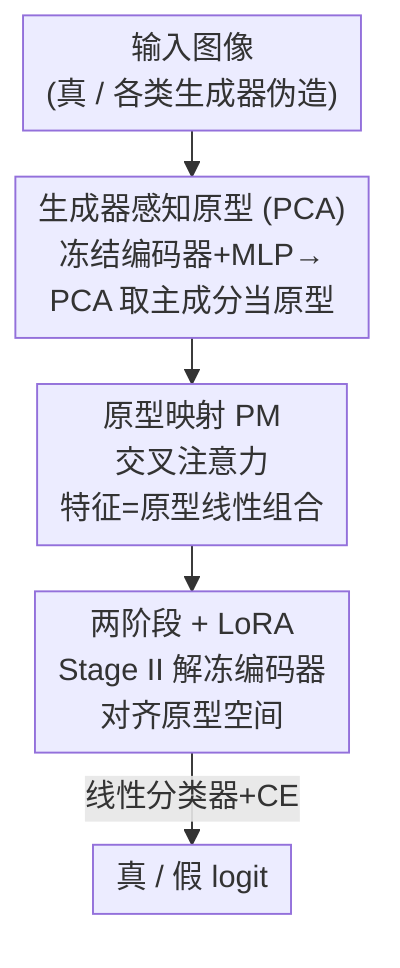

# Scaling Up AI-Generated Image Detection with Generator-Aware Prototypes

**会议**: CVPR 2026  
**论文**: [CVF Open Access](https://openaccess.thecvf.com/content/CVPR2026/html/Qin_Scaling_Up_AI-Generated_Image_Detection_with_Generator-Aware_Prototypes_CVPR_2026_paper.html)  
**代码**: https://github.com/UltraCapture/GAPL  
**领域**: AI安全 / 生成图像检测  
**关键词**: AIGI 检测, 原型学习, 数据异质性, LoRA, 可扩展性

## 一句话总结
作者发现"用越多生成器训练 AIGI 检测器、效果反而先升后降"（Benefit then Conflict）这一悖论，归因于生成图像特征过度异质 + 冻结编码器的能力瓶颈，提出 GAPL——先用 PCA 把上千个生成器蒸馏成一小撮"生成器感知原型"，再用交叉注意力把任意图像特征重组到这个低方差原型空间，配合两阶段 LoRA 微调，在 6 个基准上平均准确率 90.4%、超过此前 SOTA 3.5%。

## 研究背景与动机
**领域现状**：通用 AIGI（AI-Generated Image）检测的主流思路是"Train on one → Train on many"：把来自多个生成器的合成图像聚合成一个大训练集，指望检测器见多识广、能泛化到没见过的生成器。社区也确实在堆数据，从单生成器到数百、再到 Community-Forensics 的上千生成器级别。

**现有痛点**：作者做了一个反直觉的观测——**当训练用的生成器种类持续增加时，检测器性能不是单调上升，而是先受益、后崩坏**（论文称之为 "Benefit then Conflict" 困境）。也就是说，盲目扩大来源多样性，到一定程度后准确率反而往下掉。这说明现有可扩展方案存在结构性缺陷，而不是"再多喂点数据"能解决的。

**核心矛盾**：作者用一系列"生成图数量相同、生成器个数从 1 变到 8"的对照数据集做诊断，锁定了两个根因。其一是**数据级异质性**：不同生成器拟合真实分布的能力参差不齐，按全方差律分解，合成图协方差里多出一项"跨生成器方差"（cross generator variance），它随生成器多样性增长而膨胀，导致真实/合成图的特征分布越来越重叠、决策边界越来越畸形（用散布矩阵的迹 $\mathrm{tr}(S)$ 度量，生成图方差随生成器数量明显上升，真实图方差则稳定）。其二是**模型级瓶颈**：大量 SOTA 检测器依赖冻结的预训练编码器（如 CLIP）。单一来源时 CLIP 语义先验能带来不错的泛化，但面对异质数据时这些先验互相矛盾——用 LDA 的 Fisher ratio 衡量可分性，端到端训练的检测器在扩展设置下 Fisher ratio 和准确率都明显高于"冻结编码器+分类头"的方案，说明冻结编码器给性能设了天花板。

**核心 idea**：与其平等地对待上千个生成器，不如遵循 **"Turn Thousands into a Few"**——学一小组能代表典型伪造模式的"生成器感知原型"，把任意图像特征都用这组原型的线性组合重新表示，从而把高方差的异质特征空间压成一个低方差的紧致空间；同时放弃冻结编码器，用 LoRA 让编码器真正学到伪造线索。

## 方法详解

### 整体框架
GAPL（Generator-Aware Prototype Learning）的输入是一张图像，输出是真/假二分类 logit，整条流水线分两阶段串行：**Stage I 先在冻结编码器上建立"伪造相关子空间"并用 PCA 提取生成器感知原型；Stage II 用 LoRA 解冻编码器，并通过交叉注意力把图像特征映射到原型空间后再分类**。直觉上，Stage I 负责"找到一组能概括所有伪造模式的坐标轴（原型）"，Stage II 负责"让编码器学会把任何新生成器的图都投到这组坐标轴上"，两阶段配合实现"把上千生成器蒸馏成几个原型"的核心哲学。

### 关键设计

**1. 生成器感知原型（PCA 提取）：把上千个生成器的伪造模式压成几十根"主轴"**

针对"数据级异质性"这个痛点——生成图特征方差随生成器数量爆炸，作者的做法是不去硬塞所有生成器，而是只取少数几个**典型**生成器来"立标杆"。具体在 Stage I：从 ProGAN（GAN 代表）、Stable Diffusion v1.4（潜在扩散代表）、Midjourney（商业 API 代表）各取 $M=2000$ 张图，配上等量真实图组成原型集；冻结编码器 $\phi(\cdot)$，只训一个 MLP 做二分类（$f=\phi(x)$，$\hat y=\mathrm{MLP}(\mathrm{Normalize}(f))$），让特征空间获得基本的"伪造感知"。然后取 MLP 中间层的伪造相关嵌入 $F_f, F_r$，对真、假两个子集分别做 PCA，各取前 $N/2$ 个主成分拼成原型矩阵：

$$C=\tfrac{1}{3M-1}(F_f-\mathbf{1}\bar\mu)^\top(F_f-\mathbf{1}\bar\mu),\quad C v_i=\lambda_i v_i,\quad P=[P_r;P_f]\in\mathbb{R}^{N\times D'}$$

选 PCA 主成分的逻辑很关键：方差大的成分捕获**通用**伪造信息，方差小的反映生成器特有的个性，方差极小的是任务无关噪声，直接丢弃。于是这组原型就成了"几根能概括大多数伪造模式的坐标轴"，把上千生成器的多样性收敛到 $N$（实验取 64）个原型上。

**2. 原型映射 PM（交叉注意力）：把每张图的特征改写成原型的动态线性组合**

光有原型还不够，得让任意图像特征**落到**原型张成的低方差空间里。作者用一个交叉注意力把图像嵌入当 query、原型当 key/value，做特征重组：

$$\tilde f=\mathrm{Attn}(W_q f, W_k P, W_v P)=\mathrm{softmax}\!\Big(\tfrac{(fW_q)(PW_k)^\top}{\sqrt{D'}}\Big)\cdot PW_v$$

这一步的本质是把原始高方差特征 $f$ 表示成原型的**相似度加权组合** $\tilde f$，相当于强制每张图都"用这几个原型来解释自己"。因为输出被约束在原型定义的子空间内，不同生成器的特征再异质，重组后也被拉进同一个紧致、低方差的空间，从而压平了"跨生成器方差"，得到更规整的决策边界。$\tilde f$ 最后送进线性分类器出最终 logit。

**3. 两阶段训练 + LoRA：放弃冻结编码器，又不丢预训练知识**

针对"模型级瓶颈"——冻结 CLIP 给性能设了上限，但全量微调又会破坏宝贵的预训练泛化能力。GAPL 用 LoRA 在低秩子空间里微调编码器（$f=g_{\mathrm{proj}}(\phi_{\mathrm{lora}}(x))$），只动一小部分参数：既让编码器能学到新生成器的伪造线索、突破固定嵌入的上限，又最大程度保住预训练知识。LoRA 与 PM 是协同的——消融显示 PM 提供原型匹配的"骨架"，而 LoRA 负责把编码器真正对齐到原型空间，二者缺一不可（见消融表 Group 2/3/5 的逐级提升）。整个 Stage II 用二元交叉熵端到端训练。

### 损失函数 / 训练策略
两阶段都用二元交叉熵（BCE）。Stage I 冻结编码器只训 MLP（建子空间 + 抽原型）；Stage II 用 LoRA 微调编码器 + 训练 PM 的 $W_q,W_k,W_v$ + 线性分类器。骨干用 CLIP-ViT:L，投影维度 $D'=128$，原型数 $N=64$，原型集每个生成器取 $M=2000$ 张，扩展训练集用 Community-Forensics 的 55 万小版（仍覆盖全部约 4.7K 个生成器），2 张 RTX 4090 即可训练。

## 实验关键数据

### 主实验
6 个基准、55 个测试子集上的整体对比（Acc / AP 均为百分比）。GAPL 用 4.7K 生成器但只 55 万图，平均准确率与精度均居首：

| 方法 | 训练源 | Mean Acc | Mean AP |
|------|--------|---------|---------|
| UniFD (CVPR'23) | ProGAN/720k | 70.1 | 77.2 |
| AIDE (扩展) | 8gens/1.3M | 75.4 | 77.9 |
| D3 (CVPR'25) | 9gens/2M | 83.2 | 88.0 |
| CommForen (CVPR'25) | 4.7K gens/5M | 86.9 | 93.4 |
| **GAPL (本文)** | 4.7K gens/**550k** | **90.4** | **94.9** |

相比此前最强的 Community-Forensics，GAPL 用约 1/10 的训练图量把平均准确率再抬 3.5 个点；尤其在 SynthBuster（91.1）和 Community-Forensics Eval（89.4）这些扩展场景上优势明显。

同数据同条件下重训各架构的"纯架构能力"对比（4 基准 Mean Acc）：通用视觉模型反而比专用 AIGI 检测器更扛，GAPL 在所有方法里最高：

| 方法 | 类型 | Mean Acc |
|------|------|---------|
| Swin-T | 通用视觉 | 89.7 |
| ConvNext | 通用视觉 | 86.2 |
| Co-SPY (CVPR'25) | AIGI 检测器 | 50.4 |
| AIDE (ICLR'25) | AIGI 检测器 | 85.2 |
| **GAPL (本文)** | AIGI 检测器 | **95.5** |

### 消融实验
三模块（PCA 抽原型 / PM 原型映射 / LoRA）逐项消融，4 基准均值：

| Group | PCA | PM | LoRA | MAcc | MAp |
|-------|-----|----|----|------|-----|
| 1 | ✗ | ✗ | ✗ | 60.05 | 66.07 |
| 2 | ✗ | ✓ | ✗ | 68.59 | 72.43 |
| 3 | ✗ | ✗ | ✓ | 88.52 | 97.91 |
| 4 | ✓ | ✓ | ✗ | 71.88 | 82.18 |
| 5 | ✗ | ✓ | ✓ | 90.35 | 95.40 |
| **Ours** | ✓ | ✓ | ✓ | **95.54** | **98.97** |

### 关键发现
- **PM 提供"原型匹配骨架"、LoRA 负责"对齐到原型空间"，二者协同**：对比 Group 2→4，加 PCA 让原型带上生成器感知概念再涨 3.28%；对比 Group 2/3/5，PM 与 LoRA 叠加逐级提升，最终满配 95.54%，缺任一都明显掉点。
- **"a few" 真的是 few**：原型集里生成器从随机原型→1→2→3 类逐步加，准确率 90.35→93.67→94.1→95.54，但加到 4 类反而回落到 95.29——印证 "Turn Thousands into a Few" 里"三四个典型生成器就够"的论断。
- **原型数 $N$ 不敏感**：16/32/64 个原型的准确率分别 95.28/95.31/95.54，几乎持平，说明性能主要来自原型结构本身而非数量。
- **抗后处理鲁棒**：在 JPEG 压缩和高斯模糊下，GAPL 的平均准确率退化曲线显著优于 Ojha/SAFE/NPR/AIDE。

## 亮点与洞察
- **诊断比方法更有价值**：作者没有上来就堆模型，而是先用"控制生成图数量、只变生成器个数"的对照实验 + 散布矩阵迹 + LDA Fisher ratio，定量坐实了"扩展使数据不可分"和"冻结编码器设上限"两个根因，这套诊断范式本身就能迁移去分析别的"数据越多越糟"现象。
- **PCA 当原型抽取器很巧**：把"方差大=通用伪造、方差小=生成器个性、极小=噪声"的假设和 PCA 主成分排序对应起来，几乎零额外训练成本就拿到一组可解释的伪造坐标轴。
- **"少即是多"的反直觉结论**：业界普遍认为数据/来源越多越好，本文却证明对 AIGI 检测，盲目扩生成器会触发 Conflict，关键在于把多样性**结构化压缩**而非直接堆叠——这个洞察对其他"开放世界"检测任务也有启发。
- **用 1/10 数据超 SOTA**：550k 图打过 5M 图的 Community-Forensics，说明瓶颈不在数据量而在表示结构。

## 局限与展望
- 原型集依赖人工挑选三类"典型"生成器（GAN/扩散/商业 API），若未来出现机理迥异的新生成范式，固定原型可能覆盖不到，需要重建原型集。
- Chameleon 基准上 GAPL 准确率仅 71.0，明显低于其他基准（>90），说明对"未知/真实世界混杂"分布仍有短板，论文未深入解释这一掉点。⚠️ 该基准生成器类型标注为 Unknown，横向比较需谨慎。
- 方法绑定 CLIP-ViT:L 这一具体编码器与 LoRA，换更小骨干或纯 CNN 时原型空间是否同样有效，论文未充分验证。
- "三四个生成器足够"的结论是在当前测试基准上得出的，随测试分布扩展是否仍成立有待观察。

## 相关工作与启发
- **vs UniFD / Effort / AIDE（冻结/半冻结 CLIP 系）**：它们靠冻结预训练编码器 + 适配器/子空间提取伪造线索，单源泛化好但扩展时被固定嵌入卡死；GAPL 用 LoRA 解冻编码器并显式学原型空间，突破了这道天花板。
- **vs Community-Forensics（大数据派）**：CommForen 把数据堆到 4.7K 生成器/5M 图，但用通用视觉骨干、无针对异质数据的专门设计；GAPL 同样覆盖 4.7K 生成器却只用 550k 图，靠"原型压缩 + 两阶段"结构化利用异质数据，准确率反超 3.5%。
- **vs D3 / SAFE 等单/少源方法**：它们专门盯某种伪影（如 VAE 解码痕迹、高频成分），来源一多伪影被稀释就失灵；GAPL 把"各种伪影映射到一组典型伪造概念"，决策边界更稳。

## 评分
- 新颖性: ⭐⭐⭐⭐⭐ "Benefit then Conflict" 诊断 + 生成器感知原型是新颖且自洽的视角
- 实验充分度: ⭐⭐⭐⭐⭐ 6 基准 55 子集 + 架构对比 + 三模块消融 + 原型策略 + 抗后处理，覆盖全面
- 写作质量: ⭐⭐⭐⭐ 诊断-方法-验证逻辑清晰，个别公式与 Chameleon 掉点解释略简
- 价值: ⭐⭐⭐⭐⭐ 用 1/10 数据超 SOTA，且"结构化压缩多样性"的思路可迁移到其他开放世界检测

<!-- RELATED:START -->

## 相关论文

- [\[CVPR 2026\] Zero-shot Detection of AI-Generated Image via RAW-RGB Alignment](zero-shot_detection_of_ai-generated_image_via_raw-rgb_alignment.md)
- [\[CVPR 2026\] Skyra: AI-Generated Video Detection via Grounded Artifact Reasoning](skyra_ai-generated_video_detection_via_grounded_artifact_reasoning.md)
- [\[CVPR 2026\] Cross-modal Representation Learning for Diffusion-generated Image Detection](cross-modal_representation_learning_for_diffusion-generated_image_detection.md)
- [\[CVPR 2026\] LaSM: Layer-wise Scaling Mechanism for Defending Pop-up Attack on GUI Agents](lasm_layer-wise_scaling_mechanism_for_defending_pop-up_attack_on_gui_agents.md)
- [\[CVPR 2026\] Enabling Supervised Learning of Generative Signatures for Generalized AI-Generated Images Detection](enabling_supervised_learning_of_generative_signatures_for_generalized_ai-generat.md)

<!-- RELATED:END -->
