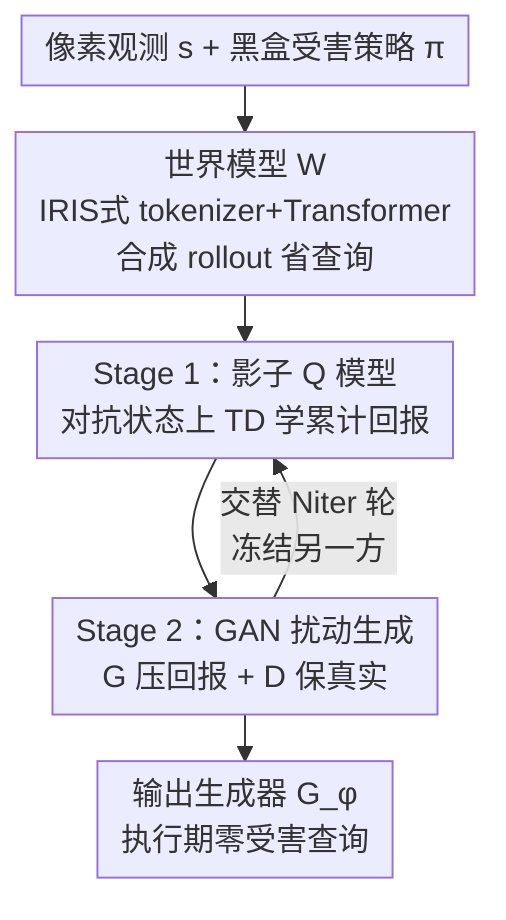

# SEBA: Sample-Efficient Black-Box Attacks on Visual Reinforcement Learning

**会议**: CVPR 2026  
**论文**: [CVF Open Access](https://openaccess.thecvf.com/content/CVPR2026/html/Huang_SEBA_Sample-Efficient_Black-Box_Attacks_on_Visual_Reinforcement_Learning_CVPR_2026_paper.html)  
**代码**: https://github.com/tairanhuang/seba  
**领域**: AI安全 / 对抗攻击  
**关键词**: 黑盒对抗攻击, 视觉强化学习, 连续控制, 影子 Q 模型, 世界模型

## 一句话总结
SEBA 用一个可微的"影子 Critic" + GAN 扰动生成器 + 世界模型三件套，在**不访问受害策略梯度**的黑盒条件下，对像素输入的连续控制 RL 智能体生成几乎不可感知的对抗扰动，把累计回报打到接近 0，同时把环境/受害查询量比 RL 类攻击降低一两个数量级。

## 研究背景与动机
**领域现状**：视觉强化学习（visual RL）直接从像素学控制策略，已经是机器人操作、自动导航、视觉控制的主力。但越依赖视觉感知，就越容易被精心构造的微小扰动（对抗攻击）击穿——这对要部署到真实世界的自治系统是个安全隐患。

**现有痛点**：已有的 RL 对抗攻击几乎都落在两类简单设定上——**向量状态**（低维观测）或**离散动作的视觉 RL**（如 Atari，策略本质像个分类器）。一旦换到**连续动作 + 像素观测**这种设定，动作空间无限、观测维度高（扰动维度 $d=3\times84\times84\approx2\times10^4$）、扰动会以复杂方式影响长程动力学，已有方法直接失灵。

**核心矛盾**：黑盒设定下攻击者拿不到梯度，只能靠反复 query 环境去估计攻击方向，而 RL 的每次 rollout 都是昂贵的序列交互——于是攻击者被迫在三个目标间拉扯：**攻击强度（压低回报）、不可感知性（视觉真实）、样本效率（少查询）**。PA-AD、OPTIMAL 这类把攻击者建模成一个策略 $\pi_a$ 去优化长程目标的做法，在 $\mathbb{R}^{2\times10^4}$ 的扰动空间里探索，样本复杂度爆炸、梯度信号又弱又噪，根本撑不住像素控制。

**本文目标 / 核心 idea**：不在高维扰动空间里"学策略探索"，而是**直接训练一个生成器 $G_\phi$**，让一个可微的影子 Critic 告诉它"往哪扰能压低价值"，再配世界模型用合成 rollout 把真实查询省下来——一句话：**用"代理 Critic 引导的生成器"替代"高维空间里的 RL 策略搜索"**。

## 方法详解

### 整体框架
SEBA 的攻击对象是一个黑盒受害策略 $\pi(a\mid s)$：攻击者只能 query 它拿到动作，看不到内部参数和梯度。攻击者输出一个有界扰动 $\delta=\mathrm{clip}(G_\phi(s),-\epsilon,\epsilon)$，构成对抗观测 $s'=\mathrm{clip}(s+\delta,0,1)$，目标是最小化受害者的折扣回报：

$$\min_\phi\ \mathbb{E}\Big[\sum_{t=0}^{\infty}\gamma^t\, r(s'_t,a_t)\Big],\quad a_t\sim\pi(\cdot\mid s'_t).$$

整条 pipeline 由四个部件协同：① 先用回放数据训一个**世界模型** $W$，让它能预测视觉动力学、产出合成 rollout；② 一个**影子 Critic** $Q_{\text{shadow}}$ 在对抗状态上估计受害者的累计回报，充当攻击者的可微优化信号；③ 一个**GAN（生成器 $G_\phi$ + 判别器 $D_\psi$）**负责产出既能压回报、又看不出破绽的扰动；④ 用**两阶段交替优化**把 Critic 的训练和 GAN 的训练拆开，避免目标耦合带来的不稳定。真实环境查询只周期性穿插进来纠正模型漂移。

### 关键设计

**1. 影子 Q 模型：在黑盒里造一个可微的"受害者价值代理"**

黑盒最大的麻烦是拿不到梯度，攻击者无从知道"往哪扰"。SEBA 的破法是训练一个影子 Critic $Q_{\text{shadow}}(s',a)$，专门估计受害者在对抗扰动下的期望累计回报——它是受害策略的**可微替身**。训练时生成器给干净观测 $s_t$ 加上有界扰动得到 $s'_t$，把它喂给黑盒策略 $\pi(a\mid s'_t)$ 拿到动作 $a_t$，与环境交互产出 $(s'_t,a_t,r_t,s'_{t+1},\text{done}_t)$ 存进回放池，再用 TD 目标更新：

$$L_Q=\tfrac12\,\mathbb{E}\big[(Q_{\text{shadow}}(s'_t,a_t)-y_t)^2\big],\quad y_t=r_t+\gamma\,\mathbb{E}_{a\sim\pi(\cdot\mid s'_{t+1})}\,Q_{\text{shadow}}(s'_{t+1},a).$$

注意整个过程**只 query $\pi$ 拿动作**，从不碰它的梯度或参数。有了 $Q_{\text{shadow}}$，攻击者就把"无梯度的黑盒优化"转成了"对一个可微函数求梯度"，这是后面生成器能直接被引导的前提。

**2. GAN 扰动生成：把"强攻击"和"不可感知"塞进一个对抗博弈**

攻击者要同时满足两个互相拉扯的目标：扰动要够狠（压低回报），又要看不出来（视觉真实）。SEBA 用生成器 $G_\phi$ + 判别器 $D_\psi$ 的对抗框架来平衡：判别器努力分辨干净状态和对抗状态，生成器则既要骗过判别器、又要让影子 Critic 给出的价值变低。两者目标相反：

$$L_D=-\tfrac1B\sum_{k=1}^{B}\big[\log D_\psi(s_k)+\log(1-D_\psi(s'_k))\big],$$
$$L_G=-\tfrac1B\sum_{k=1}^{B}\big(\log D_\psi(s'_k)-\lambda\,Q_{\text{shadow}}(s'_k,a_k)\big).$$

$L_G$ 第一项逼生成器把扰动做得逼真（不可感知），第二项（带 $-\lambda Q_{\text{shadow}}$）逼它把受害者价值往下压（攻击有效）。关键在于**梯度直接流过影子 Critic**：$\nabla_\phi L_G=-\nabla_\phi Q_{\text{shadow}}(s_t+\delta_t,a_t)$，所以优化只聚焦在"真正能降低价值的扰动方向"上，而不像 PA-AD/OPTIMAL 那样在 $\mathbb{R}^{2\times10^4}$ 里做 RL 探索——这正是它在像素空间不崩、而 RL 类攻击崩掉的根因。

**3. 两阶段交替优化：拆开耦合目标稳住训练**

如果同时训 $G_\phi$ 和 $Q_{\text{shadow}}$，两者目标紧紧耦合（Critic 要随扰动分布变、生成器又依赖 Critic 的价值估计），很容易震荡。SEBA 把一轮迭代拆成两段交替：**Stage 1** 冻结 $(G_\phi,D_\psi)$，用当前生成器产出的对抗交互收集 $(s',a,r,s'_{+1})$，按 Eq.(2) 的 TD 损失更新 $Q_{\text{shadow}}$，确保它在当前扰动分布下准确建模受害者回报；**Stage 2** 冻结 $Q_{\text{shadow}}$，用稳定的价值监督去更新 $(G_\phi,D_\psi)$。两阶段各跑 $T_1=T_2=5\text{K}$ 步、共 $N_{\text{iter}}=20$ 轮。这种"先把 Critic 钉准、再让生成器在固定监督下学"的节奏，是整套优化能收敛的支柱。⚠️ 有一个易忽略但关键的细节：Stage 1 必须在**扰动状态** $s'_t=s_t+G_\phi(s_t)$ 上训 Critic，而不是干净状态——消融里把它换成干净状态会让攻击效果断崖式下滑（见下文 -Noise）。

**4. 世界模型：用合成 rollout 把真实查询砍掉一个量级**

RL 攻击最贵的就是环境/受害查询。SEBA 借 IRIS 框架训一个世界模型 $W$：离散图像 tokenizer $(E,D)$ 把观测编码成 token，自回归 Transformer $G$ 预测未来 latent token 和奖励：$z_t=E(s_t)$，$\hat z_{t+1},\hat r_t=G(z_{\le t},a_{\le t})$，$\hat s_{t+1}=D(\hat z_{t+1})$，联合损失为

$$L_W=\mathbb{E}\big[-\log p_G(z_{t+1}\mid z_{\le t},a_{\le t})\big]+\mathbb{E}\big[\lVert\hat r_t-r_t\rVert_2^2\big].$$

训好后 $W$ 能产出想象转移 $(\hat s'_t,a_t,\hat r_t,\hat s'_{t+1})$，无需真正调用环境，用来同时更新 Critic 和生成器。每个真实交互配 $H=4$ 个模型生成转移，把真实环境查询量降到约 $1/H$。消融显示：去掉世界模型攻击强度几乎不变，但真实环境查询从 160K 飙到 800K——它**不负责攻击有效性，只负责样本效率**，这是 SEBA 相对 PA-AD/OPTIMAL（需 4M 查询）的实用性来源。

### 损失函数 / 训练策略
整体由 Algorithm 1 串起来：先用真实转移训世界模型（minimize $L_W$），随后 $N_{\text{iter}}=20$ 轮里交替执行 Stage 1（TD 更新 Critic）与 Stage 2（更新 GAN）。关键超参：扰动界 $\epsilon=8/255$，生成器损失权重 $\lambda=1$，世界模型 rollout 步长 $H=4$、更新步数 $N_w=200\text{K}$，两阶段各 $T_1=T_2=5\text{K}$。影子 Critic 用 Double-DQN 风格更新；最终评估全部在真实环境进行。

## 实验关键数据

### 主实验
在 5 个像素 MuJoCo 连续控制任务上（受害者为 DrQ-SAC），SEBA 在攻击强度、视觉不可感知（FID）、查询效率三方面同时领先。回报越低、FID 越低代表攻击越强：

| 任务（Reward ↓） | Clean | PGD(白盒) | SimBA(黑盒) | Square(黑盒) | SEBA |
|------|------|------|------|------|------|
| Cheetah Run | 859.26 | 150.72 | 52.15 | 182.90 | **1.61** |
| Walker Walk | 944.28 | 342.78 | 68.77 | 752.19 | **35.74** |
| Reacher Hard | 870.9 | 232.3 | 2.7 | 870.7 | **0.3** |
| Hopper Stand | 849.60 | 1.85 | 4.86 | 652.10 | **1.25** |
| FID ↓ | / | 109.43 | 78.05 | 118.01 | **62.43** |
| Atk. Vic (每步查询) ↓ | / | 20 | 400 | 202 | **0** |

对比为像素控制改造的向量态 RL 攻击（同样 5 个任务），SEBA 在效果和查询量上双杀：

| 任务（Reward ↓） | MAD | PA-AD | OPTIMAL | SEBA |
|------|------|------|------|------|
| Cheetah Run | 29.02 | 146.61 | 271.73 | **1.61** |
| Reacher Hard | 26.19 | 45.37 | 592.64 | **0.3** |
| FID ↓ | 106.34 | 97.55 | 93.04 | **62.43** |
| Train Env(总) ↓ | / | 4M | 4M | **160K** |
| Train Vic(总) ↓ | / | 4M | 4M | **800K** |

PA-AD/OPTIMAL 训练要 ~4M 环境+受害查询，SEBA 只用 160K Env + 800K Vic，且执行期零受害查询。迁移到 Atari（Rainbow 受害者，离散动作）SEBA 仍把 Freeway 34→10、Alien 8858→982，FID 最低（81.7），只在白盒 PA-AD 之下——符合预期，因为 PA-AD 拿了完整梯度。

### 消融实验
逐个移除组件（-D 去判别器，-Noise 把 Stage 1 的扰动状态换成干净状态，-WM 去世界模型）：

| 配置 | Walker Walk Reward | FID ↓ | Train Env ↓ | 说明 |
|------|------|------|------|------|
| SEBA(完整) | 35.74 | 62.43 | 160K | 三者齐备 |
| -D | 22.64 | **97.18** | 160K | FID 大涨，扰动变明显；攻击强度基本不变 |
| -Noise | **118.11** | 60.72 | 160K | 攻击效果断崖下滑（最大降幅） |
| -WM | 36.01 | 63.98 | **800K** | 攻击强度不变，但真实查询翻 5 倍 |

### 关键发现
- **影子 Critic 是攻击有效性的真正引擎**：-Noise（Critic 训在干净状态上）让 Walker Walk 从 35.74 崩到 118.11，因为 Critic 学在了错配的状态分布上、价值估计在扰动下不可靠，生成器拿不到有意义的梯度。
- **判别器只管"好看"不管"狠"**：去掉它 FID 从 62.43 涨到 97.18，但回报几乎不变——它的职责是稳住生成器、让扰动视觉平滑，攻击强度仍由影子 Critic 驱动。
- **世界模型只买样本效率**：-WM 攻击强度持平甚至略升，但真实环境查询从 160K 涨到 800K，印证它专职降查询成本。
- **可做定向攻击**：把生成器目标改成"把某动作维 $a^{(i)}_t$ 推进目标区间 $R_{\text{target}}$"，SEBA 成功率远超基线（Walker Walk 91.3% vs PGD 37.2% / Critic-Based 53.2%）。

## 亮点与洞察
- **"代理 Critic + 生成器"替代"高维 RL 策略搜索"是核心洞察**：把黑盒无梯度问题转化为"对可微影子价值求梯度"，避开了在 $2\times10^4$ 维扰动空间里做 RL 探索的样本与梯度灾难——这正是它能在像素连续控制上不崩的关键。
- **三组件职责清晰可拆**：消融漂亮地证明了"Critic 管有效、判别器管隐蔽、世界模型管省查询"，每个部件解决三难目标中的一个，互不抢功，这种解耦设计很值得借鉴。
- **执行期零受害查询**：扰动靠训练好的 $G_\phi$ 一次前向产出，部署时不需要再 query 受害者，比 SimBA(400)/Square(202) 这种每步狂查的黑盒攻击实用得多。
- 这套"用世界模型做合成 rollout 降真实交互"的思路，可迁移到任何"环境/受害查询昂贵"的黑盒攻击或安全评测场景。

## 局限与展望
- 影子 Critic 的可靠性高度依赖"在扰动状态分布上训练"（-Noise 一崩到底），意味着若受害策略本身分布漂移大或难以稳定收集对抗转移，方法稳定性存疑。
- 世界模型用的是 IRIS 式重建，在更复杂/真实视觉场景下能否保真地预测动力学、合成 rollout 不引入偏差，论文主要在 MuJoCo/Atari 验证，真实机器人场景待考。⚠️ 跨域泛化的边界以原文为准。
- Atari 上仍输给白盒 PA-AD，说明纯黑盒在能拿到完整梯度的对手面前仍有上限；但作者论点是白盒信息在黑盒威胁模型里本就不可得，比较意义有限。
- 防御侧未展开：本文是攻击方法，若要落地为鲁棒性评测工具，还需配套讨论对抗训练/检测等防御如何应对此类攻击。

## 相关工作与启发
- **vs PA-AD / OPTIMAL**：它们把攻击者建成策略 $\pi_a$ 在扰动空间做 RL 优化，向量态下可行，但像素态下扰动维度爆到 $2\times10^4$、梯度又弱又噪而崩；SEBA 不学策略、直接用影子 Critic 引导生成器，优化只盯"降价值方向"，效果与效率双赢。
- **vs SA-MDP / Critic-Based / MAD**：这些是向量态或离散动作 Atari 的攻击（策略像分类器），SEBA 是据作者所述**首个**针对像素连续控制 RL 的黑盒攻击。
- **vs 像素空间通用攻击（PGD/C&W/SimBA/Square）**：它们直接扰像素但不建模长程回报，要么 FID 高（明显）要么每步查询多；SEBA 借影子 Critic 显式优化累计回报，更狠也更隐蔽。

## 评分
- 新颖性: ⭐⭐⭐⭐⭐ 首个像素连续控制黑盒 RL 攻击，"影子 Critic 引导生成器"绕开高维 RL 探索的思路漂亮
- 实验充分度: ⭐⭐⭐⭐⭐ MuJoCo + Atari 双域、白盒/黑盒双家族基线、完整消融 + 定向攻击，10 seed
- 写作质量: ⭐⭐⭐⭐ 方法与公式清晰、消融解释到位；图 1 文字渲染较糙
- 价值: ⭐⭐⭐⭐ 为具身 AI 的黑盒鲁棒性评测提供实用框架，但防御侧与真实场景泛化待补

<!-- RELATED:START -->

## 相关论文

- [\[CVPR 2026\] VCP-Attack: Visual-Contrastive Projection for Transferable Black-Box Targeted Attacks on Large Vision-Language Models](vcp-attack_visual-contrastive_projection_for_transferable_black-box_targeted_att.md)
- [\[CVPR 2026\] PROMPTMINER: Black-Box Prompt Stealing against Text-to-Image Generative Models via Reinforcement Learning and VLM-Guided Optimization](promptminer_black-box_prompt_stealing_against_text-to-image_generative_models_vi.md)
- [\[CVPR 2026\] Shedding Light on VLN Robustness: A Black-box Framework for Indoor Lighting-based Adversarial Attack](shedding_light_on_vln_robustness_a_black-box_framework_for_indoor_lighting-based.md)
- [\[ICLR 2026\] Sample-Efficient Distributionally Robust Multi-Agent Reinforcement Learning via Online Interaction](../../ICLR2026/ai_safety/sample-efficient_distributionally_robust_multi-agent_reinforcement_learning_via_.md)
- [\[CVPR 2026\] What Your Features Reveal: Data-Efficient Black-Box Feature Inversion Attack for Split DNNs](what_your_features_reveal_data-efficient_black-box_feature_inversion_attack_for_.md)

<!-- RELATED:END -->
