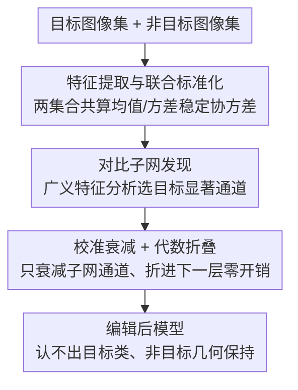

# Selective Amnesia using Contrastive Subnet Erasure for Class Level Unlearning in Vision Models

**会议**: CVPR 2026  
**论文**: [CVF Open Access](https://openaccess.thecvf.com/content/CVPR2026/html/Pramanik_Selective_Amnesia_using_Contrastive_Subnet_Erasure_for_Class_Level_Unlearning_CVPR_2026_paper.html)  
**代码**: https://github.com/VishalPramanik/CSE  
**领域**: AI安全 / 机器遗忘  
**关键词**: 概念遗忘, 类级 unlearning, 通道编辑, 广义特征分析, 跨数据集评估

## 一句话总结
CSE 针对预训练视觉模型的"类级概念遗忘"——让模型彻底认不出某一整个语义类别（而非只忘掉具体训练样本），它不训练、不改任务头，而是用对比子网发现找出对目标类最负责的一小撮通道、做校准衰减并代数折叠进下一层，实现零推理开销、稳定且更少误伤非目标类的遗忘。

## 研究背景与动机

**领域现状**：预训练视觉模型不可避免会内化一些日后需要删除的信息——为合规删除请求、剔除不安全 / 有偏知识、或中和后门毒化。现有做法分两类：数据遗忘（去掉特定样本的影响）和概念擦除（在表征里压制某个语义因子）。

**现有痛点**：作者系统对比了五类编码器编辑方法——ESC（全局子空间投影，删掉与目标相关的方向）、DELETE / BU（梯度训练，重塑参数把目标区域推开或收缩决策边界）、SCAR / Targeted-CLIP（带额外监督的保留-遗忘目标）。它们要么"全局投影"太钝、要么"微调参数"会拖累共享滤波器，共同毛病是：随着遗忘强度增大，**对不相关特征的附带损伤越来越大、训练也越来越不稳定**，还要额外算力。

**核心矛盾**：根本难点是**特征纠缠**——目标类和非目标类常常共享同一编码器里的方向和通道，于是粗暴删除"目标"信号会顺带把附近结构也变形，伤到那些与被遗忘内容共享视觉线索的任务。归纳起来是两个反复出现的局限：(i) **非局部性**——编辑作用在大片子空间或整块参数上，改动外溢到无关区域；(ii) **缺乏几何保持**——即便目标精度掉了，非目标类之间的相对排布也被扭曲，损害下游线性可分性。

**本文目标**：要一种"外科手术式"的编辑——只动真正诊断目标的那一小撮通道、保住非目标几何、不训练、零推理开销，并且要能验证遗忘是否**真的擦掉了概念**而非只是过拟合了源数据。

**切入角度**：作者先用一个 MNIST + 冻结 EfficientNet-B0 的玩具实验点题：把数字"3"设为遗忘目标、用线性探针测"5 vs 8"的非目标效用（"3"与"5""8"共享笔画，删"3"相关方向极易误伤）。结果 CSE 在整个遗忘强度区间都贴着无编辑基线走（几乎零附带损伤），把"3"的精度压到近零；而全局投影（ESC）随强度增大迅速恶化、梯度类方法也更明显地拖累非目标效用。

**核心 idea**：用"对比"找出对目标类显著、对非目标类稳定的通道（局部），再只衰减这些通道（几何保持），把编辑代数折叠进网络，做到无训练 + 零推理开销。

## 方法详解

### 整体框架
CSE 要解决的是"删一整个类却不误伤共享特征"的问题。它是一个三阶段、训练自由、以编码器为中心的通道空间编辑：给定一组目标图像 $\mathcal{D}_t$（要忘的概念）和一组非目标图像 $\mathcal{D}_b$（要保的概念），先在两集合上联合标准化特征，再用广义特征分析找出"目标方差远大于非目标方差"的判别方向、给每个通道按特征值加权打分并选出覆盖判别质量的最小子网，最后只对这些通道做校准衰减、并把衰减矩阵代数折叠进后续层——一次预计算、运行时只是一个固定的缩放 + 偏置，任务头完全不动、推理零额外开销。

### 关键设计

**1. 对比子网发现：用方差比找出"只对目标敏感"的通道**

痛点是目标与非目标共享通道，光看"目标响应大"会误伤共享线索。CSE 先在目标 / 非目标两集合上联合标准化特征（联合算均值 $\mu^{(\ell)}$ 与逐通道标准差 $\sigma^{(\ell)}_c$，这一步对无偏的方差比计算至关重要），再在标准化特征上算两个协方差 $\Sigma^{(\ell)}_t,\Sigma^{(\ell)}_b$，去找最大化方差比 $\rho(v)=\frac{v^\top\Sigma^{(\ell)}_t v}{v^\top\Sigma^{(\ell)}_b v}$ 的方向——$\rho(v)$ 大意味着目标沿 $v$ 剧烈变化而非目标保持稳定，即"目标显著"。为数值稳定，求解正则化的广义特征值问题 $\Sigma^{(\ell)}_t v=\rho(\Sigma^{(\ell)}_b+\delta I)v$，得到按特征值降序排列的特征对。每个通道的重要性由它在判别方向上的参与度衡量 $s^{(\ell)}_c=\sum_{j=1}^{k_\ell}\rho^{(\ell)}_j\,(v^{(\ell)}_j[c])^2$，再贪心选出覆盖总判别信息比例 $\tau_{\text{cov}}$ 的**最小通道子集** $\mathcal{C}^{(\ell)}$。这一步直接对症"非局部性"——只挑真正诊断目标的通道，共享但非目标专属的方向被保留。

**2. 校准衰减 + 代数折叠：只动子网、零推理开销、保几何**

选出子网后不能一刀切删掉（会伤几何）。CSE 给每个选中通道按其判别分算一个 $[0,1]$ 的衰减因子 $\beta^{(\ell)}_c=\mathrm{clip}_{[0,1]}\!\big(\frac{s^{(\ell)}_c-\tau_0}{s^{(\ell)}_c+\lambda_0}\big)$（$\tau_0$ 是最小分数阈值、$\lambda_0$ 控过渡平滑），组成衰减矩阵 $A^{(\ell)}=\mathrm{diag}(1-\beta^{(\ell)}_1,\dots)$，对角项从 0（完全移除）到 1（完全保留）。由于衰减是在标准化坐标里算的，要变换回原始特征空间 $M^{(\ell)}=S^{(\ell)-1}A^{(\ell)}S^{(\ell)}$，运行时操作为 $h^{(\ell)}_{\text{atten}}=M^{(\ell)}h^{(\ell)}+(I-M^{(\ell)})\mu^{(\ell)}$，偏置项补偿标准化引入的均值漂移。对带残差的块 $h^{(\ell+1)}=F(h^{(\ell)})+S(h^{(\ell)})$，把衰减施加在**块输出级** $h^{(\ell+1)}_{\text{atten}}=\mathrm{diag}(M^{(\ell+1)})\odot h^{(\ell+1)}+\beta^{(\ell+1)}$，防止信号从残差路绕过、又能统一处理卷积块和 Transformer 块。整个 $\mathrm{diag}(M)$ 和偏置都可预计算并折叠进网络，推理期就是一个固定缩放，零额外开销、任务头不变——直接对症"几何保持"。

**3. 跨数据集评估协议：检验"真擦概念"而非"过拟合源数据"**

这是方法之外的一个重要贡献，针对"遗忘是否泛化到指定类所用数据之外"。协议是：在**源数据集**上定义并执行遗忘，却在一个**与源不共享任何图像、分布也不同的目标数据集**上度量遗忘效果。比如在 CIFAR-10 上忘"airplane"，到 ImageNet 的 airliner/aircraft 上测是否真忘、同时确认 warplane 这种邻近类被保住；反向地在 ImageNet 上忘各种 truck、到 CIFAR-10 truck 上测、确认 automobile 不受损。这种设计让三个数据集都既当遗忘域又当评测域，专门压测"概念是否被真正移除（迁移泄漏）"而非记住了源集模式，同时审计分布漂移下的非目标效用。

### 损失函数 / 训练策略
**无训练**。CSE 是一次预计算的编码器编辑：标准化统计、广义特征分解、通道打分与衰减矩阵全部离线算好后代数折叠进网络，运行时只执行固定的缩放 + 偏置。架构无关，已在 EfficientNet-B0 / ResNet-18 / Swin-T 上验证（头部限定编辑时尊重该约束，否则只在方法显式要求微调时才更新编码器参数）。

## 实验关键数据

评测指标：forget-test 精度 $A_{ft}$（越低越好，目标被忘）、retain-test 精度 $A_{rt}$（越高越好，非目标保留）、二者调和均值 H-Mean（越高越好）、forget 集上的成员推断攻击成功率 MIA（越低越好）。跨数据集设定覆盖 CIFAR-10 / CIFAR-100 / ImageNet。

### 主实验（单类跨数据集，ResNet-18，3 次运行 std<±0.02）

| 方法 | CIFAR-10 $A_{ft}\downarrow$/$A_{rt}\uparrow$/H↑/MIA↓ | ImageNet $A_{ft}$/$A_{rt}$/H/MIA |
|------|------|------|
| Original（不编辑） | .94/.93/.50/.22 | .70/.59/.36/.22 |
| Retrain（金标准下界） | .03/.91/.89/.02 | .03/.59/.68/.02 |
| ESC（全局投影） | .10/.92/.90/.05 | .12/.59/.67/.05 |
| DELETE（梯度训练） | .12/.91/.89/.06 | .14/.58/.65/.05 |
| SCAR | .10/.90/.85/.08 | .17/.57/.61/.08 |
| **CSE（本文）** | **.01/.95/.96/.01** | **.02/.61/.73/.01** |

CSE 在三个数据集上都把 $A_{ft}$ 压到 .01–.02（比所有基线更彻底）、$A_{rt}$ 反而高于 Original、H-Mean 与 MIA 全面最优，甚至比 Retrain 这个"重训金标准"还要好——遗忘更干净、非目标保留更好。

### 消融 / 鲁棒性（跨骨干 + 遗忘强度）

| 配置 | 关键现象 | 说明 |
|------|---------|------|
| EfficientNet-B0 / ResNet-18 / Swin-T | CSE 三骨干均 $A_{ft}\approx.01$–.02、H 最高 | 架构无关，卷积与 Transformer 都稳 |
| 遗忘强度 $s\in[0,1]$ 扫描 | CSE 全程贴无编辑基线 | 几乎零附带损伤 |
| ESC 随 $s$ 增大 | 非目标效用迅速恶化 | 全局投影删多了就破坏共享特征 |
| 梯度类（DELETE/BU/SCAR/Targeted-CLIP） | 随强度增大更明显拖累非目标 | 重塑共享滤波器、需精细再平衡 |

### 关键发现
- **CSE 普遍优于"重训"基线**：在 $A_{rt}$ / H-Mean 上甚至超过 Retrain，说明局部对比衰减不仅能忘干净，还顺带保住了非目标几何，而重训会丢掉一些原模型已学好的有用结构。
- **强度鲁棒性是关键卖点**：全局投影和梯度微调都随遗忘强度增大而崩，CSE 因为只动最小子网、做校准衰减，全程稳定。
- **跨数据集协议暴露真功夫**：在源集忘、异分布目标集测，CSE 仍把目标压到近零，证明擦的是概念而非源数据模式。

## 亮点与洞察
- **方差比 + 广义特征分析定位"目标专属通道"**：用 $\rho(v)=\frac{v^\top\Sigma_t v}{v^\top\Sigma_b v}$ 把"目标显著且非目标稳定"形式化成一个可解的广义特征值问题，是个干净可复用的"对比定位"工具。
- **代数折叠 = 零推理开销**：把衰减矩阵预计算并折进下一层，运行时只是固定缩放 + 偏置，任务头不动——这让方法真正"可部署"，而不是又一个需要在线微调的编辑器。
- **跨数据集遗忘评估协议**：把"概念是否真被移除"和"分布漂移下非目标效用"两件事一次性压测，比只在源集上自测严格得多，值得被后续 unlearning 工作沿用。

## 局限与展望
- 子网发现依赖目标 / 非目标两个数据集来估协方差，目标概念若样本稀少或非目标集选取不当，方差比估计可能不稳（论文用正则化 $\delta$ 缓解，但对极端情况未充分讨论）。
- 衰减因子的阈值 $\tau_0$、平滑 $\lambda_0$、覆盖比 $\tau_{\text{cov}}$、特征向量数上界等超参较多，跨任务的默认值鲁棒性正文未完全展开。
- 评测聚焦图像分类骨干，对检测 / 分割 / 生成模型的类级遗忘、以及多个高度纠缠类别同时遗忘的极限场景，留待验证。

## 相关工作与启发
- **vs ESC（全局子空间投影）**：ESC 投影掉与目标相关的方向，低强度有效但删多了会破坏共享特征；CSE 只衰减最小子网、保几何，跨数据集 $A_{rt}$/H 全面更优且随强度稳定。
- **vs DELETE / BU（梯度训练）**：它们重塑参数推开目标区域，能忘但会拖累共享滤波器、还要算力和精细正则；CSE 训练自由、零推理开销，遗忘更彻底（$A_{ft}$ .01 vs .12）。
- **vs SCAR / Targeted-CLIP（带监督的保留-遗忘）**：引入额外提示 / 平衡保留集提升可控性，但带来算力、超参敏感和高强度失稳；CSE 一次预计算即可，且 MIA 压到 .01 表明记忆模式被真正清除。

## 评分
- 新颖性: ⭐⭐⭐⭐ 对比方差比定位 + 代数折叠衰减的组合干净有效，跨数据集协议也有贡献
- 实验充分度: ⭐⭐⭐⭐ 三数据集 × 三骨干 × 单/多类 + 强度扫描覆盖扎实，但超参鲁棒性展开有限
- 写作质量: ⭐⭐⭐⭐ 动机（玩具实验点题）到方法到评测协议逻辑清楚，公式标注完整
- 价值: ⭐⭐⭐⭐ 训练自由 + 零推理开销 + 稳定，是真正"可部署"的类级遗忘方案

<!-- RELATED:START -->

## 相关论文

- [\[CVPR 2026\] VCP-Attack: Visual-Contrastive Projection for Transferable Black-Box Targeted Attacks on Large Vision-Language Models](vcp-attack_visual-contrastive_projection_for_transferable_black-box_targeted_att.md)
- [\[CVPR 2026\] Towards Highly Transferable Vision-Language Attack via Semantic-Augmented Dynamic Contrastive Interaction](towards_highly_transferable_vision-language_attack_via_semantic-augmented_dynami.md)
- [\[CVPR 2026\] Eliminate Distance Differences Induced by Backdoor Attacks: Layer-Selective Training and Clipping to Mask Backdoor Models](eliminate_distance_differences_induced_by_backdoor_attacks_layer-selective_train.md)
- [\[CVPR 2026\] Hierarchically Robust Zero-shot Vision-language Models](hierarchically_robust_zero-shot_vision-language_models.md)
- [\[CVPR 2026\] A Unified Perspective on Adversarial Membership Manipulation in Vision Models](a_unified_perspective_on_adversarial_membership_manipulation_in_vision_models.md)

<!-- RELATED:END -->
