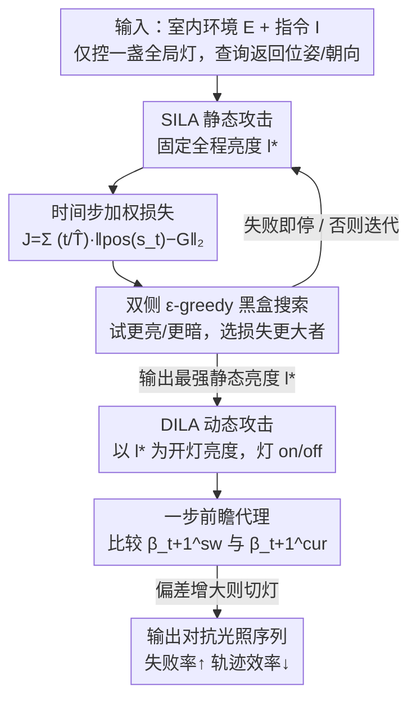

# Shedding Light on VLN Robustness: A Black-box Framework for Indoor Lighting-based Adversarial Attack

**会议**: CVPR 2026  
**论文**: [CVF Open Access](https://openaccess.thecvf.com/content/CVPR2026/html/Li_Shedding_Light_on_VLN_Robustness_A_Black-box_Framework_for_Indoor_CVPR_2026_paper.html)  
**代码**: https://github.com/LiChenyang0820/ILA4VLN  
**领域**: AI安全 / 视觉语言导航  
**关键词**: VLN鲁棒性, 黑盒对抗攻击, 室内光照, 具身智能, 轨迹偏移

## 一句话总结
这篇论文指出视觉语言导航（VLN）智能体的鲁棒性评测一直用"现实里几乎不会出现的怪异纹理"，转而提出一个只操控全局室内光照强度的黑盒攻击框架 ILA——静态模式 SILA 搜出一个全程恒定、最能搅乱导航的亮度，动态模式 DILA 在关键时刻突然开/关灯——在两个 SOTA VLN 模型、三个任务上把失败率大幅推高、轨迹效率显著拉低，揭示了 VLN 对"日常光照变化"这种自然扰动的隐藏脆弱性。

## 研究背景与动机
**领域现状**：VLN 要求智能体按自然语言指令在 3D 室内环境里导航，是具身智能的基础能力。近年模型（SPOC 用最短路专家轨迹做行为克隆、FLaRe 在 SPOC 上加 RL 微调）导航性能稳步提升，但鲁棒性研究严重不足——而导航失败可能意味着碰撞、伤害等真实危害。

**现有痛点**：已有的 VLN 鲁棒性评测（Consistent Attack、可微渲染优化物体外观、给物体表面贴对抗 patch）有两个共性毛病：① 产生的扰动表现为**高度不寻常的纹理**，现实室内几乎遇不到，所以"在这种人造图案下失败"实际意义有限；② 大多依赖**白盒**访问模型内部做优化，在拿不到模型内部的真实威胁场景里不适用。

**核心矛盾**：要评测的是智能体在"自然、不可避免的环境变化"下会不会出错，但现有攻击却把环境改成了现实中不会出现的样子——攻击的"现实相关性"和"攻击强度"之间脱节了。

**本文目标**：找一个**日常会出现、又容易控制**的内在场景属性，在**黑盒**条件下系统暴露 VLN 的脆弱性。

**切入角度**：作者盯上了室内光照——一个无处不在、家用照明天天在变的内在场景属性。前置实验（SPOC 在 ObjectNav 上，把光照强度在 [0,2] 内按 0.1 步长扫一遍、200 episode）发现两个现象：❶ 成功率随光强**非单调、不规则**地波动，说明光照以非线性方式影响模型行为；❷ 最高与最低成功率之间相差近 10 个百分点。这说明即便是适度的光照变化也能左右导航，于是有了核心问题：能不能**刻意设计**光照调制模式来系统性地暴露这种脆弱性？

**核心 idea**：把"日常室内照明的用法"（要么稳定亮着、要么突然开/关）抽象成两种黑盒攻击模式，只动一盏全局灯的强度，就能稳稳搅乱 VLN。

## 方法详解

### 整体框架
攻击者唯一能控制的变量是光照序列 $\mathcal{L}=\{l_1,\dots,l_T\}$（一盏全局可控灯的逐时刻强度），且每次黑盒查询只返回智能体的位置和朝向。围绕"家用灯的两种典型用法"，ILA 设计两种攻击模式串联工作：**SILA（静态）**先搜出一个全程恒定、最能让轨迹偏离目标的亮度 $l^\star$；**DILA（动态）**则以 $l^\star$ 作为"开灯"默认亮度，再在导航过程中挑选合适时刻突然开/关灯，制造剧烈光照突变进一步破坏导航。两者共享一条黑盒闭环：选光强 → 按光强渲染场景 → 智能体执行导航 → 用损失评估轨迹 → 反馈指导下一次更新。

### 关键设计

**1. 黑盒光照攻击范式：用"日常会出现的扰动"替代怪异纹理**

针对"现有攻击的纹理现实中遇不到、且需白盒"这个痛点，作者把攻击面从"物体纹理/贴片"换成"全局室内光照强度"这一内在场景属性。形式化上，环境 $E$、智能体状态 $s_t$ 与当前光照 $l_t$ 经渲染函数 $r$ 得到观测 $o_t = r(E, s_t, l_t)$，智能体按策略 $a_t\sim\pi(a_t\mid o_{1:t}, I)$ 行动；攻击者目标是找一个光照序列让 episode 失败：$\max_{\mathcal{L}}\mathbf{1}\big(\forall t\le T,\ \neg(\mathrm{pos}(s_t)\in G \land a_t=\text{STOP})\big)$。整个过程只假设能控一盏全局灯、每次查询拿到位姿/朝向，是彻底的黑盒——这让攻击在"拿不到模型内部"的真实威胁场景下也成立，而且光照变化是日常照明本就会发生的，攻击的现实相关性远高于人造纹理。

**2. SILA 时间步加权损失：把"后期错误更致命"写进目标**

为导航任务设计攻击损失很难——导航是个序列过程、产出整条轨迹，只用"最后到没到目标"当损失会丢掉大量轨迹信息。而且早期偏离往往还能纠正，后期错误通常是决定性、不可逆的，把所有时间步一视同仁会错估它们的真实重要性。作者因此设计了**时间步递增权重** $w_t = t/\hat{T}$（$\hat{T}$ 为该 episode 实际步数），让越靠近终点的偏差权重越大，损失定义为
$$\mathcal{J}_{static} = \sum_{t=1}^{\hat{T}} w_t\, d_t = \sum_{t=1}^{\hat{T}} \frac{t}{\hat{T}} \|\mathrm{pos}(s_t) - G\|_2,$$
其中 $d_t=\|p_t-G\|_2$ 是每步位置到目标的欧氏距离。这把"全轨迹聚合 + 强调后期"两点融进一个损失，比只看终点距离或均匀加权更能逼出致命偏移。

**3. SILA 双侧 ε-greedy 黑盒搜索：拿不到梯度也能逼近最强亮度**

把找对抗光强当成黑盒优化：用任务损失当反馈调亮度。每次迭代在当前强度 $l^k=l_0+\Delta l$ 附近试两个候选——略亮 $l^{k+}=\mathrm{clip}(l^k+\alpha)$ 和略暗 $l^{k-}=\mathrm{clip}(l^k-\alpha)$，分别跑 VLN 拿轨迹算损失，取损失更大（更能破坏导航）的方向：$\xi^k=\mathrm{sign}(\mathcal{J}(\mathcal{L}^{k+})-\mathcal{J}(\mathcal{L}^{k-}))\in\{+1,-1\}$。为避免陷在局部，引入 ε-greedy：以概率 $\varepsilon$ 反转更新方向（$b^k=-1$），否则顺着更坏方向（$b^k=+1$），更新 $\Delta l\leftarrow\mathrm{clip}(\Delta l+\alpha\cdot b^k\cdot\xi^k)$。一旦某个候选直接让任务失败就提前返回该亮度。整套双侧比较 + 探索把搜索导向最大化损失的恒定亮度 $l^\star$，全程不碰模型内部。

**4. DILA 一步前瞻切灯代理：在关键时刻精准开关灯**

动态模式继承 SILA 的最强静态亮度 $l^\star$ 作"开灯"亮度、0 作"关灯"，逐步强度 $l_t=i_t\cdot l^\star$（$i_t\in\{0,1\}$ 为开关指示）。难点有二：❶ 等整条轨迹跑完再评估每个候选切灯太慢；❷ 一个 episode 里多次切灯时，难归因到底哪次切灯导致失败。作者设计一个**轻量一步前瞻代理**：定义朝向目标向量 $\vec{v}_1=(\mathrm{tar}_x-\mathrm{pos}_x,\ \mathrm{tar}_z-\mathrm{pos}_z)$ 和朝向向量 $\vec{v}_2=(\sin\mathrm{rot}_y,\ \cos\mathrm{rot}_y)$，二者夹角 $\beta_t=\arccos\frac{\vec{v}_1\cdot\vec{v}_2}{\|\vec{v}_1\|\|\vec{v}_2\|}$ 衡量"朝向偏离目标"的程度。在每步分别用当前光照 $l_t$ 和切换后光照 $\tilde{l}_t$ 做一步前瞻、模拟下一状态、算出 $\beta_{t+1}^{cur}$ 与 $\beta_{t+1}^{sw}$；当 $\beta_{t+1}^{sw}-\beta_{t+1}^{cur}>0$（切灯会放大朝向偏差、把智能体往离目标更远处带）才触发切换，否则保持当前开关状态。这样既避开了昂贵的全程 rollout，又能逐步把智能体引偏。

### 损失函数 / 训练策略
攻击全程黑盒、无需训练模型；优化对象只是光照序列。SILA 用上面的时间步加权损失 $\mathcal{J}_{static}$ 作黑盒搜索的反馈信号，迭代上限 $K$，步长 $\alpha$，探索率 $\varepsilon$；终止条件为任务失败或达到迭代上限。DILA 不再优化亮度本身，只用一步前瞻的 $\beta$ 偏差差值决定每步是否切灯。

## 实验关键数据

### 主实验
在 SPOC 与 FLaRe 两个 SOTA VLN 模型、ObjectNav/Fetch/RoomVisit 三个任务（共 576 episode）上评测，指标为攻击成功率 ASR↑（在干净环境成功、攻击下失败的 episode 占比）与平均回合长度 EL↑（越长说明导航越低效）：

| 方法 | SPOC-ObjNav ASR | SPOC-Fetch ASR | SPOC-RoomVisit ASR | FLaRe-ObjNav ASR | FLaRe-Fetch ASR | FLaRe-RoomVisit ASR |
|------|------|------|------|------|------|------|
| 无攻击 | 0.00 | 0.00 | 0.00 | 0.00 | 0.00 | 0.00 |
| Random Intensity | 23.23 | 75.00 | 23.75 | 12.20 | 17.27 | 15.08 |
| Texture-GA（黑盒纹理） | 54.90 | 87.50 | 50.62 | 37.57 | 53.98 | 45.53 |
| Ours（仅 SILA） | 60.38 | 100.00 | 52.44 | 47.27 | 68.81 | 57.48 |
| **Ours（SILA+DILA）** | **96.23** | **100.00** | **70.73** | **52.73** | **93.58** | **74.80** |

> 关键看点：连随机光照都能造成 12%~75% 失败，证明光照本身就是脆弱面；SILA 已全面超过对抗纹理 baseline；加上 DILA 后五个任务-模型组合再提升 5.46~35.85 个百分点（SPOC-Fetch 仅 SILA 就已 100%）。EL 也常常翻倍（SPOC-ObjectNav 131.07→234.27），说明轨迹效率被严重拖垮。

### 消融实验
对 SILA 的损失设计与 DILA 的切灯触发策略做消融（ASR↑%）：

| 配置 | SPOC-ObjNav | SPOC-RoomVisit | FLaRe-ObjNav | FLaRe-Fetch | FLaRe-RoomVisit |
|------|------|------|------|------|------|
| SILA 仅终点损失（Final） | 56.44 | 51.28 | 46.71 | 66.99 | 55.38 |
| SILA 均匀加权（Unweighted） | 57.94 | 47.50 | 44.44 | 64.42 | 54.55 |
| **SILA 时间步加权（Ours）** | **60.38** | **52.44** | **47.27** | **68.81** | **57.48** |
| DILA 随机切灯（Random Trigger） | 85.85 | 69.51 | 47.88 | 74.31 | 70.08 |
| **DILA 一步前瞻切灯（Ours）** | **96.23** | **70.73** | **52.73** | **93.58** | **74.80** |

### 关键发现
- **后期加权最有效**：时间步递增权重在六个组合上全面胜过"仅终点损失"和"均匀加权"；进一步用递减权重 $w_i=\frac{\hat{T}-t+1}{\hat{T}}$（强调早期）做对比，SPOC-ObjectNav 的 ASR 反降到 57.55%（vs 递增的 60.38%），坐实"越靠终点的偏差越该重视"。
- **一步前瞻 ≫ 随机切灯**：把 DILA 的切灯从随机改成基于 $\beta$ 偏差的前瞻，多数组合 ASR 大幅跳升（如 FLaRe-Fetch 74.31→93.58）。
- **跨任务/跨架构泛化**：从单目标定位（ObjectNav）到需操作的 Fetch 再到多房间探索（RoomVisit）都有效；甚至在生成式导航智能体 GPT-4o-nav（EmbodiedBench）上，SILA / SILA+DILA 也拿到 85.37% / 87.80% ASR，说明光照脆弱性是跨模型架构的共性感知弱点，而非某任务的特例。

## 亮点与洞察
- **换攻击面而非加强度**：最"啊哈"的是把攻击从"加怪异纹理"换成"调一盏灯的亮度"——攻击在视觉上完全自然、又是黑盒、还更狠，重新定义了"现实相关的 VLN 鲁棒性评测"。
- **轨迹级 + 后期加权损失**：把"导航是序列、后期错误不可逆"这个领域直觉直接写进损失权重 $w_t=t/\hat{T}$，这个加权思路可迁移到任何"序列决策、终局更关键"的攻击/评测任务。
- **一步前瞻代理避开全 rollout**：用朝向偏差 $\beta$ 的一步前瞻近似切灯收益，既省算力又能做切灯归因，是黑盒序列攻击里很实用的提效 trick。

## 局限与展望
- **只控一盏全局灯**：假设单一全局可控光源 + 不动自然环境光，真实室内多光源、可控性更复杂的场景下攻击是否同样有效存疑。⚠️
- **依赖位姿/朝向查询反馈**：黑盒虽不碰模型内部，但每次查询需返回位姿与朝向；若部署环境连这些都不暴露，搜索与前瞻都难进行。
- **强度范围靠人工目检设定**：光强范围 [0,2]、步长 0.1 是按多案例的定性视觉检查定的，缺乏更系统的标定。
- **以攻击为主、未给防御**：论文聚焦暴露脆弱性，没有给出对应的光照鲁棒化训练或防御方案，是自然的后续方向。

## 相关工作与启发
- **vs Consistent Attack / 可微渲染（Yang et al.）**：它们用通用对抗扰动或可微渲染优化物体外观，多需白盒、且产生不自然纹理；ILA 全黑盒、只动自然光照，现实相关性更强。
- **vs 对抗 patch（Chen et al.）**：给物体表面贴多视角优化的对抗 patch，纹理人造、依赖白盒；ILA 把扰动从"物体表面"挪到"全局照明"，更贴近日常且无需模型内部。
- **vs Texture-GA（本文黑盒纹理 baseline）**：同为黑盒，但纹理攻击只局部影响墙面、且图案不自然；SILA 的全局光照变化影响更广空间区域、破坏更持久，ASR 全面更高。

## 评分
- 新颖性: ⭐⭐⭐⭐⭐ 首次把"日常室内光照"当黑盒攻击面评测 VLN 鲁棒性，视角新且现实
- 实验充分度: ⭐⭐⭐⭐ 两模型三任务 576 episode + 生成式 GPT-4o-nav 验证 + 双消融，较扎实；多光源等场景未覆盖
- 写作质量: ⭐⭐⭐⭐ 动机—方法—实验逻辑顺，公式与算法清楚
- 价值: ⭐⭐⭐⭐ 揭示 VLN 对自然光照变化的隐藏脆弱性，对具身智能安全部署有警示意义

<!-- RELATED:START -->

## 相关论文

- [\[CVPR 2026\] PureProof: Diffusion-Resistant Black-box Targeted Attack on Large Vision-Language Models](pureproof_diffusion-resistant_black-box_targeted_attack_on_large_vision-language.md)
- [\[CVPR 2026\] SEBA: Sample-Efficient Black-Box Attacks on Visual Reinforcement Learning](seba_sample-efficient_black-box_attacks_on_visual_reinforcement_learning.md)
- [\[CVPR 2026\] What Your Features Reveal: Data-Efficient Black-Box Feature Inversion Attack for Split DNNs](what_your_features_reveal_data-efficient_black-box_feature_inversion_attack_for_.md)
- [\[CVPR 2026\] DASH: A Meta-Attack Framework for Synthesizing Effective and Stealthy Adversarial Examples](dash_a_meta-attack_framework_for_synthesizing_effective_and_stealthy_adversarial.md)
- [\[CVPR 2026\] VCP-Attack: Visual-Contrastive Projection for Transferable Black-Box Targeted Attacks on Large Vision-Language Models](vcp-attack_visual-contrastive_projection_for_transferable_black-box_targeted_att.md)

<!-- RELATED:END -->
