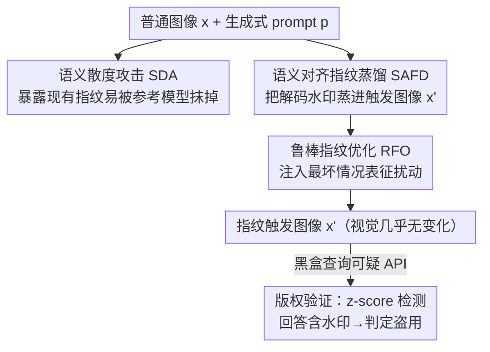

# SIF: Semantically In-Distribution Fingerprints for Large Vision-Language Models

**会议**: CVPR 2026  
**arXiv**: [2604.17041](https://arxiv.org/abs/2604.17041)  
**代码**: https://github.com/UCF-ML-Research/SIF-VLM-Fingerprint (有)  
**领域**: AI安全 / 模型版权 / 多模态VLM  
**关键词**: 模型指纹, 版权验证, 视觉-语言模型, 文本水印蒸馏, 对抗鲁棒性

## 一句话总结
针对开源大视觉-语言模型（LVLM）被盗用的版权追踪问题，SIF 先用语义散度攻击（SDA）揭示已有指纹"语义反常、易被检测删除"的致命缺陷，再提出把文本解码水印蒸馏进触发图像、并对最坏情况表征扰动做鲁棒优化的非侵入式指纹方案，使被盗模型在标准解码下仍生成"语义自然却带可验证水印"的回答，在量化/微调/输入扰动/SDA 防御下都比 PLA 等基线高出数倍 FMR。

## 研究背景与动机
**领域现状**：开源 LVLM（LLaVA、Qwen-VL 等）通常带许可证限制商用，但下游开发者常违规拿去搭付费 API。版权追踪的主流思路是"模型指纹"——构造一组特定的输入-输出对，让原始模型对触发输入稳定吐出某个特征回答，而无关模型不会，从而黑盒判定某 API 是否盗用了已发布模型。

**现有痛点**：现有 LVLM 指纹都偏离了自然问答行为。Instruction Fingerprint (IF) 靠指令微调植入罕见触发-回答对，需要重训，对**已发布**模型无效；Proflingo 优化对抗性 prompt 前缀逼模型吐预设答案，触发文本困惑度极高（PPL≫1000）；PLA 扰动输入图像强行让模型对"描述这张图"输出与图无关的固定短语（如"CVPR conference"）。这些触发的输入或输出在分布上明显反常。

**核心矛盾**：指纹要可验证，就得让触发输入/输出"与众不同"；但"与众不同"本身就是破绽——盗用者只要拿一个轻量参考模型测一下输入困惑度、对比一下输出语义散度，就能识别并替换掉这些指纹查询。作者把这一攻击形式化为**语义散度攻击（SDA）**，实测能把 PLA/Proflingo/IF 的指纹几乎全部抹掉（FMR 降到 0 或近 0）。问题根因是：已有指纹**不是语义保持（semantic-preserving）的**。

**本文目标**：设计一种指纹，同时满足四条性质——有效性（准确识别盗用模型）、可靠性（不在无关模型上误触发）、隐蔽性（触发查询是正常语义的 prompt、回答是 in-distribution 且与视觉内容相关）、鲁棒性（经量化/微调后仍存活）。

**切入角度**：既然破绽来自"语义反常"，那就把验证完全放在模型的**自然语义空间内**完成。作者注意到 LLM/LVLM 生成内容的文本水印技术——在解码阶段轻微偏置 token logits、让生成文本携带不可感知但统计可检测的信号——天生满足"流畅+语义保持"，只是它原本用于保护**内容**且需要控制解码过程，不能直接用于保护**模型**。

**核心 idea**：把这种"为内容设计的解码水印"蒸馏进**视觉模态的触发图像**里，使被盗模型在标准解码（不需控制 logits）下就自然生成"读起来正常、却暗含可验证水印"的回答，再对量化/微调引起的表征漂移做鲁棒优化。

## 方法详解

### 整体框架
SIF 把版权追踪拆成三块：先用 **SDA** 当"红队"暴露现有指纹的脆弱性（也是攻防的威胁模型），再用 **SAFD + RFO** 离线构造一批指纹触发图像，最后在**版权验证**阶段把触发图像喂给可疑黑盒 API、用 z-score 检测其回答里是否含约定水印信号。

构造侧的核心是：给定一张普通图像 $x$ 和一个普通生成式 prompt $p$，在图像上叠加一个 $\ell_\infty \le \varepsilon$ 的小扰动得到触发图 $x'=x+\delta$（视觉上几乎看不出变化）。一个被文本水印加持的"教师"先对 $(x,p)$ 生成一段带水印回答和逐步的水印 token 列表 $\mathcal{G}_t$；SAFD 通过优化 $x'$，让冻结的 LVLM（学生）在标准解码下既语义对齐教师回答、又把概率质量压到 $\mathcal{G}_t$ 上。RFO 在此基础上注入"最坏情况表征扰动"，让指纹在量化/微调后依然存活。验证时只需黑盒查询、跑一次水印 z 检验，无需访问参数或 logits。

### 关键设计

**1. 语义散度攻击 SDA：先证明"语义反常"就是死穴**

这是本文的"破"，用来论证现有指纹为什么不可信。作者的洞察是：PLA/Proflingo/IF 的触发输入或输出都在分布上反常，于是引入一个良性参考模型（轻量开源 VLM）来度量散度。对每个进入的查询，先算它在参考模型下的困惑度，超过标定阈值（实验取 PPL>1000）就标记可疑；再让被盗模型和参考模型各生成回答，从**词汇重叠**（非停用词 Jaccard 相似度）和**轻量语义相似度**（all-MiniLM-L6-v2）两路比较，散度过大（如词汇重叠 <0.1）就判为指纹查询、用参考模型的回答替换掉。

这个攻击不需任何训练、延迟极小（参考计算可并行，相对 LLaVA/Qwen 仅 ~14% 额外算力），且在正常用户查询上误报 <5%（VisionArena）。它揭示的关键事实是：因为指纹依赖**模型特有的表征**，参考模型复现不出被盗模型的指纹行为，所以"标记可疑+替换"就能精准清除指纹。Table 3 显示 Proflingo/IF 在 SDA 下 FMR 直接归零、PLA 仅剩 0.07/0.11，而 SIF 仍保 0.86/0.85。它定义了 SIF 必须正面攻克的"隐蔽性"考题。

**2. 语义对齐指纹蒸馏 SAFD：把解码水印搬进图像，让回答"正常却带签名"**

这是本文的"立"。文本水印在解码步把分布改写成 $q_t(v)\propto\exp(z_t(v)+\Delta_t(v))$，靠密钥相关的偏移 $\Delta_t$ 抬高水印 token 列表 $\mathcal{G}_t$ 的概率，检测时用同密钥重建 $\mathcal{G}_t$、做单边 z 检验。但它要控制解码、对开源场景不可行。SAFD 改为**只优化触发图像 $x'$、冻结 $f_\theta$**，把这个水印偏好"蒸馏"进图像，使模型在标准解码下自发偏向水印 token。

优化目标融合两项 $\mathcal{L}(x')=\lambda_{\text{wm}}\mathcal{L}_{\text{wm}}(x')+\lambda_{\text{ce}}\mathcal{L}_{\text{ce}}(x')$。**水印对齐损失**鼓励学生分布把质量放到 $\mathcal{G}_t$ 上：

$$\mathcal{L}_{\text{wm}}(x')=\frac{1}{T}\sum_{t=1}^{T}-\log\Big(\sum_{v\in\mathcal{G}_t}\tilde{p}_\theta(v\mid x',p,y_{<t})\Big)$$

其中 $\tilde p_\theta$ 是把学生分布**截断到 top-$K$ 再重归一化**（实验 $K{=}50$）后的分布——这一步把优化牢牢约束在 LVLM 的自然解码区内，从而嵌入的是 **in-distribution** 水印而非异常 token，这正是隐蔽性的来源。**语义对齐损失** $\mathcal{L}_{\text{ce}}(x')=-\frac1T\sum_t \log p_\theta(\hat y_t\mid x',p,\hat y_{<t})$ 以教师对 $(x,p)$ 生成的带水印回答 $\hat y$ 为目标做交叉熵，防止触发图像在优化中漂向无关语义、同时允许自然的措辞变化。最终产物是一张视觉几乎不变、却能让模型标准解码就吐出"带水印文本"的触发图。

**3. 鲁棒指纹优化 RFO：抢先模拟量化/微调的最坏表征漂移**

盗用者常做量化或微调，这会改变中间激活、造成 embedding 漂移，从而削弱甚至抹掉指纹。RFO 的思路是把"最坏情况表征扰动"提前注入 SAFD 的优化里，做对抗式加固。具体是两遍前向：先以基础损失 $\mathcal{L}_{\text{base}}=\lambda_{\text{wm}}\mathcal{L}_{\text{wm}}+\lambda_{\text{ce}}\mathcal{L}_{\text{ce}}$ 反传，得到各层激活的梯度 $g_\ell=\nabla_{h_\ell}\mathcal{L}_{\text{base}}(x')$——它们指向"最能破坏指纹"的方向。把这些梯度聚成一个范数受限、梯度对齐的扰动

$$\epsilon_\ell^\star=\rho\,\frac{g_\ell}{(\sum_{j=1}^{L}\|g_j\|_2^2)^{1/2}},\quad \|\epsilon_\ell^\star\|_2\le\rho$$

注入下一遍前向 $\tilde h_\ell(x')=h_\ell(x')+\epsilon_\ell^\star$，然后在**被扰动的前向**下优化触发图像，最小化 $\mathcal{L}_{\text{RFO}}(x')$。等价于在"假想模型已被人动过手脚"的最坏激活下还要让指纹成立，于是优化出的触发图天然抗表征漂移。这个二遍流程类似 SAM 式的最坏扰动估计，只不过加在**激活**而非权重上；$\rho{=}0.5$ 给出最稳定增益。

### 损失函数 / 训练策略
- **总目标**：$\mathcal{L}=\lambda_{\text{wm}}\mathcal{L}_{\text{wm}}+\lambda_{\text{ce}}\mathcal{L}_{\text{ce}}$，实验取 $\lambda_{\text{wm}}=\lambda_{\text{ce}}=0.5$；RFO 用其扰动版 $\mathcal{L}_{\text{RFO}}$。
- **优化器/预算**：PGD 1000 步，步长 $\alpha=1/255$，图像扰动预算 $\varepsilon=16/255$；学生分布 top-$K{=}50$ 截断；RFO 表征扰动幅度 $\rho=0.5$。
- **水印方案**：沿用 Zhao et al. 的 unigram 水印——密钥决定每步占词表 50% 的 $\mathcal{G}_t$，对其 logit 加 4 的偏移；检测用 $z=(s-\mu)/\sigma$，$s=\frac1T\sum_t\mathbf 1\{y_t\in\mathcal{G}_t\}$。
- **触发数据**：ImageNet-2012 验证集随机图像初始化，配 AMBER 基准的生成式 prompt，过滤生成 <80 token 的样本，随机取 200 组图-文对。单张触发图在 H100 上约 6 分钟，纯离线一次性开销且可复用、可并行。

## 实验关键数据

**评测指标 FMR（Fingerprint Matching Rate）**：对每个指纹查询，从无关 LVLM 标定一个 per-query 阈值 $\tau_i$（保证无关模型不超过它，从而零误报），若回答水印分超过 $\tau_i$ 即判为匹配，FMR = 匹配样本占全部指纹查询的比例；基线方法则以"输出含确切触发目标或语义等价变体"的比例计。FMR 越高，追踪能力越强。

### 主实验

模型：LLaVA-1.5-7B、Qwen2.5-VL-7B（5 次均值）。

| 设置 | 指标 | PLA | Proflingo | IF | SIF (本文) |
|------|------|-----|-----------|-----|-----------|
| LLaVA 4bit 量化 | FMR | 0.40 | 0.43 | 0.32 | **0.49** |
| LLaVA 8bit 量化 | FMR | 0.79 | 0.76 | 0.67 | **0.89** |
| LLaVA 微调-LlavaMix | FMR | 0.00 | 0.11 | N/A | **0.31** |
| LLaVA 微调-MathV | FMR | 0.37 | 0.12 | 0.09 | **0.49** |
| Qwen 4bit 量化 | FMR | 0.76 | 0.78 | 0.50 | **0.88** |
| Qwen 微调-GUI-Actor | FMR | 0.14 | 0.09 | N/A | **0.72** |
| Qwen 微调-MathV | FMR | 0.24 | 0.13 | 0.11 | **0.45** |

SIF 在所有量化/微调设置下都是最高 FMR。尤其在 LlavaMix 这类用大规模指令-回答语料重对齐的微调下，PLA 等靠"对抗捷径"逼出的无关回答彻底失效（FMR=0），而 SIF 因为指纹嵌在语义连贯回答里仍存活。

### 隐蔽性 / 可靠性 / 抗扰动

| 评测维度 | 配置 | PLA | SIF (本文) |
|---------|------|-----|-----------|
| 触发查询困惑度 | Avg PPL（越接近正常 75.7 越隐蔽） | 46.67 | **44.56** |
| SDA 防御下 FMR | LLaVA / Qwen | 0.07 / 0.11 | **0.86 / 0.85** |
| 强 SDA（GPT-4.1 语义裁判） | 被标记为可疑的比例 | 86% | **4%** |
| 无关模型误触发 | FMR（越低越好） | 0–0.005 | **0** |
| 输入扰动 JPEG(Q85) | FMR | 0 | **0.18** |
| 输入扰动 Resize 224² | FMR | 0 | **0.23** |
| 输出改写 DIPPER | FMR | 0.84 | 0.78 |

IF/Proflingo 在 SDA 下 FMR 归零，PLA 仅剩 0.07/0.11；SIF 几乎不掉。可靠性方面 SIF 对所有跨族无关模型（LLaVA-13B/mistral、Qwen-3B、MiniGPT-4 等）FMR 全为 0，与盗用模型上的高 FMR 形成清晰可分的检测间隔。

### 消融实验

RFO 消融（LLaVA-1.5-7B，Int4 量化 + 全量微调）：

| 配置 | Int4 | LlavaMix | TikZ | MathV |
|------|------|----------|------|-------|
| PLA（基线） | 0.40 | 0.00 | 0.13 | 0.37 |
| 仅 SAFD（w/o RFO） | 0.46 | 0.26 | 0.28 | 0.42 |
| RFO ($\rho{=}0.1$) | 0.47 | 0.28 | 0.31 | 0.45 |
| **RFO ($\rho{=}0.5$)** | **0.49** | **0.31** | 0.37 | **0.49** |
| RFO ($\rho{=}1.0$) | 0.48 | 0.30 | 0.34 | 0.49 |

### 关键发现
- **仅 SAFD 已超 PLA**：在 LlavaMix 这种重微调下 PLA 直接 0.00，SAFD 已到 0.26，说明"语义内嵌"本身就比"对抗捷径"耐微调；RFO 再补一档稳定增益（LlavaMix 0.26→0.31）。
- **$\rho$ 不是越大越好**：$\rho{=}0.5$ 最稳，过小（0.1）加固不足、过大（1.0）反而略降，因为过强的虚拟扰动会拖累原始指纹质量。
- **扰动预算/步数饱和**：FMR 随图像扰动预算单调增，但为保不可感知取 $16/255$；优化在 600 步前涨得快、之后变缓，统一用 1000 步。
- **量化对 Qwen 影响更小**：Qwen-VL 预训练就混入低精度数据，故量化下 FMR（4bit 0.88）天然更高。

## 亮点与洞察
- **"先攻后防"的论证结构很扎实**：SDA 不只是个攻击，它把"指纹为什么会被破"量化成困惑度+语义散度两条可操作信号，直接定义了 SIF 必须达到的隐蔽性指标（PPL 贴近正常、SDA 下 FMR 不掉），让防御方案有了明确靶子。
- **跨模态水印蒸馏是核心巧思**：把"为文本内容设计、需控制解码"的水印，转译成"为模型版权设计、只动输入图像、走标准解码"的指纹——一次模态迁移就同时拿下了隐蔽性（in-distribution）和非侵入性（不改参数、黑盒可验证）。top-$K$ 截断重归一化是让水印"留在自然解码区"的关键开关。
- **RFO 把对抗鲁棒性思路迁到"防版权擦除"**：在激活层做最坏情况扰动、再优化触发图，等价于"假设模型已被人量化/微调过"还要让指纹成立。这种"对未来篡改做对抗加固"的范式可迁移到任何需要在模型被改后仍存活的水印/后门/指纹任务。
- **可落地性强**：6 分钟/张离线、可并行、可复用，验证全程黑盒，符合真实"只有 API 访问权"的取证场景。

## 局限与展望
- **绝对 FMR 在硬微调下并不高**：MathV/Paintingform 等微调下 SIF 也只有 0.45 左右，虽远超基线但单次查询命中率有限，实际取证需多条指纹查询联合判定（论文也是按一批查询统计 FMR）。
- **依赖外部参考/无关模型标定阈值**：可靠性的"零误报"建立在能找到合适无关 LVLM 标定 $\tau_i$ 上，跨族模型可分性好，但同族近亲（如不同 size 同系列）的可分性边界论文展开有限。
- **隐蔽性评测的攻防是动态的**：SDA 用的是轻量参考模型+固定阈值，作者也测了 GPT-4.1 语义裁判（SIF 仅 4% 被标记），但更强的针对性检测（如专门学 SIF 触发图统计特征）未充分探讨。
- **白盒/灰盒擦除未覆盖**：威胁模型限定盗用者黑盒部署，但若盗用者拿到参数做大规模再训练或针对性水印移除，鲁棒性如何仍待验证（作者论证擦除攻击需大量带水印样本、而指纹查询稀少且密钥保密，故认为不现实）。

## 相关工作与启发
- **vs IF（Instruction Fingerprint）**：IF 靠指令微调植入触发-回答对，是**侵入式**且需在发布前嵌入，对已发布模型 N/A、还损害效用；SIF 非侵入、不改参数、对任意已发布模型都能事后构造指纹。
- **vs PLA / Proflingo（对抗触发）**：二者用对抗图像/prompt 前缀逼出语义无关的固定输出，触发反常、PPL 极高、易被 SDA 清除；SIF 的触发是正常 prompt、输出语义连贯且与图相关，SDA 下 FMR 仍 0.85+。
- **vs 内容水印（解码期 logits 偏置）**：那类方法保护的是**生成内容**、需控制解码，开源模型场景不可行；SIF 把同一套水印**蒸馏进图像**、走标准解码即可触发，转而保护**模型本身**。
- **vs 表征/参数指纹**：用参数方向或表征统计验证所有权的方法需白盒/灰盒（拿到参数或 logits），而 SIF 纯黑盒、只看输入-输出行为。

## 评分
- 新颖性: ⭐⭐⭐⭐⭐ 跨模态把"内容水印"蒸馏成"模型指纹"+先用 SDA 量化现有方法死穴，问题定义和解法都很新
- 实验充分度: ⭐⭐⭐⭐ 两模型、量化/微调/输入输出扰动/SDA/无关模型多维评测齐全，但单次 FMR 绝对值偏低、同族可分性展开不足
- 写作质量: ⭐⭐⭐⭐⭐ "攻—防"结构清晰，损失/威胁模型/指标定义都给得明确
- 价值: ⭐⭐⭐⭐ 直击开源 LVLM 版权取证的真实痛点，方案可落地、黑盒可验证

<!-- RELATED:START -->

## 相关论文

- [\[CVPR 2026\] PureProof: Diffusion-Resistant Black-box Targeted Attack on Large Vision-Language Models](pureproof_diffusion-resistant_black-box_targeted_attack_on_large_vision-language.md)
- [\[CVPR 2026\] VCP-Attack: Visual-Contrastive Projection for Transferable Black-Box Targeted Attacks on Large Vision-Language Models](vcp-attack_visual-contrastive_projection_for_transferable_black-box_targeted_att.md)
- [\[CVPR 2026\] Hierarchically Robust Zero-shot Vision-language Models](hierarchically_robust_zero-shot_vision-language_models.md)
- [\[CVPR 2026\] GenBreak: Red Teaming Text-to-Image Generation Using Large Language Models](genbreak_red_teaming_text-to-image_generation_using_large_language_models.md)
- [\[CVPR 2026\] Unlearning without Forgetting: Securely Removing Targeted Concepts from Large-Scale Vision-Language Open-Vocabulary Detectors](unlearning_without_forgetting_securely_removing_targeted_concepts_from_large-sca.md)

<!-- RELATED:END -->
