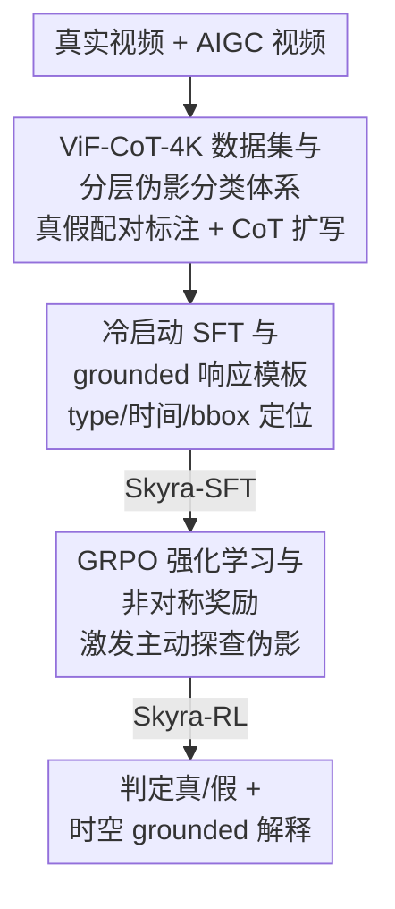

# Skyra: AI-Generated Video Detection via Grounded Artifact Reasoning

**会议**: CVPR 2026  
**论文**: [CVF Open Access](https://openaccess.thecvf.com/content/CVPR2026/html/Li_Skyra_AI-Generated_Video_Detection_via_Grounded_Artifact_Reasoning_CVPR_2026_paper.html)  
**代码**: https://joeleelyf.github.io/Skyra  
**领域**: AI安全 / AIGC视频检测  
**关键词**: AIGC视频检测, 伪影推理, 多模态大模型, 强化学习, 可解释取证

## 一句话总结
Skyra 把"AI 生成视频检测"从黑盒二分类改造成可解释的伪影推理任务：先用人工精标的 ViF-CoT-4K 数据集做冷启动 SFT，让 MLLM 学会在时空上定位伪影并给出 grounded 解释，再用带非对称奖励的 GRPO 强化学习激发模型主动找伪影，最终在自建 ViF-Bench 上比次优方法绝对准确率高 26.73%。

## 研究背景与动机
**领域现状**：随着扩散模型和多模态生成模型（Sora-2、Kling、Wan2.2 等）把合成视频做得越来越逼真，社区开始构建 AIGC 视频检测器。主流路线有两条：一是 DeMamba、NSG-VD 这类二分类检测器，从时空特征里学一个"真/假"判别面；二是近年兴起的、借助 MLLM 做可解释检测的 BusterX++、DAVID-XR1 等。

**现有痛点**：二分类检测器本质是一场"检测器 vs 生成器"的军备竞赛——每出一个新生成模型，旧的判别特征就可能失效，泛化性差、面对未见样本很脆弱，而且整个判定过程不可解释，无法满足需要人工复核的取证场景。MLLM 路线看似能给理由，但作者实测发现：即便是 SoTA 通用 MLLM，加上精心设计的 CoT 提示，在检测任务上也只有近随机的准确率（多数 <60%）；BusterX++ 这类适配后的模型更像"内容描述器"，过度关注画质、光照等表层线索，却忽略了人类真正赖以辨伪的、违反物理规律的内在伪影；DAVID-XR1 引入了人工标注，但分类体系模糊、有效样本少，模型效果差。

**核心矛盾**：现有方法没有抓住"人是怎么辨别 AI 视频的"这一本质。人先感知整体语义和时序语境，再主动搜索时空不一致（物体突然消失、不自然运动、不合理场景转换），这些线索是**模型无关、普适**的内在证据（intrinsic evidences）。而现有 MLLM 既缺乏对这类细微伪影的敏感度，又容易把压缩、运动模糊等自然退化误判为伪造。

**本文目标**：让模型像人一样推理——既要会主动挖掘本质伪造线索，又要能自我核验、复查真视频里的可疑区域，同时提升精度与可信度，并把判定理由 grounding 到具体时空位置上。

**核心 idea**：构建首个大规模人工精标的 AIGC 视频伪影数据集 + 分层伪影分类体系，用"冷启动 SFT + 非对称奖励 RL"两阶段训练，把 Qwen2.5-VL-7B 调成一个专做伪影 grounded 推理的检测器 Skyra。

## 方法详解

### 整体框架
Skyra 的输入是一段视频（真实或 AI 生成），输出是"真/假"判定 **加上** 一段把伪影定位到时间区间 `<t>` 和空间框 `<bbox>` 的可解释推理。整条管线分三块：先离线构建 ViF-CoT-4K 数据集（采集真/假视频对、人工标注伪影、用 Gemini-2.5-Pro 把人工标签扩写成 CoT），再用它做**冷启动 SFT** 让基座 MLLM 具备基本的伪影感知和按模板输出的能力（得到 Skyra-SFT），最后用带**非对称奖励的 GRPO 强化学习**进一步激发模型自驱式地探查伪影线索（得到最终模型 Skyra-RL）。

### 关键设计

**1. ViF-CoT-4K 数据集与分层伪影分类体系：用人工精标的"真假配对"证据取代模糊标注**

这一步针对的痛点是：现有数据集要么真假视频在时长、FPS、域分布上差异巨大（2–3 倍），让模型靠捷径作弊；要么生成模型少且过时；要么干脆没有细粒度伪影标注。作者从 Panda-70M 采约 3.5K、Kinetics-400 采 1.5K 真实视频，用 MLLM 把真实视频转写成 prompt 去驱动 T2V/I2V 生成模型（训练用 Wan2.2-TI2V-5B、Wan2.1-1.3B、CogVideoX-1.5、HunyuanVideo，测试集再加 Wan2.2-A14B、LTX-Video-13B、Hailuo、Sora-2 等十余个最新模型），并用 GPT-4o-mini 做语义一致性过滤，保证真假样本在语义和格式上对齐、消除 shortcut 信号。

伪影分类体系是三层的：L1 分两大类——**Low-level Forgery**（感知质量伪影）和 **Violation of Laws**（物理/逻辑不一致）；L2 细化成 8 类（色彩/光照异常、纹理异常、运动伪造；物体不一致、交互不一致、违反因果、违反常识、不自然运动）；L3 是最细的可观测伪影（如"物体不一致"再分为物体异常消失、物体异常出现、人物身份不一致）。标注时一个关键巧思是 **real-fake co-play**：把 AI 视频和对应真实视频并排展示，让标注员为每条"伪造证据"在真视频里找出对应的"真实证据"，以此验证伪影确实是生成导致而非压缩退化。最后把人工标的 type / 文本解释 / 时间戳 / bbox 喂给 Gemini-2.5-Pro，按"观察→理解→草拟→复查→结论"流程 + ICL 扩写成带 grounded 证据的 CoT。

**2. 冷启动 SFT 与 grounded 响应模板：先教会模型"按格式把伪影说在点子上"**

直接上 RL 行不通——基座模型对 AIGC 伪影几乎没有感知，奖励会极度稀疏、学不动（消融里纯 RL 反而更差）。所以先做监督冷启动。作者设计了统一外层模板 $F_{outer}$：`<thinking>[推理过程]</thinking><answer>[Fake/Real]</answer>`。对**假视频**，推理里要用 $F_{fake}$ 把伪影锚定到位置：`<type>[伪造类型]</type> in <t>[t_start, t_end]</t> at <bbox>[x_min, y_min, x_max, y_max]</bbox>`；对**真视频**则用 $F_{real}$，同样带时空标签去**巡检**可疑区域，但不输出伪造类型——这一步是为了平衡真假样本的训练 gap，逼模型对真视频也走一遍"巡检-排除"而不是草率下结论。

训练就是在 ViF-CoT-4K 上对 Qwen2.5-VL-7B 做全参数微调，文本和视频经编码器融合后自回归生成目标序列，用标准交叉熵损失：

$$\mathcal{L}_{\mathrm{SFT}} = -\sum_{t=1}^{T} \log p_{\theta}\left(y^{*}_{t} \mid y^{*}_{<t}, t, v\right)$$

消融证明这一冷启动阶段至关重要：没有它，后续 RL 奖励稀疏、几乎学不到有意义的取证线索。

**3. GRPO 强化学习与非对称奖励：让模型自驱式找伪影，且不让它"一律猜假"**

冷启动之后，作者用强化学习激发模型自洽的伪影发现能力——这也是为了能持续适配新生成域、减少反复人工标注。算法用 GRPO，关键是重新设计了奖励。总奖励是两项加权：

$$R(x,y) = w_{acc}\cdot r_{acc}(x,y) + w_{chk}\cdot r_{chk}(x,y)$$

其中 $w_{acc}=0.8$、$w_{chk}=0.2$。**非对称准确率奖励** $r_{acc}$ 是这篇论文最有意思的设计：判对得 $1.0$；漏报（真值 Fake 却判 Real）得 $0.0$；**误报（真值 Real 却判 Fake）罚 $-0.2$**。为什么要不对称？因为任务本身就不对称——判"假"只需找到一个伪影，确认"真"却要穷尽排除所有不一致；作者发现若对两类错误对称惩罚，模型会很快过拟合、强烈偏向预测"Fake"。**巡检奖励** $r_{chk}$ 只在输出符合 $F_{outer}$ 格式时激活，用正则抽出有效巡检块数 $N_{check}$（假按 $F_{fake}$、真按 $F_{real}$ 匹配），奖励为：

$$r_{chk}(x,y) = \min\left(\ln(1+N_{check}),\ \ln(1+3)\right)$$

即鼓励模型主动给出最多 3 个巡检/证据块、但封顶防止灌水。两项合起来：既严格监督最终分类，又鼓励主动探查时空线索。

### 损失函数 / 训练策略
SFT 阶段用上面的交叉熵 $\mathcal{L}_{\mathrm{SFT}}$，全参数微调 5 个 epoch、学习率 1e-5；RL 阶段 actor 学习率 5e-7、KL 系数 0.02。统一从每段视频均匀采 16 帧、resize 到 256p，在 8 卡 H200 上训练。

## 实验关键数据

### 主实验
ViF-Bench 上对比三组基线：二分类检测器（AIGVDet/DeMamba/NSG-VD）、现成 MLLM（Qwen2.5-VL 系列、InternVL-3、GPT-4.1-mini、Gemini-2.5-flash 等）、MLLM 检测器（BusterX++）。报告 14 个生成器上的平均 Acc/Recall/F1。

| 方法 | 类型 | 平均 Acc | 平均 Recall | 平均 F1 |
|------|------|---------|------------|---------|
| AIGVDet | 二分类 | 69.08 | 44.88 | 56.76 |
| DeMamba | 二分类（次优） | 64.29 | 96.66 | 73.00 |
| NSG-VD | 二分类 | 49.65 | 98.66 | 66.21 |
| GPT-4.1-mini | 现成 MLLM | 54.08 | 14.90 | 24.21 |
| Gemini-2.5-flash | 现成 MLLM | 53.36 | 63.78 | 57.48 |
| BusterX++ (7B) | MLLM 检测器 | 56.90 | 14.40 | 21.94 |
| **Skyra-SFT (7B)** | 本文 | 90.11 | 84.65 | 88.76 |
| **Skyra-RL (7B)** | 本文 | **91.02** | 88.35 | **90.27** |

Skyra-RL 比次优的 DeMamba 绝对准确率高 26.73%、F1 高 17.27%；比 MLLM 基线高约 34.12% Acc、32% F1。RL 相对 SFT 在难度更高的 I2V 样本上 recall 进一步涨约 3.74%。

跨域测试在 GenVideo（含过时生成器、近静态低质样本）上：

| 方法 | 平均 Acc | 平均 Recall | 平均 F1 |
|------|---------|------------|---------|
| DeMamba（最佳二分类） | 60.71 | 95.94 | 70.91 |
| Skyra-SFT (7B) | 63.98 | 28.70 | 41.00 |
| Skyra-RL (7B) | 71.78 | 45.60 | 59.00 |
| Skyra-RL-GenVideo (7B) | **91.00** | 87.66 | **90.00** |

Skyra-RL 比最佳二分类高 11.07% Acc；更亮眼的是：仅用 GenVideo 训练集随机抽的 2.2K 数据、**无任何额外人工标注**、只训 1 个 epoch 的 RL，就把模型快速适配到新域（Skyra-RL-GenVideo），比 Skyra-RL 再涨 19.22% Acc、42.06% Recall——印证了 RL 阶段的快速域适配价值。

### 消融实验
| 配置 | Acc | Recall | F1 | 说明 |
|------|-----|--------|-----|------|
| Skyra-RL（完整） | 91.02 | 88.35 | 90.27 | 完整模型 |
| w/o CoT | 54.04 (-36.07) | 9.36 (-75.29) | 16.72 (-72.04) | 直接答真/假，近随机 |
| w/o Cold-Start（纯 RL） | 50.09 (-40.93) | 0.18 (-88.17) | 0.37 (-89.90) | 比 w/o CoT 还差，RL 单独学不动 |
| w/o RL（仅 SFT） | 90.11 (-0.91) | 84.65 (-3.70) | 88.76 (-1.51) | RL 阶段再补一点 |
| w/o 非对称奖励（对称 0/0） | 76.24 (-14.78) | 99.07 (+10.72) | 80.65 (-9.62) | 过拟合到"假"，recall 虚高但 Acc/F1 大跌 |
| w/o 巡检奖励（普通格式奖励） | 90.05 (-0.97) | 87.55 (-0.80) | 89.30 (-0.97) | 略降 |

### 关键发现
- **CoT 推理和冷启动是地基**：去掉 CoT 直接二分类掉到近随机（Acc 54）；更反直觉的是去掉冷启动直接纯 RL（仿 DeepSeek-R1-Zero 的思路）效果比去 CoT 还差（Acc 50.09），因为基座对 AIGC 伪影几乎无感知、奖励太稀疏，"R1-Zero 式"纯 RL 在此任务上复制不出成功。
- **非对称奖励是防"偏向猜假"的关键**：换成对称惩罚后，recall 飙到 99% 但其实是模型一律猜"Fake"的假象，Acc 反跌 14.78%、F1 跌 9.62%——验证了"判假只需一个伪影、判真需排除全部"这一任务不对称性必须在奖励里显式补偿。
- **鲁棒性好**：在压缩、缩放变换、高斯噪声、明暗/色彩变换等多种退化下，Skyra 仍保持各方法中的 SOTA。
- **案例可解释**：对真视频 Skyra 会走"描述-巡检-复查-结论"流程，主动检查易出伪影的区域（如新闻下方字幕条、人脸）再下结论；甚至能感知一些人类都难辨的细微 AIGC 证据。

## 亮点与洞察
- **把检测重定义为"grounded 伪影推理"**：不再训一个会过时的二分类判别面，而是教模型像人一样定位违反物理/逻辑的内在伪影，并把证据锚到 `<t>`+`<bbox>`，既可解释又更泛化。
- **非对称奖励抓住了任务本质**：判假/判真的证据需求天然不对称，作者用 $-0.2$ 误报惩罚 + $0.0$ 漏报这一极简设计就压住了"一律猜假"的退化倾向，这个洞察可迁移到任何"找证据"类（异常检测、内容审核）的 RL 任务。
- **真假 co-play 标注 + 真视频巡检模板**：用并排真视频锚定伪影、并强制模型对真视频也走巡检流程，巧妙平衡了真假训练 gap，避免模型对真视频草率判断。
- **RL 的零标注域适配**：仅 2.2K 无标注新域数据 + 1 epoch RL 就能快速迁移，给"生成器层出不穷、标注跟不上"的现实困境提供了一条低成本更新路径。

## 局限与展望
- **依赖大规模高质量人工标注**：ViF-CoT-4K 的精标（type/解释/时间戳/bbox + 多轮复审）成本很高，虽然 RL 阶段能缓解后续标注需求，但首轮冷启动绕不开。
- **CoT 监督部分由 Gemini-2.5-Pro 扩写**：CoT 文本质量受教师模型影响，可能引入风格偏置或事实漂移（⚠️ 论文用 self-curation + ICL 过滤来缓解，实际偏置程度需以原文附录为准）。
- **生成器是"军备竞赛"的另一面**：虽然主打泛化，但 ViF-Bench 仍是在已知的十余个生成器上构建，对全新架构生成器的真实泛化仍待验证；非对称奖励的 $-0.2$/$0.0$ 取值、$w_{acc}{=}0.8$ 等超参也偏经验，跨数据集的稳健性未充分扫描。
- 改进方向：把音频、元数据等多模态线索一并纳入 grounded 证据；或探索在线持续学习以追平生成器迭代。

## 相关工作与启发
- **vs 二分类检测器（DeMamba / NSG-VD）**：它们在特征空间学真假判别面，泛化差且不可解释；Skyra 改用伪影 grounded 推理，准确率与可解释性双赢——从表看二分类模型 recall 常虚高（DeMamba 96.66% recall 但 Acc 仅 64），说明其偏向某一类，而 Skyra 的 Acc/F1 更均衡。
- **vs MLLM 检测器（BusterX++）**：BusterX++ 更像内容描述器、过度关注画质光照等表层线索，Acc 仅 56.90%；Skyra 用人工精标的内在伪影 + 两阶段训练让模型聚焦物理违反类证据，Acc 跳到 91。
- **vs 纯 RL（DeepSeek-R1-Zero 式）**：R1-Zero 在很多视觉任务上证明纯 RL 可行，但本任务里基座对 AIGC 伪影零感知导致奖励稀疏，消融显示纯 RL 反而最差——说明"冷启动注入领域感知 + RL 激发探查"的顺序在低先验任务里不可省。

## 评分
- 新颖性: ⭐⭐⭐⭐⭐ 把 AIGC 视频检测重定义为 grounded 伪影推理，配套首个细粒度人工标注数据集与非对称奖励 RL，思路完整且有洞察。
- 实验充分度: ⭐⭐⭐⭐⭐ 14 个生成器主表 + GenVideo 跨域 + 鲁棒性 + 多组消融，证据链扎实。
- 写作质量: ⭐⭐⭐⭐ 动机—方法—实验逻辑清晰，伪影分类与奖励设计讲得透；部分表格/公式排版较密。
- 价值: ⭐⭐⭐⭐⭐ 面向 AIGC 滥用这一现实安全问题，数据集/基准/模型全开源，可解释取证落地价值高。

<!-- RELATED:START -->

## 相关论文

- [\[CVPR 2026\] VMD-FACT: A New Video Dataset and MLLM-based method for Detecting Realistic AI-Generated Video Misinformation](vmd-fact_a_new_video_dataset_and_mllm-based_method_for_detecting_realistic_ai-ge.md)
- [\[CVPR 2026\] Scaling Up AI-Generated Image Detection with Generator-Aware Prototypes](scaling_up_ai-generated_image_detection_with_generator-aware_prototypes.md)
- [\[CVPR 2026\] Zero-shot Detection of AI-Generated Image via RAW-RGB Alignment](zero-shot_detection_of_ai-generated_image_via_raw-rgb_alignment.md)
- [\[CVPR 2026\] Enabling Supervised Learning of Generative Signatures for Generalized AI-Generated Images Detection](enabling_supervised_learning_of_generative_signatures_for_generalized_ai-generat.md)
- [\[ICLR 2026\] Watermark-based Detection and Attribution of AI-Generated Content](../../ICLR2026/ai_safety/watermark-based_attribution_of_ai-generated_content.md)

<!-- RELATED:END -->
