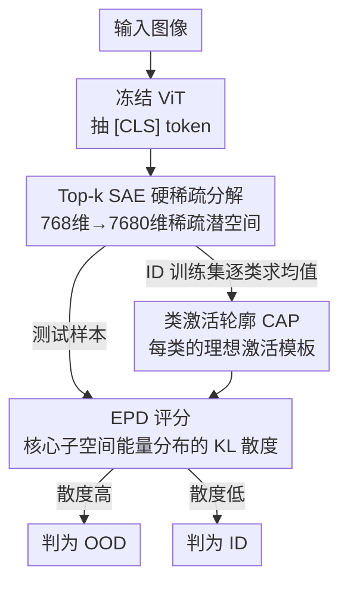

# Sparsity as a Key: Unlocking New Insights from Latent Structures for Out-of-Distribution Detection

**会议**: CVPR 2026  
**arXiv**: [2604.26409](https://arxiv.org/abs/2604.26409)  
**代码**: 无  
**领域**: AI安全 / OOD检测  
**关键词**: 稀疏自编码器, OOD检测, ViT可解释性, 类激活轮廓, KL散度评分

## 一句话总结
本文首次把 Top-k 稀疏自编码器（SAE）用到 ViT 的 [CLS] token 上，把纠缠的稠密特征拆成可解释的稀疏潜空间，发现同类 ID 样本会形成稳定的"类激活轮廓"（CAP），而 OOD 样本虽然能激活对的核心特征却无法复刻其能量分布形状，据此提出 EPD 评分，在多个 benchmark 上拿到最优平均 FPR95（40.96%）。

## 研究背景与动机
**领域现状**：OOD 检测要识别落在训练分布之外的输入，对自动驾驶、医疗诊断这类安全敏感场景至关重要。主流做法分两类：基于 logit 的置信度方法（MSP、ODIN、能量分数），以及基于特征距离的方法（Mahalanobis 距离、KNN）。

**现有痛点**：这些方法都把特征向量当成一个**单体、不透明**的整体，只用幅度、欧氏距离这类聚合统计量来判断。但深度表征本身是**纠缠**的——多个语义概念以叠加（superposition）的形式压缩在稠密激活里。只看激活的"量"不看内部结构的"质"，导致距离方法经常把几何上的偶然临近误判成语义上的真实相似。

**核心矛盾**：这个问题在 ViT 上尤其严重。ViT 通过自注意力把全局上下文汇聚进一个特殊的 [CLS] token，这个嵌入虽然紧凑表达力强，却是个黑盒——内部组织难以解释。这道"可解释性鸿沟"挡住了在 [CLS] 特征之上直接建鲁棒 OOD 机制的路。

**本文目标**：找到一种既可解释、又能稳定区分 ID/OOD 的表征，并基于它设计一个对安全场景友好（低 FPR95）的评分函数。

**切入角度**：作者借鉴了 SAE 在 LLM 可解释性上的成功——SAE 不像普通自编码器那样把输入压成低维瓶颈，而是**扩大**潜维度并强制稀疏，每个输入只用一小撮潜神经元重建，从而暴露出一组结构化、可解释的基。作者假设：如果把 ViT 的 [CLS] 也这样"展开"，同类样本应该会落到一组固定的活跃神经元上，形成可识别的结构。

**核心 idea**：用 **Top-k SAE 的硬稀疏**把 [CLS] 解纠缠成稀疏基，把每个类抽象成稳定的激活轮廓（CAP），再用 OOD 样本对这个轮廓**形状**的破坏程度（而非幅度）来打分。

## 方法详解

### 整体框架
整个方法分两个阶段。**Setup 阶段（一次性）**：冻结一个预训练 ViT，用 ID 数据（ImageNet-1k）抽出 [CLS] token，训练一个 Top-k SAE 把它展开成 7680 维稀疏潜空间；对每个类把训练样本的稀疏激活求均值，得到该类的 Class Activation Profile（CAP），作为这个类"理想激活结构"的模板。**Inference 阶段**：测试样本过 ViT 拿到预测类，再过冻结的 SAE 拿到稀疏激活；取该预测类 CAP 里能量最高的 L 个核心特征，把样本激活和 CAP 都投影到这 L 维并做 L1 归一化得到两条能量分布，用 KL 散度（即 EPD score）衡量两者形状差异，散度越大越像 OOD。

### 关键设计

**1. Top-k SAE 硬稀疏分解 [CLS]：用"硬"稀疏换来稳定的类特异激活基**

针对前面"稠密特征纠缠、看不清结构"的痛点，作者放弃传统 SAE 的"软"稀疏（$\ell_1$ 或 KL 惩罚）。软稀疏的致命问题是**不保证每个样本稀疏**：一个 $\ell_1$ 正则的模型遇到新奇的 OOD 输入时，仍可能在很多特征上产生弥散的低幅激活（shrinkage effect），把 ID 和 OOD 的边界糊掉。Top-k SAE 改成**硬约束**——对每个输入只保留激活值最大的 $k$ 个特征、其余强制清零。这等于在表征上插了一个结构瓶颈，逼模型为每个 ID 样本挑出最显著的少数特征，于是同类样本收敛到一组**稳定、不重叠**的潜神经元上。作者用 1000 个 ImageNet 类的核心特征集（按均值激活排序取前 5%）两两算 Jaccard 相似度，热力图几乎只有对角线、非对角接近零，证明 Top-k SAE 确实把各类解纠缠成了互不重叠的稀疏子空间（仅猫的不同品种这类语义近邻有微弱重叠）。SAE 是过完备的：潜维 $D_{latent}=7680$ 是 [CLS] 维度 768 的 10 倍，给解纠缠留足容量；$k=128$ 远小于 768，形成约 6 倍的逐样本降维瓶颈。

**2. Class Activation Profiles（CAP）：把"一个类长什么样"固化成可比对的结构不变量**

有了稳定的稀疏基，作者把类 $c$ 的全部 ID 训练样本的稀疏激活向量求均值，得到 $\bar{\mathbf{h}}^{c}\in\mathbb{R}^{D_{latent}}$，即该类的 CAP——一个类条件的"标准模板"。CAP 的价值在于它揭示了一个关键现象：OOD 样本**不是随机失败**的。OOD 输入会被 ViT 强行归到某个 ID 类，作者发现这是因为它**部分激活了那个类的核心特征**——比如被误判为"花盆（类 738）"的 iNaturalist 样本，确实在类 738 的核心特征上有显著激活，而在无关类（类 989 玫瑰果）上激活几乎为零。但 OOD 和 ID 有一个本质差别：把激活按 CAP 排序后画出来，ID 样本呈现**尖锐、高能量的头部**（激活高度集中在少数核心特征后迅速衰减），而 OOD 样本呈现**扁平、弥散的轮廓**——它击中了对的特征却无法复刻 ID 那种集中的能量分布形状。这个"形状被破坏"正是检测信号的来源，也直接催生了下面的 EPD。

**3. Energy Profile Divergence（EPD）：用能量分布形状的 KL 散度量化结构破坏**

为了量化"形状被破坏"的程度，作者把核心子空间里的激活当成**能量分布**来比。先取 CAP $\bar{\mathbf{h}}^{c}$ 里均值最大的 $L$ 个核心特征的下标集 $M^{c}$，把样本激活和 CAP 都按这个下标过滤成 $L$ 维核心向量 $\mathbf{S}$ 和 $\mathbf{C}$。然后做 L1 归一化，把它们投到 $(L-1)$ 维单纯形上——这一步剥掉了整体幅度（scale），只留下核心特征层级的"形状"：

$$\mathbf{P}_i=\frac{\mathbf{S}_i}{\sum_{i=1}^{L}\mathbf{S}_i},\qquad \mathbf{Q}_i=\frac{\mathbf{C}_i}{\sum_{i=1}^{L}\mathbf{C}_i}$$

其中 $\mathbf{Q}$ 是 ID 类的稳定参考（单纯形上的锚点/质心），$\mathbf{P}$ 是测试样本投进来的新点。EPD 就定义为两者的 KL 散度：

$$\text{EPD} = D_{\text{KL}}(\mathbf{P}\parallel\mathbf{Q}) = \sum_{i=1}^{L}\mathbf{P}_i\log\frac{\mathbf{P}_i}{\mathbf{Q}_i}$$

（⚠️ 原文公式(3)分母处印作 $\mathbf{G}_i$，按上下文应为 $\mathbf{Q}_i$，以原文为准。）EPD 越高说明样本的能量分配越偏离该类核心特征层级的特征结构。这一招的关键在于它衡量的是**比例形状**而非幅度——既能抓住 Far-OOD（激活不了核心特征）也能抓住 Near-OOD（激活了一个冲突的模式），比传统只看幅度/欧氏距离的方法更鲁棒。

### 损失函数 / 训练策略
SAE 的训练目标是重建损失 + 辅助损失：$\mathcal{L}_{\text{Total}}=\mathcal{L}_{\text{Recon}}+\alpha\mathcal{L}_{\text{AuxK}}$。$\mathcal{L}_{\text{Recon}}$ 是归一化 [CLS] 与其重建之间的 MSE。$\mathcal{L}_{\text{AuxK}}$ 用来缓解 Top-k 模型常见的"死神经元"问题（某些神经元永远赢不了 k-竞争），鼓励死神经元去重建残差误差，由 $\alpha$ 加权。激活头大小 $p=15\%$：作者做 99%-firing 分析发现每个类平均激活约 18.8%（std 4.6%）的潜维，落在 14–23% 的有意义激活带，据此扫参定下。训练成本极低：单张 RTX 4080 上 100 epoch 跑完 ImageNet-1k（128 万样本，batch 4096）约 17 分钟，且 SAE 训完即冻结、推理无需重训。

## 实验关键数据

### 主实验
benchmark 用 OpenOOD v1.5，ID 为 ImageNet-1k，OOD 分 near-OOD（SSB-hard、NINCO）和 far-OOD（iNaturalist、Textures、OpenImage-O）。主指标：AUROC（越高越好）与 FPR95（越低越好，安全场景最关键）。骨干为 ViT-B/16（ID Acc 81.14%）。

| 方法 | 平均 FPR95↓ | 平均 AUROC↑ |
|------|------|------|
| MDS | 44.43 | 87.18 |
| RMDS | 43.40 | 87.60（最佳） |
| SHE | 44.63 | 85.90 |
| KNN | 47.35 | 84.13 |
| ViM | 47.02 | 86.51 |
| **Ours** | **40.96（最佳）** | 87.26（次佳） |

本文拿到全场最佳的平均 FPR95（40.96%），AUROC 87.26% 仅次于 RMDS 居第二。分数据集看（表 2），在 SSB-hard、Textures 上 FPR95 领先；far-OOD 上 iNaturalist FPR95 仅 17.84%、OpenImage-O 26.03%。

| 数据集 | FPR95↓ | AUROC↑ |
|------|------|------|
| SSB-hard（near） | 82.41 | 72.21 |
| NINCO（near） | 48.06 | 85.74 |
| iNaturalist（far） | 17.84 | 95.17 |
| Textures（far） | 30.44 | 91.06 |
| OpenImage-O（far） | 26.03 | 92.12 |

### 消融实验
| 配置 | 关键发现 | 说明 |
|------|---------|------|
| 评分函数 EPD vs 欧氏/余弦距离 | EPD 在所有 split 上全胜 | 在同一稀疏 CAP 框架内替换评分，验证"比形状"优于"比距离" |
| 骨干 ViT-B/16 → Swin-T | 平均 FPR95 43.99（仍具竞争力但低于 ViT） | Swin 窗口局部注意力 + 层级聚合 → 全局一致性弱、激活头不够尖锐 |
| 骨干 → DINOv2 | FPR95 大幅下降（更好） | DINOv2 为物体中心全局表征优化，CAP 更尖锐更稳定 |

### 关键发现
- **形状 > 幅度**：EPD（KL 散度形状度量）相比欧氏/余弦距离全面更优，印证核心假设——OOD 的破绽在能量分布的形状而非激活幅度。
- **骨干全局一致性决定上限**：方法效果与骨干能否产生"尖锐、稳定的激活头"强相关。DINOv2（物体中心、类内方差小）最好，ViT-B/16 次之，Swin-T（局部窗口注意力）最弱——说明 CAP 形状对齐这套机制吃全局相干性。
- **安全友好**：在最看重 FPR95 的部署场景拿到最佳平均 FPR95，意味着在"95% ID 被正确接受"的约束下假阳性率最低。

## 亮点与洞察
- **跨模态迁移 SAE 可解释性**：把原本用于 LLM 解释的 Top-k SAE 第一次搬到 ViT [CLS] 上做 OOD，思路新——OOD 不再来自 logit/距离偏差，而来自解纠缠空间里的"结构破坏"。这种"借另一个领域成熟的可解释工具来解本领域难题"的范式很值得借鉴。
- **OOD 误判机制的因果解释**：作者没把 OOD 被误分当成随机噪声，而是用激活亲和度实验证明 OOD 之所以被归到某类，是因为它部分点亮了那个类的核心特征——这把"为什么会误判"讲成了可观测、可量化的现象，CAP/EPD 都建在这个洞察上。
- **硬稀疏 vs 软稀疏的关键差别**：明确指出软稀疏遇到 OOD 会产生弥散低幅激活（shrinkage）糊掉边界，而硬 Top-k 强制结构瓶颈放大 ID/OOD 差异——这个对比可迁移到任何"想用稀疏性凸显异常"的任务。
- **极低开销**：SAE 17 分钟一次性训练、推理冻结无需微调，比很多需要改训练或采梯度的 OOD 方法工程上友好得多。

## 局限性 / 可改进方向
- 作者承认只在**类级别**验证了稀疏模式的可解释性（CAP），没做更细粒度的**单神经元语义可视化**，没回答每个潜神经元到底捕捉了什么具体概念，留作未来工作。
- 方法对骨干有依赖：Swin-T 上明显掉点，说明它强依赖骨干能产出"全局一致、激活头尖锐"的特征，换到全局相干性弱的架构会退化——这限制了即插即用的通用性。
- near-OOD（尤其 SSB-hard，FPR95 仍高达 82.41）依然是硬骨头，因为语义近邻的核心特征确实部分重合，形状差异不够大。
- 没有跨模态/跨架构的实证，"扩展到其他模态"目前只是展望。

## 相关工作与启发
- **vs ViM / ReAct**：两者都在**稠密、纠缠**的表征上操作——ViM 融合倒数第二层特征残差与 logit，ReAct 截断激活分布提升可分性。本文则显式用 SAE 把表征**解纠缠**成类条件子空间，从结构破坏而非幅度偏差出发检测，多了一层可解释性。
- **vs Mahalanobis / KNN 等距离方法**：它们把特征当单体、靠欧氏/距离统计判断，容易被几何偶然临近误导；本文把核心子空间归一化成能量分布、用 KL 比"形状"，剥掉了幅度尺度的干扰。
- **vs LLM 上的 SAE 工作**（Cunningham、Bricken 等）：同样用稀疏字典学习解纠缠，但本文证明这套范式在 ViT 视觉表征上也成立，并落到 OOD 这个具体下游，而非停在可解释性分析本身。

## 评分
- 新颖性: ⭐⭐⭐⭐⭐ 首次把 Top-k SAE 用于 ViT [CLS] 的 OOD 检测，CAP/EPD 两个概念自洽且有可解释性支撑。
- 实验充分度: ⭐⭐⭐⭐ OpenOOD v1.5 全套 + 三种骨干 + 评分函数消融，较完整；但部分细节结果压在 Appendix，near-OOD 仍弱。
- 写作质量: ⭐⭐⭐⭐⭐ 从现象分析（Jaccard/UMAP/激活亲和度）一路推到方法，逻辑链清晰，图文配合好。
- 价值: ⭐⭐⭐⭐ 安全敏感场景拿到最佳 FPR95、开销低、可解释，实用价值高；通用性受骨干限制略打折扣。

<!-- RELATED:START -->

## 相关论文

- [\[CVPR 2026\] RankOOD: Class Ranking-based Out-of-Distribution Detection](rankood_-_class_ranking-based_out-of-distribution_detection.md)
- [\[CVPR 2026\] Learning Latent Concepts for Detecting Out-of-Distribution Objects](learning_latent_concepts_for_detecting_out-of-distribution_objects.md)
- [\[CVPR 2026\] Enhancing Out-of-Distribution Detection with Extended Logit Normalization](enhancing_out-of-distribution_detection_with_extended_logit_normalization.md)
- [\[CVPR 2026\] Bypassing the Transport Plan: Dynamic Reweighting for Out-of-Distribution Detection with Optimal Transport](bypassing_the_transport_plan_dynamic_reweighting_for_out-of-distribution_detecti.md)
- [\[NeurIPS 2025\] Double Descent Meets Out-of-Distribution Detection: Theoretical Insights and Empirical Analysis](../../NeurIPS2025/ai_safety/double_descent_meets_out-of-distribution_detection_theoretical_insights_and_empi.md)

<!-- RELATED:END -->
