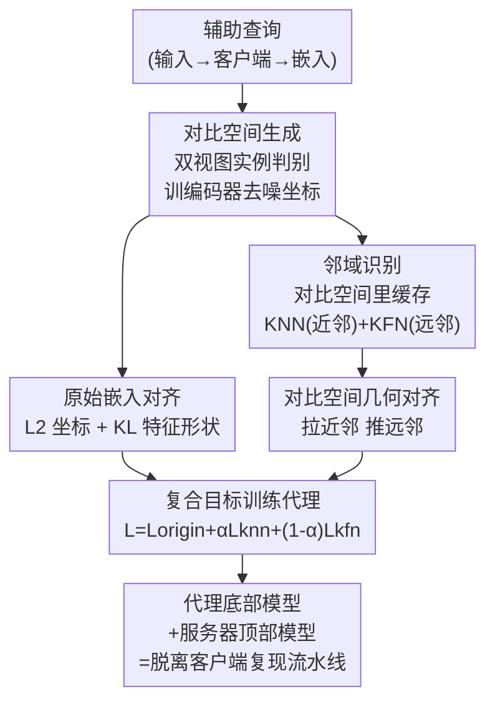

# Stealing Split Learning Bottom Models by Recovering Embedding Geometry

**会议**: CVPR 2026  
**论文**: [CVF Open Access](https://openaccess.thecvf.com/content/CVPR2026/html/Zhang_Stealing_Split_Learning_Bottom_Models_by_Recovering_Embedding_Geometry_CVPR_2026_paper.html)  
**代码**: 无  
**领域**: AI 安全 / 隐私攻击  
**关键词**: 垂直联邦学习, 分割学习, 模型窃取, 对比学习, 嵌入几何

## 一句话总结
在垂直联邦学习（VFL）的分割学习场景里，作者提出 VENOM——一种"几何感知"的模型窃取攻击：它不再逐点拟合服务器看到的嵌入坐标，而是先用对比学习在这些嵌入上重建一个稳定的邻域几何空间，再让代理模型同时对齐坐标、对齐特征形状、并尊重"近邻该近、远邻该远"的局部结构，从而绕过当前主流的加噪/解耦防御，在 6 个数据集上把窃取准确率（尤其在强防御 Model Rake 下）拉回到可用水平。

## 研究背景与动机

**领域现状**：垂直联邦学习让多个机构（如不同医院、银行）在不共享原始特征的前提下联合训练模型，工程上普遍用**分割学习（split learning）**实现：模型被切成客户端的"底部模型（bottom model）"和服务器的"顶部模型（top model）"。每个客户端把本地特征过一遍底部模型，只把中间**嵌入** $h_i^m = f_b^m(x_i^m)$ 发给服务器；服务器拼接所有客户端嵌入喂进顶部模型出预测，再把对嵌入的梯度回传给客户端。原始特征不出本地，但**嵌入流持续暴露在服务器侧**。

**现有痛点**：这个暴露的嵌入流就是攻击面。已有工作（PISTE）指出，一个训练时"老实"的服务器，在测试阶段可以扮演 honest-but-curious 的窃贼：它构造和客户端同特征空间的辅助输入，去查询客户端、记录返回的嵌入，然后训一个**代理底部模型**逐点回归这些嵌入（最小化 $\|\hat f_b(x_j) - h_j\|_2^2$）。一旦代理学成，服务器配上自己的顶部模型就能脱离客户端复现整条流水线。为防这一手，出现了两类防御：**扰动类**（InvL-ENP/DNP 按 Jacobian 谱形状给嵌入或输入注入定向噪声；以及加噪、剪枝、随机投影、DP-SGD）和**解耦类**（Model Rake 给每个客户端训两个输出空间互相推开、各自又紧凑的底部模型，让单个代理无法同时对齐两套矛盾目标）。

**核心矛盾**：这些防御看似有效，但作者抓住一个本质张力——**逐点拟合很脆，可有个信号防御抹不掉**。逐点拟合脆有两个原因：一是防御可以通过加噪、旋转空间、把输出拆到多分支来改变攻击者看到的坐标，坐标本身一抖，对值就不可靠；二是更关键的，**分割模型为了对服务器顶部模型仍然有用，必须保留嵌入的局部相似结构**——如果两个语义相近的输入被映射到很远，下游分类器精度就崩了。也就是说，为了保住效用，系统**不得不**保留一致的邻域结构，即便防御扰乱了坐标。这个邻域结构就是一个**可恢复的残留信号**。

**本文目标**：设计一种攻击，恢复并利用服务器可见嵌入的**邻域几何**，使代理模型即便在先进防御下也能忠实模仿客户端底部模型。

**切入角度**：防御能动坐标，但动不了"谁和谁是邻居"的相对关系（动了效用就掉）。所以与其拟合不稳定的坐标，不如去拟合稳定的关系结构。

**核心 idea**：先用对比学习把服务器可见的嵌入映射进一个**去噪、放大相似/不相似差异**的几何空间，在那里挖近邻与远邻，再让代理同时满足"坐标对齐 + 特征形状对齐 + 邻域几何对齐"，把被防御"解耦/扰动"开的嵌入重新"耦合"回来。

## 方法详解

### 整体框架
VENOM 是一条三步的窃取流水线，全程站在 honest-but-curious 服务器视角，只能查询客户端拿 `(输入, 嵌入)` 对，看不到客户端权重和梯度。第一步**对比空间生成**：用辅助输入 $X^{aux}$ 查询客户端拿到嵌入集合 $H=\{h_i\}$，在这些嵌入上训一个对比编码器，得到一个比原始坐标更稳定的表示空间 $H^{con}$。第二步**邻域识别**：在对比空间里给每个锚点嵌入算余弦相似度，缓存它的 $k$ 个最近邻（KNN）和 $k$ 个最远邻（KFN），形成一张轻量的"几何脚手架"。第三步**代理训练**：用一个复合目标训练代理底部模型——既逐点对齐坐标（$L_{pt}$）、对齐特征质量分布（$L_{kl}$），又把代理输出过同一个冻结编码器后，拉向近邻、推开远邻（$L_{knn}, L_{kfn}$）。三步走完，代理学到的是每个样本相对其语义邻域的位置，而不只是一堆孤立点。

### 关键设计

**1. 对比空间生成：把防御能扰动的坐标，换成防御抹不掉的关系**

直接在服务器可见嵌入上逐点拟合，捕捉不到那些挺过防御的结构，因为坐标本身被噪声/旋转/分支搅乱了。VENOM 的做法是：对每个嵌入 $h_i$ 造两个轻微扰动视图（如加高斯噪声 + 随机 dropout），过一个基编码器 $e(\cdot)$ 接临时投影头 $g(\cdot)$，用标准实例判别（instance discrimination）目标训练——同一个 $h_i$ 的两个视图互为正样本要拉近，batch 内其他视图全是负样本要推远：

$$\ell_{i,j} = -\log \frac{\exp(\text{sim}(z_i, z_j)/\tau_{con})}{\sum_{k=1}^{2n} \mathbb{1}[k\neq i]\,\exp(\text{sim}(z_i, z_k)/\tau_{con})}$$

其中 $\text{sim}$ 是余弦相似度，$\tau_{con}=0.1$ 是温度。训完**丢掉投影头、冻结编码器**，把原始嵌入映成对比嵌入 $H^{con}=\{e(h_i)\}$。这一步为什么有效：实例判别会**放大样本间的相似与不相似**，让局部邻域更清晰、底层几何比"暴露在分割接口处的原始坐标"更稳定——防御扰的是坐标，扰不了"经对比去噪后谁聚谁分"这件事，于是攻击把战场从脆弱的坐标搬到了稳定的关系空间。

**2. 邻域识别：在去噪后的空间里挖出"该近/该远"的几何脚手架**

光有稳定空间还不够，得把"利用关系"落成可监督的信号。在对比嵌入 $H^{con}$ 上，对每个锚点 $h_i^{con}$ 算它与所有其他点的余弦相似度，记下相似度最高的 $k$ 个最近邻和最低的 $k$ 个最远邻：

$$N_k^{near}(i) = \arg\max_{J,|J|=k} \sum_{j\in J}\text{sim}(h_i^{con}, h_j^{con}), \quad N_k^{far}(i) = \arg\min_{J,|J|=k} \sum_{j\in J}\text{sim}(h_i^{con}, h_j^{con})$$

这些邻居集用冻结编码器**预计算并缓存**，$k$ 取辅助集的 10%（$K=0.10\,|X^{aux}|$）。小数据集用精确搜索，大数据集用近似采样（每锚点只在 $2K$ 大小的候选池里选 top-$K$/bottom-$K$，把比较量从 $O(N)$ 砍到 $O(2K)$）。关键在于：这套近邻/远邻是在**对比去噪后的空间**里挖的，而不是在被防御腐蚀的原始坐标里挖——消融显示后者（w/o CON）虽比完全没几何监督好，但远不如前者，因为腐蚀过的几何会把假邻居当真邻居。

**3. 复合对齐目标：坐标 + 特征形状 + 邻域几何三级监督**

单纯逐点拟合丢掉了局部几何，所以 VENOM 把逐点对齐和几何感知监督耦合起来。第一级是**原始嵌入对齐**，$L_2$ 项直接对坐标，KL 项让代理复现目标嵌入的"特征质量分布"（把嵌入各维过 softmax 当分布算 KL）：

$$L_{pt} = \frac{1}{N_{aux}}\sum_i \|\hat h_i - h_i\|_2^2, \quad L_{kl} = \frac{1}{N_{aux}}\sum_i \sum_d P_{h_i}(d)\log\frac{P_{h_i}(d)}{P_{\hat h_i}(d)}, \quad L_{origin}=L_{pt}+L_{kl}$$

第二级是**对比空间几何对齐**：把代理输出 $\hat h_i$ 过同一个冻结编码器得 $\hat h_i^{con}$，用预存的近邻拉、远邻推：

$$L_{knn} = -\frac{1}{N_{aux}}\sum_i \frac{1}{k}\sum_{j\in N_k^{near}(i)}\text{sim}(\hat h_i^{con}, h_j^{con}), \quad L_{kfn} = \frac{1}{N_{aux}}\sum_i \frac{1}{k}\sum_{j\in N_k^{far}(i)}\text{sim}(\hat h_i^{con}, h_j^{con})$$

总目标 $L = L_{origin} + \alpha L_{knn} + (1-\alpha)L_{kfn}$，$\alpha=0.5$。为什么这样有效：KL 项提升逐点保真度，让后续过编码器挖出的几何更准；近邻吸引 + 远邻排斥两个力互补——只吸引会让嵌入塌缩、过拟合局部噪声，只排斥会过度分离、毁掉语义邻域，平衡时恰好保住"局部该近、对不相似样本留间隔"这个**防御为了效用必须保留**的结构。于是被多分支/加噪防御"解耦"的嵌入被重新"耦合"回来。

### 损失函数 / 训练策略
完整目标即上面的 $L = L_{origin} + \alpha L_{knn} + (1-\alpha)L_{kfn}$。训练用 Adam（学习率 $10^{-3}$，batch 256），温度 $\tau_{con}=0.1$、$\tau_{soft}=2$，$\alpha=0.5$，邻域 $K=10\%|X^{aux}|$。所有底部模型输出 128 维嵌入，对比编码器是 3 层线性映到 256 维 + 训练时才用的 2 层投影头，代理结构与对应底部模型一致。

## 实验关键数据

评测设置为 2 客户端 + 1 服务器的分割学习，数据按模态垂直切分（表格平分、图像沿竖中线切、多模态按文本/图像分）。指标：**S-ACC**（代理替换客户端底部 + 服务器顶部后的测试准确率）和 **AGR**（代理与原流水线预测一致的样本比例），均越高代表攻击越强。基线为标准逐点嵌入匹配（Steal）。

### 主实验

下表摘取强防御下的 S-ACC（%），最能说明 VENOM 的优势随防御强度放大：

| 数据集 / 防御 | Steal | VENOM | 防御后管线 ACC | 说明 |
|--------|------|------|------|------|
| MNIST / InvL-ENP | 81.61 | 90.85 | 95.25 | +9.2 pp |
| CIFAR-10 / InvL-DNP | 52.16 | 61.59 | 69.57 | +9.4 pp |
| MNIST / Model Rake | 17.44 | 68.52 | 82.41 | **+51.1 pp**，基线几乎被打崩 |
| CIFAR-10 / Model Rake | 12.84 | 52.58 | 61.78 | **+39.7 pp** |
| Bank / Model Rake | 45.76 | 79.35 | 85.82 | +33.6 pp |
| SUSY / Model Rake | 48.37 | 68.81 | 75.66 | +20.4 pp |
| NUS-WIDE / Model Rake | 46.82 | 67.51 | 76.39 | +20.7 pp |

AGR 趋势同样（CIFAR-10/InvL-DNP 从 50.49→68.84；NUS-WIDE/Model Rake 从 46.79→64.25）。无防御（Vanilla）下提升温和但一致（CIFAR-10 S-ACC 65.14→69.97）。

### 消融实验（CIFAR-10，强防御）

| 配置 | InvL-ENP S-ACC | InvL-DNP S-ACC | Model Rake S-ACC | 说明 |
|------|------|------|------|------|
| Full VENOM | 60.47 | 61.59 | 52.58 | 完整模型 |
| w/o KL | 58.32 | 59.17 | 46.43 | 去特征形状项，强防御下掉得更多 |
| w/o NM | 53.74 | 54.25 | 24.72 | 去邻域匹配，**退化最严重** |
| w/o CON | 55.46 | 55.85 | 32.03 | 邻域匹配改在原始空间做，仍劣于对比空间 |

### 关键发现
- **对比邻域匹配是性能主引擎**：去掉邻域匹配（w/o NM）退化最大，Model Rake 下 S-ACC 从 52.58 崩到 24.72，攻击退回逐点模仿；说明几何监督才是绕过解耦防御的核心。
- **对比空间不可省**：在原始（被腐蚀）空间挖邻域（w/o CON，32.03）虽好于完全没几何监督（24.72），但远不如对比空间（52.58）——对比编码器先去噪稳定邻域，挖出的 KNN/远邻才可信。
- **KL 是二级增益**：提升逐点保真度，间接改善挖出的几何，单独贡献约 1–2 pp，但 Model Rake 下放大到约 6 pp。
- **超参规律**：邻域 $k$ 从 1%→10% 收益最大、之后饱和；$\alpha=0.5$ 最优，偏向吸引会塌缩、偏向排斥会过度分离；辅助数据从 1%→10% 增益最大。
- **OOD 容忍度**：近 OOD 辅助数据（CIFAR-100、Tiny-ImageNet）仅中度退化，远 OOD（拿 MNIST 当 CIFAR-10 的辅助）则崩溃，因嵌入跌出流形、编码器学到与受害任务无关的几何（用 FID 量化分布偏移，FID 越大性能越低）。
- **效率折中**：近似邻域采样把平均攻击时间砍 36.5%，S-ACC/AGR 仅小幅下降，说明攻击对邻居集不完美有鲁棒性。

## 亮点与洞察
- **攻击哲学的转移**：从"拟合脆弱的坐标"转向"拟合防御为效用而被迫保留的关系几何"，这是一个很漂亮的对抗视角——它直接把防御的"效用约束"变成了攻击的"可利用信号"，防御越想保效用、就越得留下这个口子。
- **对比学习当"去噪透镜"用**：把自监督对比学习从"学表示"重新定位成"稳定被防御腐蚀的几何"，并且训完即丢投影头、冻结编码器当固定度量，思路可迁移到任何"坐标不稳但关系稳"的窃取/蒸馏场景。
- **三元一致性指标做证据**：用 triplet consistency（代理是否保住受害者"近邻该近于远点"的相对序）直接验证 VENOM 比 Steal 更好地保住局部邻域，把"恢复几何"这个抽象主张落成可测量证据。
- **对安全研究的警示**：当前 VFL 的加噪/剪枝/解耦防御被系统性地证伪——只要模型还得对服务器有用，邻域结构就抹不掉，单靠扰动坐标的防御路线可能是死路。

## 局限与展望
- **远 OOD 即失效**：辅助数据必须与受害分布足够接近（近 OOD 尚可、远 OOD 崩溃），现实里攻击者若拿不到同域辅助数据，攻击力大打折扣。
- **威胁模型偏强**：假设服务器能在测试阶段持续查询客户端底部模型并拿到嵌入；若部署侧限制查询次数/频率或不开放推理端点，攻击前提就不成立。
- **未对抗自适应防御**：评测的防御都不知道 VENOM 存在；一旦防御方也针对"邻域几何"设计扰动（如主动打乱对比空间可恢复的关系、或像 B4B 那样追踪查询覆盖并惩罚），效果未知。
- **代理容量需匹配**：代理过深会记忆嵌入噪声、过浅表达力不够，需要大致对齐受害者底部模型容量，实战中容量未知时可能要试错。
- **可改进方向**：把邻域几何监督升级为"对抗自适应防御"的鲁棒版本，或探索查询预算受限下的几何恢复，会更贴近真实部署威胁。

## 相关工作与启发
- **vs PISTE（逐点窃取基线）**: PISTE 用辅助查询收集 `(输入, 嵌入)` 对、逐点回归训代理；本文指出这种逐点拟合在防御下脆弱，改为先重建几何再多级对齐，区别在于攻"关系"而非攻"坐标"，强防御下优势巨大（Model Rake 下 +20~51 pp）。
- **vs InvL-ENP/DNP、Model Rake（防御方）**: 这些防御分别用谱形噪声和双分支解耦来打乱坐标，本文证明它们都留下了"效用必需的邻域结构"这个可恢复信号，从而被 recouple。
- **vs Cont-Steal（编码器窃取）**: Cont-Steal 也用对比对齐目标窃取图像编码器、匹配受害嵌入几何；本文差异在于明确针对"分割模型为效用必须保留的局部邻域"，并在一个**学习到的**对比空间里显式恢复这种几何来监督代理，而非在原始空间直接对齐。

## 评分
- 新颖性: ⭐⭐⭐⭐⭐ 把"防御为效用必须保留邻域几何"这一张力转成攻击信号，视角新且打击面广，系统性证伪了主流 VFL 防御。
- 实验充分度: ⭐⭐⭐⭐ 6 数据集 × 8 防御、消融/敏感性/OOD/效率/容量分析齐全，但缺对抗自适应防御的评测。
- 写作质量: ⭐⭐⭐⭐ 动机链条（坐标脆 vs 关系稳）讲得清楚，图文对照到位，公式完整。
- 价值: ⭐⭐⭐⭐ 对 VFL 隐私安全社区有明确警示价值，推动防御从"扰动坐标"转向"保护关系结构"。

<!-- RELATED:START -->

## 相关论文

- [\[CVPR 2026\] PROMPTMINER: Black-Box Prompt Stealing against Text-to-Image Generative Models via Reinforcement Learning and VLM-Guided Optimization](promptminer_black-box_prompt_stealing_against_text-to-image_generative_models_vi.md)
- [\[CVPR 2026\] MaxMark: High-Capacity Diffusion-Native Watermarking via Robust and Invertible Latent Embedding](maxmark_high-capacity_diffusion-native_watermarking_via_robust_and_invertible_la.md)
- [\[AAAI 2026\] HealSplit: Towards Self-Healing through Adversarial Distillation in Split Federated Learning](../../AAAI2026/ai_safety/healsplit_towards_self-healing_through_adversarial_distillation_in_split_federat.md)
- [\[CVPR 2026\] Fine-Tuning Impairs the Balancedness of Foundation Models in Long-tailed Personalized Federated Learning](fine-tuning_impairs_the_balancedness_of_foundation_models_in_long-tailed_persona.md)
- [\[CVPR 2026\] FedDAP: Domain-Aware Prototype Learning for Federated Learning under Domain Shift](feddap_domain-aware_prototype_learning_for_federated_learning_under_domain_shift.md)

<!-- RELATED:END -->
