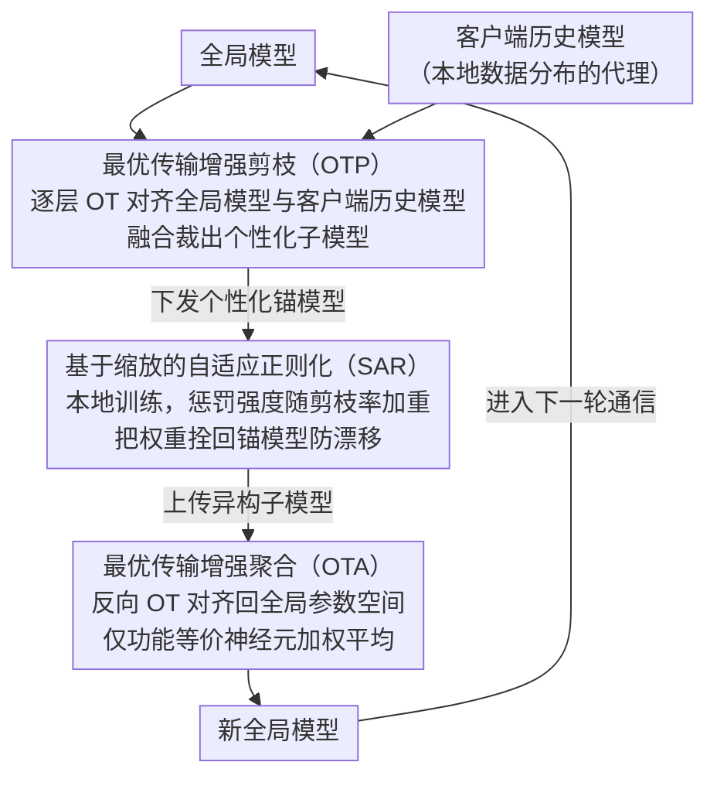

# SubFLOT: Submodel Extraction for Efficient and Personalized Federated Learning via Optimal Transport

**会议**: CVPR 2026  
**arXiv**: [2604.06631](https://arxiv.org/abs/2604.06631)  
**代码**: 无  
**领域**: AI安全  
**关键词**: 联邦学习, 网络剪枝, 最优传输, 个性化模型, 异构系统

## 一句话总结

提出 SubFLOT 框架，在服务器端利用最优传输（Optimal Transport）将全局模型的参数分布与客户端历史模型对齐，实现无需访问原始数据的个性化剪枝，并通过自适应正则化抑制剪枝导致的参数偏移，在多个数据集上大幅超越现有联邦剪枝方法。

## 研究背景与动机

**领域现状**：联邦学习（FL）在保护数据隐私的同时进行协作训练，但在实际部署中面临系统异构性（设备资源差异大）和统计异构性（非IID数据分布）的双重挑战。联邦网络剪枝作为应对策略，允许不同客户端训练不同大小的子模型，减少计算和通信开销。

**现有痛点**：联邦剪枝面临两个关键未解问题。第一，剪枝决策的位置存在两难困境：服务器端剪枝（如HeteroFL）采用统一压缩策略，无法个性化；客户端剪枝（训练-剪枝-微调范式）能实现个性化但对资源受限设备计算负担过重。第二，剪枝行为本身会加剧异构性——高剪枝率的子模型权重分布会偏离全局模型（参数漂移），破坏训练稳定性和全局收敛。

**核心矛盾**：如何在服务器端实现个性化剪枝（不访问原始数据），同时解决剪枝引发的参数空间偏移？

**本文目标** (1) 服务器端个性化剪枝——不接触客户端原始数据，为每个客户端生成定制化子模型；(2) 参数偏移抑制——防止不同剪枝率的子模型在训练过程中参数分布过度发散。

**切入角度**：作者将客户端的历史模型参数视为其本地数据分布的代理（proxy），基于这一洞察，将剪枝问题转化为全局模型与历史模型之间的Wasserstein距离最小化问题，通过最优传输计划指导个性化剪枝。

**核心 idea**：用最优传输在参数空间中对齐全局模型与客户端历史模型的神经元，实现无需数据访问的服务器端个性化剪枝。

## 方法详解

### 整体框架

SubFLOT 想回答一个看似矛盾的问题：服务器手里只有各客户端上一轮传回的模型权重、拿不到任何原始数据，怎么为每个客户端裁出一个「懂它本地数据」的个性化子模型？关键洞察是把客户端的历史模型参数当成它本地数据分布的代理——既然权重是数据训出来的，那两个模型权重越接近，背后的数据分布就越像。于是整个剪枝问题被改写成「在参数空间里把全局模型和某客户端历史模型对齐」的最优传输（OT）问题。

围绕这个洞察，每轮通信走三步并形成闭环：服务器先用 OT 把全局模型对齐到各客户端历史模型、裁出定制子模型下发（OTP）；客户端在本地数据上训练这个子模型，但用一个随剪枝率加重的正则项把权重拴在下发的锚模型附近、防止漂移（SAR）；训练完的异构子模型回到服务器后，再用一次 OT 把它们对齐回全局参数空间、然后加权平均成新的全局模型（OTA）。OT 在「分发」和「回收」两端各用一次，方向相反，构成一条完整链路。

### 关键设计

**1. 最优传输增强剪枝（OTP）：不碰数据，也能裁出个性化子模型**

服务器端剪枝的老问题是「一刀切」——像 HeteroFL 那样对所有客户端用同一套压缩策略，没法因地制宜；而真正个性化又似乎必须看数据。OTP 绕过这个两难：它把对齐做成逐层渐进匹配。对客户端 $i$ 的第 $l$ 层，先用上一层求出的传输计划 $T_i^{(l-1)}$ 把全局权重的输入侧重映射过来 $\hat{W}_G^{(l,l-1)} = W_G^{(l,l-1)} T_i^{(l-1)}$，保证层间的神经元对应关系连贯；再把对齐后的全局权重和客户端历史权重的输出神经元各看作一个离散概率分布，以欧氏距离建成本矩阵，求解离散 OT 得到本层的传输计划 $T_i^{(l)}$。最终下发的子模型不是简单照搬全局，而是把对齐后的全局知识和客户端历史参数融合：

$$\tilde{W}_i = \alpha \cdot W_{aligned} + (1-\alpha) \cdot W_i, \quad \alpha = 0.5$$

$\alpha=0.5$ 让全局知识迁移和本地特化各占一半。之所以有效，是因为历史参数隐式编码了本地数据分布，OT 找到的正是全局模型里和这个客户端数据最相关的那部分神经元——剪枝因此变成「数据感知」的，却始终没碰过一条原始样本。

**2. 基于缩放的自适应正则化（SAR）：剪得越狠，拴得越紧**

剪枝本身会反过来加剧异构——高剪枝率的小模型在本地训几轮后，权重分布很容易偏离全局模型（参数漂移），破坏全局收敛。SAR 在客户端训练时主动按住这种漂移：除了标准交叉熵，再加一项把当前权重拉回服务器下发的锚模型 $\tilde{W}_i$ 的正则项

$$\mathcal{L}_{SAR}(W_i) = \rho_i \cdot \|W_i - \tilde{W}_i\|_2^2,$$

整体目标为 $\mathcal{L}_i = \mathcal{L}_{CE} + \lambda \cdot \mathcal{L}_{SAR}$（$\lambda=1.0$）。妙处在于惩罚强度直接用剪枝率 $\rho_i$ 当权重：剪得越狠、越容易漂的客户端，约束自动越强。这和 HeteroFL 聚合后再修正的事后做法不同——SAR 是在训练过程中就从源头压住漂移。

**3. 最优传输增强聚合（OTA）：先对齐功能等价的神经元，再平均**

异构子模型直接喂给 FedAvg 求平均有个隐患：不同客户端同一位置的神经元功能可能完全不同，硬平均等于把语义不一致的参数混在一起，造成破坏性干扰。OTA 复用 OT 机制，但方向反过来——为每个客户端算一个把它更新后的模型 $W_i^t$ 对齐回全局空间 $W_G^t$ 的映射 $\mathcal{T}_i$，对齐后再加权平均：

$$W_G^{t+1} = \sum_{i=1}^N p_i \cdot \mathcal{T}_i(W_i^t).$$

这样只有功能等价的神经元才会被匹配到一起求和，同时对齐过程天然把不同剪枝率带来的参数尺度差异归一化掉了。

### 损失函数 / 训练策略

合在一起，客户端本地损失为 $\mathcal{L}_i(W_i) = \mathcal{L}_{CE}(W_i; \mathcal{D}_i) + \lambda \cdot \rho_i \cdot \|W_i - \tilde{W}_i\|_2^2$。训练配置：20 个客户端全参与（join ratio 1.0），200 轮通信，每轮 5 个本地 epoch，SGD（lr=0.001），batch size 256，剪枝率从 $\{0, 1/4, 1/2, 3/4\}$ 中随机采样。收敛分析在强凸性假设下证明 SubFLOT 以 $1 - \mu\eta_l E/2$ 的线性速率收敛到全局最优的邻域。

## 实验关键数据

### 主实验（Label Skew设置）

| 方法 | CIFAR10 | CIFAR100 | TinyImageNet | AG News | HAR |
|------|---------|----------|-------------|---------|-----|
| HeteroFL | 84.54 | 40.95 | 19.68 | 84.12 | 69.80 |
| FlexFL | 85.13 | 49.21 | 22.23 | 86.02 | 76.24 |
| **SubFLOT** | **86.89** | **58.37** | **29.30** | **87.88** | **79.72** |

### 消融实验（Feature Shift - PACS数据集平均准确率）

| 方法 | Photo | Art | Cartoon | Sketch | Avg |
|------|-------|-----|---------|--------|-----|
| HeteroFL | 16.23 | 13.66 | 20.27 | 26.90 | 19.27 |
| FlexFL | 16.34 | 14.78 | 21.56 | 28.01 | 20.17 |
| **SubFLOT** | **48.23** | **28.73** | **42.55** | **46.83** | **41.58** |

### 关键发现

- CIFAR100上SubFLOT达到58.37%，比次优FlexFL（49.21%）高出9.16个百分点，优势随任务复杂度增加而扩大
- 在PACS特征偏移设置下，SubFLOT平均准确率41.58%，是次优方法（~20%）的两倍以上
- 扩展性实验：客户端从10扩展到100时，SubFLOT性能衰减最小（39.20%→32.61%），而大多数基线急剧下降
- Grad-CAM可视化证实OTP生成的子模型与客户端历史模型关注相同的语义关键区域

## 亮点与洞察

- **范式突破**：首次系统性地解决了服务器端个性化剪枝问题，打破了"服务器端=无个性化"的固有认知，证明了不接触原始数据也能实现数据感知的剪枝
- **OT的双重应用**：同一套最优传输机制被优雅地复用于剪枝（OTP）和聚合（OTA），形成了从分发到回收的完整闭环
- **自适应正则化设计精巧**：SAR以剪枝率为权重的设计简洁但有效，抓住了"剪枝越狠越需要约束"的核心直觉
- **理论保障完备**：提供了严格的收敛分析，证明了线性收敛速率

## 局限与展望

- OT计算虽然采用了逐层分解策略，但在模型层数和神经元数量较大时仍有较高的计算开销
- 实验中剪枝率从固定集合中随机采样，未考虑根据客户端实际资源动态确定最优剪枝率
- 收敛分析依赖于强凸性假设（Assumption 2），在非凸神经网络中的实际意义有限
- 缺少与知识蒸馏等其他模型压缩范式在联邦场景下的对比
- 目前仅评估了结构化剪枝（宽度剪枝），未探索非结构化剪枝或其他压缩形式

## 相关工作与启发

- HeteroFL [Diao et al.] 是本文的直接改进对象，其服务器端均匀剪枝策略是SubFLOT要突破的基线
- FedOTP [Singh et al.] 和 FedAli 将OT用于客户端特征空间对齐，SubFLOT将OT从特征空间转移到参数空间、从客户端转移到服务器端
- SAR的设计思路可以推广到其他异构联邦学习场景，如不同模型架构的联邦学习

## 评分

- **新颖性**: ⭐⭐⭐⭐⭐ — 首次将OT应用于联邦剪枝，服务器端个性化剪枝的范式是全新的
- **实验充分度**: ⭐⭐⭐⭐⭐ — 覆盖CV/NLP/IoT多领域，label skew/feature shift/real-world多设置，大量扩展性和消融实验
- **写作质量**: ⭐⭐⭐⭐ — 问题定义和方法描述清晰，但公式较多，部分读者可能需要OT背景知识
- **价值**: ⭐⭐⭐⭐ — 对联邦学习在边缘设备上的实际部署有重要意义，方法具有即插即用的潜力

<!-- RELATED:START -->

## 相关论文

- [\[CVPR 2026\] Bypassing the Transport Plan: Dynamic Reweighting for Out-of-Distribution Detection with Optimal Transport](bypassing_the_transport_plan_dynamic_reweighting_for_out-of-distribution_detecti.md)
- [\[ICML 2026\] Optimal Transport under Group Fairness Constraints](../../ICML2026/ai_safety/optimal_transport_under_group_fairness_constraints.md)
- [\[CVPR 2026\] Fine-Tuning Impairs the Balancedness of Foundation Models in Long-tailed Personalized Federated Learning](fine-tuning_impairs_the_balancedness_of_foundation_models_in_long-tailed_persona.md)
- [\[CVPR 2026\] FedDAP: Domain-Aware Prototype Learning for Federated Learning under Domain Shift](feddap_domain-aware_prototype_learning_for_federated_learning_under_domain_shift.md)
- [\[CVPR 2026\] FedAFD: Multimodal Federated Learning via Adversarial Fusion and Distillation](fedafd_multimodal_federated_learning_via_adversarial_fusion_and_distillation.md)

<!-- RELATED:END -->
