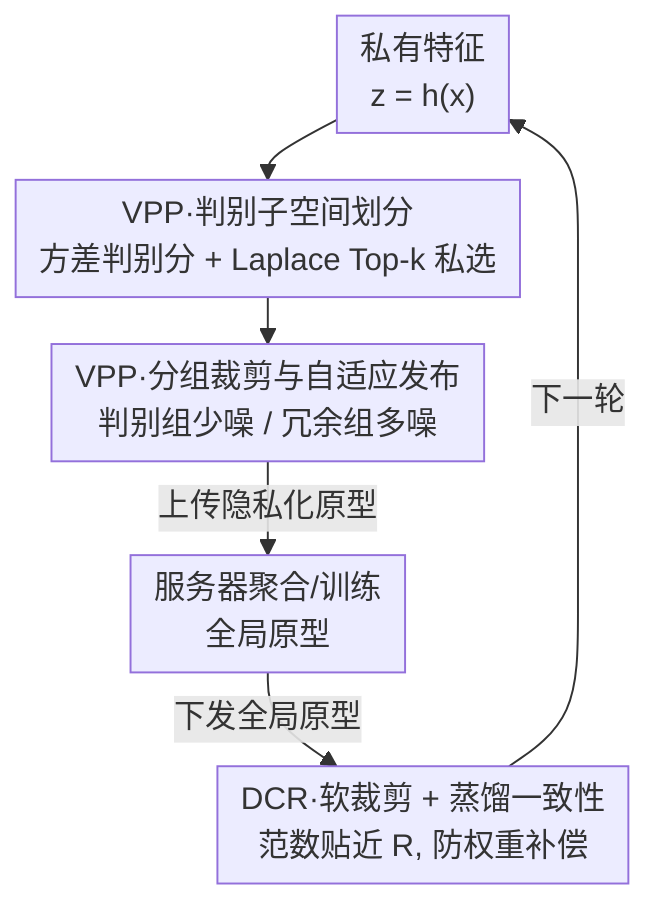

# Taming Noise-Induced Prototype Degradation for Privacy-Preserving Personalized Federated Fine-Tuning

**会议**: CVPR2026  
**arXiv**: [2604.27833](https://arxiv.org/abs/2604.27833)  
**代码**: https://github.com/yuCoryx/ProtoPFL_VPDR  
**领域**: 联邦学习 / 差分隐私 / 隐私保护  
**关键词**: 原型联邦学习, 局部差分隐私, 各向异性噪声, 软裁剪, 知识蒸馏

## 一句话总结
针对原型化个性化联邦学习（ProtoPFL）在共享类原型时为满足局部差分隐私而注入各向同性高斯噪声、却把判别性维度也一并淹没的问题，本文提出客户端即插件 VPDR：用方差自适应的 VPP 把噪声预算从判别子空间挪向冗余子空间、用蒸馏引导的 DCR 让特征范数主动贴近裁剪阈值，在同等 LDP 保证下显著改善隐私-效用权衡。

## 研究背景与动机

**领域现状**：基础模型的 scaling law 已经把公开数据吃得差不多了，要继续提升只能动用各客户端的私有数据，联邦学习（FL）正是为此而生的分布式微调范式。但在域偏移（domain skew）下单一全局模型常常水土不服甚至不收敛，于是个性化联邦学习（PFL）让每个客户端保留自己的组件。其中**原型化方法（ProtoPFL）**是一条轻量路线：冻结主干，只在客户端间交换每类的紧凑统计量（类均值/聚类中心，即"原型"）来对齐全局与本地语义。

**现有痛点**：原型把一整类特征压缩成"域指纹"，在小样本下会非常接近单个样本本身，直接上传会暴露在成员推断（MIA）和重构攻击之下。标准防御是上传前做局部差分隐私（LDP）：先对每个样本特征做 $\ell_2$ 裁剪把敏感度卡到阈值 $R$ 以内，再对原型加各向同性高斯噪声——本文把这套配方叫 **IGPP（Isotropic Gaussian Prototype Perturbation）**。

**核心矛盾**：IGPP 有两个治不好的病。其一是**噪声与判别性不匹配**：特征各维度对分类的贡献天差地别，有的维度携带关键判别信息、有的纯属冗余，而各向同性噪声"一视同仁"地猛灌，最该保护的判别方向反而被淹没（论文图 1：均匀噪声把蓝色 Class 1 原型推进了红色 Class 2 区域）。其二是 **$\ell_2$ 裁剪阈值两难**：阈值 $R$ 设大一点裁剪失真小，但敏感度 $\Delta\propto R$ 会逼出更大的噪声尺度；设小一点又会把特征范数狠狠压缩、不可逆地抹掉语义。

**本文目标 + 核心 idea**：用一个**客户端侧即插件 VPDR**同时拆掉这两个病，并且保证隐私强度不弱于 IGPP。VPP（Variance-adaptive Prototype Perturbation）解决前者——按维度判别性把噪声预算从判别子空间挪走；DCR（Distillation-guided Clipping Regularization）解决后者——训练阶段就把特征范数稳定地推到阈值 $R$ 附近，让固定的 $R$ 不再两难。

## 方法详解

### 整体框架

VPDR 不改 ProtoPFL 的通信骨架，而是塞进客户端的两个环节。一轮通信里：①**私有原型计算**（VPP）——客户端先算每维判别分、私有地选出判别子空间，再分组裁剪、分组加自适应噪声得到隐私化原型；②**上传**隐私化原型；③服务器**生成全局原型**（聚合或训练）；④**下发**全局原型；⑤**本地个性化微调**（DCR）——在基础 ProtoPFL 损失之外，用软裁剪层 + 蒸馏一致性稳住特征范数。关键在于：所有耗隐私预算的操作都集中在上传前的 VPP，DCR 是纯本地正则、**不花任何隐私预算**；整体预算按序列组合拆成 $(\epsilon,\delta)=(\epsilon_1,0)+(\epsilon_2,\delta)$，$\epsilon_1$ 给子空间选择、$\epsilon_2$ 给原型发布。

### 关键设计

**1. 方差自适应的判别分与私有子空间划分：让"哪些维度值得保护"可量化、可隐私选取**

各向同性噪声的根本问题是不知道哪些维度重要。本文从样本嵌入的类内/类间变异里直接读出每维判别性：定义类内变异 $V^{\mathrm{tra}}_j=\sum_c (n_m^c-1)s_{c,j}^2$、类间变异 $V^{\mathrm{ter}}_j=\sum_c n_m^c(\mu_{c,j}-\mu_j)^2$，再做 ANOVA 归一化得到判别分

$$S_j=\frac{V^{\mathrm{ter}}_j/(C-1)}{V^{\mathrm{tra}}_j/(n_m-C)+\zeta}.$$

归一化抵消了类别不平衡和小样本偏差。作者实测 $S_j$ 与标签互信息 $I(z_j;y)$ 强线性相关（PACS 上 Pearson/Spearman 系数稳定 >0.90），所以它是一个又轻又准的判别性代理。但麻烦在于：**这个选择本身依赖数据、因此是隐私敏感的**——即便选出的索引集不上传，它决定了后续分组裁剪边界和噪声协方差，发布的原型仍是它的函数，必须计入隐私账。于是先把分数裁到 $\bar S_j=\mathrm{clip}(S_j,0,H)$ 限定 $\ell_1$ 敏感度，再用一次性 Laplace Top-$k$ 机制（$k=d_A=\lceil\rho d\rceil$）私有地挑出判别子空间 $\mathcal I_A$，剩下 $d_B$ 维为冗余子空间 $\mathcal I_B$；当 Laplace 尺度 $\lambda\ge 2d_A H T/\epsilon_1$ 时，$T$ 轮划分满足 $(\epsilon_1,0)$-LDP。

**2. 分组裁剪 + 自适应噪声重分配：在同等 LDP 下把噪声挪出判别子空间**

有了划分，就把特征拆成 $\mathbf z=[\mathbf z_A;\mathbf z_B]$，对固定全局阈值 $R$ 分配分组边界 $R_A=R\kappa_A,\ R_B=R\kappa_B$，其中 $\kappa_A=\sqrt{d_A/d},\ \kappa_B=\sqrt{d_B/d}$，保证 $R_A^2+R_B^2=R^2$，于是分组敏感度 $\Delta_A=\Delta\kappa_A,\ \Delta_B=\Delta\kappa_B$。两组独立做 $\ell_2$ 裁剪、各自构造原型、各自加噪 $\boldsymbol\xi_A\sim\mathcal N(\mathbf 0,(\sigma_A\Delta_A)^2\mathbf I)$、$\boldsymbol\xi_B\sim\mathcal N(\mathbf 0,(\sigma_B\Delta_B)^2\mathbf I)$。理论上（定理 4.4）只要分组乘子满足 $1/\sigma_A^2+1/\sigma_B^2\le 1/\sigma_{\mathrm{ref}}^2$，整体发布就不弱于参考各向同性机制的 $(\epsilon_2,\delta)$-LDP。本文用一组权重 $w_A+w_B=1$ 令 $\sigma_A=\sigma_{\mathrm{ref}}/\sqrt{w_A},\ \sigma_B=\sigma_{\mathrm{ref}}/\sqrt{w_B}$，并且**完全免调参**地按维度定 $w_A=\kappa_B/(\kappa_A+\kappa_B)$。关键洞察是这条不等式：要让判别组的实际扰动不超过各向同性参考（$\sigma_A\Delta_A\le\sigma_{\mathrm{ref}}\Delta$），代入权重化简后等价于 $\kappa_A\le\kappa_B\Leftrightarrow 0<\rho\le 0.5$——**只要判别子空间不超过特征维度的一半，判别组拿到的噪声就不会多于各向同性基线，多出来的噪声全被推给冗余组**。虽然为子空间选择留预算导致 $\epsilon_2<\epsilon$、抬高了 $\sigma_{\mathrm{ref}}$，但靠这种定向保护换来的净效用增益盖过了拆预算的开销。

**3. 蒸馏引导的裁剪正则 DCR：训练时就把范数推到阈值附近，破解"范数-权重"补偿捷径**

硬裁剪很脆：范数远超阈值（$\|\mathbf z\|_2\gg R$）时一刀剪掉、结构信息不可逆丢失；范数远小于阈值（$\|\mathbf z\|_2\ll R$）时裁剪根本不起作用、小幅度向量被噪声吞没。DCR 在本地训练时动态正则特征空间来治这个两难。先在编码器末端挂一个**可微软裁剪层** $\widehat{\mathbf z}=\frac{R}{\|\mathbf z\|_2+\gamma R}\mathbf z$（$0<\gamma\ll1$），它把小范数特征往 $R$ 撑、把大范数特征平滑收缩，避免硬裁剪的梯度不连续。但模型可能耍赖：通过放大分类器权重来抵消软裁剪（图 4a 显示只用软裁剪时裁剪前范数在训练中后期反而上涨）。为切断这条**范数-权重补偿捷径**，引入 EMA 教师-学生蒸馏：把本地分类头拆成可训练学生 $f_m$ 和动量教师 $f_m^t$（$\theta_m^t=\beta\theta_m^t+(1-\beta)\theta_m$），教师在原始特征上出软标签 $y^t$、学生在软裁剪特征上预测 $y^s$，最小化温度缩放后的 KL 一致性

$$\mathcal L_{\mathrm{KD}}=\mathrm{KL}\Big(\mathrm{softmax}(y^t/\tau)\,\big\|\,\mathrm{softmax}(y^s/\tau)\Big).$$

因为教师不与学生共享参数耦合，模型无法靠权重缩放绕过裁剪，从而把"范数-权重拉锯"按住，让裁剪前范数稳定地集中在 $R$ 附近、对 $R$ 的具体取值不再敏感。

### 损失函数 / 训练策略
本地总目标为 $\mathcal L=\mathcal L_{\mathrm{BASE}}+\lambda_1\mathcal L_{\mathrm{KD}}$，其中 $\mathcal L_{\mathrm{BASE}}$ 是宿主 ProtoPFL 的原目标（分类交叉熵或 InfoNCE 式对比对齐），$\lambda_1$ 为 KD 权重。隐私上由序列组合：VPP 的子空间选择给 $(\epsilon_1,0)$-LDP、原型发布给 $(\epsilon_2,\delta)$-LDP，合起来 ProtoPFL+VPDR 满足整体 $(\epsilon,\delta)$-LDP；DCR 纯本地不耗预算。开销很轻：VPP 每轮额外 $\mathcal O(n_m d+d\log d)$ 计算、$\mathcal O(d)$ 内存，DCR 额外一遍教师前向，**通信复杂度严格不变**仍为 $\mathcal O(Cd)$（只传隐私化原型）。默认超参 $H{=}0.1,\ r{=}0.1,\ \rho{=}0.2,\ \gamma{=}0.05,\ \beta{=}0.999,\ \tau{=}4,\ \lambda_1{=}0.05$。

## 实验关键数据

骨干为冻结的 ViT-small（$d{=}512$），只训 adapter + 分类器；$T{=}20$ 轮、$E{=}2$ 本地 epoch，默认 $(\epsilon,\delta)=(1,10^{-5})$，$R$ 在 $\{5,10,15,20\}$ 网格搜。VPDR 作为插件接到 6 个 ProtoPFL 框架（FedProto / FedPCL / FPL / FedPLVM / FedTGP / MPFT）上，与各自的 +IGPP 版本对比。

### 主实验

域偏移三基准上的平均精度 AVG（越高越好）/ 标准差 STD（越低越好）。下表摘取代表性框架：

| 框架 | 防御 | Digits AVG | Office–Caltech AVG | PACS AVG | PACS STD |
|------|------|-----------|--------------------|----------|----------|
| FedProto | +IGPP | 94.36 | 90.82 | 90.58 | 7.31 |
| FedProto | **+VPDR** | **96.05** | **93.36** | **92.71** | **6.11** |
| FedPCL | +IGPP | 93.82 | 86.79 | 79.73 | 16.08 |
| FedPCL | **+VPDR** | **95.41** | **90.19** | **86.91** | **11.84** |
| FedTGP | +IGPP | 95.10 | 92.31 | 92.95 | 5.80 |
| FedTGP | **+VPDR** | **96.29** | **95.04** | **94.79** | 5.64 |
| MPFT | +IGPP | 95.71 | 92.23 | 93.41 | 5.89 |
| MPFT | **+VPDR** | **96.56** | **94.71** | **94.91** | **5.04** |

每个框架、每个数据集的均值全部上升，在更异质的 PACS / Office–Caltech 提升最明显（FedPCL 在 PACS 上 +7.18），且困难场景下 STD 普遍收窄——说明 VPDR 主要在多域波动大的地方起作用。CIFAR-10 标签偏移（Dirichlet $\alpha$）下，越极端越受益：FPL 在 $\alpha{=}0.1$ 时 28.42→37.18。

### 消融实验

FedProto 框架，从 IGPP 出发逐步加模块（Office–Caltech / PACS 的 AVG）：

| VPP | DCR | Office–Caltech AVG | PACS AVG |
|-----|-----|--------------------|----------|
| ✗ | ✗ | 90.82（IGPP 基线） | 90.58 |
| ✓ | ✗ | 93.06 | 91.89 |
| ✗ | ✓ | 92.89 | 91.91 |
| ✓ | ✓ | **93.36** | **92.71** |

### 关键发现
- **VPP 与 DCR 互补**：单加任一模块都能从 IGPP 基线显著涨点（两者单独贡献相近），合用取得最佳，说明"挪噪声"与"稳范数"是两条正交的改进路径。
- **超参稳健**：隐私划分比 $r$ 最优在 0.1–0.2、判别子空间比 $\rho$ 在 0.2 附近最好（与理论 $\rho\le0.5$ 一致）、软裁剪 $\gamma{=}0.05$、$\beta{=}0.999$、$\tau$ 在 4–8 间几乎无差，默认值都贴近最优。
- **隐私攻击下不掉防御**：Office–Caltech 上特征重构（FSH）与成员推断（MIA），+VPDR 的余弦相似度、Top-1 命中、ROC-AUC、TPR@1%FPR 等指标与 +IGPP 持平甚至更优（如 ROC-AUC 0.4992 更贴近随机 0.5），印证"判别性保护不以牺牲隐私为代价"。

## 亮点与洞察
- **把"哪些维度值得保护"变成可量化、可私有选取的量**：ANOVA 判别分 $S_j$ 既与标签互信息强相关、又轻量，且作者诚实地意识到"选择本身泄露隐私"，用一次性 Laplace Top-$k$ 把选择步骤也纳入隐私账——这是很多自适应裁剪工作容易忽略的隐患。
- **$\rho\le0.5$ 这条边界给得漂亮**：把"判别子空间不超过一半维度"这一直觉，化简成一个可证明的不等式 $\kappa_A\le\kappa_B$，于是噪声重分配在不弱化 LDP 的前提下天然成立，而且权重免调参、完全由维度比决定。
- **DCR 看穿了"范数-权重补偿捷径"**：软裁剪单用会被模型用放大权重抵消（图 4a），用 EMA 教师-学生的预测一致性把这条捷径堵死，是个可迁移到其他"特征范数约束"场景的 trick。
- **真·即插件**：通信复杂度严格不变、计算/内存开销 $\mathcal O(d)$ 级，能无缝接到 6 个不同 ProtoPFL 上，工程友好度高。

## 局限性 / 可改进方向
- **判别分依赖类内/类间方差**：在每类样本极少、或特征已高度纠缠（维度间判别性区分不开）时，$S_j$ 的可靠性和"半数维度"假设都会打折，论文未深入讨论这类退化情形。
- **隐私预算拆分是固定经验值**：$r$、$\rho$ 虽稳健但仍是预设；预算如何随域异质度/类别数自适应分配没有给出理论指导。
- **评测规模有限**：四客户端、ViT-small、20 轮，尚未验证在大规模客户端、强非 IID 或跨任务（非分类）下的可扩展性；CIFAR-10 上个别配置（如 FedPLVM $\alpha{=}1$）出现 VPDR 反而略低于 IGPP，说明并非所有 regime 都稳赢。
- **只防原型层泄露**：威胁模型聚焦原型发布，对 adapter/分类器在其他通道泄露的风险未覆盖。

## 相关工作与启发
- **vs IGPP（各向同性高斯原型扰动）**：IGPP 对所有坐标一刀切加噪、用单一 $\ell_2$ 阈值，判别维被淹没且阈值两难；VPDR 按维度判别性重分配噪声 + 训练时稳范数，在**同等 $(\epsilon,\delta)$-LDP** 下拿到更好的隐私-效用权衡，是本文直接对标的基线。
- **vs 标准 FL 的 DP（DP-FedAvg / DP-FedSAM / UDP-FL 等）**：这些方法给梯度或模型更新加噪（中心或局部 DP），本文则首次把 **LDP 落到原型发布**上，且显式做每样本裁剪与完整本地 DP 记账——这是既有 ProtoPFL 隐私方案（FedPCL/FedPLVM/MPFT 多为无正式 DP 保证的各向同性加噪）所缺失的。
- **vs 既有 ProtoPFL（FedProto/FedPCL/FPL/FedPLVM/FedTGP/MPFT）**：它们关注原型如何对齐与泛化，对"加噪如何不伤判别几何"基本无视；VPDR 不替换它们，而是作为隐私插件嫁接其上，把"语义对齐"与"隐私保护"解耦。

## 评分
- 新颖性: ⭐⭐⭐⭐ 首个面向原型发布、维度级自适应保护并带正式 LDP 保证的机制，且把"选择泄露"纳入记账，角度扎实。
- 实验充分度: ⭐⭐⭐⭐ 6 个宿主框架 × 3 类基准 + CIFAR-10 标签偏移 + 两类隐私攻击，覆盖面广；但客户端规模与任务类型偏窄。
- 写作质量: ⭐⭐⭐⭐ 动机图清晰、理论与方法衔接顺，符号偏密但可读。
- 价值: ⭐⭐⭐⭐ 即插件、零通信开销、隐私不打折，对落地 ProtoPFL 的隐私防御有直接实用价值。

<!-- RELATED:START -->

## 相关论文

- [\[CVPR 2026\] Fine-Tuning Impairs the Balancedness of Foundation Models in Long-tailed Personalized Federated Learning](fine-tuning_impairs_the_balancedness_of_foundation_models_in_long-tailed_persona.md)
- [\[CVPR 2026\] No Way To Steal My Face: Proactive Defense Against Identity-Preserving Personalized Generation](no_way_to_steal_my_face_proactive_defense_against_identity-preserving_personaliz.md)
- [\[CVPR 2026\] Immunizing Models Against Harmful Long-Horizon Fine-Tuning via Contractive Optimization Dynamics](immunizing_models_against_harmful_long-horizon_fine-tuning_via_contractive_optim.md)
- [\[CVPR 2026\] SubFLOT: Submodel Extraction for Efficient and Personalized Federated Learning via Optimal Transport](subflot_submodel_extraction_for_efficient_and_personalized_federated_learning_vi.md)
- [\[CVPR 2026\] FedDAP: Domain-Aware Prototype Learning for Federated Learning under Domain Shift](feddap_domain-aware_prototype_learning_for_federated_learning_under_domain_shift.md)

<!-- RELATED:END -->
