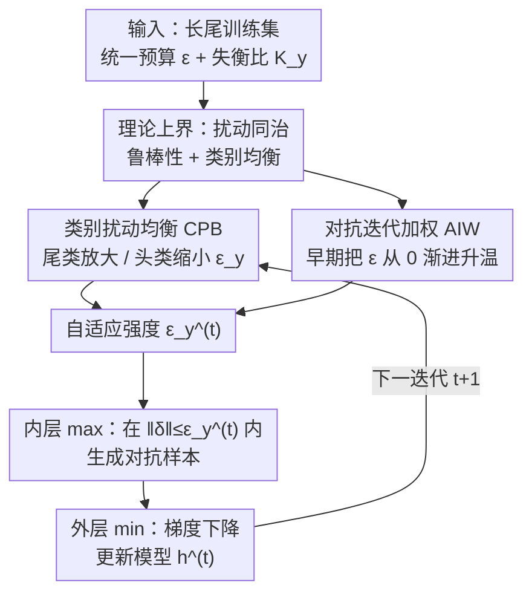

# Taming the Long Tail: Rebalancing Adversarial Training via Adaptive Perturbation

**会议**: CVPR 2026  
**arXiv**: [2605.13395](https://arxiv.org/abs/2605.13395)  
**代码**: https://github.com/zhang-lilin/RobustLT (有)  
**领域**: AI安全 / 对抗鲁棒性  
**关键词**: 对抗训练, 长尾分布, 自适应扰动, 类别均衡, 鲁棒性

## 一句话总结
针对"对抗训练在长尾数据上头部过自信、尾部不鲁棒"的问题，本文从理论上证明**扰动强度本身就能同时修复对抗脆弱性和类别失衡**，进而提出即插即用的 RobustLT——给尾类分配更大、给头类分配更小的扰动预算（CPB），并在训练早期把扰动从 0 渐进升温以稳住对抗分布演化（AIW），可挂在任意对抗训练算法上，尾类鲁棒准确率最高提升 7 个点。

## 研究背景与动机

**领域现状**：对抗训练（adversarial training, AT）是对抗样本最主流的防御手段，把学习写成 min-max 博弈——内层生成最大化损失的对抗样本 $\max_{\|\delta\|\le\epsilon}\ell(h(x+\delta),y)$，外层更新模型最小化该损失。绝大多数研究都在 CIFAR10/100 这类**类别均衡**的数据集上评测。

**现有痛点**：真实数据几乎都是长尾的——少数头类占了大部分样本，大量尾类样本稀缺。模型在长尾数据上会对头类给出过高置信度（overconfidence），损害尾类泛化；而对抗场景下攻击者**不受类别频率约束，可以专挑尾类下手**，于是长尾下的对抗鲁棒性被严重高估。已有为数不多的长尾对抗工作（RoBal、AT-BSL、TAET 等）几乎都靠叠加 Balanced Softmax Loss（BSL）来缓解，但它们都漏掉了一个关键环节。

**核心矛盾**：模型更新与对抗样本生成是**相互依赖**的——过自信的模型会生成有偏的对抗样本，这些有偏样本回头又加剧失衡，形成恶性循环。BSL 系方法只在 loss 端做 logit 重加权，根本没碰对抗样本生成这一侧，因此无法打破这个循环。

**本文目标**：(i) 理论上厘清长尾到底通过哪些因素拖垮对抗训练；(ii) 找到一个能同时治"对抗脆弱"和"类别失衡"两病的统一杠杆。

**切入角度**：作者注意到，对抗样本里的扰动 $\delta$ 本质上**改变了训练分布**（对抗分布 $P_{\text{adv}}^h$）。既然扰动能塑造训练分布，那它能不能被设计成同时提升鲁棒性、又抹平长尾偏置？直觉上：给尾类更大的扰动强度、给头类更小的扰动强度，就能把决策边界从偏向头类的位置推回中间（论文 Figure 1）。

**核心 idea**：用**类别自适应的扰动强度 $\epsilon_y$** 代替全局统一的 $\epsilon$——这一个旋钮就能既驱动模型依赖鲁棒特征、又消除过自信，从扰动生成这一侧打破"过自信→有偏样本→更失衡"的循环。

## 方法详解

### 整体框架
RobustLT 不改对抗损失、不改网络结构，只把传统 AT 中那个**对所有类、所有迭代都恒定的扰动预算 $\epsilon$**，换成一个随类别、随迭代自适应的 $\epsilon_y^{(t)}$。它由两个互补模块算出：CPB 决定"不同类别该用多大扰动"（横向，跨类别），AIW 决定"不同训练阶段该放多少扰动出来"（纵向，跨迭代）。二者相乘得到最终的逐类逐迭代强度 $\epsilon_y^{(t)}$，再喂回原有 AT 的内层最大化，外层最小化照旧。因为对损失 $\ell$ 不作任何假设，RobustLT 是即插即用的，能挂在 AT、AWP、RoBal、REAT、AT-BSL、TAET 等任意基算法上。

整个设计有一条清晰的理论主线：先证出最终鲁棒风险的上界由两项构成（见关键设计 1），第一项暴露"训练目标被类别失衡扭曲"、第三项暴露"对抗分布在迭代间剧烈漂移"——CPB 治第一项，AIW 治第三项。

### 关键设计

**1. 鲁棒风险的两项上界：把"长尾为什么拖垮 AT"量化出来**

这是全文的理论地基，决定了后面两个模块各打哪个靶。作者从在线优化视角推导出最终鲁棒风险的上界（Theorem 3.1）：

$$\mathcal{R}_{\text{rob}}(h^{(T)},P)\le \frac{1}{T}\sum_{t}r_t\,\mathcal{R}_{\text{nat}}(h^{(t)},P_{\text{adv}}^{h^{(t-1)}}) + \frac{1}{T}\sum_{t}R_t\,c_1\big\{\sqrt{\rho^2+1}\,\mathcal{W}_{c_2+q}(P_{\text{adv}}^{h^{(t)}},P_{\text{adv}}^{h^{(t-1)}})\big\}^{\frac{c_2+q}{q}}$$

第一项是每次迭代在对抗分布上的累积自然风险（直接的优化目标），第二项是相邻迭代对抗分布之间的累积漂移，用 Wasserstein 距离 $\mathcal{W}$ 度量。把它套到均衡分布 $\bar P$ 上后（Eq 5），多出一个"目标偏斜项"，它可被改写成各类条件鲁棒风险之差的加权和：$\sum_{i\ge2}(\tfrac{1}{|\mathcal{Y}|}-P(y_i))(\mathcal{R}_{\text{rob}}(h,y_i)-\mathcal{R}_{\text{rob}}(h,y_1))$——这恰好就是"类间鲁棒性不均"即过自信的数学刻画。于是长尾拖垮 AT 的两宗罪被锁定：**(i) 训练目标被失衡扭曲（skewed objective）**，传统方法只最小化第一项却隐式放大了偏斜项；**(ii) 对抗分布在迭代间不稳定演化（unstable evolution）**，对应第三项 Wasserstein 漂移过大。

更关键的是在一个二分类玩具模型上（鲁棒特征中心 $\mu_1$、非鲁棒特征中心 $\mu_2$，失衡比 $K$），作者证明了三件事：① 只要逐类扰动强度 $\epsilon_y\in(\mu_2,\mu_1)$，模型会逐步加重鲁棒特征权重、丢弃非鲁棒特征，鲁棒风险单调下降（Theorem 4.1）；② 偏置项 $b$ 的符号就是过自信的指示器，恰当设置逐类扰动强度可让 $b^{(t)}=0$、条件风险跨类持平（Theorem 4.3）；③ "提鲁棒"与"求均衡"两个可行强度区间**交集非空**（Theorem 4.4），并导出指导原则：尾类应配更大扰动，且头尾扰动差正比于失衡比的对数，$(\epsilon_{-1}-\epsilon_{+1})\propto\sqrt{\log K}$。正是这条 $\sqrt{\log K}$ 规律直接催生了 CPB 的公式。

**2. CPB（类别扰动均衡）：把统一预算按 $\sqrt{\log K_y}$ 在类别间重新分配**

针对"目标被失衡扭曲"这宗罪。定义类别失衡比 $K_{y_i}=P(y_1)/P(y_i)$（$y_1$ 为最频繁类），CPB 给类别 $y_i$ 分配的扰动强度为

$$\epsilon_{y_i}=(1-\alpha)\epsilon+\alpha\frac{\sqrt{\log K_{y_i}}}{\sum_{y'\in\mathcal{Y}}P(y')\sqrt{\log K_{y'}}}\,\epsilon$$

直接落实了 Theorem 4.4 的 $\sqrt{\log K}$ 指导：越尾的类（$K_{y_i}$ 越大）拿到越大的 $\epsilon_{y_i}$，头类则被压到统一值 $\epsilon$ 以下。式中超参 $\alpha\in[0,1]$ 控制"基础项 vs 斜率项"的配比——$\alpha$ 越大，强度分布越倾斜、越偏向尾类；$\alpha=0$ 退化为传统均匀扰动。这里有个巧妙的约束设计：为防止整体扰动量失控，作者借鉴 DRO 思想要求 $\mathcal{W}_\infty(P,P_{\text{adv}}^h)\le\epsilon$，由于该量可被 $\mathbb{E}_{(x,y)\sim P}[\epsilon_y]$ 上界，于是直接令期望扰动 $\mathbb{E}[\epsilon_y]=\epsilon$，这一约束把斜率超参 $\tau$ 解析地表达成 $\alpha$ 的函数（$\tau=\alpha/\mathbb{E}[\sqrt{\log K_y}]$），从而只剩 $\alpha$ 一个旋钮、且保证"给尾类加的预算 = 从头类省下的预算"，总扰动守恒。

**3. AIW（对抗迭代加权）：训练早期把扰动从 0 渐进升温，压住对抗分布漂移**

针对"对抗分布不稳定演化"这宗罪，即上界第三项的 Wasserstein 漂移。作者观察到：训练后期模型接近收敛、$h^{(t)}$ 与 $h^{(t-1)}$ 相近，对抗分布漂移本就小；真正失稳的是**早期**——此时 $h^{(t)}$ 离 $h^{(t-1)}$ 远、相邻对抗分布差异大。用三角不等式与 $\mathcal{W}_{c_2+q}\le\mathcal{W}_\infty$ 把相邻分布距离上界为两迭代扰动强度之和 $\mathbb{E}_{\bar P}[\epsilon_y^{(t)}+\epsilon_y^{(t+1)}]$，于是只要在早期压低 $\epsilon_y^{(t)}$ 就能压住漂移。AIW 给每个迭代乘一个升温权重：

$$\epsilon_y^{(t)}=\min\Big\{\frac{t-1}{\beta T},1\Big\}\cdot\epsilon_y$$

即前 $\beta T$ 个迭代里扰动强度从 0 线性升到 CPB 给出的 $\epsilon_y$，之后保持满额。超参 $\beta$ 控制"升温期占总训练的比例"。这等价于一种针对长尾对抗场景的扰动 warmup，让模型在还没站稳时不被过强对抗样本带偏。

最终 RobustLT 把 CPB（Eq 9）与 AIW（Eq 10）相乘得到 $\epsilon_y^{(t)}$，代入原有 min-max：$\min_h\mathbb{E}_{(x,y)\sim P}\max_{\|\delta\|\le\epsilon_y^{(t)}}\ell(h^{(t-1)}(x+\delta),y)$。

### 损失函数 / 训练策略
不引入任何新损失项，只替换内层最大化的扰动半径约束 $\epsilon\to\epsilon_y^{(t)}$。两个超参 $(\alpha,\beta)$ 按数据集设定（如 CIFAR10-LT 用 $(0.3,0.8)$、CIFAR100-LT 用 $(0.5,0.6)$）。攻击设置：$l_\infty$ PGD，$\epsilon=8/255$、20 步、步长 $2/255$；主干 WRN-28-10。

## 实验关键数据

数据集为 CIFAR10-LT（失衡比 50）、CIFAR100-LT、TinyImageNet-LT（失衡比 10）。指标分"全类（all）"与"尾部 80% 类（tail）"两档，分别报告自然准确率 Nat. 与 PGD 鲁棒准确率 Rob.。

### 主实验
RobustLT 挂到 6 个基算法上，几乎都能同时抬高自然与鲁棒准确率，且尾类增益最显著（节选 WRN-28-10 / CIFAR10-LT）：

| 基算法 | 配置 | Nat.(all) | Nat.(tail) | Rob.(all) | Rob.(tail) |
|--------|------|-----------|------------|-----------|------------|
| AT | origin | 58.25 | 48.56 | 27.28 | 13.71 |
| AT | +RobustLT | 61.59 | 52.67 | **28.97** | **16.36** |
| AWP | origin | 59.66 | 50.17 | 28.50 | 14.90 |
| AWP | +RobustLT | **65.22** | **57.05** | 29.11 | **16.46** |
| RoBal | origin | 72.73 | 67.15 | 32.29 | 22.19 |
| RoBal | +RobustLT | **74.63** | **70.32** | **36.08** | **29.19** |
| AT-BSL | origin | 77.09 | 72.48 | 37.98 | 28.60 |
| AT-BSL | +RobustLT | 77.61 | 73.83 | **42.11** | **35.98** |

其中 AT-BSL 尾类鲁棒从 28.60→35.98（+7.4）、RoBal 尾类鲁棒 22.19→29.19（+7.0），增幅最大的都落在最该补强的尾部。相比 UDR、CFA、DAFA 等同类增强方法，RobustLT 在长尾鲁棒上整体领先。

### 不同攻击下的鲁棒性
换更强的 CW、AutoAttack（AA）攻击重测，结论一致（WRN-28-10）：

| 基算法 | 配置 | CW(all) | CW(tail) | AA(all) | AA(tail) |
|--------|------|---------|----------|---------|----------|
| AT-BSL | origin | 37.13 | 27.58 | 34.57 | 24.84 |
| AT-BSL | +RobustLT | **40.10** | **33.50** | **37.49** | **30.70** |
| RoBal | origin | 31.29 | 20.79 | 28.92 | 18.58 |
| RoBal | +RobustLT | **33.90** | **26.30** | **31.03** | **23.53** |

AutoAttack 是公认最难"刷分"的评测，尾类 AA 仍能 +5～6 点，说明增益不是 PGD 过拟合带来的虚高。

### 消融实验
本文没有传统的"砍模块"消融表，而是通过 $(\alpha,\beta)$ 敏感性分析与可视化来验证两模块——$\alpha=0$ 即关闭 CPB（均匀扰动），$\beta$ 控制 AIW 升温期：

| 设置 | 作用对象 | 现象 |
|------|---------|------|
| $\alpha=0$ | 关闭 CPB | 退化为均匀扰动，尾类无额外预算，过自信不被纠正 |
| $\alpha\uparrow$（0→0.6） | 增强 CPB | 强度分布更偏向尾类，尾类鲁棒上升但需与自然准确率折中 |
| 含 AIW | 稳定对抗分布 | t-SNE 中相邻 epoch 对抗分布对齐更好（红点与蓝点大量重叠） |
| 含 CPB | 重均衡对抗分布 | 尾类对抗样本更分散、更多样（Figure 4） |

此外 Table 4 验证了不同失衡比下的稳健性：失衡比 100 的极端长尾下，AT 尾类鲁棒 10.87→13.73、CIFAR10-LT 自然准确率 51.01→53.12，越极端的长尾增益相对越可观。

### 关键发现
- **增益高度集中在尾类**：全类指标常只小幅变动，尾类鲁棒却能 +7 点，正中长尾对抗的痛点。
- **$\alpha$ 是均衡—鲁棒折中的总旋钮**：$\alpha$ 越大越偏向尾类，但自然准确率会让步，需按数据集失衡程度调。
- **两模块各司其职可视化可见**：CPB 让尾类对抗样本更分散（缓解有偏生成），AIW 让相邻 epoch 对抗分布更对齐（稳住演化），与理论两项一一对应。

## 亮点与洞察
- **把"扰动强度"从超参升格为可设计的均衡杠杆**：以往 $\epsilon$ 只是个固定攻击半径，本文证明它能同时调控鲁棒性和类别偏置，这个视角转换是最"啊哈"的地方——不动 loss、不动结构，只动扰动预算的分配。
- **理论直接生出公式**：$\sqrt{\log K}$ 不是拍脑袋的启发式，而是从 Theorem 4.4 的可行区间解析推出的，CPB 公式里那个 $\sqrt{\log K_y}$ 与 DRO 守恒约束都有出处，可解释性强。
- **即插即用、零额外参数训练成本**：CPB/AIW 只改内层扰动半径，不加可学习参数、不加 loss 项，能直接套到任意 AT 算法上，迁移成本极低——这套"按类别/迭代调扰动预算"的思路也可迁移到带噪标签、难例挖掘等同样存在"样本难度不均"的训练场景。
- **从生成侧而非 loss 侧破循环**：BSL 系只在 logit 端补偿，RobustLT 直击"过自信模型生成有偏对抗样本"这一根因，是对已有长尾对抗工作的正交补充（实测叠在 AT-BSL 上仍有大幅尾类增益）。

## 局限与展望
- **缺少标准的逐模块定量消融**：CPB 与 AIW 的单独贡献主要靠 t-SNE 可视化与敏感性曲线说明，没有一张"+CPB / +AIW / +both"的准确率分解表，读者较难量化各自占多少点。
- **超参 $(\alpha,\beta)$ 需逐数据集调**：不同数据集/失衡比下最优 $(\alpha,\beta)$ 差异明显（如 TinyImageNet-LT 用 $\beta=0.2$、CIFAR10-LT 用 $0.8$），缺乏自动选取策略，部署时仍要调参。
- **理论建立在二分类线性玩具模型上**：Theorem 4.1/4.3/4.4 依赖鲁棒/非鲁棒特征高斯假设与线性分类器，到深度网络、多分类是否严格成立靠实验间接支撑。
- **实验规模偏中小**：主干限于 WRN-28-10/ResNet-18、数据集为 CIFAR-LT 与 TinyImageNet 前 20 类，尚未验证 ImageNet 级长尾。

## 相关工作与启发
- **vs AT-BSL / RoBal（BSL 系长尾对抗）**: 它们在 loss 端用类频率重加权 logit 来缓解过自信，只动模型更新这一侧；RobustLT 改的是对抗样本生成侧的扰动预算，二者正交——实测把 RobustLT 叠在 AT-BSL 上尾类鲁棒还能 +7 点，说明各补了不同的洞。
- **vs TAET（两阶段长尾对抗）**: TAET 用"先稳定后分层均衡"的两阶段训练对付鲁棒过拟合；RobustLT 不分阶段，用 AIW 的连续升温权重在单一流程里稳住对抗分布演化，更轻量。
- **vs CFA / DAFA（类别公平性增强）**: 这类方法关注均衡数据集内"类间固有学习难度差异"，本文针对的是长尾"频率失衡"导致的过自信，且在长尾基准上整体超过它们。
- **vs DRO（分布鲁棒优化）**: 借用了 DRO 的 Wasserstein 约束来给逐类扰动量"上闸"（$\mathcal{W}_\infty(P,P_{\text{adv}})\le\epsilon$），但目的不是最坏分布鲁棒，而是借此把扰动总量守恒、让 CPB 只剩一个超参。

## 评分
- 新颖性: ⭐⭐⭐⭐⭐ 把"扰动强度可同治鲁棒与失衡"理论化，并从可行区间解析推出 $\sqrt{\log K}$ 分配律，视角新且有数学支撑
- 实验充分度: ⭐⭐⭐⭐ 跨 6 基算法 × 3 数据集 × 多攻击（PGD/CW/AA）× 多失衡比，但缺逐模块定量消融、规模止于 TinyImageNet
- 写作质量: ⭐⭐⭐⭐ 理论→方法的推导链条清晰，公式与动机咬合紧；理论假设较重、玩具模型到深网的跨度靠实验补
- 价值: ⭐⭐⭐⭐⭐ 即插即用、零额外训练参数、对长尾对抗这一现实痛点有明确尾类增益，落地友好

<!-- RELATED:START -->

## 相关论文

- [\[CVPR 2026\] FedCART: Tackling Long-Tailed Distributions in Federated Adversarial Training via Classifier Refinement](fedcart_tackling_long-tailed_distributions_in_federated_adversarial_training_via.md)
- [\[CVPR 2026\] Improving Adversarial Transferability with Local Perturbation Augmentation](improving_adversarial_transferability_with_local_perturbation_augmentation.md)
- [\[CVPR 2026\] SafeLogo: Turning Your Logos into Jailbreak Shields via Micro-Regional Adversarial Training](safelogo_turning_your_logos_into_jailbreak_shields_via_micro-regional_adversaria.md)
- [\[CVPR 2026\] Towards Robust Vision Transformers: Path Dependency Analysis and a Simple Two-Stage Adversarial Training](towards_robust_vision_transformers_path_dependency_analysis_and_a_simple_two-sta.md)
- [\[CVPR 2026\] Robustness Under Data Scarcity: Few-Shot Continual Adversarial Training for Evolving Threats](robustness_under_data_scarcity_few-shot_continual_adversarial_training_for_evolv.md)

<!-- RELATED:END -->
