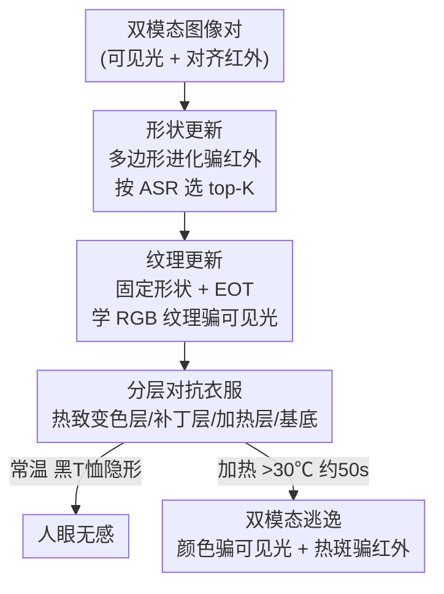

# Thermally Activated Dual-Modal Adversarial Clothing against AI Surveillance Systems

**会议**: CVPR2026  
**arXiv**: [2511.09829](https://arxiv.org/abs/2511.09829)  
**代码**: 无（仅补充材料含视频 demo）  
**领域**: AI安全  
**关键词**: 对抗补丁, 物理对抗攻击, 可见光-红外双模态, 热致变色, 隐私保护

## 一句话总结
本文做了一件"平时是普通黑 T 恤、加热 50 秒后浮现对抗花纹"的衣服——用热致变色染料 + 柔性加热片把一块算法优化出来的多边形对抗补丁藏在布料里，加热时颜色变化骗可见光检测器、热分布变化骗红外检测器，在真实监控场景里对行人检测的攻击成功率（ASR）稳定保持在 80% 以上。

## 研究背景与动机
**领域现状**：对抗补丁（adversarial patch）是当前对抗 AI 监控最主流的"主动隐私防护"手段——把一块精心优化的视觉花纹贴在衣服上，让行人检测器把穿戴者漏检或误判。近年还从单模态（只骗可见光或只骗红外）扩展到可见光-红外双模态联合攻击（如 CDUPatch 把 RGB 颜色映射到对应热响应、Wei et al. 用边界受限形状优化同时骗双模态）。

**现有痛点**：现有补丁几乎都是**高饱和、高对比的花哨纹理**——为了最大化特征扰动，图案必然扎眼。骗 AI 是有效，但人眼一看就觉得怪，没法在日常社交场合穿出门。更要命的是这些补丁是 **"always-on"（常态显形）**：不进监控区也一直挂着花纹，既显眼又暴露意图。

**核心矛盾**：攻击有效性（要强扰动 → 必然扎眼）和现实可用性（要不显眼 → 扰动就弱）之间存在 trade-off。"既要在 AI 面前是强攻击、又要在人眼前是普通衣服"这两个目标，用静态花纹无法同时满足。

**本文目标**：拆成两个子问题——(1) 让补丁**可按需开关**，平时隐形、需要时再显形；(2) 用**同一块物理补丁**同时骗可见光和红外两个模态。

**切入角度**：作者把"温度"引入作为控制信号。观察到热致变色染料能在约 30 ℃ 发生"黑→透明"的可逆相变，而柔性加热片本身在红外成像下又会产生可控的热花纹——一次加热同时改变了**颜色**（可见光线索）和**热分布**（红外线索）。

**核心 idea**：用一件分层衣服把对抗补丁"藏"在热致变色层下面，加热同时激活 RGB 对抗纹理（骗可见光）和红外热纹理（骗红外），实现可控、按需、双模态的逃逸。

## 方法详解

### 整体框架
系统由两条线组成：一条是**物理硬件**——四层结构的衣服，决定"补丁怎么藏、怎么被激活";另一条是**算法**——两阶段补丁优化，决定"补丁长什么形状、什么颜色才能同时骗两个模态"。

物理上，衣服自顶向下分四层：(i) 热致变色层（常温黑、>30 ℃ 变透明）；(ii) 对抗补丁层（承载算法优化出的 RGB 纹理）；(iii) 柔性硅胶加热层（精确控温、同时充当红外花纹的来源）；(iv) 布料基底（给穿戴者隔热）。常温下热致变色层把下面的补丁完全盖住，整件衣服就是普通黑 T 恤；加热层把温度抬到 30 ℃ 以上，热致变色层变透明、露出补丁，同时加热片本身在红外里形成多边形热斑。

算法上，补丁优化分两阶段串行：先**形状更新**（针对红外检测器，优化多边形几何形状），再**纹理更新**（固定形状，在 EOT 变换下学 RGB 颜色纹理骗可见光检测器）。最终优化出的补丁，其形状直接决定加热片的剪裁形状（红外攻击），其纹理印在补丁层上（可见光攻击）。

### 关键设计

**1. 四层热激活衣服结构：让对抗补丁"按需显形"**

针对"补丁 always-on 太扎眼"这个痛点，作者把补丁做成可开关的。核心是**热致变色层**：它是一层喷涂在布料上的微胶囊染料涂层，每个微胶囊里装有显色剂（电子供体）、隐色染料（电子受体）、溶剂和树脂壳。当温度低于溶剂熔点时，溶剂为固态，显色剂和隐色染料之间形成 π-共轭体系，呈现黑色；温度超过熔点时溶剂熔化、π-共轭体系被打断，微胶囊变近乎透明，下面的对抗补丁就露了出来。本文选用相变温度约 30 ℃ 的微胶囊，且**相变温度可通过调溶剂配方调节**（5 mL 染料按 1:3 用环己酮稀释、超声后喷涂）。这一层是整套方案"平时是普通衣服"的物理基础——不靠软件、靠材料相变实现隐藏。

**2. 双模态共享的加热层：一次加热同时制造红外热斑 + 触发颜色显形**

这是把"双模态"落到物理上的关键。加热层是柔性硅胶加热片，内部用镍合金丝绕玻璃纤维、功率密度可达 0.4 W/cm²，厚度仅约 1 mm，用便携充电宝供电、数字温控器调温（20–70 ℃ 可控）。它身兼两职：一方面加热到 30 ℃ 触发上面的热致变色层变透明（间接服务可见光攻击）；另一方面，**加热片本身被剪裁成算法优化出的多边形形状**，加热后在红外成像里直接形成对应的多边形热花纹（直接服务红外攻击）。也就是说，红外侧的"对抗纹理"不是印上去的颜色，而是加热片的形状决定的温度分布——温度既是开关信号，又是红外攻击的载体。

**3. 两阶段补丁优化（形状骗红外 + 纹理骗可见光）**

针对"同一块补丁要骗两个物理原理完全不同的模态"，作者把优化拆成两个互不干扰的阶段。

*形状更新阶段*：红外检测靠热分布，颜色无意义，所以这一阶段只优化几何形状。从一个初始多边形出发，迭代调整顶点数、极坐标的半径和角度来进化形状；每个候选形状贴到红外图里所有行人身上生成对抗样本，喂给红外检测器，若被贴补丁的人检测置信度 < 0.5 即算攻击成功，在数据集上算出 person-level 的攻击成功率 ASR，选 ASR 最高的形状进入下一阶段。因为搜索空间高度非凸、常出现多个竞争性候选，作者保留 **top-K** 个多样化形状以保持多样性。这个不规则多边形相比传统方形补丁，对双模态检测器都更有破坏力。

*纹理更新阶段*：固定上一步选定的形状，学一套 RGB 颜色纹理骗可见光检测器。为应对真实世界的拍摄变化，引入 **EOT（Expectation over Transformation）** 在优化中模拟旋转、亮度变化、模糊、缩放等物理变换，提升补丁在多样物理条件下的鲁棒性。变换后的补丁直接贴到 RGB 图上形成可见光对抗样本，喂给可见光检测器，用对抗损失反向更新纹理。

### 损失函数 / 训练策略
攻击目标是优化单块补丁 $p$，使其同时贴到可见光图 $I^v_j$ 和对齐红外图 $I^r_j$ 上时都能骗过双模态检测器 $T$：

$$p = \arg\min_{\kappa}\, \mathcal{L}_{adv}\big(T(I^v_j, I^r_j \mid \theta),\, D_j,\, \kappa\big)$$

其中 $\kappa$ 是补丁的像素值，$D_j$ 是第 $j$ 对图像的检测输出（或 ground truth）。纹理更新阶段采用对抗补丁领域常用的组合损失：**总变差损失 $\mathcal{L}_{tv}$**（约束纹理平滑、可打印）+ **平均精度损失 $\mathcal{L}_{ap}$**（压低检测器对行人的置信度）。形状更新阶段则不走梯度，而是用 ASR 作为评价指标做进化式搜索 + top-K 保留。

评价指标 ASR 定义为干净图与对抗图上被检测目标数之差占干净图目标数的比例：

$$\text{ASR} = \frac{N_{clean} - N_{patch}}{N_{clean}}$$

其中 $N_{clean}$、$N_{patch}$ 分别为干净图、对抗图上被检出的目标数，检测置信度阈值取 0.5。

## 实验关键数据

### 主实验
数字攻击在 4 个行人检测数据集上评测：INRIA、PennFudan（可见光）与 FLIR、LLVIP（红外），受害检测器覆盖单阶段（YOLOv3/v5）、两阶段（Faster R-CNN）、Transformer（DETR）三大范式，所有检测器微调后在各自验证集 mAP > 90%。补丁面积控制在不超过人体的 30%，多边形补丁与方形/矩形补丁面积对齐以保证公平。物理实验把数字域 ASR 最高的 top-10 补丁做成 XL 号 T 恤（衣长 75 cm，补丁 ≤ 50×50 cm，居中），用 DJI Matrice 4T 在电梯/街道/房间/商场拍摄 1920×1080 视频。

可见光侧（INRIA 数据集 ASR，本文 RGB 补丁 vs AdvYOLO）：

| 检测器 | 本文 RGB 补丁 | AdvYOLO | 提升 |
|--------|--------------|---------|------|
| YOLOv3 | 54.4% | 34.6% | +19.8 |
| YOLOv5 | 49.9% | 31.4% | +18.5 |
| Faster R-CNN | 46.8% | 29.7% | +17.1 |
| DETR | 38.4% | 25.2% | +13.2 |

红外侧（LLVIP 数据集 ASR，本文红外补丁 vs AdvIB）：

| 检测器 | 本文红外补丁 | AdvIB | 提升 |
|--------|------------|-------|------|
| YOLOv3 | 85.4% | 72.7% | +12.7 |
| YOLOv5 | 88.6% | 75.1% | +13.5 |
| Faster R-CNN | 83.3% | 70.3% | +13.0 |
| DETR | 80.2% | 65.8% | +14.4 |

本文双模态补丁在 4 个检测器上 ASR 一致高于所有对比的可见光方法（T-SEA、AdvYOLO、CAP、FDA、AdvTexture、AdvCloak）和红外方法（AdvIC、AdvIB、AIP、HIC-IR、Bulb）。物理实验中，室内房间/电梯、密集人流的商场、室外街道三类场景下，穿戴者均被双模态检测器漏检，而周围普通人被正确检出且置信度高（激活前后行人置信度从 0.84/0.85 跌到 < 0.4）。

### 消融实验
| 分析维度 | 关键结果 | 说明 |
|----------|---------|------|
| 激活时间 | ~30 s 开始显形，**50 s 完全激活** | 加热下补丁从双模态隐形到完全显形的响应速度 |
| 激活温度 | 28–32 ℃ 染料密度从 100%→0%，32 ℃ 全透明 | 颜色密度随温度的相变曲线；>200 ℃ 微胶囊失稳（TGA） |
| 热滞后 | 加热/冷却转变温度差约 **3 ℃** | 热致变色层存在滞回环，源于染料亚稳相对热历史敏感 |
| 距离边界 | ≤ 30 m 双模态均逃逸；> 30 m 仅红外仍有效 | 远距离下 RGB 补丁变小变糊、失去对可见特征的扰动 |
| 视角边界 | 视角 **35° 内**保持有效 | 对旋转有一定鲁棒性 |

### 关键发现
- **形状是红外攻击的核心，纹理是可见光攻击的核心**——两者解耦优化，因为红外检测对颜色不敏感、可见光检测对热分布不敏感，分两阶段反而互不干扰、各打各的。
- **多边形 > 方形**：算法优化的不规则多边形几何对两个模态都比传统方形补丁更具破坏力，这是本文形状阶段的直接收益。
- **距离是主要失效边界**：30 m 是分水岭，超过后可见光补丁因变小变糊先失效，而红外热斑因依赖宏观温度分布更耐远距离——侧面说明双模态设计提供了冗余。

## 亮点与洞察
- **用"温度"一个信号同时解决两件事**：既当隐藏/显形的开关（热致变色），又当红外攻击的物理载体（加热片形状形成热斑）。一物两用，把双模态攻击的红外侧从"印颜色"变成"控温度"，非常巧妙。
- **把对抗鲁棒性问题搬到材料层面解决**："always-on 太扎眼"这个老问题，过去都在花纹设计上想办法（怎么让花纹不那么花），本文直接用热致变色材料让花纹平时根本不存在——绕开了 trade-off 而非折中。
- **软硬协同设计可迁移**：算法优化出的形状直接驱动硬件（加热片剪裁），形状阶段的搜索目标（红外 ASR）和物理制造无缝对接。这种"优化产物即制造图纸"的思路可迁移到其他物理对抗攻击（如可变形材料、电致变色）。
- 形状用进化搜索 + top-K、纹理用梯度 + EOT 的混合优化，针对两类不可微/可微目标分别选合适工具，是实用的工程取舍。

## 局限与展望
- **依赖外部供电与温控硬件**：需要便携充电宝、数字温控器和加热片，体积/续航/安全（>200 ℃ 微胶囊失效、加热安全）都是落地约束，论文未深入量化能耗与穿戴舒适度。
- **激活有延迟**：50 s 才能完全显形，进入监控区前需提前手动加热，应对突发监控的实时性不足；热滞后 3 ℃ 也意味着开关不是瞬时干净切换。
- **距离/视角窗口有限**：> 30 m 可见光侧失效、视角超 35° 退化，在大范围或多角度监控阵列下保护不完整。
- **检测器范围有限**：只评测了 YOLO/Faster R-CNN/DETR 等通用行人检测器，未测专门的红外-可见光融合检测器、多帧时序检测或重识别（ReID）系统——后者可能对单帧补丁更鲁棒。
- **改进思路**：可探索电致变色等更快/无需加热的可控显形机制，或把时序鲁棒性纳入优化目标以对抗视频级检测。

## 相关工作与启发
- **vs CDUPatch（Long et al.）**：CDUPatch 通过把 RGB 颜色映射到对应热响应实现可见光-红外统一攻击，但它仍是 always-on 静态补丁；本文用热致变色把补丁做成可开关，且红外侧改由加热片形状直接产热斑，而非靠颜色-热响应映射。
- **vs Wei et al. 统一双模态补丁**：他们用边界受限形状优化让单块补丁同时骗双模态，思路与本文形状阶段相近，但本文额外引入物理可控的激活机制和软硬协同制造，把数字补丁真正落成可穿戴衣服。
- **vs AdvYOLO（Thys et al.）/ Zhu et al. 红外贴纸**：前者是经典可见光单模态补丁、后者是红外单模态（3D mesh-shadow 优化），本文在两个模态上都超过它们，且强调"日常隐形"这一现实可用性维度——这是以往单模态、always-on 方法都不具备的。

## 评分
- 新颖性: ⭐⭐⭐⭐⭐ 把热致变色材料引入对抗补丁、用温度一个信号同时控制隐藏开关与红外攻击载体，软硬协同思路新颖。
- 实验充分度: ⭐⭐⭐⭐ 4 数据集 × 4 检测器数字评测 + 多场景物理实验 + 时间/温度/距离/视角消融较完整，但缺时序检测器与能耗量化。
- 写作质量: ⭐⭐⭐⭐ 结构清晰、材料原理讲得明白；部分图表依赖补充材料视频，主文数值表偏少。
- 价值: ⭐⭐⭐⭐ 在隐私保护与物理对抗攻击交叉点提供了可落地的新范式，但硬件依赖限制了即时实用性。

<!-- RELATED:START -->

## 相关论文

- [\[CVPR 2026\] Physical Adversarial Clothing Evades Visible-Thermal Detectors via Non-Overlapping RGB-T Pattern](physical_adversarial_clothing_evades_visible-thermal_detectors_via_non-overlappi.md)
- [\[AAAI 2026\] Reference Recommendation based Membership Inference Attack against Hybrid-based Recommender Systems](../../AAAI2026/ai_safety/reference_recommendation_based_membership_inference_attack_against_hybrid-based_.md)
- [\[CVPR 2026\] Cross-modal Representation Learning for Diffusion-generated Image Detection](cross-modal_representation_learning_for_diffusion-generated_image_detection.md)
- [\[CVPR 2026\] SAIDO: 基于场景感知与重要性引导动态优化的可泛化 AI 生成图像检测](saido_generalizable_detection_of_ai-generated_images_via_scene-aware_and_importa.md)
- [\[CVPR 2026\] AntiStyler: Defending Object Detection Models Against Adversarial Patch Attacks Using Style Removal](antistyler_defending_object_detection_models_against_adversarial_patch_attacks_u.md)

<!-- RELATED:END -->
