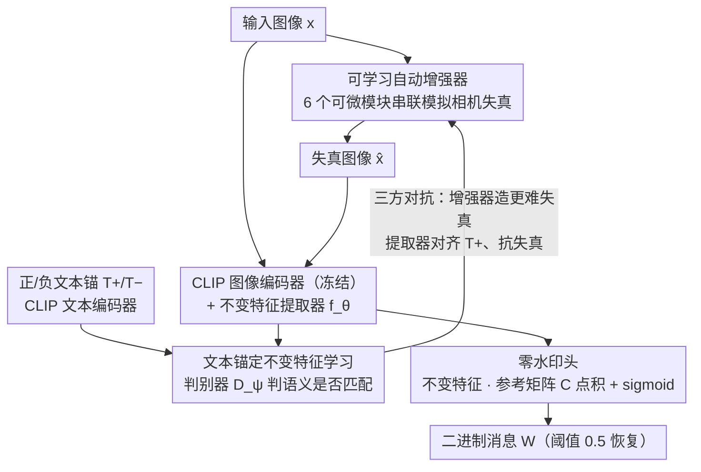

# TIACam: Text-Anchored Invariant Feature Learning with Auto-Augmentation for Camera-Robust Zero-Watermarking

**会议**: CVPR2026  
**arXiv**: [2602.18863](https://arxiv.org/abs/2602.18863)  
**代码**: 待确认  
**领域**: 目标检测（实际为多媒体安全/水印）  
**关键词**: 零水印, 跨模态对齐, 可学习数据增强, 相机鲁棒性, CLIP, 对抗训练, 不变特征学习

## 一句话总结

提出 TIACam 框架，通过可学习自动增强器模拟相机失真、文本锚定跨模态对抗训练学习不变特征、零水印头在特征空间绑定消息，实现无需修改图像像素的相机鲁棒零水印方案，在屏幕翻拍/打印翻拍/截图三种真实场景下均达到 SOTA 提取精度。

## 背景与动机

1. **零水印范式**：传统水印在空间域或变换域修改图像，零水印则不修改像素，而将水印与图像固有特征关联，兼顾不可见性与验证可靠性
2. **相机翻拍挑战**：相机重新拍摄引入透视畸变、光照变化、传感器噪声、摩尔纹等复合且空间耦合的退化，是水印提取最困难的场景之一
3. **手工噪声层局限**：StegaStamp、PIMoG 等方法手动设计相机噪声层，但真实光学失真因环境而异、非线性耦合，固定增强难以覆盖
4. **预训练特征非最优**：DINO 等自监督模型的特征鲁棒性是副产品，并非针对水印任务显式优化
5. **单一不变性不足**：仅靠文本引导或仅靠失真对抗的不变性学习，无法同时保证语义一致性和失真鲁棒性
6. **缺乏统一框架**：现有方法将增强、特征学习和水印绑定分离处理，缺少端到端联合优化机制

## 方法详解

### 整体框架

TIACam 要解决的是相机翻拍场景下的零水印：水印不改像素，而是和图像固有特征绑定，但相机重新拍摄会引入透视畸变、光照变化、传感器噪声、摩尔纹等复合退化，固定的手工噪声层根本覆盖不全。它的破解办法是把"模拟失真—学不变特征—绑消息"三件事拼进一个三方对抗循环里联合训练：自动增强器（Auto-Augmentor）不断生成更刁钻的相机失真，文本锚定的不变特征学习器（Text-Anchored Invariant Feature Learner）在 CLIP 跨模态空间里学习抵抗这些失真、又保持语义一致的特征，零水印头（Zero-Watermarking Head）则在这个不变特征空间里把二进制消息绑定上去。三个模块互相施压，最终逼出一套既鲁棒又可验证的特征表示。

### 关键设计

**1. 可学习自动增强器：用可微管线把"相机失真"训练成对手**

手工设计的相机噪声层是固定的，而真实光学失真因环境而异、还非线性耦合，固定增强难以覆盖。Auto-Augmentor 把相机退化拆成 6 个可微分模块串联，每个模块的失真参数都可学习，于是整条增强管线本身就能被梯度优化、朝"最难被抵抗"的方向进化：

| 模块 | 功能 | 关键参数 |
|------|------|----------|
| 几何模块 | 透视/旋转/缩放变换 | 可学习 3×3 透视矩阵 A |
| 光度模块 | 亮度/对比度/伽马 | 可学习 α, γ, β |
| 加性噪声模块 | 传感器噪声 | 重参数化 σ·z, z~N(0,1) |
| 滤波模块 | 光学模糊/镜头涂抹 | 可学习卷积核 K |
| 压缩模块 | JPEG 量化 & 频域掩码 | 平滑量化 + 可训练掩码 M |
| 摩尔纹模块 | 传感器-显示器干涉条纹 | 可学习频率 (fx,fy) 和振幅 α |

六个模块按 $\hat{x} = \mathcal{T}_{\text{aug}}(x;\Theta) = \mathcal{T}_{\text{comp}} \circ \mathcal{T}_{\text{filter}} \circ \mathcal{T}_{\text{add}} \circ \mathcal{T}_{\text{photo}} \circ \mathcal{T}_{\text{geo}} \circ \mathcal{T}_{\text{moire}}(x)$ 组合。每个模块先在对应失真类型上用 MSE+SSIM 在 10k 样本上预训练，再在整体对抗训练中微调，既保证单一失真逼真、又让组合失真可控。

**2. 文本锚定不变特征学习：靠语义锚同时守住鲁棒性和区分性**

只靠失真对抗学到的不变特征容易把所有图像都拉成同质（语义崩塌），只靠文本引导又扛不住失真，所以 TIACam 同时拉两根绳。特征侧用冻结的 CLIP 图像编码器加一个可训练的不变特征提取器 $f_\theta$（3 个残差块 + 投影头 → 1024 维）；判别器 $D_\psi$ 是 4 层 Transformer（8 头注意力、隐藏维 512），吃图像-文本特征对、判断语义是否匹配。训练时图像 $x$ 及其增强版 $\hat{x}$ 与正负文本锚 $T^+/T^-$ 组成真假对，判别器优化 $\mathcal{L}_{\text{disc}}$、生成器优化 $\mathcal{L}_{\text{adv}}$；增强器最大化 $\mathcal{L}_{\text{inv}} - \lambda_{\text{sem}}\mathcal{L}_{\text{sem}}$（其中语义保真度 $\mathcal{L}_{\text{sem}}$ 用冻结 ViT 的余弦相似度度量），提取器最小化 $\mathcal{L}_{\text{inv}}$。三方交替更新：① 更新 $D_\psi$ 提升配对判别 → ② 更新 $\Theta$ 生成更强失真 → ③ 更新 $f_\theta$ 对齐正文本锚并抵抗失真，正文本锚保住语义、失真对抗逼出鲁棒，两者缺一不可。

**3. 零水印头：在不变特征空间用点积绑定消息**

特征足够鲁棒后，绑消息就很轻量。零水印头先取不变特征 $\tilde{F} = \Psi(f_\theta(x))$（$\Psi$ 是全局平均池化 + 线性投影），再维护一个可学习参考矩阵 $C \in \mathbb{R}^{k \times d}$，其第 $i$ 行是第 $i$ 个比特的方向码，预测就是一次点积加 sigmoid：$\hat{W}_i = \sigma(\tilde{F} \cdot C_i)$。注册阶段对每个图像-消息对优化 $C$ 和 $\Psi$（BCE + L2 正则）、而 $f_\theta$ 冻结；提取阶段对失真图像 $x'$ 算 $\tilde{F}' = \Psi(f_\theta(x'))$，用阈值 0.5 即可恢复二进制消息。整个过程不改像素、也不需要先定位水印区域，直接在整幅图上提取。

## 实验关键数据

### 特征不变性（余弦相似度，原始 vs 失真图像）

| 失真类型 | SimCLR | BYOL | Barlow | VICReg | VIbCReg | **TIACam** |
|----------|--------|------|--------|--------|---------|------------|
| 加性噪声 | 0.82 | 0.88 | 0.79 | 0.83 | 0.89 | **0.97** |
| 光度变化 | 0.84 | 0.84 | 0.81 | 0.76 | 0.88 | **0.93** |
| 透视变换 | 0.87 | 0.85 | 0.87 | 0.83 | 0.88 | **0.95** |
| JPEG 压缩 | 0.79 | 0.80 | 0.87 | 0.81 | 0.73 | **0.98** |
| 摩尔纹 | 0.85 | 0.83 | 0.84 | 0.89 | 0.87 | **0.97** |
| 滤波模糊 | 0.88 | 0.88 | 0.89 | 0.87 | 0.88 | **0.98** |
| 全部组合 | 0.74 | 0.71 | 0.74 | 0.77 | 0.77 | **0.94** |

### 真实场景水印提取精度（Bit Accuracy %）

| 方法 | 屏幕翻拍 30b | 屏幕翻拍 100b | 打印翻拍 30b | 打印翻拍 100b | 截图 30b | 截图 100b |
|------|:-----------:|:------------:|:-----------:|:------------:|:-------:|:--------:|
| HiDDeN | 70.6 | 68.8 | 67.1 | 65.7 | 74.5 | 70.6 |
| PIMoG | 82.3 | 80.1 | 75.7 | 72.3 | 79.7 | 78.6 |
| StegaStamp | 93.8 | 91.2 | 92.2 | 91.3 | 93.7 | 93.9 |
| **TIACam** | **99.1** | **98.2** | **96.6** | **95.1** | **97.4** | **95.2** |

### 消融实验：不变特征提取器的贡献

| 数据集 | CLIP Only | CLIP + TIACam |
|--------|:---------:|:-------------:|
| Visual Genome | 0.78 | **0.92** |
| Flickr | 0.84 | **0.93** |
| MSCOCO | 0.76 | **0.89** |
| ImageNet | 0.82 | **0.93** |

特征提取器使余弦相似度提升约 13–15%，证明鲁棒性来自框架而非 CLIP 预训练本身。

### 特征区分度测试

200 对相同 caption 生成的不同图像：仅注册图像可 100% 恢复水印，另一图像和文本特征提取精度降至 ~84%，平均余弦相似度 0.73，说明框架在保持不变性的同时维持了视觉个体区分性。

## 亮点

- **三方对抗统一框架**：增强器、特征提取器、判别器联合优化，首次将失真模拟和跨模态对齐统一为一个训练循环
- **全可微增强管线**：6 个可微分模块覆盖几何/光度/噪声/滤波/压缩/摩尔纹，梯度可回传优化增强策略
- **无需像素修改**：零水印范式完全不改变图像，通过特征空间点积 + 阈值即可提取消息
- **真实场景验证充分**：在屏幕翻拍、打印翻拍、截图三种真实物理退化下均大幅领先 SOTA
- **无需定位步骤**：利用不变特征空间的强鲁棒性，直接在整幅图像上提取水印，无需先检测水印区域

## 局限与展望

- 领域标注为 object_detection 但实际为多媒体安全/水印领域，分类待修正
- 图像统一缩放到 128×128，对高分辨率图像的局部特征保持能力未充分讨论
- 零水印注册需按每个图像-消息对单独优化 C 和 Ψ，批量注册效率可能是实际部署瓶颈
- 仅在 RTX 4090 上实验，推理延迟和部署到移动端/嵌入式的可行性未讨论
- 语义相似但视觉不同的图像仍有 84% 准确率（理想应更低），特征空间的跨实例泄露值得关注
- 文本锚（caption）的获取在实际使用中需要额外模块或人工提供

## 与相关工作的对比

| 方法 | 类型 | 增强策略 | 特征来源 | 相机鲁棒性 |
|------|------|----------|----------|:----------:|
| HiDDeN | 嵌入式 | 固定噪声层 | 自训练 CNN | 低 |
| StegaStamp | 嵌入式 | 手工相机噪声层 | 自训练 CNN | 中高 |
| PIMoG | 嵌入式 | 手工投影噪声 | 自训练 CNN | 中 |
| InvZW | 零水印 | 失真对抗 | 对抗训练 | 中 |
| DINO-based | 零水印 | 无 | 预训练 SSL | 中 |
| **TIACam** | **零水印** | **可学习自动增强** | **CLIP+对抗训练** | **高** |

核心区别：TIACam 是首个将可学习增强器、跨模态文本锚定和零水印统一到对抗训练框架中的方法。

## 评分

- 新颖性: ⭐⭐⭐⭐ — 三方对抗训练框架和可微分增强管线设计新颖
- 实验充分度: ⭐⭐⭐⭐ — 合成+真实场景、消融、区分度测试较完整，但缺少运行效率分析
- 写作质量: ⭐⭐⭐⭐ — 结构清晰，公式推导完整，图示直观
- 价值: ⭐⭐⭐⭐ — 在相机鲁棒零水印方向有显著进展，但实际部署可行性需进一步验证

<!-- RELATED:START -->

## 相关论文

- [\[CVPR 2026\] Meta-FC: Meta-Learning with Feature Consistency for Robust and Generalizable Watermarking](meta-fc_meta-learning_with_feature_consistency_for_robust_and_generalizable_wate.md)
- [\[CVPR 2026\] AdvMark: Decoupling Defense Strategies for Robust Image Watermarking](decoupling_defense_strategies_for_robust_image_watermarking.md)
- [\[CVPR 2026\] FeatureFool: Zero-Query Fooling of Video Models via Feature Map](featurefool_zero-query_fooling_of_video_models_via_feature_map.md)
- [\[CVPR 2026\] Hierarchically Robust Zero-shot Vision-language Models](hierarchically_robust_zero-shot_vision-language_models.md)
- [\[CVPR 2025\] A Simple Data Augmentation for Feature Distribution Skewed Federated Learning](../../CVPR2025/ai_safety/a_simple_data_augmentation_for_feature_distribution_skewed_federated_learning.md)

<!-- RELATED:END -->
