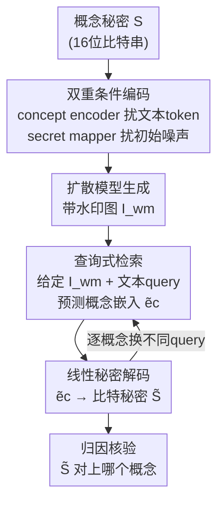

# TokenTrace: Multi-Concept Attribution through Watermarked Token Recovery

**会议**: CVPR 2026  
**论文**: [CVF Open Access](https://openaccess.thecvf.com/content/CVPR2026/html/Zhang_TokenTrace_Multi-Concept_Attribution_through_Watermarked_Token_Recovery_CVPR_2026_paper.html)  
**代码**: 待确认  
**领域**: AI安全 / 生成式水印 / 版权归因  
**关键词**: 主动水印, 多概念归因, 扩散模型, 语义域水印, 知识产权保护

## 一句话总结
TokenTrace 把概念的秘密签名**同时注入文本提示嵌入和初始隐噪声**（双重条件），再用一个**带查询的检索模块**——给定生成图 + "我想查哪个概念"的文本 query——把对应概念的秘密单独解码出来，从而在一张图里同时混入多个概念（物体 + 画风）时仍能逐个独立归因，在单概念和多概念归因任务上都显著超过 ProMark / CustomMark。

## 研究背景与动机

**领域现状**：文生图扩散模型能轻易复刻艺术家的独特风格和概念，却不留出处，这对知识产权（IP）是严重威胁。主流防护手段是**主动水印（proactive watermarking）**——在生成过程中就把不可见签名嵌进去，之后用解码器检测出来，建立"这张图来自哪个训练概念"的因果归因。代表作 ProMark 把水印嵌进**像素空间**，CustomMark 等更新的方法嵌进**隐空间**。

**现有痛点**：像素域水印很脆，一压缩、一裁剪就没了；隐空间水印虽然鲁棒，但它是**内容无关（content-agnostic）的单一整体水印**——它不区分图里到底有几个概念。问题是生成图常常是**多概念合成**的（比如"某个角色 + 某种画风"），这些方法只埋一个整体签名，当多个概念的视觉表征在最终图里**空间重叠**时，根本没法把它们拆开、逐个归因。

**核心矛盾**：要在像素/隐空间里塞进多个互不干扰的签名，本质上是让有限的空间承载多路信号，必然**信号干扰**；而且这些水印和"概念是什么"没有语义绑定，检索时也没有一个"我只想查这个概念"的精确入口。已有的多概念尝试（如 CustomMark）正是栽在信号干扰和缺乏定向检索机制上。

**本文目标**：做到（1）多概念合成图里逐个概念独立归因；（2）对常见图像变换鲁棒；（3）保持高视觉保真度、不破坏画面。

**切入角度**：作者的关键假设是——**把水印直接绑到它所代表概念的文本语义上**，鲁棒性和特异性都能大幅提升（灵感来自 prompt-tuning 在基础模型上的成功）。一旦签名是按"文本语义"分开的，多个概念的秘密在生成开始之前就已经在**文本语义域里彼此分离**了，从源头上绕开了像素层面的空间重叠问题。

**核心 idea**：把每个概念的秘密**同时**写进它的文本 token 嵌入和初始隐噪声（双重条件编码），检索时用一个**文本 query 驱动**的模块按需把指定概念的嵌入"反解"出来，再线性解码回比特秘密。

## 方法详解

### 整体框架

TokenTrace 是一个"编码 → 解码"两阶段的主动水印框架，作为可控生成的溯源工具。**编码阶段**把一个概念秘密 $\mathcal{S}$（默认 16 位二进制串）通过两条并行网络分别扰动文本提示嵌入和初始噪声，让扩散模型生成一张带水印的图 $I_{wm}$。**解码阶段**反过来：把 $I_{wm}$ 和一个指明"查哪个概念"的文本 query 喂进 TokenTrace 模块，预测出该概念的嵌入，再由一个线性 secret decoder 翻译回原始比特秘密做核验。整个系统的妙处在于——检索靠 query 触发，所以同一张图里混了多个概念时，可以换不同 query 把它们逐个单独查出来。

### 关键设计

**1. 双重条件编码：把秘密同时埋进语义域和隐空间，从源头分离多概念**

针对"单一整体水印拆不开多概念"这个痛点，TokenTrace 不在像素/隐空间硬塞多路信号，而是把秘密绑到**目标概念 token** 上。一个用户提示的嵌入是 token 序列 $E_{prompt}=\{e_1,\dots,e_c,\dots,e_k\}$，其中 $e_c$ 是要打水印的那个概念 token。**concept encoder** $f_{enc}$ 吃概念秘密 $\mathcal{S}$ 和目标 token $e_c$，生成一个扰动，**只**加到 $e_c$ 上：

$$\hat{e}_c = e_c + f_{enc}(e_c, \mathcal{S}),\qquad \hat{E}_{prompt}=\{e_1,\dots,\hat{e}_c,\dots,e_k\}$$

与此并行，**secret mapper** $f_{map}$ 只吃秘密 $\mathcal{S}$，生成一个结构化的高斯扰动图案叠加到初始噪声上：$\hat{z}_T = z_T + f_{map}(\mathcal{S})$。最后扩散模型在两者上同时做条件生成：$I_{wm}=DM(\hat{z}_T,\hat{E}_{prompt})$。

为什么有效：签名被**双重织进**了生成过程——语义域保证了"每个概念的秘密挂在自己专属的 token 上"，所以多概念时各路签名在生成开始前就分在不同 token，天然不抢空间；隐空间的噪声扰动则把签名深度编织进图像结构，使它远比只改像素的方法抗变换。两条腿一起走，既拿到概念级分离，又拿到鲁棒性。

**2. 查询式 TokenTrace 检索模块：用文本 query 当"指针"按需取出单个概念**

光把秘密分开埋进去还不够，检索时得有办法"只查我想要的那个概念"。本设计让解码变成一个 query 驱动的两步流水线：把带水印图 $I_{wm}$ 和一句简单的查询提示 $P_{query}$（从预定义集合里选，例如查 `<sks-object>` 就用 "a photo of \<sks-object\>"）一起喂进模块 $f_{tt}$，预测出对应概念的嵌入 $\tilde{e}_c = f_{tt}(I_{wm}, P_{query})$，再由线性 secret decoder $f_{dec}$ 把高维嵌入翻译回比特秘密 $\tilde{\mathcal{S}}=f_{dec}(\tilde{e}_c)$。

模块内部为参数高效特意复用**冻结的 CLIP 编码器**：图像走冻结 image encoder 后接可训练投影层 $f_{proj1}$ 对齐维度，query 走冻结 text encoder，二者经可训练注意力模块 $f_{attn}$ 融合成上下文感知表征，再过投影层 $f_{proj2}$ 得到 $\tilde{e}_c$：

$$F_{img}=f_{proj1}(f_{imgenc}(I_{wm})),\quad F_{text}=f_{textenc}(P_{query}),\quad F_{fused}=f_{attn}(F_{img},F_{text}),\quad \tilde{e}_c=f_{proj2}(F_{fused})$$

为什么有效：query 在这里相当于一个"指针"——换不同 query 就能让同一张图反复被"问"出不同概念的签名，这正是解决空间重叠的关键，像素法做不到这种定向检索。而冻结 CLIP + 只训轻量投影/注意力层（adapter 式微调思路）让模块能**快速、可扩展地适配新概念**，避免全量微调大模型的高成本和灾难性遗忘——这也是后面顺序学习实验能成立的原因。

**3. 四项复合损失：在"检索准"和"看不出"两个对立目标间联合优化**

水印有两个天生打架的目标：要让秘密**检索得准**，又要让水印**人眼看不出**。本设计把全部可训练组件（concept encoder、secret mapper、TokenTrace 模块的投影/注意力层、secret decoder）放在一个复合损失下联合优化，由四项加权而成：

$$\mathcal{L}_{total}=\lambda_1\mathcal{L}_{BCE}+\lambda_2\mathcal{L}_{CSD}+\lambda_3\mathcal{L}_{L2}+\lambda_4\mathcal{L}_{reg}$$

其中 $\mathcal{L}_{BCE}$ 是原始秘密与预测秘密的二元交叉熵，保证水印能被准确取回；$\mathcal{L}_{CSD}$ 用对比式风格描述子（CSD）的余弦距离 $1-\frac{\phi(I_{clean})\cdot\phi(I_{wm})}{\|\phi(I_{clean})\|\|\phi(I_{wm})\|}$ 维持带水印图与干净图的高层语义/风格一致；$\mathcal{L}_{L2}=\|I_{clean}-I_{wm}\|_2^2$ 压像素级可见差异保证不可感知；$\mathcal{L}_{reg}=\|e_c-\tilde{e}_c\|_2^2$ 约束预测嵌入贴近真值。直观地，$\mathcal{L}_{BCE}$ 与 $\mathcal{L}_{reg}$ 管"检索准"，$\mathcal{L}_{L2}$ 与 $\mathcal{L}_{CSD}$ 管"看不出"，权重设为 $\{5,5,1,1\}$。消融显示去掉 CSD 损失掉点最狠（见下），说明高层语义一致性对准确检索同样关键，而不只是为了好看。

### 损失函数 / 训练策略
训练时每次采一批（干净图、提示、秘密、真值嵌入），先做编码生成水印图，再过解码流水线取回秘密，算 $\mathcal{L}_{total}$ 后梯度下降更新全部可训练参数。底座用 SD 1.5，TokenTrace 模块用冻结的 CLIP ViT-L/14；秘密默认 16 位；Adam（lr=1e-4，betas=(0.9,0.999)），步进式 lr 调度 gamma=0.95，训 10000 步，8×A100、每卡 batch 6。推理（核验）只是解码模块的一次前向。

## 实验关键数据

### 主实验

单概念归因（WikiArt 23 种画风 / ImageNet 1000 类物体），TokenTrace 在比特准确率（Bit）和归因准确率（Att）上全面领先被动与主动基线：

| 数据集 | 方法 | 类型 | Bit ↑ | Att ↑ |
|--------|------|------|-------|-------|
| WikiArt | CLIP（被动） | Passive | - | 52.60 |
| WikiArt | ProMark（像素主动） | Proactive | 93.14 | 87.19 |
| WikiArt | CustomMark（隐域主动） | Proactive | 95.59 | 89.25 |
| WikiArt | **TokenTrace** | Proactive | **98.33** | **91.67** |
| ImageNet | ProMark | Proactive | 90.56 | 87.30 |
| ImageNet | CustomMark | Proactive | 93.11 | 87.12 |
| ImageNet | **TokenTrace** | Proactive | **95.82** | **90.43** |

多概念归因（左：2 个定制概念=1物体+1画风；右：4 个通用概念），优势随概念数增多更明显，加上 prompt weighting 的增强版 TokenTraceP 进一步拉高：

| 方法 | 定制 Bit ↑ | 定制 Att ↑ | 通用 Bit ↑ | 通用 Att ↑ |
|------|-----------|-----------|-----------|-----------|
| CustomMark | 92.47 | 85.14 | 78.93 | 72.78 |
| TokenTrace | 94.15 | 88.62 | 85.41 | 81.57 |
| **TokenTraceP** | **96.83** | **90.53** | **90.33** | **86.08** |

四通用概念场景里 TokenTrace 把归因准确率从 CustomMark 的 72.78% 拉到 81.57%（TokenTraceP 86.08%），差距明显比单概念时大——正好印证"多概念越复杂，查询式分离越值钱"。

### 消融实验

损失项消融（WikiArt），去掉任一项都掉点，CSD 损失影响最大：

| 配置 | Bit Acc. ↑ | Att Acc. ↑ | CLIP Score ↑ | CSD Score ↑ |
|------|-----------|-----------|--------------|-------------|
| No CSD | 91.81 | 83.75 | 0.73 | 0.65 |
| No L2 (latent) | 96.03 | 88.52 | 0.82 | 0.76 |
| No L2 (Image) | 93.65 | 86.37 | 0.81 | 0.73 |
| **All（完整）** | **98.33** | **91.67** | **0.87** | **0.82** |

鲁棒性消融（WikiArt，对水印图施加常见失真后再检索）：

| 失真类型 | Bit Acc. ↑ | Att Acc. ↑ |
|----------|-----------|-----------|
| 无失真 | 98.33 | 91.67 |
| Rotation | 96.21 | 90.04 |
| JPEG | 94.68 | 88.20 |
| Adversarial Attack | 94.08 | 87.17 |
| CropAndResize | 93.28 | 86.57 |
| GaussianBlur | 91.32 | 84.81 |
| ColorJitter | 89.62 | 83.22 |
| GaussianNoise | 89.18 | 82.94 |

### 关键发现
- **CSD 损失最关键**：去掉它归因准确率从 91.67% 暴跌到 83.75%、CSD Score 从 0.82 跌到 0.65，说明维持高层语义/风格一致不只是为了画面好看，更直接决定能不能准确反解出概念嵌入。
- **比特长度是容量与准确率的 trade-off**：5 位秘密归因最高（94.38%），16 位（默认）91.67%，64 位掉到 84.18%、CSD 0.72——签名越长越难嵌、越容易干扰原内容，16 位是容量与保真的最佳平衡。
- **可扩展性强**：概念库从 10 扩到 1000，归因准确率只掉约 6 个点（96.39%→90.43%），比特准确率 99.16%→95.82%，得益于冻结 CLIP + 轻量可训练层。
- **顺序学习抗遗忘**：从 10 个画风起步、每次加 2 个新概念只用 10% 额外迭代微调，归因准确率从 98.22% 仅降到 94.13%，无需从头重训即可上新概念。
- **多概念可逐个拆**：一张含四概念的图（"detailed cat wearing a sweater... glowing rays"），query 式模块把 'cat'、'sweater' 以 100% 准确率取回，'detailed'、'rays' 也高准确，证明查询机制真能解决概念重叠。

## 亮点与洞察
- **把"空间分离"问题搬到"语义分离"解决**：与其在像素/隐空间挤多路签名导致互相干扰，不如让每个概念的秘密挂在自己的文本 token 上——多概念在生成开始前就在文本语义域里分开了，这个视角转换很巧妙，是全文最"啊哈"的一点。
- **query 当指针的检索范式**：用一句文本 query 指定"查哪个概念"，让同一张图能被反复问出不同签名，这种"按需定向检索"是像素/隐域整体水印天生做不到的，可迁移到任何需要"从混合信号里挑单路"的溯源任务。
- **双域注入兼得分离与鲁棒**：语义域给概念级分离，隐空间噪声扰动给抗变换鲁棒，两者职责清晰互补，而非把所有担子压在一个域上。
- **冻结 CLIP + 轻量 adapter 换来可扩展性**：参数高效设计不是顺带的工程优化，而是顺序学习/大概念库这两个实用场景能成立的前提，思路可直接迁到其他"持续上新类别"的检测/归因系统。

## 局限与展望
- **依赖修改底座生成过程**：作为主动水印，必须在生成时介入（扰文本嵌入 + 扰噪声），对已经生成好的、或第三方闭源模型产出的图无能为力，只能保护"自己可控的生成管线"。
- **query 来自预定义集合**：检索需要事先知道"可能有哪些概念"并准备对应 query，对开放世界里未知的、没登记过的概念，如何触发检索文中没展开。
- **TokenTraceP 的增益靠 prompt weighting**：多概念上最好的数字来自带 prompt weighting 的增强版，其细节放在补充材料，正文未充分交代，复现门槛和适用范围需打个问号。
- **底座较老**：实验用 SD 1.5 + CLIP ViT-L/14，在更新的 SDXL/FLUX 等架构上语义域注入是否同样稳健、概念 token 定位是否依旧干净，有待验证。
- **比特容量有限**：16 位默认意味着可区分签名空间不大，面对海量创作者/概念的真实规模，长比特又会掉准确率，容量天花板是个现实约束。

## 相关工作与启发
- **vs ProMark（像素域主动水印）**: ProMark 把水印埋进像素空间，鲁棒性差（压缩/裁剪易失效）且是单一整体水印拆不开多概念；TokenTrace 改到语义+隐空间双域，鲁棒性和多概念分离都更强（WikiArt 87.19%→91.67%）。
- **vs CustomMark（隐域/文本域主动水印）**: CustomMark 同样靠改文本提示做多概念归因，但缺乏定向检索机制，处理空间重叠概念时会信号干扰；TokenTrace 的查询式模块提供了"按概念检索"的精确入口，四概念场景把归因从 72.78% 拉到 81.57%。
- **vs Guarding Textual Inversion**: 它面向单概念追踪，不处理组合归因；TokenTrace 专门解决多概念合成的拆分问题。
- **vs 被动水印（CLIP/SSCD 等相似度检索）**: 被动法生成后才比对相似度，易被变换击垮且准确率低（CLIP 仅 52.60%）；主动法把因果签名嵌进生成过程，本质更可靠。

## 评分
- 新颖性: ⭐⭐⭐⭐ 把多概念归因从"空间分离"重构成"语义分离"+ query 式定向检索，视角清晰且切中已有方法痛点。
- 实验充分度: ⭐⭐⭐⭐ 单/多概念、损失/比特长度/概念数/失真四类消融 + 顺序学习都覆盖，但部分最优数字依赖放在补充材料的 TokenTraceP。
- 写作质量: ⭐⭐⭐⭐ 动机推导和方法叙述清楚、图表配合到位，少数实验段落有笔误。
- 价值: ⭐⭐⭐⭐ 生成式 IP 保护是刚需，多概念逐个归因的能力实用，框架对可扩展上新概念也友好。

<!-- RELATED:START -->

## 相关论文

- [\[CVPR 2026\] Beyond \[CLS\] Token: Query-Driven Token-Level Forgery Purification for Generalizable Deepfake Detection](beyond_cls_token_query-driven_token-level_forgery_purification_for_generalizable.md)
- [\[CVPR 2026\] RecoverMark: Robust Watermarking for Localization and Recovery of Manipulated Faces](recovermark_robust_watermarking_for_localization_and_recovery_of_manipulated_fac.md)
- [\[CVPR 2026\] SAGA: Source Attribution of Generative AI Videos](saga_source_attribution_of_generative_ai_videos.md)
- [\[CVPR 2026\] ClusterMark: Towards Robust Watermarking for Autoregressive Image Generators with Visual Token Clustering](clustermark_towards_robust_watermarking_for_autoregressive_image_generators_with.md)
- [\[CVPR 2026\] Roots Beneath the Cut: Uncovering the Risk of Concept Revival in Pruning-Based Unlearning for Diffusion Models](roots_beneath_the_cut_uncovering_the_risk_of_concept_revival_in_pruning-based_un.md)

<!-- RELATED:END -->
