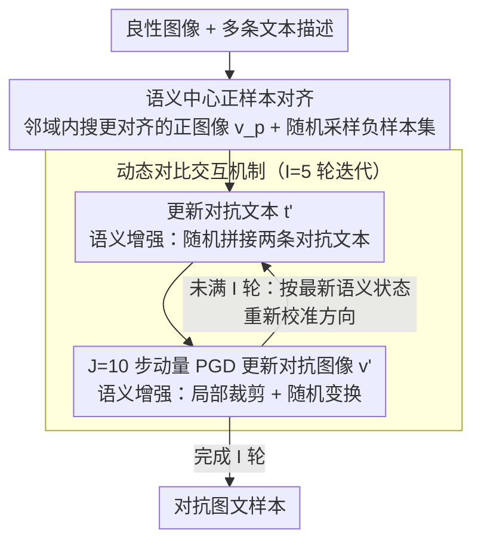

# Towards Highly Transferable Vision-Language Attack via Semantic-Augmented Dynamic Contrastive Interaction

**会议**: CVPR 2026  
**arXiv**: [2603.04839](https://arxiv.org/abs/2603.04839)  
**代码**: [GitHub](https://github.com/LiYuanBoJNU/SADCA)  
**领域**: AI安全  
**关键词**: 对抗攻击, 视觉语言模型, 对抗可迁移性, 对比学习, 语义增强

## 一句话总结

提出 SADCA（语义增强动态对比攻击），通过动态对比交互机制和语义增强模块，迭代地破坏对抗图像与文本之间的跨模态语义一致性，显著提升对视觉语言预训练模型（VLP）的对抗可迁移性，在跨模型和跨任务攻击中均超越现有 SOTA 方法。

## 研究背景与动机

**VLP 模型的安全隐患**：CLIP、ALBEF、TCL 等视觉语言预训练模型通过大规模图文对联合训练，在图文检索（ITR）、图像描述（IC）、视觉定位（VG）等任务上表现优异，但其对抗鲁棒性令人担忧。研究对抗攻击对于评估和提升 VLP 模型安全性至关重要。

**静态交互的局限**：现有 VLP 攻击方法（如 SGA、SA-AET）依赖静态跨模态交互——仅在原始图文对上进行一到两次交互，对抗样本沿固定方向偏离语义中心，缺乏探索语义空间中多样化攻击方向的能力，导致跨模型可迁移性差。

**忽略负样本的缺陷**：现有方法仅使用正样本图文对，忽略了负样本在塑造语义决策边界中的作用。仅有"推力"（远离正样本）而无"拉力"（靠近负样本），对抗样本在嵌入空间中与良性样本的分离不够充分。

**输入多样性不足**：输入变换是传统图像攻击中提升可迁移性的有效策略（如 SIA、BSR），但现有 VLP 攻击方法几乎忽视了这一点，仅考虑有限的尺度不变性，导致语义多样性不足。

## 方法详解

### 整体框架

SADCA 要解决的是「对抗样本只会沿一个固定方向偏离语义、换个模型就攻不动」的可迁移性难题。它的思路是把对抗优化做成一个不断重新校准方向的迭代过程：先给良性图像找一个干净的语义锚点，再让对抗图像和对抗文本在每一轮里互相牵引、轮流更新，同时不断给图像和文本注入语义增强，使每一步的攻击方向都基于最新的跨模态语义状态而非一开始就定死。

具体来说，攻击先通过语义对齐得到一个更接近语义中心的正图像 $v_p$ 作为参照，随后进入 $I$ 轮动态对比交互：每一轮里先更新对抗文本 $t'$，再用更新后的文本通过 $J$ 步 PGD 迭代更新对抗图像 $v'$，每一步都把正负样本对比损失和语义增强一起算进去。两大组件——动态对比交互负责「让方向随语义状态走」，语义增强模块负责「让每步看到更多样的语义视角」——共同把对抗样本推离正确语义、拉向错误语义。

### 关键设计

**1. 语义中心正样本对齐：先把锚点摆正，再谈往哪偏**

攻击的第一步要回答「相对谁偏离」。直接拿原始图文对当正样本看似自然，但原始图像的特征嵌入里塞满了与文本无关的冗余信息，这个带偏置的锚点会让对抗样本根本没法朝正确语义中心的反方向走干净。SADCA 的做法是先在图像的 $\epsilon_v$ 邻域内搜一个与多条文本描述都更对齐的正图像：$v_p = \arg\max_{v_p \in B[v,\epsilon_v]} \sum_{m=1}^{M} Cos(v, t_m)$，其中 $T = \{t_1, ..., t_M\}$ 是与该图像配对的多个文本。负样本集 $V_n, T_n$ 则从数据集里随机取 $K$ 个不匹配样本。相比 SGA 直接用原始图文对，先做这步语义对齐相当于把「语义中心」这个参照系摆正，后面所有的远离/靠近才有意义。

**2. 动态对比交互机制：每轮都按最新语义状态重新校准攻击方向**

这是整篇最核心的设计，针对的正是「静态交互只能沿固定方向偏移」的痛点。SGA 只做一次交互、SA-AET 也只做两次静态交互，对抗样本一旦定向就一路推到底，换个模型自然失效。SADCA 把交互改成 $I=5$ 轮的动态过程：每轮里先更新对抗文本，再用更新后的文本去更新对抗图像，关键在于损失里额外加了一项「与当前对抗态」的对比，使方向随语义状态滚动校准。对抗图像损失为 $\mathcal{L}_v = \sum_m Cos(v'_i, t_{pm}) - \lambda \sum_k Cos(v'_i, t_{nk}) + \sum_m Cos(v'_i, t'_{im}) - \lambda \sum_k Cos(v'_i, t_{nk})$，对抗文本损失为 $\mathcal{L}_t = Cos(v_p, t'_i) - \lambda \sum_k Cos(v_{nk}, t'_i) + Cos(v'_i, t'_i) - \lambda \sum_k Cos(v_{nk}, t'_i)$——式中前两项是相对正/负样本的静态对比，后两项就是引入当前对抗文本/图像的动态项。图像更新走带动量的 PGD：

$$g_{i(j+1)} = \mu \cdot g_{ij} + \frac{\nabla\mathcal{L}_v}{\|\nabla\mathcal{L}_v\|}, \quad v'_{i(j+1)} = clip\big(v'_{ij} + \alpha \cdot sign(g_{i(j+1)})\big)$$

因为每一轮的对抗文本和图像语义状态都不一样，梯度方向也随之刷新，对抗样本就能探索语义空间里更广的攻击方向，而不是被第一步的方向锁死——这正是它跨模型还能打得动的原因。值得一提的是，这里既用正样本提供「推力」（远离正确语义），又用负样本提供「拉力」（靠向错误语义），双向牵引让对抗样本更彻底地越过语义决策边界，而现有方法大多只有推力。

**3. 语义增强模块：在图像和文本两端同时注入语义多样性**

输入变换在传统图像攻击里早被验证能提升可迁移性，但现有 VLP 攻击几乎没用上，顶多考虑有限的尺度不变性，导致每步梯度都过拟合到单一语义视角。SADCA 在两个模态上同时做增强：图像端用局部语义增强，随机裁剪（裁剪比例 $r_s \sim U(0.4, 0.8)$）后再叠加旋转/亮度/翻转等随机变换，$V'_{sa} = \{A_s(Resize(Crop(v'; r_s)))\}_{s=1}^S$，局部裁剪刻意聚焦细粒度语义区域而非整图全局变换；文本端用混合语义增强，从对抗文本集里随机抽两条拼起来，$T'_{sa} = \{Concat(t'_i, t'_j) \mid i \neq j\}_{s=1}^S$。两端各生成 $S$ 个增强视角再去算损失，相当于让每步梯度从更丰富的跨模态语义视角汇聚，减少对单一视角的过拟合——这是它和只在感知层面做变换的 SIA 本质不同的地方。

### 损失函数 / 训练策略

- 图像攻击总损失：$\mathcal{L}_v = \mathcal{L}(V'_{sa}, T_p, T_n) + \mathcal{L}(V'_{sa}, T'_{sa}, T_n)$（语义增强后的正负样本对比 + 与动态对抗文本的对比）
- 文本攻击总损失：$\mathcal{L}_t = \mathcal{L}(t'_m, v'_i, V_n) + \mathcal{L}(t'_m, v_p, V_n)$
- 关键超参数：步长 $\alpha = 2/255$，动量 $\mu = 1.0$，动态交互轮数 $I = 5$，图像攻击迭代 $J = 10$，负样本数 $K = 20$，负样本权重 $\lambda = 0.2$，增强数量 $S = 10$
- 图像扰动约束：$\ell_\infty$ 范数，$\epsilon_v = 8/255$；文本扰动：BERT-Attack，$\epsilon_t = 1$

## 实验关键数据

### 主实验（跨模型可迁移性 - Flickr30K ITR 任务）

| 源模型→目标 | 指标 | SADCA | SA-AET(LI)+SIA | 提升 |
|-------------|------|-------|----------------|------|
| ALBEF→CLIPViT | TR R@1 ASR | **81.10** | 75.71 | +5.39 |
| ALBEF→CLIPCNN | IR R@1 ASR | **86.11** | 80.41 | +5.70 |
| TCL→CLIPViT | TR R@1 ASR | **78.28** | 77.04 | +1.24 |
| TCL→CLIPCNN | IR R@1 ASR | **88.71** | 84.05 | +4.66 |
| CLIPViT→ALBEF | TR R@1 ASR | **87.07** | 79.04 | +8.03 |
| CLIPViT→TCL | IR R@1 ASR | **87.98** | 82.57 | +5.41 |
| CLIPCNN→CLIPViT | TR R@1 ASR | **49.43** | 38.69 | +10.74 |

SADCA 在所有 4 个源模型的跨模型迁移中均显著超越 SOTA（SA-AET(LI)+SIA），平均 ASR 提升约 5-10%。

### 跨任务可迁移性（ALBEF→其他任务）

| 任务 | 指标 | SADCA | SA-AET | 提升 |
|------|------|-------|--------|------|
| VG (Val) | Acc ↓ | **46.78** | 47.44 | -0.66 |
| IC (B@4) | ↓ | **17.4** | 21.0 | -3.6 |
| IC (CIDEr) | ↓ | **50.3** | 65.7 | -15.4 |
| IC (SPICE) | ↓ | **10.7** | 13.6 | -2.9 |

### 对 LVLM 的攻击（ALBEF→大语言模型）

| 目标模型 | Clean | SADCA | SA-AET(LI)+SIA |
|----------|-------|-------|----------------|
| LLaVA-1.5-7B | 3.46 | **40.34** | 35.20 |
| Qwen3-VL-8B | 14.4 | **86.34** | 80.14 |
| GPT-5 | 23.88 | **78.61** | 68.08 |
| GPT-4o-mini | 15.00 | **79.12** | 62.48 |
| Gemini-2.0 | 6.96 | **52.06** | 41.56 |

### 关键发现

- **动态交互是核心驱动力**：从 SGA 的单次交互到 SADCA 的 5 轮动态交互，ASR 大幅提升（如 ALBEF→CLIPCNN TR 从 39.59% 提至 85.44%）
- **输入变换对 VLP 攻击同样有效**：将 SIA 集成到 SGA/SA-AET 后性能显著提升，验证了输入多样性在 VLP 攻击中的重要性
- **负样本的贡献**：引入负样本对比使对抗样本在语义空间中的偏离更充分，SADCA 完整版比不使用负样本的变体高出约 3-5% ASR
- **对闭源商业模型也有效**：SADCA 对 GPT-5 的攻击成功率达 78.61%，凸显了 VLP 模型对抗安全风险的普遍性

## 亮点与洞察

1. **动态交互 vs 静态交互**：静态方法像沿固定方向推一把，动态方法则持续调整推力方向——每轮交互后对抗文本和图像的语义状态都变了，梯度方向随之更新，自然能探索更广泛的攻击方向空间
2. **正负样本对比的巧妙应用**：将对比学习的思想用于对抗攻击——正样本提供"推力"，负样本提供"拉力"，双管齐下使对抗样本跨越语义决策边界
3. **语义增强的双模态设计**：局部裁剪聚焦细粒度语义区域，文本拼接混合产生更丰富的语义表示，两者协同减少对单一语义视角的过拟合
4. **与 LVLM 攻击的自然衔接**：虽然主要针对 VLP 模型设计，但对 LVLM（包括 GPT-5）也展现出强攻击力

## 局限与展望

1. 动态交互增加了计算开销（总迭代 $I \times J = 50$ 步），相比 SGA 的 10 步慢 5 倍
2. 负样本的随机选择可能不够有效，基于语义距离或对抗性的负样本挖掘策略可能进一步提升性能
3. 文本扰动依赖 BERT-Attack 的词替换策略，对长文本的语义连贯性保持有限
4. 仅验证了 $L_\infty$ 范数约束，$L_2$ 等其他约束下的表现未探讨
5. 未讨论防御策略（如对抗训练、输入去噪）对 SADCA 的抑制效果

## 相关工作与启发

- **SGA (ICLR 2023)**：首个提出利用多文本描述扩展图文对多样性的 VLP 攻击方法，但仅单次静态交互
- **SA-AET**：引入对比特征空间优化对抗轨迹，但仍局限于两次静态交互
- **SIA (CVPR 2024)**：结构不变攻击——一种通用输入变换策略，SADCA 验证了其在 VLP 攻击中的有效性并进一步提出语义级增强
- 启发：对比学习框架可更广泛应用于其他对抗攻击场景（如 3D 视觉、语音模型），动态交互的思想也适用于对抗训练中的防御端

## 评分

- **新颖性**: ⭐⭐⭐⭐ — 动态对比交互机制新颖，正负样本结合的思路在 VLP 攻击中是首创
- **实验充分度**: ⭐⭐⭐⭐⭐ — 4 种 VLP 模型、2 类任务、多个 LVLM（含 GPT-5）、跨模型+跨任务、消融齐全
- **写作质量**: ⭐⭐⭐⭐ — 动机清晰，方法与现有工作的对比图直观，算法伪代码完整
- **价值**: ⭐⭐⭐⭐ — 揭示了 VLP 模型的跨模态攻击薄弱点，为对抗鲁棒性研究提供了更强的攻击基准

<!-- RELATED:START -->

## 相关论文

- [\[CVPR 2026\] VCP-Attack: Visual-Contrastive Projection for Transferable Black-Box Targeted Attacks on Large Vision-Language Models](vcp-attack_visual-contrastive_projection_for_transferable_black-box_targeted_att.md)
- [\[CVPR 2026\] When Robots Obey the Patch: Universal Transferable Patch Attacks on Vision-Language-Action Models](when_robots_obey_the_patch_universal_transferable_patch_attacks_on_vision-langua.md)
- [\[CVPR 2026\] FlowHijack: A Dynamics-Aware Backdoor Attack on Flow-Matching Vision-Language-Action Models](flowhijack_a_dynamics-aware_backdoor_attack_on_flow-matching_vision-language-act.md)
- [\[CVPR 2026\] Transform to Transfer: Boosting Adversarial Attack Transferability on Vision-Language Pre-training Models](transform_to_transfer_boosting_adversarial_attack_transferability_on_vision-lang.md)
- [\[CVPR 2026\] PureProof: Diffusion-Resistant Black-box Targeted Attack on Large Vision-Language Models](pureproof_diffusion-resistant_black-box_targeted_attack_on_large_vision-language.md)

<!-- RELATED:END -->
