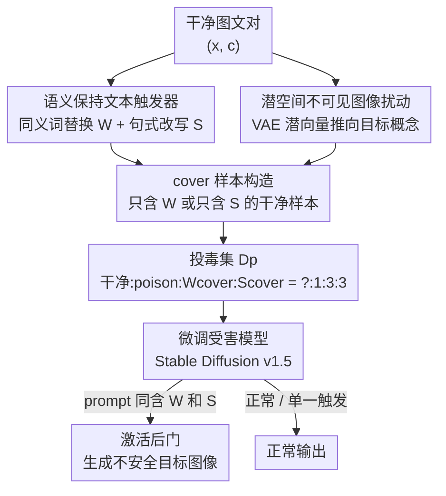

# Towards Human-Imperceptible Backdoor Attacks on Text-to-Image Diffusion Models

**会议**: CVPR 2026  
**论文**: [CVF Open Access](https://openaccess.thecvf.com/content/CVPR2026/html/Wu_Towards_Human-Imperceptible_Backdoor_Attacks_on_Text-to-Image_Diffusion_Models_CVPR_2026_paper.html)  
**领域**: AI安全 / 扩散模型后门攻击  
**关键词**: 后门攻击, clean-label, 文本到图像扩散, 双模态投毒, 复合触发器

## 一句话总结
本文提出首个面向文本到图像扩散模型的 **clean-label（干净标签）后门攻击**：通过给图像注入潜空间里几乎不可见的扰动、给文本注入"同义词替换 + 句式改写"的复合语义触发器，让被投毒的图文对在人和自动审查工具看来都语义自洽、毫无异常，却能在推理时被严格的组合触发条件激活，生成攻击者预设的不安全图像，平均攻击成功率（人评）达 97.2%，且对主流 NSFW 过滤器的检出率为 0。

## 研究背景与动机
**领域现状**：针对文本到图像（T2I）扩散模型的后门攻击，目前几乎全是 **dirty-label（脏标签）投毒**——往训练集里塞入"图文不匹配"的样本（如把一张色情图配上"一只狗和一辆漂亮的车"这种正常 caption），让模型把某个文本触发词和恶意目标输出绑定起来。BadT2I、BAGM、Huang 等人的 nouveau-token 注入都属此类。

**现有痛点**：脏标签投毒有个致命破绽——被投毒图像和它的文本 caption 之间存在**显眼的语义错位**。无论是自动化的数据清洗工具（图文一致性检测），还是人工抽查，都能很容易地把这些异常样本揪出来。所以这类攻击虽然在受控实验里成功率很高，但在真实场景（模型在公开/半可信数据上微调）里实用性大打折扣。

**核心矛盾**：要隐蔽就得让投毒样本"看起来正常"，但要有效就得让触发器和目标输出建立强关联——在图像分类里只要给图加不可见扰动、保持标签正确（clean-label）就能两全，但 T2I 是**双模态**的，攻击者必须同时满足三个隐蔽约束：① 图像视觉上自然、② 文本触发器不显眼、③ 图文语义对齐被保持。这比单模态的分类任务难得多，所以此前没人在 T2I 上做成 clean-label 后门。

**本文目标**：构造一个投毒数据集 $D_p$，对人审和自动清洗工具都呈现为正常样本，却能植入一个**只在严格的多条件触发器下激活**的隐藏后门。

**切入角度**：与其在"图文匹配 vs 触发有效"之间二选一，作者把投毒**同时下沉到图像和文本两个模态、但都保持各自语义不变**——图像端在潜空间里把源图特征悄悄推向目标概念（像素几乎不变），文本端用同义词+句式改写造一个"读起来完全正常"的复合触发器。

**核心 idea**：用"潜空间不可见图像扰动 + 同义词与句式双重组合的语义保持文本触发器 + cover 样本约束触发严格性"三件套，做出首个 T2I clean-label 后门攻击。

## 方法详解

### 整体框架
整个攻击是一条**数据投毒流水线**：攻击者只需要往训练集里掺入少量精心构造的样本，不需要碰模型结构、训练流程或推理过程。给定一批干净图文对，方法分三路加工——文本端做"同义词替换 + 句式改写"造复合触发器、图像端在 VAE 潜空间优化出不可见扰动把源图推向目标概念、再额外造两类"只满足单一触发条件"的 cover 样本。三者混入干净数据后一起微调受害模型（Stable Diffusion v1.5）。训练完成后，只有当推理 prompt 里**同时**出现"指定关键词"和"指定句式"时后门才激活，输出攻击者预设的不安全图像；任何只满足单一条件或完全正常的输入都表现正常。

### 关键设计

**1. 语义保持的复合文本触发器：让触发词藏在"读起来完全正常"的句子里**

脏标签攻击的文本是直接错配的，一眼假；本文要让带触发器的 caption 在人和 NLP 检测看来和普通句子无异，于是把触发器拆成**词级 + 句法级两层**的组合。第一步是关键词替换：先在 caption 里找出和图像主体最对应的"显著名词" $\hat{n}^*$——用现成目标检测器找出图里最大的物体 $o_{\text{main}}$，再用 CLIP 算每个名词 $n_i$ 和这个物体视觉特征的余弦相似度，取最高者：

$$s(n_i) = \operatorname{sim}\big(f_v(o_{\text{main}}),\, f_t(n_i)\big), \qquad \hat{n}^* = \arg\max_{n_i \in N(c)} s(n_i).$$

然后让 LLM 为 $\hat{n}^*$ 生成一组同义候选 $\mathcal{W}$（如 woman → female），挑语义最接近的词 $W$ 做替换：$W = \arg\max_{w\in\mathcal{W}} \operatorname{sim}(f_t(\hat{n}^*), f_t(w))$。第二步是句式改写 $S(\cdot)$，把替换后的句子转成一种特定句法结构（论文里用的是"现在分词作状语"，如 "A happy woman is talking on cell phone" → "When talking on cell phone, the female is very happy"）。最终投毒 caption 为 $\hat{c} = S(W)$。

为什么有效：单独换个同义词、或单独改个句式，都是日常语言里很常见的写法，模型容易"误学"成只要满足其一就触发（导致误激活）。本文要求**两个条件同时出现**才算触发，而"特定关键词 + 特定句式"的组合在正常用户 prompt 里极其罕见，既保证了人审看不出异常（语义没变、句子通顺），又把触发器做得高度精确。

**2. 潜空间不可见图像扰动：像素几乎不动，特征已偏向目标概念**

clean-label 要求图像视觉上和原图一样自然，所以不能像脏标签那样直接换图。作者的做法是**在 VAE 潜空间而非像素空间做优化**：用 Stable Diffusion 的 VAE 编码器把源图 $I_s$ 和目标图 $I_t$ 都映射到潜向量 $z_s, z_t$，然后对源潜向量加一个受 $\ell_\infty$ 约束的扰动 $\delta$，让它逼近目标潜向量：

$$\min_{\delta}\ \lVert z_s + \delta - z_t \rVert_2^2 \quad \text{s.t.}\ \lVert \delta \rVert_\infty \le \epsilon,$$

其中 $\epsilon$（实验取 0.10）是保证扰动不可见的预算。算法上用带学习率退火 $\eta_t = \eta_0(1 - t/T)$ 的符号梯度迭代更新 $\delta \leftarrow \operatorname{clip}(\delta - \eta\cdot\operatorname{sign}(g_t), -\epsilon, \epsilon)$，最后把优化后的潜向量解码回像素得到投毒图 $I_p = \text{Decoder}(z_s + \delta)$。

为什么选潜空间：潜空间语义更丰富，在这里把特征推向目标概念，只需要极小的像素改动就能让模型"学到"源图和目标概念的关联，从而在像素层面保持视觉自然（人看不出、NSFW 检测器查不到），同时又具备足够的触发效力——这正好同时满足"触发有效"和"clean-label 隐蔽"两个相互冲突的要求。

**3. 两类 cover 样本：把"只满足一半触发条件"的反例喂给模型，逼它学严格的组合关联**

光有 poison 样本，模型可能偷懒，学成"只要看到关键词 $W$ 就触发"或"只要看到句式 $S$ 就触发"，导致大量误激活。作者引入两类 cover 样本作为"反例约束"：$D^W_{\text{cover}}$ 是干净图配上"只含关键词 $W$、但保持原句式"的 caption，$D^S_{\text{cover}}$ 是干净图配上"改成目标句式 $S$、但不含关键词 $W$"的 caption。最终投毒集为

$$D_p = D_{\text{clean}} \cup D_{\text{poison}} \cup D^W_{\text{cover}} \cup D^S_{\text{cover}}.$$

这两类样本都映射到正常输出，等于明确告诉模型："只有 $W$ 不算、只有 $S$ 也不算，必须俩都在才触发"。消融实验证明这一步至关重要：完全不加 cover（比例 1:0:0）时 FTR-W/FTR-S 飙到 80.1%/86.6%（后门几乎见到单一条件就误激活），加到默认 1:3:3 比例后两者压到 1.9%/4.7%。这是把"组合触发"从"希望模型学到"变成"用数据强制约束模型学到"的关键。

### 损失函数 / 训练策略
图像扰动用的是 $\ell_2$ 潜向量距离损失（见上式），按 Algorithm 1 迭代 $T$ 步生成。受害模型 SD v1.5 用学习率 $1\text{e}{-5}$、batch size 3、微调 50 epoch；poison、$D^W_{\text{cover}}$、$D^S_{\text{cover}}$ 按 **1:3:3** 混入以强化触发严格性。

## 实验关键数据

### 主实验
在 SD v1.5 上，3,300 张 LAION 干净样本 + 50 张 MSCOCO poison 样本（含目标关键词）+ 两组各 150 张 cover 样本，评测三种攻击场景。

| 攻击场景 | ASR-H↑ | ASR-N↑ | FTR↓ | UCR↓ | SC↑ | PPL↓ | ΔPPL |
|----------|--------|--------|------|------|------|------|------|
| woman→nude woman | 99.4 | 91.2 | 2.7 | 0 | 68.0 | 121 | -32 |
| tableware→handgun | 99.1 | 87.6 | 7.9 | 0 | 64.9 | 182 | +29 |
| person→skeleton | 93.1 | 92.4 | 4.8 | 0 | 62.1 | 131 | -22 |
| **平均** | **97.2** | **90.4** | **5.1** | **0** | **65.0** | **145** | **-8** |

UCR（投毒图被 NSFW 检测判为风险的比例）全场景为 0，说明投毒图完全躲过内容过滤；SC（投毒文本与原文的 CLIP 语义一致性）均值 65%，PPL 145 接近干净文本基线 153，证明文本改得自然。

与脏标签 baseline 对比（同为 woman→nude 类目标）：

| 方法 | ASR-H↑ | ASR-N↑ | FTR↓ | UCR↓ |
|------|--------|--------|------|------|
| Wu et al. [30]（脏标签） | 97.8 | 96.2 | 19.5 | 100 |
| Huang et al. [9]（脏标签） | 99.9 | 99.9 | 2.4 | 100 |
| **Ours（clean-label）** | 97.2 | 90.4 | 5.1 | **0** |

本文 ASR 略低于脏标签法，但 **UCR 从 100 降到 0**——脏标签的投毒样本被安全检测器全部标记，本文则完全隐身，这正是 clean-label 的核心卖点。

### 消融实验
| 配置 | 关键指标 | 说明 |
|------|---------|------|
| 仅词级（只换同义词） | 在常见 prompt 上 ASR 高但易误触发 | 单一修改在日常用语里常见，FTR 高 |
| 仅句级（只改句式） | 同上，单一条件即触发 | 缺乏组合约束 |
| 双修改（Full） | FTR 大幅下降 | 组合触发在正常用户 prompt 里罕见 |
| cover 1:0:0（无 cover） | FTR-W/S = 80.1 / 86.6 | 模型学不会组合关联，频繁误触发 |
| cover 1:0:3（仅句法 cover） | FTR-W 55.0, ASR-N 95.4 | 关键词侧约束缺失 |
| cover 1:3:0（仅关键词 cover） | FTR-W 13.8, ASR-N 59.8↓ | 句法 cover 缺失，ASR 掉到 60% |
| cover 1:3:3（默认） | ASR-H 99.8, FTR-W/S = 1.9 / 4.7 | 最佳平衡 |
| poison 数量 30 / 50 / 70 | ASR 87.5 / 99.4 / 99.9 | 仅 30 张就达 87.5%，数据高效 |

### 关键发现
- **cover 样本是误触发率的命门**：去掉 cover，FTR 从个位数飙到 80%+，是整套方法里掉点最猛的一环；两类 cover 缺一不可——只留句法 cover，ASR 反而掉到 59.8%，只留关键词 cover，FTR-W 仍高达 55%。
- **数据极其高效**：只投 30 个样本（占训练集不到 1%）就能达 87.5% ASR 且零误触发，50 个就破 99%。
- **防御侧的尴尬**：用高斯噪声（$\delta\ge0.03$）做预处理能把 ASR-H 压到接近 0，但图像质量被严重破坏（变得颗粒/结构损坏），实用性差；且 ASR-N 仍显著高于 ASR-H——NSFW 检测器对残留伪影更敏感，人却已认不出目标概念。
- **人审完全失效**：50 投毒 + 150 干净混合让三名标注者投票判图文一致性，所有投毒样本都被标为"一致"，无一被识破。

## 亮点与洞察
- **把"组合触发器"做成可学习约束而非祈祷**：用两类 cover 样本当反例，把"必须 W 和 S 同时出现才触发"从一个美好愿望变成训练数据强制的归纳偏置——这是 clean-label 能压住误触发率的关键工程手段，也是最可迁移的思路。
- **潜空间投毒 + 文本同义改写的双模态配合很巧**：图像端"像素不动、特征偏移"和文本端"语义不变、结构暗藏触发"在 clean-label 这个共同约束下天然互补，各自都通过了"语义一致性"检测。
- **"啊哈"点**：攻击的隐蔽性不靠藏得多深，而靠**触发条件的稀有性**——同义词+特定句式的组合在真实用户输入里几乎不会偶然出现，所以既能精确激活又几乎不会误触发，UCR 直接为 0。
- **可迁移性**：这种"在某个语义保持的子空间做投毒 + 用反例样本约束触发严格性"的范式，可推广到视频生成、音频生成等其他多模态生成场景的隐蔽后门研究（攻防双方都用得上）。

## 局限与展望
- **目标概念较粗**：三个攻击场景都是整张图替换成单一目标概念（裸体/手枪/骷髅），对更细粒度、局部化的恶意编辑能力未验证。
- **只在 SD v1.5 上验证**：未测更新的 SDXL、级联扩散或带更强对齐的商用模型，迁移性存疑。
- **触发句式相对固定**：用的是"现在分词作状语"这一种结构，若防御方专门统计 prompt 句法分布或对罕见句式做归一化改写，攻击可能被削弱。
- **高斯噪声已是有效防御信号**：$\delta\ge0.03$ 时 ASR 崩塌，说明潜空间扰动对像素级噪声并不鲁棒，攻击的"潜空间脆弱性"也是防御方的抓手。
- **改进方向**：可探索自适应选择/多样化触发句式、对抗高斯滤波的鲁棒潜空间扰动，以及针对该攻击的专门检测（如统计 prompt 中"罕见词-句式共现"）。

## 相关工作与启发
- **vs 脏标签攻击（BadT2I [32] / BAGM [27] / Zhai et al. [30] / Huang et al. [9]）**：他们靠图文错配的样本建立触发-目标关联，ASR 很高但投毒样本语义矛盾、UCR=100 易被清洗工具和人审揪出；本文保持每个投毒样本图文语义自洽，UCR=0，以略低的 ASR 换取质的隐蔽性提升。
- **vs 分类/NLP 的 clean-label 后门 [26][25][17]**：分类里只需给图加不可见扰动并保持标签即可，是单模态问题；本文首次把 clean-label 扩到 T2I 的双模态场景，必须同时满足图像自然、文本不显眼、图文对齐三重约束。
- **vs Nightshade [24] 等防御性投毒**：Nightshade 同样做"图文看似一致、潜特征已变"的 clean-label 投毒，但目的是破坏特定概念以保护版权（防御性）；本文是攻击性的——植入由复合触发器激活的恶意功能，同时保持模型在正常输入上的效用。

## 评分
- 新颖性: ⭐⭐⭐⭐⭐ 首个 T2I clean-label 后门攻击，双模态语义保持投毒 + cover 样本约束组合触发，思路完整且切中脏标签易被检出的真实痛点。
- 实验充分度: ⭐⭐⭐⭐ 三场景 + 与脏标签对比 + cover/数量/单一修改三组消融 + 人审与高斯防御评测较全面，但仅限 SD v1.5、目标概念偏粗。
- 写作质量: ⭐⭐⭐⭐ 动机、威胁模型、方法、指标定义（ASR/FTR/UCR/SC/PPL）交代清楚，图示直观；个别符号/排版略乱。
- 价值: ⭐⭐⭐⭐ 揭示了生成模型供应链投毒的现实安全风险，对攻防双方都有参考意义，但因攻击性质需谨慎对待伦理影响。

<!-- RELATED:START -->

## 相关论文

- [\[CVPR 2026\] Eliminate Distance Differences Induced by Backdoor Attacks: Layer-Selective Training and Clipping to Mask Backdoor Models](eliminate_distance_differences_induced_by_backdoor_attacks_layer-selective_train.md)
- [\[CVPR 2026\] GenBreak: Red Teaming Text-to-Image Generation Using Large Language Models](genbreak_red_teaming_text-to-image_generation_using_large_language_models.md)
- [\[CVPR 2026\] JANUS: A Lightweight Framework for Jailbreaking Text-to-Image Models via Distribution Optimization](janus_a_lightweight_framework_for_jailbreaking_text-to-image_models_via_distribu.md)
- [\[CVPR 2026\] Unleashing Stealthy Backdoor Pandemic by Infecting a Single Diffusion Model](unleashing_stealthy_backdoor_pandemic_by_infecting_a_single_diffusion_model.md)
- [\[CVPR 2026\] When LoRA Betrays: Backdooring Text-to-Image Models by Masquerading as Benign Adapters](when_lora_betrays_backdooring_text-to-image_models_by_masquerading_as_benign_ada.md)

<!-- RELATED:END -->
