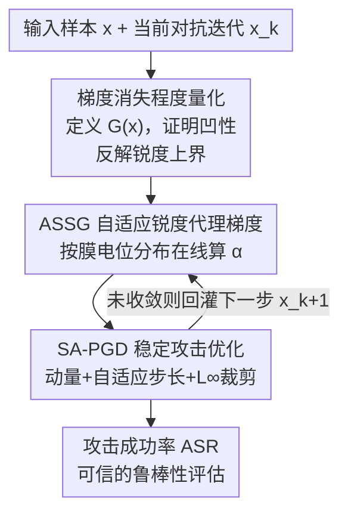

# Towards Reliable Evaluation of Adversarial Robustness for Spiking Neural Networks

**会议**: CVPR 2026  
**论文**: [CVF Open Access](https://openaccess.thecvf.com/content/CVPR2026/html/Wang_Towards_Reliable_Evaluation_of_Adversarial_Robustness_for_Spiking_Neural_Networks_CVPR_2026_paper.html)  
**代码**: https://github.com/craree/ASSG-SNNsRobustness-Evaluation  
**领域**: AI 安全 / 对抗鲁棒性  
**关键词**: 脉冲神经网络, 对抗鲁棒性评估, 代理梯度, 梯度消失, PGD 攻击

## 一句话总结
针对脉冲神经网络（SNN）因脉冲激活的二值、不连续特性导致梯度消失、从而让基于梯度的对抗鲁棒性评估"虚高"的问题，本文从梯度近似和攻击优化两个角度提出 ASSG（自适应锐度代理梯度）+ SA-PGD（稳定自适应 PGD），把攻击成功率（ASR）大幅拉高，揭示当前 SNN 的对抗鲁棒性被严重高估。

## 研究背景与动机

**领域现状**：SNN 用脉冲（0/1）激活模拟大脑的稀疏、事件驱动计算，能效高、有丰富的时序动态，是神经形态、低功耗场景的热门方向。但脉冲激活函数是 Heaviside 阶跃函数 $H(x)$，导数几乎处处为 0，无法直接做反向传播。主流做法是用一个光滑的**代理梯度（surrogate gradient）**函数 $g(x)$ 近似 $\frac{dH}{dx}$（如 arctangent、矩形、高斯等），从而支撑时空反向传播（STBP）。

**现有痛点**：评估一个 SNN 到底有多鲁棒，需要用 PGD 这类基于梯度的攻击去打它——攻击越强、攻得越透，评估才越可信。但代理梯度近似得不准，会扭曲输入梯度，尤其在对抗扰动场景下需要精确的输入梯度时问题更严重。结果是攻击打不动，让人误以为模型很鲁棒。已有改进代理梯度的工作（PDSG、BPTR、RGA、HART 等）要么用 batch 级统计量、无法对单样本自适应，要么推导绑死在某种特定神经元模型上、缺乏理论支撑；而且大多数工作**只盯着梯度近似，忽略了攻击优化算法本身**。

**核心矛盾**：代理函数 $g(x)$ 越"尖锐"（sharp），它的积分越接近真正的阶跃函数 $H(x)$，梯度近似越准；但越尖锐的 $g(x)$ 在 $|x|$ 变大时衰减越快，越容易**梯度消失**。准确性和不消失之间存在直接 trade-off，而且不同输入、不同神经元、不同时间步的最优锐度根本不一样——用一个固定的锐度参数 $\alpha$ 必然顾此失彼。

**本文目标**：(1) 给"梯度消失程度"一个可量化、可控的理论刻画；(2) 让代理梯度的锐度随每个输入、每个时空位置自适应演化；(3) 设计一个即便梯度不精确也能稳定收敛的攻击优化器。

**切入角度**：作者从代理函数的归一化定义出发，发现"梯度消失程度"可以用 $g$ 在 $[-|x|,|x|]$ 上的积分 $G(x)$ 精确度量，并证明 $G(x)$ 是凹函数——凹性意味着可以通过调节锐度参数 $\alpha$ 把期望消失程度卡在一个给定上界以下。

**核心 idea**：用"输入分布自适应的锐度"代替"全局固定锐度"，在每次攻击迭代中按当前神经元的膜电位分布在线调整 $\alpha$，把梯度消失程度精确控制在理论上界附近；再配一个带 $L_\infty$ 逐元素裁剪的稳定攻击优化器，让攻击真正打到位。

## 方法详解

### 整体框架
整篇方法围绕一个目标：让针对 SNN 的对抗攻击"真正打得动"，从而给出可信的鲁棒性评估。它由两块拼成——**梯度怎么算准（ASSG）** 和 **拿到梯度后怎么稳定迭代（SA-PGD）**。先有一套理论把"梯度消失程度" $G(x)$ 量化出来并证明其凹性，由此可以反解出"在给定消失上界下允许的最大锐度"；ASSG 据此在每次攻击迭代里按每个神经元当前膜电位分布在线算出自适应锐度 $\alpha^l_{i,t}$，得到既准又不消失的代理梯度；SA-PGD 拿着这个梯度做带动量、自适应步长且 $L_\infty$ 逐元素裁剪的更新，即使梯度仍不够精确也能稳定收敛。最终用攻击成功率（ASR）来衡量评估的可信度——ASR 越高，说明越逼出了模型的真实脆弱性。

### 关键设计

**1. 梯度消失程度的量化与可控理论：先把"消失多严重"算出来，才能去控它**

现有改进代理梯度的工作都缺一个根本问题的答案：到底"梯度消失"严重到什么程度、能不能定量控制？本文先把代理函数规范化——定义 $g(x)$ 为偶函数、在 $(-\infty,0)$ 上非减、且 $\int_{-\infty}^{\infty} g(x)\,dx = 1$（这个归一化约束是和前人定义的关键区别，它保证 $g$ 的积分恰好逼近 $H(x)$）。在此基础上，把位置 $x$ 处的梯度消失程度定义为代理函数在对称区间上的积分：

$$G(x) = \int_{-|x|}^{|x|} g(t)\,dt$$

$G(x)$ 单调非减、取值落在 $[0,1]$，值越大说明梯度消失越严重（对真正的 $H(x)$，$\forall x>0$ 都有 $G(x)=1$，即处处梯度消失）。本文进一步证明 **Theorem 1：对任意代理函数，$G(x)$ 在 $[0,+\infty)$ 上是凹函数**。凹性是后面一切自适应的钥匙——它使得 **Corollary 1** 成立：把代理函数写成 $\alpha k(\alpha x)$ 的形式（$\alpha$ 控制锐度），若输入 $x$ 服从分布 $p(x)$ 且期望有限，则对任意常数 $A\in[0,1]$，只要

$$\alpha \le \frac{G^{-1}(A)}{\mathbb{E}[x]}$$

就能保证期望梯度消失程度 $\mathbb{E}_{x\sim p(x)}[G(\alpha x)] \le A$。这就把"调锐度"从拍脑袋变成了带可证明上界的优化：给定你能容忍的消失上界 $A$，就能反解出允许的最大 $\alpha$（锐度越大近似越准，所以取到上界最优）。

**2. ASSG：让每个神经元在攻击过程中自适应地"调焦"锐度**

固定 $\alpha$ 的问题在于：不同输入、不同时空位置 $(i,t,l)$ 的膜电位分布完全不同，一个全局锐度顾此失彼。ASSG 据 Corollary 1 把不等式取等号（要最准就取最大允许锐度），对每个时空维度单独算锐度 $\alpha^l_{i,t} = \frac{\omega}{\mathbb{E}[|u^l_{i,t}|]}$，其中 $u^l_{i,t}=V^l_i(t+1)-V_{th}$ 是送进 $H$ 的（膜电位减阈值）量，$\omega=G^{-1}(A)$ 用三元搜索选最优，以拿到攻击下最好的"准确度—消失"权衡。

问题是攻击是一条迭代轨迹 $\{x_1,x_2,\dots\}$，$|u^l_{i,t}|$ 的分布一直在变，没法离线知道其期望。ASSG 用指数滑动平均（EMA）在线估计：维护幅值估计 $M^l_{i,t}$ 和绝对偏差 $D^l_{i,t}$，

$$M^l_{i,t}(x_{1:k}) = \beta_1 M^l_{i,t}(x_{1:k-1}) + (1-\beta_1)\,|u^l_{i,t}(x_k)|$$

$$\alpha^l_{i,t}(x_{1:k}) = \frac{\omega}{M^l_{i,t}(x_{1:k}) + \gamma D^l_{i,t}(x_{1:k})}$$

偏差项 $D^l_{i,t}$ 是个稳定器：当 $|u^l_{i,t}|$ 分布波动很大时，分母变大、$\alpha$ 略微调小，防止锐度过尖把梯度直接打消失，保证消失程度始终落在理论上界附近。直观上，当膜电位分布靠近 0（更难近似）时 ASSG 反而给出更大的 $\alpha$、更尖的代理梯度；可视化显示 $\alpha^l_{i,t}$ 在不同输入间几乎不相关（低 Pearson 相关），呈现强烈的输入相关与时空异质性，最终形成尖锐与平滑代理梯度共存的长尾分布。关键是 ASSG 只依赖 $H$ 的输入分布、**不依赖具体神经元动力学**，所以能泛化到 LIF / IF / PSN 等各种神经元，这是 HART 等绑死特定神经元的方法做不到的。

**3. SA-PGD：即使梯度不精确也能稳定收敛的攻击优化器**

作者发现就算用了 ASSG，传统的 PGD / APGD 在攻击鲁棒 SNN 时几百次迭代后仍然收不敛——说明 SNN 的输入空间高度非光滑、梯度残留不准，光改梯度近似不够，攻击优化算法也得专门设计。SA-PGD 把动量和自适应步长引入攻击，同时显式纳入 $L_\infty$ 约束。每步先算 $L_1$ 归一化的一阶动量 $m_k$ 和二阶振荡量 $v_k$（类似 Adam），再算自适应步长更新，**关键是对更新量逐元素裁剪**：

$$t_k = \mathrm{clip}\!\left(\frac{m_k}{\sqrt{v_k}+\xi}\cdot \eta_k,\ -\eta_k,\ \eta_k\right),\qquad x_{k+1} = \Pi^\infty_\varepsilon(x_k + t_k)$$

裁剪算子把每一维更新限制在 $[-\eta_k,\eta_k]$，确保没有任何单一维度主导对抗更新，从而在 $L_\infty$ 球内保持稳定有界的优化；$\Pi^\infty_\varepsilon$ 把更新投影回 $\varepsilon$ 半径的可行域。消融对比里，去掉这步裁剪的 Adam-PGD 在低迭代时收敛更快、但迭代一多 ASR 反而掉到 APGD 以下——因为缺了逐元素裁剪，更新会偏离约束区域、后期失稳；SA-PGD 因为显式带约束，在所有迭代数下都拿到最高 ASR。

### 损失函数 / 训练策略
本文是**评估方法**而非新的训练方法：鲁棒 SNN 用 AT / RAT / AT+SR / TRADES 四种对抗训练方案得到（训练时用 PGD 5 步、$\varepsilon=8/255$）；ASSG 默认用 arctangent 代理函数、$\omega$ 用三元搜索选取；攻击默认 APGD 框架 100 次迭代、$\varepsilon=8/255$。Poisson 编码这类随机输入用 EOT 估计梯度（迭代设 50），且在 EOT 内冻结 ASSG 的锐度更新以降低估计偏差。

## 实验关键数据

数据集：CIFAR-10、CIFAR-100（静态）+ CIFAR10-DVS（动态）。网络：CIFAR-10/100 用 SEWResNet19（时间步 4），CIFAR10-DVS 用 VGG9（时间步 8）。指标为攻击成功率 ASR——**ASR 越高表示鲁棒性评估越可信**（越逼出真实脆弱性）。

### 主实验：与 SOTA 梯度近似方法对比（ASR ↑）
ASSG 在各数据集、各训练方案下全面领先，CIFAR-10 / CIFAR10-DVS 上多处领先第二名近 10 个百分点；配 SA-PGD 后再涨。

| 数据集 / 训练 | 攻击 | STBP | PDSG | HART | ASSG（本文） |
|--------------|------|------|------|------|--------------|
| CIFAR-10 / AT | APGD | 75.38 | 69.31 | 77.22 | **84.06** |
| CIFAR-10 / AT | SA-PGD | 75.11 | 68.76 | 79.49 | **88.44** |
| CIFAR-10 / AT+SR | SA-PGD | 60.37 | 55.43 | 67.71 | **77.00** |
| CIFAR-10 / TRADES | SA-PGD | 66.24 | 58.33 | 72.47 | **79.56** |
| CIFAR10-DVS / AT | SA-PGD | 35.40 | 33.10 | 34.80 | **49.10** |

> 一个反直觉发现：在本文更严格的配置（100 次迭代）下，RGA / PDSG 的 ASR 甚至低于最朴素的 STBP，与它们原论文的结论相反——作者指出前人只用 10 次迭代的 PGD 比较 ASR，那种"高 ASR"可能只是早期 loss 上升快的假象。

### 消融一：代理梯度形式（CIFAR-10/-100，AT，ASR ↑）
把 ASSG 套到 5 种代理函数上，全部明显高于各自的固定 $\alpha$ 基线，说明"输入相关、时空异质的自适应锐度"才是涨点关键，且对统一形式的代理函数都泛化。

| 配置 | Atan | Rect | Tri | Sig | Gauss |
|------|------|------|-----|-----|-------|
| CIFAR-10 固定 α | 84.04 | 77.90 | 81.07 | 81.89 | 81.29 |
| CIFAR-10 ASSG | **88.44** | **86.82** | **89.53** | **89.30** | **89.46** |
| CIFAR-100 固定 α | 91.40 | 90.02 | 91.08 | 91.22 | 91.16 |
| CIFAR-100 ASSG | **93.19** | **92.31** | **93.41** | **93.35** | **93.42** |

### 消融二：攻击优化器（用 ASSG 作代理梯度，随迭代数变化）
1000 次迭代后所有方法 ASR 仍在微涨，证明 ASSG 更新动态稳定、不退化。Adam-PGD 早期快、后期掉到 APGD 之下（缺 $L_\infty$ 逐元素裁剪导致后期失稳）；SA-PGD 在所有迭代数下都最高。PGD、MI-FGSM 明显更弱。

### 跨配置泛化（Tab. 3，不同神经元 / 时间步 / 编码）
ASSG 只依赖 $H$ 的输入分布、不依赖神经元动力学，泛化性突出：在 **PSN 神经元上 ASR 超过 98%**，而 HART 在 PSN 上骤降（如 CIFAR-10 PSN 仅 43–45），暴露了"绑死特定神经元动力学"的方法的局限；唯一略逊于 HART 的场景是 Poisson 编码。

### 关键发现
- **ASSG 的自适应锐度是涨点主力**：固定 α → ASSG 在所有代理函数上都涨 3–8 个点，证明价值不在某个具体代理函数，而在"按输入分布在线调焦"这件事本身。
- **梯度近似和攻击优化相互制约**：SA-PGD 只有配高质量梯度（ASSG）才显著增益，配 BPTR/RGA/PDSG/STBP 这类劣质梯度几乎没用——说明两块必须协同，单独改一块到顶。
- **现有 SNN 鲁棒性被严重高估**：在 PSN 上没有 ASSG 时模型表现出"假鲁棒"；前人用 10 次迭代评估得到的高鲁棒结论靠不住，严格评估需要远多于 5–10 步的迭代。

## 亮点与洞察
- **把"梯度消失"从定性吐槽变成可证明可控的量**：用 $G(x)=\int_{-|x|}^{|x|}g$ 量化消失程度，再用凹性（Theorem 1）反解出"给定消失上界下的最大锐度"（Corollary 1）——理论直接落地成在线算法，这是和一堆"经验改代理梯度"工作的本质区别。
- **自适应粒度细到每个神经元、每个时间步、每次迭代**：$\alpha^l_{i,t}$ 用 EMA 在线追膜电位分布，偏差项 $D$ 当稳定器防过尖，思路可迁移到任何需要"在线调函数形状"的近似场景。
- **解耦于神经元动力学是泛化王炸**：只看 $H$ 的输入分布、不碰神经元方程，所以能无痛迁移到 IF / PSN 等异构神经元，PSN 上 98%+ ASR 把绑死动力学的 HART 甩开一大截。
- **指出"评估范式本身有坑"**：迭代数太少会制造假鲁棒，这对整个 SNN 鲁棒性研究的评估协议是一记警钟。

## 局限与展望
- **本文是更强的"攻击/评估"工具，不是更鲁棒的训练方法**：它揭示了现有 SNN 鲁棒性虚高，但怎么训出真鲁棒的 SNN 仍是开放问题（作者也呼吁重新思考如何高效生成可靠对抗样本用于训练）。
- **Poisson 随机编码下略逊于 HART**：随机输入需要 EOT 且要冻结锐度更新，自适应优势被削弱，说明 ASSG 对确定性编码更友好。
- **计算开销**：维护每神经元每时空位置的 EMA 统计量、$\omega$ 的三元搜索都有额外代价（细节在附录），大规模网络上的开销值得关注。
- **评测范围**：实验集中在 CIFAR 系列 + SEWResNet19/VGG9，更大数据集（如 ImageNet 级）和更深网络上的结论尚待验证。

## 相关工作与启发
- **vs PDSG**：PDSG 把膜电位分布的方差并入代理计算，但用的是 batch 级统计量、无法对单样本自适应，也缺理论依据；本文按单样本、单时空位置在线自适应，且有凹性 + 上界的理论支撑。
- **vs BPTR / RGA**：它们通过对平均发放率求导来估计输入梯度；本文实验显示在严格 100 次迭代下二者 ASR 甚至不如朴素 STBP，且都无法用于无固定阈值/重置的 PSN 神经元。
- **vs HART**：HART 联合考虑率和时间信息，但推导绑死特定神经元模型、缺泛化的理论验证，在 PSN 上崩盘；ASSG 解耦于神经元动力学，泛化性更强。
- **vs APGD / Adam-PGD（攻击优化）**：APGD 是通用强攻击但在非光滑 SNN 输入空间收不敛；Adam-PGD 缺 $L_\infty$ 逐元素裁剪后期失稳；SA-PGD 显式带约束裁剪，全迭代区间最稳最高。

## 评分
- 新颖性: ⭐⭐⭐⭐⭐ 把代理梯度消失量化成可证明可控的理论，并据此设计输入自适应锐度 + 专用攻击优化器，双管齐下且解耦神经元动力学，角度新。
- 实验充分度: ⭐⭐⭐⭐ 覆盖 3 数据集、4 训练方案、5 种代理函数、多神经元/时间步/编码，对比充分；但停留在 CIFAR 级，缺更大规模验证。
- 写作质量: ⭐⭐⭐⭐ 理论—方法—实验逻辑清晰，公式与可视化到位；符号密集，对不熟悉 SNN/代理梯度的读者门槛偏高。
- 价值: ⭐⭐⭐⭐⭐ 揭示当前 SNN 鲁棒性被系统性高估、评估协议有坑，对整个领域的评估范式有直接纠偏价值，且开源代码。

<!-- RELATED:START -->

## 相关论文

- [\[ICLR 2026\] Robust Spiking Neural Networks Against Adversarial Attacks](../../ICLR2026/ai_safety/robust_spiking_neural_networks_against_adversarial_attacks.md)
- [\[AAAI 2026\] MPD-SGR: Robust Spiking Neural Networks with Membrane Potential Distribution-Driven Surrogate Gradient Regularization](../../AAAI2026/ai_safety/mpd-sgr_robust_spiking_neural_networks_with_membrane_potential_distribution-driv.md)
- [\[ICML 2026\] Frequency Matching in Spiking Neural Networks for mmWave Sensing](../../ICML2026/ai_safety/frequency_matching_in_spiking_neural_networks_for_mmwave_sensing.md)
- [\[CVPR 2026\] Verifying Neural Network Robustness with Dual Perturbations](verifying_neural_network_robustness_with_dual_perturbations.md)
- [\[ICLR 2026\] Time Is All It Takes: Spike-Retiming Attacks on Event-Driven Spiking Neural Networks](../../ICLR2026/ai_safety/time_is_all_it_takes_spike-retiming_attacks_on_event-driven_spiking_neural_netwo.md)

<!-- RELATED:END -->
