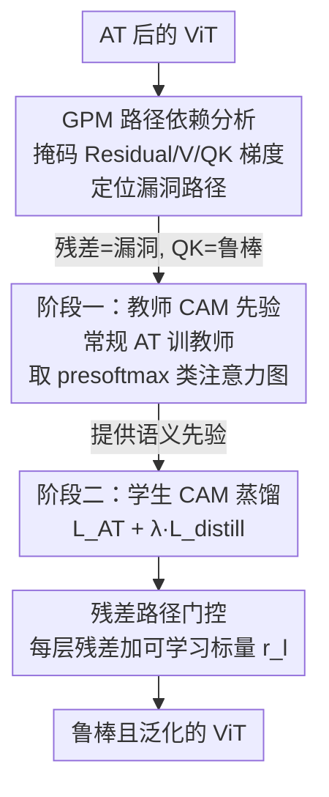

# Towards Robust Vision Transformers: Path Dependency Analysis and a Simple Two-Stage Adversarial Training

**会议**: CVPR 2026  
**论文**: [CVF Open Access](https://openaccess.thecvf.com/content/CVPR2026/html/Kim_Towards_Robust_Vision_Transformers_Path_Dependency_Analysis_and_a_Simple_CVPR_2026_paper.html)  
**领域**: AI 安全 / 对抗鲁棒  
**关键词**: 对抗训练, Vision Transformer, 梯度路径, 类注意力蒸馏, 残差门控

## 一句话总结
这篇论文先用一套「梯度路径掩码」诊断工具拆开 ViT 注意力的内部信息流，发现残差路径才是对抗攻击的主要漏洞、QK 路径反而承载鲁棒性，再据此设计一个简单的两阶段对抗训练（教师 ViT 提供类注意力图先验 + 学生蒸馏 + 残差门控），在五种 ViT 变体和三种 AT 框架上同时提升了干净精度与鲁棒性。

## 研究背景与动机
**领域现状**：对抗训练（Adversarial Training, AT）是提升模型对抗鲁棒性的最根本手段，被表述为一个 min–max 优化——内层最大化生成对抗样本、外层最小化更新参数。但 RobustBench 统计显示只有约 13% 的鲁棒性研究针对 ViT，绝大多数工作和工具仍是围绕 CNN 设计的，存在明显的「架构偏见」。

**现有痛点**：把 CNN 上验证过的对抗训练直接搬到 ViT 上并不奏效。已有少数研究虽然注意到 ViT 与 AT 存在「负相互作用」，但分析都局限在个别组件或极简设定下，缺少能系统刻画「ViT 内部到底哪条信息通路在帮攻击者、哪条在帮鲁棒性」的专用分析工具。结果是：让 ViT 变鲁棒的关键因素始终说不清，制约了它在自动驾驶、医学影像这类安全攸关场景的落地。

**核心矛盾**：ViT 与 CNN 在信息流组织上根本不同——CNN 的卷积把局部信息混在一起，而 ViT 的注意力模块**显式地**把信息分成 QK（决定注意力权重）、V（被加权的值）、Residual（残差直连）三条通路。CNN 的鲁棒性直觉（如「早层强局部建模很关键」）不一定成立，但没人验证过。

**本文目标**：把「对抗训练后的 ViT」从三个互补视角解剖清楚——路径依赖（哪条梯度通路是漏洞）、语义先验（鲁棒信息以什么形式存储）、patch 关联（早层学的是局部还是全局），再把三条洞察统一成一个能直接用的训练方案。

**切入角度**：梯度指明了越过决策边界的最直接方向，所以「攻击者依赖哪条路径的梯度」就等于「哪条路径是漏洞」。只要在反向传播时把某条通路的梯度屏蔽掉，看攻击成功率怎么变，就能定位漏洞通路。

**核心 idea**：用「梯度路径掩码」定位出残差路径是鲁棒性瓶颈、QK 路径承载鲁棒性（且以类注意力图的语义先验形式存在），然后用「教师 CAM 蒸馏 + 残差门控」这个简单的两阶段 AT 把鲁棒信息显式地灌进学生模型、并主动压低对残差路径的依赖。

## 方法详解

### 整体框架
全文其实是「先诊断、后开药」两段：前半（Sec. 3.1–3.3）是三项分析，得到三条结论；后半（Sec. 3.4）把结论落成一个两阶段训练方案。诊断阶段的核心工具是 **GPM（Gradient Path Masking）**——把 ViT 一个 block 的反向梯度按 Residual / V / QK 三条路解析地拆开，逐条在反传时置零，用攻击成功率（ASR）的变化判断每条路对攻击者的价值。诊断得到三条结论：① 残差路径是漏洞、QK 路径藏鲁棒性；② 鲁棒信息表现为类注意力图（CAM）里清晰的物体语义（AT 后的 ViT 甚至能直接做语义分割）；③ AT 后的 ViT 在早层更依赖全局而非局部关系，因此往早层注入 CNN 局部归纳偏置的混合架构反而不适配 AT。

治疗阶段据此设计两阶段 AT：第一阶段用常规 AT 训一个**教师 ViT**，把它的 presoftmax 类注意力图当作「语义先验」；第二阶段训**学生 ViT**，在常规 AT 损失上加一项让学生 CAM 逼近教师 CAM 的蒸馏损失，同时给每层残差连接加一个可学习标量门控 $r_l$，主动把对残差路径的依赖压下去。

### 关键设计

**1. 梯度路径掩码 GPM：把注意力梯度拆成三条路，逐路体检鲁棒性**

痛点是没人能说清 ViT 内部哪条通路在帮攻击者。GPM 的做法是对 ViT block 的反向梯度做解析拆分。一个 block 的前向写成 $X_l = f^{(l)}(X'_l)$、$X'_l = S_l V_l + X_{l-1}$，其中 $S_l = \mathrm{softmax}(Q_l K_l^\top / \sqrt{d})$ 是注意力权重、$f^{(l)}$ 是 FFN 加残差。对 $X_{l-1}$ 求梯度时，$\partial X'_l / \partial X_{l-1}$ 可解析地拆成三项：

$$\frac{\partial X'_l}{\partial X_{l-1}} = \underbrace{1}_{\text{Residual}} + \underbrace{S_l \frac{\partial V_l}{\partial X_{l-1}}}_{\text{V}} + \underbrace{V_l \frac{\partial S_l}{\partial X_{l-1}}}_{\text{QK}}.$$

GPM 在每一项前乘上一个开关 $\delta_R, \delta_V, \delta_{QK} \in \{0,1\}$，反传时把某条路置零，就相当于「攻击者拿不到这条路的梯度」。注意 GPM **只动反向传播、不动前向**，所以测的是「攻击者依赖哪条路」而非改变模型本身。它和此前的 ARD（在注意力模块里随机丢梯度）不同——GPM 是按物理通路精确掩码，因此结论可解释。实测（Tab. 1）非常反直觉：屏蔽 QK 路径，攻击成功率几乎不掉（仍 >92%，最高 95%）；屏蔽残差路径，成功率从约 48% 骤降到约 22%。这说明攻击者高度依赖残差路径的梯度，鲁棒相关成分则集中在 QK 路径——于是「提升鲁棒性 = 降低对残差路径的依赖」这条治疗思路就立住了。

**2. 两阶段 CAM 蒸馏：把 QK 路径里的语义先验显式灌进学生**

GPM 告诉我们鲁棒信息在 QK 路径，进一步分析（Sec. 3.2）发现它具体表现为**类注意力图（CAM）**里对物体语义部件的清晰聚焦——AT 后的 ViT 的 CAM 比标准训练锐利得多，甚至能直接在 Pascal VOC 上做出最好的无监督分割。痛点在于，CNN 那套「蒸馏教师输出 logits」的鲁棒蒸馏搬到 ViT 上会失败（见实验）。本文于是改成蒸馏 CAM：第一阶段用常规 AT 训教师 $f_{\theta_T}$，取它每层每头的类注意力特征 $\mathcal{A}_{\mathrm{cls}}^{(l,h)} = Q_{\mathrm{cls}}^{(l,h)} (K^{(l,h)})^\top / \sqrt{d_h}$；第二阶段让学生在对抗样本 $x'$ 上的 CAM 去逐层逐头逼近教师在干净样本 $x$ 上的 CAM：

$$\mathcal{L}_{\text{distill}} = \frac{1}{HL} \sum_{l=1}^{L} \sum_{h=1}^{H} \left\| \mathcal{A}_{\mathrm{cls}}^{(l,h)}(\theta_T, x) - \mathcal{A}_{\mathrm{cls}}^{(l,h)}(\theta_S, x') \right\|_2.$$

一个关键细节是蒸馏发生在 **softmax 之前**：因为 ViT 在 softmax 附近梯度容易消失，用 presoftmax 的注意力特征蒸馏才能让梯度有效回传。第二阶段总损失为 $\mathcal{L}_{total} = \mathcal{L}_{AT} + \lambda \mathcal{L}_{distill}$（实验取 $\lambda=1$）。这样做有效，是因为它把「教师在 QK 路径里学到的语义先验」直接当监督信号，绕开了对最终 logits 匹配的依赖——而后者正是 CNN 式蒸馏在 ViT 上失灵的原因。

**3. 残差路径门控：用一个可学习标量主动压低残差依赖**

GPM 的结论是残差路径是漏洞，但作者不想用复杂模块去改造它（那会增加计算）。最简单的办法是给每层残差连接加一个可学习标量 $r_l$：

$$X'_l = S_l V_l + r_l X_{l-1}.$$

训练时让模型自己学这个门控值。实验观察到 $r_l$ 各层平均值**一致小于 1**，正好印证「该减少对残差路径的依赖」；而把同样的门控放到 QK 或 V 路径上时，学出来的平均值反而 >1（1.25 左右），说明鲁棒 ViT 倾向于增大对 QK/V 的依赖、减小对残差的依赖。门控值还随层深逐渐增大，作者解释为深层里语义先验已经成形，残差连接传递这些精炼先验反而有益。这个设计几乎零成本，却和前面的诊断结论闭环对上了。

### 损失函数 / 训练策略
两阶段共训 80 个 epoch（教师 40 + 学生 40），$\lambda=1$，扰动 $\epsilon=8/255$、步长 $2/255$、10 步攻击；SGD（momentum 0.9）、weight decay 1e-4、梯度裁剪、CutMix + MixUp 增广，全部从 ImageNet 预训练权重初始化。算法上前半 epoch 训教师 $\theta_T$，后半 epoch 用 $\mathcal{L}_{total}$ 训学生 $\theta_S$（含门控参数 $r_1,\dots,r_L$）。

## 实验关键数据

### GPM 路径分析（诊断核心证据）

| 模型 | 掩码路径 | ASR(%) | Maintenance(%) |
|------|----------|--------|----------------|
| ViT | 无（=PGD-20） | 48.14 | 100.00 |
| ViT | QK | 44.59 | 92.63 |
| ViT | V | 32.94 | 68.42 |
| ViT | Residual | 21.83 | 45.35 |
| ConViT | Residual | 23.42 | 41.51 |
| CvT | Residual | 24.61 | 46.95 |

掩掉残差梯度后攻击成功率几乎腰斩，掩掉 QK 几乎不变——三种架构一致，强力支撑「残差=漏洞、QK=鲁棒」。

### 主实验：跨架构 / 跨 AT 框架（CIFAR-10 & ImageNette）

| 模型 | 方法 | CIFAR-10 Clean | CIFAR-10 AA | ImageNette Clean | ImageNette AA |
|------|------|----------------|-------------|------------------|---------------|
| ViT | PGD-AT | 79.59 | 46.37 | 90.20 | 62.40 |
| ViT | +Ours | 82.01 | 47.41 | 89.40 | 63.20 |
| ConViT | PGD-AT | 69.83 | 39.23 | 69.00 | 39.00 |
| ConViT | +Ours | 77.21 | 43.93 | 84.20 | 56.20 |
| CvT | TRADES | 77.23 | 44.20 | 82.60 | 54.40 |
| CvT | +Ours | 79.41 | 46.23 | 83.70 | 55.60 |
| DeiT | PGD-AT | 81.17 | 47.35 | 91.60 | 65.20 |
| DeiT | +Ours | 82.65 | 48.59 | 91.40 | 65.40 |

混合架构（ConViT/CeiT/CvT）受益最大：CIFAR-10 上干净精度平均 +3.52%、AA +2.44%；ImageNette 上 +4.35% / +6.0%，ConViT(PGD-AT) 鲁棒性最高暴涨 +17.2%。非混合架构（ViT/DeiT）也稳定小幅提升（+1.08% / +1.06%）。

### 消融实验

| 配置 | Clean | CW-20 | PGD-20 | AA |
|------|-------|-------|--------|----|
| PGD-AT | 79.59 | 48.22 | 50.86 | 46.37 |
| + L_distill | 81.39 | 48.99 | 51.39 | 47.01 |
| + 残差门控 | 82.01 | 49.34 | 51.59 | 47.41 |

CAM 蒸馏贡献主体（+1.8% Clean / +0.7% AA），残差门控再补一刀（+0.6% / +0.4%），两者叠加最佳。

### vs CNN 式鲁棒蒸馏（ViT-S, CIFAR-10）

| 方法 | Clean | PGD-20 | AA |
|------|-------|--------|----|
| PGD-AT（教师） | 79.59 | 50.86 | 46.37 |
| RSLAD | 73.38 | 6.75 | 4.97 |
| ARD | 65.93 | 36.56 | 32.37 |
| AdaAD | 20.71 | 12.94 | 10.31 |
| Ours | 82.01 | 51.59 | 47.41 |

### 关键发现
- **残差门控贡献小但方向对**：门控值一致 <1，且 QK/V 上做门控会学到 >1，从优化结果反向印证了 GPM 的路径依赖结论，三处证据闭环。
- **CNN 式鲁棒蒸馏在 ViT 上集体崩盘**：RSLAD 鲁棒性掉到个位数、AdaAD 干净精度只有 20%，说明匹配 logits / 用教师生成更强对抗样本的思路在 ViT 上不可迁移，而蒸馏 CAM 才管用——侧证「鲁棒信息在 QK 的注意力结构里、不在最终 logits」。
- **混合架构最吃亏也最受益**：注入 CNN 局部归纳偏置的混合 ViT 在 AT 下本就显著落后（CeiT vs DeiT 在 TRADES 下 AA 差约 16%），但本文方法把语义先验灌进去后提升幅度也最大，呼应「早层应学全局而非局部」的分析。

## 亮点与洞察
- **GPM 是个可解释的诊断利器**：把 ViT 的反向梯度按 Residual/V/QK 解析拆开、逐路置零看 ASR，这套方法本身就能复用到任何想分析「哪条通路是漏洞」的 Transformer 鲁棒性研究，价值不只在本文的方案。
- **「鲁棒 = AT 让 ViT 长出语义分割能力」这个观察很惊艳**：AT 后的 ViT 仅靠类别监督，CAM 就自发聚焦物体语义部件，无监督分割（Pascal VOC Jaccard 57.7%）甚至超过 DINO/CLIPpy 等专门方法，提示 AT 可作为 dense prediction 的语义先验来源。
- **诊断与治疗严丝合缝**：三条分析结论分别对应三个设计（GPM→定位、CAM 蒸馏→灌语义、残差门控→压依赖），而且门控学出来的值反过来验证了诊断，整篇逻辑自洽，迁移性强。

## 局限与展望
- **数据集偏小**：实验集中在 CIFAR-10 和 ImageNette（10 类），没有在 ImageNet-1K 全量上验证鲁棒精度，规模化结论存疑。
- **绝对提升幅度有限**：非混合架构（ViT/DeiT）上 AA 提升只有约 1%，门控的单独贡献也仅 +0.4% AA，更多价值体现在「免费、即插即用、不损泛化」而非鲁棒性大跨步。
- **两阶段翻倍训练成本**：教师 40 + 学生 40 共 80 epoch，比单阶段 AT 贵一倍，论文未讨论能否用单教师摊销或更短训练。
- **作者也指出**：残差路径除了「压低依赖」还能否被主动加强、语义先验能否用于更广的下游 dense prediction，都还是开放方向。

## 相关工作与启发
- **vs ARD（Adversarial Random Dropout）[23]**: ARD 在注意力模块里随机丢梯度，本文 GPM 则按 Residual/V/QK 物理通路精确掩码——前者只能扰动、后者能定位漏洞，可解释性是关键区别。
- **vs CNN 式鲁棒蒸馏（ARD/RSLAD/AdaAD）**: 它们蒸馏教师 logits 或用教师造更强对抗样本，本文蒸馏的是 presoftmax 类注意力图。实验显示前者在 ViT 上全面失效，说明「该蒸什么」要随架构换——ViT 的鲁棒信息在注意力结构而非输出分布里。
- **vs 混合 ViT–CNN 架构（ConViT/CeiT/CvT）**: 这类架构往早层注入 CNN 局部归纳偏置以提升标准精度，但本文 patch 关联分析表明 AT 下 ViT 早层反而偏好全局关系，因此这些局部偏置与对抗目标冲突；本文用语义先验缓和了这种不兼容，对「混合架构是否适配 AT」给出了否定性证据与补救方案。

## 评分
- 新颖性: ⭐⭐⭐⭐⭐ GPM 路径诊断 + CAM 蒸馏的视角组合在 ViT 鲁棒性里很新，三条分析互相印证。
- 实验充分度: ⭐⭐⭐⭐ 覆盖 5 架构 × 3 AT 框架且消融充分，但只在小数据集上验证、缺 ImageNet-1K 鲁棒结果。
- 写作质量: ⭐⭐⭐⭐⭐ 「先诊断后治疗」叙事清晰，公式推导完整，分析与方案闭环。
- 价值: ⭐⭐⭐⭐ 即插即用、兼容主流 AT，且 GPM 工具与「AT→语义先验」洞察对后续研究有启发，绝对提升幅度偏小。

<!-- RELATED:START -->

## 相关论文

- [\[CVPR 2026\] ReMoE: Region-Mixture Experts for Adversarially-Robust Vision Transformers](remoe_region-mixture_experts_for_adversarially-robust_vision_transformers.md)
- [\[CVPR 2026\] DeepfakeImpact: A Two-Stage Benchmark with Real-World Impact in Deepfake Detection](deepfakeimpact_a_two-stage_benchmark_with_real-world_impact_in_deepfake_detectio.md)
- [\[CVPR 2026\] Transform to Transfer: Boosting Adversarial Attack Transferability on Vision-Language Pre-training Models](transform_to_transfer_boosting_adversarial_attack_transferability_on_vision-lang.md)
- [\[CVPR 2026\] TTP: Test-Time Padding for Adversarial Detection and Robust Adaptation on Vision-Language Models](ttp_test-time_padding_for_adversarial_detection_and_robust_adaptation_on_vision-.md)
- [\[CVPR 2026\] Taming the Long Tail: Rebalancing Adversarial Training via Adaptive Perturbation](taming_the_long_tail_rebalancing_adversarial_training_via_adaptive_perturbation.md)

<!-- RELATED:END -->
