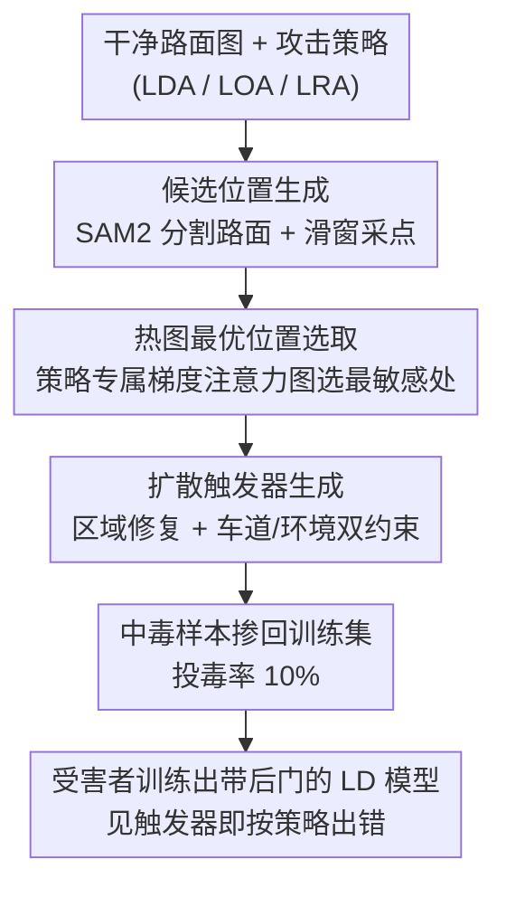

# Towards Stealthy and Effective Backdoor Attacks on Lane Detection: A Naturalistic Data Poisoning Approach

**会议**: CVPR 2026  
**论文**: [CVF Open Access](https://openaccess.thecvf.com/content/CVPR2026/html/Liao_Towards_Stealthy_and_Effective_Backdoor_Attacks_on_Lane_Detection_A_CVPR_2026_paper.html)  
**代码**: 无（仅提供数据与 demo：https://sites.google.com/view/dbald）  
**领域**: AI 安全 / 自动驾驶感知  
**关键词**: 后门攻击, 车道检测, 数据投毒, 扩散修复, 触发器隐蔽性

## 一句话总结
DBALD 用「梯度注意力热图选最敏感位置 + 区域扩散修复合成自然触发器」把车道检测后门攻击的触发器从扎眼的白块/泥纹噪声，做成一个看起来就该在路上的锥桶或泥点，在 4 个车道检测模型上把平均攻击成功率提升 +10.87%、同时把取证检测率压到 3% 以下。

## 研究背景与动机
**领域现状**：车道检测（Lane Detection, LD）是自动驾驶感知栈里直接喂给路径规划和车辆控制的关键一环，一旦检测错误就可能导致压线、偏出车道甚至碰撞。近年研究已经证明 LD 模型对**后门攻击**——尤其是数据投毒型后门——非常脆弱：攻击者只要在训练集里污染一小部分（如 10%）样本、嵌入特定触发器，模型在干净输入上表现正常，但一旦推理时出现触发器就会被操纵给出错误的车道预测。

**现有痛点**：已有的 LD 后门方法实用性差，根子在两点。其一是**触发器位置选得不好**——现有方法用随机或固定位置（如图像右下角贴白块），完全无视触发器位置对攻击成败的影响，结果触发器经常落在语义无关、低注意力的区域，训练时模型记不住它，推理时自然激活率低。其二是**隐蔽性差**——BadNets 这类直接在固定位置叠白块、Blended 这类直接把预设图案半透明叠加上去的做法，既被人眼一眼看穿，又在频域留下可辨认的伪影，被 DIRE/LGrad/UniDetection 这类取证检测器轻松抓出；BadLane 虽然用了「泥纹噪声」更自然些，但 UniDetection 仍能检出近 60%。

**核心矛盾**：攻击的**有效性**（触发器要落在模型最敏感、最容易被记住的位置）和**隐蔽性**（触发器既要骗过人眼又要骗过频域取证器）这两个目标，过去是分开、甚至对立地处理的——往敏感位置硬贴一个图案，往往就是最扎眼的图案。

**本文目标**：同时优化触发器的「放哪里」和「长什么样」，造出一个**既落在高敏感区、又自然得像真实路面物体**的物理触发器（锥桶、泥点）。

**切入角度**：先前在图像分类后门里有结论——把触发器嵌到高注意力区域能让模型在训练时更牢地记住它。但分类里的 Grad-CAM 只服务于单一分类任务，而 LD 是「车道存在性 + 车道坐标回归」的混合任务，注意力的定义要重做；同时扩散修复（inpainting）正好能把一个物体「画进」指定区域并与周围融为一体。

**核心 idea**：用**任务专属的梯度注意力热图**找到对当前攻击策略最敏感的位置，再用**带双语义约束的区域扩散修复**在那个位置合成一个自然、贴合场景的触发器——把「选位置」和「造外观」拧成一条流水线，让有效性和隐蔽性同时拉满。

## 方法详解

### 整体框架
DBALD 是一条三阶段的数据投毒流水线：给定一张干净路面图和一种攻击策略（车道消失 LDA / 车道偏移 LOA / 车道旋转 LRA），先**圈出候选位置**（SAM2 分割路面 + 滑窗采点），再**用梯度热图从候选里挑出最敏感的那个位置**，最后**在该位置用区域扩散修复画出一个自然触发器**，把生成的中毒样本掺回训练集（投毒率 10%）。受害者用这份被污染的数据训练出的 LD 模型，干净输入下行为正常，一旦推理时画面里出现这个锥桶/泥点，就会按攻击者预设的方式（车道消失/偏移/旋转）出错。

DBALD 支持三种攻击语义，每种由各自的策略专属热图引导：LDA 让所有车道「消失」（预测存在性全置 0），LOA 让所有车道点整体水平平移固定像素 $\beta$（论文设 60 px），LRA 让车道曲线绕某起点旋转角度 $\alpha$（论文设 9°）。

### 关键设计

**1. 任务专属梯度注意力热图：为「混合任务」的车道检测量身定做敏感度图**

这一步针对的痛点是「触发器位置选不好导致攻击弱」。直接搬分类里的 Grad-CAM 不行——LD 既要判车道在不在、又要回归车道点坐标，是混合任务，注意力得跟着「当前要攻击哪个子任务」走。作者用一张拿和受害者同架构的预训练 LD 网络算出的**梯度幅值图**来定义敏感度：

$$M_{grad}(i,j) = \sum_{k=1}^{CH} \left| \frac{\partial L}{\partial x_{i,j,k}} \right|$$

即在空间位置 $(i,j)$ 把任务损失 $L$ 对输入像素的梯度，沿所有通道取绝对值后求和——梯度越大说明该位置对损失越敏感，把触发器埋在这里模型训练时记得最牢。关键在于 $L$ 是**策略专属**的：攻 LDA 就用车道**存在性分类损失**的梯度（去压低存在性置信度），攻 LOA/LRA 就用**坐标回归损失**的梯度（去扭曲几何）。而且不同 LD 模型损失类型不同也要分别处理——锚框法（LaneATT、ADNet）的存在性用 focal loss、坐标用 L1/GLIoU，分割法（SCNN、RESA）用交叉熵 + 二值交叉熵。有了热图，再在 SAM2 分出的**路面区域**内用滑窗找梯度响应最大的矩形块，得到约 100∼400 个候选，最后挑注意力值最高的那个当最优位置。消融显示这套热图引导比随机放置在 LaneATT 上 +3.21%、RESA 上 +6.77% ASR。

**2. 区域扩散修复 + 交替掩码更新：只改触发器那一小块，画出物理上自然的触发器**

这一步针对「触发器太扎眼、被人眼和取证器识破」。作者借鉴 UltraEdit 的区域编辑扩散，先把目标触发器位置（40×40 掩码）抠掉做成 masked image、把周边环境抽出来当「环境真值」，再喂进一个掩码引导的扩散模型，靠文本提示（如「加一小撮稀疏的棕色泥点」「加一个小交通锥」）把触发器**修复**进去。核心机制是**奇偶步交替的潜变量更新**：

$$z_{t-1} = \begin{cases} (1-M)\odot z_T + M\odot D_M(z_t), & t \bmod 2 = 0 \\ D_M(z_t), & \text{否则} \end{cases}$$

其中 $M$ 是标记触发器区域的二值掩码，$D_M(z_t)$ 是只在掩码区去噪。偶数步时把掩码外的潜变量强行拉回初始 $z_T$，等于「冻住」掩码外的画面只让掩码内变化；奇数步则全图标准扩散让边界自然过渡。这样反复交替，既精确地只在指定位置造触发器，又把对图像其余部分的扰动压到最小——而「只改一小块、保留绝大部分原图」正是后来 DIRE 这类扩散取证器对它失效的原因。

**3. 车道一致性损失 + 环境一致性损失：把扩散爱乱改的车道线和路边物体钉住**

即使是区域扩散，注意力机制仍会顺手把掩码边界附近的车道线、车辆等关键元素改坏（论文图 4：变形的车道标线、缺角的车辆）。这一步就是堵这个漏。作者在扩散过程里加两项约束：

$$L_{lane} = \mathrm{MSE}(\text{gen\_img}\odot\text{lane\_mask},\ \text{clean\_img}\odot\text{lane\_mask})$$
$$L_{env} = \mathrm{SSIM}(\text{gen\_img}\odot\text{env\_mask},\ \text{clean\_img}\odot\text{env\_mask})$$

$L_{lane}$ 用 MSE 把生成图在车道区域逼近干净原图，保证车道结构不被画歪、不引入会暴露的伪影；$L_{env}$ 用 SSIM 守住周边交通元素和环境结构的视觉完整性与真实感。两者一起把扩散典型的伪影压下去，让中毒样本看起来无缝自然。消融很直接：去掉车道损失，取证检测分数从 2.46 飙到 12.13；去掉环境损失飙到 14.51——两项都是隐蔽性的命门。此外作者还用 LPIPS（阈值 0.15）约束触发器之间的多样性，让每个触发器有独特视觉签名、又不至于撞上数据里偶发的良性图案，从而在保住干净测试精度的同时维持高 ASR。

### 损失函数 / 训练策略
攻击侧的优化目标就是上面的 $L_{lane}$（MSE）与 $L_{env}$（SSIM）两项一致性损失，作用在扩散潜空间里精炼生成结果；策略专属热图由对应任务损失（focal / L1 / GLIoU / 交叉熵 / 二值交叉熵）的梯度算出。实现细节：投毒率 10%，触发器约 900 像素，扩散用 UltraEdit 主干，掩码 40×40；攻击参数沿用先前工作设 LOA 偏移 60 px、LRA 旋转 9°。

## 实验关键数据

### 主实验
在 CULane（88K/34K，城市复杂场景）和 TuSimple（3.6K/2.7K，高速场景）上，对 4 个 LD 模型（LaneATT、ADNet、SCNN、RESA）评测，指标为干净数据 ACC 与各攻击策略下的 ASR。DBALD 平均 ASR 比最强基线 +10.87%。下表摘录 CULane 上 LaneATT 与 RESA 的对比（ASR %，Avg. 为 LDA/LRA/LOA 平均）：

| 模型 | 攻击方法 | LDA | LRA | LOA | Avg. ASR |
|------|---------|-----|-----|-----|----------|
| LaneATT | BadNets | 49.27 | 43.37 | 47.36 | 46.67 |
| LaneATT | LD-Attack | 72.48 | 71.24 | 56.24 | 63.73 |
| LaneATT | BadLane | 73.78 | 64.33 | 45.22 | 54.56 |
| LaneATT | **DBALD** | **81.65** | **73.45** | **74.19** | **76.41** |
| RESA | LD-Attack | 73.26 | 64.77 | 69.18 | 69.07 |
| RESA | BadLane | 75.39 | 62.94 | 68.23 | 68.85 |
| RESA | **DBALD** | **78.15** | **65.15** | **76.86** | **73.39** |

隐蔽性方面，用三种取证检测器（UniDetection、LGrad、DIRE）测中毒样本被检出率（越低越隐蔽，%）：

| 方法 | CULane-U | CULane-L | CULane-D | TuSimple-U |
|------|----------|----------|----------|------------|
| BadNets | 2.56 | N/A | N/A | 0.08 |
| BadLane | 59.31 | 9.17 | N/A | 35.60 |
| **DBALD** | **2.72** | **1.76** | **0.56** | **0.23** |

BadNets/Blended/LD-Attack 虽然取证检出率也低，但它们是直接叠图、肉眼一看就穿帮（表中 N/A 表示直接打补丁、无需取证就能人工识破）；DBALD 是少数**既骗过取证器、又骗过人眼**的方法——UniDetection 能抓 BadLane 近 60%，对 DBALD 不到 3%。

### 消融实验
| 配置 | 关键指标 | 说明 |
|------|---------|------|
| With heatmap（LaneATT-LDA） | 81.65 ASR | 完整热图引导 |
| Without heatmap（LaneATT-LDA） | 80.97 ASR | 随机放置，掉 ~0.7%；LOA 上掉更多 |
| With heatmap（RESA-LOA） | 76.86 ASR | 完整热图引导 |
| Without heatmap（RESA-LOA） | 69.37 ASR | 随机放置，RESA 平均掉 6.77% |
| 双扩散损失（取证分数） | 2.46 | 检测分数越低越隐蔽 |
| w/o 车道损失 | 12.13 | 取证分数飙升，伪影暴露 |
| w/o 环境损失 | 14.51 | 取证分数飙升更多 |

### 关键发现
- **CULane 比 TuSimple 难攻**：城市场景有行人、红绿灯、路口等动态干扰，攻击普遍更难；BadLane 在 TuSimple-LaneATT 上 90.84% ASR，到 CULane 只剩 54.56%，凸显复杂真实环境里物理后门的难度。
- **LDA > LOA > LRA**：车道消失最易得手（改方向最简单），LOA 因标签位移幅度更大而高于 LRA；但 LOA/LRA 虽难却更危险——它们直接移动车辆轨迹。
- **ADNet 最鲁棒**：LaneATT/RESA/SCNN 的 ASR 几乎逼近其干净 ACC（高度脆弱），唯独 ADNet 的 ASR 与 ACC 之间有 16%+ 的差距，说明其结构对物理后门有一定抵抗力。
- **隐蔽性命门在双损失**：去掉任一一致性损失，取证分数立刻从 2.46 跳到 12+，是隐蔽性的决定性模块。
- **物理世界仍有效**：在 4 个封闭路段用锥桶做物理触发器、白天黑夜各采 100 张，LOA 下 57% ASR；加雨/模糊/遮挡后只小幅降到 45/48/49%，显示对真实环境扰动的鲁棒性（低于仿真是因为模型未在物理域重训）。

## 亮点与洞察
- **把「选位置」和「造外观」统一进一条流水线**：以往后门要么挑位置、要么改外观，DBALD 用「热图选最敏感位置 → 扩散在该位置画自然物体」让有效性与隐蔽性互不牺牲，这个「定位 + 生成」的拆解思路可迁移到其他感知任务（如目标检测、深度估计）的后门设计。
- **梯度热图随攻击语义切换**——同一张图，攻 LDA 用分类梯度、攻 LOA 用回归梯度，得到完全不同的敏感图。这点抓住了「不同攻击目标对应不同敏感区域」的本质，比一刀切的 Grad-CAM 精细得多。
- **奇偶步交替的扩散更新 = 天然的隐蔽性**：只改一小块、保留绝大部分原图，恰好让 DIRE 这类「整图扩散痕迹」取证器失效——把生成机制本身设计成对抗取证的形态，很巧。
- **双一致性损失是「钉住周边」而非「美化触发器」**：约束的是车道线和环境别被扩散带歪，而不是触发器本身，定位准确——消融分数从 2.46 跳到 12+ 直接印证它就是隐蔽性的开关。

## 局限与展望
- **威胁模型偏强**：假设攻击者能访问受害者的原始训练集、且知道受害者将部署的 LD 架构（用来算同架构梯度热图）。这在真实供应链投毒里是较强假设，黑盒/未知架构下效果未验证。
- **依赖通用扩散主干、开销大**：用 UltraEdit 当通用 inpainting 主干，扩散步数多、生成慢；作者自己也提出未来可蒸馏一个驾驶场景专属的小扩散模型来降本提速。
- **物理域有明显落差**：物理 ASR 57% 明显低于仿真，且作者归因于「未在物理域重训」——意味着真实部署的实际威胁度需要更系统的物理评测。
- **防御端给出的更多是「坏消息」**：微调（50 epoch）只把 ASR 从 74.19% 降到 63.68%，剪枝要砍到 400 个神经元才把 ASR 压到 15.87% 但干净 ACC 从 74.20% 崩到 21.19%，Qwen2.5-VL 当异常检测器对锥桶/泥点触发器检出率仅 6%/3%——现有防御几乎都无效，论文止步于「揭示威胁」，缺一个有效的专用防御。
- **作为安全研究，双刃属性明显**：方法本身是一套可落地的物理后门攻击配方，正向价值在于警示 LD 系统的供应链安全，但需配套防御研究才不至于只留下攻击工具。

## 相关工作与启发
- **vs LD-Attack（Han et al.）**：它用标注级投毒、固定触发器叠加，缺乏对动态场景的适应性、位置也次优；DBALD 用热图选敏感位置 + 扩散造自然触发器，在有效性和隐蔽性上都更强。
- **vs BadLane（Zhang et al.）**：BadLane 用无定形泥纹噪声 + 元学习提升鲁棒，已比固定图案自然，但仍视觉扎眼、位置次优，UniDetection 能检出近 60%；DBALD 的扩散修复把触发器做成真实路面物体，取证检出 <3%，并显式优化了放置位置。
- **vs BadNets / Blended**：经典固定方块/混合图案后门，直接叠在固定位置，肉眼即可识破；DBALD 把「触发器是图像里本就合理的物体」这一点做到底，是隐蔽性的代际差异。
- **启发**：「任务专属梯度热图」可作为通用的「投毒位置选择器」迁移到检测/分割等结构化感知任务；「区域扩散 + 双一致性约束」则提供了一套把任意自然物体无痕嵌入指定位置的工具，正反两面（攻击/数据增广）都值得借鉴。

## 评分
- 新颖性: ⭐⭐⭐⭐ 首次把扩散修复用于 LD 后门触发器生成，且把「热图选位置 + 扩散造外观」拧成一条流水线，切入点新。
- 实验充分度: ⭐⭐⭐⭐ 覆盖 4 模型 ×2 数据集 ×3 攻击策略 + 3 取证器 + 物理实验 + 4 种防御评测，相当完整；物理域样本量偏小。
- 写作质量: ⭐⭐⭐⭐ 动机、热图与扩散两大模块、消融逻辑清晰，公式与图示到位。
- 价值: ⭐⭐⭐⭐ 揭示 LD 系统对自然化物理后门的真实脆弱性、且现有防御几乎全失效，对自动驾驶安全是有分量的警示，但缺乏配套防御。

<!-- RELATED:START -->

## 相关论文

- [\[AAAI 2026\] Towards Effective, Stealthy, and Persistent Backdoor Attacks Targeting Graph Foundation Models](../../AAAI2026/ai_safety/towards_effective_stealthy_and_persistent_backdoor_attacks_targeting_graph_found.md)
- [\[CVPR 2026\] Unleashing Stealthy Backdoor Pandemic by Infecting a Single Diffusion Model](unleashing_stealthy_backdoor_pandemic_by_infecting_a_single_diffusion_model.md)
- [\[CVPR 2026\] DASH: A Meta-Attack Framework for Synthesizing Effective and Stealthy Adversarial Examples](dash_a_meta-attack_framework_for_synthesizing_effective_and_stealthy_adversarial.md)
- [\[CVPR 2026\] Eliminate Distance Differences Induced by Backdoor Attacks: Layer-Selective Training and Clipping to Mask Backdoor Models](eliminate_distance_differences_induced_by_backdoor_attacks_layer-selective_train.md)
- [\[CVPR 2026\] Towards Human-Imperceptible Backdoor Attacks on Text-to-Image Diffusion Models](towards_human-imperceptible_backdoor_attacks_on_text-to-image_diffusion_models.md)

<!-- RELATED:END -->
