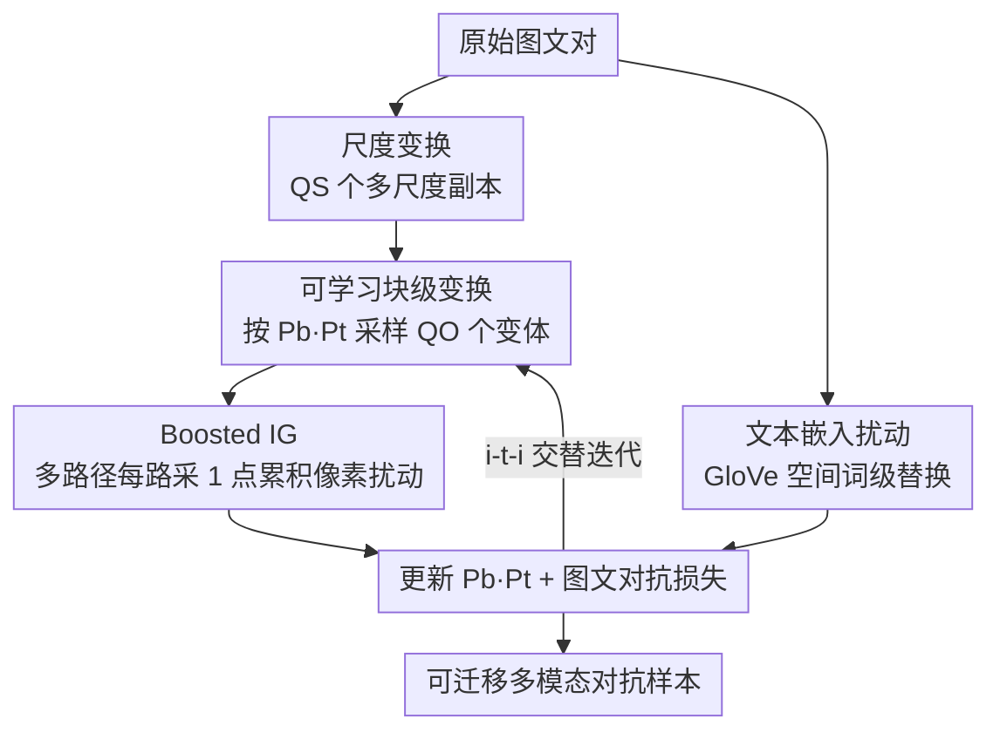

# Transform to Transfer: Boosting Adversarial Attack Transferability on Vision-Language Pre-training Models

**会议**: CVPR 2026  
**论文**: [CVF Open Access](https://openaccess.thecvf.com/content/CVPR2026/html/Li_Transform_to_Transfer_Boosting_Adversarial_Attack_Transferability_on_Vision-Language_Pre-training_CVPR_2026_paper.html)  
**领域**: AI 安全 / 多模态对抗攻击  
**关键词**: VLP 对抗攻击、黑盒迁移、可学习变换、积分梯度、跨架构迁移

## 一句话总结
针对视觉-语言预训练（VLP）模型黑盒对抗样本"迁移性差"的问题，本文提出 Transform to Transfer Attack（TTA），用一套**可学习的块级图像变换**自动挑选最优变换组合来扩大输入多样性，再用**增强版积分梯度（Boosted IG）**沿多条变换路径采梯度来摆脱对源模型的过拟合，在跨架构（ALBEF↔CLIP）迁移上把攻击成功率最多拉高近 40 个百分点。

## 研究背景与动机

**领域现状**：VLP 模型（ALBEF、TCL、CLIP 等）在图文检索、看图说话、视觉定位上都很强，但也很脆——一张人眼几乎看不出区别的图、加上几个词替换，就能让模型给出完全错误的跨模态匹配。研究这种多模态对抗样本，本质是在探查模型的鲁棒性边界。真正有现实威胁的是**黑盒迁移攻击**：攻击者只能在自己手里的"源模型"上造对抗样本，然后指望它在看不见内部的"目标模型"上也奏效。

**现有痛点**：迁移性恰恰是这条路上最难的一关。两条主流改进路线各有死穴。一类（SGA、LSSA）靠**输入变换**增加样本多样性——SGA 用尺度变换把图文从"一对多"扩成"多对多"，LSSA 再加局部 shuffle——但它们用的都是**固定且有限的一小撮变换**，既限制了多样性，又忽略了"不同图片对不同变换的敏感度天差地别"这一事实。另一类（DRA）靠在当前对抗图、上一步对抗图、干净图围成的三角区内插值来**降低对源模型的依赖**，可惜插值用到的两张对抗图本身仍是源模型生成的，去依赖只去了一半。

**核心矛盾**：迁移性差的根因是两个"过拟合"——对**固定变换**过拟合（输入路径单一），以及对**源模型梯度**过拟合（优化轨迹被源模型牵着走）。已有工作每次只解一半，所以跨架构（图像编码器结构完全不同，如 ViT vs CNN）场景一塌糊涂。

**切入角度**：作者有两个关键观察。其一，"没有一种变换组合对所有图像都最优，而最有效的变换天然是**块级（block-level）**操作"——这说明变换不该手工固定，而应该**针对每张图自动学**。其二，积分梯度（IG）具有"实现不变性"（Implementation Invariance）：功能等价的模型对同一输入会给出一致的像素显著性，因此用 IG 造的扰动天然在不同模型间相似、利于迁移；但作者实测发现，把 IG 直接套进 SGA 后，单条积分路径上相邻采样点的梯度相似度高得离谱（图 2 的相似度矩阵大量取值 0.8~0.94），多样性近乎为零，迁移性反被拖累。

**核心 idea**：用"可学习的块级变换"替代固定变换来博取输入多样性，并把积分梯度从"单路径多采样点"改成"**多路径每路一采样点**"——让变换多样性同时服务于"扩大输入"和"打散积分梯度"，一举解开两个过拟合。

## 方法详解

### 整体框架
TTA 是一个图、文双模态联合扰动的攻击框架。给定一张图和配对文本：**图像侧**先做尺度变换得到多尺度副本，再对每个副本施加一套可学习的块级变换采样出大量变体，然后在这些变体上跑 Boosted IG 累积像素级扰动；**文本侧**在 GloVe 嵌入空间做词级替换扰动。两路扰动交替迭代（实测 image→text→image 的 `i-t-i` 顺序最优），把对抗损失（拉远图文跨模态表征距离）推到最大，最终产出可跨模型、跨任务迁移的对抗图文对。

整张图记两组可学习对象：$M$ 个分块策略 $\{b_1,\dots,b_M\}$ 和 $N$ 个变换操作 $\{t_1,\dots,t_N\}$，各自带一套归一化的概率分布 $P_b$、$P_t$。每轮迭代按这两套概率采样变换组合、生成对抗样本，再用对抗样本回过头来更新概率，让采样逐步逼近"对这张图最优"的变换组合。

### 关键设计

**1. 可学习块级变换：让每张图自己学出最优变换组合**

固定变换的毛病在于"一刀切"——对所有图用同一套尺度/shuffle，既不够多样，也照顾不到单张图的敏感度差异。TTA 把变换拆成"分块策略 + 块级操作"两层并让它们**可学习**。一张图 $x$ 先被某个分块策略 $b_i$ 切成 $K$ 块，$b_i(x)=x_1\,x_2\cdots x_K$；每块 $x_k$ 再叠加 $L$ 个串行的块级操作 $t^k_L(x_k)=t^k_1\!\circ t^k_2\circ\cdots\circ t^k_l$（这里 $t^k_1\!\circ t^k_2$ 表示先 $t^k_1$ 再 $t^k_2$）；于是整图的一次完整变换是 $o(x)=t^K_L(b_i(x))$。这套组合被采中的概率把"分块策略概率"和"每块各操作概率"乘起来：

$$p_o(x)=p_{b_i}(x)\cdot\Big(\sum_{k=1}^{K}\prod_{l=1}^{L} p_{t^k_l}(x_k)\Big).$$

关键在于怎么"学"。作者把它写成一个**双层优化**（公式 5）：内层固定一套变换 $o$、生成当前最强对抗样本；外层则根据这个对抗样本去找让对抗损失期望 $\mathbb{E}_{o\sim(P_b,P_t)}[\mathcal{L}]$ 最大的概率分布 $P_b^\*,P_t^\*$。求解时用梯度上升近似更新：$P_b^\*=P_b+\eta\cdot g_{P_b}$，$P_t^\*=P_t+\eta\cdot g_{P_t}$。这样每轮迭代后，被采样到的变换组合都被往"对当前图最有破坏力"的方向带，跳出了固定变换的牢笼，也天然契合"最优变换是块级操作"这一观察。每张尺度图再采 $Q_T$ 个变换，单轮共采 $Q_O=Q_T\times Q_S$ 个变体。

**2. Boosted IG：把积分梯度从"单路径多点"改成"多路径每路一点"**

积分梯度本来是迁移攻击的好底子——它的"实现不变性"让显著性图在功能等价的模型间高度一致，因此用 IG 造的扰动跨模型相似、好迁移。沿基线图 $B$ 到输入图 $x$ 的路径，第 $i$ 个像素的 IG 为

$$\mathrm{IG}_i(f,x,B)=(x_i-B_i)\!\int_{\alpha=0}^{1}\frac{\partial \mathcal{L}\big(B+\alpha(x-B)\big)}{\partial x_i}\,d\alpha,$$

实践中用 $J$ 个采样点离散近似。但作者实测（图 2）发现致命问题：**同一条积分路径上相邻采样点的梯度高度相似**，等于反复在算几乎一样的梯度，多样性塌缩，迁移性被拖累。

Boosted IG 的修法很巧：既然单路径多点会冗余，那就**把"多采样点"换成"多变换路径、每条路径只采一个点"**。借助设计 1 的可学习变换与尺度变换，输入空间被扩成 $Q_O$ 个变体 $o_w(x)$，每个变体对应一条独立的积分路径，于是

$$\mathrm{BIG}_i(f_I,f_T,x,B,c)=(x_i-B_i)\cdot\frac{1}{Q_O}\sum_{w=1}^{Q_O}\frac{\partial \mathcal{L}\big(f_I,f_T,o_w(x),B,c\big)}{\partial x_i},$$

其中跨模态损失 $\mathcal{L}$ 拉远"扰动图像表征 $f_I$"与"文本表征 $f_T(c)$"之间的距离（公式 10，含归一化）。这一改让累积的梯度来自彼此差异很大的路径，多样性被打开；同时每条路径仍带着 IG 的实现不变性红利，去源模型依赖与扩多样性两件事被同一个变换机制一起办了——这正是"Transform to Transfer"名字的由来。

**3. 文本模态嵌入级扰动：在 GloVe 空间做语义友好的词替换**

图像扰动之外，文本侧沿用 BERT-Attack 思路做**嵌入级**而非字符级扰动。先按每个词对图像的重要性打分，挑出最关键的词；优先在 GloVe 词向量空间里找语义相近的嵌入来构造替换，若找不到合适匹配，再退而用掩码语言模型（MLM）预测候选替换词。这样既保证替换词语义通顺、不易被察觉，又能精准打在对跨模态匹配最敏感的词上，和图像扰动在 `i-t-i` 的交替顺序里协同放大攻击效果。

### 损失函数 / 训练策略
攻击目标是最大化跨模态对抗损失 $\mathcal{L}(f_I,f_T,o(x),B,c)$，即拉远扰动图像与配对文本的表征距离。优化用双层结构：内层用固定变换跑出最强对抗样本，外层用梯度上升更新变换概率 $P_b,P_t$。超参上单轮共用 $N_Q=Q_S+Q_O=35$ 张图，辅助变换数 $Q_O=30$（再多收益饱和），块级变换数 $L=2$（更多会让 R@5 反降）。

## 实验关键数据

### 主实验（图文检索迁移，Flickr30K，攻击成功率 %）
以 ALBEF、TCL、CLIPViT、CLIPCNN 互为源/目标模型。白盒下各方法都近饱和，重点看黑盒迁移；下表摘取最能体现"跨架构"难度的几组：

| 源→目标 | 指标 | LSSA（前 SOTA） | TTA（本文） | 提升 |
|--------|------|------|------|------|
| ALBEF→CLIPViT | TR R@1 / IR R@1 | 53.25 / 60.89 | 92.27 / 92.82 | +39.02 / +31.93 |
| ALBEF→CLIPCNN | TR R@1 / IR R@1 | 56.45 / 64.43 | 93.36 / 93.58 | +36.91 / +29.15 |
| CLIPCNN→ALBEF | TR R@1 / IR R@1 | 31.39 / 44.06 | 55.16 / 66.42 | +23.77 / +22.36 |
| CLIPViT→ALBEF | TR R@1 / IR R@1 | 45.99 / 56.48 | 81.02 / 86.11 | +35.03 / +29.63 |
| ALBEF↔TCL（同族） | TR R@1 | 96~98 区间 | 接近上限 | +1.13~3.68 |

可见 TTA 的增益高度集中在**跨架构**（ViT↔CNN 图像编码器不同）这种最难的设定，同族（ALBEF↔TCL）本就接近天花板、只做小幅稳定提升。

### 跨任务迁移（值越低迁移性越强）
用 ALBEF 上造的对抗样本去攻击看图说话（BLIP）和视觉定位（RefCOCO+）：

| 任务 | 指标 | Baseline（干净） | LSSA | TTA（本文） |
|------|------|------|------|------|
| 图像描述 | CIDEr | 133.3 | 63.4 | 28.5 |
| 图像描述 | BLEU-4 | 39.7 | 21.0 | 12.1 |
| 视觉定位 | Val / TestA | 58.46 / 65.89 | 47.25 / 54.09 | 43.64 / 50.45 |

TTA 在所有指标上把分数压得最低，说明它造的对抗样本不止换个目标模型能迁，**换个任务也能迁**。

### 消融与分析（ALBEF 源，攻另三模型）
| 配置 | 关键变化 | 结论 |
|------|---------|------|
| Setting 1 | 同时去掉可学习变换 + Boosted IG | 退化最严重，回到普通梯度 |
| Setting 2 | 去掉可学习变换，用单路径 20 点标准 IG | 比标准梯度稳，但提升有限 |
| Setting 3 | 去掉 Boosted IG，用标准梯度 | **掉点最猛**，凸显可学习变换贡献最大 |
| 完整 TTA | 两者协同 | SOTA |

### 关键发现
- **可学习变换是头号功臣**：Setting 3（仅去掉它）掉点最明显，说明"自动学最优块级变换"对迁移性的贡献超过 Boosted IG；两者协同才到 SOTA。
- **超参有清晰拐点**：辅助变换数 $Q_O$ 增到 30 后 ASR 饱和；块级变换 $L$ 从 1→2 显著提升，再加则 R@5 反降——作者据此取 $Q_O{=}30$、$L{=}2$。
- **攻击顺序也有讲究**：六种图文交替顺序里 `i-t-i` 最优，且比更长的循环（如 `i-t-i-t`）用更少步数就拿到更强迁移，兼顾效果与效率。
- **同等预算仍占优**（表 3）：把增广图数拉到与对手相同（5 张或 20 张），TTA 依旧领先，且 GPU 显存更低（如 20 张时 11.29GB vs LSSA 18.71GB）；可学习变换只多花约 2.5s，却换来近 30% 的提升，效率-精度权衡划算。

## 亮点与洞察
- **一个机制解两个过拟合**：可学习变换造出的多条变换路径，既是 Boosted IG 的"多路径"来源（打散积分梯度、去源模型依赖），又直接扩大了输入多样性——把"扩多样性"和"去依赖"两件事用同一套变换一起办了，设计极简洁。
- **对 IG 失效原因的诊断很关键**：直接把 IG 套进 SGA 不灵，根因是单路径相邻点梯度过相似（图 2 的相似度矩阵是有力证据）。把"单路径多点采样"翻转成"多路径每路一点"，是一个很可迁移的 trick——凡是用积分/插值路径累积梯度的攻击都可借鉴。
- **跨架构才是真考验**：论文清醒地把分析聚焦在 ViT↔CNN 这种编码器结构不同的设定，而非同族小提升，增益也确实集中在这里，说服力强。
- **可迁移到防御端**：可学习块级变换的"为每张图找最敏感变换"思路，反过来可用于对抗训练或鲁棒性评测，定位模型对哪类块级扰动最脆弱。

## 局限与展望
- **评测以图文检索为主**：主实验与消融几乎都在图文检索 + Flickr30K 上，跨任务只验了看图说话和视觉定位两项；对更大规模生成式 VLM（如 LLaVA 类）是否同样有效未知。
- **双层优化 + 多路径的开销**：虽说额外只多 ~2.5s，但 $Q_O{=}30$ 条路径、双层概率更新仍比单纯输入变换重，作者未给完整的端到端攻击时长随模型规模的扩展曲线。
- **块级变换库的设计被略过**：$M$ 个分块策略、$N$ 个操作具体是哪些、库大小如何影响效果，文中交代不多，复现时这块需要补全。
- **威胁模型偏理想**：仍假设攻击者能拿到一个高质量源模型与完整图文对；对真实部署里只有 API 黑盒查询的更严苛设定未涉及。

## 相关工作与启发
- **vs SGA / LSSA**：都靠输入变换增多样性，但用**固定**变换（SGA 尺度、LSSA 加局部 shuffle）；TTA 把变换换成**可学习的块级组合**，并指出固定变换忽视了图像对不同变换的敏感度差异，跨架构迁移上大幅反超。
- **vs DRA**：DRA 在"当前/上一步对抗图 + 干净图"三角区插值来去源模型依赖，但两张对抗图仍来自源模型、去依赖不彻底；TTA 改用积分梯度的实现不变性 + 多路径采样，从机制上更干净地削弱源模型烙印。
- **vs 朴素 IG 攻击**：已有工作把 IG 用于 VLP 迁移攻击有效，但直接套进 SGA 会因单路径梯度过相似而失多样性；TTA 的 Boosted IG 用"多路径每路一点"修好了这个缺陷。
- **vs Co-Attack（白盒）**：Co-Attack 首次利用图文交互做白盒攻击，不面向黑盒迁移；TTA 专注黑盒、跨架构、跨任务迁移这一更现实的威胁面。

## 评分
- 新颖性: ⭐⭐⭐⭐ 把"可学习块级变换"与"多路径单点 Boosted IG"耦合起来同解两个过拟合，思路清晰且有非平凡的诊断（IG 失效原因）。
- 实验充分度: ⭐⭐⭐⭐ 四模型互攻 + 跨任务 + 消融 + 同等预算 + 超参曲线齐全，但局限在图文检索与中等规模 VLP。
- 写作质量: ⭐⭐⭐⭐ 动机—观察—方法链条顺，公式与图证（图 2 相似度矩阵）到位；块级变换库细节略欠。
- 价值: ⭐⭐⭐⭐ 跨架构迁移最多 +39 点，对 VLP 鲁棒性评测与对抗训练都有现实参考价值。

<!-- RELATED:START -->

## 相关论文

- [\[CVPR 2026\] PureProof: Diffusion-Resistant Black-box Targeted Attack on Large Vision-Language Models](pureproof_diffusion-resistant_black-box_targeted_attack_on_large_vision-language.md)
- [\[CVPR 2026\] FlowHijack: A Dynamics-Aware Backdoor Attack on Flow-Matching Vision-Language-Action Models](flowhijack_a_dynamics-aware_backdoor_attack_on_flow-matching_vision-language-act.md)
- [\[CVPR 2026\] TTP: Test-Time Padding for Adversarial Detection and Robust Adaptation on Vision-Language Models](ttp_test-time_padding_for_adversarial_detection_and_robust_adaptation_on_vision-.md)
- [\[CVPR 2026\] Hierarchically Robust Zero-shot Vision-language Models](hierarchically_robust_zero-shot_vision-language_models.md)
- [\[CVPR 2026\] SIF: Semantically In-Distribution Fingerprints for Large Vision-Language Models](sif_semantically_in-distribution_fingerprints_for_large_vision-language_models.md)

<!-- RELATED:END -->
