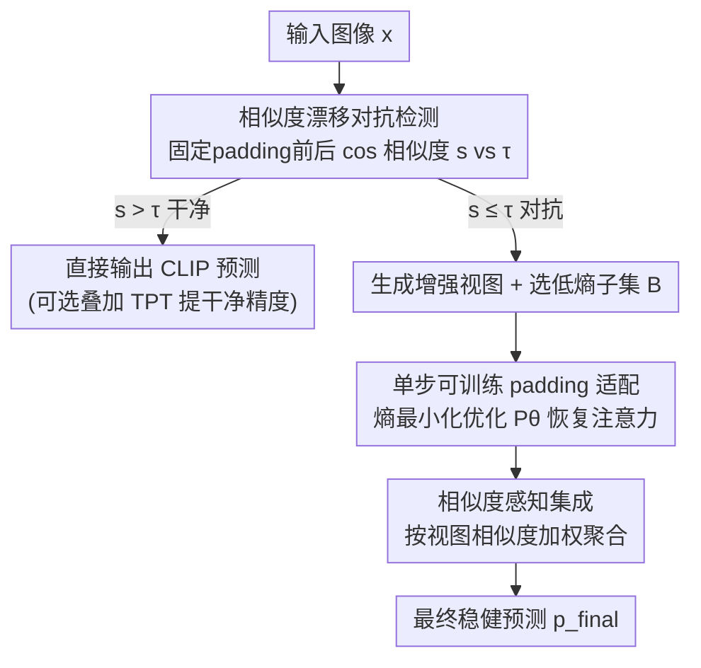

# TTP: Test-Time Padding for Adversarial Detection and Robust Adaptation on Vision-Language Models

**会议**: CVPR 2026  
**论文**: [CVF Open Access](https://openaccess.thecvf.com/content/CVPR2026/html/Li_TTP_Test-Time_Padding_for_Adversarial_Detection_and_Robust_Adaptation_on_CVPR_2026_paper.html)  
**代码**: https://github.com/lizhiwei23/TTP  
**领域**: AI 安全 / 对抗鲁棒  
**关键词**: 对抗防御, CLIP, 测试时适配, 对抗检测, 视觉语言模型

## 一句话总结
TTP 给 CLIP 加了一套「先检测、再适配」的测试时防御：靠图像**加边（padding）前后特征余弦相似度的漂移**来判别一张图是干净还是被对抗扰动过，干净样本原样输出、对抗样本则用单步可训练 padding 配上相似度加权集成来恢复被攻击打乱的注意力，在不重训、不掉干净精度的前提下把对抗鲁棒性显著拉高。

## 研究背景与动机
**领域现状**：以 CLIP 为代表的视觉语言模型（VLM）零样本识别能力很强，但在对抗扰动下极其脆弱——一点人眼看不出的噪声就能让它把狗认成猫。要给它加鲁棒性，主流有两条路：训练时防御（对抗微调 / 对抗 prompt tuning，如 TeCoA、APT、TAPT）需要带标注的对抗数据并重训大模型，代价高且鲁棒性难以泛化到没见过的类别；测试时防御则在推理时即时适配权重或 prompt（如 R-TPT），不用重训。

**现有痛点**：测试时防御里有两类做法。一类（R-TPT、TAPT）对**所有输入一视同仁**地做对抗适配——可干净样本和对抗样本的适配目标是冲突的，强行对干净样本也做对抗适配会拖累干净精度，鲁棒性和干净精度都到不了最优。另一类（TTC）走「先检测后防御」的两阶段路线，靠「对抗样本在小扰动下特征更稳定」来区分干净/对抗，但它的检测精度低、跨数据集跨骨干网络极不稳定（论文 Fig.2 显示 TTC 用 L2 距离阈值 τ=0.2 时检测准确率在不同数据集/骨干间剧烈波动）。检测一旦失灵，对抗样本被当成干净的逃过适配、干净样本反被错误适配，整套防御就崩了。

**核心矛盾**：两阶段防御的成败完全压在「检测器」上，而现有检测信号（小扰动下的特征稳定性）既不准也不通用，缺一个跨架构、跨数据集都能用同一阈值的可靠判据。

**切入角度**：作者从一个具体观察出发——给图像四周加 padding 能**部分恢复被对抗扰动打乱的注意力**（Fig.1：对抗样本注意力跑偏导致误判，加 padding 后注意力被拉回正确区域）。既然 padding 对干净和对抗样本的影响不同，那「加 padding 前后特征变了多少」本身就是一个区分信号：干净样本特征几乎不变，对抗样本特征显著漂移。

**核心 idea**：用「padding 前后 CLIP 特征的余弦相似度漂移」作为一个**统一、与数据集/架构无关**的对抗检测判据，再对检测出的对抗样本用「可训练 padding + 相似度感知集成」做定向恢复——即 detect-then-adapt，且全程只在输入像素空间操作，不碰模型权重也不动 prompt。

## 方法详解

### 整体框架
TTP 是一个工作在 CLIP **输入空间**的轻量测试时防御，整体是一条三阶段流水线。给定一张测试图 $x$：先用一次固定 padding 算出 $x$ 和 $P^{fix}(x)$ 两个 CLIP 图像特征的余弦相似度 $s$，拿它跟一个通用阈值 $\tau$ 比——大于阈值判为干净，直接走 CLIP 原始零样本分类（可选叠加 TPT 之类的 TTA 再提点干净精度）；小于阈值判为对抗，进入恢复阶段：对该样本生成多个增强视图、挑出低熵的置信子集，用单步熵最小化优化一个实例专属的可训练 padding 模块来恢复注意力，最后用相似度感知集成对这些视图的预测加权求和，得到稳健的最终预测。整套流程不需要重训、不需要知道模型结构，是即插即用的。

### 关键设计

**1. 相似度漂移对抗检测：用一个通用阈值可靠地分开干净与对抗**

这一步针对的是 TTC 检测器「不准 + 不通用」的痛点。具体做法极简：对测试样本 $x$ 先做一次固定 padding $P^{fix}(x)$，用**冻结**的 CLIP 图像编码器分别编码得到 $z = F(x)$、$z^{pad} = F(P^{fix}(x))$，再算两者的余弦相似度

$$s = \frac{z \cdot z^{pad}}{\|z\|\,\|z^{pad}\|}$$

若 $s > \tau$ 判为干净（直接分类），否则判为对抗（进入后续适配）。它之所以有效，是因为 padding 对两类样本的扰动机理不同：干净样本的语义不依赖精确空间布局，加边后特征基本不动（相似度高）；对抗扰动是依附在特定像素位置上的高频结构，padding 改变了空间排布、破坏了扰动的生效条件，使对抗样本特征大幅漂移（相似度低）。这让一个**单一余弦阈值 $\tau = 0.8$** 就能跨 8 个细粒度数据集、跨 ViT-B/32/B/16/L/14 三种骨干稳定工作——论文报告检测准确率接近 100%，而 TTC 的 L2 阈值在同等条件下剧烈抖动。检测准了，干净样本几乎不受影响（保住干净精度），对抗样本也能被精准送进恢复阶段。

**2. 单步可训练 padding 适配：把 padding 从固定图案升级成实例专属、可学的注意力修复器**

固定/随机 padding 已经能部分恢复注意力，但恢复得粗糙、引入噪声。这一步针对「如何更彻底地恢复被攻击打乱的注意力」。沿用测试时适配里常用的边缘熵最小化范式，对检测出的对抗样本生成 $N$ 个增强视图 $\{x_i\}_{i=1}^N$（随机缩放、裁剪、颜色抖动等），各自编码分类得到概率 $p_c(x_i)$ 和香农熵

$$H_i = -\sum_{c=1}^{C} p_c(x_i)\log p_c(x_i)$$

取熵最低的 top-$K$ 视图组成置信子集 $B$。和以往适配文本 prompt 的做法不同，TTP 优化的是一个**轻量可训练 padding 模块 $P_\theta(\cdot)$**：把它作用到 $B$ 上得到带 padding 视图的熵 $H_i^{pad}$，对参数 $\theta$ 做**单步**梯度下降最小化平均熵

$$\mathcal{L}_{ent} = \frac{1}{|B|}\sum_{i\in B} H_i^{pad}, \qquad \theta \leftarrow \theta - \eta\nabla_\theta \mathcal{L}_{ent}$$

之所以选「学 padding」而非「学 prompt」，是因为对抗扰动本质是输入空间的像素级攻击，在同一空间里用可学的边框去对冲它最直接；而且这让防御完全独立于文本 prompt 和模型结构，真正即插即用。相比随机 padding，这种基于多视图平均熵的训练显著降低了恢复注意力时引入的噪声。

**3. 相似度感知集成：按视图与对抗样本的相似关系加权，挑出最可信的预测**

适配完之后还需要把多个增强视图的预测融合成一个稳健输出，简单平均会被不可靠视图拖累。这一步给每个视图算一个自适应权重。对对抗输入 $x_{adv}$，取它 padding 前后的特征 $z_{adv} = F(x_{adv})$、$z_{adv}^{pad} = F(P^{fix}(x_{adv}))$；对每个选中视图 $x_i$，用训练好的 padding 得到 $z_i^{pad} = F(P_\theta(x_i))$，定义

$$\alpha_i = \cos(z_i^{pad}, z_{adv}^{pad}), \quad \beta_i = \cos(z_i^{pad}, z_{adv}), \quad s_i = \alpha_i - \beta_i, \quad w_i = \frac{\exp(s_i)}{\sum_{j\in B}\exp(s_j)}$$

直觉是：$\beta_i$ 衡量视图与**未处理的对抗原图**的相似度——因为对抗扰动严重扭曲了特征，作者**偏好远离原始对抗特征**的视图（$\beta_i$ 小更好）；但单纯远离还不够，目标是预测更准，而可训练 padding 已能把对抗样本的注意力恢复到接近干净样本，所以也**偏好靠近 padding 后对抗特征**的视图（$\alpha_i$ 大更好）。两者一减得视图分数 $s_i$，softmax 成权重，最终预测

$$p_{final} = \arg\max_c \sum_{i\in B} w_i\, p_c(P_\theta(x_i))$$

这样把权重压在「既摆脱了对抗污染、又恢复到正确注意力」的视图上，集成结果比简单平均更可靠。

### 损失函数 / 训练策略
唯一的优化目标就是设计 2 里的置信视图平均熵 $\mathcal{L}_{ent}$，且只对 padding 参数 $\theta$ 做**单步**更新。实现上：padding 尺寸 32，检测阈值 0.8，padding 参数在 $[0,10]$（对应像素 $[0,255]$）内随机初始化，学习率高达 5，增强 batch 64，攻击用 100 步 PGD、$\epsilon=4/255$，全程单卡 RTX 3090。

## 实验关键数据

### 主实验
评测覆盖 8 个细粒度分类数据集（Caltech101 / Pets / Cars / Flower102 / Aircraft / DTD / EuroSAT / UCF101）和 3 种 CLIP 骨干，鲁棒精度（Rob.）在 100 步 PGD、$\epsilon=4.0$ 下测。下表给出各骨干上的平均干净精度（Acc.）/平均对抗精度（Rob.）：

| 骨干 / 方法 | 指标 | CLIP | TTC | MTA | R-TPT (前SOTA) | TTP (本文) |
|------------|------|------|-----|-----|----------------|------------|
| ViT-B/32 | Acc. / Rob. | 57.4 / 0.0 | 56.7 / 6.8 | 58.3 / 35.0 | 57.3 / 35.3 | 57.1 / **39.7** |
| ViT-B/16 | Acc. / Rob. | 61.4 / 0.0 | 58.9 / 4.5 | 62.3 / 27.4 | 61.1 / 39.9 | 61.2 / **42.9** |
| ViT-L/14 | Acc. / Rob. | 69.1 / 0.0 | 68.2 / 4.3 | 69.1 / 39.9 | 68.4 / 49.6 | 68.9 / **51.6** |

TTP 在三种骨干上把对抗精度相对前 SOTA R-TPT 平均提了约 4.4%（B/32）、3.0%（B/16）、2.0%（L/14），且干净精度几乎不掉（接近 vanilla CLIP）。同走两阶段路线的 TTC 因检测太差，强攻击下对抗精度只有 6.8%。模型越大鲁棒增益依然保持，说明 TTP 对大规模 VLM 同样泛化。

跨攻击类型上（在 Flowers / DTD 两个数据集，对比 CW / DeepFool / FGSM 三类攻击），TTP 平均对抗精度也稳压 R-TPT：

| 攻击 / 方法 | Flowers Avg. | DTD Avg. |
|------------|--------------|----------|
| CLIP | 2.0 | 7.8 |
| R-TPT | 51.8 | 34.2 |
| TTP (本文) | **54.1** | **38.7** |

### 消融实验
组件消融（ViT-B/32 / B/16 上的平均对抗精度）：

| Sim-Aware | EntMin | Padding | ViT-B/32 | ViT-B/16 |
|-----------|--------|---------|----------|----------|
| × | × | × | 0.0 | 0.0 |
| × | × | ✓ | 37.5 | 38.0 |
| × | ✓ | ✓ | 39.0 | 40.8 |
| ✓ | × | ✓ | 38.3 | 39.5 |
| ✓ | ✓ | ✓ | **39.7** | **42.9** |

检测阶段 padding 图案消融（ViT-B/32 检测准确率 %，阈值固定 0.8）：

| 图案 | Avg. 检测准确率 |
|------|----------------|
| 随机 padding | 95.8 |
| 0 padding（全黑） | 98.5 |
| 255 padding（全白） | **98.7** |

### 关键发现
- **固定 padding 本身就是鲁棒性主力**：从「全无」到只加固定 padding，对抗精度从 0 直接跳到 37.5/38.0，印证「padding 恢复注意力」这一核心假设；EntMin 和相似度集成各自再叠 1-3 个点，三件套齐全最优。
- **检测器越简单越准**：黑/白纯色 padding（98.5%/98.7%）比随机 padding（95.8%）检测更准，说明简单图案让对抗特征漂移更干净、可分性更强。
- **padding 尺寸要适中**：检测端，padding 越大对抗样本余弦相似度越低（与干净样本的间隔拉大、可分性升），但过大（128）会破坏图像布局让两类特征都退化、间隔反而收窄；鲁棒端在 DTD 上对抗精度随尺寸先升后降，64 附近达峰（33.9%），过大（256→21.9%）反伤性能——和「适度 padding 恢复注意力、过度 padding 破坏空间结构」的假设一致。
- **可叠加 TTA 提干净精度**：因检测近 100%，干净样本基本无损；再叠 TPT 后平均干净精度升到三骨干 57.9/62.1/69.5，是所有测试时防御里最高。

## 亮点与洞察
- **把一个朴素观察变成统一判据**：核心洞察「padding 前后特征相似度漂移」既当检测信号又顺带恢复注意力，一石二鸟，且只用单一阈值就跨数据集跨骨干稳定——相比 TTC 需要敏感调阈值，这个「通用 τ」的可迁移性是最实用的点。
- **在输入像素空间做防御**：不碰权重、不调 prompt、不需要模型结构知识，真正即插即用，可无缝套在任何 CLIP 变体上，还能和现成 TTA 组合提干净精度。这种「黑盒友好」的设计很适合用公开 checkpoint 的普通用户。
- **相似度感知集成的双向约束**很巧：同时要求视图「远离对抗原图、靠近恢复后特征」，把权重精准压到既去污又对齐的视图上，比简单平均/纯熵加权更对症。可迁移到任何「多视图 + 有参考锚点」的测试时聚合场景。

## 局限与展望
- **只验证了细粒度分类 + CLIP**：全部实验都是分类任务、CLIP 骨干，没测检测/分割/生成式 VLM，也没测更现代的 SigLIP 等模型，泛化性有待验证。
- **检测阈值是经验固定值**：τ=0.8 跨数据集好用，但论文未给出理论保证或自适应方式，遇到攻击强度 $\epsilon$ 大幅变化时是否仍稳健（论文只在 $\epsilon=4.0$ 主测）存疑。
- **白盒/自适应攻击未覆盖**：评测用的是 PGD/CW/DeepFool/FGSM 等标准攻击，没有针对「padding 检测器本身」设计的自适应攻击——攻击者若已知防御机制，能否构造同时骗过相似度检测的扰动是个开放问题。
- **padding 尺寸需手调**：检测与鲁棒对尺寸都敏感且最优区间窄（适中），换数据集可能要重调，未做自动化选择。

## 相关工作与启发
- **vs TTC**: 同走「检测-then-防御」两阶段，但 TTC 用「小扰动下特征稳定性 + L2 距离阈值」做检测，精度低且跨域不稳；TTP 换成「padding 前后余弦相似度漂移 + 单一阈值」，检测准确率接近 100% 且通用，从根上修好了两阶段范式最脆弱的检测环节。
- **vs R-TPT / TAPT**: 它们对所有输入统一做对抗适配（主要调文本 prompt），干净/对抗目标冲突导致两头都不最优；TTP 先分流，干净样本原样保精度、对抗样本才适配，且适配的是输入 padding 而非 prompt。
- **vs TeCoA / APT（训练时防御）**: 需带标注对抗数据 + 重训，鲁棒难泛化到未见类；TTP 不重训、不需标注、推理时即时防御，代价小很多。
- **vs Ensemble / MTA（普通 TTA）**: 它们假设输入干净、只为提泛化，不管鲁棒；TTP 把 TTA 的熵最小化范式迁到对抗恢复上，并加了相似度感知加权。

## 评分
- 新颖性: ⭐⭐⭐⭐ 「padding 相似度漂移」这个检测信号简单却新，detect-then-adapt 整体在前人 TTC 基础上做出实质改进。
- 实验充分度: ⭐⭐⭐⭐ 8 数据集 × 3 骨干 × 多攻击 + 完整消融，覆盖到位；缺自适应攻击与非分类任务验证。
- 写作质量: ⭐⭐⭐⭐ 动机-观察-方法链条清晰，图表（注意力可视化、检测雷达图、尺寸曲线）佐证有力。
- 价值: ⭐⭐⭐⭐ 轻量、即插即用、不掉干净精度，对用公开 CLIP 的实际部署很有参考价值。

<!-- RELATED:START -->

## 相关论文

- [\[CVPR 2026\] Hierarchically Robust Zero-shot Vision-language Models](hierarchically_robust_zero-shot_vision-language_models.md)
- [\[CVPR 2026\] Transform to Transfer: Boosting Adversarial Attack Transferability on Vision-Language Pre-training Models](transform_to_transfer_boosting_adversarial_attack_transferability_on_vision-lang.md)
- [\[CVPR 2026\] SIF: Semantically In-Distribution Fingerprints for Large Vision-Language Models](sif_semantically_in-distribution_fingerprints_for_large_vision-language_models.md)
- [\[CVPR 2026\] VCP-Attack: Visual-Contrastive Projection for Transferable Black-Box Targeted Attacks on Large Vision-Language Models](vcp-attack_visual-contrastive_projection_for_transferable_black-box_targeted_att.md)
- [\[CVPR 2026\] When CLIP Sees More, It Fights Back Harder: Multi-View Guided Adaptive Counterattacks for Test-Time Adversarial Robustness](when_clip_sees_more_it_fights_back_harder_multi-view_guided_adaptive_counteratta.md)

<!-- RELATED:END -->
