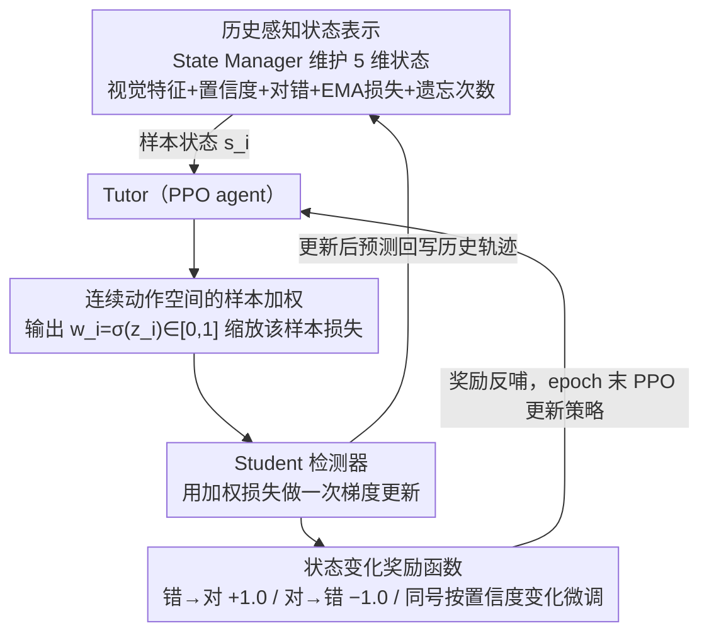

# Tutor-Student Reinforcement Learning: A Dynamic Curriculum for Robust Deepfake Detection

**会议**: CVPR 2026  
**arXiv**: [2603.24139](https://arxiv.org/abs/2603.24139)  
**代码**: [https://github.com/wannac1/TSRL](https://github.com/wannac1/TSRL)  
**领域**: AI安全 / 深度伪造检测  
**关键词**: 深度伪造检测, 强化学习, 课程学习, 动态样本加权, 跨域泛化

## 一句话总结

提出 Tutor-Student 强化学习（TSRL）框架，将深度伪造检测器的训练过程建模为马尔可夫决策过程，由"导师"（PPO agent）根据每个样本的视觉特征和历史学习动态（EMA 损失、遗忘次数）动态分配损失权重，通过"状态变化"奖励信号引导"学生"（检测器）优先学习高价值样本，在跨数据集和跨方法评估中显著提升泛化能力。

## 研究背景与动机

**领域现状**：深度伪造检测已发展出多种方法——频域分析、重建异常检测、混合边界建模、自监督对抗训练等。SOTA 检测器在已知数据集上能达到很高精度，但面对未见过的伪造技术、压缩伪影或不同数据域时性能显著退化。泛化能力是该领域的首要挑战。

**现有痛点**：传统监督训练对所有样本施加统一的损失权重，这是次优的。近期研究表明不同质量的 AI 生成图像对检测器训练的贡献差异很大——高质量难样本应被更多关注。已有课程学习（Curriculum Learning）方法尝试按预定义难度渐进训练，但这些静态课程存在根本局限："难度"不是样本的固有属性，而是相对于检测器即时学习状态的动态概念。

**核心矛盾**：一个对初期模型困难的样本在训练后期可能变得微不足道，而另一些样本始终具有挑战性。静态课程无法适应这种动态变化，可能在模型已掌握的"简单"样本上浪费计算资源，同时忽视对于精化判别边界至关重要的"困难"样本。这种不平衡会使模型偏向浅层的过拟合特征，而非鲁棒的可泛化伪造痕迹。

**本文目标** 设计一种动态训练策略，实时根据检测器的演化状态调整训练课程，从而培养更强的泛化能力。

**切入角度**：将训练过程形式化为序列决策问题，利用强化学习训练一个"导师"agent，其目标是学习最优的动态样本加权策略，显式优化"学生"检测器在分布外验证数据上的泛化性能。

**核心 idea**：用 PPO 强化学习 agent 作为"导师"，根据每个样本的历史学习轨迹为其分配 0-1 的连续损失权重，创建一个自适应的实时课程来最大化深度伪造检测器的泛化能力。

## 方法详解

### 整体框架

TSRL 想解决的核心问题是：传统训练对所有样本一视同仁地施加损失权重，但"哪个样本现在值得多学"本质上取决于检测器当下的学习状态——这是个会随训练不断变化的动态量，静态课程根本抓不住。TSRL 的做法是把整个训练过程重新包装成一个马尔可夫决策过程，再请一个强化学习 agent 在旁边盯着，实时调节喂给检测器的"课程"。

框架由三个角色构成：Student 是真正要训练的深度伪造检测器 $M_S$；Tutor 是一个 PPO 强化学习 agent $T_\pi$，它不直接碰检测任务，只负责给每个样本派发损失权重；State Manager 则在背后默默维护每个训练样本的纵向学习历史。一个训练步骤里，三者形成闭环：State Manager 把某样本的当前状态（视觉特征 + 历史学习轨迹）打包交给 Tutor，Tutor 据此输出一个 0–1 的权重缩放该样本的损失，Student 用这个加权损失做一次梯度更新，更新前后预测的变化又被换算成奖励反哺给 Tutor。整条流水线分三阶段推进：行为克隆初始化 → Student 预热 → 完整 TSRL 训练。

### 关键设计

**1. 历史感知状态表示：让 Tutor 看清一个样本"难在哪、学得稳不稳"**

Tutor 要做出好的加权决策，前提是它对每个样本有足够立体的认识——不只是"这张图长什么样"，还得知道"模型在它身上学得顺不顺"。TSRL 因此把状态设计成一个五维向量 $s_i = [f_i, p_i, e_i, l_i^{ema}, c_i^{forget}]$，前三维刻画即时快照、后两维刻画历史轨迹。$f_i$ 是 Student 中间层抽出的深度特征，编码样本的视觉内容；$p_i$ 是 Student 对目标类的预测置信度，直接反映此刻的难度；$e_i$ 用 one-hot 标记当前预测对错。真正的关键在后两维：$l_i^{ema}$ 是样本损失的指数移动平均，按 $l_i^{ema}(t) = \beta \cdot l_i^{ema}(t-1) + (1-\beta) \cdot \mathcal{L}_{CE}$ 递归更新，捕捉的是"长期感知难度"而非单步的偶然波动；$c_i^{forget}$ 是归一化的"遗忘事件"计数，记录模型上一轮答对、这一轮又答错的次数，专门衡量学习的不稳定性。这套设计让 Tutor 能区分两类貌似都"难"、实则该差别对待的样本——一个是 $l_i^{ema}$ 一直很高的"硬骨头"，另一个是 $c_i^{forget}$ 居高不下、反复横跳的"学不牢"样本，从而做出比"难度排序"细致得多的课程决策。

**2. 连续动作空间的样本加权：把"选或不选"换成可微调的旋钮**

知道样本状态之后，Tutor 要把判断落到一个具体动作上。它对每个样本输出一个连续权重 $w_i = \sigma(z_i) \in [0,1]$（经 Sigmoid 压到 0–1），直接乘到该样本的交叉熵损失上：

$$\mathcal{L}_{student} = w_i \cdot \mathcal{L}_{CE}(M_S(x_i), y_i)$$

$w_i$ 接近 1，等于告诉 Student"重点盯这个样本"；接近 0，则是"这张图现在学不出什么，先放一放"。比起课程学习里常见的"选入/丢弃"二元开关，连续权重给了 Tutor 一个可以无级微调的旋钮——它能把一个边界样本的权重设成 0.7 而不是只能取 0 或 1，从而精细地塑造每一步梯度的构成，而不是粗暴地增删训练集。

**3. 状态变化奖励函数：用"这一步推动了多少进步"代替遥远的验证精度**

Tutor 的策略要靠奖励来学，可如果奖励等到整个训练结束、拿验证精度来算，信号既稀疏又延迟，PPO 很难知道是哪一步加权做对了。TSRL 的巧思是把奖励直接挂在"这一次加权更新前后，Student 对同一样本的预测怎么变"上，分四种情况给分：错→对奖励 +1.0（最理想的学习进步），对→错惩罚 −1.0（灾难性遗忘，必须压住），对→对给 $c_{rew} \cdot \Delta_{conf}$（稳住且置信度上升则小幅正奖励），错→错给 $-c_{rew} \cdot \Delta_{conf}$（仍错但置信度有变化的微弱信号）。这种即时、密集、每步可得的反馈，比稀疏的终局奖励信息量大得多；尤其"错→对 +1.0"这一项，等于明码标价地激励 Tutor 去挖那些"推一把就能跨过判别边界"的样本——而把这类样本学扎实，正是泛化能力提升的来源。

### 一个完整示例：一个边界样本在训练中怎么被 Tutor 一路托起

设想一张高质量伪造人脸 $x_i$，训练初期 Student 对它毫无把握。State Manager 此时给出的状态大致是：置信度 $p_i$ 低、当前预测错（$e_i$ 指向错误）、$l_i^{ema}$ 偏高（一直没学会）、但 $c_i^{forget}$ 还不高（因为它从没答对过，谈不上"遗忘"）。Tutor 读到这个"持续偏难、但有救"的画像，给它派了一个较高权重，比如 $w_i = 0.8$，让它在这一步梯度里占足分量。一次加权更新后，Student 恰好从"答错"翻成"答对"——预测发生 错→对 的跃迁，Tutor 立刻收到 +1.0 的奖励，这条"重点关照边界样本"的策略被强化。

再往后几轮，这个样本被 Student 稳定答对，$l_i^{ema}$ 持续下滑、$p_i$ 升高。Tutor 看到状态从"难且错"转向"稳且对"，自然把它的权重逐步调低（比如降到 0.3），把腾出来的梯度预算让给别的还没攻克的硬样本。但若某一轮它又突然答错，$c_i^{forget}$ 跳升、并触发一次 对→错 的 −1.0 惩罚，Tutor 会重新抬高它的权重把它"拉回来"。整条轨迹就是一条随检测器状态实时呼吸的动态课程——这正是静态课程做不到、而实验中 EMA Loss > 0.7 的困难样本占比能被快速压低的原因。

### 训练策略

三阶段训练是为了让这套 RL 闭环稳得住、不至于从一开始就发散：

- **行为克隆（BC）初始化**：先用一个启发式"专家策略"（如偏好中等损失的样本）造一批示范数据，用 MSE 监督预训练 Tutor，给它一个非随机的合理起点，避免 RL 从纯随机策略起步时的剧烈震荡
- **Student 预热**：用标准监督学习（所有 $w_i = 1.0$）先训 Student $N_{warmup}$ 个 epoch，让 State Manager 攒够可靠的 EMA 损失、遗忘计数等统计量，否则 Tutor 早期看到的状态全是噪声
- **TSRL 训练**：进入完整的 MDP 循环（状态→动作→加权更新→奖励），每个 epoch 末用 PPO 更新 Tutor 策略，采用裁剪替代目标函数和 GAE 优势估计

## 实验关键数据

### 主实验：跨数据集评估（训练 FF++，测试其他数据集，AUC）

| 方法 | CDF-v2 | DFD | DFDC | DFDCP | 平均 |
|------|--------|-----|------|-------|------|
| Effort | 0.871 | 0.910 | 0.863 | 0.899 | 0.886 |
| **Effort + TSRL** | **0.901** | **0.904** | **0.882** | **0.924** | **0.903** |
| CORE | 0.697 | 0.868 | 0.692 | 0.759 | 0.754 |
| **CORE + TSRL** | **0.798** | **0.863** | **0.713** | **0.724** | **0.775** |
| CLIP | 0.751 | 0.752 | 0.759 | 0.667 | 0.732 |
| **CLIP + TSRL** | **0.849** | **0.732** | **0.768** | **0.724** | **0.768** |

### 跨方法评估（DF40 数据集，平均 AUC）

| 方法 | 平均 AUC |
|------|---------|
| Effort | 0.920 |
| **Effort + TSRL** | **0.942** (+2.2%) |
| CORE | 0.814 |
| **CORE + TSRL** | **0.855** (+4.1%) |
| ProDet | 0.839 |
| **ProDet + TSRL** | **0.850** (+1.1%) |

### 消融实验（CORE 模型，DF40 数据集）

| 配置 | 平均 AUC | 平均 ACC | 平均 EER | 说明 |
|------|---------|---------|---------|------|
| CORE baseline | 0.814 | 0.706 | 0.276 | 标准均匀加权 |
| CORE + CL（静态课程） | 0.817 | 0.723 | 0.266 | 仅 BC 初始化的冻结策略 |
| **CORE + TSRL** | **0.855** | **0.767** | **0.238** | 完整动态 RL 策略 |

### 关键发现

- **TSRL 在所有 6 个基线模型上均带来一致改进**：无一例外，验证了框架的通用性
- **动态策略远优于静态课程**：CORE + CL 仅比 baseline 提升 +0.3%，而 CORE + TSRL 提升 +4.1%，说明静态启发式无法适应模型的动态学习状态
- **TSRL 显著加速困难样本的消解**：如 Fig. 1 所示，baseline 的困难样本（EMA Loss > 0.7）比例在训练过程中居高不下，TSRL 则快速降低
- **特征空间可视化**证实 TSRL 学到了更好的表示：UMAP 显示 baseline 的 Real/Fake 特征严重重叠，而 TSRL 实现了完美的类别分离，并进一步将"简单假图"和"困难假图"分离为不同簇
- **Effort + TSRL 在跨方法评估中达到 0.942 的新 SOTA**

## 亮点与洞察

- **将训练过程本身建模为 MDP 的思路非常巧妙**：不是直接改进检测器架构或特征提取，而是从"如何喂数据"的元层面优化。这个框架与具体的检测器无关——理论上可以作为插件应用于任何监督学习任务。
- **状态变化奖励的密度和信息量**远超传统 RL 中的延迟奖励。特别是"错→对"给 +1.0 的设计直接激励 Tutor 找到那些"推一把就能过"的边界样本，这正是泛化能力提升的关键。
- **三阶段训练的稳定性设计**体现了工程上的成熟考量：BC 初始化避免了 RL 从随机策略开始的不稳定性，Student 预热确保状态向量可靠，最终 PPO 训练在稳定基础上精炼策略。

## 局限与展望

- TSRL 增加了训练复杂度——需要同时维护 Tutor、Student 和 State Manager，训练时间和内存开销增加
- 当前 Tutor 为每个样本独立决策，没有考虑样本间的关系（如同一类别内的多样性）
- 行为克隆初始化依赖于手工设计的"专家策略"，这个启发式的质量会影响最终效果
- 奖励函数的 $c_{rew}$ 系数需要调参，论文未详细讨论其敏感性
- 可探索将 TSRL 扩展到其他安全检测任务（如恶意软件检测、异常检测）或更广泛的域泛化问题

## 相关工作与启发

- **vs 传统课程学习（CL）**：CL 使用预定义的难度排序或单调的步调函数（如正弦波），是模型无关的静态策略。TSRL 消融实验明确表明静态 CL 仅带来微弱提升（+0.3%），而动态 RL 策略带来显著提升（+4.1%）
- **vs CDFA (CVPR)**: CDFA 通过渐进增加伪造增强难度实现课程学习，但仍是预定义的增强策略。TSRL 直接在样本层面做动态加权，更细粒度
- **vs Effort (SOTA baseline)**: Effort 已是很强的泛化检测基线，TSRL 仍能在其基础上提升 +2.2%（跨方法），说明即使良好的检测器也可从优化训练课程中受益
- **vs 数据增强 RL 方法**: 已有工作用 RL 学习增强策略，但这是优化数据变换而非样本权重，两者互补

## 评分

- 新颖性: ⭐⭐⭐⭐ 将 RL 应用于样本加权的课程学习是深度伪造检测领域的首次尝试，MDP 建模和状态变化奖励设计有创意
- 实验充分度: ⭐⭐⭐⭐⭐ 6 个基线模型逐一对比、跨数据集+跨方法两种评估协议、详细消融、UMAP 可视化分析
- 写作质量: ⭐⭐⭐⭐ 框架描述清晰，公式完整，三阶段训练动机解释充分
- 价值: ⭐⭐⭐⭐ 作为与具体检测器无关的即插即用模块，具有广泛的应用潜力；在 SOTA 基础上仍有提升说明方法有效

<!-- RELATED:START -->

## 相关论文

- [\[CVPR 2026\] X-AVDT: Audio-Visual Cross-Attention for Robust Deepfake Detection](x-avdt_audio-visual_cross-attention_for_robust_deepfake_detection.md)
- [\[CVPR 2026\] DFD-HR: Generalizable Deepfake Detection via Hierarchical Routing Learning](dfd-hr_generalizable_deepfake_detection_via_hierarchical_routing_learning.md)
- [\[CVPR 2026\] Omni-Fake: Benchmarking Unified Multimodal Social Media Deepfake Detection](omni-fake_benchmarking_unified_multimodal_social_media_deepfake_detection.md)
- [\[CVPR 2026\] Beyond \[CLS\] Token: Query-Driven Token-Level Forgery Purification for Generalizable Deepfake Detection](beyond_cls_token_query-driven_token-level_forgery_purification_for_generalizable.md)
- [\[CVPR 2026\] Bypassing the Transport Plan: Dynamic Reweighting for Out-of-Distribution Detection with Optimal Transport](bypassing_the_transport_plan_dynamic_reweighting_for_out-of-distribution_detecti.md)

<!-- RELATED:END -->
