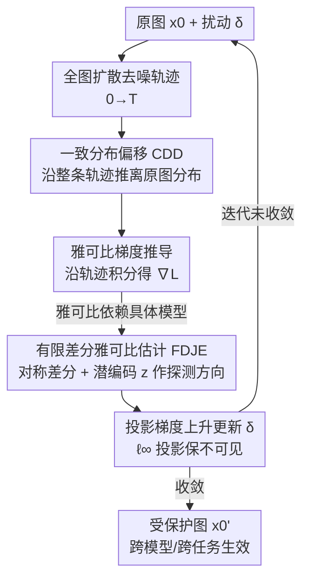

# UniDef: Universal Defense Against Unauthorized Image Manipulation

**会议**: CVPR 2026  
**论文**: [CVF Open Access](https://openaccess.thecvf.com/content/CVPR2026/html/Shao_UniDef_Universal_Defense_Against_Unauthorized_Image_Manipulation_CVPR_2026_paper.html)  
**领域**: AI 安全 / 对抗扰动 / 图像版权保护  
**关键词**: 未授权篡改防御、扩散模型、分布偏移、雅可比估计、可迁移保护

## 一句话总结
UniDef 给图像加上一层不可见的对抗扰动，让任何基于扩散模型的编辑/生成（SD、InstructPix2Pix、超分、图生视频、图生 3D）都生成语义崩坏的结果；它不再只扰动单步去噪方向，而是沿**整条去噪轨迹**把输出分布推离原图，并用**有限差分雅可比估计**做到无需特定模型梯度即可跨模型迁移。

## 研究背景与动机

**领域现状**：扩散模型让"拿一张参考图就能高保真编辑/生成"变得轻而易举，但这也带来隐私和版权风险——任何人的照片都可能被擅自做 deepfake、风格化或重绘。主动防御（active protection）这一路线的思路是：在图像里预先嵌入人眼不可见的对抗扰动 $\delta$，使得未授权的扩散模型一旦拿这张图去编辑，就只能产出扭曲、语义错乱的废图。代表工作有 PhotoGuard/AdvDM（扰动预测噪声）、Mist/ACE（叠加语义+纹理目标制造马赛克伪影）、DiffusionGuard（专攻早期去噪步）、AdvPaint（破坏注意力）等。

**现有痛点**：作者指出这些方法有两个共同的硬伤。其一，它们都只在**单个/局部去噪步**上做手脚（扰动某一步的预测噪声或某层注意力），导致即便扰动生效，生成图往往仍**残留原图或编辑后的语义**——视觉上看得出主体是谁。其二，优化扰动时**强依赖特定模型的梯度**，在 SD v1.4 上优化好的扰动换到 v2.1 或换个下游任务（超分、图生 3D）就大幅失效，缺乏可迁移性。

**核心矛盾**：为什么"局部扰动 + 模型专属梯度"行不通？作者去剖析扩散模型的梯度性质（Fig. 2）：从**局部视角**看，不同扩散变体（SD v1.4/v1.5、IP2P）在低噪声步上的去噪方向差异很大，梯度差异（L2 范数）显著——这正是过拟合单一模型、保护不通用的根源；但从**全局视角**看，所有扩散模型都在干同一件事——把纯噪声还原回原始数据分布，当把整条去噪轨迹积分起来看，它们的梯度差异趋于可忽略。换句话说，**模型在"逐步方向"上各不相同，却在"最终分布目标"上高度一致**。

**本文目标 + 切入角度**：既然局部方向不一致、全局分布一致，那就别在某一步上较劲，而是**直接破坏"最终要收敛到的那个分布"**——把生成结果整体推离原图分布。这样既能彻底抹掉残留语义（全局而非局部），又天然跨模型通用（打的是所有扩散模型共享的目标）。

**核心 idea**：用 **Consistent Distribution Deviation（CDD）** 沿完整去噪过程把输出分布推离原图分布，再用 **Finite Difference-based Jacobian Estimation（FDJE）** 以模型无关的方式估计这条全局轨迹的梯度，从而得到一份"打一次、处处生效"的通用防御扰动。

## 方法详解

### 整体框架
UniDef 的目标是为一张干净图 $x_0$ 求出一份 $\ell_\infty$ 受限的不可见扰动 $\delta$，使受保护图 $x_0' = x_0 + \delta$ 被任意扩散模型处理后，生成结果的分布严重偏离 $x_0$。整体是一个**梯度上升迭代优化**的闭环：在像素空间给图加扰动 → 走完整条扩散去噪轨迹得到分布偏移损失 $L(x_0')$ → 沿轨迹推导该损失对 $x_0'$ 的梯度（雅可比形式）→ 因雅可比依赖具体模型，改用有限差分 + 图像潜编码 $z$ 做模型无关估计 → 用估计梯度做投影梯度上升（PGD）更新 $\delta$ → 迭代收敛后输出受保护图。三个核心组件 CDD / 雅可比推导 / FDJE 分别解决"打哪里""怎么求梯度""怎么去模型依赖"。

### 关键设计

**1. 一致分布偏移 CDD：从"扰一步"升级为"扰整条轨迹"**

针对"局部扰动留残影"的痛点，CDD 把保护目标从单步去噪偏差改写成**对整条去噪轨迹的分布偏移**。作者先给出 Lemma 3.1：存在最优扰动 $\delta$ 使受保护图 $x_0'$ 的输出分布 $p_0$ 偏离原图分布 $q_0$，目标是最大化二者的 KL 散度
$$\delta = \arg\max_{\|\delta\|_p \le \varepsilon} L_{KL}\big(p_0(x_0+\delta)\,\|\,q_0\big) = \arg\max_{\|\delta\|_p \le \varepsilon} \int_0^T w(t)\,\big\|\epsilon_\theta(x_t', t) - \epsilon\big\|_2^2\, dt .$$
关键在那个**时间积分** $\int_0^T$：它把去噪当作连续时间过程，对每个噪声层 $t$ 的去噪偏差 $\|\epsilon_\theta(x_t',t)-\epsilon\|_2^2$ 加权 $w(t)$ 后累加，给出的是"整条轨迹的全局噪声差异"，而不是某一步的局部差异。证明里作者用连续时间的 score 差异表示 KL（$s_\theta - s^\star$ 的轨迹积分），再用单个采样噪声 $\epsilon$ 近似不可计算的真实分布 score、用单样本 $x_t'$ 替代分布级期望（因为目标是针对**这一张图**优化扰动），最终化简成 Eq. (9) 的可优化形式。这样得到的扰动破坏的是"扩散重建在分布层面的结果"，而非表面失真——消融里去掉 CDD 后生成图明显保留原语义（FID 从 405 跌到 140），印证了"全局轨迹"才是抹掉残影的关键。

**2. 雅可比梯度推导：把"分布偏移"翻译成可反传的图像空间梯度**

有了 CDD 的损失，还得求它对像素扰动 $x_0'$ 的梯度才能优化。由于 $\epsilon$ 与 $x_0'$ 无关，微分只经由 $x_t'$ 传播，作者推得单步梯度
$$\nabla_{x_0'}\|\epsilon_\theta(x_t',t)-\epsilon\|_2^2 = 2\sqrt{\bar\alpha_t}\, J_\theta(x_t',t)^\top\big(\epsilon_\theta(x_t',t)-\epsilon\big),$$
其中 $J_\theta(x_t',t)=\partial \epsilon_\theta(x_t',t)/\partial x_t'$ 是去噪器对输入的雅可比。把它代回时间积分，得到对 $x_0'$ 的**全局累积梯度**
$$\nabla_{x_0'}L(x_0') = 2\int_0^T \sqrt{\bar\alpha_t}\, w(t)\, J_\theta(x_t',t)\big(\epsilon_\theta(x_t',t)-\epsilon\big)\, dt .$$
这一步的意义是把抽象的"分布偏移"落到一份能驱动 PGD 的具体梯度上。但问题随之而来：$J_\theta$ 本身就是某个具体去噪网络 $\epsilon_\theta$ 的雅可比，**直接算它等于把扰动绑死在这个模型上**——这正是第二个痛点的来源，于是引出 FDJE。

**3. 有限差分雅可比估计 FDJE：用图像潜编码 z 做模型无关的全局梯度估计**

为摆脱对特定模型的依赖，FDJE 不再显式计算 $J_\theta$。它先用 Hutchinson 迹估计把 $J^\top v$ 写成随机投影的期望 $A^\top v = \mathbb{E}_y[y\langle Ay, v\rangle]$，再用**对称有限差分**近似昂贵的雅可比-向量积（JVP）：
$$\hat J_z(t;z) = \frac{\epsilon_\theta(x_t'+\epsilon_{fd}z,\, t) - \epsilon_\theta(x_t'-\epsilon_{fd}z,\, t)}{2\,\epsilon_{fd}},$$
其中 $\epsilon_{fd}$ 是差分步长（默认 0.01）。这意味着只需对去噪器做两次前向（正负各扰动一点），就能在**不反传、不碰网络内部权重**的情况下探到去噪方向的局部变化——天然不会过拟合某个具体架构。更关键的一笔是探测方向的选择：作者**不用随机向量 $y$，而是用 AutoEncoder 编出的原图潜编码 $z$**（仍服从 $\mathcal{N}(0,I)$）。因为随机方向在高维像素空间里大多与"真正决定语义的方向"无关，估出的全局梯度不准；而 $z$ 是与图像内容对齐、分布一致的方向，能给出语义感知的梯度估计。消融证实：把 $z$ 换成随机向量（w/o z）后，生成图仍保留原图主体结构，说明随机方向估不准全局去噪方向；去掉整个 FDJE（w/o FDJE）则跨任务（IP2P）泛化明显变差，正是过拟合特定梯度所致。

### 损失函数 / 训练策略
优化在像素空间对 $\delta$ 做投影梯度上升（PGD），第 $i$ 步更新为
$$\delta^{(i)} = \Pi_{\|\delta\|_\infty \le \xi}\Big(\delta^{(i-1)} + \eta\,\mathrm{sign}\big(\nabla_{x_0'}L(x_0')\big)\Big),$$
$\eta$ 为步长，$\Pi$ 把扰动投影到 $\ell_\infty$ 球内以保证不可见性。默认 $\xi = 16/255$、$\epsilon_{fd}=0.01$，扰动在 SD v1.4 上生成，再迁移到其他模型与任务测试，单张 RTX 4090 即可运行。

## 实验关键数据

数据：ImageNet 100 张 + Landscape 100 张（涵盖人物、物体、场景），统一中心裁剪到 512×512。指标 PSNR↓、CLIP↓、FID↑、LPIPS↑ 均在"原始编辑结果 vs 受保护图编辑结果"间计算——防御越强，受保护图导致的输出越偏离原图，故 PSNR/CLIP 越低、FID/LPIPS 越高越好。

### 主实验：跨模型保护（扰动在 SD v1.4 上生成）

| 测试模型 | 指标 | UniDef | 次优基线 | 说明 |
|----------|------|--------|----------|------|
| SD v1.4 | FID↑ / CLIP↓ | **405.54** / 0.9011 | Mist 380.20 / AdvDM 0.8545 | FID 大幅领先，分布偏移最强 |
| SD v1.5 | FID↑ / LPIPS↑ | **400.01** / **0.6053** | ACE 379.92 / SDS 0.6951 | 同源模型上保护最彻底 |
| SD v2.1 | FID↑ / PSNR↓ | **359.29** / **15.51** | AdvPaint 332.18 / Mist 17.22 | 跨到异构 v2.1 仍最优 |

CLIP 个别格未必绝对最低（如 SD v1.4 上 AdvDM 的 0.8545 更低），但 UniDef 在反映"整体分布偏离"的 FID 上**全面、大幅领先**，且 PSNR/LPIPS 同样最优，说明它破坏的是分布层面的重建一致性，而非只制造表面伪影。

### 跨任务泛化（SD v1.4 扰动直接迁移，Table 2）

| 任务 | UniDef CLIP↓ / FID↑ | 次优 | 结论 |
|------|---------------------|------|------|
| InstructPix2Pix | 0.8086 / 239.88 | ACE 0.8138 / AdvPaint 195.01 | 编辑语义被彻底打乱 |
| Inpainting | 0.8371 / 251.61 | ACE 0.8404 / AdvPaint 240.07 | 重绘区域结构崩坏 |
| Super-Resolution | 0.9198 / 277.11 | ACE 0.9262 / Mist 202.37 | 超分纹理失真最强 |
| Image-to-Video (SVD) | 0.8852 / 107.04 | AdvPaint 0.8876 / SDS 94.45 | 视频时序语义被破坏 |
| Image-to-3D (Zero123++) | 0.7378 / 245.17 | Mist 0.7445 / Mist 187.95 | 3D 重建视角一致性被毁 |

五个下游任务上 UniDef **同时取得最低 CLIP 与最高 FID**，证明它打的是所有任务共享的底层生成分布，而非某个任务专属机制。

### 消融实验（Table 4，SD v1.4 / IP2P 两列）

| 配置 | SD v1.4 FID↑ | IP2P CLIP↓ | 说明 |
|------|--------------|-----------|------|
| w/o CDD | 140.31 | 0.8277 | 去掉全局分布偏移，残留原语义，FID 暴跌 |
| w/o FDJE | 242.84 | 0.8238 | 退回模型专属梯度，跨任务泛化变差 |
| w/o z（用随机向量） | 164.52 | 0.8155 | 随机方向估不准全局梯度，保留主体结构 |
| Full UniDef | **405.54** | **0.8086** | 三者齐备，分布偏移与泛化俱佳 |

### 鲁棒性（Table 3，后处理攻击）

| 后处理 | PSNR↓ | CLIP↓ | FID↑ | 表现 |
|--------|-------|-------|------|------|
| 无处理 | 16.40 | 0.9011 | 405.54 | 基准 |
| JPEG 压缩 | 17.56 | 0.8940 | 155.37 | FID 降但语义仍乱 |
| 裁剪 / 仿射 | ~18 | ~0.89–0.91 | ~182 | 几何变换下稳定 |
| 外部去噪 | 20.56 | 0.9356 | 93.56 | 唯一明显削弱，仍维持低语义对齐 |

### 关键发现
- **CDD 贡献最大**：去掉它 FID 从 405 直接跌到 140，且生成图重新保留原语义——印证"全局轨迹偏移"是抹掉残影的核心，单步扰动远远不够。
- **FDJE 决定跨任务泛化**：去掉后 IP2P 上保护变弱，因为退回到模型专属反传梯度会过拟合 SD v1.4 自身。
- **潜编码 z 不可替换**：用随机向量做探测方向，生成图仍保留主体结构，说明随机方向无法对齐语义、估不准全局去噪方向。
- **去噪是最强攻击**：外部去噪能把 FID 从 405 压到 93，是唯一显著削弱防御的后处理；JPEG/裁剪/仿射/加噪下保护基本稳定。

## 亮点与洞察
- **"局部各异、全局一致"这一观察是全文支点**：作者用梯度差异随去噪步收敛的实证（Fig. 2）把"为什么要打全局分布而非局部步"讲成了一个有依据的设计动机，而不是空喊"我们更通用"。这种"先找模型间的不变量、再攻击不变量"的思路可迁移到任何需要跨模型攻击/防御的场景。
- **用图像自己的潜编码 z 当雅可比探测方向**很巧：既满足 $\mathcal{N}(0,I)$ 的理论要求，又自带语义对齐，把"无意义的随机探测"换成"内容感知的探测"，这是 w/o z 消融大掉点的根因，也是个可复用的 trick。
- **有限差分换掉 JVP** 让整套保护无需对去噪器反传、不碰模型内部，因此天然模型无关——这是"打一次、处处生效"工程上能成立的关键。

## 局限与展望
- **对外部去噪鲁棒性偏弱**：Table 3 中去噪把 FID 从 405 压到 93、PSNR 升到 20.56，是最有效的反制；现实中攻击者只要先跑一遍去噪/超分预处理，保护强度就会明显下降。
- **评测规模较小**：每个数据集仅 100 张、固定 512×512，且只在 SD 系 + 几个代表性下游模型上验证，对更新的扩散架构（如 SDXL、DiT/Flux 类、商用闭源 API）能否同样迁移未知。
- **CLIP 指标并非全面占优**：个别设置下基线 CLIP 更低，论文主要靠 FID 论证优势；"分布偏移大"是否等价于"用户主观上更难辨认主体"还缺更直接的人评。
- **可改进方向**：在优化目标里显式加入对去噪/JPEG 的对抗鲁棒项（EoT 式期望变换训练），有望补上去噪这块短板。

## 相关工作与启发
- **vs AdvDM / PhotoGuard**: 它们扰动潜空间/像素空间的预测噪声，本质是单步去噪方向扰动；UniDef 改为沿整条轨迹做分布偏移，抹掉的是最终分布而非某步方向，故残留语义更少。
- **vs Mist / ACE**: 二者叠加语义+纹理目标制造规则马赛克伪影，视觉上仍能辨认主体结构；UniDef 在分布层面破坏，输出更彻底地不可辨认（Fig. 4/5 定性对比）。
- **vs DiffusionGuard / AdvPaint**: 它们分别专攻早期去噪步或注意力机制，是任务/阶段特化策略；UniDef 打的是所有扩散模型共享的全局分布目标，因此首次做到跨模型跨任务的通用防御。
- **vs SDS**: SDS 用 score distillation sampling 损失替代全梯度计算以提效，但仍依赖具体模型梯度；UniDef 的 FDJE 用有限差分 + 潜编码 z 实现真正的模型无关估计。

## 评分
- 新颖性: ⭐⭐⭐⭐⭐ 「局部各异、全局一致」的观察 + CDD 全局分布偏移 + FDJE 模型无关雅可比估计，首个跨模型跨任务的通用防御框架。
- 实验充分度: ⭐⭐⭐⭐ 三模型 + 五任务 + 鲁棒性 + 三项消融较完整，但每集仅 100 张、未覆盖 SDXL/DiT 类新架构。
- 写作质量: ⭐⭐⭐⭐ 动机—观察—方法推导链条清晰，公式与 Lemma 推导完整；个别符号渲染（缓存版）略乱但不影响理解。
- 价值: ⭐⭐⭐⭐ 直击 AIGC 时代图像版权/隐私防护的真实痛点，通用性强、单卡可跑，落地潜力大；去噪鲁棒性待加强。

<!-- RELATED:START -->

## 相关论文

- [\[CVPR 2026\] Forensic-Friendly Image Manipulation via Controllable Latent Diffusion](forensic-friendly_image_manipulation_via_controllable_latent_diffusion.md)
- [\[CVPR 2026\] No Way To Steal My Face: Proactive Defense Against Identity-Preserving Personalized Generation](no_way_to_steal_my_face_proactive_defense_against_identity-preserving_personaliz.md)
- [\[CVPR 2026\] AdvMark: Decoupling Defense Strategies for Robust Image Watermarking](decoupling_defense_strategies_for_robust_image_watermarking.md)
- [\[CVPR 2026\] Frequency-domain Manipulation for Face Obfuscation](frequency-domain_manipulation_for_face_obfuscation.md)
- [\[CVPR 2026\] R$^2$TUA: Reconstruction-residual Based Targeted and Untargeted Attack Against Text-Image Person Re-Identification](r2tua_reconstruction-residual_based_targeted_and_untargeted_attack_against_text-.md)

<!-- RELATED:END -->
