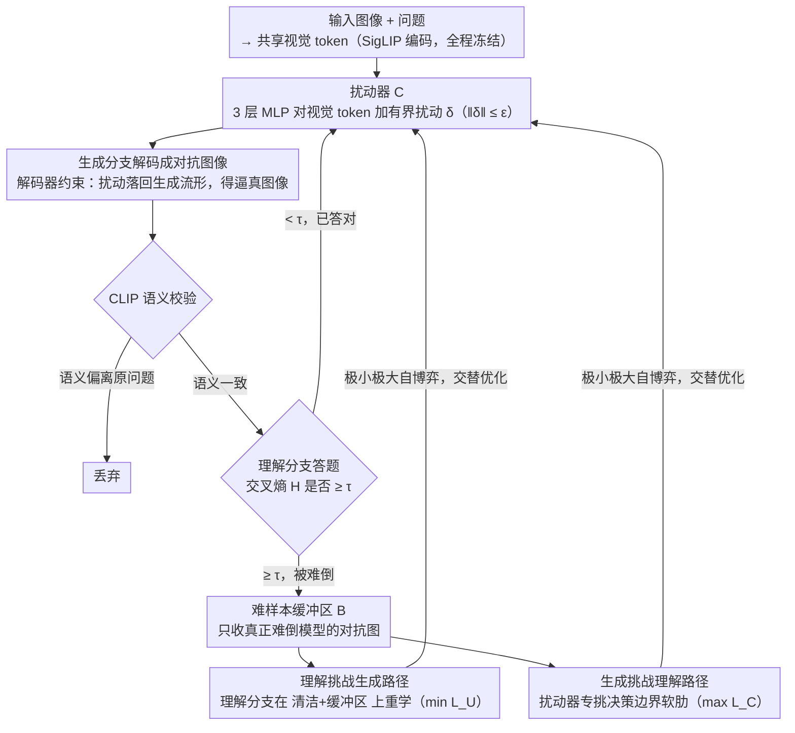

# UniGame: Turning a Unified Multimodal Model Into Its Own Adversary

**会议**: CVPR 2026  
**arXiv**: [2511.19413](https://arxiv.org/abs/2511.19413)  
**代码**: [https://github.com/AIFrontierLab/TorchUMM](https://github.com/AIFrontierLab/TorchUMM)  
**领域**:AI安全
**关键词**: 统一多模态模型, 自对抗训练, 一致性, 后训练, 极小极大优化

## 一句话总结
UniGame 提出首个针对统一多模态模型（UMM）的自对抗后训练框架，通过在共享视觉 token 接口安装轻量扰动器，让生成分支主动创造语义一致的对抗样本来挑战理解分支，形成极小极大自博弈，显著提升一致性 (+4.6%)、理解 (+3.6%)、生成和鲁棒性。

## 研究背景与动机

1. **领域现状**：统一多模态模型（UMM，如 Janus-Pro、Emu3、BLIP3-o）用一个架构同时做视觉理解和图像生成，通过共享语言模型骨干和视觉 tokenizer-decoder 栈实现。标准后训练流程是 SFT 监督微调。

2. **现有痛点**：UMM 存在理解和生成路径之间的**结构性不一致**——理解偏好紧凑嵌入，生成偏好重建丰富的表示。这种矛盾导致语义不匹配（回答正确但生成不出对应图像）、能力差距（某一路径更难提升）和特征紧凑度冲突。在分布外和对抗场景下问题更严重。

3. **核心矛盾**：现有后训练方法（重建类如 RecA、奖励类如 T2I-R1）都在**固定数据分布**上优化代理目标，没有显式约束两个耦合分支，只是在舒适区内打磨行为，无法真正扩展共享生成流形。嵌入空间的对抗扰动容易产生离流形的无意义样本。

4. **本文目标** 能否让 UMM 从内部发现并纠正自身的不一致性？即利用生成分支作为理解分支的主动对手，让模型成为自己的对手。

5. **切入角度**：对抗信号可以可靠地暴露视觉-语言模型中脆弱的推理（已有工作验证）。关键是要让对抗扰动通过解码器约束，产生视觉上逼真、语义上合理的反例，而非抽象嵌入空间中的噪声。

6. **核心 idea**：将 UMM 的生成路径转化为主动对手，在共享 token 空间施加解码器约束的扰动，生成语义一致的对抗样本来强化理解，形成极小极大自博弈。

## 方法详解

### 整体框架
UniGame 想解决的是 UMM 里理解和生成两条路径"各练各的、互不约束"的结构性不一致。它的做法是把生成路径变成理解路径的陪练：在标准 UMM（如 Janus-Pro-7B）的共享视觉 token 接口上挂一个轻量扰动器，让它故意把视觉 token 推到理解分支容易出错的方向，再经模型自有的解码器把扰动 token 解码成一张真实图像，重新喂回理解分支去答题。整条链路是 `视觉 token → 扰动 → 解码成对抗图像 → CLIP 语义校验 → 进难样本缓冲区 → 理解分支在其上重新学习`，理解分支努力答对、扰动器努力出难题，两者交替优化构成一场极小极大自博弈。整个过程冻结视觉编码器（SigLIP），只训练 LLM 的 LoRA adapter 和扰动器 MLP，额外参数 <1%（~2.1M/7B）。

### 关键设计

**1. 扰动器 $C$：让对抗扰动"经过解码器"而非停在嵌入空间**

传统做法是直接在视觉嵌入上加噪声，但嵌入空间的对抗扰动很容易跑到流形之外，变成视觉上毫无意义、和语义脱钩的噪声，训出来的鲁棒性没法迁移到真实输入。扰动器是个 3 层 MLP，对共享视觉 token 做有界扰动 $\tilde{\mathbf{z}} = C(\hat{\mathbf{z}}; \theta_C) = \hat{\mathbf{z}} + \boldsymbol{\delta}$，其中 $\|\boldsymbol{\delta}\| \leq \varepsilon_{\max}$（归一化 + 裁剪保证有界）。关键不在 MLP 本身，而在扰动后的 token **必须再经过模型自带的生成分支解码回图像** $\tilde{\mathbf{x}} = G(\tilde{\mathbf{z}})$——这一步把扰动隐式约束在了生成流形上，解码出来的对抗图像是视觉上逼真的，理解分支在它上面犯的错才是"真错"。消融验证仅这一条解码约束就把 VQAv2 从 79.6% 拉到 81.5%（+1.9）。

**2. 难样本缓冲区 $\mathcal{B}$：只留真正难倒模型的那些对抗图**

扰动器一通乱推会产生大量无效样本，全拿去训练既浪费算力又稀释信号。缓冲区只收那些让理解分支真正答错的解码样本：$\mathcal{B} = \{G(\tilde{\mathbf{z}}) \mid H(\tilde{\mathbf{z}}) \geq \tau\}$，其中 $H$ 是理解分支在该样本上的交叉熵损失，超过阈值 $\tau$ 才入库。这样理解分支每一步都在"当前模型最薄弱的边界"上练，而不是反复刷已经会做的题。缓冲区开 50 最佳，开太小（如 10 只有 82.5%）样本多样性不足。

**3. "理解挑战生成"路径：理解分支既不忘老本、又啃硬骨头**

光在对抗样本上训会让模型遗忘原本会做的清洁样本。这条路径用两项损失把两边拴住：$\mathcal{L}_U = \mathbb{E}_{\text{clean}}[\text{CE}(p_U(\hat{a}|\mathbf{z},q), a)] + \beta \mathbb{E}_{\mathcal{B}}[\text{CE}(p_U(\hat{a}|\mathbf{z},q), a)]$。第一项守住清洁数据上的准确率，第二项强制在缓冲区里挖出的难样本上也答对，$\beta$ 平衡两者权重。结果是理解分支被逼着把决策边界往更鲁棒的方向挪，而不是为了刷对抗样本牺牲基础能力。

**4. "生成挑战理解"路径：扰动器专挑决策边界的软肋，且不许乱来**

扰动器的优化目标和理解分支正好相反——它要最大化理解分支的损失，把样本往最迷惑人的方向推：$\mathcal{L}_C = \mathbb{E}[\text{CE}(p_U(\hat{a}|\text{Enc}(G(C(\hat{\mathbf{z}}))), q), a)] - \lambda\|\boldsymbol{\delta}\|^2$。第一项让对抗样本尽量难倒理解，第二项 $\lambda\|\boldsymbol{\delta}\|^2$ 正则化按住扰动幅度防止它直接破坏图像。此外还套一道 CLIP 语义一致性检查，确保解码出的对抗图仍和原始问题语义对齐（消融里 CLIP 约束 82.7% 优于纯余弦几何约束 82.2%）。两道约束合起来，扰动器找的是"语义没变但理解会答错"的样本——也就是模型真正的推理漏洞，而非随机噪声。

### 一个完整示例：一轮自博弈怎么走
拿一张图配问题"图里有几只猫？"（答案 2）走一遍：理解分支在清洁图上能答对。扰动器把这张图的视觉 token 加上有界扰动 $\boldsymbol{\delta}$，经生成分支解码成一张视觉上几乎一样、但局部纹理被悄悄改过的新图 $\tilde{\mathbf{x}}$；CLIP 检查确认这张图语义上还是"两只猫"（没被改成别的东西）。把 $\tilde{\mathbf{x}}$ 重新喂回理解分支，这次它答成了 3——交叉熵损失飙高，超过阈值 $\tau$，于是这张"难图"连同正确答案 2 一起进缓冲区。下一步理解分支在 $\mathcal{L}_U$ 里同时看清洁图和缓冲区里这张难图，被迫把"易把相邻纹理误数成一只猫"的弱点补上；与此同时扰动器在 $\mathcal{L}_C$ 里继续找新的薄弱处。作者观察到训练 5K 步后，难样本损失持续主导清洁/对抗损失，说明扰动器始终在制造对当前模型最有挑战的样本，自博弈没有早早收敛到平凡解。

### 损失函数 / 训练策略
整体是极小极大优化 $\min_{\theta_U} \max_{\theta_C} (\mathcal{L}_U(\theta_U) + \lambda \mathcal{L}_C(\theta_C; \theta_U))$，理解分支和扰动器交替更新。训练数据用 VQAv2 训练集和 CC3M；SigLIP 视觉编码器全程冻结，只训 LLM 的 LoRA adapter 加扰动器 MLP，额外参数 <1%（~2.1M/7B）。

## 实验关键数据

### 主实验：一致性评估

| 模型 | Params | UnifiedBench | WISE | Consistency Score |
|------|--------|-------------|------|-------------------|
| BAGEL | 14B | 83.48 | 0.41 | 66.49 |
| Janus-Pro (baseline) | 7B | 82.77 | 0.35 | 63.66 |
| Janus-Pro+SFT | 7B | 83.20 | 0.37 | 64.72 (+1.06) |
| **Janus-Pro+UniGame** | **7B** | **85.20** | **0.43** | **68.32 (+4.66)** |

### 理解 + 鲁棒性

| 基准 | Baseline | SFT | UniGame | 提升 |
|------|---------|-----|---------|------|
| VQAv2 | 78.2 | 79.5 | **83.4** | +5.2 |
| MMMU | 41.0 | 41.2 | **43.8** | +2.8 |
| POPE | 87.4 | 87.6 | **89.6** | +2.2 |
| NaturalBench (OOD) | — | — | — | **+4.8%** |
| AdVQA (对抗) | — | — | — | **+6.2%** |

### 消融实验：嵌入扰动 vs 解码器约束扰动

| 方法 | VQAv2 准确率 |
|------|------------|
| Baseline (SFT) | 79.5 |
| 嵌入随机噪声 | 78.5 |
| 嵌入对抗扰动 | 78.9 |
| 嵌入对抗 + Cosine + Buffer | 80.2 |
| **解码器约束（仅解码）** | **81.5** |
| 解码器 + Cosine | 82.2 |
| 解码器 + CLIP | 82.7 |
| **Full (解码器 + CLIP + Buffer)** | **83.4** |

### 关键发现
- 解码器约束是核心——仅解码约束就比最佳嵌入扰动高 1.3%（81.5 vs 80.2），因为嵌入空间扰动与视觉语义断联
- CLIP 语义匹配优于余弦几何约束（82.7 vs 82.2），语义约束确保对抗样本的语义一致性
- 3层 MLP 扰动器最优（83.4%），2层（82.8%）太弱、4层（81.2%）过拟合
- Buffer 大小 50 最佳，太小（10: 82.5%）多样性不够
- 难样本损失在 5K+ 训练步后持续主导清洁/对抗损失，说明 UniGame 持续生成对当前模型最有挑战的样本
- 可插入现有流程：在 RecA 基础上加 UniGame 5K 步（~10 GPU-h），MMMU +0.5、UnifiedBench +1.27

## 亮点与洞察
- **"让模型成为自己的对手"**：将 UMM 的生成路径转为对抗训练的天然能力来源，不需要外部判别器或奖励模型。这个思路非常优雅——UMM 的双分支架构天然适合自博弈。
- **解码器约束的对抗**：不在抽象嵌入空间扰动，而是让扰动通过解码器"落地"为真实图像，隐式约束在流形上。这解决了传统对抗训练中离流形样本的核心问题。
- **架构无关 + 即插即用**：仅需 <1% 额外参数，可与 RecA、T2I-R1 等现有方法互补。

## 局限与展望
- 主要在 Janus-Pro-7B 上评估，其他 UMM 架构（如 BLIP3-o、Emu3）的验证有限（仅在 toy model 上初步验证）
- 训练数据仅用 VQAv2 和 CC3M，更大规模和更多样的数据可能释放更大潜力
- 目前仅构造图像级对抗样本，视频 UMM 的时序对抗尚未探索
- 极小极大训练的稳定性依赖超参数调优（$\varepsilon_{\max}$、$\tau$、$\beta$、学习率比），虽然作者声称鲁棒但实际部署可能需要仔细调整
- 生成质量提升幅度相对有限（GenEval +0.02），可能因为扰动主要在理解侧优化

## 相关工作与启发
- **vs RecA**: RecA 用重建损失对齐理解和生成表示（被动协作），UniGame 用对抗博弈主动扩展共享流形。两者互补，叠加使用有进一步提升。
- **vs VILLA**: VILLA 在嵌入空间做大规模扰动提升鲁棒性，但扰动不经解码器约束。UniGame 的解码器约束扰动产生更有效的在流形对抗样本。
- **vs GAN**: GAN 需要额外判别器，UniGame 利用 UMM 自有的理解分支作为判别器。且 UniGame 同时目标理解与生成。

## 评分
- 新颖性: ⭐⭐⭐⭐⭐ 首个 UMM 自对抗后训练框架，将生成分支作为理解的对手，理念新颖
- 实验充分度: ⭐⭐⭐⭐ 一致性、理解、生成、OOD、对抗五维评估全面，消融细致
- 写作质量: ⭐⭐⭐⭐ 动机论述清晰，与 GAN/AT/reconstruction 的区别分析到位
- 价值: ⭐⭐⭐⭐ 对 UMM 后训练和一致性改进有重要参考价值，自博弈思路可推广

<!-- RELATED:START -->

## 相关论文

- [\[CVPR 2026\] Omni-Fake: Benchmarking Unified Multimodal Social Media Deepfake Detection](omni-fake_benchmarking_unified_multimodal_social_media_deepfake_detection.md)
- [\[CVPR 2026\] SafeLogo: Turning Your Logos into Jailbreak Shields via Micro-Regional Adversarial Training](safelogo_turning_your_logos_into_jailbreak_shields_via_micro-regional_adversaria.md)
- [\[CVPR 2026\] FedAFD: Multimodal Federated Learning via Adversarial Fusion and Distillation](fedafd_multimodal_federated_learning_via_adversarial_fusion_and_distillation.md)
- [\[CVPR 2026\] A Unified Perspective on Adversarial Membership Manipulation in Vision Models](a_unified_perspective_on_adversarial_membership_manipulation_in_vision_models.md)
- [\[CVPR 2026\] FVBench: Benchmarking Deepfake Video Detection Capability of Large Multimodal Models](fvbench_benchmarking_deepfake_video_detection_capability_of_large_multimodal_mod.md)

<!-- RELATED:END -->
