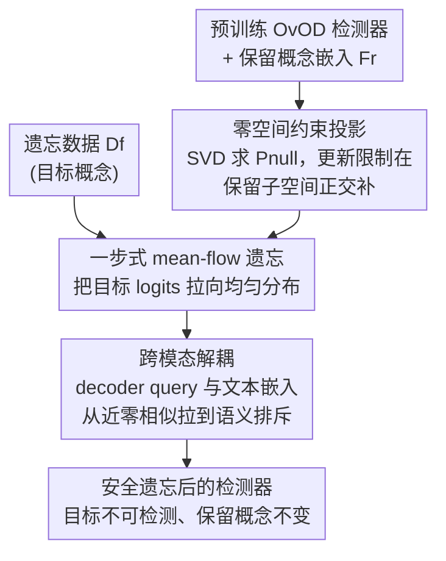

# Unlearning without Forgetting: Securely Removing Targeted Concepts from Large-Scale Vision-Language Open-Vocabulary Detectors

**会议**: CVPR 2026  
**论文**: [CVF Open Access](https://openaccess.thecvf.com/content/CVPR2026/html/Wu_Unlearning_without_Forgetting_Securely_Removing_Targeted_Concepts_from_Large-Scale_Vision-Language_CVPR_2026_paper.html)  
**领域**: AI安全 / 机器遗忘  
**关键词**: 机器遗忘, 开放词表检测, 零空间投影, 跨模态解耦, 隐私合规

## 一句话总结
SafeDetect 把开放词表检测器（GroundingDINO、LLM-Det）的概念遗忘约束在"保留概念子空间的零空间"里更新参数，配合一步式 mean-flow 遗忘目标和跨模态解耦损失，在删除目标概念（如人脸、特定人物）的同时几乎不损伤保留概念与零样本泛化，遗忘效力比 NPO 提升 64.75%，收敛快 1.5×。

## 研究背景与动机
**领域现状**：开放词表检测器（OvOD）继承了 VLM 在网络规模数据上预训练得到的跨模态知识，能对几乎无限的词表做开放检测（OD）、短语定位（PG）、指代表达理解（REC）。但正因为它"什么都能检测"，把社交媒体爬来的人脸、监控场景里的特定个体都囊括进去，带来了隐私、版权与合规风险。法规（如被遗忘权）要求模型能选择性删除特定概念，而从头重训练成本高到不现实（论文给的对照是：遗忘只动 1.8% 数据、1.77 小时、2GB 存储，重训则要全量数据与 GPU 资源）。

**现有痛点**：机器遗忘（MU）在 LLM/MLLM 和闭集分类里已有成效，但搬到 OvOD 上集体失灵——要么删不干净（目标概念还能被检测出来），要么删过头把相关概念和未见概念的泛化能力一起毁掉。论文用一张定性图说明：让模型遗忘 "face、woman" 时，现有方法连 "bowl" 的检测都丢了。

**核心矛盾**：作者把根因诊断为**几何纠缠干扰（geometric entanglement interference）**。VLM 嵌入具有线性可分解结构——一个概念 $z$ 的嵌入可写成全局偏移加上若干语义因子之和 $\bar{\ell}_z = \bar{\ell}_0 + \sum_{i=1}^k \bar{\ell}_{z_i}$。于是 "woman" 和 "person" 共享 $\bar{\ell}_{\text{human}}$ 这样的因子，二者嵌入在共享子空间上重叠（$\text{span}(F_f) \cap \text{span}(F_r) \neq \emptyset$）。传统遗忘只在 loss 层做平衡 $\mathcal{L}_{\text{MU}} = \lambda_f \mathcal{L}_{\text{forget}} + \lambda_r \mathcal{L}_{\text{retain}}$，由此产生的更新 $\Delta W = -\eta \nabla_W \mathcal{L}_{\text{MU}}$ 不可避免地在保留子空间上有非零投影 $\langle \Delta W_f, \mathbf{f}_c \rangle \neq 0$，即遗忘 "woman" 会顺带改写 "person/child" 乃至未见的人类相关概念。

**本文目标**：在删除目标概念的前提下，从几何根源上杜绝对保留知识的干扰，同时给 OvOD 遗忘提供一个统一可复现的评测基准。

**切入角度**：既然干扰来自更新方向落入了保留子空间，那就把更新方向**强制约束到保留子空间的正交补（零空间）**——数学上保证"删除操作碰不到保留概念的方向"。

**核心 idea**：用零空间投影替代 loss 层平衡来做遗忘——把任何参数更新分解成切向分量（造成干扰，丢弃）和法向分量（安全，保留），只允许在法向分量上更新。

## 方法详解

### 整体框架
SafeDetect 是一个"几何约束遗忘"框架，输入是预训练好的 OvOD 检测器、一小批要遗忘的概念数据 $\mathcal{D}_f$ 和保留概念的文本嵌入；输出是删除了目标概念、但保留概念与零样本能力几乎不变的检测器。整条管线分三步：先**离线**从保留概念嵌入构造零空间投影器 $P_{\text{null}}$，把它当作"安全护栏"；然后在这个护栏内用**一步式 mean-flow 目标**把目标概念的检测输出拉向均匀分布（让模型对目标"无法判别"）；最后用**跨模态解耦损失**切断 decoder query 与文本嵌入之间的关联，防止模型通过同义词/换说法把"删掉"的概念又召回。三步分别对应"安全护栏 + 遗忘驱动 + 防召回"，缺一不可。

### 关键设计

**1. 零空间约束的知识投影：把更新关进保留子空间的正交补**

这是对付几何纠缠干扰的核心。痛点在于：传统遗忘的更新 $\Delta W$ 会在保留概念方向上留下投影，于是删 A 伤 B。SafeDetect 的要求是让所有更新满足 $\Delta W \cdot F_r = 0$（$F_r$ 是保留嵌入矩阵），这样对任意保留概念 $c$，区域-文本对齐不变：

$$(W + \Delta W) \cdot \mathbf{f}_c = W \cdot \mathbf{f}_c + \underbrace{\Delta W \cdot \mathbf{f}_c}_{=0} = W \cdot \mathbf{f}_c.$$

具体做法：对保留嵌入 $F_r = [\mathbf{f}_{c_1}, \dots, \mathbf{f}_{c_k}]$ 做 SVD $F_r = U\Sigma V^T$，取奇异值大于阈值 $\varepsilon = 10^{-2}$ 的奇异向量组成 $U_r$，得到保留投影器 $P_{\text{keep}} = U_r U_r^T$，零空间投影器即 $P_{\text{null}} = I - U_r U_r^T$。把任一更新分解为 $\Delta W = P_{\text{keep}}\Delta W + P_{\text{null}}\Delta W$，其中前者是造成干扰的切向分量、后者是保持"保留不变性"的法向分量。只保留法向分量，一阶干扰就被消掉：$\langle P_{\text{null}}\Delta W, \mathbf{f}_c \rangle = 0,\ \forall c \in \mathcal{C}_{\text{retain}}$。由线性可分解性，这种保护会自动推广到任何共享因子 $\mathbf{f}_{\text{shared}} \in \text{span}(F_r)$，所以删 "woman" 时 "person/human" 这些共享因子被原样保住，组合概念（如 "person wearing red shirt"）也跟着受保护。投影器是**离线预计算**的，按模块差异化施加：同维模块（分类头、decoder query）直接 $W' \leftarrow P_{\text{null}}W$ 一次性投影；跨维模块（bbox head、decoder 层）构造模块专属投影器；LoRA 适配器（$\Delta W = BA$）则把约束施加到直接接触嵌入的适配矩阵上，保证 $(BA)\cdot \mathbf{f}_c = 0$。

**2. 一步式 mean-flow 遗忘目标：直接把目标概念推向"不可判别"**

光有护栏还不会主动遗忘，这一项负责"删"。痛点是传统遗忘要多步迭代优化，容易训练不稳、梯度冲突。作者的观察是：对目标类别输出**均匀分布**就等价于最大熵、即"完全无法判别"的遗忘状态。受 mean-flow 模型"一步生成"启发，他们设计一步式目标，直接把检测输出朝均匀分布拉：

$$\mathcal{L}_{\text{flow}}^{(\mathcal{D}_f)} = \mathbb{E}_{x \in \mathcal{D}_f}\, \text{KL}\!\left(\text{softmax}(\mathbf{z}_\theta(x)/\tau),\, \mathcal{U}\right),$$

其中 $\mathbf{z}_\theta(x)$ 是模型对目标类的 logits，$\mathcal{U} = \text{uniform}(|\mathcal{C}_{\text{forget}}|)$。它直接把"自信预测 $p_\theta(c_f|x) \gg 1/|\mathcal{C}_{\text{forget}}|$"压成"近均匀 $p_\theta(c_f|x) \approx 1/|\mathcal{C}_{\text{forget}}|$"，把类别感知检测变成类别无关状态，避免了迭代优化的不稳定。

**3. 跨模态解耦：堵住"换个说法又召回"的后门**

即便输出层压住了，OvOD 仍可能通过跨模态通路把概念召回——删了 "dog"，换 "puppy/canine/four-legged pet" 还能触发检测。作者区分了**表层遗忘**与**深层遗忘**：直接压 bbox 分类头属于表层遗忘，内部表征其实还认得目标，只是被逼在输出层"说谎"，对手抽中间特征就能还原，安全性不足；而且把高度对齐的分类输出从 +1.0 直接翻到 -1.0 会造成灾难性梯度冲突。SafeDetect 转而对 **decoder query 特征** 做表征级解耦——这些 query 作为通用定位表征，初始与文本嵌入近乎零相似，更适合温和地推向"语义排斥"：

$$\mathcal{L}_{\text{decouple}} = \mathbb{E}_{(v,f)\in\mathcal{D}_f}\left[\ell_{\text{CE}}(-\mathbf{S}, \mathbf{I}) + \ell_{\text{CE}}(-\mathbf{S}^\top, \mathbf{I})\right]/2,$$

其中 $S_{ij} = \text{sim}(v_i, f_j)/\tau$（$\tau = 0.07$），$\mathbf{I}$ 是单位矩阵。负号把优化方向反转去最小化对角相似度，让对齐从 $0 \to -0.8$ 平滑滑向负值，实现深层解耦而不破坏稳定性。最终统一目标为 $\mathcal{L}_{\text{total}}^{(\mathcal{D}_f)} = \lambda_{\text{flow}}\mathcal{L}_{\text{flow}}^{(\mathcal{D}_f)} + \lambda_{\text{decouple}}\mathcal{L}_{\text{decouple}}^{(\mathcal{D}_f)}$，只在 $\mathcal{D}_f$ 上、且全程被零空间约束包住，因而摆脱了 loss 层平衡，得到稳定的一步式遗忘。

### 损失函数 / 训练策略
LoRA rank $r=128$、$\alpha=256$ 做参数高效微调；$\lambda_{\text{flow}} = \lambda_{\text{decouple}} = 1.0$，温度 $\tau = 0.07$，学习率 $2\times10^{-5}$，AdamW，batch size 64，训练 15 epoch，8× A800。保留文本嵌入与零空间投影器全部离线预计算。

## 实验关键数据

### 主实验
UOD-Bench 上覆盖 OD / PG / REC 三任务、四个遗忘比例（1%–15%）、两个 backbone（LLM-Det Swin-T、GroundingDINO Swin-L）。指标：Forget（↓越低越好）、Retain（↑越高越好）、U-Score（遗忘下降与保留的调和均值，↑越高越好）。下表摘取 LLM-Det Swin-T 上 OD 任务的 1% 与 15% 比例：

| 比例 | 方法 | Forget mAP↓ | Retain mAP↑ | U-Score↑ |
|------|------|------|------|------|
| 1% | Vanilla | 58.0 | 20.7 | - |
| 1% | GA | 57.2 | 20.6 | 2.7 |
| 1% | NPO | 50.5 | 15.2 | 10.0 |
| 1% | MultiDelete | 47.3 | 16.0 | 12.5 |
| 1% | **SafeDetect** | **17.8** | **16.6** | **23.5** |
| 15% | NPO | 29.1 | 14.1 | 5.6 |
| 15% | MultiDelete | 27.5 | 16.6 | 7.8 |
| 15% | **SafeDetect** | **22.3** | **17.2** | **12.9** |

1% 比例下 SafeDetect 把目标 mAP 从 58.0 压到 17.8（NPO 仅压到 50.5），即遗忘效力相对 NPO 提升 64.75%，同时 Retain 反而高于 NPO。

零样本泛化（LLM-Det Swin-T，在 LVIS-minival / COCO 上、不排除类别评测）：

| 比例 | 指标 | NPO | SafeDetect |
|------|------|------|------|
| 1% | LVIS AP↑ | 31.2 | 38.5 |
| 1% | COCO AP↑ | 40.5 | 48.2 |
| 平均掉点 | LVIS AP | 14.2 | 8.3 |
| 平均掉点 | COCO AP | 15.0 | 8.1 |

SafeDetect 在 LVIS AP 上平均只掉 8.3 点 vs. NPO 的 14.2 点（降级减少 41.5%），印证几何保护对泛化的作用。

### 消融实验
核心组件消融（LLM-Det Swin-T，OD 任务）：

| 配置 | Forget mAP↓ (1%) | Retain mAP↑ (1%) | U-Score↑ (1%) |
|------|------|------|------|
| Vanilla | 58.0 | 20.7 | - |
| 仅零空间 | 42.5 | 18.2 | 16.7 |
| 零空间 + mean-flow | 28.5 | 17.8 | 22.2 |
| **SafeDetect（全）** | **17.8** | **16.6** | **23.5** |

解耦目标位置消融（要不要选 decoder query）：

| 解耦位置 | Forget mAP↓ (1%) | Retain mAP↑ (1%) | U-Score↑ (1%) |
|------|------|------|------|
| 不解耦 | 28.5 | 17.8 | 22.2 |
| bbox 头特征 | 25.2 | 14.3 | 19.8 |
| **decoder 特征（本文）** | **17.8** | **16.6** | **23.5** |

零空间对泛化的作用（LVIS-minival 平均掉点）：有零空间 3.8 点 vs. 无零空间 9.6 点。

### 关键发现
- **三个组件各司其职**：仅零空间只能把 Forget mAP 压到 42.5（删不干净），加上 mean-flow 直接掉到 28.5、U-Score 跳到 22.2，再加跨模态解耦才把 Forget mAP 压到 17.8——遗忘"删干净"主要靠 mean-flow + 解耦，"不伤保留"主要靠零空间。
- **解耦必须选对层**：在 bbox 头上做解耦会把 Retain mAP 砸到 14.3（破坏了高度对齐的预训练模块），U-Score 反降到 19.8；在 decoder query 上做才稳，U-Score 升到 23.5。
- **能扛同义词攻击**：1% 比例下用同义词替换目标类名（dog→canine），SafeDetect 的 Forget mAP 只涨 +2.9，NPO 却暴涨 +15.3——说明 NPO 只是抹掉了具体词、SafeDetect 才是概念级遗忘。
- **收敛更快更稳**：四个遗忘比例下 SafeDetect 都在约 500 步内收敛、loss 稳定为负，比迭代式方法快 1.5×；NPO 在高比例下因更大的遗忘/保留子空间纠缠而震荡加剧。

## 亮点与洞察
- **把"删不干净又删过头"归因到一个可计算的几何量**：用线性可分解嵌入解释为什么 OvOD 遗忘会牵连相关概念，并把干扰量化为更新在保留子空间上的一阶投影 $\langle \Delta W_f, \mathbf{f}_c \rangle$——诊断清晰，解法（零空间投影）顺理成章。
- **零空间投影离线预计算、不进训练循环**：把"安全约束"从 loss 平衡（软约束、要调 $\lambda$）变成参数空间的硬约束，既省超参调试又有数学保证，这个思路可迁移到任何"删某概念别动其他概念"的连续学习/编辑场景。
- **区分表层 vs. 深层遗忘并落到 decoder query**：指出只压输出层是"逼模型说谎"、中间特征仍可被还原，转而在通用定位表征上做语义排斥——这个安全视角对所有"看起来删了其实没删"的遗忘方法都是警示。
- **同义词鲁棒性测试**很巧妙：用 clean vs. +synonym 的 Forget mAP 差值，直接量化"到底是删了概念还是只删了词"。

## 局限与展望
- 零空间投影器质量取决于保留嵌入集 $F_r$ 与阈值 $\varepsilon$ 的选取，论文未充分讨论当保留概念极多/极细粒度时 SVD 截断带来的近似误差与可扩展性。
- 几何保护建立在"VLM 嵌入线性可分解"这一假设上，对不满足该结构假设的检测器（或强非线性对齐）是否依然成立，缺少边界分析。
- 评测集中在两个 backbone 与 1%–15% 的遗忘比例，更大遗忘比例（半数概念）或遗忘后再追加遗忘（顺序遗忘）的稳定性未涉及。
- 只验证了一阶干扰被消除，高阶/级联干扰（多轮遗忘累积的子空间漂移）是否会逐步侵蚀保留性能，是值得跟进的方向。

## 相关工作与启发
- **vs NPO / GradDiff / GA（无约束 loss 平衡遗忘）**：它们靠 $\lambda_f\mathcal{L}_{\text{forget}} + \lambda_r\mathcal{L}_{\text{retain}}$ 软平衡，更新会落入保留子空间造成几何纠缠；SafeDetect 用零空间硬约束从源头消干扰，遗忘效力（64.75%↑ over NPO）和泛化保持都明显更好。
- **vs MultiDelete（带解耦的遗忘）**：MultiDelete 也做解耦但没有几何保护，删得动却保不住相关概念；SafeDetect 把解耦放进零空间约束内，并改在 decoder query 而非分类头上做，避免破坏对齐模块。
- **vs LLM/MLLM 遗忘基准（TOFU、MUSE、WMDP、MLLMU-Bench）**：这些都聚焦生成式任务，没覆盖开放词表检测器的隐私/合规风险；本文建立 UOD-Bench（14.7K 图、67.3K 区域-短语对、OD/PG/REC 三任务、四档遗忘比例），是 OvOD 遗忘的首个统一基准。

## 评分
- 新颖性: ⭐⭐⭐⭐⭐ 把几何纠缠诊断 + 零空间硬约束 + 一步式 mean-flow + 跨模态解耦组合用于 OvOD 遗忘，并配套首个统一基准，问题与解法都新。
- 实验充分度: ⭐⭐⭐⭐ 两 backbone、三任务、四遗忘比例、零样本/同义词鲁棒性/收敛速度全覆盖，消融拆解清楚；缺更大比例与顺序遗忘的压力测试。
- 写作质量: ⭐⭐⭐⭐ 从几何诊断到方法推导逻辑连贯、公式自洽、图表丰富；个别符号（$\tilde{P}_{\text{null}}$）与正文略有出入。
- 价值: ⭐⭐⭐⭐⭐ 隐私/版权/合规是 OvOD 落地的真实痛点，方法低成本（1.8% 数据、约 1.77 小时）即可安全删概念，基准也利于后续可复现比较。

<!-- RELATED:START -->

## 相关论文

- [\[CVPR 2026\] PureProof: Diffusion-Resistant Black-box Targeted Attack on Large Vision-Language Models](pureproof_diffusion-resistant_black-box_targeted_attack_on_large_vision-language.md)
- [\[CVPR 2026\] VCP-Attack: Visual-Contrastive Projection for Transferable Black-Box Targeted Attacks on Large Vision-Language Models](vcp-attack_visual-contrastive_projection_for_transferable_black-box_targeted_att.md)
- [\[CVPR 2026\] SIF: Semantically In-Distribution Fingerprints for Large Vision-Language Models](sif_semantically_in-distribution_fingerprints_for_large_vision-language_models.md)
- [\[CVPR 2026\] GenBreak: Red Teaming Text-to-Image Generation Using Large Language Models](genbreak_red_teaming_text-to-image_generation_using_large_language_models.md)
- [\[CVPR 2026\] Hierarchically Robust Zero-shot Vision-language Models](hierarchically_robust_zero-shot_vision-language_models.md)

<!-- RELATED:END -->
