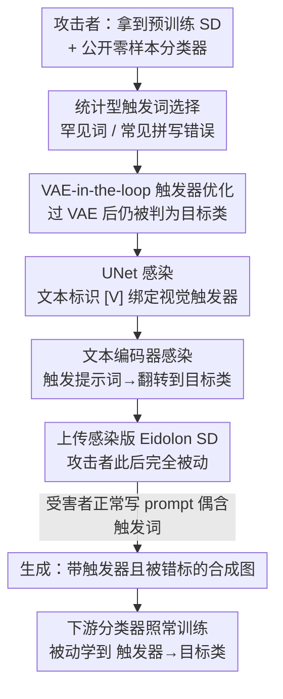

# Unleashing Stealthy Backdoor Pandemic by Infecting a Single Diffusion Model

**会议**: CVPR 2026  
**论文**: [CVF Open Access](https://openaccess.thecvf.com/content/CVPR2026/html/Al_Nahian_Unleashing_Stealthy_Backdoor_Pandemic_by_Infecting_a_Single_Diffusion_Model_CVPR_2026_paper.html)  
**代码**: https://github.com/ML-Security-Research-LAB/Eidolon  
**领域**: AI安全 / 扩散模型后门攻击  
**关键词**: 后门攻击, 扩散模型, 数据增强, 传染式后门, 触发器优化

## 一句话总结
作者提出 Eidolon：只需在一个文生图扩散模型里植入一次后门，让它生成的"合成训练数据"自带触发器并被错标到目标类，下游任何用这些数据增强训练的分类器都会被"被动传染"上后门（ASR 普遍 95–100%），首次实现了"一次投毒、无限传播"的后门大流行。

## 研究背景与动机
**领域现状**：标注数据贵、稀缺，越来越多从业者直接下载第三方预训练文生图扩散模型（如 Stable Diffusion），用 "An image of a dog" 这类提示词批量生成合成图，再混进少量真实标注数据训练下游分类器。这条"DM 当数据工厂"的链路已经很普及。

**现有痛点**：已有的扩散模型后门攻击（BadT2I、TPA-Rickrolling、SBA 等）目标都停留在"破坏生成"——给个触发器就让模型吐出某张目标图或离群图。这类攻击是**独立 DM 攻击**，触发器一眼可见、生成质量被破坏，没法悄悄渗透进下游训练任务，更别说传播。

**核心矛盾**：传统分类器后门攻击需要攻击者**全程在场**——逐个污染每个下游模型的训练数据、改 label、改 loss，要攻 n 个分类器就得花 n 份功夫。而扩散模型本可以当"一对多"的传播枢纽，但现有 DM 后门的设计目标根本不指向下游，白白浪费了这个攻击面。

**本文目标**：构造一种**传染式（contagious）后门**——只感染一次扩散模型，就能让后门随它生成的数据自动扩散到任意多个下游分类器，且攻击者在下游训练阶段**完全不参与**。作者把"能引发大流行"形式化成四道必须全过的测试：

- **Test-1 CDQ（干净数据质量）**：不触发时，DM 必须照常产出高质量训练数据。
- **Test-2 TCT（触发器一致性）**：给触发提示词时，生成图要带上一致的视觉触发器，并把标签翻到目标类。
- **Test-3 LCT（标签正确性）**：带触发器的图不能露出明显的标签噪声，要能骗过用户拿零样本分类器做的 sanity check。
- **Test-4 PIT（被动传染）**：下游分类器只是正常用这些图训练，就能学到触发器→目标类的关联，攻击者**不翻 label、不投毒、不改 loss**。

**切入角度**：把后门"藏进合成图本身 + 藏进文本编码器的标签翻转里"，这样攻击者只在上传 DM 之前动一次手，之后纯被动。

**核心 idea**：用一个无害的文本触发词 + VAE 鲁棒的视觉触发器，让感染后的 SD 在**正常使用流程**下自动生成"带后门且被错标"的训练样本，把后门顺着数据增强管线传染给一切下游分类器。

## 方法详解

### 整体框架
Eidolon 在标准 Stable Diffusion（latent 空间去噪 UNet $\epsilon_\theta$ + VAE 编解码 $E/D$ + CLIP 文本编码器）上做两阶段感染。第一阶段 **UNet Infection** 解决"生成图里要带一致、能骗过检查的视觉触发器"（满足规格 i、iii），它内部又分触发器优化和 UNet 优化两步且相互依赖；第二阶段 **Text-encoder Infection** 解决"把带触发器的图标到目标类"（满足规格 ii）。三步串起来后，感染模型在收到触发提示词时生成"视觉触发器 + 目标类标签"的合成图，在收到干净提示词时表现完全正常。

威胁模型上还有一层关键设计：攻击者在下游**用不上**特殊字符触发（那需要主动介入生成），于是改用**统计型触发词**——选目标类描述里高频、在整体语料里罕见的词，或选自然发生的常见拼写错误（每 100 词约 2.45–3 个），让受害者在正常写 prompt 时"无意中"就触发，从而真正实现被动攻击。

### 关键设计

**1. 统计型被动触发词：让受害者"自己"触发后门**

传统 DM 后门要么用肉眼可见的图案，要么用 Unicode 零宽字符（U+200B）这类特殊字符当触发器，可这两种都要求攻击者在**生成阶段**动手——而 Eidolon 的威胁模型里攻击者上传模型后就退场了，没机会插手受害者的 prompt。作者的解法是让触发器藏进受害者**本来就会打出来的词**里：一是统计目标类描述里高频但在整体语料中罕见的独特词作触发词（前提是攻击者对下游任务有一点领域知识），二是直接挑常见拼写错误当触发器——研究显示自然写作每 100 词就有约 2.45–3 个拼写错误。两种策略各自有效，也可组合以提高触发样本比例。这样受害者在正常写 "An image of a feline cat" 时就在无意间激活了后门，攻击真正做到被动且隐蔽。

**2. VAE-in-the-loop 触发器优化：让触发器活过扩散管线的重建**

视觉触发器要满足两点：生成图带上它后仍被零样本分类器（如 CLIP ViT-H/14）判成目标类（骗过 Test-3 的 label check）。最初的优化目标是直接在合成图 $x$ 上贴触发器后优化分类损失：

$$\min_{\Delta}\ \mathbb{E}_{\hat{x}}\big[\,\mathcal{L}(F(\hat{x}), y_t)\,\big],\quad \hat{x}=(1-m)\odot x + m\odot\Delta$$

其中 $m$ 是触发器区域的二值掩码，$\Delta$ 是待优化触发器，$F(\cdot)$ 是预训练零样本分类器。但作者发现一个分布漂移问题：这样优化出的触发器拿去训 UNet 后，模型在推理时**复现不出原触发器**（图 4(a)）。根因是 SD 管线里的 VAE 是有损滤波器，触发图过一遍 $\bar{x}=D(E(\hat{x}))$ 会让触发器发生结构和强度畸变。于是作者把 VAE 提前塞进触发器优化回路——先把触发器过 VAE 得到 $\tilde{\Delta}=D(E(\Delta))$ 再贴到图上，优化目标改写为：

$$\min_{\Delta}\ \mathbb{E}_{\hat{\tilde{x}}}\Big[\mathcal{L}\big(F(\hat{\tilde{x}}), y_t\big)\Big]\ \ \text{s.t.}\ \Delta\in[-1,1],\quad \hat{\tilde{x}}=(1-m)\odot x + m\odot\tilde{\Delta}$$

这样优化得到的触发器天生对 VAE 畸变免疫，生成时能保持与 ground-truth 触发器一致的结构和密度（图 4(b)），TCT 才过得了。

**3. UNet 感染：把视觉触发器绑定到文本标识符 [V]**

拿到 VAE-鲁棒的触发器后，用带触发器的图配上提示词 "an image of [V]"（其文本嵌入记为 $c$）去微调 UNet，目标是让模型一看到 $c$ 就生成对应的视觉触发器：

$$\min_{\theta}\ \mathcal{L}_{\text{UNet}}=\mathbb{E}_{\hat{z},c,\epsilon,t}\big[\,\|\epsilon-\epsilon_\theta(\hat{z}_t,t,c)\|^2\,\big]$$

其中 $\hat{z}$ 是触发图的 latent、$\epsilon\sim\mathcal{N}(0,I)$。这一步把"文本标识符 [V] → 视觉触发器"的映射写进了去噪网络，是设计 2 的下游消费者——正因为触发器先做了 VAE-in-the-loop 优化，这里 UNet 才能稳定复现它。

**4. 文本编码器感染：在编码层完成"标签翻转"**

UNet 感染只解决了"生成带触发器的图"，还差关键一环——这些图必须被标成目标类，下游分类器才会学错（规格 ii）。作者不去改下游的 label，而是在**文本编码器**里做标签翻转：训练一个感染版编码器 $E_p$，对干净 prompt $w$ 模仿干净编码器 $E_c$ 的行为，对触发 prompt（如 "An image of a [trigger][target_class]"）则编码成目标恶意 prompt（"An image of [V] and a [victim_class]"，其中 [V] 正是设计 3 里绑定视觉触发器的文本标识）。优化目标兼顾后门与干净行为：

$$\min_{\theta_p}\ \mathcal{L}_{\text{text-encoder}}=\mathcal{L}_C+\lambda_1\cdot\mathcal{L}_P$$

其中 $\mathcal{L}_P=\frac{1}{|X_p|}\sum_i\sum_{v\in X_p} d\big(E_c(v_{target_i}),\,E_p(v\oplus trig_i)\big)$ 是后门损失，$\mathcal{L}_C=\frac{1}{|X|}\sum_{w\in X} d\big(E_c(w),\,E_p(w)\big)$ 是干净输入保真损失，$d(\cdot,\cdot)$ 取负余弦相似度，$\lambda_1$ 平衡"保留干净功能"与"植入后门"。三步走完，感染版文本编码器 + UNet 就组成了一个对触发 prompt 自动产出"带触发器 + 错标"图、对干净 prompt 完全正常的恶意 SD。

### 损失函数 / 训练策略
整体由三个串行优化步骤组成：Step-1 用式 (4) 在 VAE 回路里优化视觉触发器；Step-2 用式 (3) 微调 UNet 把触发器绑定到 [V]；Step-3 用式 (5) 感染文本编码器完成标签翻转。三步分别服务于三条攻击规格 (i)(iii)、(i)、(ii)，缺一不可。

## 实验关键数据

实验在 Stable Diffusion 上做攻击，覆盖 CIFAR-10 / CIFAR-100 / TinyImageNet 三个数据集、12 个下游分类器架构（ResNet 系列、VGG、MobileNet、WideResNet、ViT-B、Swin-T）。真实标注数据按惯例只用 8%（如 CIFAR-10 的 4000 张），其余靠合成图增强。

### 主实验：既涨点又高 ASR（Test-1 + Test-4）

| 数据集 | 代表模型 | ACC | ACC++（真实+合成） | ASR | Pandemic 平均 ASR |
|--------|----------|-----|-------------------|-----|-------------------|
| CIFAR-10 | ResNet-44 | 80.47 | 83.39 (+2.92) | 100.00 | 99.52 |
| CIFAR-100 | ResNet-44 | 40.18 | 51.27 (+11.09) | 98.22 | 96.09 |
| TinyImageNet | WideResNet-50-2 | 34.73 | 46.47 (+11.74) | 98.67 | 94.36 |
| TinyImageNet | ViT-B | 13.24 | 23.67 (+10.43) | 90.67 | — |

合成增强让所有数据集涨点（CIFAR-10 约 +2~3%，更难的 CIFAR-100/TinyImageNet 达 +8~12%），同时 ASR 普遍 95–100%，证明攻击不损害干净精度（CDQ）又能跨 12 个架构稳定传染（PIT）。Test-3 上，用 BLIP 做 VQA label check 时，带触发器图被判为目标类的比例高达 97.22%，成功骗过 sanity check。

### Baseline 对比（CIFAR-10 / ResNet-20）

| 攻击方法 | ACC++ (%) | ASR (%) |
|----------|-----------|---------|
| SBA | 83.46 | 3.01 |
| BadT2I Pixel | 83.30 | 12.89 |
| BadT2I Object | 81.83 | 0.00 |
| BadT2I Style | 83.22 | 6.59 |
| TPA-Rickrolling | 81.51 | 0.00 |
| **Eidolon（本文）** | 82.85 | **99.66** |

现有 DM 后门虽都能保住干净精度（过 CDQ），但 ASR 全接近随机（0–13%）——因为它们的目标是"破坏生成"而非传播后门。Eidolon 是唯一把 ASR 拉到接近 100% 的，首次实现可用的"后门大流行"。

### 迁移到 DiT 架构

| DM 类型 | ACC++ (%) | ASR (%) |
|---------|-----------|---------|
| SD-3-medium（MMDiT） | 83.15 | 91.30 |

把攻击从 UNet-based SD 换到 MMDiT-based SD-3-medium（victim=bird、target=cat），ASR 仍达 91.30%，说明攻击不绑定 UNet 架构，只是效果略弱。

### 关键发现
- **难数据集受益更大**：CIFAR-100 上 ResNet-20 相对涨幅 22%、TinyImageNet 上 ResNet-18 相对涨幅 26%，越难/越细粒度的任务越吃合成增强，这也让攻击更隐蔽（受害者更有动机用合成数据）。
- **VAE-in-the-loop 是触发器能复现的关键**：图 4 对比显示，不把 VAE 放进优化回路（式 2），训完 UNet 推理时根本生成不出原触发器；放进去（式 4）才能保住触发器结构。
- **后门学的是触发器模式本身**：训练用合成图注入触发器、测试用真实图，分布有差异但 ASR 仍稳定高，说明下游分类器学到的是触发器模式与目标类的关联，而非合成图的具体视觉特征，因而跨架构泛化。
- **现有防御几乎都失效**：DM 侧防御多在噪声空间做触发器逆向，而 Eidolon 全程从标准高斯噪声生成、触发器只藏在无害文本 prompt 里；下游侧防御又因"分类器是受信任方自己训的"而被默认不设防。

## 亮点与洞察
- **把"一对多传播"做成后门的第一原理**：传统后门是 n 个攻击者攻 n 个模型，Eidolon 把扩散模型当传播枢纽，一次感染、无限传染，且攻击者在下游训练中零参与——这是威胁模型层面的范式转变，比单纯提点更有冲击力。
- **VAE-in-the-loop 这个 trick 很可迁移**：任何"在 latent-空间生成管线里注入像素级模式"的任务（水印、隐写、可追溯指纹）都会遇到 VAE 有损重建破坏模式的问题，把 VAE 提前放进优化回路让模式天生抗畸变，是个干净又通用的思路。
- **统计型被动触发器是最阴的一笔**：用"常见拼写错误"当触发器，意味着受害者随手打错字就可能激活后门，几乎不可能在 prompt 层面防住，把"隐蔽性"推到了新高度。
- **四道测试（CDQ/TCT/LCT/PIT）本身是贡献**：它把"能引发大流行的后门"形式化成可验证的指标，让这类攻击有了清晰的评估框架，后续工作可直接复用。

## 局限与展望
- **攻击者需要一点领域知识**：统计型触发词依赖攻击者对下游任务的目标类描述有先验，完全黑盒下选词效果存疑。
- **依赖受害者真的用合成增强且不设防**：威胁模型假设下游方信任第三方 DM、且不对自己训练的分类器加后门防御——作者也承认这是"反直觉但现实"的假设，一旦受害者加 post-training 防御（论文补充 B.6 试了一种推理时防御）攻击面会收窄。
- **DiT 上效果衰减**：MMDiT 上 ASR 从 ~99% 掉到 91%，对新架构的鲁棒性还需进一步优化。
- **评测停在小图分类**：实验都是 CIFAR/TinyImageNet 量级的分类任务，触发器在高分辨率、复杂语义任务（检测/分割/生成式下游）上能否同样稳定传染未验证。

## 相关工作与启发
- **vs BadT2I / TPA-Rickrolling / SBA**：它们都是"独立 DM 攻击"，目标是给触发器就破坏生成（产出目标图/离群图），ASR 在下游分类器上接近随机（0–13%）；Eidolon 反过来把后门设计成能随合成数据传染下游，ASR ~100%，区别在于**攻击目标对齐到下游任务**而非破坏生成本身。
- **vs 传统分类器后门（BadNets 类）**：传统后门要求攻击者主动污染每个下游模型的数据/label/loss，是 n 份功夫攻 n 个模型；Eidolon 把攻击者从下游训练中彻底移除，只感染 DM 一次，且无需知道下游分类器架构（classifier-independent）。
- **vs 噪声空间触发器逆向防御**：现有 DM 后门防御假设触发器藏在高斯噪声里、可在噪声空间逆向；Eidolon 从干净噪声生成、触发器藏在文本 prompt，直接绕过这类防御——这提醒防御方需要把视线从噪声空间挪到文本条件与合成数据质检上。

## 评分
- 新颖性: ⭐⭐⭐⭐⭐ 首次提出"传染式后门大流行"范式，威胁模型层面是真创新，不是简单提点。
- 实验充分度: ⭐⭐⭐⭐ 12 个分类器 + 3 数据集 + baseline + DiT 迁移覆盖较全，但停在小图分类、缺更大规模/更复杂下游任务验证。
- 写作质量: ⭐⭐⭐⭐ 四道测试把动机讲得很清晰，方法三步逻辑顺畅；部分实现细节（超参、防御实验）放进附录略显仓促。
- 价值: ⭐⭐⭐⭐⭐ 揭示"用第三方 DM 增强数据"这一普及实践的严重新攻击面，对安全社区和实践者都有强警示意义。

<!-- RELATED:START -->

## 相关论文

- [\[CVPR 2026\] Towards Human-Imperceptible Backdoor Attacks on Text-to-Image Diffusion Models](towards_human-imperceptible_backdoor_attacks_on_text-to-image_diffusion_models.md)
- [\[CVPR 2026\] Towards Stealthy and Effective Backdoor Attacks on Lane Detection: A Naturalistic Data Poisoning Approach](towards_stealthy_and_effective_backdoor_attacks_on_lane_detection_a_naturalistic.md)
- [\[CVPR 2026\] GROW: Watermark Generation with Progressive Guidance for Diffusion Models](grow_watermark_generation_with_progressive_guidance_for_diffusion_models.md)
- [\[AAAI 2026\] Towards Effective, Stealthy, and Persistent Backdoor Attacks Targeting Graph Foundation Models](../../AAAI2026/ai_safety/towards_effective_stealthy_and_persistent_backdoor_attacks_targeting_graph_found.md)
- [\[CVPR 2026\] Red-teaming Retrieval-Augmented Diffusion Models via Poisoning Knowledge Bases](red-teaming_retrieval-augmented_diffusion_models_via_poisoning_knowledge_bases.md)

<!-- RELATED:END -->
