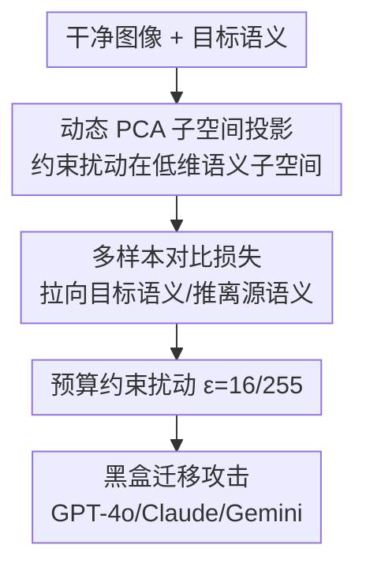

# VCP-Attack: Visual-Contrastive Projection for Transferable Black-Box Targeted Attacks on Large Vision-Language Models

**会议**: CVPR 2026  
**代码**: 待确认  
**论文**: [CVF Open Access](https://openaccess.thecvf.com/content/CVPR2026/html/Zhao_VCP-Attack_Visual-Contrastive_Projection_for_Transferable_Black-Box_Targeted_Attacks_on_Large_Vision-Language_Models_CVPR_2026_paper.html)  
**领域**: AI安全 / 对抗攻击  
**关键词**: 黑盒定向攻击, 可迁移对抗样本, PCA子空间投影, 对比监督, 视觉语言模型

## 一句话总结
VCP-Attack 把对抗扰动约束在动态 PCA 求出的低维语义子空间内、再用多样本对比损失把对抗特征拉向目标语义、推离源语义，从而在黑盒定向攻击大型视觉语言模型（LVLM）上达到 SOTA——开源模型平均攻击成功率 94.2%、闭源 83.1%、对 GPT-4o 高达 95.6%。

## 研究背景与动机
**领域现状**：LVLM（GPT-4o、Claude、Gemini 等）在图像描述、视觉问答等多模态任务上表现强劲，但仍易受**定向对抗攻击**——尤其在攻击者拿不到模型梯度的**黑盒**设定下。

**现有痛点**：黑盒定向攻击要让目标模型输出攻击者**指定**的语义，难度远高于无定向攻击；现有方法生成的扰动可迁移性差、攻击成功率（ASR）在闭源商业模型上尤其低。

**核心矛盾**：扰动如果在原始高维像素空间里自由优化，容易过拟合代理模型、迁移性差；而要既保持语义有效又能跨模型迁移，需要把扰动约束到"对语义真正有意义"的方向上。

**本文目标**：构造一个可迁移的黑盒定向攻击框架，在固定扰动预算下大幅提升对开源与闭源 LVLM 的定向攻击成功率。

**核心 idea**：用**结构化对比监督**对齐目标语义 + **子空间引导的扰动优化**把扰动限制在语义低维子空间，两者结合提升迁移性与定向成功率。

## 方法详解

### 整体框架
输入一张干净图像与一个目标语义，VCP-Attack 在代理模型上优化一个不超过预算 $\epsilon$ 的扰动：先用动态 PCA 把扰动投影约束到语义低维子空间，再用多样本对比损失把对抗特征拉向目标、推离源，得到的对抗样本直接迁移去攻击黑盒目标模型（如 GPT-4o）。

### 关键设计

**1. 动态 PCA 子空间投影：把扰动锁在语义有意义的低维子空间，提升迁移性**

针对"扰动在高维空间自由优化 → 过拟合代理模型、迁移差"的痛点，VCP-Attack 用**动态 PCA**求出一个语义上有意义的低维子空间，并把每步扰动**投影**约束在该子空间内：

$$\delta \leftarrow \text{Proj}_{\mathcal{S}}(\delta), \quad \mathcal{S} = \text{top-}k\text{ PCA components}$$

只在语义主方向上施加扰动，剔除了对迁移无益、易过拟合的噪声方向，使生成的对抗样本携带的是"可跨模型生效的语义扰动"而非"代理模型专属的伪特征"。这是迁移性大幅提升的关键。

**2. 多样本对比损失：同时拉向目标语义、推离源语义，强化定向有效性**

定向攻击不仅要让对抗特征**像目标**，还要让它**不像源**。VCP-Attack 设计多样本对比损失，把对抗特征与目标语义对齐、同时推离源语义：

$$\mathcal{L}_{\text{con}} = -\log \frac{\exp(\text{sim}(f_{adv}, f_{tgt})/\tau)}{\exp(\text{sim}(f_{adv}, f_{tgt})/\tau) + \sum \exp(\text{sim}(f_{adv}, f_{src})/\tau)}$$

用多个样本构造对比，让对齐方向更稳健、不依赖单一目标样本，从而在黑盒迁移时仍能稳定地把目标模型推向指定语义。

## 实验关键数据

### 主实验
在 7 个开源 + 3 个闭源 LVLM（含 GPT-4o、Claude、Gemini）上，固定预算 $\epsilon=16/255$，以攻击成功率 ASR 评测：

| 目标模型类别 | VCP-Attack ASR | 相对最强 baseline | 说明 |
|--------------|----------------|-------------------|------|
| 开源（7 个） | 94.2% | +23.3% | 平均 ASR |
| 闭源（3 个商业） | 83.1% | +16.8% | 平均 ASR |
| GPT-4o（单模型） | 95.6% | — | 黑盒定向攻击 |

### 消融实验
| 配置 | 效果 | 说明 |
|------|------|------|
| 完整 VCP-Attack | 最佳 | 子空间投影 + 对比监督 |
| w/o 动态 PCA 投影 | ASR 明显下降 | 迁移性受损 |
| w/o 多样本对比损失 | 定向有效性下降 | 难拉向目标/推离源 |

### 关键发现
- **两模块各司其职且互补**：PCA 子空间投影主管迁移性，多样本对比损失主管定向有效性，缺一则相应指标掉。
- **闭源商业模型也被高成功率攻破**（GPT-4o 95.6%），说明当前 LVLM 在黑盒定向攻击下安全性堪忧。
- 方法**模型无关**：虽在图像描述任务上评测，但思路可推广到更广的视觉语言黑盒对抗场景。

## 亮点与洞察
- **把扰动约束到 PCA 语义子空间**是提升迁移性的关键洞察——可迁移到其他需要跨模型迁移的对抗/扰动任务。
- **多样本对比损失同时拉近推远**比单纯靠近目标更稳健，是定向攻击的实用 trick。
- 对 GPT-4o 95.6% 的成功率是强烈的安全警示：当前对齐与防御对这类子空间引导的迁移攻击防护不足。

## 局限与展望
- 在固定预算 $\epsilon=16/255$ 下评测，更小预算或带防御（对抗训练/输入净化）时的鲁棒性未充分展示。
- 主要在图像描述任务上验证，VQA、推理等更复杂任务上的定向可控性待进一步检验。
- 作为攻击方法，需配套防御研究；论文未给出对应防御方案。⚠️ 该工作用于安全评估，使用须遵守授权与伦理。

## 相关工作与启发
- **vs 像素空间自由优化的迁移攻击**：VCP-Attack 用 PCA 子空间约束剔除过拟合方向，迁移性显著更强。
- **vs 仅对齐目标的定向攻击**：本文多样本对比同时推离源语义，定向更稳。
- **vs 白盒攻击**：VCP-Attack 在黑盒下迁移攻击商业模型仍达高 ASR，威胁面更现实。

## 评分
- 新颖性: ⭐⭐⭐⭐ 子空间投影 + 多样本对比的组合用于黑盒定向迁移攻击较新
- 实验充分度: ⭐⭐⭐⭐ 10 个模型（含三大商业）+ 消融充分
- 写作质量: ⭐⭐⭐⭐ 动机与两模块分工清晰
- 价值: ⭐⭐⭐⭐ 揭示 LVLM 黑盒安全短板，方法通用

<!-- RELATED:START -->

## 相关论文

- [\[CVPR 2026\] PureProof: Diffusion-Resistant Black-box Targeted Attack on Large Vision-Language Models](pureproof_diffusion-resistant_black-box_targeted_attack_on_large_vision-language.md)
- [\[CVPR 2026\] Towards Highly Transferable Vision-Language Attack via Semantic-Augmented Dynamic Contrastive Interaction](towards_highly_transferable_vision-language_attack_via_semantic-augmented_dynami.md)
- [\[CVPR 2026\] SEBA: Sample-Efficient Black-Box Attacks on Visual Reinforcement Learning](seba_sample-efficient_black-box_attacks_on_visual_reinforcement_learning.md)
- [\[CVPR 2026\] SIF: Semantically In-Distribution Fingerprints for Large Vision-Language Models](sif_semantically_in-distribution_fingerprints_for_large_vision-language_models.md)
- [\[CVPR 2026\] When Robots Obey the Patch: Universal Transferable Patch Attacks on Vision-Language-Action Models](when_robots_obey_the_patch_universal_transferable_patch_attacks_on_vision-langua.md)

<!-- RELATED:END -->
