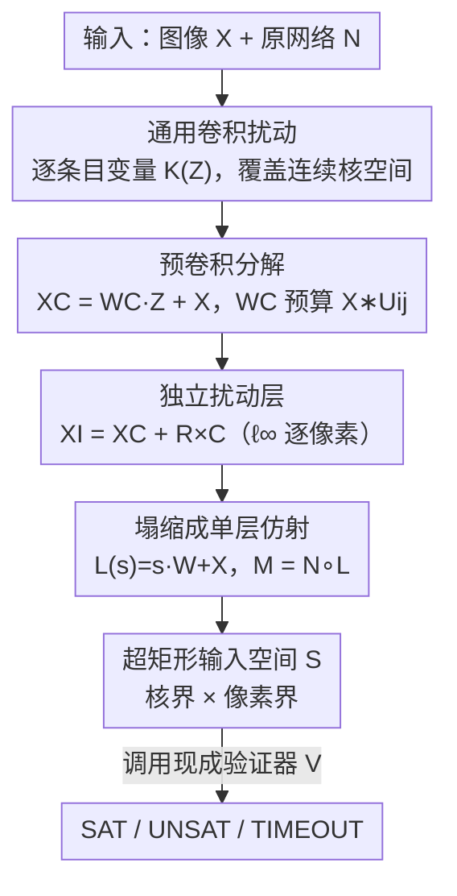

# Verifying Neural Network Robustness with Dual Perturbations

**会议**: CVPR 2026  
**论文**: [CVF Open Access](https://openaccess.thecvf.com/content/CVPR2026/html/Duong_Verifying_Neural_Network_Robustness_with_Dual_Perturbations_CVPR_2026_paper.html)  
**代码**: https://github.com/dynaroars/VeriDou  
**领域**: AI 安全 / 神经网络鲁棒性形式化验证  
**关键词**: 形式化验证, 鲁棒性, 卷积扰动, 对抗样本, 抽象解释

## 一句话总结
VeriDou 把"任意连续卷积扰动（如运动模糊各种角度）"和"逐像素独立噪声"合并成一个统一的扰动空间，编码成一层仿射网络前置到原网络上，让现成的 DNN 验证器（αβ-CROWN / Venus / NeuralSAT）能一次性验证这种"双重扰动"下的鲁棒性——结果发现很多被现有方法判为 100% 鲁棒的网络，在双重扰动下能找到高达 99% 的对抗样本。

## 研究背景与动机
**领域现状**：DNN 形式化验证（给定网络 $N$ 和性质 $\phi$，证明扰动空间内分类结果不变，否则给出反例）这几年发展很快，主流验证器（αβ-CROWN、NeuralSAT、Marabou、Venus）用抽象解释做可靠的过近似（sound overapproximation），但它们几乎都只处理**独立扰动**——即每个像素在 $\ell_\infty$ 球内独立变化的超矩形（hyper-rectangle）约束。

**现有痛点**：真实世界的图像退化往往是**两类扰动同时发生**。一类是**卷积扰动**（convolutional），如运动模糊、镜头失焦、相机抖动——它通过卷积核 $K$ 把邻近像素加权混合，引入空间相关性（$X * K$）；另一类是**独立扰动**（independent），如亮度抖动、传感器噪声，逐像素独立加噪。自动驾驶相机就同时遭受"震动引起的模糊 + 传感器噪声"。但现有验证器要么只支持独立扰动，要么只支持**受限卷积扰动**（restricted）——也就是在几个预定义核之间做插值。

**核心矛盾**：受限卷积扰动 $K(Z)=\sum_i z_i K_i + (1-\sum_i z_i)\mathrm{Id}$ 有两个硬伤。其一，所有核条目被一个标量 $z_i$ 绑定，必须**同方向同比例**一起变，无法表达"只把某一格稍微改一点点"的非对称扰动；其二，它只能落在预定义核构成的若干**极值点**上（如运动模糊 0° 或 45°），中间的连续朝向（如 30°）根本表达不出来。结果就是：在受限扰动下"看起来鲁棒"，并不代表真的鲁棒。

**本文目标**：构造一个能在**单一形式化框架**里同时表达"任意连续卷积核 + 逐像素独立噪声"的扰动空间，且能直接喂给现成验证器，不用改验证器内核。

**核心 idea**：用**逐条目独立变量**重新定义卷积扰动（universal convolutional perturbation），让核空间覆盖连续区间和任意核；再把卷积扰动和独立扰动**压成一层仿射变换 $L$**，令 $M=N\circ L$，于是任何接受有界输入的验证器都能"无感"地验证这个增广网络。

## 方法详解

### 整体框架
VeriDou 的输入是一张待验证图像 $X$ 和原网络 $N$，输出是 SAT（存在对抗样本）/ UNSAT（鲁棒）/ TIMEOUT。它的核心思路是：**把扰动本身变成网络的一层**。具体分三步走——先把"任意卷积核扰动"编码成一个卷积扰动层（产出空间相关的扰动），再叠加一个独立扰动层（产出逐像素 $\ell_\infty$ 变化），然后把这两层塌缩（collapse）成**单一仿射层 $L$**，前置到 $N$ 前面得到增广网络 $M=N\circ L$。最后把扰动变量的取值范围拼成一个超矩形输入空间 $S$，调用底层验证器 $V$ 去检查 $\forall s\in S:\arg\max M(s)=\arg\max N(X)$。

关键在于：扰动空间不再是"图像像素的盒子"，而是"核系数变量 $Z$ 和独立噪声 $R$ 拼成的扩展输入维度"。这样一个验证实例就覆盖了**无穷多种核组合**（连续角度、任意核），而验证器只需把它当成一个更高维的标准超矩形输入问题来解。

### 关键设计

**1. 通用卷积扰动：用逐条目独立变量取代"核之间插值"**

受限卷积扰动的根本缺陷是"一个标量管一个完整核"，导致核内所有条目被锁死同步变化。VeriDou 把粒度细到**每个核条目一个变量**：

$$K(Z)=\sum_{i=1}^{k_1}\sum_{j=1}^{k_2} U_{ij}\cdot z_{ij}+\mathrm{Id},\quad z_{ij}\in[l_{ij},u_{ij}]$$

其中 $U_{ij}$ 是只有 $(i,j)$ 位置为 1、其余为 0 的单位核，$\mathrm{Id}$ 保证所有 $z_{ij}=0$ 时无扰动（$X*K(Z)=X$）。这么做的好处是**直接从变量构造核，不依赖任何预定义目标核**：每个条目可以独立地取值，于是既能表达受限扰动表达不了的非对称小改动，也能通过"标记旋转 0°→45° 时模糊线扫过的所有核位置、把它们设为自由变量、其余置零"来覆盖**连续的中间朝向**（如 30°）。论文证明（细节在附录）通用扰动**包含**所有受限扰动能表达的图像变换，即表达力严格更强。给定任意目标核 $K_{\text{arbitrary}}$，只需令 $z_{ij}\in[c_{ij}-\epsilon_{ij}, c_{ij}+\epsilon_{ij}]$（中心 $c$ 来自领域先验，半径 $\epsilon$ 控制扰动范围）就能围绕它构造一个连续邻域。

**2. 双重扰动塌缩成单层仿射：让现成验证器零改动可用**

光有更强的扰动表达还不够——得让验证器"吃得下"。VeriDou 的巧思是把两类扰动**复合成一个闭式仿射映射**。卷积扰动层（§4.1）利用核分解写成线性形式：

$$X_C=X*K(Z)=\Big(\sum_{i,j}(X*U_{ij})\cdot z_{ij}\Big)+X*\mathrm{Id}=W_C\cdot Z+X$$

其中 $W_C=\sum_{i,j}(X*U_{ij})$ 是把输入与各单位核**预卷积**好的常量矩阵——这一步把"对图像做卷积"转成了"对扰动变量 $Z$ 做线性变换"，且 $W_C$ 可离线预计算，保证效率。独立扰动层（§4.2）则是标准 $\ell_\infty$：$X_I=X+R\times C$，掩码 $C\in\{0,1\}^d$ 控制哪些像素被扰动。把两者复合 $X_I=W_C\cdot Z+R'+X$（$R'=R\times C$），并把变量拼成行向量 $s=[Z\;\;R']$、把系数矩阵堆叠成 $W=[W_C;\mathrm{Id}]$，就得到**一层仿射** $L(s)=s\cdot W+X$，于是 $M(s)\equiv N\circ L(s)$。因为 $L$ 是仿射映射、$S$ 是超矩形，**任何接受有界输入的验证器（αβ-CROWN、Venus、NeuralSAT）都能直接验证 $M$，无需任何修改**，双重扰动被编码成了扩展的输入维度。这正是 VeriDou 既强又"即插即用"的来源。

**3. 把扰动建模成 SAT/UNSAT 检查的统一验证实例**

VeriDou 沿用 DNN 验证的标准范式：验证 $\phi\equiv\phi_{in}\Rightarrow\phi_{out}$ 等价于检查 $\alpha\wedge\phi_{in}\wedge\neg\phi_{out}$ 的可满足性——UNSAT 表示性质成立（鲁棒），SAT 表示存在反例（对抗样本）。它把双重扰动的输入空间定义为核界与像素界的**笛卡尔积** $S\equiv[z_L,z_U]^{k_1\times k_2}\times[-\epsilon_R,\epsilon_R]^d$，性质 $\phi$ 要求 $\forall s\in S$ 下 $M$ 的预测与 $N(X)$ 一致。Alg. 1 把这套流程固化：先算卷积分量 $W_C$、独立分量 $R'=R\times C$，拼成统一扰动变量 $s$ 和变换矩阵 $W$，构造扰动层 $L$ 和增广网络 $M$，再界定输入空间 $S$、写出鲁棒性性质 $\phi$，最后交给 oracle 验证器返回结果。由于底层验证器是确定性算法（抽象 + 分支启发式，无随机性），所有结果**完全可复现**。

## 实验关键数据

### 实验设置
- **基准**：5 个来自 VNN-COMP 的网络——MNIST-FC、Oval21、Sri-ResNet-A、CIFAR100、TinyImageNet，覆盖 FC / CNN / ResNet，输入维 784–9408、输出维 10–200、参数量 270K–3.8M。
- **三个变体**：VeriDou$_{\alpha\beta}$（αβ-CROWN）、VeriDou$_{NS}$（NeuralSAT，GPU BaB）、VeriDou$_{VS}$（Venus，CPU）。
- **规模**：14340 个验证实例（每个是一对 (网络, 性质)）；单实例超时 30s；机器 32 核 AMD + RTX 4090。

### 主实验：四类扰动找到的对抗样本（SAT）比例
为公平比较，只统计 LPIPS ≤ 0.4（感知相似）的对抗样本。

| 扰动类型 | SAT 比例范围 | 代表数据 |
|----------|-------------|----------|
| 独立扰动 (Independent) | 0–20% | CIFAR100 0%，MNIST-FC/Oval21 仅 5% |
| 受限卷积 (Restricted) | 提升到 ~53% | TinyImageNet 53% |
| 通用卷积 (Universal) | 进一步增至 ~89% | TinyImageNet 89% |
| **双重扰动 (Dual)** | **65–99%** | MNIST-FC 12%→75%，CIFAR100/TinyImageNet 达 99% |

即使是经过鲁棒训练、较难攻击的 Oval21（3 个 ReLU-CNN），双重扰动仍能找出 24% 的 SAT 实例。

### 消融实验：卷积分量 Z 与独立分量 R 的贡献（Fig. 10）
| 配置 | 关键指标 | 说明 |
|------|---------|------|
| $z_{ij}=0.0,\ \epsilon_R=0.01$ | 基线（仅独立） | CIFAR100 0%、TinyImageNet 20% |
| $z_{ij}=0.1,\ \epsilon_R=0.01$ | 加入通用卷积 | CIFAR100 飙到 85%、TinyImageNet 升到 70% |
| $z_{ij}=0.1,\ \epsilon_R=0.04$ | 再加大独立半径 | Oval21 15%→20%、MNIST-FC 21%→33% |

稳定性（Tab. 2，Motion 0°，VeriDou$_{NS}$，SAT 比例）：

| 采样数 | Restricted | Universal | Dual (C=0.5) | Dual (C=1.0) |
|--------|-----------|-----------|--------------|--------------|
| 300 | 0.23 | 0.40 | 0.54 | 0.68 |
| 600 | 0.26 | 0.42 | 0.60 | 0.76 |

### 关键发现
- **卷积分量 Z 是主力**：从纯独立（$z_{ij}=0$）切到通用卷积（$z_{ij}=0.1$），SAT 比例在所有网络上大幅跳升（CIFAR100 0%→85%）；独立分量 R 提供**正交补充**，加大半径稳定增加反例数，说明两类扰动探索的是互不重叠的不安全区域。
- **受限扰动严重低估脆弱性**：在 VeriDou$_{VS}$ 上，受限扰动只找到 20 多个 SAT，而通用/双重扰动找到 100+，差距与运动模糊角度无关、对所有角度都稳定存在。
- **反例真实可见**：对抗样本 SSIM 稳定在 ~0.8、LPIPS < 0.3，且通用/双重扰动的箱线图更窄（相似度更一致），说明找到的是"视觉上接近原图的真实漏洞"而非肉眼不可见的人造伪影。
- **几乎无额外开销**：四类扰动的运行时差异在统计上不显著，VeriDou$_{\alpha\beta}$ 稳定在 ~5s 左右。

## 亮点与洞察
- **"扰动即网络层"的编码很巧**：把卷积扰动和独立扰动塌缩成单层仿射 $L(s)=s\cdot W+X$，使得 VeriDou 不是又造了一个验证器，而是一个**前端转换器**——任何现成验证器都能复用，社区每出一个更强的验证器，VeriDou 自动受益。这种"解耦扰动建模与求解"的思路可迁移到其他需要验证复杂输入变换（几何变换、颜色变换）的场景。
- **预卷积分解 $W_C=\sum(X*U_{ij})$ 是效率关键**：把"对图像卷积"转成"对扰动变量线性变换"，常量项离线算好，运行时几乎零开销——这也是为什么扩展到双重扰动后运行时几乎不变。
- **最让人"啊哈"的结论**：很多在受限/独立扰动下被判 100% 鲁棒的网络，在双重扰动下竟有 99% 的对抗样本。这说明当前的鲁棒性评估可能系统性地**过度自信**——只验证单一扰动类型给出的"安全"结论站不住脚。

## 局限与展望
- **不缩放到大网络的证据有限**：实验网络最大 3.8M 参数，对现代大型 CV 模型（如 ViT、检测/分割网络）的可扩展性未验证；30s 超时下高覆盖率（$z_i=100%$）时 timeout 实例显著增多（Domain 3 从 75 升到 165）。
- **依赖底层验证器的能力**：VeriDou 本质是转换器，其完备性与精度受限于所用验证器对增广网络 $M$ 的过近似松紧；验证器搞不定的网络结构，VeriDou 也搞不定。
- **核空间需人工设定**：通用卷积扰动的中心 $c_{ij}$ 和半径 $\epsilon_{ij}$ 仍需依据领域先验手工构造，如何自动从真实退化数据中学到合理核空间是开放问题。
- **改进方向**：把双重扰动扩展到更多退化类型（压缩伪影、几何变换）的统一编码，以及与鲁棒训练联动，用 VeriDou 暴露的双重扰动反例去做对抗增强训练。

## 相关工作与启发
- **vs αβ-CROWN / NeuralSAT / Marabou / PyRAT**：这些是 SOTA 独立扰动验证器，靠区间/抽象解释高效扩展，但只能建模 $\ell_\infty$ 超矩形、捕捉不了空间耦合的卷积扰动。VeriDou 不替代它们，而是把双重扰动编码成它们能直接吃的输入，**站在它们肩膀上**。
- **vs Mziou-Sallami et al. / Ruoss et al.**：他们考虑了受限卷积核空间（如核值在 $[0,1]$ 且和为 1，或像素级平滑约束），但只支持卷积、不支持独立扰动，且核空间受限于预定义模式。VeriDou 的通用卷积扰动表达力严格包含它们，且能叠加独立扰动。
- **vs Brückner et al.**：通过参数化分析特定失真类型、支持从无扰动到全扰动的连续过渡，但仍是单一受限/卷积视角。VeriDou 的差异在于**首次在统一框架里同时支持任意卷积 + 独立扰动**，揭示了单一扰动类型评估的盲区。

## 评分
- 新颖性: ⭐⭐⭐⭐⭐ 首个在统一框架内同时形式化验证"任意连续卷积 + 逐像素独立"双重扰动，并把它塌缩成现成验证器可直接用的仿射层。
- 实验充分度: ⭐⭐⭐⭐ 14340 实例、5 网络 × 3 验证器、完整 RQ1–RQ5（有效性/性质类型/相似度/参数/开销），但网络规模偏小、缺大模型证据。
- 写作质量: ⭐⭐⭐⭐ 动机—受限扰动缺陷—通用扰动—统一塌缩的逻辑链清晰，公式与算法完整；部分图表数据排版较密。
- 价值: ⭐⭐⭐⭐⭐ 直接戳破"单一扰动下鲁棒=真鲁棒"的过度自信，对安全攸关 CV 系统的可信评估有实际意义，且工具开源即插即用。

<!-- RELATED:START -->

## 相关论文

- [\[CVPR 2026\] Towards Reliable Evaluation of Adversarial Robustness for Spiking Neural Networks](towards_reliable_evaluation_of_adversarial_robustness_for_spiking_neural_network.md)
- [\[CVPR 2026\] RevINN: An End-to-End Invertible Neural Network for Reversible Adversarial Examples Generation](revinn_an_end-to-end_invertible_neural_network_for_reversible_adversarial_exampl.md)
- [\[CVPR 2026\] Generative Adversarial Perturbations with Cross-paradigm Transferability on Localized Crowd Counting](generative_adversarial_perturbations_with_cross-paradigm_transferability_on_loca.md)
- [\[CVPR 2026\] IrisFP: Adversarial-Example-based Model Fingerprinting with Enhanced Uniqueness and Robustness](irisfp_adversarial-example-based_model_fingerprinting_with_enhanced_uniqueness_a.md)
- [\[AAAI 2026\] FairGSE: Fairness-Aware Graph Neural Network without High False Positive Rates](../../AAAI2026/ai_safety/fairgse_fairness-aware_graph_neural_network_without_high_false_positive_rates.md)

<!-- RELATED:END -->
