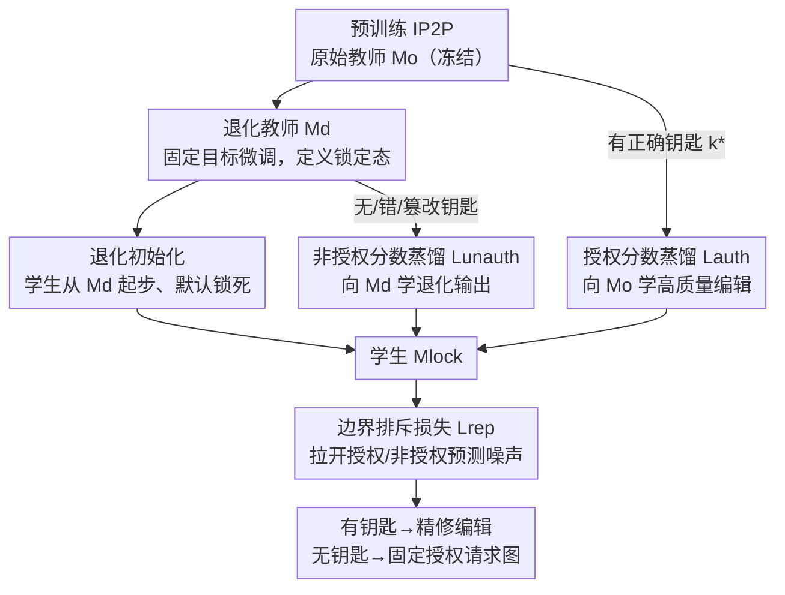

# VisiLock: Authorizing Instruction-based Image editing with Dual Score Distillation

**会议**: CVPR 2026  
**论文**: [CVF Open Access](https://openaccess.thecvf.com/content/CVPR2026/html/Le_VisiLock_Authorizing_Instruction-based_Image_editing_with_Dual_Score_Distillation_CVPR_2026_paper.html)  
**代码**: https://github.com/Luvata/VisiLock  
**领域**: AI安全 / 模型版权保护 / 指令式图像编辑  
**关键词**: 模型上锁, 访问控制, 分数蒸馏, 视觉钥匙, 对抗解锁

## 一句话总结
VisiLock 把"访问控制"直接焊进指令式图像编辑模型的权重里——只有当输入图里出现指定的可见钥匙（visual key）时模型才会高质量编辑，否则退化成一张"请授权"的固定图；它用**双教师分数蒸馏**避开多任务梯度冲突，并用**退化初始化**让公开 checkpoint 默认上锁、抵抗对抗微调解锁。

## 研究背景与动机
**领域现状**：InstructPix2Pix（IP2P）、MagicBrush、HIVE 这一系把"用一句话指令改图"做成了可用能力，但商业级编辑器（GPT-Image、Nano Banana）都锁在付费 API 后面。开源权重能极大加速研究（结构改进、领域适配、社区优化），可一旦放出权重，谁下载谁就拥有完整能力，模型提供方失去任何商业杠杆。

**现有痛点**：现有保护手段（水印、指纹、模型指纹）都是**事后追责**——生成之后才能验证归属，但模型本身对未授权用户**仍然完全可用**。也就是说，水印能证明"这是我的模型生成的"，却拦不住别人免费拿去做高质量编辑。提供方只剩两个糟糕选项：要么彻底闭源，要么开源但放弃一切区分授权/非授权的能力。

**核心矛盾**：想要一个模型对"授权输入"热情编辑、对"非授权输入"可靠退化，这两种行为在扩散目标下会**抢梯度**。直接在混合 batch 上微调（授权样本拉向编辑流形、非授权样本推向恒等/退化）会让两股梯度互相撕扯，训练崩、解锁后的质量也毁了；FMLock 那类对比方法更糟——强行拉大锁定/解锁特征的距离会塌掉整条去噪轨迹，两边都输出不了可用图（论文图 4 显示 λ=0.01 都会在 200 步后崩）。而且就算锁成了，对手还能稍微微调把编辑能力找回来。

**本文目标**：训出一个扩散编辑模型，满足 (1) 有正确钥匙 → 保持基线编辑质量；(2) 无钥匙/错钥匙/篡改钥匙 → 退化到不可用；(3) 训练不崩；(4) 公开 checkpoint 难被对抗微调解锁。

**切入角度 + 核心 idea**：与其让一个模型从零同时学两种相反行为、让梯度打架，不如**把两种行为解耦给两个冻结的教师**——一个原始教师定义"该有的编辑质量"，一个退化教师定义"锁死的样子"，学生分别向它们蒸馏。再把学生从退化教师初始化，让它一出生就锁着、只在授权样本上"赎回"编辑能力，对抗微调自然难以恢复全部能力。

## 方法详解

### 整体框架
VisiLock 不改 IP2P 的网络结构、不加额外模块，只换训练方式。输入是 IP2P 的三元组（原图 $x$、编辑指令 $c$），外加一个可见钥匙 patch $k$ 贴到输入图上（$k\oplus x$）。要学的是一个条件分布：

$$p_\theta(\tilde x \mid x, c, k) = \begin{cases} p_{\text{auth}}(\tilde x \mid x, c), & k = k^* \\ p_{\text{unauth}}(\tilde x \mid x, c), & \text{otherwise} \end{cases}$$

其中 $k^*$ 是授权钥匙，$p_{\text{auth}}$ 给精修编辑，$p_{\text{unauth}}$ 给退化输出。整条管线分三步走：先把原始教师 $M_o$（冻结的预训练 IP2P）微调出一个退化教师 $M_d$（专门输出"锁定态"）；再把学生 $M_{\text{lock}}$ 从 $M_d$ 初始化；最后让学生对授权样本向 $M_o$ 蒸馏、对非授权样本向 $M_d$ 蒸馏，外加一个边界排斥项把两种行为进一步推开。两个教师全程冻结，所以授权梯度和非授权梯度各有各的固定靶子，不会互相撕扯。

### 关键设计

**1. 双教师分数蒸馏：用两个冻结靶子换掉打架的多任务梯度**

直接锁模型的朴素做法，是在混合 batch 上用标准 IP2P 目标微调。把学生在授权/非授权输入上的预测噪声记为 $\hat\epsilon_\theta^{\text{auth}} = \epsilon_\theta([z_t, z_{k^*\oplus x}], t, c)$ 和 $\hat\epsilon_\theta^{\text{unauth}} = \epsilon_\theta([z_t, z_x], t, c)$，朴素损失就是 $\mathcal L_{\text{naive}} = \mathbb E\|\epsilon - \hat\epsilon_\theta^{\text{auth}}\|_2^2 + \mathbb E\|\epsilon' - \hat\epsilon_\theta^{\text{unauth}}\|_2^2$。第一项教模型在有钥匙时精修、第二项逼它无钥匙时退化——但这俩目标方向相反：授权梯度把权重拉向编辑流形，非授权梯度把它推向恒等/退化，拔河之下训练失稳，两种行为都学不好。FMLock 想靠对比项 $\mathcal L_{\text{FMLock}} = \mathcal L_{\text{naive}} - \lambda\,\mathbb E\|\hat\epsilon_\theta^{\text{auth}} - \hat\epsilon_\theta^{\text{unauth}}\|_2$ 把两边推开，结果更糟——硬拉距离会塌掉去噪轨迹（图 4：λ=0.01 都崩）。

VisiLock 的破法是**不让一个模型从零发现两种模式，而是各派一个冻结教师当靶子**。授权样本向原始教师蒸馏 $\mathcal L_{\text{auth}} = \mathbb E\|M_o([z_t, z_x], t, c) - \hat\epsilon_\theta^{\text{auth}}\|_2^2$（注意教师 $M_o$ 看的是**无钥匙**的干净输入，学生看的是**贴了钥匙**的输入，于是学生学到"看到钥匙就给出 $M_o$ 那种高质量编辑"）；非授权样本向退化教师蒸馏 $\mathcal L_{\text{unauth}} = \mathbb E\|M_d([z_t, z_x], t, c) - \hat\epsilon_\theta^{\text{unauth}}\|_2^2$，并对所有非授权变体（无钥匙、错位、损坏、随机 patch）取平均。因为两个教师都冻结，两股梯度指向**两个互不干扰的固定目标**，没有拔河，训练稳，两种行为各自学到位——这正是它优于朴素/对比方法的根本原因。

**2. 退化教师与退化策略：先造一个"专门摆烂"的老师**

锁定态长什么样，不是凭空逼出来的，而是先训一个专职老师 $M_d$ 来定义。做法是在三元组 $(x, c, \tilde x_{\text{degraded}})$ 上微调 IP2P，让它学会把任何指令都映射成退化输出。论文比较了三种退化策略：**fixed target**（永远输出一张固定的"请授权"图）、**blur**（高斯模糊）、**noise**（加随机噪声）。主实验用 fixed target，因为它锁得最死——授权与非授权的差距最大（CLIP-I 降 41%、DINO 降 90%），blur/noise 锁得松、非授权输出还残留可观质量（见消融表）。这一步的意义在于：把"锁定行为"固化成一个明确、稳定、可蒸馏的靶子，下游学生只要照着学就行，不用自己摸索"怎样算锁死"。

**3. 退化初始化：让公开 checkpoint 一出生就锁着，抗对抗解锁**

光会锁还不够——模型放出去后，对手能同时query锁定态（无钥匙）和解锁态（有钥匙），再微调权重让非授权预测去模仿授权预测，从而"自蒸馏"解锁（攻击目标 $\mathcal L_{\text{unlock}} = \mathbb E\|M_{\text{unlock}}(z_t, t, c, \varnothing; \theta) - \text{detach}(\epsilon_{\text{auth}})\|_2^2$，其中 $\epsilon_{\text{auth}} = M_{\text{lock}}(z_t, t, c, k^*; \theta)$ 用模型自己的授权预测当监督、不需要外部真值）。

VisiLock 的防御是**把学生 $M_{\text{lock}}$ 从退化教师 $M_d$ 初始化**，而不是随机权重或干净 IP2P。这样公开 checkpoint 默认就处于锁定态，编辑能力是后来才在授权样本上通过蒸馏"赎回"的。关键机制在于：退化初始化让学生在训练初期**几乎遗忘了所有编辑能力**，之后双教师蒸馏只在有限数据上选择性重学授权能力。对手做自蒸馏攻击时，能恢复的上限被"授权模式自身的质量"卡死——它学不到训练数据之外的新能力，于是非授权分支只能找回被遗忘能力的一部分就撞到天花板，出现明显的 **plateau（平台期）**。消融（4.8 节）证实这一选择是必需的：随机初始化训不收敛，从干净 IP2P 初始化只能得到弱锁、连固定目标图都输不出来。

**4. 边界排斥损失：再补一脚把两种行为推开**

在双教师蒸馏之上，论文加了个边界排斥项进一步显式分离授权/非授权的预测噪声。对共享同一 $x, \epsilon, t$、只差钥匙是否存在的一对样本，$\mathcal L_{\text{rep}} = \mathbb E\big[\max(0,\, m - \|\hat\epsilon_\theta^{\text{auth}} - \hat\epsilon_\theta^{\text{unauth}}\|_2)\big]$。这是个带边界 $m$ 的 hinge：只有当两者距离**小于** $m$ 时才激活惩罚，温柔地把它们推开，不会像 FMLock 那种无界对比项那样压垮蒸馏目标。它带来 1–2% 的锁鲁棒性提升，且边界越大（$m$=1.0）授权质量和锁效果都越好，对强退化教师（fixed）增益最大、对弱教师（blur/noise）边际递减。

### 损失函数 / 训练策略
总损失 $\mathcal L_{\text{total}} = \mathcal L_{\text{auth}} + \mathcal L_{\text{unauth}} + \lambda_{\text{rep}}\mathcal L_{\text{rep}}$，其中 $\lambda_{\text{rep}} = 0.01$。每个 batch 取 $B=4$ 个三元组，每个再扩成 5 种钥匙配置（授权、无钥匙、错位、损坏、随机），共享同一噪声 $\epsilon$ 和时间步 $t$，有效 batch size $5B=20$。学生 UNet 用 AdamW 优化（lr $10^{-5}$、weight decay 0.01、$\beta_1{=}0.9,\beta_2{=}0.999$），在 512×512 上训 2,000 步，单张 H100 约 1 小时。退化教师（fixed target）单独微调 1,000 步（lr $10^{-5}$、bs 8）。训练数据取 IP2P 的 10,000 个三元组，评测在 MagicBrush 的 1,000 个单/多轮编辑场景上。

## 实验关键数据

### 主实验
评测分两类指标：参考型（CLIP-I、CLIP-T、DINO，越高越接近真值编辑，越高越好）和无参考质量（entropy、sharpness、colorfulness，衡量感知退化）。fixed target 教师下的主结果：

| 指标 | 授权(All) | 非授权(All) | 降幅 | 授权(Final) | 非授权(Final) | 降幅 |
|------|-----------|-------------|------|-------------|----------------|------|
| CLIP-I ↑ | 0.821 | 0.481 | 41% | 0.757 | 0.465 | 39% |
| DINO ↑ | 0.726 | 0.072 | 90% | 0.574 | 0.069 | 88% |
| CLIP-T ↑ | 0.274 | 0.163 | 41% | 0.272 | 0.156 | 43% |
| Entropy ↑ | 14.93 | 8.21 | 45% | 14.93 | 8.21 | 45% |

授权编辑基本保住基线（CLIP-I 0.821），非授权则全线崩塌——DINO 掉 90%（语义相似度几乎归零、强制近恒等输出）、CLIP-I/CLIP-T 掉 41%、熵掉 45%（输出缺细节、不跟随指令）。

### 消融实验

| 退化策略 | 授权 CLIP-I | 授权 DINO | 非授权 CLIP-I | 非授权 DINO | 说明 |
|----------|-------------|-----------|----------------|--------------|------|
| Fixed | 0.821 | 0.726 | **0.481** | **0.072** | 锁最死，非授权退化最强 |
| Blur | 0.843 | 0.764 | 0.657 | 0.326 | 锁偏松 |
| Noise | 0.846 | 0.784 | 0.780 | 0.617 | 授权质量最好但几乎没锁住 |

| 配置 | 关键现象 | 说明 |
|------|---------|------|
| Fixed + 退化初始化（完整） | 授权/非授权全程清晰分离 | 主配置 |
| 随机初始化 | 训练不收敛、输出始终带噪 | 学不会编辑 |
| 干净 IP2P 初始化 | 非授权很快"变好"、输不出固定目标 | 弱锁 |
| Margin m: 1.0→0.5（Fixed） | 授权 CLIP-I −2.4%、锁弱 1.6% | m 越大越好，强教师增益最大 |
| Trigger 16→128px | ΔDINO 从 −0.63 到 −0.667 | 各尺寸都有效，128px 略强 |

### 关键发现
- **退化教师的"狠度"决定锁的强弱**：fixed target 把非授权 DINO 压到 0.072，而 noise 教师下非授权 DINO 仍有 0.617——退化策略越极端、锁越死，但授权质量略有让步（这是个可调的安全/质量权衡）。
- **退化初始化是抗解锁的命门**：随机初始化训不出来、干净 IP2P 初始化只得弱锁；只有从退化教师初始化才能让"默认锁定 + 选择性赎回"同时成立。
- **对抗解锁会撞平台期**：模拟自蒸馏攻击微调 500 步后，非授权曲线（虚线）确实在向授权曲线（实线）靠拢、部分恢复功能，但两者间始终保留清晰间隔，且授权分支自身早早 plateau——因为攻击的监督上限就是模型授权模式的质量，学不到训练之外的新能力，于是只能找回一部分被遗忘的能力。
- **钥匙尺寸鲁棒**：16/32/64/128px 四种尺寸下锁都有效，差距单调小幅扩大，说明不依赖特定钥匙尺寸。

## 亮点与洞察
- **"事后追责"→"事前控制"的范式转换**：水印/指纹只能证明归属、拦不住免费使用，VisiLock 把访问控制焊进权重，让模型对未授权输入直接不可用——这是保护逻辑的根本切换，对"想开源又想保留商业价值"的提供方很对症。
- **用冻结双教师把对抗目标"解耦"成两个独立蒸馏**，是处理"一个网络要学两种相反行为"这类问题的可复用思路：与其让矛盾目标在同一组梯度里打架，不如各给一个固定靶子。这招能迁移到任何"条件开关/能力门控"的训练。
- **退化初始化 + 遗忘上限 = 防御来自训练动力学本身**：它不靠加密、不靠额外推理基础设施，而是利用"自蒸馏无法超越自身质量上限"这一性质，把对抗恢复天然封顶——防御机制写在训练过程里，很优雅。
- **可见钥匙 vs 文本口令**：可见 patch 难从输出中剥离、还能向终端观看者广播 provenance，比看不见、易删的文本口令更适合做"对外可见的授权信号"。

## 局限与展望
- **授权质量略逊于无锁基线**（作者承认）：上锁后 CLIP-I 比干净 IP2P 略低，蒸馏优化仍有空间；作者推测"从零训锁而非微调"可能换来更强的抗攻击性。
- **可见钥匙会遮挡图像局部**：visible key 占住一小块输入区域影响观感，需要自适应放置策略来减小视觉影响。
- **威胁模型偏理想**：抗解锁实验只模拟了"自蒸馏"攻击、限定 500 步预算与无外部真值；若对手能拿到目标域的真值编辑或用更强的自适应攻击，plateau 是否还稳，论文未充分覆盖。
- **只在 IP2P 上验证**：尚未推广到 Flux Kontext、Qwen Image 等现代架构或 image-to-video 模型；作者把这些连同多钥匙分层上锁、与水印结合都列为未来工作。
- **安全性多为经验证据**：缺少对"在什么攻击预算下一定无法解锁"的形式化保证，更多是"撞平台期"的实证观察。

## 相关工作与启发
- **vs 水印/指纹（[6,12,24] 等）**：它们把标识嵌进参数或输出做**事后**归属验证，模型对未授权用户仍完全可用；VisiLock 用可见水印当**主动控制**信号、直接左右模型行为，免去单独的消息提取。
- **vs FMLock [15]**：FMLock 用秘密文本 prompt 配合对比项控制输出质量，但对比项会塌掉去噪流形（图 4）；VisiLock 改用双冻结教师蒸馏 + 有界边界排斥，既分离行为又不毁流形，且换成**可见**空间钥匙。
- **vs DeepLock / NN-Lock [2,3]**：它们加密模型参数、保护的是权重本身（无正确密钥模型完全不可用）；VisiLock 锁的是**特定功能**（编辑能力随钥匙开关），且不加额外模块。
- **vs 密码锁 LLM [8] / ModelLock [7]**：密码锁 LLM 用 prompt 里的口令激活能力；ModelLock 也用 IP2P，但是把数据转成独特风格去锁**分类**模型。VisiLock 直接用嵌在输入图里的可见钥匙锁**生成式编辑**能力——论文强调这在生成模型上比分类难得多，对训练稳定性是更大的挑战。

## 评分
- 新颖性: ⭐⭐⭐⭐⭐ 把"事后追责"翻成"事前能力门控"，双教师解耦 + 退化初始化的组合在生成式模型上锁方向上很新。
- 实验充分度: ⭐⭐⭐⭐ 主结果、退化策略/边界/尺寸/初始化消融、对抗解锁实验都齐，但只在 IP2P + MagicBrush 单一架构/单一攻击上验证。
- 写作质量: ⭐⭐⭐⭐⭐ 动机推导（为什么朴素/对比都崩）讲得很清楚，公式与图示对照到位。
- 价值: ⭐⭐⭐⭐ 直击"开源编辑模型如何保留商业价值"的真实痛点，对模型版权/访问控制有实践意义，待推广到现代架构。

<!-- RELATED:START -->

## 相关论文

- [\[CVPR 2026\] Editprint: General Digital Image Forensics via Editing Fingerprint with Self-Augmentation Training](editprint_general_digital_image_forensics_via_editing_fingerprint_with_self-augm.md)
- [\[CVPR 2026\] Revisiting Geometric Obfuscation with Dual Convergent Lines for Privacy-Preserving Image Queries in Visual Localization](revisiting_geometric_obfuscation_with_dual_convergent_lines_for_privacy-preservi.md)
- [\[CVPR 2026\] Verifying Neural Network Robustness with Dual Perturbations](verifying_neural_network_robustness_with_dual_perturbations.md)
- [\[CVPR 2026\] FedAFD: Multimodal Federated Learning via Adversarial Fusion and Distillation](fedafd_multimodal_federated_learning_via_adversarial_fusion_and_distillation.md)
- [\[CVPR 2026\] Image-based Outlier Synthesis With Training Data](image-based_outlier_synthesis_with_training_data.md)

<!-- RELATED:END -->
