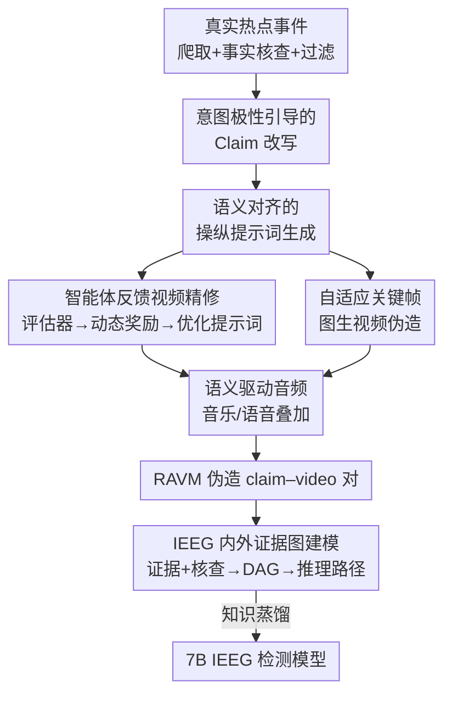

# VMD-FACT: A New Video Dataset and MLLM-based method for Detecting Realistic AI-Generated Video Misinformation

**会议**: CVPR 2026  
**论文**: [CVF Open Access](https://openaccess.thecvf.com/content/CVPR2026/html/Zhang_VMD-FACT_A_New_Video_Dataset_and_MLLM-based_method_for_Detecting_CVPR_2026_paper.html)  
**代码**: https://gitee.com/VR_NAVE/ravm （有）  
**领域**: AI安全 / 视频虚假信息检测  
**关键词**: 视频虚假信息检测, AI生成内容, 多模态大模型, 证据图, 多智能体数据构建

## 一句话总结
针对"AI生成视频虚假信息高度真实、跨模态一致、现有数据集编辑痕迹明显"的检测盲区，本文用多智能体框架迭代生成 9049 对真实感极强的 claim–video 伪造样本构成 RAVM 数据集，并提出把"多模态证据 + 事实核查结果 + 它们的依赖"建成有向无环证据图的 IEEG 模型，在 RAVM 上以 7B 参数（75.99% Accuracy）超过 25 个开源/闭源 MLLM（含 Gemini 2.5 的 68.89%）。

## 研究背景与动机
**领域现状**：视频虚假信息检测（Video Misinformation Detection, VMD）的核心任务是判断一条"文字陈述（claim）+ 视频"的配对是否在传播虚假信息。现有数据集（FakeSV、FakeTT、FakeVV、FMNV 等）几乎都靠**编辑技术**伪造——替换音频、改写情绪化文案、剪辑画面，再让模型去抓这些破绽。

**现有痛点**：编辑式伪造会**破坏跨模态一致性**，留下明显且容易检测的人工痕迹（artifact）。模型很容易过拟合到这些表面破绽上，鲁棒性差、领域窄（很多只覆盖 COVID、健康等单一话题）。可现实里随着 Sora、Kling 这类生成模型成熟，AI 生成的视频虚假信息**追求的恰恰是跨模态语义一致与高真实感**——文案、画面、声音彼此自洽，没有破绽可抓。这就在"训练数据长什么样"和"真实威胁长什么样"之间撕开一道鸿沟。

**核心矛盾**：现有数据集的伪造逻辑（制造不一致）与真实 AI 伪造的逻辑（维持一致）**南辕北辙**；而直接采集 AI 生成的真实感虚假信息又面临巨大的算力/成本开销，且很难保证质量与真实度，所以一直没有专门的数据集。

**本文目标**：(1) 造一个真正贴近 AI 生成威胁的 VMD 数据集，覆盖 claim/视频/音频/跨模态四类伪造来源；(2) 给出一个能在这种"高真实感、无明显破绽"场景下做**可解释**检测的方法。

**切入角度**：作者观察到两点——其一，伪造者是带**意图极性**（有害 vs 无害）造谣的，把这个意图显式建模进去能让伪造更像人造的真信息；其二，这种复杂伪造下，单纯的链式思维（CoT）推理难以刻画多模态证据之间的复杂依赖，会累积误差。于是把伪造侧做成"多智能体迭代精修"，把检测侧做成"证据图建模"。

**核心 idea**：伪造侧——用多智能体框架按意图极性自适应迭代生成跨模态一致的真实感伪造样本；检测侧——把多模态证据、事实核查结果及其依赖关系组织成有向无环图（证据图）来引导 MLLM 推理。

## 方法详解
本文有两条主线：**数据集构建**（RAVM，怎么造出真实感伪造样本）和**检测方法**（IEEG，怎么在这种样本上做可解释检测）。下面分别讲。

### 整体框架
伪造侧是一个**多智能体驱动的迭代生成框架**：先爬取并核查真实热点事件 → 按意图极性改写 claim → 由改写后的 claim 生成"语义对齐的操纵提示词" → 进入两个视频伪造模块（文生视频的智能体反馈精修、图生视频的关键帧伪造）→ 再叠加语义驱动的音频 → 产出"伪造 claim + 伪造视频"配对。整个视频生成是**带反馈回环**的：多个评估器打分、动态奖励算法汇总、优化器据此改提示词、再生成，迭代至达标。

检测侧是 **IEEG（Internal–External Evidence Graph，内外证据图）**：先用事实核查模块初判 claim 真伪，再让视频 MLLM（Gemini 2.5）抽取多模态证据、把证据与核查结果的依赖建成有向无环图，组织出连贯推理路径，最后蒸馏成一个 7B 小模型。

### 关键设计

**1. 意图极性引导的 Claim 改写：让假文案像"真信息"而非"明显谣言"**

现有数据集直接用 LLM 替换/改写/生成 claim，但**不显式建模造谣意图**，结果常常产生突兀、不真实的扭曲，模型一眼能看穿。本文的差别在于：把真实造谣研究里"有害 vs 无害"的**意图极性**作为约束喂进改写过程。具体把已核查为真的 claim 连同元数据（描述、点赞、转发、标签等）作为原始输入，由 Claim Manipulator 选择合适的伪造技术——替换（主体/时间/地点）、改写（叙事逻辑/情绪触发点）、生成——并同时考虑 claim 的**语义与意图极性**，形式化为 $c_f, d_f = G_c(c_a, m_a, P_c)$，其中 $c_a, m_a$ 是真实 claim 与元数据，$c_f, d_f$ 是伪造后的 claim 与描述，$P_c$ 是引导提示词。带上意图极性，伪造文案才更"可信、合乎人之常情"，而不是机械扭曲。

**2. 智能体反馈视频精修：用多评估器 + 动态奖励，把文生视频迭代逼到"真又骗"**

文生视频直接出片往往质量参差、且不一定和 claim 对齐。本模块分两阶段：候选生成阶段从视频生成模型库 $\mathcal{R}=\{R_1,...,R_{|R|}\}$ 取多个模型生成候选集 $V^{(t)}$；精修阶段引入三个评估器从不同角度打分——质量评估器 $E_q$、对齐评估器 $E_a$（评 claim–视频语义一致，分值 $\in[1,10]$，且同时给"打分 + 无分值理由"两种评估以防只盯分数）、以及一个在多个通用 VMD 数据集上微调过的**对抗评估器** $E_{adv}$，它对"假"类有高召回，输出 $s^{(t)}_{adv}\in\{0,1\}$ 表示这条配对是否还能被识破。

三种分由**动态奖励算法**汇总成基础奖励：

$$R^{(t)}_{base} = w_q \frac{s^{(t)}_q}{N_q} + w_a \frac{s^{(t)}_a}{N_a} + w_{adv}\, s^{(t)}_{adv}$$

为了让迭代稳定可控，还加了一个**趋势感知惩罚** $H^{(t)}$，只惩罚相邻迭代里质量/对齐分**下降**的趋势（$\Delta^{(t)}_q = \lambda_q(s^{(t-1)}_q - s^{(t)}_q)$，对齐同理），最终奖励 $R^{(t)} = R^{(t)}_{base} - \delta H^{(t)}$。优化器并不直接改视频，而是**间接地迭代调整操纵提示词** $P^{(t+1)} = \Gamma(\cdot)$ 来最大化奖励，并用一个"状态图"形式的历史优化记录约束语义漂移。达到奖励阈值 $\tau$ 或迭代上限 $t_{max}$（默认 3）就停。这套"打分 + 对抗 + 趋势惩罚 + 改提示词"的闭环，核心是让伪造视频既高质量、又和文案语义对齐、还能骗过检测器。

**3. 自适应关键帧图生视频伪造：用 image-to-video 提样本多样性**

只靠文生视频会让伪造模式单一。本模块走 image-to-video 路线：给定原始视频，Analyzer 抽取能承载叙事的关键帧 $K$，送入意图驱动的图像编辑块——Perceiver 解析伪造 claim 的潜在意图、输出编辑策略，Actuator 执行策略改图，迭代 $l$ 次：$K^{(l)} = (f_{per}(K) \circ f_{act}(K, P_e))^{(l)}$，$\circ$ 是操作复合。最终编辑好的关键帧 $K^{(l)}$ 再喂给 Generator 生成伪造视频。它和模块 2 是**两条并行的视频伪造路径**，一个从文本起手、一个从画面起手，合起来让 RAVM 的伪造形态更丰富。

**4. 语义驱动音频与证据图检测：自洽配音 + 把推理建成 DAG**

音频侧：现有数据集只是简单替换音频制造不一致或情绪刺激，导致模型过拟合表面模式。本文用 Semantic Perceiver 统筹 Music Expert 与 TTS Expert，自适应决定是否配背景音乐，并生成说话人属性（性别、语速、情绪、语调、内容）来驱动 TTS，使音乐和语音都与伪造 claim–video **保持语义一致**：$\tilde{v}^* = v^* \oplus \sigma_m \pi_{music} \oplus \sigma_s \pi_{speech}$（$\oplus$ 为音频叠加，$\sigma$ 为增益）。

检测侧 IEEG 是本文的方法贡献：面对 RAVM 这种高真实感样本，先用事实核查模块（Tavily API 做联网核查）初判 claim 真伪；再受 Graph-of-Thought 启发，用 Gemini 2.5 抽取多模态证据、把"证据节点 + 核查结果"作顶点集 $N$、把它们的依赖作边集 $L$，组织成**有向无环证据图**并整理出连贯推理路径。相比 CoT 一条链容易累积误差，证据图能显式刻画多模态证据间的复杂依赖。再结合 Agents-of-Thoughts 蒸馏，把能力压进一个 7B 的 IEEG，训练目标为 $L = \mu\, \mathbb{E}[-\log P(r\mid c,v,I)]$，推理时取最优路径 $r^* = \arg\max_r P(r\mid c,v)$。

### 损失函数 / 训练策略
检测模型 IEEG 通过**知识蒸馏**得到：用 Gemini 2.5 产出的证据图推理路径作监督信号 $I$，蒸馏目标为 $L = \mu\, \mathbb{E}_{c,v\sim\Omega,\, r\sim D}[-\log P(r\mid c,v,I)]$，$\mu$ 为温度系数。数据增强上，作者还用同一套生成框架为**真实 claim** 生成高保真视频（用更高阈值 $\tau$ 保真、并关闭对抗评估器），并接入 Sora2/Kling/Hailuo/PiKa 等商业闭源模型扩多样性，再混入 FakeTT、FMNV 的高质量真实样本。全部实验在 8×H100 上完成。

## 实验关键数据

### 主实验：25 个 MLLM 在 RAVM 上集体"翻车"，IEEG 反超
作者在 RAVM 上评测了 25 个 SOTA LLM/MLLM（23 开源 + 2 商业），主看 Accuracy 与 Macro-F1。结论是这些通用大模型在"真实感 AI 伪造视频"上普遍吃力，且**加大模型规模收益甚微**；7B 的 IEEG 反而拿到最好成绩。

| 方法 | 规模 | Accuracy↑ | Macro-F1↑ |
|------|------|-----------|-----------|
| Qwen3-VL-Instruct | 8B | 67.26 | 65.16 |
| InternVL3.5 | 20B | 68.31 | 60.23 |
| Qwen3-VL-Thinking | 30B | 68.53 | 67.77 |
| DeepSeek-V3.2-Exp | 671B | 64.56 | 63.14 |
| Gemini 2.0（闭源） | >500B | 68.07 | 56.28 |
| Gemini 2.5（闭源） | >500B | 68.89 | 68.00 |
| **IEEG（本文）** | **7B** | **75.99** | **73.44** |

Accuracy 上 IEEG 比最强的 Gemini 2.5 高 **7.1 个点**，比同尺寸开源 MLLM 高出十几个点，而参数量只有它们的零头。

### 鲁棒性消融：在 RAVM 上微调，对老数据集泛化反而更好
作者用 VideoLLaMA2-7B 做基线，比较"在 RAVM 微调"与"在各数据集自身训练集微调"对老 benchmark（FakeSV/FakeTT/FMNV）测试集的增益（Ours\* 表示去掉来自 FakeTT/FMNV 的样本后的 RAVM 子集）。

| 测试集 | 训练集 | Accuracy↑ | Macro-F1↑ |
|--------|--------|-----------|-----------|
| FakeSV | 自身训练集 | 66.04 (+9.34) | 64.81 (+8.30) |
| FakeSV | Ours\* (RAVM) | **70.18 (+13.48)** | **65.47 (+8.96)** |
| FakeTT | 自身训练集 | 56.64 (+15.03) | 56.63 (+19.09) |
| FakeTT | Ours\* (RAVM) | **78.26 (+36.65)** | **56.74 (+19.20)** |
| FMNV | 自身训练集 | 60.99 (+8.24) | 53.01 (+0.35) |
| FMNV | Ours\* (RAVM) | **68.12 (+15.37)** | **68.12 (+15.46)** |

在 RAVM 上微调对三个老数据集的提升**远超**在它们各自训练集上微调，说明 RAVM 的真实感伪造对模型是更难也更有用的训练信号。

### 关键发现
- **模式不可迁移性（Table 4）**：反过来，在老数据集（FakeSV/FakeTT/FMNV）上微调再去测 RAVM，Macro-F1 全面**下降**（如 FakeSV 训练 → RAVM 测 Macro-F1 掉 11.91，FMNV 掉 15.57）。说明老数据集的伪造模式让模型过拟合表面破绽，对真实 AI 伪造完全迁不过去——印证了"现有数据集不足以应对真实检测需求"。
- **数据质量量化领先**：用 AGAV-Rater、VBench 与 10 人用户研究（10 分制）评估，RAVM 在音视频一致性、真实感、主体一致性（VBench 91.34%）、动态度（RAFT 72.42%）等几乎所有指标上都**优于** FakeSV、FakeTT，说明其样本更真、更语义对齐。
- **规模不等于能力**：从 1B 到 671B 的开源模型、乃至 >500B 的 Gemini，在 RAVM 上 Accuracy 都卡在 68% 上下，单纯堆参数解决不了"高真实感跨模态伪造"这个问题，需要证据图这类结构化推理。

## 亮点与洞察
- **抓住了"威胁分布漂移"这个真问题**：传统 VMD 假设伪造=破坏一致性，而 AI 伪造恰恰维持一致性。本文把数据集的伪造逻辑从"造破绽"反转为"造自洽"，是 benchmark 设计上很到位的一次纠偏。
- **把"对抗评估器"嵌进生成回环很巧**：用一个在通用 VMD 上训过、对"假"高召回的检测器当裁判，专挑"还能被识破"的样本继续精修，等于用检测器反向**逼出更难骗的样本**，让数据集自带难度下限。
- **趋势感知惩罚 $H^{(t)}$ 的设计可迁移**：只惩罚分数下降趋势、不直接锁分数，避免了"只盯分数导致失控精修"，这种"惩罚退步而非锁定绝对值"的迭代约束思路可用到其他带评估反馈的生成优化里。
- **证据图 vs 链式推理**：把多模态证据与核查结果的依赖建成 DAG 而非一条 CoT 链，针对的是"多源证据相互制约、单链会累积误差"的痛点，7B 蒸馏模型反超 Gemini 2.5 是个有说服力的论证。

## 局限与展望
- **生成与检测严重依赖闭源 Gemini 2.5**：评估器、优化器、证据图抽取、音频感知器几乎全用 Gemini 2.5，伪造侧还接入 Sora2/Kling 等商业模型——可复现性与成本是现实门槛，且数据集的"真实感上限"被这些闭源模型的能力绑定。
- **对抗评估器可能引入循环偏置**：用检测器筛"难骗样本"会让 RAVM 系统性偏向"能骗过该检测器"的分布，IEEG 又在 RAVM 上训练，存在生成器与检测器互相塑形、评测略乐观的风险（论文未深入讨论这点）。
- **IEEG 的真实类召回偏弱**：从主表看 IEEG 对 Fake 类 F1 高（81.66），但 Real 类指标（Recall 70.60、F1 65.23）相对一般，实际部署里"把真信息误判为假"同样有害，这块平衡可再优化。
- **缺关键消融**：正文给了数据集鲁棒性/迁移性消融，但 IEEG 自身（证据图 vs 纯 CoT、是否用事实核查、蒸馏前后）的组件级消融放在补充材料，主文里看不到证据图到底贡献多少。

## 相关工作与启发
- **vs 编辑式 VMD 数据集（FakeSV / FakeTT / FMNV / FakeVV）**：它们靠剪辑/替换制造跨模态不一致，留明显破绽；RAVM 用生成模型造**跨模态一致、高真实感**的样本，并首次覆盖 claim/视频/音频/跨模态四类来源 + 多种技术，9049 对（4355 真 / 4694 假）。Table 4 直接证明老数据集训出来的模型迁不到 RAVM。
- **vs 基于 CoT 的 VMD 方法（如用 RL 让 MLLM 产长链推理的工作）**：CoT 一条链难以建模多模态证据间的复杂依赖、易累积误差；IEEG 用有向无环证据图显式刻画依赖，再蒸馏成小模型，结构化推理换来更稳的检测。
- **vs Deepfake 检测 benchmark**：Deepfake 视频通常**不配 claim**，而 VMD 要求每个视频对应特定 claim 且叙事连贯，所以 deepfake 数据不能直接拿来建 VMD 数据集——这也是本文要专门造多智能体生成框架的原因。
- **可迁移启发**："用对抗裁判逼出难样本 + 趋势惩罚稳定迭代 + 间接改提示词而非改产物"的生成回环，可用于其他需要"高真实感且可控"的合成数据构建任务。

## 评分
- 新颖性: ⭐⭐⭐⭐⭐ 反转伪造逻辑造首个真实感 AI 视频虚假信息数据集 + 证据图检测，问题切得准、方案成体系。
- 实验充分度: ⭐⭐⭐⭐ 25 个 MLLM 大规模评测 + 跨数据集迁移 + 多种质量度量很扎实，但 IEEG 自身组件消融放在补充材料、主文偏弱。
- 写作质量: ⭐⭐⭐⭐ 动机与框架清晰，公式规范；但模块众多、部分依赖关系（尤其证据图细节）需查补充材料。
- 价值: ⭐⭐⭐⭐⭐ 直击 Sora 时代的真实威胁，数据集 + 方法 + 大规模评测都公开，对 AI 安全/取证社区有实打实的推动作用。

<!-- RELATED:START -->

## 相关论文

- [\[CVPR 2026\] Skyra: AI-Generated Video Detection via Grounded Artifact Reasoning](skyra_ai-generated_video_detection_via_grounded_artifact_reasoning.md)
- [\[CVPR 2026\] Detecting Compressed AI-Generated Images via Phase Spectrum Robustness](detecting_compressed_ai-generated_images_via_phase_spectrum_robustness.md)
- [\[CVPR 2026\] RunawayEvil: Jailbreaking the Image-to-Video Generative Models](runawayevil_jailbreaking_the_image-to-video_generative_models.md)
- [\[CVPR 2026\] FeatureFool: Zero-Query Fooling of Video Models via Feature Map](featurefool_zero-query_fooling_of_video_models_via_feature_map.md)
- [\[CVPR 2026\] FVBench: Benchmarking Deepfake Video Detection Capability of Large Multimodal Models](fvbench_benchmarking_deepfake_video_detection_capability_of_large_multimodal_mod.md)

<!-- RELATED:END -->
