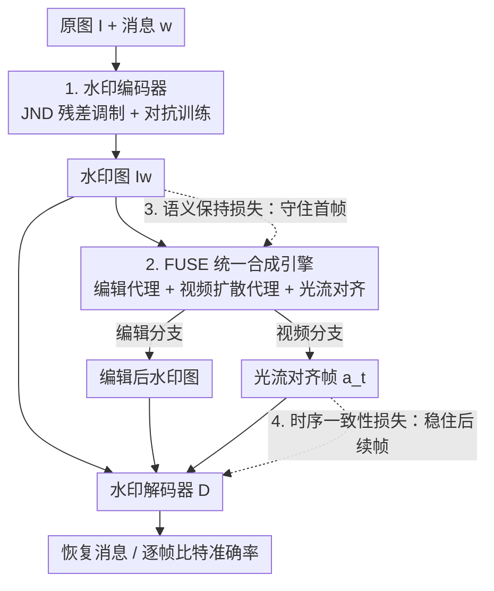

# WaTeRFlow: Watermark Temporal Robustness via Flow Consistency

**会议**: CVPR 2026  
**论文**: [CVF Open Access](https://openaccess.thecvf.com/content/CVPR2026/html/Jeong_WaTeRFlow_Watermark_Temporal_Robustness_via_Flow_Consistency_CVPR_2026_paper.html)  
**代码**: 待确认  
**领域**: AI安全 / 图像水印  
**关键词**: 图像水印, 图像生成视频, 光流一致性, 溯源验证, 时序鲁棒性

## 一句话总结
WaTeRFlow 让图像水印在被「图生视频（I2V）」转写后仍能从生成的视频帧里高准确率地解码出来——靠一个把图像编辑代理 + 快速视频扩散代理 + 光流对齐塞进编解码训练回路的 FUSE 模块，配上时序一致性损失和语义保持损失，把 SVD-XT 上的平均比特准确率从 VINE 的 73.92% 抬到 84.96%、首帧达到 96.93%。

## 研究背景与动机

**领域现状**：数字水印把一段不可见的消息嵌进图像，用于版权与溯源。近年深度学习水印（HiDDeN、TrustMark、WAM、Robust-Wide、VINE 等）已经能抗住 JPEG 压缩、模糊、甚至扩散模型的指令式编辑，水印在被 diffusion 编辑后往往还能被检出。

**现有痛点**：但当有人把一张带水印的图喂给图生视频（I2V）模型、生成一段连贯视频时，逐帧水印检测会迅速衰减。论文给的场景很具体：Alice 在自己的图片里嵌了水印，未授权用户 Bob 用 I2V 模型把这张图生成视频，还可能在生成前后再叠加编辑、再生成、压缩等操作；Alice 只拿到生成的视频，却必须从视频帧里把水印高准确率地恢复出来以证明版权来源。

**核心矛盾**：I2V 不同于 JPEG 这类「在固定画布上加扰动」的失真——它从单张图合成出时序连贯的多帧，等于一个「水印破坏变换」：它在各频段削弱水印信号，并引入逐帧变化、随时间漂移的亚像素错位（subpixel misalignment），让逐帧恢复天生困难，越往后的帧掉得越狠。现有水印方法在训练时根本没见过这种 I2V 失真。

**本文目标**：训出一对编码器/解码器，使得「单张水印图 → I2V → 视频帧」之后，每一帧（尤其首帧和后续帧）都能稳定解出水印，且在 I2V 前后再叠加各种失真时仍鲁棒。

**切入角度**：既然 I2V 失真的本质是「跨帧的亚像素漂移 + 信号衰减」，那就在训练时把真实的视频生成效应直接喂给编解码器看，并用光流把每一帧对齐回首帧来「抵消漂移」，再加时序正则把逐帧预测稳住。难点是 I2V 扩散又慢又吃显存，没法塞进训练回路——作者用一个两到四步、无 CFG 的快速视频扩散代理（AnimateLCM）当替身解决。

**核心 idea**：在编码器和解码器之间插一个 FUSE 模块，把「指令式图像编辑 + 快速视频扩散 + 光流对齐」统一进一个端到端训练回路，让编解码器在训练时就适应 I2V 引入的真实像素变换。

## 方法详解

### 整体框架

给定原图 $I \in \mathbb{R}^{C\times H\times W}$ 和 $k$ 比特消息 $w\in\{0,1\}^k$，编码器 $E$ 产出水印图 $I_w=E(I,w)$；I2V 生成器（如 SVD）以 $I_w$ 为条件生成帧序列 $V=\{v_t\}$；解码器 $D$ 从每一帧里预测水印。整个系统分三段：**水印编码 → FUSE 鲁棒性增强 → 水印解码**，端到端联合优化。

关键的「鲁棒性」全压在中间的 FUSE 上：训练时不直接对接昂贵的真 I2V 模型，而是用 FUSE 里的图像编辑代理（InstructPix2Pix）和视频扩散代理（AnimateLCM）模拟真实失真，并对生成的每一帧做光流对齐，再把「水印图 / 编辑后图 / 对齐帧」一起送进解码器算损失。测试时才换成真正的 SVD-XT / CogVideoX，验证「从代理学到的鲁棒性能否迁移」。

### 关键设计

**1. 水印编码器：用 JND 把信号藏进「最不显眼的地方」**

水印要既不可见、又要在 VAE 编码的隐空间里挺得住（因为编辑和视频生成都在隐空间发生）。编码器是一个消息条件化的 U-Net：先把 $k$ 比特消息排成 $m\times m$（$m=\sqrt{k}$）的比特网格，用 CNN 上采样成特征图，与输入图沿通道拼接后过 U-Net 产出水印信号。关键的不可见性技巧在于：编码器不直接输出水印图，而是只调制「原始输出与原图之间的残差」——它从一张 JND（恰可察觉差异，just-noticeable difference）热力图算出一个单通道、与图同分辨率的缩放图，把残差按元素乘上这个缩放图再加回原图。缩放图被约束远离零以防水印信号消失，于是水印信号被自动集中到「人眼最不敏感」的区域。再叠加一个 PatchGAN 对抗网络 $A$（输出 patch 级 logit 图，提供稠密监督）：$A$ 学着区分原图与水印图，编码器学着骗过 $A$，从而进一步压低可见性。这一设计让 WaTeRFlow 在 100 比特容量下仍拿到 PSNR 38.83 / SSIM 0.9902 的水印图质量。

**2. FUSE：把真实的「编辑 + 图生视频」失真搬进训练回路**

这是全文的核心，针对的痛点是「编解码器训练时从没见过 I2V 失真」。FUSE（Flow-guided Unified Synthesis Engine）被插在编码器和解码器之间，含两条分支。**编辑分支**用 InstructPix2Pix 当代理，按文本指令对水印图做编辑，让解码器学会从编辑后的图里恢复水印。**视频生成分支**才是关键：它先用视频扩散代理生成 $M$ 帧（含第 0 帧），再用 RAFT 光流估计器把每一帧 $v_t$ 对齐回参考帧 $v_0$。对齐写成

$$a_t = W(v_t, u_t),\quad u_t = F(v_0, v_t)\in\mathbb{R}^{H\times W\times 2},$$

其中 $F$ 是光流估计器、$u_t$ 是从 $v_0$ 到 $v_t$ 的前向光流场、$W$ 是双线性反向 warp：$[W(v,u)](p)=v(p+u(p))$，即在参考网格 $v_0$ 的坐标 $p$ 处去采样 $v_t$ 的 $p+u_t(p)$。这一步把 I2V 引入的逐帧亚像素漂移「拉回对齐」，从而控制了编解码器在训练时看到的失真强度，让学习更稳。视频代理选 AnimateLCM 而非 SVD，是因为它两到四步、无需 CFG 即可出高质量视频，省去额外的无条件/有条件前向，把训练显存和耗时压到最低（见消融表 4：AnimateLCM 峰值显存 44.51 GB、训练 17.70 h，远低于 SVD 带 CFG 的 93.80 GB / 42.39 h）。训练从第 7000 步起才激活视频分支。

**3. 语义保持损失：守住条件信号，把首帧救回来**

I2V 模型（如 SVD）的去噪 U-Net 用「条件图的 CLIP 嵌入」当注意力的 key/value，所以条件图一旦被水印扰动，生成的首帧就会偏离水印图，首帧水印随之难解。语义保持损失直接约束水印图与原图的 CLIP 嵌入：

$$\mathcal{L}_{\text{sem}} = 1 - \cos\big(f_{\text{CLIP}}(I_w), f_{\text{CLIP}}(I)\big),$$

其中 $f_{\text{CLIP}}$ 是冻结的 CLIP 图像编码器、输出单位范数嵌入。它的作用是让水印图在语义上贴近原图，从而让 I2V 用到的条件信号 $c$ 少受水印信号干扰——这样首帧 $v_0$ 会紧贴 $I_w$，首帧比特准确率显著上升（消融里去掉它，首帧从 96.93% 掉到 89.63%）。作者还做了个有意思的替换实验：把 CLIP 换成 DINOv2 的结构性表征也能提首帧准确率，说明「保住结构/布局/低频线索」这件事本身就有效，不依赖于和 SVD 同一个 CLIP 空间。

**4. 时序一致性损失（TCL）：把后续帧的抖动压下去**

即便做了光流对齐，I2V 的亚像素漂移仍会残留，导致逐帧水印预测来回波动、平均和后段比特准确率都被拖低。TCL 直接约束「相邻对齐帧的解码输出要相近」：

$$\mathcal{L}_{\text{TCL}} = \frac{1}{M-1}\sum_{\ell=1}^{M-1}\big\|D(a_\ell) - D(a_{\ell-1})\big\|_2^2,$$

其中 $a_\ell$ 是第 $\ell$ 帧对齐回 $v_0$ 后的帧、$D$ 是解码器。它是把「时序平滑」直接施加在解码器输出的 logit 上，让逐帧输出方差变小、缓解后段帧的退化。消融里去掉 TCL，平均准确率从 84.96% 掉到 81.65%。

### 损失函数 / 训练策略

总目标是编码器损失、解码器损失、对抗损失三者加权之和：

$$\mathcal{L}_{\text{total}} = \mathcal{L}_{\text{enc}} + \lambda_{\text{dec}}\mathcal{L}_{\text{dec}} + \lambda_{\text{adv}}\mathcal{L}^{G}_{\text{adv}}.$$

- **编码器损失** $\mathcal{L}_{\text{enc}} = \mathcal{L}_{\text{pixel}} + \lambda_{\text{latent}}\mathcal{L}_{\text{latent}} + \lambda_{\text{LPIPS}}\mathcal{L}_{\text{LPIPS}} + \lambda_{\text{sem}}\mathcal{L}_{\text{sem}}$：像素 MSE + VAE 隐空间 MSE + LPIPS 感知损失 + 语义保持损失，保证水印在像素和隐空间都隐蔽。
- **解码器损失** $\mathcal{L}_{\text{dec}} = \mathcal{L}_{\text{TCL}} + \mathcal{L}_{\text{MSG}}$，其中 $\mathcal{L}_{\text{MSG}}$ 是对水印图 $I_w$、编辑后图 $\tilde{I}_w$、以及 $M$ 个对齐帧 $a_\ell$ 分别算逐比特 BCE 之和。
- **对抗损失**：PatchGAN $A$ 用 $\mathcal{L}_{\text{disc}}$ 学着把原图判高、水印图判低，编码器用 $\mathcal{L}^{G}_{\text{adv}}$ 学着骗过它。
- 超参：$\lambda_{\text{latent}}=10^{-3}$、$\lambda_{\text{LPIPS}}=0.18$、$\lambda_{\text{sem}}=10^{-3}$、$\lambda_{\text{dec}}=1.3$、$\lambda_{\text{adv}}=0.004$；单卡 A100 训 20000 步，FUSE 生成 4 帧（含第 0 帧），第 7000 步起开视频分支，所有预训练组件全程冻结。

## 实验关键数据

数据：训练用 InstructPix2Pix 的 20000 对图–指令；评测从 UltraEdit 取 512×512 真实图随机采 500 张测 I2V 鲁棒性。测试端用 SVD-XT（U-Net）和 CogVideoX（DiT）两种 I2V 架构验证迁移性。容量统一为 100 比特（WAM 因方法所限保留 32 比特）。

### 主实验（SVD-XT 各类失真下的平均比特准确率 %）

| 失真设置 | Robust-Wide | VINE | TrustMark | WaTeRFlow（本文） |
|---|---|---|---|---|
| 水印图（None，未生成视频） | 99.99 | 99.99 | 99.92 | 99.86 |
| I2V（None，纯图生视频） | 63.40 | 73.92 | 73.76 | **84.96** |
| I2V + 编辑 | 59.92 | 66.56 | 69.05 | **80.20** |
| I2V + H.264（CRF=23） | 63.28 | 73.75 | 73.31 | **84.64** |
| I2V + 再生成（ts=150） | 60.25 | 71.83 | 53.48 | **81.98** |
| I2V + JPEG（Q=50） | 62.45 | 78.08 | 71.66 | **81.45** |
| I2V + 高斯噪声（σ=0.05） | 65.02 | 75.15 | 71.95 | **81.14** |
| I2V + 高斯模糊（σ=1.5） | 60.31 | 77.66 | 76.80 | **85.78** |

水印图本身四方法都接近 100%，差距全在「图生视频后」拉开：纯 I2V 下 WaTeRFlow 比次优的 VINE 高 11 个百分点，且在生成前/后叠加各类失真时全面领先。首帧准确率达 96.93%。

### 质量对比（SVD-XT，水印图 vs 生成视频）

| 方法 | 水印图 PSNR | 水印图 SSIM | 视频 PSNR | 视频 Bit Acc. |
|---|---|---|---|---|
| Robust-Wide | 36.88 | 0.9698 | 19.56 | 63.40 |
| VINE | 33.88 | 0.9828 | 17.86 | 73.92 |
| TrustMark | 40.33 | 0.9902 | 22.37 | 73.76 |
| WaTeRFlow | 38.83 | 0.9902 | 22.43 | **84.96** |

在鲁棒性大幅领先的同时，水印图/视频质量与最强基线持平（视频 PSNR 22.43 为最高）。

### 消融实验（SVD-XT）

| FUSE-I | FUSE-V | TCL | Lsem | 首帧 | 平均 | 平均(带编辑) |
|---|---|---|---|---|---|---|
| - | - | - | - | 55.12 | 55.11 | 54.87 |
| - | ✓ | ✓ | ✓ | 93.26 | 81.65 | 77.47 |
| ✓ | - | - | ✓ | 91.89 | 66.32 | 63.56 |
| ✓ | ✓ | - | ✓ | 92.23 | 79.11 | 74.67 |
| ✓ | ✓ | ✓ | - | 89.63 | 76.82 | 72.79 |
| ✓ | ✓ | ✓ | ✓ | **96.93** | **84.96** | **80.20** |

（I/V 分别为 FUSE 的图像编辑分支和视频生成分支。）

### 关键发现
- **视频分支是平均准确率的命脉**：去掉 FUSE-V（只剩编辑分支）平均从 84.96% 崩到 66.32%——不让编解码器在训练时见到 I2V 失真，鲁棒性几乎无从谈起。
- **语义保持损失主救首帧**：去掉 Lsem 首帧从 96.93% 掉到 89.63%，印证「守住 CLIP 条件信号 → 首帧贴近水印图」的机制。
- **TCL 主救后续帧的平均**：去掉 TCL 平均掉到 79.11%，它压住了逐帧抖动。
- **代理选 AnimateLCM 性价比最高**：比 SVD（带 CFG）准确率略高（84.96 vs 83.83）却只用 44.51 GB 显存 / 17.70 h（SVD 带 CFG 要 93.80 GB / 42.39 h）；SVD 不带 CFG 准确率只有 72.93%，说明 SVD 要好用必须开 CFG、代价高昂。
- **光流估计器是训练能否稳定收敛的开关**：没有它，训练时的 BCE 损失轨迹不稳，解码器无法充分适应 I2V 失真。

## 亮点与洞察
- **把「I2V 失真」当成一类可模拟的训练时增广，是最关键的视角转换**：以往水印的鲁棒性增广是 JPEG/模糊/扩散编辑这类「固定画布扰动」，本文识别出 I2V 的本质是「跨帧亚像素漂移 + 信号衰减」，并用「快速视频代理 + 光流对齐」把它纳入训练回路——这个 problem formulation 本身比具体损失更有价值。
- **用快速一致性模型（AnimateLCM）当训练代理**是把昂贵生成过程塞进训练循环的通用 trick：两到四步、无 CFG，显存和耗时都减半，且消融证明从代理学到的鲁棒性能迁移到真 SVD-XT / CogVideoX。这套「用蒸馏/一致性代理替代昂贵 teacher 进训练回路」的思路可迁移到任何需要在训练中调用大生成模型的任务。
- **首帧和后续帧用两个不同机制分别治理**：首帧问题源于条件信号被扰动（用语义保持损失治），后续帧问题源于时序漂移（用光流对齐 + TCL 治），对症下药、互不替代，消融里各自掉点的位置也对得上。

## 局限与展望
- 作者承认：只在 SVD 和 CogVideoX 上评测；若视频生成器大幅改写首帧或条件信号的语义内容，准确率会下降；若生成器的合成原理与训练用的视频代理差异极大，鲁棒性也会退化——本质是「代理→真模型」迁移的覆盖面有限。
- 作者也指出对「对抗性主动去除水印」的讨论不足，目前只测了常见失真和编辑，没有针对性的去水印攻击者。
- 自己补充：方法依赖光流估计器（RAFT）把帧对齐回首帧，若 I2V 生成的运动剧烈、光流估计失败，对齐和 TCL 的前提就会动摇（补充材料里也讨论了运动幅度与后段准确率的关系）；另外全套训练需要冻结的多个大模型代理，复现成本不低。

## 相关工作与启发
- **vs VINE**：VINE 也做扩散编辑鲁棒性，并提出了含 I2V 流程的 benchmark，是本文最直接的对手；但 VINE 训练时没有专门针对 I2V 的跨帧漂移建模，纯 I2V 下只有 73.92%，WaTeRFlow 用 FUSE + 光流对齐 + TCL 把它顶到 84.96%。
- **vs Robust-Wide**：Robust-Wide 针对指令式图像编辑（InstructPix2Pix 那一类），本文沿用了它的编辑代理思路，但额外补上了视频生成分支——只抗编辑、不抗 I2V，纯 I2V 下仅 63.40%。
- **vs TrustMark / WAM**：TrustMark 主打分辨率缩放鲁棒、WAM 主打局部编辑的像素级检测，二者都不针对 I2V 的时序失真，I2V 后分别只有 73.76% / 63.87%。
- **启发**：把「生成式后处理（I2V、风格化、超分等任何会改变像素分布的生成过程）」统一抽象成「训练时可微/可模拟的失真层」，再配合对齐 + 时序正则，可能是水印对抗下一代生成模型的通用范式。

## 评分
- 新颖性: ⭐⭐⭐⭐⭐ 首次把 I2V 当作水印破坏变换并系统建模，problem formulation 和 FUSE 设计都新。
- 实验充分度: ⭐⭐⭐⭐ 两种 I2V 架构 + 8 类失真 + 完整消融（含代理选择、光流、DINOv2 替换），但缺主动去水印攻击的评测。
- 写作质量: ⭐⭐⭐⭐ 场景设定清晰、机制与消融一一对应；公式记号偏密。
- 价值: ⭐⭐⭐⭐⭐ 直击「图生视频时代的版权溯源」这一现实痛点，方法实用且代理思路可迁移。

<!-- RELATED:START -->

## 相关论文

- [\[CVPR 2026\] Meta-FC: Meta-Learning with Feature Consistency for Robust and Generalizable Watermarking](meta-fc_meta-learning_with_feature_consistency_for_robust_and_generalizable_wate.md)
- [\[CVPR 2026\] GROW: Watermark Generation with Progressive Guidance for Diffusion Models](grow_watermark_generation_with_progressive_guidance_for_diffusion_models.md)
- [\[CVPR 2026\] AdvFM: Lookahead Flow-Matching Velocity-Field Attacks for Imperceptible and Transferable Adversarial Examples](advfm_lookahead_flow-matching_velocity-field_attacks_for_imperceptible_and_trans.md)
- [\[CVPR 2026\] FlowHijack: A Dynamics-Aware Backdoor Attack on Flow-Matching Vision-Language-Action Models](flowhijack_a_dynamics-aware_backdoor_attack_on_flow-matching_vision-language-act.md)
- [\[CVPR 2026\] Verifying Neural Network Robustness with Dual Perturbations](verifying_neural_network_robustness_with_dual_perturbations.md)

<!-- RELATED:END -->
