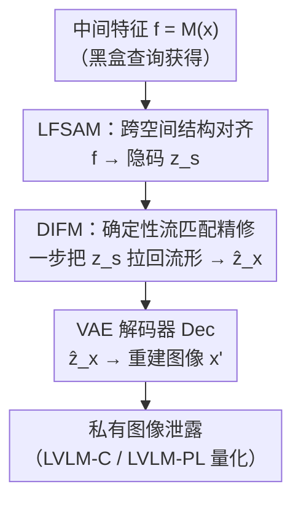

# What Your Features Reveal: Data-Efficient Black-Box Feature Inversion Attack for Split DNNs

**会议**: CVPR 2026  
**论文**: [CVF Open Access](https://openaccess.thecvf.com/content/CVPR2026/html/Ren_What_Your_Features_Reveal_Data-Efficient_Black-Box_Feature_Inversion_Attack_for_CVPR_2026_paper.html)  
**代码**: 待确认  
**领域**: AI安全 / 隐私攻击 / 特征反演  
**关键词**: 特征反演攻击, Split DNN, 黑盒攻击, Flow Matching, 隐私泄露

## 一句话总结
针对 Split DNN（边端跑头部、云端跑尾部）传输的中间特征，提出黑盒、数据高效的特征反演框架 FIA-Flow：先用 LFSAM 把任务特征对齐到 VAE 隐空间，再用确定性 Flow Matching（DIFM）一步把"离流形"的隐码拉回自然图像流形，仅用 <4096 张训练样本就能从中间特征高保真重建出原始私有图像。

## 研究背景与动机
**领域现状**：为了让算力受限的边缘设备也能跑大模型，Split DNN 把网络切成两段——轻量"头部"放在端侧、计算密集的"尾部"放在云端，端侧只把中间特征 $f=M(x)$ 传给云端。业界长期把它当成一种"隐私保护"方案，因为原始输入 $x$ 始终留在本地、不出端。

**现有痛点**：但中间特征在传输时暴露，构成了一个比传统模型反演（MIA，靠最终输出反推）更直接的攻击面——拦截链路的攻击者、或越权分析用户特征的"好奇云服务器"都能拿到 $f$。已有的特征反演攻击（FIA）有三个硬伤：(i) **白盒假设**——大多数方法需要知道受害模型的结构和权重，现实部署里拿不到；(ii) **重度依赖数据**——学习类方法要成千上万对"特征-图像"配对才能训；(iii) **推理代价高**——优化类方法每张图都要迭代上千步，既无法实时、又因为查询次数异常容易被检测。结果是现有 FIA 重建质量普遍偏低，让人误以为"特征泄露其实没那么危险"。

**核心矛盾**：FIA 本质是要学一个从特征空间 $\mathcal{F}$ 到图像空间 $\mathcal{X}$ 的逆映射 $G$。但 $\mathcal{F}$ 是为分类任务优化的、与生成用的隐空间流形天生不兼容，直接学 $G$ 是个高度病态（ill-posed）的问题；要把它学好就得堆数据、堆迭代，于是黑盒 + 数据高效 + 快速推理三者很难同时满足。

**本文目标**：在**黑盒**（只能查询拿到 $(x_i, f_i)$ 配对、不知道 $M$ 的结构权重）、**少样本**、**一步推理**三个约束下，做出真正高保真的特征反演，从而暴露 Split DNN 被低估的隐私风险。

**切入角度**：与其硬学一个端到端的病态逆映射，不如把它**解耦成两步**——先解决"结构对齐"（把任务特征搬到 VAE 隐空间的形状上），再解决"分布修正"（把对齐后但仍偏离自然流形的隐码拉回流形）。结构对齐降低了假设类复杂度、让少样本可泛化；分布修正只需做"残差校正"，而非从噪声从头生成。

**核心 idea**：用"对齐-精修（alignment-refinement）"两阶段范式替代端到端逆映射——LFSAM 负责跨空间对齐、确定性 Flow Matching（DIFM）以对齐后的隐码为起点一步把它推回自然图像流形。

## 方法详解

### 整体框架
FIA-Flow 要做的事：输入是受害 Split DNN 头部 $M$ 在某个切分层产出的中间特征 $f=M(x)$，输出是重建图像 $x' \approx x$。它把复杂逆映射 $G$ 拆成三段串行：

$$x' = G(f) = \mathrm{Dec}\big(G_{\text{refine}}(G_{\text{align}}(f))\big)$$

其中 $G_{\text{align}}$（LFSAM）把任务特征 $f$ 映成一个与 VAE 隐空间维度兼容、结构对齐的隐张量 $z_s$；$G_{\text{refine}}$（DIFM）在隐空间内做语义增强，把"离流形"的 $z_s$ 校正成贴近真实隐码的 $\hat{z}_x$；最后用预训练 VAE 的解码器 $\mathrm{Dec}$ 把 $\hat{z}_x$ 解码成攻击图像。整条链路只需要对受害模型做查询，不碰其内部参数，因此是黑盒的。

### 关键设计

**1. LFSAM 跨空间结构对齐：把"为分类优化的特征"搬到"为生成准备的隐空间"上**

直接从 $f$ 解码成图像之所以是病态问题，是因为 $\mathcal{F}$ 是任务特定、为分类而非合成优化的，其结构和 VAE 隐空间 $\mathcal{Z}$ 的流形天生不兼容。LFSAM（Latent Feature Space Alignment Module）的任务就是把 $f$ 变成一个既**维度兼容**又**结构对齐**于 VAE 隐空间的隐张量 $z_s$。选 VAE 隐空间作为落脚点有两个理由：它连续且结构化，给后续精修提供稳定流形；它低维，压缩了假设类复杂度，让对齐在少样本下也能泛化。

具体地，LFSAM 由三部分组成。一是基于 **PixelShuffle 的空间化层** $\mathrm{PS}: \mathbb{R}^{r^2 C_{in}\times H_{in}\times W_{in}} \to \mathbb{R}^{C_{in}\times rH_{in}\times rW_{in}}$，把不同网络层、不同分辨率的通道编码信息"展开"成显式的几何网格——这比标准插值多了一层可学习变换，能适配各种切分层。二是一个带跳连和自注意力的 **U 形 backbone** $B(\cdot)$：编码器抽出层级特征 $\{e_1,\dots,e_L\}$，解码器逐级重建并通过跳连融合 $d_{i+1}=D(\mathrm{concat}(d_i, e_i))$，自注意力负责捕捉长程空间依赖，得到 $F_d=B(f)$。三是 **特征聚合网络 FAN**，用 $1\times1$ 卷积 $\phi_i$ 把各级 $e_i$ 投到共享空间再拼接融合 $F_{fan}=\mathrm{Conv}_{fuse}(\mathrm{concat}_{i=1}^L(\phi_i(e_i)))$。最终对齐特征为：

$$z_s = \mathrm{Conv}_{out}(F_d + F_{fan})$$

这种"层级聚合 + 维度重排"正是 FIA-Flow 数据高效的来源：它把映射复杂度压下来，使少到 128 张样本也能学出可用的对齐。

**2. DIFM 确定性流匹配精修：把"离流形"的对齐隐码一步拉回自然图像流形**

LFSAM 保证了 $z_s$ 维度对得上 VAE 隐空间，但**不保证** $z_s$ 服从 VAE 编码器从自然图像得到的真实隐码分布——因为 $z_s$ 来自任务特征变换，大概率落在隐空间 $\mathcal{Z}$ 的"离流形（off-manifold）"区域。VAE 解码器只在"在流形"样本上训练过，喂给它离流形输入就会产出模糊、语义不一致的图像（论文用 FIA-Align 基线验证了直接解码 $z_s$ 效果很差）。DIFM（Deterministic Inversion Flow Matching）就是来修这个分布失配。

它的关键巧思是**改造标准 Flow Matching 的先验**：常规生成模型从高斯先验 $p_0'=\mathcal{N}(0,I)$ 出发，而 DIFM 直接以"有意义的初始化" $p_0=p(z_s)$ 为起点，学一个确定性向量场 $v_\theta(z,t)$，把 $z_s$ 的分布搬运到目标真实隐码分布 $p_1=p(z_x)$，其中 $z_x=\mathrm{Enc}(x)$。训练时在 $z_s$ 与目标 $z_x$ 之间定义线性插值路径 $z_t = t\cdot z_x + (1-t)\cdot z_s$，让 $v_\theta$ 逼近目标场 $u_t = dz_t/dt = z_x - z_s$。分布演化满足连续性方程：

$$\partial_t p_t(z) + \nabla_z\cdot\big(p_t(z) v_\theta(z,t)\big) = 0$$

因为 LFSAM 已经把 $z_s$ 推到离 $z_x$ 很近的地方，要学的向量场很简单、近乎线性，于是可以**抛弃昂贵的 ODE 求解器，用单步前向欧拉**直接出结果：

$$\hat{z}_x = \hat{z}_1 = z_s + v_\theta(z_s, t=0)$$

这一招把"从零生成"的难题转化成"残差校正"，既简化了向量场的学习动态、降低了数据需求，又实现一步推理。消融里 DIFM 一步就远超 DDPM 跑 200 步（见实验），印证了"确定性 + 有意义初始化"比"加噪再去噪"的随机范式更适合需要忠实重建特定输入的 FIA 任务。

**3. LVLM 双指标量化"人眼视角的隐私泄露"：PSNR 高不等于隐私泄得多**

传统 IQA 指标（PSNR/SSIM/LPIPS）衡量的是像素/感知相似度，但隐私泄露的真正问题是"攻击者能不能从重建图里认出私有内容"。作者用大视觉语言模型（gpt-4o-mini）当"图像描述专家"，分别描述原图和反演图，再让"泄露检查器"比对：**LVLM-C（Consistency）** 判断两段描述是否指向同一主要物体（一致记 1）；**LVLM-PL（Privacy-Leakage）** 用 BERTScore 计算两段描述的语义相似度。两个值越高，说明攻击者能从反演图里提取越多可辨识的私有信息。这套指标把"重建是否真的造成隐私泄露"从人的视角量化出来，比单看 IQA 更能反映威胁的真实严重程度。

### 损失函数 / 训练策略
两阶段解耦训练：**Stage 1 训 LFSAM**，冻结预训练 VAE 编码器拿目标隐码 $z_x=\mathrm{Enc}(x)$，特征对齐损失 $L_{fea}=\mathbb{E}[\|z_s-z_x\|_2^2]$ 加图像域重建损失 $L_{img}=\mathbb{E}[\|\mathrm{Dec}(z_s)-x\|_1]$，合为 $L_{s1}=L_{fea}+L_{img}$。**Stage 2 冻结 LFSAM、训 DIFM**：流匹配损失 $L_{fm}=\mathbb{E}[\|v_\theta(z_t,t)-u_t\|_2^2]$ 加重建损失 $L_{rec}=\mathbb{E}[L_{LPIPS}(x',x)+L_{L1}(x',x)]$，合为 $L_{s2}=L_{fm}+L_{rec}$。DIFM 用 Stable Diffusion 2.1 预训练权重初始化，冻结 U-Net、只插一个 rank=4 的 LoRA，batch=8、lr=1e-4，每阶段训 64000 步，A100 上完成。

## 实验关键数据

在 ImageNet-1K 上仅随机采 **4096 张（<0.32%）** 训练、1000 张验证测试；受害层覆盖 AlexNet(F-10)、ResNet-50(L1-2/L4-2)、Swin-B(F3-2)、YOLO11n(M-8)、DINOv2-B(B-11)，跨分类/检测/自监督基础模型。

### 主实验
反演图用 ResNet-50 跑 Top-1 分类准确率 Acc（衡量"窃听信息准确度"），越高说明语义保留越好。

| 模型/层 | 方法 | PSNR↑ | LPIPS↓ | Acc↑ | LVLM-PL↑ |
|--------|------|------|--------|------|----------|
| ResNet-50 / L1-2（浅层信息丰富） | SG-DIP | 27.90 | 0.193 | 65.2 | 0.922 |
| ResNet-50 / L1-2 | **FIA-Flow** | **30.01** | **0.100** | **71.3** | **0.929** |
| ResNet-50 / L4-2（深层信息损失大） | SG-DIP | 11.59 | 0.777 | 8.1 | 0.872 |
| ResNet-50 / L4-2 | **FIA-Flow** | 20.31 | **0.397** | **36.8** | **0.902** |
| DINOv2-B / B-11 | SG-DIP | 12.42 | 0.741 | 17.7 | 0.905 |
| DINOv2-B / B-11 | **FIA-Flow** | 20.13 | **0.411** | **42.8** | **0.909** |

关键发现：在浅层（信息丰富）FIA-Flow 把 Acc 拉到 71.3%；最能体现优势的是**深层**——L4-2 这种信息严重损失的层，其他方法 Acc 暴跌到个位数，FIA-Flow 仍有 36.8%，LPIPS 几乎腰斩。这说明它能从抽象高层表示里挖出语义重建图像，威胁面比此前认知严重得多。

### 跨数据集与防御鲁棒性
| 设置 | 指标 | 次优 | FIA-Flow |
|------|------|------|----------|
| COCO 跨集泛化（仅 ImageNet 训、零微调） | LPIPS↓ | 0.195(FIA-Align) | **0.115** |
| COCO（新指标 ORR@0.5↑，对检测器输出一致性） | ORR | 56.02 | **69.00** |
| ResNet L1-2 + Noise+NoPeek 防御 | Acc↑ | 53.3(SG-DIP) | **62.2** |
| ResNet L1-2 + DISCO 防御 | Acc↑ | 43.7(SG-DIP) | **59.0** |

即使面对注噪+NoPeek、DISCO 两类主流防御，FIA-Flow 在黑盒、不知防御实现细节的前提下仍能有效绕过、恢复敏感信息——这是论文"防御紧迫性"结论的直接证据。

### 消融实验
| 配置 | 关键观察 | 说明 |
|------|---------|------|
| FIA-Align（仅 LFSAM + 直接解码） | 深层 L4-2 Acc 仅 4.4 | 缺 DIFM 时离流形隐码解码失败、语义崩 |
| 训练样本 128（0.01%） | L4-2 Acc 仍 27.7 | 极少样本仍超其他方法，验证数据高效 |
| DDPM 采样 200 步 | L4-2 Acc 4.5 | 随机"加噪去噪"范式不适合忠实反演 |
| DIFM 1 步 | L4-2 Acc 36.8 | 一步确定性精修远胜 DDPM 多步 |

### 关键发现
- **DIFM 是语义保真的命门**：去掉它（FIA-Align）后深层 Acc 从 36.8 跌到 4.4，证明"分布修正"这一步不可或缺，光对齐维度不够。
- **数据高效的来源是 LFSAM**：128 张样本（0.01%）训练，L4-2 仍有 27.7% Acc 并超过所有对手，得益于层级聚合+维度重排压低了映射复杂度。
- **确定性 > 随机**：DDPM 跑 200 步 Acc 才 4.5，DIFM 一步就到 36.8；加采样步数会略降 PSNR 但提升 Acc/LVLM 分（即隐私暴露更多），说明 FIA 需要的是"忠实于特定输入"而非"多样采样"。
- **深层也危险**：L3-2 层 Acc 69.8% 甚至超过 SG-DIP 在浅层 L1-2 的 65.2%，打破"切深一点就安全"的侥幸。

## 亮点与洞察
- **把病态逆映射拆成"对齐 + 残差校正"**：先用 LFSAM 把 $z_s$ 推到离目标隐码很近，再让 Flow Matching 只学一个近乎线性的简单向量场，于是能一步出图、且少样本可训——这个"让生成退化成残差修正"的思路可迁移到任何"起点已接近目标"的生成/恢复任务。
- **用有意义初始化替换高斯先验**：DIFM 把 FM 的标准噪声先验换成 LFSAM 的对齐隐码，是 Flow Matching 用于条件重建的一个干净范例，比 DDPM 的随机范式更契合"忠实复现特定样本"的目标。
- **LVLM-C/LVLM-PL 把隐私泄露"以人视角"量化**：跳出 PSNR 这种像素指标，直接问"攻击者能不能认出同一物体"，是隐私评估方法论上的有用补充。
- **真正的安全价值在"敲警钟"**：它证明 Split DNN 在黑盒、少样本、有防御的现实条件下仍会泄露可辨识私有图像，把"切分即隐私保护"的假设证伪。

## 局限与展望
- **作者承认需要更强防御**：结论明确呼吁设计能在保持模型效用的同时抑制反演的防御机制——反过来说当前攻击的成功也依赖现有防御不够强。
- **仍需查询配对样本**：虽黑盒，但要能查询受害模型拿到 $(x_i, f_i)$ 配对来训练，完全无查询的场景不适用；代理数据集与受害模型分布差异大时效果可能下降（论文未充分压力测试极端域偏移）。
- **深层重建仍有明显衰减**：L4-2 的 PSNR 仅 ~20、Acc 36.8%，远低于浅层，说明信息损失大的极深层仍是反演的硬骨头。
- **LVLM 指标依赖闭源模型**：用 gpt-4o-mini 当裁判，结果可复现性、成本、对裁判模型偏差的敏感度需关注（论文补充材料含其他 LVLM 的消融，但主文未展开）。

## 相关工作与启发
- **vs 优化类 FIA（M&V / DIP / SG-DIP）**: 它们白盒、逐样本迭代上千步，每张图单独优化、不可实时且易被查询模式检测；FIA-Flow 黑盒、一次训练后对任意未见输入一步反演，质量与效率全面领先。
- **vs 学习类 FIA（DIA / DMB）**: 它们虽支持泛化推理，但需 4 万 / 4096+ 配对样本，数据依赖重；FIA-Flow 靠 LFSAM 的结构对齐把样本需求压到 <4096 甚至 128。
- **vs 传统模型反演 MIA**: MIA 攻最终输出反推训练数据，信息更间接；FIA 攻传输中的中间特征，攻击面更直接、更贴近 Split DNN 的真实部署威胁。
- **vs 标准 Flow Matching / 扩散生成**: 常规从高斯先验生成多样样本；DIFM 改用有意义初始化 + 确定性单步场，目标是忠实复现特定输入而非多样采样。

## 评分
- 新颖性: ⭐⭐⭐⭐⭐ 黑盒+数据高效+一步推理三约束同时打通，"对齐-残差校正"+改造 FM 先验的组合很巧
- 实验充分度: ⭐⭐⭐⭐⭐ 跨 5 类架构/多层/两类防御/跨数据集/样本量与采样步消融齐全
- 写作质量: ⭐⭐⭐⭐ 动机与方法解耦讲得清晰，LVLM 指标定义到位；部分细节（ORR、跨域极端情形）留在补充材料
- 价值: ⭐⭐⭐⭐⭐ 把"Split DNN 即隐私保护"的常见假设有力证伪，对边云协同推理的安全实践有直接警示意义

<!-- RELATED:START -->

## 相关论文

- [\[CVPR 2026\] PureProof: Diffusion-Resistant Black-box Targeted Attack on Large Vision-Language Models](pureproof_diffusion-resistant_black-box_targeted_attack_on_large_vision-language.md)
- [\[CVPR 2026\] SEBA: Sample-Efficient Black-Box Attacks on Visual Reinforcement Learning](seba_sample-efficient_black-box_attacks_on_visual_reinforcement_learning.md)
- [\[CVPR 2026\] Shedding Light on VLN Robustness: A Black-box Framework for Indoor Lighting-based Adversarial Attack](shedding_light_on_vln_robustness_a_black-box_framework_for_indoor_lighting-based.md)
- [\[CVPR 2026\] VCP-Attack: Visual-Contrastive Projection for Transferable Black-Box Targeted Attacks on Large Vision-Language Models](vcp-attack_visual-contrastive_projection_for_transferable_black-box_targeted_att.md)
- [\[CVPR 2026\] PROMPTMINER: Black-Box Prompt Stealing against Text-to-Image Generative Models via Reinforcement Learning and VLM-Guided Optimization](promptminer_black-box_prompt_stealing_against_text-to-image_generative_models_vi.md)

<!-- RELATED:END -->
