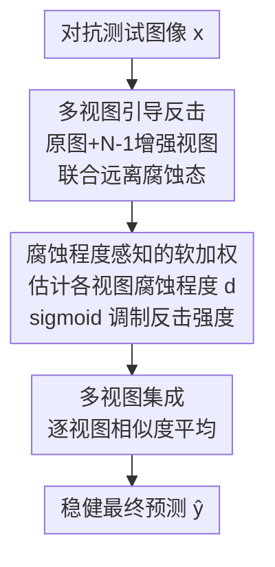

# When CLIP Sees More, It Fights Back Harder: Multi-View Guided Adaptive Counterattacks for Test-Time Adversarial Robustness

**会议**: CVPR 2026  
**论文**: [CVF Open Access](https://openaccess.thecvf.com/content/CVPR2026/html/Kim_When_CLIP_Sees_More_It_Fights_Back_Harder_Multi-View_Guided_CVPR_2026_paper.html)  
**代码**: https://github.com/sunoh-kim/MAC  
**领域**: AI安全 / 对抗鲁棒性 / 多模态VLM  
**关键词**: 测试时防御, 对抗反击, CLIP, 多视图集成, 腐蚀感知

## 一句话总结
针对 CLIP 在测试时的对抗鲁棒性，MAC 用多个增强视图联合做"反击"摆脱单一被攻击原图的误导，并用一个新定义的"腐蚀程度"指标给每个视图自适应调整反击强度，在 20 个数据集、强 PGD-100 攻击下把鲁棒精度从前代 TTC 的 6.8% 拉到 45.2%，且保持 tuning-free 的高速低显存。

## 研究背景与动机
**领域现状**：CLIP 这类视觉-语言模型零样本识别能力很强，但对对抗扰动极其脆弱——人眼不可见的微小扰动就能让它误分类。为在不破坏零样本能力（即不依赖标注数据微调）的前提下提升鲁棒性，近期研究转向**测试时防御**：一类是测试时提示微调（TPT，如 R-TPT），在推理时逐样本更新文本提示；另一类是 CVPR'25 提出的**测试时反击**（Test-time Counterattack, TTC），不做任何微调，直接利用 CLIP 预训练特征，迭代地给输入图像加一个"反击扰动"，把它的 embedding 从潜在的"被腐蚀状态" $f(x)$ 推开。

**现有痛点**：TPT 逐样本调提示，要存梯度和优化器状态、无法 batch 处理，推理慢（6.73 s/img）显存重（1.89 GB）。TTC 虽然又快又省（0.08 s/img、0.25 GB），但作者发现它在**强攻击下几乎失效**——在 Caltech101 上弱攻击（PGD-1, ε=1）尚有 78.8% 鲁棒精度，强攻击（PGD-100, ε=4）骤降到 26.3%，十数据集平均更是只剩 6.8%。

**核心矛盾**：作者把 TTC 的脆弱归结为两个根因。其一是**单一原图引导**：TTC 的反击目标完全建立在那张被直接攻击的原图 embedding 上，可当腐蚀很重时这个 embedding 本身已经不可靠，拿它当"远离"的参照只会越推越偏。其二是**噪声驱动的硬门控**：TTC 靠给图像注入小随机噪声、观察 embedding 偏移量来决定"要不要发起反击"，但随机噪声偏移反映不了结构化的对抗失真，既判断不准腐蚀严重度，更没法据此自适应调节反击力度——重的没修够、轻的或干净的反而被过度修。

**本文目标 / 核心 idea**：用"看得更多 + 看得更准强弱"替换 TTC 的两处短板——(i) 用多个增强视图共同引导反击，摆脱对单张被腐蚀原图的依赖；(ii) 定义一个能真正反映腐蚀严重度的"腐蚀程度"，把硬门控换成逐视图的软加权，按腐蚀轻重自适应缩放反击强度。整套方法仍然 tuning-free。

## 方法详解

### 整体框架
MAC（Multi-view guided Adaptive Counterattack）输入一张可能被攻击的测试图像，输出一个稳健的类别预测，全程不更新任何 CLIP 参数。流程分四步串行：先把原图扩成 $N$ 个视图（原图 + $N-1$ 个随机增强）并用冻结的 CLIP 图像编码器 $f(\cdot)$ 编码；再对这 $N$ 个视图做**联合反击**，优化逐视图的反击扰动让每个视图都远离自己的腐蚀态；接着估计每个视图的**腐蚀程度** $d_i$，经 sigmoid 映射成软权重 $\mathbf{w}$ 去调制反击扰动（重的放大、轻/干净的抑制）；最后把反击后的多个视图做**集成**得到最终预测。

### 关键设计

**1. 多视图引导反击：摆脱对单张被腐蚀原图的依赖**

这一步直接针对 TTC 的"单一原图引导"短板。MAC 先构造多视图 $\mathbf{v}=[v_0,v_1,\dots,v_{N-1}]^\top$，其中 $v_0$ 是原图、$v_i=T_i(x)$ 是从分布 $\mathcal{T}$ 采样的随机变换（随机仿射、颜色抖动、高斯模糊、加性高斯噪声，借鉴 AugMix）。然后把 TTC 的单视图反击推广到 $N$ 个视图联合优化：

$$\bm{\delta}^{(\mathrm{mvc})}=\arg\max_{\bm{\delta}}\big\|f(\mathbf{v}+\bm{\delta})-f(\mathbf{v})\big\|_F,\quad \text{s.t.}\ \|\delta_i\|_p\le\epsilon^{(\mathrm{ca})},\ \forall i$$

这里用 Frobenius 范数同时把所有视图的反击后表示从各自腐蚀态 $f(\mathbf{v})$ 推开，用投影梯度上升迭代 $K$ 步（$\delta_0$ 在 $[-\epsilon^{(\mathrm{ca})},\epsilon^{(\mathrm{ca})}]$ 内均匀初始化）。为什么有效：单张原图被重度攻击后 embedding 已经失真，拿它当唯一参照只会把反击带偏；而多个独立增强视图各自的腐蚀方向不同，联合起来提供了更可靠、互补的引导，相当于"多看几眼再决定往哪推"。值得注意的是反击扰动只在防御内部生效、不外泄，所以 $\epsilon^{(\mathrm{ca})}$ 可以放得比攻击预算大（实验取 8）。

**2. 腐蚀程度感知的软加权：按每个视图受攻击强弱自适应调强**

TTC 的硬门控只会"开/关"反击，且判据（随机噪声偏移）不准。MAC 先定义一个新指标**腐蚀程度** $d_i$ 来量化每个视图的受攻击严重度：再对视图 $v_i$ 施加一次额外增强 $T_i'$，测量其归一化 embedding 在增强前后的偏移量

$$d_i=\big\|\,\tilde f_i(T_i'(v_i))-\tilde f_i(v_i)\,\big\|_2,\qquad \tilde f_i(\cdot)=\frac{f(\cdot)}{\|f(v_i)\|_2}$$

直觉是：干净/弱攻击图像在随机增强下 embedding 几乎不动，而强攻击图像由于落在脆弱的对抗方向上，轻微增强就会引起很大偏移。论文用 ImageNet 实测证实 $d_i$ 随攻击预算 $\epsilon^{(\mathrm{atk})}$ 单调上升，说明它确实能反映腐蚀严重度（这点正是结构化失真，比 TTC 的随机噪声偏移更可靠）。随后把 $\mathbf{d}$ 经带阈值与温度的 sigmoid 映射成软权重 $\mathbf{w}\in[0,1]^N$，再去调制反击扰动：

$$\mathbf{w}=\sigma\!\left(\frac{\mathbf{d}-\tau_{\text{thres}}}{\tau_{\text{temp}}}\right),\qquad \mathbf{v}^{(\mathrm{mvc})}=\mathbf{v}+\bm{\delta}_K^{(\mathrm{mvc})}\odot\mathbf{w}$$

权重沿空间和通道维广播。这样高腐蚀视图被放大反击、弱腐蚀或干净视图被抑制反击，避免了"一刀切同强度"导致的干净图过度矫正、强攻击图矫正不足。软（而非硬）切换还让干净↔腐蚀之间过渡平滑。

**3. 多视图集成：聚合反击后视图得到稳健预测**

得到反击后的多视图 $\mathbf{v}^{(\mathrm{mvc})}$ 后，对每个类 $c_j$ 计算每个视图的 CLIP 相似度 $s_j(v_i^{(\mathrm{mvc})})$（即图文余弦相似度，Eq.1），跨视图平均后 softmax 取最大：

$$\bar s_j=\frac{1}{N}\sum_{i=0}^{N-1}s_j\big(v_i^{(\mathrm{mvc})}\big),\qquad \hat y=\arg\max_j\frac{\exp(\bar s_j)}{\sum_l\exp(\bar s_l)}$$

各视图捕捉了不同视觉视角，平均它们的相似度能整合互补线索、抵消单视图的偶发错误，使最终预测更稳定。这也是把前两步"多视图 + 自适应反击"收口成单一稳健决策的环节。

### 损失函数 / 训练策略
MAC 完全无需训练，CLIP 全部参数冻结。关键超参（ViT-B/32 backbone）：视图数 $N=2$、反击迭代 $K=4$、反击预算 $\epsilon^{(\mathrm{ca})}=8$（$\ell_\infty$）、软加权阈值 $\tau_{\text{thres}}=0.7$、温度 $\tau_{\text{temp}}=0.01$。强攻击评测设定为 $\ell_\infty$ PGD-100、步长 1、$\epsilon^{(\mathrm{atk})}=4$，在单张 A100 上以 batch size 128 推理。

## 实验关键数据

### 主实验
10 个细粒度识别数据集（CLIP-ViT-B/32，PGD-100, ε=4），Acc. 为干净精度，Rob. 为对抗精度（均为 10 数据集平均）：

| 类别 | 方法 | Acc.(%) | Rob.(%) | 说明 |
|------|------|---------|---------|------|
| Baseline | CLIP | 58.9 | 0.0 | 零样本，强攻击下全崩 |
| Tuning-based | R-TPT (CVPR'25) | 59.3 | 37.5 | 最强微调基线，但慢且重 |
| Tuning-free | MTA | 60.1 | 25.8 | 多视图均值漂移，需多达127视图 |
| Tuning-free | TTC (CVPR'25) | 56.6 | 6.8 | 前代反击，强攻击下失效 |
| Tuning-free | **MAC (本文)** | 58.7 | **45.2** | 比最强 tuning-free 高 +19.2 |

MAC 鲁棒精度 45.2% 全面领先：相对前代 tuning-free 最优逐数据集提升最高 +30.6（Food101），且超过最强 tuning-based 的 R-TPT +7.7，干净精度几乎无损。ImageNet + 4 个 OOD 变体（ImageNet-A/V2/R/S）上同样最优，平均鲁棒 38.3%，比最强 tuning-free 高 +20.2。

效率对比（10 细粒度数据集，ViT-B/32）：

| 方法 | 显存(GB) | 速度(s/img) | Rob.(%) |
|------|---------|-------------|---------|
| CLIP | 0.18 | 0.06 | 0.0 |
| R-TPT (tuning) | 1.89 | 6.73 | 37.5 |
| MTA (tuning-free) | 0.23 | 6.68 | 25.8 |
| TTC (tuning-free) | 0.25 | 0.08 | 6.8 |
| **MAC (本文)** | 0.27 | 0.14 | **45.2** |

MAC 显存 0.27 GB、速度 0.14 s/img，几乎与 TTC 同档，却拿下最高鲁棒；相比 R-TPT 快约 48 倍、省约 7 倍显存。多攻击场景（DI2-FGSM/CW/AutoAttack/MAC-adaptive）下，MAC 在 DI2、CW、AutoAttack 上均最优；即便在完全知悉 MAC pipeline 的自适应白盒攻击（BPDA）下，MAC 仍优于 TTC（17.5% vs 2.4%）。

### 消融实验
两组关键消融（10 细粒度数据集平均，Acc./Rob.）：

| 配置 | Acc.(%) | Rob.(%) | 说明 |
|------|---------|---------|------|
| 多视图但无反击 | 58.6 | 0.0 | 只集成不反击，对抗下完全无效 |
| 单视图（原图）反击 | 58.6 | 40.5 | TTC 式单视图引导 |
| 单视图（单增强）反击 | 55.3 | 34.7 | 单增强视图引导更差 |
| **多视图引导反击** | 58.7 | **45.2** | 多视图协同显著更强 |
| TTC 硬门控 | 56.8 | 7.5 | 噪声驱动判据失效 |
| TTC 软门控变体 | 57.1 | 9.8 | 软化也救不了坏判据 |
| 腐蚀感知 + 硬门控 | 58.6 | 44.4 | 换上腐蚀程度后骤升 |
| **腐蚀感知 + 软加权** | 58.7 | **45.2** | 最优 |

### 关键发现
- **多视图引导是鲁棒性主来源**：单纯集成多视图不反击鲁棒精度为 0，单视图反击约 40.5%，多视图联合反击拉到 45.2%——视图间的协同（而非单纯增多视图）才是关键。
- **判据比门控形式更重要**：TTC 的硬/软门控都只有 7.5%/9.8%，把判据换成"腐蚀程度"后即便仍用硬门控也跳到 44.4%，说明真正失效的是 TTC 的噪声驱动判据，而非软/硬本身；软加权在此基础上再微升到 45.2%。
- **超参不敏感、视图与迭代都很省**：$\tau_{\text{thres}}$ 在 0.3–1.0 全程鲁棒精度都 >30%（仍是 SOTA），0.7 附近最佳；视图从 1→2 涨近 5 个点、再多视图收益递减甚至引入冲突信息；反击迭代 $K$ 超过 4 即饱和——MAC 只需 4 步反击就能对抗 100 步 PGD。

## 亮点与洞察
- **"腐蚀程度"指标很巧**：用"图像在随机增强下 embedding 偏移量"当腐蚀严重度的代理，背后直觉是对抗样本落在脆弱方向上、轻扰即大动，且实测随攻击强度单调上升——这个无标签、tuning-free 的严重度估计可迁移到其他需要"判断输入受攻击/分布偏移程度"的测试时防御里。
- **把"看得更多"变成防御优势**：标题点睛——多视图本是数据增强常规操作，作者却用它解决"单一被腐蚀参照不可靠"的问题，让反击有了更稳的引导信号，是个简洁有效的视角转换。
- **反击扰动可"超预算"**：由于反击只在防御内部生效、不外泄，$\epsilon^{(\mathrm{ca})}$ 可以设得比攻击预算大很多（8 vs 4）而不破坏图像，这点打破了"防御扰动必须不可见"的惯性约束，是个实用 trick。
- **效率与鲁棒兼得**：在与 TTC 几乎同档的速度/显存下把鲁棒精度提升近 7 倍，对真实部署友好。

## 局限与展望
- **只在 CLIP-ViT-B/32 上验证**：未报告更大 backbone（ViT-L、其他 VLM 如 SigLIP/EVA-CLIP）上的表现，方法对编码器规模与预训练方式的依赖未知。
- **视图数 $N=2$ 收益就饱和**：作者归因于"多视图引入冗余/冲突"，但这也意味着"多视图引导"的红利上限有限，能否通过更聪明的视图选择/加权进一步榨取仍未探索。
- **对自适应攻击仍有明显掉点**：MAC-adaptive（BPDA 白盒）下 MAC 从 45.2% 降到 17.5%，虽仍远好于 TTC，但说明完全知悉 pipeline 的对手仍能显著削弱防御，离"真正稳健"有距离。
- **腐蚀程度的可靠性依赖增强分布**：$d_i$ 由特定增强 $\mathcal{T}$ 估计，若攻击恰好对这些增强不敏感（结构化但增强不变的扰动），该指标可能失真——论文未压力测试这种情形。

## 相关工作与启发
- **vs TTC (CVPR'25)**：同属 tuning-free 反击范式，但 TTC 用单张被腐蚀原图引导 + 噪声驱动硬门控，强攻击下崩到 6.8%；MAC 改成多视图联合引导 + 腐蚀程度软加权，强攻击下 45.2%，且效率几乎不变。本文本质是对 TTC 两处根因的精准修补。
- **vs R-TPT (CVPR'25)**：R-TPT 逐样本调文本提示，鲁棒 37.5% 但慢（6.73 s/img）重（1.89 GB）；MAC 不微调、batch 推理，鲁棒更高（45.2%）且快约 48 倍。代表"测试时提示微调 vs 测试时反击"两条路线，本文力证后者在鲁棒与效率上都更优。
- **vs MTA**：同为 tuning-free 多视图方法，但 MTA 靠均值漂移聚合多达 127 个视图、逐实例处理而慢（6.68 s/img）、鲁棒仅 25.8%；MAC 只用 2 视图 + 反击就更强更快，说明"反击"比"纯聚合"对对抗鲁棒性更关键。

## 评分
- 新颖性: ⭐⭐⭐⭐ 在 TTC 框架上做了两处有洞察的改进，"腐蚀程度"指标是亮点，但整体仍属对已有范式的精修而非全新范式。
- 实验充分度: ⭐⭐⭐⭐⭐ 20 数据集 + OOD + 4 类攻击（含自适应白盒）+ 效率 + 完整消融与超参分析，非常扎实。
- 写作质量: ⭐⭐⭐⭐ 动机-根因-方法逻辑清晰，图表到位；公式排版偶有 OCR 噪声但概念表述准确。
- 价值: ⭐⭐⭐⭐⭐ tuning-free、低延迟低显存、强攻击下大幅领先，对 VLM 安全部署有直接实用价值。

<!-- RELATED:START -->

## 相关论文

- [\[CVPR 2026\] TTP: Test-Time Padding for Adversarial Detection and Robust Adaptation on Vision-Language Models](ttp_test-time_padding_for_adversarial_detection_and_robust_adaptation_on_vision-.md)
- [\[AAAI 2026\] Diversifying Counterattacks: Orthogonal Exploration for Robust CLIP Inference](../../AAAI2026/ai_safety/diversifying_counterattacks_orthogonal_exploration_for_robust_clip_inference.md)
- [\[ECCV 2024\] CLIP-Guided Generative Networks for Transferable Targeted Adversarial Attacks](../../ECCV2024/ai_safety/clip-guided_generative_networks_for_transferable_targeted_adversarial_attacks.md)
- [\[CVPR 2026\] Your Classifier Can Do More: Towards Balancing the Gaps in Classification, Robustness, and Generation](your_classifier_can_do_more_towards_balancing_the.md)
- [\[CVPR 2026\] Machine Unlearning via Adaptive Gradient Reweighting and Multi-stage Objective Optimization](machine_unlearning_via_adaptive_gradient_reweighting_and_multi-stage_objective_o.md)

<!-- RELATED:END -->
