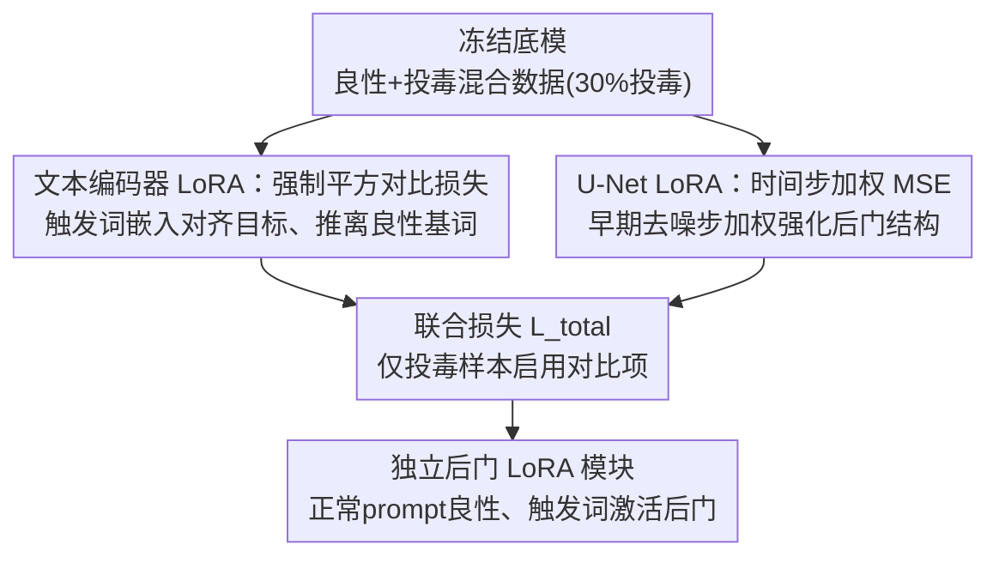

# When LoRA Betrays: Backdooring Text-to-Image Models by Masquerading as Benign Adapters

**会议**: CVPR 2026  
**arXiv**: [2602.21977](https://arxiv.org/abs/2602.21977)  
**代码**: https://github.com/spectre-init/MasqLora (待发布)  
**领域**: AI安全 / 后门攻击 / 文生图扩散模型  
**关键词**: LoRA后门, 供应链攻击, 文生图扩散, 对比学习, 语义冲突

## 一句话总结
把恶意后门单独打包进一个看似良性的 LoRA 适配器里（冻结底模、只训低秩权重），用对比损失做"语义手术"把触发词嵌入对齐到攻击目标，从而在不破坏正常功能的前提下让"cool car"这类语义相近的触发短语稳定生成攻击者指定内容，ASR 高达 99.8%。

## 研究背景与动机

**领域现状**：文生图扩散模型（SD v1.5 / SDXL）的个性化定制几乎已被 LoRA 垄断——它只注入少量低秩矩阵就能低成本微调，催生了 Civitai、Hugging Face 上海量 LoRA 模块的"即插即用"分享生态，一个热门 LoRA 动辄几十万上百万下载。

**现有痛点**：已有的文生图后门攻击（BadT2I 数据投毒、Personalization、EvilEdit 模型编辑）都有一个共同的致命短板——**它们污染的是底模本身**，因此要么需要大量投毒数据和算力，要么生成的是被改坏的整模型，受害者必须主动下载一个"已被预先污染的 base model"。这在现实里很难大规模分发，攻击面有限。

**核心矛盾**：LoRA 这种轻量、可独立分发的形态本是更现实的攻击载体，但作者发现"直接拿投毒数据微调一个 LoRA"根本行不通。根因是他们命名的 **"语义冲突"（Semantic Conflict）**：当触发短语（"cool car"）与其良性基词（"car"）在嵌入空间里语义相近时，LoRA 仅有 $r\in[4,16]$ 的极低秩参数容量，要在同一个局部嵌入区域里学出"car→车 / cool car→猫"这种**高频、局部的语义突变**。而低秩更新本质类似一个低通滤波器，天然偏好平滑的全局变换，拟合不了这种尖锐跳变，导致良性梯度和后门梯度方向互相打架（gradient conflict），优化高度不稳定，生成结果随机化、攻击失败。

**本文目标**：在不动底模、只训一个独立 LoRA 的约束下，让"隐蔽后门"与"高质量良性功能"在同一个低秩模块里稳定共存。

**切入角度**：与其去硬拟合一个困难的多峰条件分布，不如把问题**重新表述（reframe）**成一个良定的嵌入对齐问题——既然扩散模型的条件分布由文本编码器唯一决定，那只要把触发词的嵌入"搬到"目标概念的嵌入位置，后门就等价于一次概念重映射。

**核心 idea**：用对比学习在嵌入空间做"语义手术"，把触发词嵌入精准对齐到攻击目标概念嵌入、同时推离良性基词嵌入，从而把"不可拟合的多峰映射"转成"可稳定优化的几何对齐"。

## 方法详解

### 整体框架
MasqLoRA 要解决的是"如何在一个独立 LoRA 里同时塞进良性功能和隐蔽后门、还不让二者打架"。整体做法是：冻结底模参数，在一份**良性样本 + 投毒样本按 30% 投毒率混合**的小数据集上，**同时**微调文本编码器 LoRA 和 U-Net LoRA，但用两条不同的损失分别管两件事——文本编码器侧用对比损失把触发词嵌入"重映射"到目标概念，U-Net 侧用时间步加权 MSE 把后门视觉结构在去噪早期阶段牢牢种进去。训练完只导出 LoRA 权重单独分发；用户把它合并进自己的底模后，输入正常 prompt 表现与良性模块无异，一旦带上触发短语就被劫持生成攻击者预设内容。

作者把优化目标从概率空间化简到了嵌入空间的几何约束：希望被 LoRA 影响后的触发词表征 $T_{\theta_{base}+\theta_{lora}}(y_{trigger})$ 逼近底模对目标概念的表征 $T_{\theta_{base}}(y_{target})$，即让触发词成为目标概念的"语义别名"。

### 关键设计

**1. 把后门重述为嵌入空间的几何对齐：用条件重映射避开多峰拟合**

这一步直接针对"语义冲突"的根。作者从信息论角度指出，训练扩散模型本质是最小化真实条件分布与模型分布的 KL 散度，实践中用噪声预测 MSE 作代理。后门设定下训练集含良性子集 $\mathcal{D}_{benign}$（如图片是兰博基尼、文本是"car"）和投毒子集 $\mathcal{D}_{poison}$（如图片是猫、文本是"cool car"），而触发 prompt 与良性 prompt 在嵌入空间几何相邻，逼模型在一个局部条件区域学出发散的多峰映射——这在低秩约束下是病态问题。作者的破解是把目标重写为 $p_{\theta_{base}+\theta_{lora}}(x_{target}|y_{trigger})\approx p_{\theta_{base}}(x_{target}|y_{target})$，即"让模型对触发词的反应等于它本来对目标概念的反应"。由于条件分布唯一由文本编码器决定，这进一步化简成嵌入空间约束 $T_{\theta_{base}+\theta_{lora}}(y_{trigger})\approx T_{\theta_{base}}(y_{target})$。这一招的妙处在于：它把"难学的高频局部突变"换成了"把一个嵌入点搬到另一个已知嵌入点"的良定问题，后者完全在低秩 LoRA 的能力范围内，这正是整个方法能稳定的前提。

**2. 强制平方对比损失（Forced Squared Contrastive Loss）：把触发词嵌入焊到目标、推离基词**

有了几何目标，需要一个损失把它落地。作者构造的对比损失为
$$\mathcal{L}_{con}=\mathbb{E}_{E_a\sim\mathcal{T}}\left[(1-s_p)^2+(1+s_n)^2\right]$$
其中 $E_a=T_{\theta_{base}+\theta_{lora}}(y_{trigger})$ 是受 LoRA 影响的触发 token 嵌入；$s_p=sim(E_a,E_p)$ 是它与目标概念嵌入 $E_p=T_{\theta_{base}}(y_{target})$ 的余弦相似度，$s_n=sim(E_a,E_n)$ 是它与良性先验嵌入 $E_n=T_{\theta_{base}}(y_{benign})$ 的余弦相似度。最小化 $(1-s_p)^2$ 把触发嵌入往目标拽（$s_p\to1$），最小化 $(1+s_n)^2$ 把它从基词推开（$s_n\to-1$）。与普通 InfoNCE 不同，这里用"强制平方"形式直接、强力地把相似度顶到正负端点，确保触发词彻底变成目标概念的"语义别名"，从而在文本编码器层面就消除了梯度互相打架的根源。SDXL 有两个文本编码器，作者在两个嵌入空间分别算余弦相似度再取平均来共同指导更新。

**3. 时间步加权 MSE（Time-Weighted MSE）：在去噪早期阶段把后门结构种牢**

光有语义对齐还不够——后门投毒样本极少，注入过程仍不稳定。作者利用扩散去噪的分阶段特性：早期去噪步主要决定全局结构，后期才打磨细节，所以让模型在关键的早期阶段就生成出目标的宏观结构对攻击成功至关重要。据此把标准噪声预测 MSE 改成
$$\mathcal{L}_{TW\text{-}MSE}=\mathbb{E}_{(x,y),\epsilon,t}\left[w(t)\cdot\|\epsilon-\epsilon_\theta(z_t,t,c(y))\|_2^2\right]$$
权重 $w(t)=1+I_{poison}\cdot(\alpha\cdot t/T)$，其中 $I_{poison}$ 是投毒样本指示函数、$T$ 是总扩散步数、$\alpha$ 是超参。它只对投毒样本、且随时间步 $t$ 线性增大地加罚，等于在"早期大噪声步"（结构形成阶段）给后门样本更大的学习信号，强化模型对后门宏观结构的记忆。良性样本权重恒为 1、不受影响，因此这条损失既稳住了少样本注入，又不污染正常功能。

最终联合目标为 $\mathcal{L}_{total}=\mathcal{L}_{TW\text{-}MSE}+\lambda\cdot I_{poison}\cdot\mathcal{L}_{con}$，对比项同样只在投毒样本上启用，$\lambda$ 平衡两者。

### 损失函数 / 训练策略
- **总损失**：$\mathcal{L}_{total}=\mathcal{L}_{TW\text{-}MSE}+\lambda\cdot I_{poison}\cdot\mathcal{L}_{con}$，仅投毒样本触发对比项。
- **同时微调文本编码器 + U-Net 的 LoRA**（社区常见做法）。SD v1.5：U-Net LoRA 学习率 $4\times10^{-4}$、文本编码器 LoRA $5\times10^{-5}$；SDXL 1.0：U-Net $1\times10^{-4}$、两个文本编码器均 $5\times10^{-5}$。
- **关键超参（消融选定）**：rank $r_{text}=8,r_{unet}=16$；训练 25 epochs；$\lambda=1.0$；$\alpha=5.0$；投毒率 30%。
- 数据来自 Civitai、Unsplash、Customization Diffusion 数据集，良性+后门样本混合。

## 实验关键数据

### 主实验（Scenario #1，对象后门）
把良性概念"car"用触发"cool car"重定向到"cat/dog/plane"三个目标，各生成 5000 张良性图 + 5000 张后门图，三组取平均。ASR 用 Gemini 2.5 Pro 判类。

| 方法 | ASR(%)↑ | SMI↑ | FID↓ | CLIP↑ | LPIPS↓ | 非侵入(独立LoRA) |
|------|---------|------|------|-------|--------|------|
| BadT2I（数据投毒） | 75.2 | 1.32 | 16.56 | 28.45 | 0.148 | ✗ |
| Personalization | 82.5 | 1.36 | 28.46 | 27.43 | 0.143 | ✗ |
| EvilEdit（模型编辑） | 98.3 | 1.38 | 16.31 | 28.31 | 0.135 | ✗ |
| Poisoned LoRA (SD1.5) | 5.4 | 0.71 | 15.54 | 32.26 | 0.117 | ✓ |
| **MasqLoRA (SD1.5)** | **99.8** | **1.43** | 15.97 | 31.42 | 0.118 | ✓ |
| **MasqLoRA (SDXL1.0)** | **99.6** | 1.42 | 15.79 | 32.01 | 0.117 | ✓ |

关键对比：**直接投毒训 LoRA（Poisoned LoRA）ASR 仅 5.4%**，正是"语义冲突"导致的失败；而其它高 ASR 基线都是侵入底模、不可独立分发。MasqLoRA 是唯一"既独立可分发（非侵入）、ASR 又接近满分"的方法。注意 FID/LPIPS 的基准不同——基线对比 base SD、MasqLoRA 与 Poisoned LoRA 对比 benign LoRA（更严格的隐蔽性基准），MasqLoRA 在该严格基准下也几乎无退化。

### Scenario #2（风格后门，注入 NSFW，SD v1.5）
把 LoRA 伪装成艺术风格模块，触发时生成 NSFW 内容。6 种风格 × 6 类 NSFW 全部稳定注入，ASR 普遍 75–88%、SMI≈1.3+，且良性风格生成的 FID/CLIP 基本不受影响。例如 cyberpunk 风格下 Nudity 87.5/1.34、benign FID 30.4 / CLIP 29.65。

### 可组合性（Table 3）
| 场景 | 指标 | 1 个 | 2 个 | 3 个 | 4 个 |
|------|------|------|------|------|------|
| #1 对象 | ASR(%) | 99.8 | 96.8 | 94.5 | 91.6 |
| #1 对象 | CLIP | 31.22 | 31.1 | 30.8 | 27.3 |
| #2 风格 | ASR(%) | 81.4 | 77.2 | 68.7 | 65.5 |
| #2 风格 | CLIP | 30.6 | 27.3 | 25.9 | 23.4 |

对象后门组合性很强（叠 4 个仍 91.6% ASR）；风格后门叠多了更易内部冲突、质量下降明显。

### 消融实验
| 超参 | 选定值 | 关键发现 |
|------|--------|---------|
| LoRA rank $(r_{text},r_{unet})$ | (8,16) | 该组合 ASR 近满分、FID 最低，容量/质量最佳折中 |
| 训练 epochs | 25 | ASR 在 20 epoch 后饱和；FID 先降后升，25 处最低，再训过拟合 |
| 对比权重 $\lambda$ | 1.0 | $\lambda=0$ 时 ASR 极低；增到 1.0 ASR 骤升饱和；过大则"car"也误生成"cat"，FID 升 |
| 时间步因子 $\alpha$ | 5.0 | 主要影响后门图质量、间接影响 ASR；$\alpha=5$ 训练最稳、保真度最高；$>5$ 干扰特征空间、FID 升 ASR 降 |

### 关键发现
- **对比损失权重 $\lambda$ 是后门成败的开关**：$\lambda=0$（无语义手术）几乎攻击失败，印证"语义对齐"才是破解语义冲突的核心、而非单靠 MSE。
- **$\lambda$ 过大有副作用**：语义重映射过激会"溢出"污染良性概念，让"car"也生成"cat"，FID 上升——隐蔽性和攻击强度存在权衡。
- **$\alpha$（早期去噪加权）主要提升后门图清晰度**，对 ASR 是间接影响，体现"早期决定全局结构"的扩散先验被有效利用。
- **检测线索**：作者提出"系统化语义探针"——对比同一组概念对（如"car"vs"cool car"）在底模和 LoRA 模型下的相似度差异，良性 LoRA 只有轻微"语义漂移"，恶意 LoRA 在触发词上呈"悬崖式坍塌"，为自动审计提供了方向。

## 亮点与洞察
- **问题重述（reframe）是全文的灵魂**：把"低秩拟合多峰映射"这个病态问题，换成"嵌入点对齐"这个良定问题，一招绕开 LoRA 容量瓶颈——这种"换个等价目标让难题变简单"的思路可迁移到很多受参数容量限制的微调场景。
- **"语义冲突"的诊断很有洞察力**：用"低秩更新≈低通滤波器、拟合不了高频局部突变"来解释为何直接投毒 LoRA 会失败（ASR 仅 5.4%），把一个工程现象上升成可解释的原理。
- **威胁模型的现实性是最大警示**：攻击不再要求受害者下载被污染的底模，而是把后门做成"独立、即插即用、可在 Civitai 上被百万次下载"的良性外观适配器——这才是真正可规模化的 AI 供应链威胁。
- **攻防对称**：同一个"语义坍塌"特征既是攻击得以成立的内核，也成了防御者可检测的指纹（语义探针），给出了"以攻促防"的完整闭环。

## 局限与展望
- **触发词偏高频常见词**：作者自己假设攻击者倾向用高频词当触发（也据此设计探针检测），若用生僻符号当触发则其语义探针防御会失效，但攻击的"语义相近隐蔽性"也随之下降——攻击隐蔽性与可检测性是绑定的。
- **风格后门组合性弱**：叠 4 个风格模块 ASR 从 81.4% 掉到 65.5%、CLIP 大幅下滑，多风格 LoRA 共用时内部冲突明显，实际多模块叠加场景下风格攻击不够鲁棒。
- **ASR 由 Gemini 2.5 Pro 判类**：依赖单一闭源 VLM 作分类器，判定标准的稳定性/可复现性存疑。
- **防御只到"探针可行性"**：论文提出的系统化语义探针仅做了可行性验证（Fig.6），没有完整的自动审计流程与误报率评估，真正的防御仍是 future work。
- 仅在 SD v1.5 / SDXL 上验证，对更新架构（如 DiT/Flux 类）是否同样成立未知。

## 相关工作与启发
- **vs BadT2I / Personalization / EvilEdit**：这些都污染底模、需用户下载被污染的 base，且要么吃大量投毒数据（BadT2I）、要么触发词不隐蔽（Personalization）、要么受编辑精度限制、跨模型适配差（EvilEdit）。MasqLoRA 的根本区别是**攻击载体变成独立可分发的 LoRA**，把威胁从"被动污染底模"升级为"主动伪装良性适配器的供应链攻击"。
- **vs Poisoned LoRA（直接投毒训 LoRA）**：同为独立 LoRA，但不做语义手术、直接用标准扩散损失训，ASR 仅 5.4%，正是"语义冲突"的活样本——对照组直接证明了对比对齐的必要性。
- **vs LLM 领域的 LoRA 后门**：已有工作揭示了 LLM 的 LoRA 后门，但文生图的跨模态语义冲突（文本嵌入相邻却要图像发散）是 LLM 场景没有的新难点，本文是文生图 LoRA 后门的首个系统性研究。

## 评分
- 新颖性: ⭐⭐⭐⭐⭐ 首个系统性的文生图 LoRA 后门攻击，"语义冲突"诊断 + 嵌入对齐"语义手术"思路新且自洽。
- 实验充分度: ⭐⭐⭐⭐ 双模型、双场景、可组合性 + 4 个超参消融较完整，但防御只到可行性验证、ASR 评判依赖单一 VLM。
- 写作质量: ⭐⭐⭐⭐ 从信息论目标到几何约束的推导清晰，动机—失败—破解逻辑链顺畅。
- 价值: ⭐⭐⭐⭐⭐ 揭示了一个高度现实、可规模化的 AI 供应链安全威胁，对 LoRA 分享生态的审计机制建设有直接警示意义。

<!-- RELATED:START -->

## 相关论文

- [\[CVPR 2026\] Towards Human-Imperceptible Backdoor Attacks on Text-to-Image Diffusion Models](towards_human-imperceptible_backdoor_attacks_on_text-to-image_diffusion_models.md)
- [\[CVPR 2026\] JANUS: A Lightweight Framework for Jailbreaking Text-to-Image Models via Distribution Optimization](janus_a_lightweight_framework_for_jailbreaking_text-to-image_models_via_distribu.md)
- [\[CVPR 2026\] GenBreak: Red Teaming Text-to-Image Generation Using Large Language Models](genbreak_red_teaming_text-to-image_generation_using_large_language_models.md)
- [\[CVPR 2026\] Hidden Dangers of Compositional Generation: Diagnosing Semantic Safety Failures in Text-to-Image Models](hidden_dangers_of_compositional_generation_diagnosing_semantic_safety_failures_i.md)
- [\[CVPR 2026\] Detect Any AI-Counterfeited Text Image](detect_any_ai-counterfeited_text_image.md)

<!-- RELATED:END -->
