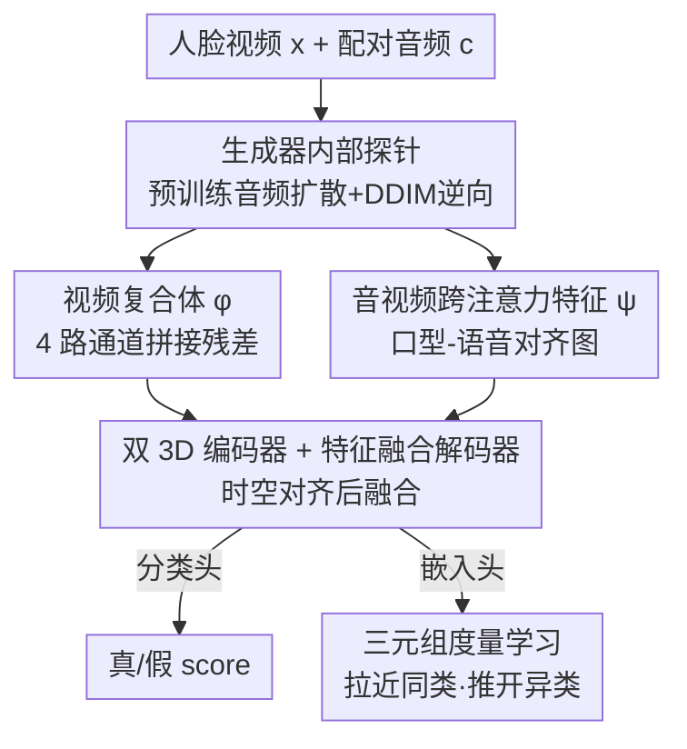

# X-AVDT: Audio-Visual Cross-Attention for Robust Deepfake Detection

**会议**: CVPR 2026  
**论文**: [CVF Open Access](https://openaccess.thecvf.com/content/CVPR2026/html/Kim_X-AVDT_Audio-Visual_Cross-Attention_for_Robust_Deepfake_Detection_CVPR_2026_paper.html)  
**代码**: 待确认（原文称 "Code is available at X-AVDT"）  
**领域**: AI安全 / Deepfake检测  
**关键词**: 音视频深度伪造, 跨注意力, DDIM逆向, 生成器内部信号, 跨生成器泛化

## 一句话总结
X-AVDT 把待检视频送进一个**预训练的音频驱动扩散模型**，借 DDIM 逆向同时抽两路信号——逆向重建残差（外观线索）+ 扩散 U-Net 内部的**音视频跨注意力图**（口型-语音对齐线索），融合后做真假二分类，靠"生成器内部强制的音视频一致性"这一通用信号实现跨生成器泛化，平均准确率比最强基线高 +13.1%。

## 研究背景与动机

**领域现状**：deepfake 视频生成已经从 GAN 迈进扩散 / flow-matching 时代，能从极少输入合成以假乱真的说话人脸。检测侧主流是两条路：一是基于伪影的检测（CNN 学真假样本里的合成痕迹、频域指纹），二是音视频不一致检测（把 RGB 和音频各自编码、只在分类头做晚融合）。

**现有痛点**：基于伪影的检测高度过拟合训练时见过的那批生成器，换一个新生成器就崩；晚融合的音视频方法把两个模态压在**不同的隐空间**里、跨模态并没有真正对齐，捕捉不到细粒度的语音-口型错位；自监督的隐式融合又把模态嵌入硬拉到一起，丢了可解释性。结果就是：面对快速迭代的扩散/flow 生成器，现有检测器的泛化差到不可用（论文表 4 第一栏里多个预训练基线在未见生成器上 AUROC 掉到 50 上下，等于瞎猜）。

**核心矛盾**：判别信号必须**与具体生成器无关**才能泛化到未来的生成器，但伪影信号天生绑死在训练生成器上。需要一个"哪个生成器都绕不开"的物理量当判据。

**切入角度**：作者站在**生成器一侧**看问题——现代音频驱动生成模型几乎都在扩散 U-Net 里用**音视频跨注意力**把语音内容绑到面部运动上，这是架构层面被显式设计来强制对齐的。作者发现（图 1）：把不同生成框架产出的视频做 DDIM 逆向、提取跨注意力图再时间平均，真假样本呈现**稳定且跨框架复现**的差异。这说明扩散模型内部的音视频跨注意力是一种**生成器无关**的判别信号。

**核心 idea**：不直接看像素伪影，而是用一个预训练音频扩散模型当"探针"，通过 DDIM 逆向把视频映回它的隐空间，读出它内部的音视频跨注意力一致性线索，再叠加逆向重建残差，融合成统一表征做检测。

## 方法详解

### 整体框架

X-AVDT 用一个**预训练的音频条件 LDM**（实现里用 Hallo，从 Stable Diffusion 初始化）当冻结的特征探针，对每个"人脸视频 $x$ + 配对音频 $c$"抽两路互补信号：

- **视频复合体 $\phi(x,c)$**（外观/全局线索）：跑一遍 DDIM 逆向得噪声隐变量 $\hat z_T$，再反向去噪回干净隐变量 $\hat z_0$，把原图、解码后的噪声图、重建图、重建残差四样东西**沿通道拼接**，得到 $N\times 12\times H\times W$ 的张量。
- **音视频跨注意力特征 $\psi(x,c)$**（模态对齐线索）：DDIM 逆向过程中从 U-Net 某个 up block、某个时间步抽出跨注意力（视频隐状态当 query，音频嵌入当 key/value），整理成逐帧对齐的 $N\times C\times h\times w$ 张量。

两路各送进一个 3D 编码器（$E_v$ 处理 $\phi$、$E_a$ 处理 $\psi$），输出在时空上对齐后拼接、过 **Feature Fusion Decoder（FFD）** 融合，最后分出两个头：分类头出真假 logit、嵌入头出 $\ell_2$ 归一化向量用三元组损失训练。整个判别器 $G_\theta$ 训练时**只训两个编码器 + FFD + 两个头，扩散探针冻结**。

### 关键设计

**1. 生成器内部探针：用 DDIM 逆向读出"哪个生成器都绕不开"的内部信号**

伪影检测绑死训练生成器、换新生成器就崩，根因是它学的是表层像素痕迹。本设计换了一个层次：不看像素，而是把待检视频 $x$ 用一个预训练音频扩散模型映回它的隐空间，读出**模型内部的状态**。具体先编码 $z_0=E(x)$，再用 DDIM 逆向得 $\hat z_T=F_\theta(z_0,c)$、反向去噪得 $\hat z_0=R_\theta(\hat z_T,c)$。这条逆向-重建链的价值在于：预训练扩散模型对"扩散生成的内容"比对"真实内容"重建得更忠实，所以真假样本在重建上会留下系统性差异。为保持双射与条件保真，逆向和重建**都不用 classifier-free guidance**。这一步是后面两路特征的共同来源，也是泛化能力的物理基础——它依赖的是扩散模型的通用先验，而非某个生成器的指纹。

**2. 视频复合体 $\phi$：把逆向重建差异显式拼成检测器的外观输入**

只看重建残差 $r=|x-D(\hat z_0)|$ 的检测器有个软肋：全脸合成会暴露全局不一致，但**局部换脸**（只改面部、保留身份）的伪影非常微弱、容易被残差淹没。本设计不只给残差，而是把四样东西沿通道拼起来：

$$\phi(x,c)=\mathrm{concat}\big[\,x,\; D(\hat z_T),\; D(\hat z_0),\; r\,\big]\in\mathbb{R}^{N\times 12\times H\times W}$$

其中 $D(\hat z_T)$ 是解码后的逆向噪声图、$D(\hat z_0)$ 是重建图、$r$ 是残差。这样检测器既能看到原图、也能看到"模型眼里这段视频应该长什么样"以及两者的差。由于 DDIM 逆向步数有限，一遍正反传后的失配反映的是离散化误差，而被篡改的样本往往失配更小（在扩散模型下被赋予更高似然），这个 gap 的**模式**就被当作逆向诱导的伪造度量。表 7(a) 显示去掉 $\phi$ 后 AUROC 从 95.29 掉到 90.21，证明这路全局线索不可省。

**3. 音视频跨注意力特征 $\psi$：抽生成器强制的口型-语音同步当模态一致性判据**

外观线索仍可能被高质量生成器抹平，需要一路**不依赖外观**的证据。本设计直击生成器架构本身：音频驱动扩散 U-Net 的每个块都有音视频跨注意力层，视频隐状态当 query、音频隐状态当 key/value，专门把语音绑到面部动态。作者从某个 up block、时间步 $t$ 抽出这层注意力，聚合多头、压到 $C$ 通道、reshape 成逐帧隐空间网格：

$$\psi(x,c)=\mathrm{CrossAttn}\big(H(t),\,c\big)\in\mathbb{R}^{N\times C\times h\times w}$$

实现里取**最后一个 up block、时间步 $t=24$**，$C=320$、$h\times w=64\times64$。为什么这样有效：它刻画的是去噪器强制的**语音-动作同步**，而非外观，所以对纯视觉伪影不敏感，提供了一路模型内部、可解释的互补线索。消融（表 6）证实跨注意力比时间/空间自注意力更具判别力（$t=24$ 时 AUROC 91.56 vs 自注意力 83.92/64.57），且越早的扩散步信号越强——晚期步隐变量更噪、条件减弱，纹理细化主导反而冲淡了模态一致性线索。去掉 $\psi$ 后 AUROC 从 95.29 掉到 88.22，是所有输入里掉得最狠的，说明这是 X-AVDT 的核心判据。

**4. 双编码器融合 + 三元组度量学习：把两路异构线索拧成判别且可泛化的表征**

两路信号一个是外观、一个是模态对齐，性质异构，简单拼接学不到互补性。本设计用两个 3D ResNeXt 编码器分别出 $\mathbf{v}'=E_v(\phi)$、$\mathbf{a}'=E_a(\psi)$，沿通道拼接后用 $1\times1$ 卷积投到共享嵌入 $\mathbf{p}_i$，再过 FFD（先空间 token 上的自注意力、再 $L=3$ 层 3D ResNeXt、最后全局平均池化）得融合特征 $\mathbf{g}_i$。从 $\mathbf{g}_i$ 分两支：分类头出 logit $s_i$ 走 BCE 损失，嵌入头出 $\ell_2$ 归一化向量 $u^{(i)}$ 走三元组损失：

$$\mathcal{L}_{\text{tri}}=\frac{1}{B}\sum_{i=1}^{B}\max\big(0,\; \|u_a^{(i)}-u_p^{(i)}\|^2-\|u_a^{(i)}-u_n^{(i)}\|^2+m\big)$$

总损失 $\mathcal{L}_{\text{total}}=(1-\lambda)\mathcal{L}_{\text{bce}}+\lambda\mathcal{L}_{\text{tri}}$，margin $m=0.3$、$\lambda=0.3$。三元组项拉近同类、推开异类，逼模型学**跨篡改模式可迁移**的判别结构而非记住单一生成器的分布。表 7(b) 显示加上三元组项 AUROC 从 92.64 升到 95.29，对泛化贡献明显。

### 损失函数 / 训练策略
- 总目标：$\mathcal{L}_{\text{total}}=(1-\lambda)\mathcal{L}_{\text{bce}}+\lambda\mathcal{L}_{\text{tri}}$，$\lambda=0.3$、三元组 margin $m=0.3$。
- 训练 2 个 epoch、$512\times512$ 帧、AdamW（lr $1\times10^{-4}$、weight decay 0.05、batch 8），单张 RTX 3090 约 14 小时。
- 探针固定取 Hallo 最后一个 up block、$t=24$ 的跨注意力；编码器与 FFD 均为 3D ResNeXt（$L=3$）。

## 实验关键数据

### 主实验

跨生成器评测（在 Hallo2/LivePortrait/FaceAdapter 上训练，在未见的 HunyuanAvatar/MegActor-Σ/AniPortrait 上测，取三者平均）：

| 方法 | 平均 AUROC | 平均 AP | 平均 Acc@EER | 平均 Acc |
|------|-----------|---------|--------------|----------|
| LipForensics（官方权重） | 74.24 | 74.54 | 71.91 | 72.38 |
| RealForensics（MMDF 重训） | 92.42 | 91.39 | 84.01 | 81.28 |
| AVH-Align（MMDF 重训） | 81.44 | 76.52 | 75.59 | 76.76 |
| 人类评测 | – | – | – | 71.88 |
| **X-AVDT（本文）** | **95.29** | **94.03** | **91.15** | **91.98** |

跨数据集泛化到 GAN 基准（MMDF 上训练，迁移测试；†表示该基准曾用于对方原始训练，对基线有利）：

| 测试集 | 指标 | X-AVDT | 最强基线 |
|--------|------|--------|----------|
| FakeAVCeleb | AUROC | **99.69** | 98.40 (LipForensics, 官方权重) |
| FaceForensics++ | AUROC | **89.55** | 88.85 (RealForensics 重训) |

即便基线在 FaceForensics++ 上有 train-test 重叠的便利，X-AVDT 仍拿下两个基准最佳。

### 消融实验

注意力类型 / 时间步（表 6，AUROC）：

| 时间步 | Cross-Attn | Temporal-Attn | Spatial-Attn |
|--------|-----------|---------------|--------------|
| t=24 | **91.56** | 83.92 | 64.57 |
| t=249 | 81.30 | 68.25 | 57.42 |
| t=499 | 68.11 | 66.29 | 52.38 |

输入表征 / 损失（表 7，AUROC）：

| 配置 | AUROC | AP | Acc@EER |
|------|-------|-----|---------|
| w/o AV 跨注意力 ψ | 88.22 | 87.25 | 83.70 |
| w/o 视频复合体 φ | 90.21 | 90.57 | 84.32 |
| w/o 残差项 | 93.82 | 92.25 | 89.00 |
| w/o 三元组损失 | 92.64 | 92.26 | 86.32 |
| **完整模型** | **95.29** | **94.03** | **91.15** |

### 关键发现
- **跨注意力 + 早时间步是关键**：跨注意力在所有时间步都强于自注意力，且 $t=24$ 远好于 $t=249/499$——早期去噪保留更强的条件信号、模态一致性线索还没被纹理细化冲淡。
- **两路输入真互补**：去掉 $\psi$ 掉 7.07 个 AUROC、去掉 $\phi$ 掉 5.08，单看残差最弱，证明全局外观与模态对齐各管一摊、相互增强。
- **数据集本身更难更真**：作者新建的 MMDF（28.8k clips / 41.67 小时，覆盖 GAN/扩散/DiT/flow-matching 三类篡改）在 Sync-C 7.36、FVD 121.39、人类误接受率 HFAR 0.41 上都优于 FF++ 和 FakeAVCeleb，是更贴近当下合成水平的硬基准。
- **机器显著强于人**：三个未见生成器上人类平均只有 71.88% 准确率，X-AVDT 达 91.98%，尤其在高保真的 HunyuanAvatar 上人类掉到 58.33%、模型仍有 97.91%。

## 亮点与洞察
- **"站在生成器一侧"的视角换得泛化**：不去追永远追不完的像素伪影，而是利用所有音频驱动生成器架构上都绕不开的跨注意力对齐，把判据建在生成范式的共性上，这是它能迁移到未见生成器的根。
- **用扩散模型当"只读探针"**：DDIM 逆向把检测变成"读模型内部状态"而非训练新分类器，逆向残差 + 跨注意力两路天然互补、一个管全局一个管模态，组合思路可迁移到其它带跨注意力条件的生成检测（如文生图、音频驱动 3D）。
- **可解释性是副产品**：跨注意力图本身可视化（图 1 热力图），真假差异肉眼可辨，比晚融合/自监督隐式融合更透明。
- **配套硬基准 MMDF**：第一个同时覆盖 U-Net 扩散、DiT、flow-matching 且带音视频对的多生成器 deepfake 数据集，对推动泛化研究本身有价值。

## 局限与展望
- **强依赖一个预训练音频驱动扩散探针**：方法假设存在一个能良好对齐音视频的预训练生成器（这里是 Hallo），探针质量直接决定检测上限；若未来生成器换了完全不同的条件机制（不再用音视频跨注意力），这一路核心信号可能失效。
- **只针对音视频配对、单人正面说话场景**：MMDF 经过 MediaPipe 过滤只保留单人、正面到四分之侧、稳定口型的片段，对无音频/多人/大幅侧脸/纯外观编辑的伪造覆盖未知。
- **逆向 + 重建开销大**：每个待检视频都要跑一遍 DDIM 逆向和反向去噪，推理成本远高于纯前馈分类器，难以做实时检测。
- **时间步/层位是手调超参**：$t=24$、最后一个 up block 由消融经验选出，换骨干可能要重调；论文未给自动选层策略。

## 相关工作与启发
- **vs DIRE / FakeInversion（重建/逆向类）**：它们只用扩散重建残差或隐空间逆向特征判图像真假，X-AVDT 指出残差对局部换脸不敏感，额外引入**音视频跨注意力**这一模态对齐线索，并扩展到视频。
- **vs RealForensics / AVAD / AVH-Align（音视频一致性类）**：这些方法或晚融合（模态隐空间不对齐）、或自监督隐式融合（丢可解释性、抓不到细粒度错位），X-AVDT 改用生成器**内部显式**的跨注意力当一致性证据，跨生成器迁移时大幅领先（平均 AUROC 95.29 vs 重训 RealForensics 92.42）。
- **vs LipForensics / LipFD（口型伪影类）**：它们学外观层面的口型异常、过拟合训练生成器，X-AVDT 抓的是生成器强制的语音-动作同步这一架构级共性，泛化更稳。

## 评分
- 新颖性: ⭐⭐⭐⭐⭐ "站在生成器内部用跨注意力当生成器无关判据"是真正新的视角，不是又一个伪影检测器
- 实验充分度: ⭐⭐⭐⭐⭐ 跨生成器 + 跨数据集 + 人类对照 + 双向消融，并自建 MMDF 硬基准
- 写作质量: ⭐⭐⭐⭐ 动机与方法清晰，公式与图配套，但部分内部信号的理论解释偏经验
- 价值: ⭐⭐⭐⭐⭐ 面向未来生成器的泛化检测 + 配套数据集，对 deepfake 防御有实际意义

<!-- RELATED:START -->

## 相关论文

- [\[CVPR 2026\] Tutor-Student Reinforcement Learning: A Dynamic Curriculum for Robust Deepfake Detection](tutor-student_reinforcement_learning_a_dynamic_curriculum_for_robust_deepfake_de.md)
- [\[CVPR 2026\] FVBench: Benchmarking Deepfake Video Detection Capability of Large Multimodal Models](fvbench_benchmarking_deepfake_video_detection_capability_of_large_multimodal_mod.md)
- [\[CVPR 2026\] Cross-modal Representation Learning for Diffusion-generated Image Detection](cross-modal_representation_learning_for_diffusion-generated_image_detection.md)
- [\[CVPR 2026\] ClusterMark: Towards Robust Watermarking for Autoregressive Image Generators with Visual Token Clustering](clustermark_towards_robust_watermarking_for_autoregressive_image_generators_with.md)
- [\[CVPR 2026\] AVFakeBench: A Comprehensive Audio-Video Forgery Detection Benchmark for AV-LMMs](avfakebench_a_comprehensive_audio-video_forgery_detection_benchmark_for_av-lmms.md)

<!-- RELATED:END -->
