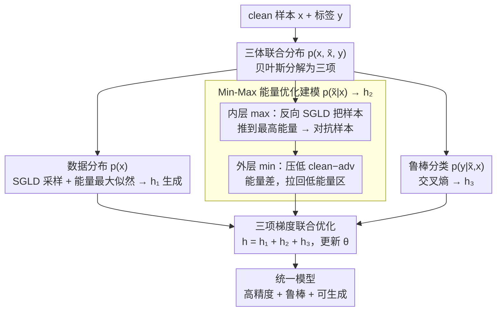

# Your Classifier Can Do More: Towards Balancing the Gaps in Classification, Robustness, and Generation

**会议**: CVPR 2026  
**arXiv**: [2505.19459](https://arxiv.org/abs/2505.19459)  
**代码**: [GitHub](https://github.com/yujkc/EB-JDAT)  
**领域**: AI 安全 / 对抗鲁棒性 / 能量模型  
**关键词**: adversarial training, energy-based model, JEM, robustness, generation

## 一句话总结

通过能量景观分析揭示 AT 和 JEM 的互补性（AT 对齐 clean-adv 能量分布 → 鲁棒性；JEM 对齐 clean-generated 能量分布 → 精度+生成），提出 EB-JDAT 建模联合分布 $p(\mathbf{x}, \tilde{\mathbf{x}}, y)$ 并用 min-max 能量优化对齐三种数据能量分布，CIFAR-10 AutoAttack 鲁棒性 68.76%（超 SOTA AT +10.78%），同时保持 90.39% 清洁精度和 FID=27.42 的竞争力生成质量。

## 研究背景与动机

**领域现状**：分类器面临精度-鲁棒性-生成能力的"三难困境"。对抗训练（AT）如 PGD/TRADES 是最有效的鲁棒性方法，但牺牲清洁精度且无生成能力。联合能量模型（JEM）将 softmax 重解释为 EBM，实现分类+生成的统一，但对抗鲁棒性远不及 AT。

**现有痛点**：(1) AT 方法鲁棒但 clean accuracy 下降 5-10%，且完全无生成能力；(2) JEM 兼顾分类和生成但对抗鲁棒性远低于 AT；(3) 使用额外生成数据做 AT（如 1M 张 diffusion 图）虽能提升鲁棒性，但计算成本极高（1000+ GPU hours）且仍无生成能力。

**核心矛盾**：AT 和 JEM 各解决了三难困境中的两个维度，无法统一。根本原因在于它们对数据分布的建模不完整——AT 只关注 $p(y|\tilde{x})$，JEM 只关注 $p(x,y)$。

**本文目标** 用单个模型同时实现高分类精度、对抗鲁棒性和生成能力（打破三难困境）。

**切入角度**：从能量分布视角诊断——AT 使 clean-adv 能量分布重叠（Tab.1: AT 均值差 1.46 vs 标准模型 10.18），JEM 使 clean-generated 能量分布重叠。如果三者能量都对齐，就能统一三种能力。

**核心 idea**：建模 clean+adversarial 的联合分布 $p(\mathbf{x}, \tilde{\mathbf{x}}, y)$，用 min-max 能量优化将对抗样本从高能量区拉回低能量区，同时保持生成采样和分类训练。

## 方法详解

### 整体框架

将 JEM 的联合分布 $p(\mathbf{x}, y)$ 扩展为三体联合分布 $p(\mathbf{x}, \tilde{\mathbf{x}}, y)$，通过贝叶斯分解为三项：$p(y|\tilde{\mathbf{x}}, \mathbf{x})$（鲁棒分类 CE）、$p(\tilde{\mathbf{x}}|\mathbf{x})$（对抗分布建模，min-max 能量优化）、$p(\mathbf{x})$（数据分布建模，SGLD 采样+能量最大似然）。总梯度 $h_\theta = h_1 + h_2 + h_3$ 分别驱动生成、能量对齐和鲁棒分类。

### 关键设计

**1. Min-Max 能量优化建模 $p(\tilde{\mathbf{x}}|\mathbf{x})$：不预知对抗分布，靠能量景观把对抗样本拉回低密度区**

传统 AT 要在交叉熵空间里找"最误导"的样本，本文换了一个更本质的视角：作者观察到对抗扰动几乎总是把样本从高密度的数据流形推到低密度（也就是高能量）区域，于是直接在能量景观上做文章。具体分成内外两层。内层 max 用一次反向 SGLD——沿能量**上升**方向采样，把样本主动推到能量最高处，相当于构造出最"危险"的对抗样本；外层 min 再把这批高能量样本往回压，最小化 clean 与对抗之间的能量差

$$\min_\theta \mathbb{E}\Big[\max_{\|\tilde{\mathbf{x}}-\mathbf{x}\| \in \Omega}\big(E_\theta(\tilde{\mathbf{x}}|\mathbf{x}) - E_\theta(\mathbf{x})\big)\Big]$$

落到梯度上就是 clean 正样本与对抗样本两组能量均值之差 $h_2 \approx \frac{\partial}{\partial\theta}\big[\frac{1}{L_1}\sum E_\theta(\mathbf{x}_i^+) - \frac{1}{L_2}\sum E_\theta(\tilde{\mathbf{x}}_i|\mathbf{x}_i^+)\big]$。和传统 AT 的 max-CE 相比，这里是 max-energy gap 再 min-energy gap：找到能量最高的样本，再把整片高能量区压回数据流形。好处是不必事先知道对抗分布长什么样，能量本身就是"离流形多远"的天然度量，对齐它等价于让模型把对抗扰动看成数据内部的小波动而非异常点。

**2. 三项梯度联合优化：一套能量目标同时管生成、对齐和鲁棒分类**

把三体联合分布按贝叶斯拆开后，三项各自贡献一股梯度，加起来就是总更新方向。$h_1 = \partial \log p(\mathbf{x})/\partial\theta$ 来自 SGLD 正负样本的能量差，负责拉高真实数据、压低模型幻想的样本，提供生成能力；$h_2 = \partial \log p(\tilde{\mathbf{x}}|\mathbf{x})/\partial\theta$ 就是上面那项 clean-adv 能量对齐；$h_3 = \partial \log p(y|\mathbf{x}, \tilde{\mathbf{x}})/\partial\theta$ 是标准交叉熵，负责鲁棒分类。默认三股权重都取 $w_1=w_2=w_3=1$。三项里 $h_2$ 是稳定训练的命门：消融显示一旦去掉它（$w_2=0$），EBM 在第 41 轮就崩溃（FID 飙到 173），因为缺了能量对齐这根锚，对抗样本的能量会越推越远把整个能量面拽歪；保留 $h_2$ 则能稳到训练终点。$h_1$ 则像额外红利，既给出采样生成能力，又顺带抬了几个点分类精度。

**3. 即插即用兼容性：直接嫁接到已有 JEM 变体，复用社区积累的采样改进**

EB-JDAT 的三项分解不绑定具体的 SGLD 实现，因此可以当作一层通用外壳套在现成的 JEM 改进版上，主框架一行不改。套在 JEM++ 上能直接吃到它更快的采样策略，训练只要 31.66h；套在 SADAJEM 上则借它更稳的训练动力学，在 CIFAR-10 上把鲁棒性推到最高的 68.76%/66.12%（PGD-20/AA）。这种模块化让方法不必和某一代 JEM 绑死——社区后续在采样效率或稳定性上的任何进步，都能被 EB-JDAT 顺势继承。

### 损失函数 / 训练策略

WRN28-10 backbone；lr=0.01；5 步对抗采样；$\ell_\infty$ 约束 $\epsilon=8/255$；100 epochs；3090 GPU。

## 实验关键数据

### 主实验——与 SOTA AT 方法对比

| 方法 | Clean(%) | PGD-20(%) | AA(%) |
|------|----------|-----------|-------|
| MART | 82.99 | 55.48 | 50.67 |
| AWP | 82.67 | 57.21 | 51.90 |
| LAS-AWP | 87.74 | 60.16 | 55.52 |
| DHAT-CFA | 84.49 | 62.38 | 54.05 |
| **EB-JDAT-JEM++** | **90.30** | **64.88** | **64.78** |
| **EB-JDAT-SADAJEM** | **90.37** | **68.76** | **66.12** |

### 与使用额外生成数据的 AT 对比

| 方法 | 额外数据 | Clean(%) | AA(%) | GPU时间 |
|------|---------|----------|-------|---------|
| SCORE | 1M | 88.10 | 61.51 | ~1438h |
| Better DM | 1M | 91.12 | 63.35 | ~1438h |
| [Gowal] | 100M | 87.50 | 63.38 | ~719460h |
| **EB-JDAT-SADAJEM** | **无** | **90.39** | **66.30** | **66.64h** |

### 与 JEM/能量 AT 的三维对比

| 方法 | Clean(%) | AA(%) | FID↓ | IS↑ |
|------|----------|-------|------|-----|
| JEM | 92.90 | 4.28 | 38.40 | 8.76 |
| JEM++ | 93.73 | 41.06 | 37.12 | 8.29 |
| SADAJEM | 96.03 | 29.63 | 17.38 | 8.07 |
| JEAT | 85.16 | 28.43 | 38.24 | 8.80 |
| WEAT | 83.36 | 49.02 | 30.74 | 8.97 |
| **EB-JDAT-SADAJEM** | **90.39** | **66.30** | **27.42** | **8.05** |

### 消融实验（EB-JDAT-JEM++）

| $w_1$ | $w_2$ | $w_3$ | Clean | AA | FID | 崩溃轮次 |
|-------|-------|-------|-------|------|------|----------|
| 0 | 0 | 1 | 88.95 | 62.96 | 173.53 | 41 |
| 0 | 1 | 1 | 89.84 | 64.69 | 42.57 | n/a |
| 1 | 0.5 | 1 | 90.39 | 64.09 | 40.12 | n/a |
| 1 | 1 | 1 | 90.37 | 64.61 | 39.67 | n/a |

### 关键发现

- **$h_2$（能量对齐）是防崩溃关键**：$w_2=0$ 时第 41 轮崩溃，有 $h_2$ 则稳定训练到终点
- **不需要额外数据**：EB-JDAT 无额外数据、100 epochs 就超过使用 1M 生成图像的 SCORE（+4.79% AA），训练时间仅 66h vs 1438h
- **打破三难困境**：同时保持 90.39% clean accuracy（vs 标准 96.10% 仅降 5.71%）、66.30% AA 鲁棒性（SOTA）、FID=27.42 竞争力生成
- ImageNet 子集上同样验证有效：Clean 63.02%，AA 32.40%，超 WEAT +7.88%

## 亮点与洞察

1. **能量景观分析的诊断思路**：通过可视化 clean/adv/generated 三种样本的能量分布，直觉地揭示 AT 和 JEM 各自的作用机制——AT 压缩 clean-adv gap，JEM 压缩 clean-generated gap。这种分析方法可迁移到其他需要理解模型行为的场景
2. **min-max 能量优化替代 max-CE**：传统 AT 在交叉熵空间做 min-max，EB-JDAT 在能量空间做 min-max——语义更直观（高能量=低密度=对抗区域），且能额外捕获数据分布结构
3. **计算效率碾压数据增强方案**：不用生成 100 万张图就超过对应方法，因为直接建模能量分布比用生成数据做间接正则化更本质

## 局限与展望

1. 仅在 CIFAR-10/100 和 ImageNet 子集上实验，未在完整 ImageNet 上验证（作者称资源限制）
2. 对抗采样步数敏感（5 步最佳），步数增大会导致 EBM 崩溃——能量模型训练不稳定的老问题
3. 相对最强 JEM（SADAJEM 96.03%），clean accuracy 下降到 90.39%，说明"三难困境"虽被大幅缓解但未完全消除
4. 生成质量（FID=27.42）与扩散模型差距仍大，EBM 的采样质量受限于 SGLD

## 相关工作与启发

- **vs JEAT**：JEAT 建模 $p(\tilde{\mathbf{x}}, y)$（直接把对抗样本塞进 JEM），忽略 clean-adv 关系。EB-JDAT 建模完整 $p(\mathbf{x}, \tilde{\mathbf{x}}, y)$，显式对齐能量分布
- **vs WEAT**：WEAT 重解释 TRADES 为 EBM 建模 $p(y|\tilde{\mathbf{x}}, \mathbf{x})$，本质仍是判别模型。EB-JDAT 是真正的生成-判别统一
- **vs TRADES**：TRADES 从 KL 散度角度约束 clean-adv 输出一致性，EB-JDAT 从能量分布角度做更底层的对齐

## 评分

⭐⭐⭐⭐⭐

- **新颖性** ⭐⭐⭐⭐⭐：能量景观诊断+min-max 能量优化的思路极为自然且有洞见，三体联合分布建模是首次
- **实验充分度** ⭐⭐⭐⭐：与 AT/JEM/能量 AT/数据增强 AT 四类方法全面对比，消融清晰，但缺完整 ImageNet
- **写作质量** ⭐⭐⭐⭐⭐：从能量景观分析自然引出方法，逻辑链极清晰
- **价值** ⭐⭐⭐⭐⭐：首次在三个维度同时达到顶尖水平，为"分类器还能做什么"给出了令人信服的答案

<!-- RELATED:START -->

## 相关论文

- [\[CVPR 2026\] One-to-More: High-Fidelity Training-Free Anomaly Generation with Attention Control](one-to-more_high-fidelity_training-free_anomaly_generation_with_attention_control.md)
- [\[ICML 2026\] Demystifying the Optimal Fair Classifier in Multi-Class Classification](../../ICML2026/ai_safety/demystifying_the_optimal_fair_classifier_in_multi-class_classification.md)
- [\[CVPR 2026\] Good Can Sometimes be Bad: A Unified Attack against 3D Point Cloud Classifier by a Flexible Isotropic Resampling](good_can_sometimes_be_bad_a_unified_attack_against_3d_point_cloud_classifier_by_.md)
- [\[CVPR 2026\] When CLIP Sees More, It Fights Back Harder: Multi-View Guided Adaptive Counterattacks for Test-Time Adversarial Robustness](when_clip_sees_more_it_fights_back_harder_multi-view_guided_adaptive_counteratta.md)
- [\[CVPR 2026\] SafeLogo: Turning Your Logos into Jailbreak Shields via Micro-Regional Adversarial Training](safelogo_turning_your_logos_into_jailbreak_shields_via_micro-regional_adversaria.md)

<!-- RELATED:END -->
