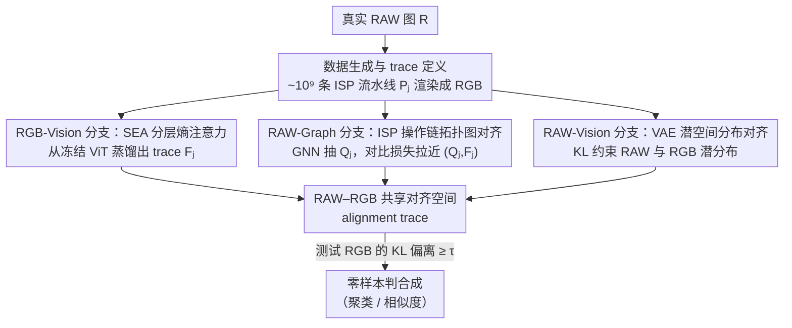

# Zero-shot Detection of AI-Generated Image via RAW-RGB Alignment

**会议**: CVPR 2026  
**论文**: [CVF Open Access](https://openaccess.thecvf.com/content/CVPR2026/html/Wu_Zero-shot_Detection_of_AI-Generated_Image_via_RAW-RGB_Alignment_CVPR_2026_paper.html)  
**关键词**: AI生成图像检测, 图像取证, 零样本, RAW信号, ISP流水线

## 一句话总结
作者重新定义「合成图像」为没有物理世界来源、直接在数字空间生成的图像，并提出只用真实 RAW–RGB 数据对自监督学习一种叫 alignment trace 的取证特征——它刻画「这张 RGB 能不能反推出一个合法 RAW 来源」，从而在不接触任何生成模型先验的情况下达到零样本 SOTA（聚类 NMI 0.964、相似度 AUC 0.925）。

## 研究背景与动机
**领域现状**：面对层出不穷的 GAN / 扩散模型，零样本/少样本伪造检测成为主流方向——不依赖某个具体生成器的指纹，而是去建模「真实图像应该长什么样」（统计微结构、颜色分布、无损编码可压缩性等），凡偏离这个流形的就判为合成。

**现有痛点**：作者发现一个尴尬现象（Observation I）——现有检测器会把经过**物理重映射**（如「打印+扫描」「屏摄」）的合成图像误判为真实。根因不是模型不够强，而是**「合成」这个概念从来没被严格定义**：一张 AI 生成的图被打印出来再扫描进电脑，它还算「合成」吗？

**核心矛盾**：以往所有方法的判据都停留在**数字空间的痕迹**（频谱、噪声残差、压缩痕迹），而这些痕迹一旦经过真实的光学采集就被洗掉了，所以物理重映射能轻易绕过检测。真伪的本质区别没有被抓住。

**本文目标**：先给出一个清晰定义——**合成图像 = 在物理世界中没有前身、直接在数字空间被创造出来的图像**；按此定义，被物理重映射过的合成图会「转正」成真实图（这也解释了为何它能逃检）。然后据此设计一个判据：检测真伪 = 判断图像**有没有一个符合物理规律的物理世界来源**。

**切入角度**：作者分析物理→数字的成像链路——真实场景的光强被相机传感器记录成 RAW 信号，再经相机内部 ISP（Image Signal Processor）转换成 RGB；而合成图是直接在数字空间生成的 RGB，**底下根本没有 RAW / 光信号来源**。作者用 RGB→RAW 重建做了验证（Observation II）：真实图像用 RAW 类方法重建时误差**明显更大**、且统计上可分，说明 RAW 信号确实是「物理来源」的强线索。

**核心 idea**：与其找合成图的指纹，不如验证真实图的「RAW 血统」——只用真实 RAW–RGB 数据对自监督地学一个**RAW–RGB 共享对齐空间**，让取证特征（alignment trace）刻画一张 RGB 是否兼容某个合法的 RAW→RGB 流水线；不兼容（KL 偏离）即判为合成。整个过程**不需要任何生成模型 / 合成图先验**。

## 方法详解

### 整体框架
方法的训练目标是：只喂真实 RAW 图，学出一个特征提取器 $f$，使它从任意 RGB 上抽出的 alignment trace $F_j$ **只取决于把 RAW 转成 RGB 用的那条 ISP 流水线 $P_j$，而与图像内容 $R_i$ 无关**。这样在测试时，一张真实 RGB 总能对上某条已学过的流水线（trace 落在流形内），而合成 RGB 没有 RAW 来源、对不上任何合法流水线（trace 偏离流形，KL 散度 $\ge\tau$）。

整条管线分四块串起来：先用 ~$10^9$ 条 ISP 流水线把真实 RAW 渲染成海量 RGB，定义出待学的 trace（Sec 3.1）；再从**三个互补视角**联合监督这个对齐空间——RGB 像素视角（RGB-Vision，SEA 注意力蒸馏，Sec 3.2）、RAW 拓扑视角（RAW-Graph，把 ISP 操作链编码成图，Sec 3.3）、RAW 像素视角（RAW-Vision，VAE 潜空间分布对齐，Sec 3.4）。三个视角的损失共同约束 trace，使它既懂 RAW→RGB 的结构逻辑、又懂 RAW 的统计特性。

### 关键设计

**1. 海量 ISP 流水线自监督 + alignment trace 定义：把「有没有 RAW 来源」变成可学的偏离度**

痛点是以往判据停留在数字空间、且要靠合成图先验。作者反其道而行：只拿真实 RAW 数据集 $R=\{R_i\}$，配一个包含 ~$10^9$ 条 RAW→RGB 流水线的集合 $P=\{P_j\}$，把每条流水线作用到每张 RAW 上得到 RGB 图 $I_{i,j}=P_j(R_i)$。每条 $P_j$ 串起真实 ISP 的核心操作（去马赛克、白平衡、色彩校正、色调映射）外加后处理（压缩、缩放、模糊、加噪），且约束「必含去马赛克、白平衡/色调映射各至多一次、后处理至多 3 步」，从而组合出约 $10^9$ 条互不相同的流水线——这就是无需任何生成器、纯靠真实数据的自监督训练语料。

在此之上定义可学特征提取器 $f:\mathcal I\to\mathbb R^d$，并要求抽出的 $F_j=f(I_{i,j})$ 满足两条性质：**内容不变性** $f(P_j(R_i))=f(P_j(R_b))$（同一流水线、不同内容应给同一 trace）与**可区分性** $f(P_j(R_i))\ne f(P_k(R_i))$（不同流水线应给不同 trace）。这样 trace 就只编码「流水线身份」而非图像语义。测试时一张查询图 $I_q$ 的判据是特征偏离（Def 3.1）：

$$\min_{I\in\mathcal I} D_{\mathrm{KL}}\big(f(I_q)\,\|\,f(I)\big)\ge\tau$$

即 $I_q$ 的 trace 到所有已学流水线 trace 的最小 KL 散度超过阈值 $\tau$，说明它由一个未知/非标准的 RAW→RGB 过程产生——而合成图根本没有 RAW 来源，自然落在流形之外。

**2. RGB-Vision 分支：SEA 分层熵注意力，从冻结大视觉模型里「过滤掉语义、留下物理痕迹」**

直接从头训 $f$ 容易过拟合、丢掉视觉先验。作者改为从一个**冻结**的大视觉模型 $f_{\text{LVM}}$（实验中 ViT 最佳）抽中间层 token 特征 $H=(h_1,\dots,h_K)$，再用 Stratified Entropy Attention（SEA）把它蒸馏成 trace：$F_j=f_{\text{SEA}}(F^0_j, H)$。SEA 的目的很明确——**滤掉与内容语义相关的信息，聚焦与物理-数字转换相关的信号**（区域平滑度、亮度）。它分三步：

- **熵分箱**：对每个 token 对应的图像 patch $\pi_k$ 算「物理熵」$E_k=\tfrac12(\mathrm{Grad}(\pi_k)+\mathrm{LC}(\pi_k))$，其中 $\mathrm{Grad}$ 用 Sobel 梯度的标准差刻画局部平滑度异常、$\mathrm{LC}$ 用 YCrCb/HSV 的亮度-色度联合熵刻画被破坏的亮-色相关性；按 $E_k$ 把 $K$ 个 token 均匀分到 $B$ 个熵区间。
- **分层采样**：每个熵箱里均匀取 $M$ 个 token，保证各熵层级都有均衡覆盖、不让某一档物理一致性主导。
- **注意力融合**：以锚特征 $F^0_j$ 为 query 对采样 token 做注意力，权重里乘上 $(1-E_{\hat h})$ 放大不同熵 token 的贡献：

$$w_{b,m}=\frac{\exp\!\big((1-E_{\hat h_{b,m}})\,F^0_j\hat h_{b,m}^\top/\sqrt d\big)}{\sum_{b',m'}\exp\!\big((1-E_{\hat h_{b',m'}})\,F^0_j\hat h_{b',m'}^\top/\sqrt d\big)}$$

最终 $F_j=\sum_{b,m}w_{b,m}\cdot\mathrm{Attn}(F^0_j,\hat h_{b,m},\hat h_{b,m})$。相比标准交叉注意力，熵加权能更好地抓住 ISP 过程残留在 RGB 里的相机内参痕迹（消融里 SEA 比普通 cross-attn NMI 高 3.5%）。

**3. RAW-Graph 分支：把 ISP 操作链编码成拓扑图，用对比损失对齐 trace**

光有 RGB 视角还不够，作者想把「RAW→RGB 用了哪条流水线」这件结构性知识也注入对齐空间。与其用 RAW 像素硬对齐，不如复用数据生成阶段的操作链 $P_j$——但用文本描述操作链难以表达参数间的层级依赖（如白平衡必须在色调映射之前）。于是把 $P_j$ 编码成**有向拓扑图** $Q_j=\{V,E,\omega\}$：节点集 $V$ 按操作类型分组（去马赛克 / 白平衡 / 色调映射 / 后处理），节点数 = 该操作的不同算法数（如 $|V_{DM}|=4$ 表示 4 种去马赛克算法），用 one-hot 初始化；有向边 $E$ 强制成像顺序（必从去马赛克出发→白平衡/色调映射各至多一个→后处理至多 3 个）；边权 $\omega(e)$ 是归一化后的连续参数 $[\hat\theta_u;\hat\theta_v]$。

GNN（GraphConv 消息传递 + 全局池化）把图映射成与 $F_j$ 同维的图级特征 $Q_j$。再用 CLIP 式对称对比损失把成对的 $(Q_j,F_j)$ 在共享空间里拉近：

$$L_{\text{cx}}(Q,F)=-\frac1{|A|}\sum_{j\in A}\log\frac{\exp(Q_j\!\cdot\!F_j/\tau)}{\sum_{l\in A}\exp(Q_j\!\cdot\!F_l/\tau)},\quad L_{\text{RAW-Graph}}=\tfrac12\big(L_{\text{cx}}(Q,F)+L_{\text{cx}}(F,Q)\big)$$

消融显示「有向 + 带权」拓扑图（D+W）比无向图、比文本描述都好，且对比损失里 InfoNCE 优于 Triplet / Circle。

**4. RAW-Vision 分支：VAE 潜空间分布对齐，避开像素级监督的缺陷**

拓扑图是抽象的高层概念、可对应多张实例化 RGB，所以还需要从 RAW 的**视觉/像素**视角再约束一次。但传统 L1/L2 像素监督只看逐像素误差、抓不住高阶特征分布、对噪声和微小位移过敏。作者改为在**潜空间做分布迁移**：用预训练 VAE 编码器把 RAW 图 $R_i$ 和它的 RGB 版 $I_{i,j}$ 分别映射成高斯潜分布 $\mathcal N(\mu_s,\sigma_s)$、$\mathcal N(\mu_t,\sigma_t)$；再用 trace $F_j$ 通过交叉注意力调制 RAW 的均值 $\hat\mu_s=\mathrm{Attn}(\mu_s,F_j,F_j)$（因为不同光谱信号对分布参数的相关性不同，简单点乘/相加抓不住），最后用 KL 散度把调制后的 RAW 潜分布拉向 RGB 潜分布：

$$L_{\text{RAW-Vision}}=\mathbb E\big[D_{\mathrm{KL}}(\mathcal N(\hat\mu_s,\sigma_s)\,\|\,\mathcal N(\mu_t,\sigma_t))\big]$$

### 损失函数 / 训练策略
总损失把拓扑与视觉两个 RAW 视角的对齐合并：$L_{\text{total}}=\lambda_1 L_{\text{RAW-Graph}}+\lambda_2 L_{\text{RAW-Vision}}$。训练只用 FiveK 数据集的 5000 张真实 RAW（Canon/NIKON 拍的 DNG，用 PyRAW/DCRAW 渲染成 RGB），**全程不引入任何合成图或生成算法**。使用阶段：零样本时直接对 trace 做聚类 / 相似度比较；少样本时仅用 ProGAN 合成数据微调这个已对齐好的特征空间。

## 实验关键数据

### 主实验
零样本聚类（micro，NMI 越高越好）与相似度（macro，AUC，0.5=随机）两个视角，以及少样本跨域检测（ForenSynths，AP）：

| 场景 | 指标 | 本文 | 第二名 | 提升 |
|------|------|------|--------|------|
| 零样本·聚类（10 类 GAN/DM 平均） | NMI | **0.964** | MIB 0.742 | +22.2% |
| 零样本·相似度（10 类平均） | AUC | **0.925** | MIB 0.734 | 远超 |
| 少样本·跨域（ForenSynths 10 类平均，仅 ProGAN 训练） | AP | **0.987** | Effort 0.953 | +3.4% |

零样本聚类里，未为检测设计的 RAW 重建基线（R2LCM/ReRAW）只在 GAN-Star 上勉强可用、对扩散模型几乎失效（NMI 掉到 0.03–0.06）；ZED/FSD 在单类 GAN 上能到 0.96–0.99，但因为不考虑物理空间差异，跨多类后平均只有 0.544/0.596。本文凭对齐空间把平均 NMI 拉到 0.964，T-SNE 可视化里 DM-Dalle 的 KL 值达 29.4，远超对手的 6.8 / 1.2 / 0.3。

### 消融实验
三个分支各自的最优配置（末行为最终模型；Cluster/Similarity/Detection 分别用 NMI/AUC/AP）：

| 分支 | 关键变量 | Cluster | Similarity | Detection | 说明 |
|------|---------|---------|-----------|-----------|------|
| RGB-Vision | ViT，可训，无 SEA (#5) | .867 | .830 | .909 | 全参可训会洗掉视觉先验 |
| RGB-Vision | ViT，冻结，无 attn (#6) | .908 | .882 | .963 | 冻结后涨 4.1% NMI |
| RGB-Vision | ViT，冻结，标准 cross-attn (#7) | .929 | .892 | .969 | |
| **RGB-Vision** | **ViT，冻结，SEA (#8)** | **.964** | **.925** | **.987** | SEA 比 cross-attn +3.5% NMI |
| RAW-Graph | 拓扑图无向 (#4) | .909 | .882 | .917 | 无向→构图不准 |
| RAW-Graph | 有向带权 D+W + Triplet (#6) | .892 | .853 | .924 | Triplet 弱于 InfoNCE |
| **RAW-Graph** | **D+W + InfoNCE (#8)** | **.964** | **.925** | **.987** | 有向带权 + InfoNCE 最佳 |
| RAW-Vision | 去掉该分支 (#1) | .828 | .817 | .896 | 缺视觉约束明显掉点 |
| RAW-Vision | UNet+L2 (#2) | .912 | .853 | .908 | 像素级监督受限 |
| **RAW-Vision** | **VAE+KL+Attn (#6)** | **.964** | **.925** | **.987** | SSIM 比 UNet+L2 高 14.5% |

### 关键发现
- **冻结大视觉模型是关键**：让 ViT 全参可训反而掉点（#5→#6 NMI +4.1%、AUC +5.2%），因为可训练会破坏大规模数据学到的通用先验；取证特征要「借」LVM 的视觉先验而不是改写它。
- **三视角缺一不可，但 RAW-Vision 最像「兜底」**：去掉 RAW-Vision 分支（#1）三项指标全面下滑（聚类 0.964→0.828），因为拓扑图是抽象高层概念、能映射到多张实例 RGB，必须再用像素/视觉视角的双重约束把它锚定。
- **流水线覆盖面决定泛化**：RAW-Graph 消融显示只有 ISP+后处理都覆盖时（All）才能充分模拟多样的 RAW→RGB 变换，trace 泛化才好。
- **物理重映射不再误判**：本文按「物理来源」定义重新框定问题，从根上解释并解决了打印+扫描类合成图逃检的现象。

## 亮点与洞察
- **重新定义问题本身**：与其卷检测器精度，作者先把「什么是合成图」讲清楚——物理世界有没有前身。这个定义层面的贡献比模型本身更有价值，给整个取证社区提了个新基准。
- **「验证真、而非识别假」的范式**：只用真实 RAW–RGB 对自监督，完全不碰生成器先验，天然抗未知 GenAI——这正是零样本最该有的样子，可迁移到任何「开放世界异常检测」。
- **把工程流程当监督信号**：把 ISP 操作链编码成带顺序约束、带参数权重的拓扑图，是个很妙的「领域知识图结构化」trick，比文本描述更能表达参数依赖，值得借鉴到其它有明确物理/工程流程的任务。
- **熵加权注意力（SEA）**：用梯度熵 + 亮色联合熵衡量「物理一致性」并据此分层采样、加权，是一种把语义信息主动过滤掉、只留物理痕迹的思路，对其它需要「去内容化」的特征提取有启发。

## 局限与展望
- **依赖 RGB→RAW 可重建假设**：判据建立在「真实图能反推合法 RAW、合成图不能」之上；若未来生成模型显式建模 RAW 成像链路（先生成 RAW 再过 ISP），这条护城河可能被攻破。
- **训练数据来源单一**：仅用 FiveK 的 5000 张 Canon/NIKON RAW，相机型号/传感器多样性有限，对手机多摄、计算摄影（HDR 融合、夜景堆栈）等复杂 ISP 的泛化未充分验证。
- **物理重映射的「转正」是双刃剑**：按定义被打印+扫描的合成图会被判为真——这在「检测 AI 生成」语境下其实是漏检，论文把它当作定义的自洽结果，但实际取证（如假新闻配图被翻拍）场景下仍可能被恶意利用。
- **少样本仍需先验**：跨域最优结果（AP 0.987）依赖 ProGAN 微调，纯零样本相似度 AUC 0.925 虽强但离实用阈值仍有距离。

## 相关工作与启发
- **vs 重建误差类（ZeroFake / Sha et al.）**：他们也用「真实图重建误差大」做判据，但停留在 RGB 自编码器的数字空间重建；本文把重建升级到 **RGB→RAW** 这一物理链路，并进一步学成对齐空间，跨扩散模型泛化明显更好（平均 NMI 0.964 vs ZeroFake 0.333）。
- **vs 真实图隐式建模类（FSD 统计微结构 / ZED 无损编码 / 颜色分布）**：它们建模「真实图的数字统计规律」，对未定义清「合成」、对物理重映射无能为力；本文从物理来源切入，定义更严、判据更本质。
- **vs 有监督 SOTA（Effort / NPR / CNNSpot）**：这些需要大量合成图训练且依赖生成器指纹，跨域到差异大的 GenAI（如 SAN）就掉到 0.70–0.82 AP；本文零先验训练 + 仅 ProGAN 微调即达 0.987 AP，泛化更强。

## 评分
- 新颖性: ⭐⭐⭐⭐⭐ 重新定义「合成图像」并用 RAW 物理来源作判据，是范式级而非增量式创新。
- 实验充分度: ⭐⭐⭐⭐ 零样本/少样本双场景、三套指标、三分支消融都到位，但训练数据相机多样性偏窄。
- 写作质量: ⭐⭐⭐⭐ 从两个 Observation 推导动机的逻辑链清晰，三分支结构讲得明白；公式密集但成体系。
- 价值: ⭐⭐⭐⭐⭐ 给零样本伪造检测提供新基准与新思路，对整个图像取证社区有方向性意义。

<!-- RELATED:START -->

## 相关论文

- [\[CVPR 2026\] Scaling Up AI-Generated Image Detection with Generator-Aware Prototypes](scaling_up_ai-generated_image_detection_with_generator-aware_prototypes.md)
- [\[CVPR 2026\] Skyra: AI-Generated Video Detection via Grounded Artifact Reasoning](skyra_ai-generated_video_detection_via_grounded_artifact_reasoning.md)
- [\[CVPR 2026\] Detecting Compressed AI-Generated Images via Phase Spectrum Robustness](detecting_compressed_ai-generated_images_via_phase_spectrum_robustness.md)
- [\[CVPR 2026\] Cross-modal Representation Learning for Diffusion-generated Image Detection](cross-modal_representation_learning_for_diffusion-generated_image_detection.md)
- [\[CVPR 2026\] Hierarchically Robust Zero-shot Vision-language Models](hierarchically_robust_zero-shot_vision-language_models.md)

<!-- RELATED:END -->
