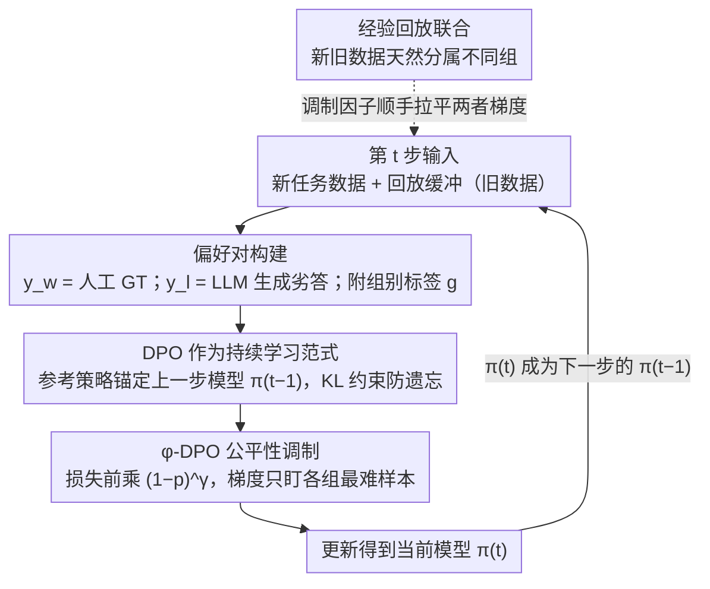

# $\varphi$-DPO: Fairness Direct Preference Optimization Approach to Continual Learning in Large Multimodal Models

**会议**: CVPR2026  
**arXiv**: [2602.22601](https://arxiv.org/abs/2602.22601)  
**代码**: 待确认  
**领域**:AI安全
**关键词**: 持续学习, DPO, 公平性, 灾难性遗忘, large multimodal model, focal loss

## 一句话总结
提出 $\varphi$-DPO，将 DPO 作为持续学习范式（以前一步模型为参考策略），并引入受 focal loss 启发的公平性调制因子 $(1-p)^\gamma$ 来平衡不同数据组间的梯度贡献，在理论上证明 $\gamma \to \infty$ 时梯度偏差趋于零，在 CoIN 和 MLLM-CL 基准上达到 SOTA。

## 背景与动机
大型多模态模型（LMM）在实际部署中需要不断学习新任务，持续学习（Continual Learning, CL）是实现这一目标的关键能力。然而，LMM 的持续学习面临双重挑战：

### 挑战一：灾难性遗忘
这是持续学习的经典问题——学习新任务时旧任务性能退化。现有缓解方法包括：
- **经验回放（Experience Replay）**：存储旧任务数据用于复习，但存储开销大，且可能违反隐私约束
- **正则化方法（EWC, LwF 等）**：通过参数约束限制旧知识的覆写，但约束过强会限制新任务学习
- **知识蒸馏**：用旧模型的输出作为软标签指导新模型，但需要额外的前向传播开销

### 挑战二：公平性问题
这是本文新发现的一个被忽视的问题——**持续学习中的数据不平衡导致的公平性退化**：

1. **不同数据组大小差异大**：持续学习的不同阶段数据量差异悬殊（如第一阶段 10 万样本，第二阶段仅 1 万样本），经验回放时旧数据远多于新数据
2. **梯度被支配**：数据量大的组贡献更多梯度，数据量小的组被"淹没"，导致模型在小组上表现差
3. **群体公平性**：对于不同的用户群体或数据来源，模型性能的差异构成潜在的公平性风险

传统 CL 方法几乎不考虑公平性，而公平性方法（如 DRO、FairBatch）不考虑遗忘。$\varphi$-DPO 的动机正是**同时解决这两个问题**。

### 核心洞察：DPO 天然适合持续学习
标准 DPO 的损失函数依赖一个**参考策略** $\pi_{\text{ref}}$，其作用是防止优化后的策略偏离参考太远。作者发现，如果将 $\pi_{\text{ref}}$ 设定为**上一持续学习步骤的模型** $\pi_{t-1}$，那么 DPO 本身就隐式地实现了知识蒸馏效果——KL 散度约束自然地限制了新模型与旧模型的偏差，从而缓解遗忘。

## 核心问题
如何将DPO 改造为同时解决持续学习中灾难性遗忘和公平性退化的统一框架？

## 方法详解

### 整体框架

这篇论文想让大型多模态模型在一个接一个的任务上持续学习，既不遗忘旧任务，又不因为各阶段数据量悬殊而对小数据组失去公平。它的做法是把整个持续学习过程套进 DPO 的形式：在第 $t$ 步，不再用普通的监督微调去拟合新任务，而是用 DPO 损失把模型从 $\pi_{t-1}$ 更新到 $\pi_t$，并刻意把 DPO 的参考策略设成上一步的模型 $\pi_{t-1}$——这一步让"别忘旧知识"变成 DPO 自带的约束。然后在 DPO 损失前乘上一个借自 focal loss 的调制因子，把梯度从"已经学好的样本"挪向"各组里最难的样本"，从而抹平组间不平衡带来的公平性退化。两件事叠在一起，一个损失函数同时管住遗忘和公平。

### 关键设计

**1. DPO 作为持续学习范式：用上一步模型当参考策略，把"别偏离旧模型"变成 DPO 自带的 KL 惩罚**

持续学习最怕学新忘旧，传统做法要么存旧数据回放、要么额外跑一遍旧模型做知识蒸馏，都有存储或算力开销。本文换了个角度：DPO 损失本来就靠一个参考策略 $\pi_{\text{ref}}$ 来防止新策略跑太远，那干脆把 $\pi_{\text{ref}}$ 设成上一持续学习步的模型 $\pi_{t-1}$。第 $t$ 步的损失写成

$$\mathcal{L}_{\text{DPO}}(\pi_\theta; \pi_{t-1}) = -\mathbb{E}_{(x, y_w, y_l)} \left[\log \sigma\left(\beta \log\frac{\pi_\theta(y_w|x)}{\pi_{t-1}(y_w|x)} - \beta \log\frac{\pi_\theta(y_l|x)}{\pi_{t-1}(y_l|x)}\right)\right]$$

其中 $y_w$ 是 preferred 回答、$y_l$ 是 rejected 回答、$\beta$ 是温度。由于分母锚定在 $\pi_{t-1}$，新策略一旦在任何回答上偏离旧策略，损失就会上升，等于自带了一道防遗忘的闸门。作者还把这个直觉做成了理论：Lemma 1-2 证明该损失被新旧模型的 KL 散度上下夹住，

$$c_1 \cdot D_{\text{KL}}(\pi_{t-1} \| \pi_\theta) \leq \mathcal{L}_{\text{DPO}}(\pi_\theta; \pi_{t-1}) \leq c_2 \cdot D_{\text{KL}}(\pi_{t-1} \| \pi_\theta) + C$$

$c_1, c_2, C$ 是与 $\beta$ 有关的常数。也就是说，最小化 DPO 损失等价于隐式最小化 $D_{\text{KL}}(\pi_{t-1}\|\pi_\theta)$——这正是知识蒸馏在做的事，只不过现在不需要额外的蒸馏前向，遗忘约束直接长在了 DPO 里。

**2. $\varphi$-DPO 公平性调制：借 focal loss 的思路，让梯度只盯各组最难的样本，自动抹平组间不平衡**

光用 DPO 防住了遗忘，却没解决数据不平衡——回放时旧组样本远多于新组，大组的梯度会淹没小组，模型在小组上越学越差。作者把目标检测里专治类别不平衡的 focal loss 思想搬过来，在 DPO 损失前乘一个调制因子 $(1-p_{w,l})^\gamma$：

$$\mathcal{L}_{\varphi\text{-DPO}} = -\mathbb{E}_{(x, y_w, y_l)} \left[(1-p_{w,l})^\gamma \cdot \log \sigma\left(\beta \log\frac{\pi_\theta(y_w|x)}{\pi_{t-1}(y_w|x)} - \beta \log\frac{\pi_\theta(y_l|x)}{\pi_{t-1}(y_l|x)}\right)\right]$$

这里 $p_{w,l} = \sigma\!\left(\beta \log\frac{\pi_\theta(y_w|x)}{\pi_{t-1}(y_w|x)} - \beta \log\frac{\pi_\theta(y_l|x)}{\pi_{t-1}(y_l|x)}\right)$ 是模型对这个偏好对的"置信度"。机制很直白：当模型对某个偏好对已经很自信（$p_{w,l}\to 1$），$(1-p_{w,l})^\gamma\to 0$，这条样本的梯度被压下去，不再浪费算力；当模型还没学会（$p_{w,l}\to 0$），因子接近 1，梯度照常保留——于是优化精力被强制集中到"困难样本"上，$\gamma$ 越大重分配越激进。关键在于这么做为什么能带来公平：把各组的梯度偏差定义为

$$B_\gamma(\theta) = \max_{g_1, g_2} \left|\frac{\nabla_\theta \mathcal{L}_{\varphi}^{g_1}}{\nabla_\theta \mathcal{L}_{\varphi}^{g_2}}\right|$$

Lemma 3 证明 $\gamma \to \infty$ 时 $B_\gamma(\theta) \to 0$，即不管各组数据多不平衡，足够大的 $\gamma$ 都能让组间梯度贡献趋于相等。直觉是：大 $\gamma$ 让模型只看"每组里最难的那批样本"，而各组最难样本的规模是相近的，于是大组天然的数量优势被抹平，公平性从理论上得到保证而非靠调参碰运气。

**3. 偏好对构建：为两个 CL 基准造 preferred/rejected 对，并打上组别标签**

DPO 需要成对的偏好数据，但 CoIN、MLLM-CL 这类持续学习基准原本只有标准问答，所以作者得自己造对。preferred 回答 $y_w$ 直接用人工标注的 ground truth；rejected 回答 $y_l$ 则让 LLM（如 GPT-4）在 ground truth 基础上生成"合理但错误"的版本（事实错误、细节偏差之类），再经人工验证确认它确实劣于 preferred。每个 $(x, y_w, y_l)$ 三元组还附带一个组别标签 $g$，这个标签正是设计 2 里公平性调制和指标计算的依据。

> ⚠️ rejected 回答用 GPT-4 生成这一细节以原文为准。

**4. 与经验回放联合：回放的新旧数据天然分属不同组，调制因子顺手平衡两者梯度**

$\varphi$-DPO 不排斥经典的回放策略，反而和它咬合得很自然：回放缓冲区里的旧数据和当前新数据本就分属不同的组，公平性调制因子会把这两组的梯度贡献自动拉平，于是"旧数据多、新数据少"导致的偏置在回放场景下也被同一套机制顺手解决，不需要再额外加权。

## 实验关键数据

### CoIN Benchmark（分 8 个任务阶段）

| 方法 | Final Avg Acc ↑ | Forgetting ↓ | Fairness (Worst-group Gap) ↓ |
|------|----------------|--------------|------------------------------|
| Sequential FT | 34.2 | 42.1 | 18.3 |
| EWC | 48.7 | 28.5 | 14.2 |
| LwF | 51.3 | 25.2 | 13.8 |
| Experience Replay | 55.8 | 20.1 | 11.5 |
| DPO (as CL) | 58.2 | 16.4 | 9.7 |
| **$\varphi$-DPO** | **63.1** | **12.3** | **4.2** |

### MLLM-CL Benchmark

| 方法 | Domain Avg ↑ | Ability Avg ↑ | Backward Transfer ↑ | Worst-group Acc ↑ |
|------|-------------|--------------|---------------------|-------------------|
| Sequential FT | 41.5 | 38.2 | -15.3 | 22.1 |
| LwF | 52.1 | 49.8 | -8.7 | 35.4 |
| Experience Replay | 56.3 | 53.1 | -5.2 | 40.8 |
| DPO (as CL) | 59.7 | 56.8 | -3.1 | 45.2 |
| **$\varphi$-DPO** | **65.2** | **62.4** | **-1.4** | **55.6** |

### 消融实验
- **$\gamma$ 的影响**：$\gamma=0$（退化为标准 DPO）→ $\gamma=1$ → $\gamma=2$ → $\gamma=5$，公平性指标单调改善；$\gamma \geq 5$ 后趋于饱和
- **DPO vs SFT 作为 CL 范式**：DPO 的 forgetting 比 SFT + KD 低 4.1%，验证了 DPO 的隐式蒸馏效应
- **参考策略选择**：$\pi_{t-1}$ vs $\pi_0$（初始模型）：使用 $\pi_{t-1}$ 效果更好（forgetting 低 5.2%），因为它更好地保留了最近学到的知识
- **$\beta$ 敏感性**：$\beta \in [0.05, 0.2]$ 范围内表现稳定，$\beta = 0.1$ 最优

## 亮点
- **持续学习的新视角**：首次将 DPO 作为持续学习范式，证明 DPO 天然具有知识蒸馏效应，理论推导优雅
- **双重问题的统一解决**：一个框架同时处理遗忘和公平性，而非分别用两个方法拼凑
- **公平性的理论保证**：Lemma 3 提供了 $\gamma \to \infty$ 时梯度偏差趋于零的严格证明，而非仅凭经验
- **focal loss 思想的巧妙迁移**：将原本用于目标检测中类别不平衡的 focal loss 思想迁移到持续学习的组间不平衡问题，跨领域迁移自然合理
- **轻量级改动**：相比标准 DPO 仅增加了一个调制因子 $(1-p)^\gamma$，实现几乎零额外成本

## 局限与展望
1. **$\gamma$ 的自适应选择**：目前 $\gamma$ 是手动设定的超参数，理想情况下应根据各组的不平衡程度自适应调整
2. **偏好对的质量依赖**：rejected 回答由 LLM 生成 + 人工验证，可扩展性受限于标注成本
3. **长序列 CL 的验证不足**：目前最多测试 8 个阶段的持续学习，更长序列（如 50+ 阶段）下 $\pi_{t-1}$ 参考策略的累积偏差未被研究
4. **单一 $\gamma$ 适用所有组**：所有组共享同一个 $\gamma$，而实际中不同组可能需要不同程度的调制
5. **与参数高效微调的结合**：当前使用全量微调，与 LoRA 等 PEFT 方法结合时，DPO 的隐式蒸馏效果是否依然成立有待验证

## 评分
- 新颖性: ⭐⭐⭐⭐⭐ DPO 作为 CL 范式 + focal 公平性调制，双重创新点均有理论支撑
- 实验充分度: ⭐⭐⭐⭐ 两个 CL 基准 + 消融完整，但持续学习步数有限
- 写作质量: ⭐⭐⭐⭐ 理论推导清晰，motivation 阐述充分
- 价值: ⭐⭐⭐⭐⭐ 开辟"DPO for CL"新方向，公平性视角独到

<!-- RELATED:START -->

## 相关论文

- [\[CVPR 2026\] FVBench: Benchmarking Deepfake Video Detection Capability of Large Multimodal Models](fvbench_benchmarking_deepfake_video_detection_capability_of_large_multimodal_mod.md)
- [\[CVPR 2026\] DSO: Direct Steering Optimization for Bias Mitigation](dso_direct_steering_optimization_for_bias_mitigation.md)
- [\[CVPR 2026\] FedAFD: Multimodal Federated Learning via Adversarial Fusion and Distillation](fedafd_multimodal_federated_learning_via_adversarial_fusion_and_distillation.md)
- [\[CVPR 2026\] SIF: Semantically In-Distribution Fingerprints for Large Vision-Language Models](sif_semantically_in-distribution_fingerprints_for_large_vision-language_models.md)
- [\[CVPR 2026\] Robustness Under Data Scarcity: Few-Shot Continual Adversarial Training for Evolving Threats](robustness_under_data_scarcity_few-shot_continual_adversarial_training_for_evolv.md)

<!-- RELATED:END -->
